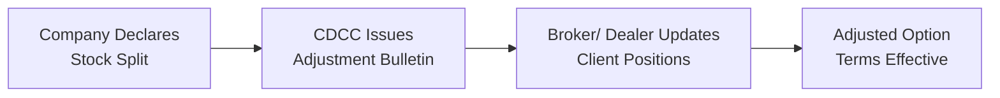

## 31.1 Adjustments for Stock Splits

If you’ve ever woken up to find that the stock you own seems to have doubled in the number of shares—yet your total investment value hasn’t really changed—then you’ve probably experienced a stock split. But, if you trade equity options on that stock, your first thought might be, “Um, okay… so now what happens to my option contracts?” This section aims to walk you through the essentials of how stock splits affect your options, especially in Canadian markets under the regulatory oversight of the Canadian Investment Regulatory Organization (CIRO). We’ll talk about everything from the difference between a 2-for-1 and 3-for-1 split to the updated strike prices and contract sizes you might expect. Let’s dive right in.

### What Is a Stock Split?

A stock split is a corporate action wherein a company divides its existing shares into multiple shares—often in ratios like 2-for-1, 3-for-2, or 3-for-1. After the operation, each shareholder holds a greater number of shares, but the aggregate market value of those shares remains essentially the same (barring any short-term market perception changes). For example, in a 2-for-1 split, every single share is turned into two shares, and each share’s price gets reduced by about half.

Companies split shares for various reasons. Some do it to lower their share price to a “friendlier” range for retail investors. Others do it to signal positive growth or to increase overall liquidity by broadening their share ownership. Regardless of the motivation, the mechanics behind a split remain fairly standard: the total number of shares outstanding jumps, and the share price adjusts proportionately downward.

### The Effect on Options

For those of us trading listed options, a stock split raises a few key questions:

– Will the strike price be cut in half?  
– Will an option that once controlled 100 shares now control 200 shares?  
– Will the ticker symbol for the option itself be altered?  

The short answer to all these is “Yes, in some way,” though specific details depend on the stock split ratio and the type of contract adjustment decided by the clearing corporation (e.g., the Canadian Derivatives Clearing Corporation (CDCC) in Canada). The goal is always to keep the overall notional value of your option contract the same as it was before the split so no one is unfairly advantaged or disadvantaged.

### Coordinating the Adjustments

Stock splits—and other corporate actions, such as reverse splits—can cause confusion if not properly communicated. Thankfully, clearing corporations like CDCC work to ensure that option contracts remain economically equivalent pre- and post-split. Historically, IIROC would have overseen aspects of equity trading rules, but in today’s environment, CIRO is the consolidated self-regulatory organization in Canada, guiding how broker-dealers handle these transitions and ensuring consistent standards across the industry.

CDCC typically issues bulletins describing the adjustments to each listing that’s affected by a corporate action. These bulletins will tell you:

• The new contract multiplier (i.e., how many shares underlie each contract after the split).  
• The revised strike prices.  
• Whether any new option symbols will be used.  
• The effective date for trading the adjusted contracts.

It’s essential to consult these bulletins or ask your broker for details when you see that a split is on the horizon.  

### Practical Example: 2-for-1 Split

Let’s walk through a simple example, which may also help you see how the math lines up.

• Suppose you own one call option contract on XYZ stock with a strike price of CA$50.  
• Each contract covers 100 shares, making your notional value:  
  100 shares × CA$50 = CA$5,000  

Now, the company declares a 2-for-1 split. On the ex-split date, the stock price is halved. So, if XYZ had been trading near CA$52 before (just for example), it might open around CA$26 afterwards (assuming no immediate market reaction beyond the split mechanics).

What happens to your option?

• Your one contract that used to cover 100 shares now typically covers 200 shares.  
• The strike price is adjusted to CA$25.  

Check the math:  
200 shares × CA$25 = CA$5,000  

So, the notional value remains CA$5,000. That’s the primary objective of these adjustments: to keep the contract buyer and seller in about the same place economically that they were prior to the split.

### More Complex Splits and Odd Ratios

Most of us are used to straightforward splits like 2-for-1 or 3-for-1, but you could also encounter 3-for-2, 5-for-4, or other “uneven” splits. In these cases, the same principles hold, though the math can be a bit more, well, awkward. You might end up with a contract size of 150 shares or 125 shares after the adjustment. In some instances, these are referred to as “adjusted series,” and they’ll trade under a different specifying ticker to reflect that they aren’t a “standard” 100-share contract.

There’s also the possibility of a reverse stock split. A reverse split occurs when a company consolidates shares, for example, a 1-for-5 split, so that five shares become one share. In that scenario, the share price typically multiplies by five (again, ignoring immediate market sentiment changes), and your option contract size may shrink if the standard multiple is adjusted.

### Effective Dates and Ex-Split Dates

If you’ve ever heard the term “ex-split date,” that’s essentially the first day the shares trade at the new price. On that date, the option contracts you hold also switch to their new terms. You’ll notice that your brokerage statements or trading platform typically lumps these changes in overnight with your positions updated by next morning or so.

Sometimes, I remember being new to the derivatives game and freaking out a bit when I saw my contract multiplier read “200” instead of “100.” I thought something had gone seriously wrong with my option chain data. Then the broker clarified the 2-for-1 split adjustment. Phew, crisis averted.

### Key Stakeholders

Who decides how the options are adjusted? In Canada, it’s primarily the job of the clearing agency—CDCC. They coordinate with the exchange, such as the Bourse de Montréal (MX), to process corporate actions. They rely on guidelines that aim to preserve the contract’s notional value for both the option holder and the writer. Meanwhile, brokers and dealers are expected to pass along these changes to clients. CIRO oversees the conduct and ensures that notifications and confirmations flow smoothly in compliance with industry rules.

Below is a simplified visual representation of the process:

As you can see, the clearing corporation’s bulletin is central to rolling out the new terms, and your broker is responsible for making sure your account reflects those changes.

### Checking Your Trade Confirmations

One of the best practices in the aftermath of a stock split is to watch your trade confirmations or monthly statements. Confirm that your position’s new multiplier and strike price reflect the corporate action. Precise diligence helps avoid nasty surprises—like inadvertently exercising an option without noticing you’re signing up for more (or fewer) shares than you expected.  

### Real-World Considerations

• Market Response: Sometimes, a stock split is interpreted as bullish news. Shareholders hoping for greater liquidity or a more “accessible” stock price might drive demand. Conversely, if investors suspect the stock is artificially inflating demand, the effect might be muted. In either case, be mindful that the share price can still move—ably overshadowing the theoretical math of the split.  
• Tax Implications: Stock splits themselves generally aren’t a taxable event. But the subsequent cost-basis adjustments to your shares can matter come tax time. Options remain simpler from a cost-basis perspective, since only the multiplier and strike are changed. If you’d like deeper Canadian tax insights, you can read Chapter 25 in this text, or consult a specialized tax professional.  
• Reverse Splits: Don’t forget the possibility of a reverse split, which can lead to smaller contract sizes. This can also trigger added confusion; always check your brokerage paperwork. If the new contract size is, say, 20 shares, then your adjusted strike price will typically reflect that ratio.  

### Communication Is Key

If you’re an advisor or broker, ensure your clients know how the split is going to shape their option positions. Do they need to do anything? Probably not, but it’s always good to let them know if the ticker symbol, contract multiplier, or strike price changes in their statements.

As a client, don’t be shy about asking your brokerage for an explanation if something seems off. They should have the official CDCC bulletins and can provide more specific details on how your contracts are adjusted.

### Considerations for More Advanced Analysis

If you’re a more advanced trader (or just a curious soul like me), you may want to dig into the price modeling side of a stock split. For example, you can check out the open-source QuantLib library (https://www.quantlib.org) to price equity derivatives with a hypothetical “jump event” on the ex-split date. This might be overkill for a standard, straightforward split, but it can be enlightening if you suspect that the market’s reaction to the split will create a short-term pricing anomaly.

### Regulatory References and Additional Resources

• CIRO (https://www.ciro.ca): Canada’s principal self-regulatory organization for investment dealers and mutual fund dealers.  
• Canadian Derivatives Clearing Corporation (CDCC) (https://www.cdcc.ca): Official bulletins on all option contract adjustments due to corporate actions.  
• Bourse de Montréal (MX) (https://www.m-x.ca): Information on derivatives listings and corporate actions.  
• QuantLib (https://www.quantlib.org): An open-source library for quantitative finance.  
• John Hull’s “Options, Futures, and Other Derivatives”: A comprehensive resource delving into the theoretical and mathematical underpinnings of how corporate actions can affect derivatives pricing.

### Common Pitfalls

– Failing to update your mental or spreadsheet-based model to the correct contract multiplier, resulting in incorrect profit/loss calculations.  
– Ignoring the notice from your broker about adjusted strike prices, which can lead to confusion at expiration or exercise.  
– Overlooking the possibility of partial shares in the event of unusual or complex split ratios.  
– Underestimating the market’s psychological response to a stock split, which could influence implied volatilities and options premiums beyond the mere arithmetic of the split adjustment.

### Conclusion and Best Practices

Stock splits are meant to be straightforward, but they do require vigilance. The name of the game is to keep the notional value of your contracts consistent so that what you own (or owe) doesn’t change drastically overnight—except in the sense that you might control more shares at a lower price. Always:

• Watch for official bulletins from the clearing corporation.  
• Verify your brokerage account’s adjustments.  
• Stay aware of any new option symbols, contract sizes, or strike prices.  
• Communicate with your broker or advisor for clarity.  

By making sure you understand these steps, you’ll minimize the “Wait, what’s going on?” factor the next time a beloved (or shorted) company decides to split its shares. Stock splits might not offer a magical route to guaranteed returns—trust me, I once got excited by a 3-for-1 split only to see the market dip afterwards!—but at least you’ll be fully equipped to grasp the effect on your derivative positions.

## Sample Exam Questions: Adjustments for Stock Splits



### Which organization in Canada issues official bulletins for changing option contract terms following a stock split?

- [ ] CIRO  
- [x] CDCC  
- [ ] TSX  
- [ ] CIPF  

> **Explanation:** The Canadian Derivatives Clearing Corporation (CDCC) is responsible for creating and distributing these bulletins. CIRO oversees the conduct of market participants, but CDCC is specifically in charge of corporate action adjustments.

### After a 2-for-1 stock split, a call option with an original strike price of CA$50 is likely to be adjusted to what new strike price?

- [ ] CA$60  
- [x] CA$25  
- [ ] CA$100  
- [ ] Unchanged  

> **Explanation:** In a 2-for-1 split, the contract usually doubles the number of shares (from 100 to 200), and the strike price typically halves to maintain the same notional value.

### Following a 3-for-2 stock split, how might the option contract multiplier change?

- [ ] It might stay at 100 shares.  
- [x] It might become 150 shares.  
- [ ] It might become 50 shares.  
- [ ] It will become 300 shares.  

> **Explanation:** With a 3-for-2 split, each shareholder now owns 1.5 times as many shares. The contract multiplier often changes in proportion, so 100 shares become 150 shares.

### Which term describes the first day the underlying shares trade at the adjusted (split) price?

- [ ] The record date  
- [ ] The effective date  
- [x] The ex-split date  
- [ ] The notice date  

> **Explanation:** The ex-split date is when the stock trades at its new split-adjusted price. Option contract changes often take effect on this same date.

### What is one reason companies might perform a stock split?

- [ ] To permanently increase the company’s overall value  
- [ ] To inflate the stock price artificially  
- [x] To make shares more affordable or attractive to smaller investors  
- [ ] To bypass clearinghouse notifications  

> **Explanation:** Although splits don’t inherently change a company’s fundamentals, lowering the share price can make shares more accessible to a greater number of market participants.

### When a 2-for-1 stock split occurs, which of the following generally remains the same for an adjusted option?

- [ ] Strike price  
- [x] Total notional value  
- [ ] Contract multiplier (initially)  
- [ ] Number of contracts  

> **Explanation:** The total notional value is preserved. The strike price and the contract multiplier are usually changed so that the product of multiplier × strike price stays equivalent to what it was before.

### What should you do if you believe your post-split option terms were not adjusted correctly?

- [ ] Immediately close your position and accept the loss  
- [x] Contact your broker or advisor and request clarification or verification  
- [ ] Complain to CIPF about investor protection  
- [ ] Report it to the CFO of the company  

> **Explanation:** Brokers or advisors should provide you with updated confirmations or instruction bulletins. CIRO and CDCC guidelines ensure you are entitled to full transparency about these changes.

### Which statement is accurate if a company institutes a 1-for-5 reverse split?

- [ ] The share price is reduced by one-fifth  
- [ ] The total number of shares outstanding increases  
- [x] Each five shares become one share  
- [ ] It has no impact on option contract sizes  

> **Explanation:** A 1-for-5 reverse split consolidates every five shares into one share, typically increasing the share price and adjusting the option contract size accordingly.

### Which of the following is a recommended resource for obtaining official notices on option contract adjustments in Canadian markets?

- [ ] The local newspaper  
- [x] The CDCC website  
- [ ] An unverified finance blog  
- [ ] An out-of-date IIROC circular  

> **Explanation:** CDCC (https://www.cdcc.ca) posts official adjustment bulletins for all corporate actions affecting derivative contracts. Old IIROC references are purely historical; it’s CIRO that now oversees SRO functions.

### True or False: A stock split generally impacts the total market capitalization of a company.

- [ ] True  
- [x] False  

> **Explanation:** The total market capitalization (assuming no significant market reaction) remains the same. Stock splits simply redistribute the share count and lower the share price, but the overall company valuation is unchanged.


