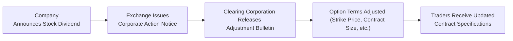

## 31.2 Adjustments for Stock Dividends

Stock dividends can seem a little puzzling at first, especially if you’re used to hearing about traditional cash dividends or big splashy stock splits. In a stock dividend, a company hands out extra shares to existing shareholders, usually expressed as a percentage of their current holdings—like a 10% stock dividend. Even though they sound straightforward on the surface, these actions can create ripple effects across option contracts. Let’s explore how it works in the Canadian market context (with a few global comparisons too), the rationale behind adjustments, and some of the best practices to ensure that no one is caught off guard on ex-dividend day.

Understanding Stock Dividends and Why Companies Issue Them

Sometimes companies prefer to reward shareholders through additional shares rather than paying them in cash. It’s like receiving a slice of new pizza instead of a slice of the same pizza in the form of cash. The total “pie” of the company’s market capitalization might stay roughly the same (unless something else changes in investor sentiment), but now there are more shares outstanding. Here are a few reasons companies do this:

• They want to preserve cash flow.  
• They want to signal confidence in growth without committing to a regular cash payout.  
• They may hope that more shares trading at a (slightly) lower price could help with liquidity.

A 10% stock dividend means that if you hold, say, 100 shares, you end up with 110 shares after the dividend. The share price—at least in theory—will adjust downward around that date to reflect the fact that more shares exist. Though, as some of us have seen in real life, markets don’t always do exactly what the textbooks predict. Still, the general formula stands: more shares, lower price per share, same overall company value (again, all else being equal).

Similarities to Stock Splits, but Not Exactly the Same

A stock dividend is often considered a cousin to the classic stock split. For instance, a 100% stock dividend is basically the same as a 2-for-1 stock split. But in day-to-day market practice, routine stock dividends tend to be smaller—maybe a 5% or 10% addition of shares—while a split could be 2-for-1, 3-for-1, or bigger. The end result is somewhat similar though: the number of shares you own increases, and the share price is expected to decrease proportionally.

When you have options on a stock that undergoes a stock dividend, the notional underlying asset you’re controlling changes. If your original contract was for 100 shares, you might now be effectively controlling 110 shares for that same contract, depending on the exact math. These adjustments aim to protect both option buyers and sellers from being unfairly impacted by the corporate action.

Preserving Economic Equivalence

In capital markets, there’s a fundamental commitment to keep you “whole” when corporate actions happen—no unintended windfalls or losses for those involved in existing derivatives. This concept is called economic equivalence. If you had an option to buy 100 shares at $50 before a 10% stock dividend, you shouldn’t end up paying $50 to buy 110 shares after the dividend, because that effectively lowers your average purchase price in a way that gives you extra unintended value. The clearing corporation steps in to realign things so that each contract remains fair to both parties.

Adjustment Mechanics

In Canada, the Canadian Derivatives Clearing Corporation (CDCC) takes the lead in adjusting equity options. CDCC issues an information circular—often called an “Adjustment Bulletin”—a few days before the ex-dividend date. This bulletin spells out precisely how contract terms will change. The adjustment can include any of the following:

• Contract Deliverable: The contract might now cover more shares, matching the new ownership proportion.  
• Strike Price: This might be reduced to keep the total contract value in line with where it stood before the stock dividend.  
• Contract Multiplier or Contract Size: For index options, the multiplier could change if the dividend somehow affects the underlying index mechanics, but usually, for single equity options, the focus is on the deliverable shares and the strike.  
• Rounding Conventions: If the math produces fractional shares, the clearing corporation uses specified rounding rules to keep everything tidy.

It might seem complicated, but the main idea is to ensure that the holder of an option and the writer of an option are each left in the same risk/benefit position as before the stock dividend. This approach reflects standard industry practice and regulatory requirements from CIRO (the Canadian Investment Regulatory Organization) and other oversight bodies.

Small Stock Dividends vs. Large Stock Dividends

Most stock dividends are on the smaller side—maybe 5%, 10%, or 15%. Typically, these are straightforward. However, if a company declares a very large stock dividend—like 50% or 100%—the procedure can start to resemble a stock split. Large adjustments might lead to more extensive changes in strike prices and even the creation of additional contract series.

Companies aren’t silly about it, though. A massive stock dividend is more often used as a signaling tool or a financial restructuring method. The exchange and clearinghouse must handle each corporate action consistently yet remain flexible enough to handle unique scenarios. That’s why each corporate action is announced via official bulletins; they let the market know exactly how the options will be reconfigured. In short, always read bulletins from CDCC, the Bourse de Montréal, or the relevant clearing corporation in other jurisdictions.

Impact on Option Pricing and Market Behavior

Once the stock starts trading ex-dividend, the price typically drops to reflect the issuance of extra shares. Option pricing will then follow the new underlying price. Sometimes, the market factors in these moves well ahead of time; interestingly, we can see changes in implied volatility if the dividend is larger than expected or if there’s some speculation around what it means for the company’s future.

I remember chatting with a friend about a 10% stock dividend on a mid-cap tech Canada-based company. He was convinced it was a bullish signal, and the stock ended up rising even more than the mathematically determined ex-dividend reduction would have implied! While that was fun to watch, it underscores the point: the real world can deviate from standard theories, but the mechanical adjustment steps remain well-defined.

Example: 10% Stock Dividend

Let’s walk through a simplified example:

• Pre-dividend share price: C$50.  
• Strike price of call option: C$50 (each contract covers 100 shares).  
• The company announces a 10% stock dividend, effective after a certain date.  
• After the dividend, each shareholder gets 10 new shares per 100 shares they own, so they now have 110 shares for the same ownership stake.  
• The share price theoretically adjusts to about C$45.45 (50 / 1.10), though actual market conditions can shift that number.  

CDCC might release an adjustment bulletin that states:

• The new deliverable per contract is 110 shares (instead of 100).  
• The new strike price is reduced from C$50.00 to roughly C$45.45 (subject to rounding conventions).  

The total cost to exercise the option—(110 shares × C$45.45)—remains about C$5,000 (plus or minus small rounding). This is how economic equivalence is maintained. Your contract hasn’t magically gotten more valuable or worthless because of the stock dividend—it’s been adjusted to reflect the new market reality.

Diagram: Stock Dividend Adjustment Flow

Below is a Mermaid diagram illustrating how a stock dividend triggers option contract adjustments. It depicts the broad flow from announcement to implementation:

Less Dramatic but Equally Important

It’s easy to dismiss a 5% or 10% stock dividend as “no big deal” compared to a 2-for-1 or 3-for-1 split. But from an option adjustments perspective, the principle remains the same. If you ignore these minor stock dividends, you could wake up with incorrectly priced options that no longer fit your strategy, or your broker might suddenly inform you that the contract specs changed, leaving you scratching your head. So pay attention to your trading platform notifications, exchange bulletins, or clearing corporation announcements.

Role of CIRO in Oversight

CIRO (the Canadian Investment Regulatory Organization) serves as the national self-regulatory organization overseeing investment dealers, mutual fund dealers, and the market integrity of equity and debt marketplaces in Canada. Whenever a company announces a stock dividend, CIRO ensures that all relevant disclosures and regulatory steps are properly followed. For official guidelines and updates, you can visit [https://www.ciro.ca](https://www.ciro.ca). Although references to the former IIROC or MFDA are now purely historical (they merged into CIRO as of early 2023), the underlying principles remain the same: transparency and fairness in dealing with corporate actions.

Staying on Top of Corporate Action Bulletins

If you’re actively trading options, do yourself a favor: set up alerts for corporate action news. Some data providers and brokerages will email or text you with such announcements. The Bourse de Montréal, for instance, publishes bulletins about upcoming adjustments to its listed options on [https://www.m-x.ca](https://www.m-x.ca). CDCC likewise publishes official circulars at [https://www.cdcc.ca](https://www.cdcc.ca).

Reading these bulletins might sound about as fun as watching paint dry, but trust me, they sometimes contain crucial details. Notably:

• Effective dates of the adjustment, so you know exactly which trading day the new specs come into effect.  
• Specific formulas for recalculating strike prices.  
• The final number of shares per contract.  
• Rounding rules for fractional shares (some adjustments might distribute cash-in-lieu for fractions).  

When in doubt, talk to your broker, consult your firm’s compliance department, or check the relevant official circular. It’s better than making a guess that can lead to a serious mismatch in your risk or reward calculations.

Practical Implications for Option Trading Strategies

If you’re running a covered call strategy, a quick example is when you hold 100 shares of the underlying and write a call option on those shares. With a stock dividend, your share position might become, say, 110 shares. If your call contract is adjusted to reflect 110 shares of deliverable, that’s fine—everything lines up. But if you had a strategy that specifically required a certain ratio, or you used a combination of calls and puts with slightly different strike prices, you’d want to make sure you’re not losing track of how many shares are tied to which contract.

For speculators, the strike prices might look a bit odd, or you might see decimal places that weren’t there before. Don’t be alarmed—that’s normal. Those numbers reflect the new, post-dividend reality.

Foreign-Listed Stocks and Cross-Border Effects

What if you’re trading Canadian-listed options on a U.S. or another foreign company that declares a stock dividend? Typically, the same approach applies. But keep in mind that different clearing corporations (like OCC in the United States) might have their own bulletins. If the security is interlisted in both Canada and the U.S., you might see parallel notices from CDCC and the OCC. Check both to avoid confusion (sometimes the notice in one market references the other).

Best Practices

• Keep an eye on corporate announcements, especially if you see the term “stock dividend.”  
• Read the clearing corporation’s adjustment bulletins and ask questions if something isn’t clear.  
• Update your trading or risk management software with the new contract details (and be mindful of rounding).  
• Rebalance or re-hedge your positions if needed to maintain your desired exposure after the stock dividend adjustments.  

Pitfalls to Avoid

• Ignoring small stock dividends because you underestimate their impact.  
• Failing to monitor the ex-dividend date and mismatch the effective date of new contract specs with your short-term trading.  
• Overlooking fractional share adjustments, which might lead to small, unexpected positions or cash settlements.  
• Relying on outdated references to the “MFDA” or “IIROC” (both replaced by CIRO). Their older bulletins might still be floating around the internet, but current official updates come from CIRO.

Glossary

Stock Dividend  
—A payment made to shareholders in the form of additional shares rather than cash.  

Economic Equivalence  
—The principle that, after a corporate action (like a stock dividend), neither party to an option contract should gain or lose purely because of that corporate action.  

Adjustment Bulletin  
—An official document (or circular) issued by a clearing corporation, such as CDCC, that details exactly how existing option contracts will be modified in response to a corporate action.

References and Additional Resources

• CDCC’s information circulars for corporate actions can be found at [https://www.cdcc.ca](https://www.cdcc.ca)  
• CIRO’s regulatory bulletins and updates: [https://www.ciro.ca](https://www.ciro.ca)  
• Bourse de Montréal bulletins for changes to listed options: [https://www.m-x.ca](https://www.m-x.ca)  

Don’t forget to check reputable sources like major accounting or legal advisories if you require in-depth discussion on tax implications—especially if you’re dealing with international holdings or more complex hedging arrangements. Remember, in Canada, CIRO is your primary go-to for self-regulatory confirmations and guidance.

Final Thoughts

Whether a stock dividend is big or small, the ripple effect on options can still matter. Stay informed, consult official circulars, and adjust (pun intended) your strategies accordingly. If you’re new to dealing with stock dividends and adjustments, talk to a mentor, teacher, or fellow trader who has gone through it. Once you’ve done it a few times, you’ll see that while it may look intimidating at first, there’s a well-defined system to keep things fair for all parties involved.

Anyway, in my opinion, these corporate adjustments—though they sound a bit boring—are a prime example of how financial markets work behind the scenes to safeguard fairness. So the next time you see a stock dividend come across your radar, you know exactly what it means for your calls, puts, or combos. Knowledge is everything, right?

## Sample Exam Questions: Stock Dividend Adjustments and Options



### A company announces a 10% stock dividend. Which of the following statements is true regarding option adjustments?

- [ ] The contract deliverable remains at 100 shares, and the strike price increases.  
- [x] The contract deliverable typically changes to 110 shares, and the strike price is proportionally reduced.  
- [ ] The contract is automatically cancelled and replaced with a futures contract.  
- [ ] The strike price remains fixed at its original level.  

> **Explanation:** After a 10% stock dividend, the clearing corporation will often increase contract deliverables to 110 shares and reduce the strike price proportionally, ensuring economic equivalence is maintained.

### Which entity in Canada typically issues the official bulletins explaining how option contracts will be adjusted for a stock dividend?

- [x] The Canadian Derivatives Clearing Corporation (CDCC)  
- [ ] The Canadian Investment Regulatory Organization (CIRO)  
- [ ] The Canadian Investor Protection Fund (CIPF)  
- [ ] The Bourse de Montréal (although it can publish relevant bulletins, final adjustments come from another body)  

> **Explanation:** In Canada, while the Bourse de Montréal and CIRO provide regulatory frameworks, it’s the CDCC that issues official adjustment bulletins and implements those changes.

### When a small stock dividend, such as 5%, is announced, why should an option trader still pay attention?

- [x] Even small stock dividends trigger formal adjustments to option specifications that can affect one’s positions.  
- [ ] They never impact option contracts and are purely an accounting decision.  
- [ ] They only matter if the dividend is above 20%.  
- [ ] They automatically remove strike price decimals.  

> **Explanation:** All stock dividends, large or small, necessitate an adjustment in the contract terms to preserve economic equivalence. Even a 5% dividend results in changes the trader must incorporate.

### What key piece of information is generally found in an “Adjustment Bulletin” related to a 10% stock dividend?

- [x] The new strike prices and updated number of deliverable shares.  
- [ ] The personal contact details of the corporate board members.  
- [ ] The updated corporate governance policies.  
- [ ] The new ex-dividend date for quarterly cash dividends.  

> **Explanation:** An Adjustment Bulletin will outline how many shares each contract now covers and what the new strike price is, ensuring that the total contract value remains consistent pre- and post-dividend.

### If an investor wrote a covered call before a 10% stock dividend and was covered by exactly 100 shares, what is the most likely scenario after the dividend?

- [x] The investor will need to ensure they have 110 shares, because the option contract may now represent 110 shares.  
- [ ] The covered call automatically expires worthless on the ex-dividend date.  
- [ ] The strike price instantly rises by 10%.  
- [ ] The premium received by the call writer is refunded by the broker.  

> **Explanation:** With a 10% stock dividend, the contract deliverable often changes to 110 shares, so the writer of a covered call must own 110 shares to remain fully covered.

### How does the principle of economic equivalence guide option contract adjustments for stock dividends?

- [x] It ensures neither the option buyer nor seller is unfairly enriched or disadvantaged solely by the corporate action.  
- [ ] It requires shareholders to approve the adjustments via proxy vote.  
- [ ] It guarantees the option seller receives a cash payout from the company.  
- [ ] It removes the need for margin requirements post-dividend.  

> **Explanation:** Economic equivalence is the guiding principle that after the corporate event, the payoff profile of the option position remains the same as before, preventing one side from profiting unfairly at the expense of the other.

### A stock is trading at C$60, and a 20% stock dividend is announced, effective next week. Which of the following outcomes is most likely on the ex-dividend date?

- [x] The new share price will open lower (around C$50) to reflect the additional shares in circulation.  
- [ ] The share price will remain at C$60, then drop to C$0 the next day.  
- [ ] The stock dividend will automatically convert into a stock split.  
- [ ] The clearing corporation ignores the price change for option adjustments.  

> **Explanation:** If the share price was C$60, a 20% stock dividend implies each shareholder receives 1 new share for every 5 shares owned. The share price typically adjusts downward to reflect the increased supply. Option contracts adjust similarly.

### Which of the following is a practical first step for an option trader after learning of an upcoming stock dividend?

- [x] Read the CDCC’s official adjustment bulletin to see how the specific option will change.  
- [ ] Immediately exercise all existing options.  
- [ ] Close out every position before the ex-dividend date.  
- [ ] File a complaint with CIRO for potential market manipulation.  

> **Explanation:** The clearing corporation’s bulletin provides the definitive wording on how your contract changes. Exercising or closing positions indiscriminately can be costly without further information.

### What often happens if rounding conventions after a stock dividend result in fractional shares per option contract?

- [x] The clearinghouse may settle the fractions in cash-on-delivery.  
- [ ] The option contract automatically becomes a futures contract.  
- [ ] The fractions vanish without compensation.  
- [ ] The broker chooses at random whether to credit additional shares or not.  

> **Explanation:** CDCC or similar entities typically handle fractional shares by allocating a small cash payment in place of the fraction, thus “rounding” the deliverable shares to a whole number.

### After a 10% stock dividend, an option contract’s strike price is usually:

- [x] Adjusted lower in rough proportion to the dividend percentage.  
- [ ] Increased to match the new share count.  
- [ ] Left unchanged, so the option gets cheaper for the buyer automatically.  
- [ ] Automatically converted into multiple partial strike prices.  

> **Explanation:** The strike is adjusted downward so that the total notional cost or payoff is the same before and after the dividend. This aligns with the principle of maintaining economic equivalence.


