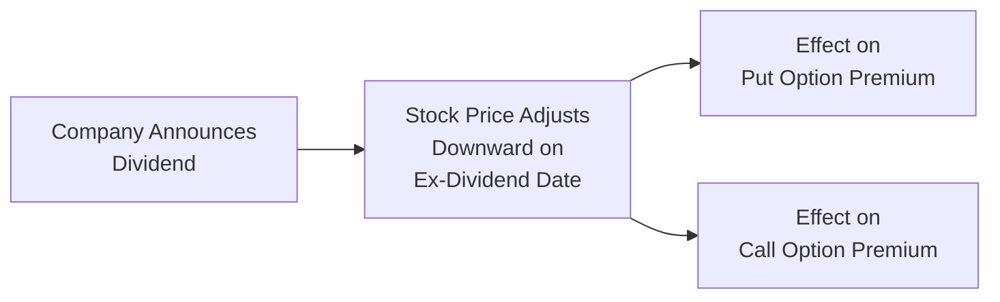

## 31.4 Impact of Dividends on Option Premiums

Hello there! You know, not too long ago, I discovered just how powerful a single dividend payment could be in changing the entire picture of an options strategy. I had a friend—let's call him Chris—who owned a bunch of shares of a Canadian blue-chip stock and was happily writing covered calls on them. He always counted on that extra income from premiums. But guess what? When the company announced a hefty dividend increase, he was wondering if his calls would get exercised early, and if that had any implications for how his profit or break-even might change. That, in a nutshell, is the kind of situation we’re going to unpack in this section.

In this chapter, we investigate the effects that dividends can have on options, especially on their premiums. We’ll dig into the concepts behind why a stock’s dividend policy can directly alter call and put values. We’ll check out how large dividends might prompt early exercise of calls (a big deal for covered call writers). We’ll also relate these ideas to option pricing models such as Black–Scholes–Merton and highlight best practices for ensuring you’re making informed decisions in the presence of dividends. Let’s get started!

--------------------------------------------------------------------------------

### Why Dividends Affect Option Premiums

When it comes to straightforward equity investing, dividends are downright wonderful—money in your pocket just for holding the shares, right? However, with options, dividends can alter the expected path of the underlying share price. Typically, on the ex-dividend date, the stock’s price is expected to drop by the amount of the dividend. While this drop might be partially factored into the market’s fair valuation before it actually happens, it’s still a scheduled, almost mechanical event that influences how options are priced.  

• **Put Options and Dividends**  
  - As a rule of thumb, if the underlying stock is expected to pay a larger dividend, the price of a put option can go up because the drop in the stock price on the ex-dividend date increases the likelihood that the put will end up in-the-money (or deeper in-the-money).  
  - In other words, put options are more valuable if the stock price is more likely to decline.  
  - From a purely theoretical standpoint, a higher dividend translates into a lower forward price for the stock in standard option pricing models, and that’s generally supportive for put prices.

• **Call Options and Dividends**  
  - Call options, on the other hand, become slightly less valuable when there are larger anticipated dividends, because the expected drop in the stock price reduces the possibility that the call will end up profitably in-the-money at expiration.  
  - Additionally, if you’re holding a call option, you don’t receive the dividend—only shareholders do. So, there’s a certain opportunity cost for the call option holder.  

In plain English, think of it this way: bigger dividends = more reward for shareholders = more reason to hold the stock, but also means a minor drop in price on ex-dividend day that supports put options and weighs on call prices.

--------------------------------------------------------------------------------

### Impact on Theoretical Pricing Models

Now, who here has heard of the Black–Scholes–Merton (BSM) option pricing model? It’s that beloved formula that allows you to crunch out a “fair value” for a vanilla European call or put based on volatility, strike price, time to expiration, the risk-free rate, and a bunch of other factors. Well, one of those factors is the stock’s forward price, which in turn is affected by the dividend yield.  

Let’s put it slightly more technically (but not too much, I promise):

• In BSM’s dividend-adjusted model, you typically discount the stock price for continuous dividend yield or discrete dividends.  
• A higher dividend yield reduces the forward price input.  
• Because a call is basically “long the stock but short the financing costs,” if the stock’s forward price is lower, the call option is worth somewhat less.  
• Similarly, put prices can rise with higher dividend yields, given the beneficial effect on put payoffs if the underlying trades lower.

If you’re plugging in specific dividend payment amounts rather than a simple yield, you have to estimate each anticipated dividend across the life of the option. Missing or misestimating these dividend amounts can lead to mispricing of your options.

--------------------------------------------------------------------------------

### Practical Example: Early Exercise Considerations for Call Options

One particularly interesting scenario is how large dividend payments can lead to early exercise of calls. Here’s a short anecdote: My friend Chris, whom I mentioned earlier, found himself in exactly this situation. He sold a covered call on a stock known for high dividends. The ex-dividend date was approaching, and the call was slightly in-the-money. All of a sudden, he woke up one morning to find that his shares had been called away—the buyer exercised the option right before the ex-dividend date to capture the dividend.

**Why does early exercise happen for calls?**  

• If the dividend is big enough, the strike price is relatively low, and the time value remaining on the call (extrinsic value) is outweighed by the immediate dividend, then an investor who holds the call might decide to exercise early. Essentially, they forfeit some time value but gain the dividend in return if they exercise and become a shareholder before the ex-dividend date.  

• This situation is crucial for covered call writers (or call sellers) to anticipate because if they don’t want to lose their shares, they might want to roll the option out (i.e., buy back the call and sell another with a later expiration or different strike) or close out their position well in advance if the dividend is particularly large.

• While American-style calls on dividend-paying stocks can be exercised anytime, the exercise is mostly beneficial if it occurs just prior to the ex-dividend date, and only when the dividend is large enough to offset the forfeited time value.

So the moral is: keep a close watch on the dividend amounts and ex-dividend dates if you’re writing calls. Similarly, if you hold a call yourself, you might consider capturing that dividend, but only if the time value forfeited is smaller than the dividend you’ll receive.

--------------------------------------------------------------------------------

### A Quick Diagram: Dividend Influence on Calls and Puts

Below is a very simple diagram using Mermaid.js to illustrate how a dividend flows through to option pricing impacts.

• From A to B: The announcement confirms the amount and date, influencing expectations about this drop.  
• From B to C: The put price can rise because a lower ex-dividend price might favor the put’s payoff.  
• From B to D: The call price can weaken because shareholders get the actual dividend while call holders do not.

--------------------------------------------------------------------------------

### Dividend Yield and Its Role

If we turn to the term “dividend yield,” we’re looking at the total annual dividends paid by the company divided by the stock’s price. For example, if a stock pays a $4 annual dividend and trades at $100, the dividend yield is 4%.  

In option pricing:  
• A 4% dividend yield might cause a greater discount to the forward price than a 2% yield.  
• Model inputs based on forward prices, volatility, and time to expiration incorporate that implied discount.  

**Remember**: Dividend yield can be stable for some companies but might be bumpy or unpredictable if the company has an uncertain payout history. If the yield is uncertain (which is often the case), you can see how this complicates pricing.  

--------------------------------------------------------------------------------

### Practical Example: A Hypothetical Case Study

Let’s try to piece this all together with a fairly straightforward example:

• **Stock ABC Inc.** trades at CAD 50.00.  
• ABC is expected to pay a CAD 0.50 dividend once every quarter. There are, say, two dividend payment dates that occur before the option expiration. Total expected dividend during the life of an option might be CAD 1.00 (CAD 0.50 × 2).  
• We’re evaluating a call option and a put option with a strike price of CAD 50 expiring in six months.  

For simplicity, we’ll ignore interest rates or assume they’re negligible.  

1. **Call Option Without Dividends**: If no dividends were expected, maybe the model would give us a fair value of CAD 2.50.  
2. **Call Option With Dividends**: Once we factor in a total CAD 1.00 expected dividend, the discounted forward price might be lower, so the fair value might drop from CAD 2.50 to around CAD 2.30 (depending on exact volatility assumptions).  

The difference might look small, but lumps up significantly for large volumes.  

On the put side:  
1. **Put Option Without Dividends**: Maybe it’s valued at CAD 2.00 without dividends.  
2. **Put Option With Dividends**: Factoring in a total dividend of CAD 1.00, you might see the put’s fair value jump to CAD 2.20 or so.  

Numbers vary with interest rates, time to expiration, and the dividend amount, but that’s the general effect.

--------------------------------------------------------------------------------

### Covered Calls and Dividends

Let’s zero in specifically on covered calls. A covered call is a strategy where you own the underlying shares (the “covered” part) and then write (sell) a call against them. Investors often do this to generate a bit of extra income on top of their dividends.

• **Why Dividends Matter**  
  - If you write a call with an expiration date after an ex-dividend date, there’s a chance your shares might get called away early if the call goes significantly in-the-money and the dividend is enticing enough.  
  - Typically, you’ll see early assignment happen close to the ex-dividend date. If the call buyer can pocket the dividend by exercising, they may do so if the call’s time value is smaller than the dividend to be gained.

• **Example**  
  - Suppose you own 1,000 shares of a dividend-paying stock with a high yield—let’s say 6%. The ex-dividend date is in two weeks. You sold 10 calls (each call covers 100 shares) that are already in-the-money. If the dividend is large enough, there’s a decent possibility that you may be assigned early, so the call buyer can record that dividend.  
  - If you were looking forward to that dividend, you might be disappointed to find someone else ultimately collects it if they exercise the option just prior to the ex-dividend date.  

• **Heads-Up**  
  - The best practice is always to watch the time value left on your short call. If it’s less than the dividend, you’re at higher risk of early assignment. You can roll the option forward or adjust accordingly if collecting the dividend is a priority for you.

--------------------------------------------------------------------------------

### Regulatory and Best Practice Considerations in Canada

Now, focusing on the Canadian environment:  

• **CIRO Suitability Guidelines**  
  - In 2023, the Mutual Fund Dealers Association of Canada (MFDA) and the Investment Industry Regulatory Organization of Canada (IIROC) merged to form CIRO. Under the new combined self-regulatory body, it’s important for advisors and dealers to thoroughly explain to clients how dividends can impact their options positions.  
  - The idea is that you shouldn’t be recommending a covered call or short call strategy on a dividend-paying security unless your client actually understands the risk of early assignment and the effect on option premiums.  

• **Margin Requirements**  
  - Typically, margin for covered calls can be more relaxed because you own the underlying shares. However, if early exercise causes you to lose those shares, you might be left with an unintended short position (or no underlying shares at all). Keep close tabs on your margin in case of assignment.  

• **Disclosure**  
  - The Bourse de Montréal and CIRO require that any marketing materials, risk disclosure statements, or educational materials mention the effect of dividends on option pricing, so be sure that’s included. If you’re an advisor, you also have to keep your KYC (Know Your Client) information up to date and ensure the client profile is consistent with the complexities of combining dividend expectations and option premium strategies.  

--------------------------------------------------------------------------------

### Leveraging Tools and Data Sources

There are plenty of ways to stay on top of dividend news and data:

• **Company Announcements and Financial Calendars**  
  - Companies release dividend schedules, and various financial news sites compile them. Use these to track whether the dividend has been changed, maintained, or suspended.

• **Open-Source Pricing Libraries**  
  - Tools such as QuantLib and certain Python libraries can handle discrete dividend schedules. They help you refine your modeling of call and put price adjustments.  

• **Canadian Securities Institute (CSI)**  
  - CSI offers several courses and reference materials aimed at analyzing how dividend announcements affect equities and options.  

• **Academic Journals and Research Platforms**  
  - If you want to dive super deep, check out The Journal of Finance research on implied volatility changes around dividend announcements.  

--------------------------------------------------------------------------------

### Common Pitfalls and Challenges

• **Estimating Dividends Incorrectly**  
  - If you assume the dividend will stay the same, but it’s cut (or increased), your entire pricing framework could shift.

• **Failing to Track Ex-Dividend Dates**  
  - Missing an ex-dividend date can lead to an unwelcome surprise in your net returns or early exercise situation.

• **Overlooking Tax Treatment**  
  - Dividends in Canada may receive favorable tax treatment, especially if you hold the shares in a taxable account. Meanwhile, capital gains or losses from options can have different tax implications. Make sure you (or your tax professional) can track these.  

• **Ignoring Volatility Changes**  
  - Dividend announcements can shift implied volatility. This is subtle but can further tweak option prices in ways not purely accounted for by the mechanical ex-dividend price drop.

--------------------------------------------------------------------------------

### Tips for Navigating Dividends with Your Option Strategies

1. **Monitor Dividend Announcements**: Use reliable sources, from corporate earnings releases to established news platforms, so you’re not caught off guard.

2. **Incorporate Dividends into Your Pricing Model**: If you’re self-pricing, ensure your inputs reflect scheduled dividends. If you’re using a brokerage’s quotes, remember that the market quotes likely already factor in expected dividends.

3. **Assess Early-Exercise Risk**: Specifically if you’re short calls on a dividend-paying stock. Keep an eye on any in-the-money positions as ex-dividend day approaches.

4. **Review Your Brokerage’s Policies**: They might have distinct processes for allocations of early exercise. The allocation is often random among short call writers, but different brokers have different methods. Know yours.

5. **Stay Compliant**: CIRO guidelines require that advisors disclosing and explaining how dividends might change the risk/reward of an option trade is a big part of the suitability process. Include that in your conversation with clients or your risk disclosures if you are an advisor.

--------------------------------------------------------------------------------

### Synthesis: Dividends and Your Option Strategy

All in all, dividends aren’t just a “bonus coupon” for equity investors. In the world of options, they’re a key factor that shapes how calls and puts are priced. Being caught unaware can lead to either leaving money on the table or taking an unintended risk. By knowing how dividends integrate into theoretical models—like the Black–Scholes–Merton formula—and by understanding the basics of early exercise, you’ll be in far better shape to utilize them in your trading or advisory practice.

--------------------------------------------------------------------------------

### Additional References

• **CIRO**: [https://www.ciro.ca](https://www.ciro.ca) – Canada’s new self-regulatory organization where you can review official rules and guidelines on suitability, margin, and disclosure.  
• **Canadian Securities Institute (CSI)** – A solid educational resource base for diving deeper into derivatives, dividends, and advanced strategies.  
• **Open-Source Python Libraries** – Tools like QuantLib can help you factor in discrete dividends for advanced option pricing.  
• **The Journal of Finance** – Contains a variety of studies on dividends, implied volatilities, and ex-dividend day behavior.  

--------------------------------------------------------------------------------

## Sample Exam Questions: Dividends and Their Impact on Option Premiums



### Which best describes how an expected increase in dividends influences put option premiums?

- [ ] Put option premiums usually decrease because the stock price is projected to remain stable.  
- [ ] Put option premiums usually remain completely unchanged as dividends have no effect on options.  
- [x] Put option premiums usually increase, because the stock price is expected to drop on the ex-dividend date.  
- [ ] Put option premiums are not relevant if interest rates are zero.  

> **Explanation:** Higher expected dividends typically lower the forward price of the underlying, which increases the value of puts.

### Why might a long call holder consider exercising their call option early before the ex-dividend date?

- [x] To capture the dividend that would otherwise go to the stockholder.  
- [ ] Because the brokerage often mandates early exercise for dividend-paying stocks.  
- [ ] Because call contracts are automatically assigned on the ex-dividend date.  
- [ ] Because the option immediately becomes worthless after the ex-dividend date.  

> **Explanation:** If the dividend exceeds any remaining time value in the option, early exercise can be profitable to capture the dividend.

### What is a primary reason a covered call writer should track dividend amounts closely?

- [ ] They are required to purchase additional call options before dividends.  
- [ ] They must sell their shares prior to the ex-dividend date.  
- [x] They risk early assignment if the dividend is large enough.  
- [ ] They owe the dividend directly to the call buyer.  

> **Explanation:** Large dividends create incentives for early exercise. The call buyer might exercise to capture the dividend, meaning the covered call writer’s shares get called away earlier than expiration.

### In the Black–Scholes–Merton model, how is the dividend effect typically included?

- [ ] By doubling the volatility factor to account for dividend yield.  
- [x] By reducing the forward price of the underlying to reflect dividend payments.  
- [ ] By inflating the risk-free interest rate.  
- [ ] By ignoring any effect of dividends on option pricing.  

> **Explanation:** In dividend-adjusted BSM, you lower the stock’s forward price to reflect the anticipated dividends to be paid during the option’s life.

### An investor owns 100 shares of a corporation that pays a significant dividend. The same investor wrote (sold) one at-the-money call expiring just after the ex-dividend date. Why might early assignment occur?

- [ ] Dividends are never a factor in early assignment decisions.  
- [ ] The put option holder stands to gain from immediate exercise.  
- [x] The call buyer can capture the dividend if they exercise right before ex-dividend.  
- [ ] The time value of the option always exceeds the dividend.  

> **Explanation:** Early exercise of a call can happen if the dividend to be gained exceeds the time value forfeited.

### Which statement best describes the impact of a rising dividend yield on the price of a call option?

- [x] The call option’s value slightly decreases as the anticipated forward price drops.  
- [ ] The call option’s value remains constant regardless of dividend yield.  
- [ ] The call option’s value increases as the dividend yield rises.  
- [ ] The call option’s value automatically doubles with every 1% increase in dividend yield.  

> **Explanation:** Rising dividend yield lowers the forward price in theoretical models, which usually dampens the call premium.

### How does CIRO expect registered advisors to handle dividend impacts on an options recommendation?

- [ ] They must ignore dividend impacts because dividends are too uncertain.  
- [x] They must ensure clients are informed of the potential changes in option premiums and early assignment risks.  
- [ ] They must convert covered calls to naked calls when dividends are declared.  
- [ ] They must only recommend put options if dividends are high.  

> **Explanation:** CIRO guidelines emphasize full disclosure and suitability. Advisors should inform clients about how dividends affect risk/reward.

### In a scenario where the declared dividend is higher than predicted, which of the following often happens to put and call premiums respectively?

- [ ] Put premiums decrease; call premiums increase.  
- [ ] Both put and call premiums remain unchanged.  
- [ ] Both put and call premiums increase.  
- [x] Put premiums increase; call premiums decrease.  

> **Explanation:** A higher dividend usually means a larger price drop on ex-dividend date, boosting puts and weakening calls.

### Which factor most commonly leads to early exercise of American-style call options on dividend-paying stocks?

- [ ] A surge in implied volatility.  
- [ ] The presence of a high interest rate environment.  
- [ ] The put-call parity principle.  
- [x] The desire to capture an upcoming dividend that exceeds the call’s remaining time value.  

> **Explanation:** If the dividend is bigger than the remaining extrinsic value of the call, an early exercise can make sense.

### True or False? “Canadian investors writing a covered call on a high-dividend-yielding stock are never at risk of early assignment.”

- [ ] True  
- [x] False  

> **Explanation:** Covered call writers on high-dividend stocks are often at heightened risk of early assignment if the call is in-the-money prior to the ex-dividend date.


