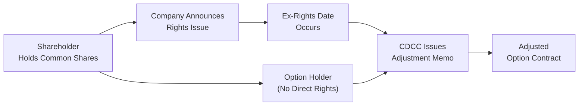

## 31.5 Rights Issues

So, you’ve finally made it to this critical piece in your derivatives journey: rights issues and their impact on option contracts. I remember the first time I encountered a rights issue—years ago, back when I was new to the markets, I got super excited about the “discounted shares” part, only to realize there’s an entire rabbit hole of mechanics, timing, and adjustments that can confuse even the most seasoned trader. In this section, we’ll unpack the concept of rights issues, how they affect outstanding shares, and what they mean for options holders. If you’re an investor, advisor, or just curious about how corporate actions can reshape the derivatives landscape, you’ve come to the right place.

Let’s break it down step by step, from the basics (what a rights issue actually is) to the nitty-gritty of how option contracts get adjusted. We’ll focus on the Canadian context, but we’ll also draw parallels with how global markets handle these events. After all, nobody likes being surprised by an unexpected contract adjustment on a Monday morning.

Use this as your roadmap to become super comfortable explaining rights issues to friends, colleagues, or clients—like you’re just casually talking over coffee (minus the caffeine jitters, maybe).

  
Understanding the Basics of Rights Issues
-----------------------------------------

A rights issue is a method companies use to raise capital by offering additional shares to existing shareholders. The shares are sold at a subscription price (which is usually lower than the market price—sort of like having a coupon to buy new shares at a discount). Each eligible shareholder is given an allotment of rights, often proportional to their current holdings. The ratio could be something like “one right for every share owned,” which then translates to “X new shares for every Y rights.” If that sounds a bit complicated, it’s actually straightforward once you see it in action.

Fictitious Example: Suppose Maple Syrup Inc. announces a 1-for-3 rights issue at a subscription price of CA$8 per share when the current market price is CA$10. This means that for every 3 shares you hold, you receive the right (but not the obligation) to buy 1 additional share at CA$8. You can either exercise the rights, sell the rights, or let them expire worthless. If you believe in Maple Syrup Inc. and you want to maintain (or even increase) your stake, you might jump at the offer. But if you’re strapped for cash, you might decide to sell your rights in the market.

  
Comparing Rights Issues to Other Corporate Actions
-------------------------------------------------

Rights issues share some similarities with stock splits, stock dividends, or spin-offs: they all modify the number of outstanding shares and can affect share prices. However, there’s one key difference. In a stock split, shareholders receive new shares automatically—no additional payment required. With a rights issue, new shares are basically for sale to existing shareholders at a lower price. The discounted price is the carrot that encourages existing holders to invest more capital into the company.

Just as stock splits or dividends can trigger adjustments in option strike prices or contract deliverables, so can rights issues. But because a rights issue has a transaction (i.e., the purchase of new shares) attached to it, the adjustments can be somewhat more complicated.

  
Ex-Rights Date and Subscription Period
--------------------------------------

One crucial aspect of a rights issue is timing. Typically, there’s an ex-rights date—on this day, the stock starts trading without the benefit of the rights. Before this date, the stock trades “cum-rights,” meaning if you buy shares, you’ll receive the associated rights upon settlement. Right after the ex-rights date, new buyers no longer get the rights, and so the share price may adjust to reflect the dilution impact.

Then there’s the subscription period—a window (often a few weeks) during which shareholders must decide if they want to exercise their rights, sell them, or let them expire. If you’re not paying attention, you could inadvertently miss the subscription deadline, which might lead to lost value or forced liquidation of the rights.

  
Why Companies Do a Rights Issue
-------------------------------

Rights issues are a practical solution for companies needing fresh capital. The reason could be:

• Funding a new project or acquisition.  
• Maintaining/improving the balance sheet by reducing debt.  
• Meeting regulatory capital requirements (especially in sectors like banking).  

Because current shareholders get the first shot at these new shares, the rights issue is often marketed as a way to avoid diluting existing ownership stakes—at least for those who choose to exercise their rights.

  
How Rights Issues Affect Stock Price and Shares Outstanding
----------------------------------------------------------

When a rights issue is announced, the immediate market reaction might vary based on the subscription price, the reason for the capital raise, and general market sentiment. Theoretical ex-rights price (TERP) is often used to estimate the post-rights price. The formula for TERP can be something like this:

Let:  
• Pₒ = Current market price of the share (before the rights issue).  
• S = Subscription price of the new shares.  
• N = Number of existing shares required to get 1 new share.  

Then the theoretical ex-rights price might be:

(
 (N × Pₒ) + S
)
––––––––––––––––––
 (N + 1)

It’s not a perfect predictor (because the market can deviate from the “theoretical” number), but it’s helpful when you’re trying to guess how the market might price the shares after the ex-rights date.

  
What Happens to Option Contracts?
---------------------------------

Now, let’s talk about the crux of the matter: If you hold a call or a put on a company that announces a rights issue, you’re not automatically entitled to the rights (because you’re not a shareholder of record—stock ownership and option ownership are different). Instead, the clearing corporation (in Canada, that’s the Canadian Derivatives Clearing Corporation or CDCC) steps in to “adjust” the option contract. The aim is to preserve the fair value of your position so that you’re not unfairly penalized (or unduly enriched) by the rights issue.

  
Mechanics of Adjustments
------------------------

Adjustments usually come in two main flavors:

• **Adjusting the Contract Deliverable**: Instead of representing 100 shares of the underlying, the adjusted option might represent 100 shares plus the right to purchase an additional quantity of shares at a set price. Alternatively, the contract might simply represent a greater number of shares, capturing the effect of the rights.  
• **Adjusting the Strike Price**: Sometimes the strike price is revised to reflect the new, post-dilution share price. However, not all rights issues lead to a straightforward strike adjustment. The formula can be more involved if there are fractional entitlements or certain subscription ratios.

In short, the aim is always the same: to protect both the buyer and writer of the options from an unfair shift in contract economics.

  
Role of the Clearing Corporation (CDCC)
--------------------------------------

CDCC issues a bulletin or memo describing exactly how each listed option will be adjusted. This typically happens shortly after the rights issue is announced. If you’ve ever subscribed to those official bulletins, you know they can get pretty detailed—covering the timing, ratio, new deliverable, and a host of disclaimers about rounding or fractional entitlements.

CDCC’s approach is motivated by fairness and standardization. If each broker tried to interpret the rights issue in a different way, the market would be chaotic. Instead, you get a single authoritative notice that ensures everyone is on the same page.

For more details, definitely check out:
• [https://www.cdcc.ca](https://www.cdcc.ca) for official memos on adjustments.  
• [https://www.m-x.ca](https://www.m-x.ca) for Bourse de Montréal bulletins.  

  
No Free Lunch, No Free Rights
-----------------------------

A crucial point: holding a call option *doesn’t* make you an owner of record. That means you don’t get the actual rights distributed by the company. But if you exercise your call option *before* the ex-rights date, you’d own the shares and thus be eligible to receive the rights. This scenario gives rise to strategic decisions—sometimes, if the rights carry a lot of extrinsic value, it might be worthwhile to exercise early to capture them. But you have to do the math on forgone time value versus the gain from the rights.

Put owners and option writers also have to be aware of these dates. If they’re short calls, for instance, they might face early assignment if the rights are deemed valuable enough to justify early exercise by the call owner.

  
Real-World Example
------------------

Let’s illustrate with a hypothetical scenario:

Imagine Bear Maple Explorations (BME) announces a rights issue of 1 new share at CA$5 for every 4 shares held. The stock is currently trading at CA$7, and each option contract covers 100 shares. The ex-rights date is set for September 1. If you hold a call with a strike price of CA$6 that expires in December:

1. **Before Ex-Rights**: The call still controls 100 shares at CA$6 each.  
2. **After Ex-Rights**: The clearing corporation adjusts the contract so you control the equivalent economic interest of 100 pre-rights shares. That might become something like “100 shares + the right to buy 25 additional shares at CA$5” (depending on the ratio and rounding). Alternatively, they could leave the deliverable as a certain number of shares but recalculate the strike price.  

The CDCC bulletin might read as follows:  
• “Effective September 1, each contract will deliver 100 shares plus the right to purchase 25 shares at CA$5. The strike price remains unchanged.”  

Or:  
• “Effective September 1, each contract will deliver 100 shares. The strike price is reduced to reflect the rights offering.”  

The exact approach depends on the subscription price, ratio, and the leftover fraction of shares that might be involved. Typically, fractional entitlements are handled by a “cash-in-lieu” approach, so you might get credited or debited a small cash amount.

  
Diagram: Flow of Rights Issue and Option Adjustment
---------------------------------------------------

Below is a simple Mermaid diagram that illustrates the overall sequence of events when a rights issue triggers an adjustment for listed options.

In this flow:
• The shareholder directly receives, exercises, or sells the rights.  
• The option holder doesn’t receive rights outright but has the contract adjusted by CDCC.  

  
Rights Issues vs. Market Sentiment
----------------------------------

Market sentiment around a rights issue can sway option prices. For example, if the market believes the capital raise is a desperate attempt to shore up finances, the stock might plummet, dragging down call premiums and boosting put premiums. Conversely, if it’s seen as a well-structured plan to fund a profitable venture, the market might react positively. Keep in mind the classic tension: short-term dilution often competes with longer-term benefits of new capital.

  
Handling Rights Issues in a Brokerage Account
--------------------------------------------

If you’re an advisor or a retail investor, your brokerage usually provides notifications about rights issues. Make sure you read the fine print because you might have only a few days to inform the broker if you intend to exercise or sell your rights. Failing to respond usually results in a default action—often that means the broker will sell the rights on your behalf close to expiry (if they have any value) and credit your account with the proceeds (minus fees).

For margin accounts, keep an eye on margin requirements. Leveraged positions can become complicated if the share price moves sharply around the ex-rights date. CIRO guidelines on margin rules might come into play if you’re holding large positions in a security undergoing a rights issue.

  
Effects on Hedging and Speculating Strategies
---------------------------------------------

Hedgers and speculators must adapt their strategies to the changing dynamics. If you’re using options to hedge a long equity position, you need to be aware that your underlying shares will produce rights—while your options will become adjusted. That could shift your hedge ratio, or cause you to re-evaluate.

For speculators holding short options, you might face early assignment if rights become valuable. So, always be mindful of whether an early exercise scenario is logical in the days leading up to the ex-rights date.

  
Regulatory Considerations in Canada
-----------------------------------

CIRO—Canada’s consolidated self-regulatory organization as of 2023—monitors how investment dealers disclose corporate actions, including rights offerings. Its resources (found at [https://www.ciro.ca](https://www.ciro.ca)) outline clear guidelines on how these offerings must be explained in prospectuses and marketing materials. Investors have a right to accurate, timely info. If you suspect that your broker or an issuer is not providing clarity, you can consult these guidelines or consider reaching out to CIRO.

  
Pitfalls and What to Watch Out For
----------------------------------

• **Overlooking Subscription Deadlines**: Rights can expire worthless if you’re not paying attention.  
• **Confusing Ex-Rights Date with Record Date**: The record date is used to determine who is eligible for rights, while the ex-rights date is when the stock trades without rights.  
• **Ignoring Option Adjustments**: If you hold a large, in-the-money call and the rights carry real value, check if an early exercise might make sense.  
• **Uncertainty in Final Share Count**: The final number of new shares might depend on how many rights are exercised. This can cause short-term volatility in the stock’s price.  
• **Mispricing in the Market**: Occasionally, the rights or the adjusted options might trade at inefficient prices if the market is slow to update. Skilled arbitrageurs sometimes step in to capitalize on these mispricings.

  
Real-Life Anecdote
------------------

I once worked with a trader who told me she’d never heard of a “corporate action cheat sheet.” She was all about the big macro trades—currency swaps, interest rate hedges, you name it. Then suddenly, one of her large equity holdings announced a rights issue. She nearly missed the subscription window because, in her words, “I just assumed I’d get the shares automatically like a stock dividend.” She ended up sorting it out in a panic during the last 48 hours. That taught me—and now hopefully you—that no matter how advanced or basic your strategy, always keep an eye on corporate actions. They can sneak up on you and cause confusion if you’re not prepared.

  
Further Resources and References
--------------------------------

• **CDCC Adjustments Memos**: [https://www.cdcc.ca](https://www.cdcc.ca)  
  – Official bulletins detailing how each rights issue impacts option contracts.  
• **Bourse de Montréal**: [https://www.m-x.ca](https://www.m-x.ca)  
  – Bulletins and regulatory updates.  
• **CIRO**: [https://www.ciro.ca](https://www.ciro.ca)  
  – Guidance on disclosures, compliance, and best practices, including how dealers must present rights issues to clients.

For a deeper dive into how subscription prices are set, or if you’re curious about how these changes appear in your brokerage account statements, you can also check out open-source financial resources like the “Corporate Actions Handbook” (commonly found in certain academic or public libraries). It’s a big read, but definitely worth it if you’re dealing with corporate actions regularly.

  
Best Practices and Strategic Tips
---------------------------------

• **Plan Ahead**: If you hold calls deep in-the-money and the ex-rights date is approaching, do your calculations for potential early exercise.  
• **Monitor Bulletin Boards**: Keep an eye on official bulletins from the Bourse de Montréal and CDCC so you’re not caught off guard.  
• **Collaborate with Your Broker**: A quick phone call can clarify how your contract is being adjusted.  
• **Model Various Outcomes**: If the rights issue has a range of possible subscription results, consider best- and worst-case scenarios (e.g., partial take-up vs. full take-up).  
• **Stay Informed on Regulatory Changes**: CIRO or the CSA (Canadian Securities Administrators) might periodically update how rights offerings are regulated or disclosed.

  
How to Communicate This to Clients or Juniors
--------------------------------------------

If you’re involved in client-facing roles or training junior associates, explaining rights issues in simple terms can go like this: “It’s like the company is giving you a coupon to buy more shares at a discount. You can use that coupon, sell it, or ignore it. If you own options, you don’t get the coupon, but your option contract gets adjusted so you’re not missing out on value.” That’s basically the heart of the matter.

Stress the importance of paying attention to ex-rights dates and the final subscription date. Emphasize that missing these can mean leaving money on the table—or, in some cases, losing the opportunity altogether.

  
Conclusion
----------

Rights issues can be a powerful tool for companies looking to raise capital and for investors who want to maintain or expand their stakes at a discount. But with opportunity comes the complexity of corporate actions—especially regarding how option contracts get adjusted. If you remember just one thing, let it be this: stay alert. The ex-rights date, subscription window, and the clearing corporation’s bulletins are your best friends in navigating rights issues without breaking a sweat.  

Whether you’re a brand-new trader or an experienced portfolio manager, understanding the interplay between rights issues and options is essential. The next time you see a headline about a company announcing a rights issue, you’ll be able to decipher the steps, consequences, and how to position yourself accordingly. The knowledge here—plus a little bit of healthy caution—will go a long way to ensuring you know exactly how your options will be affected.

Safe trading, and don’t forget to check your corporate actions notifications!

  
## Sample Exam Questions: Rights Issues in Option Contracts



### In a rights issue, existing shareholders typically:
- [x] Receive the option to buy additional shares at a discounted price.
- [ ] Are guaranteed an immediate increase in share price.
- [ ] Lose their existing shares if they do not pay for the new shares.
- [ ] Receive free new shares without additional payment.

> **Explanation:** A rights issue gives shareholders the right (but not the obligation) to buy extra shares at a discounted price, which they can exercise, sell, or let expire.

### Which organization typically issues official memos describing how rights issues will affect Canadian listed option contracts?
- [ ] The Bank of Canada
- [ ] CIPF
- [x] The Canadian Derivatives Clearing Corporation (CDCC)
- [ ] The Canada Revenue Agency (CRA)

> **Explanation:** In Canada, the CDCC is responsible for clearing and adjusting listed options, including how rights issues affect existing option contracts.

### How does a rights issue generally impact the number of outstanding shares of a company?
- [x] It increases the number of outstanding shares.
- [ ] It decreases the number of outstanding shares.
- [ ] It has no effect on outstanding shares.
- [ ] It cancels a certain percentage of existing shares to balance supply and demand.

> **Explanation:** A rights issue allows issuance of new shares, thereby increasing the total pool of outstanding shares.

### If you hold a call option on a stock that announces a rights issue, you:
- [ ] Receive rights as if you were a shareholder of record.
- [ ] Automatically get cash compensation for the rights.
- [x] Have your option contract adjusted to preserve fair value.
- [ ] Must exercise your option before the ex-rights date or lose the contract.

> **Explanation:** Option holders do not receive rights directly; instead, the clearing corporation adjusts the contract's terms so the economic value remains fair to both buyers and sellers.

### Which of the following is the correct formula (in simplified terms) for calculating the Theoretical Ex-Rights Price (TERP)?
- [ ] TERP = (Outstanding Shares × Old Price) ÷ New Price
- [ ] TERP = Number of Rights ÷ (Old Price + Subscription Price)
- [x] TERP = [(N × Market Price) + Subscription Price] ÷ (N + 1)
- [ ] TERP = (Subscriptions Sold × Share Price) – Broker Commission

> **Explanation:** One common approach is TERP = [(N × Current Market Price) + Subscription Price] ÷ (N + 1), where N is the number of shares needed to acquire one new share.

### When an option contract is adjusted for a rights issue, the typical goal of the adjustment is:
- [ ] To create a new derivative product that excludes the effect of the rights issue.
- [ ] To eliminate any extrinsic value of the option prior to the ex-rights date.
- [x] To preserve as closely as possible the contract’s original economic value.
- [ ] To ensure option holders automatically exercise their contracts.

> **Explanation:** Clearing corporations aim to ensure that neither party—option buyers nor sellers—gains an unfair advantage or suffers an unfair loss when new shares are issued.

### A shareholder who has rights but does not exercise them and does not sell them before expiration will:
- [ ] Automatically receive the new shares.
- [ ] Receive partial shares adjusted for any fractional entitlement.
- [ ] Receive shares at a premium to the current market price.
- [x] Lose the value of those unexercised rights.

> **Explanation:** Rights that are not exercised or sold before the end of the subscription period typically expire worthless.

### If you hold a large in-the-money call and a valuable rights issue is announced:
- [ ] Early exercise might be rational if the value of the rights outweighs the time value lost.
- [ ] You cannot exercise early under any circumstance.
- [x] Both statements above can be correct, depending on the monetary comparison.
- [ ] The clearing corporation cancels your option contract automatically.

> **Explanation:** Early exercise decisions involve comparing lost time value of the option versus the gain from acquiring rights. If the rights’ value exceeds the remaining time value, early exercise might be beneficial.

### For Canadian investors, guidelines for disclosures on rights offerings and their impact on publicly traded securities are overseen by:
- [ ] The U.S. Securities and Exchange Commission (SEC).
- [ ] The Office of the Superintendent of Financial Institutions (OSFI).
- [x] The Canadian Investment Regulatory Organization (CIRO).
- [ ] The Canada Pension Plan Investment Board (CPPIB).

> **Explanation:** CIRO provides rules and guidelines for how brokers and dealers must disclose rights offerings and other corporate actions to Canadian investors.

### True or False: In a rights issue, the existing market price of the stock is always unaffected by the discounted subscription price.
- [ ] True
- [x] False

> **Explanation:** Typically, the market price adjusts to reflect the additional shares offered at a discount and the potential dilution. Although “always” is a strong word in markets, it is generally expected that share prices will reflect the structural changes brought by the rights issue.


