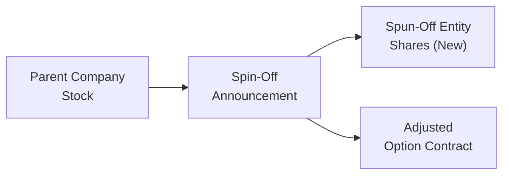
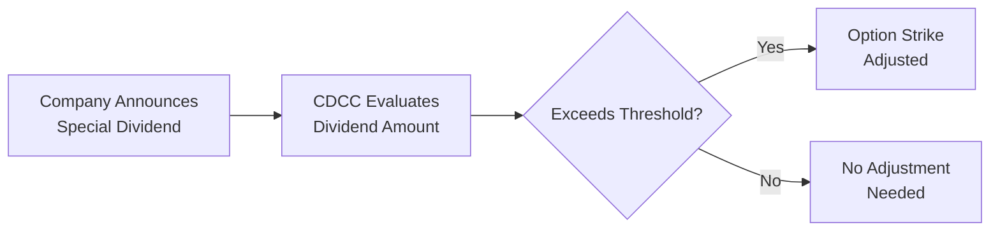

## 31.6 Handling Spin-Offs & Special Dividends

Have you ever noticed a stock price suddenly drop when a company announces that it’s spinning off a subsidiary or paying out a large, one-time dividend? If so, you’re not alone—I remember years ago, a friend phoned me in a bit of a panic, saying, “Uh, why did my shares just tank overnight?” When a firm transitions part of itself into a new entity (a spin-off) or makes an unusually large payout (a special dividend), it doesn’t necessarily mean the value has vaporized. Rather, the distribution changes how investors value the original company’s shares—and it can also change our option contracts pretty significantly.

This section explores how spin-offs and special dividends affect the underlying shares and, in turn, how those corporate events trigger option adjustments at the clearing corporation. We’ll talk about the role of the Canadian Derivatives Clearing Corporation (CDCC) thresholds, highlight best practices in monitoring your positions, and weave in real-life examples so it’s all a bit more concrete.

Understanding spin-offs and special (extraordinary) dividends is essential for effective risk management, especially if you’re trading or holding derivatives. After all, you don’t want to wake up one morning and realize your carefully calibrated option strategy no longer matches your outlook because of an unexpected deliverable adjustment. Let’s walk through the details in a way that (hopefully) keeps you engaged, even if you sometimes find corporate actions a bit, well, dry.

### Spin-Offs and Their Impact on Shareholders

A spin-off happens when a parent company decides to create a new, publicly traded entity—often called a subsidiary or a “carve-out”—and distributes shares of that entity to existing shareholders. In effect, your single stock might become two separate issues to track: stock of the “parent” and stock of the new “spun-off” entity. Suddenly, you have a bit of a mini-portfolio on your hands—one that may or may not align perfectly with your investment strategy.

Spin-offs can be quite exhilarating from a corporate finance perspective. Companies often spin off a segment to provide the spinoff’s management with more autonomy, or to let the market realize an undervalued piece of the parent corporation. From an investor’s vantage point, if the spun-off unit has high growth prospects, these brand-new shares might appreciate as a more “pure play” stock. That said, the parent stock might trade lower on the distribution date—after all, it has effectively parted ways with a chunk of its goodwill, assets, and/or revenue streams.

### Real-World Example: eBay & PayPal

A commonly cited spin-off occurred when eBay spun off PayPal in 2015. Before the spin-off, PayPal was under eBay’s corporate umbrella. After the transaction, eBay shareholders got shares of PayPal as a separate stock, and the eBay share price naturally “adjusted” downward to reflect that PayPal was no longer part of eBay. Options on eBay also got adjusted so that option holders weren’t unfairly disadvantaged (or advantaged) by that corporate action.

### Option Adjustments and the Deliverable

So, you might be thinking, “OK, I get how the parent stock changes. But what about my calls or puts?” Great question. If you held an eBay call option at the time of the spin-off, you would eventually own an “adjusted call” that entitled you to receive a deliverable including both eBay shares and PayPal shares—assuming you exercised it. The precise ratio depends on how many shares of PayPal were distributed per share of eBay, as set by the corporate action.

In Canada, the Canadian Derivatives Clearing Corporation (CDCC) issues notices informing market participants and brokerage firms of these adjustments. If you want to see real-world examples, the Bourse de Montréal also posts corporate action notices, and these are often mirror images of announcements from the parent company. The key point is that, rather than losing or gaining value abruptly, the option strike price and the deliverable get tinkered with so that the economic value of your position remains approximately the same.

In general, an adjusted option’s new deliverable might look something like:

• 100 shares of the original parent company,  
• X shares of the new spun-off entity,  
• Possibly a cash component (though that’s more common with special dividends).

### Visualizing a Spin-Off Adjustment

Below is a Mermaid diagram that illustrates, at a high level, what happens when a company conducts a spin-off. The original parent company (A) announces a spin-off (B), resulting in separate entities (C and D). Options on the parent company can be adjusted to reflect ownership in both the parent and the new spin-off.

The main point here: your adjusted option contract typically entitles you to the same “bundle of value” you had before the spin-off, just split into two (or more) distinct parts.

### Special (Extraordinary) Dividends

Now let’s talk about special dividends. These are typically one-time, non-recurring cash dividends that exceed a certain size threshold set by the clearing corporation. Why is there a threshold? Because small dividends—like routine quarterly distributions—are already reflected in the ongoing pricing of an option. Options traders anticipate “regular” dividends and adjust their strategies accordingly. But a surprise, big dividend can wreak havoc on the normal assumptions about future stock prices and the cost of carry.

In Canada, the CDCC—and the Bourse de Montréal for listed options—use a specific set of guidelines to determine when an option’s strike price should be lowered (and sometimes when the deliverable itself is changed). If the special dividend surpasses that threshold, the option is adjusted to reflect that the underlying stock price will drop by the dividend amount when the stock goes ex-dividend.

One detail that can sometimes surprise folks: if the special dividend is large enough, an option holder might end up with a “new deliverable” that includes some cash. (Imagine your call option entitling you to receive 100 shares plus, say, $2.00 per share times 100 shares, or C$200, upon exercise.) That’s not super common, but it does happen.

### Thinking About Option Pricing

Why do these changes matter so much for traders? Well, the value of a call or put is influenced by the anticipated price of the underlying stock at expiration. When a huge dividend is suddenly announced, the likely scenario is that a “chunk” of the stock price will be paid out in cash. This means:

• Call options might go down in value because the underlying share price is expected to drop by the dividend amount on the ex-div date.  
• Put options might become more valuable for the same reason.  

However, once the clearing corporation adjusts the strike and/or deliverable, the net effect is to keep the option’s theoretical value relatively unchanged. (That said, market participants can sometimes speculate on such announcements and try to profit from mispricings if they believe the market has not fully priced it in prior to official adjustments.)

### Thresholds for Special Dividends

How do you know if a dividend qualifies as extraordinary? Each clearing agency, including the CDCC, has publicly available documentation. You can typically find disclaimers along the lines of: “If a dividend is over x% of the share price or over $Y per share, the option may be adjusted.” The exact thresholds can shift over time or vary by market, so any general statement here might be outdated by your next read. It’s best to check the official notices on the Bourse de Montréal website or, more generally, consult your brokerage’s bulletins.

Here’s a simplified flow diagram for how a special dividend might trigger an adjustment:

### Examples of Special Dividend Adjustments

Let’s say, for instance, a Canadian mining company decides to distribute a $5.00-per-share special dividend to celebrate a surge in resource prices. If the stock typically trades around $30.00, $5.00 is more than a token dividend—it’s a big chunk of the share price. Suppose the threshold used by the CDCC for that class of options is $1.00. That means the exchange is likely to reduce the strike by $5.00 (and possibly recalculate the deliverable), so that your calls or puts remain “fair.”

If you had a $30.00 call, you might see the strike shift to $25.00 after the ex-date. Alternatively, the option might be re-labeled in the market as “XYZ1” (an adjusted ticker symbol) with a note telling you that it entitles you to 100 shares plus the difference in actual cash, or 100 shares of the underlying priced at a lower strike. The actual mechanism can vary, so it’s vital to watch your brokerage notifications and read the official circular from the Bourse de Montréal or the CDCC for details.

### Why These Adjustments Matter

If you’re a buy-and-hold investor who occasionally sells covered calls, it might be easy to overlook corporate events like spin-offs or special dividends. But neither you nor your broker wants a scenario where your option doesn’t reflect the new reality. If there were no adjustments, the option could abruptly become totally mispriced!

Furthermore, from a risk management standpoint, you’ll want to:

• Monitor any pending corporate actions that might affect your positions.  
• Understand that implied volatility can shift around corporate events. (In fact, reading “Option Volatility & Pricing” by Sheldon Natenberg can be super helpful for anticipating changes.)  
• Check updated margin requirements after an adjustment, since the composition of the underlying deliverable can change how risk is calculated.  

### Navigating Market Fluctuations

One subtlety is that the theoretical “fairness” of the adjustment doesn’t always guarantee that the market will price everything perfectly in real time. Before the spin-off or special dividend formally takes effect, you may see volatility patterns that deviate from historical norms. Traders sometimes attempt arbitrage if they identify pricing discrepancies—but keep in mind that you’re competing with many sophisticated participants.

Just to add a bit of personal flavor: Years back, I was caught off guard by a special dividend from a smaller Canadian tech firm. I hadn’t read the corporate bulletins. The day the stock went ex-dividend, it tanked, and I nearly choked on my morning coffee. The “value” was still there theoretically, but for a few hours, the entire option chain looked bonkers because market participants were still digesting the news. Thankfully, it wasn’t a large position, and the volatility settled by day’s end. But it taught me to pay close attention to corporate action notices—and has me regularly checking the Bourse de Montréal’s bulletins whenever I hold options over an earnings date.

### Integrating Regulatory Guidance

As of this writing, all oversight for Canadian investment dealers and mutual fund dealers is consolidated under the Canadian Investment Regulatory Organization (CIRO). The prior regulators—IIROC and MFDA—are now defunct, so if you’re reading older materials, keep in mind those references are strictly historical. CIRO has continued to emphasize the importance of fair treatment and transparency around corporate actions. Meanwhile, the Canadian Derivatives Clearing Corporation (CDCC) and the Bourse de Montréal remain the key bodies guiding listed option adjustments and margin rules.

For official updates on these kinds of adjustments, you can consult:
• CDCC Notices: https://www.cdcc.ca  
• Bourse de Montréal Corporate Action News: https://www.m-x.ca  
• CIRO: https://www.ciro.ca  

### Risk Management Essentials

It’s easy to get caught up in the day-to-day price moves or the excitement of a new spin-off, but from a derivatives standpoint, you want to:

• Look ahead to pending corporate events. If a spin-off or special dividend is rumored, reevaluate your gamma, vega, and delta exposures.  
• Double-check the ex-dividend date of special dividends, particularly if there’s talk of it being large.  
• Maintain open lines of communication with your brokerage or clearing firm. They’ll send official notices (sometimes as email bulletins or in your account messages).  
• Remember that although the clearing corporation’s adjustments aim to keep things fair, the market’s reaction to corporate events isn’t always immediate or rational.

### Common Pitfalls

• Failing to monitor official announcements: Corporate events can be overshadowed by breaking news or macro events, and you may not realize an adjustment is imminent.  
• Misinterpreting record date vs. pay date vs. ex-dividend date: If you assume your option can only be exercised after the dividend is paid, you might be ignoring that the underlying price will change on the ex-date.  
• Assuming “nothing changes” for your option: Even with small spin-offs or smaller special dividends, you need to be sure. Sometimes the threshold is borderline, and the clearing corporation’s final decision can catch you off guard.  
• Liquidity illusions: An adjusted option (often with a new ticker symbol) might see less liquidity than standard contracts. Spreads could widen, so factor that into your exit or roll strategies.

### Additional Resources and Tools

• “Option Volatility & Pricing” by Sheldon Natenberg: Classic text on how corporate events and other factors can affect implied volatility and theoretical pricing.  
• CDCC Website & Regulatory Bulletins: For bulletins that detail upcoming corporate actions affecting Canadian-listed options.  
• Bourse de Montréal Corporate Action Notices: Accessible online; they show you in real time how a corporate action will adjust deliverables.  
• Open-Source Tools: There are a few open-source option-pricing libraries on GitHub that let you model hypothetical scenarios. You can input a drop in the underlying price or add new shares to see how the “bundle” might be valued post spin-off or special dividend.

### Glossary

• Spin-Off: Creation of a separate entity by distributing shares of a new company to existing shareholders of the parent.  
• Extraordinary Dividend (Special Dividend): A notable, non-recurring cash payment that may trigger an adjustment.  
• Parent Company: The original firm from which the spin-off entity is generated.  

### Conclusion

Spin-offs and special dividends can be exciting—and sometimes nerve-racking—events for an investor. They can also be game-changers for option holders if not properly understood. The good news is that adjustments exist to preserve the fair economic value of your options. But it’s up to you (and your friendly team of brokers and clearing notices) to keep track of the details. Hopefully, this overview has given you the confidence to tackle spin-off or special-dividend scenarios with a calm head. Keep an eye on corporate bulletins, be mindful of thresholds, and remember that while the underlying stock price might drop in a hurry, the real story is often more nuanced than a quick glance at the ticker would suggest.

If there’s one final piece of advice I’d reiterate, it’s: Don’t ignore the bulletins. Often, folks who prepare in advance can manage or even profit from these corporate actions, while those who are caught flat-footed can lose money or panic. So stay informed, check official notices, and keep your trading plan flexible. Spin-offs and special dividends can be blessings in disguise if navigated properly, but they do require that extra bit of vigilance in your derivatives toolkit.

## Sample Exam Questions: Spin-Off and Special Dividend Adjustments in Options



### Which statement best describes a spin-off in the equity markets?

- [x] A parent company creates a new independent entity and distributes its shares to existing shareholders.
- [ ] A parent company issues new shares at a discount to current shareholders.
- [ ] A parent company repurchases its own shares in the open market.
- [ ] A parent company merges with a competitor to form a new entity.

> **Explanation:** A spin-off involves the creation of a new, fully independent entity, with shares of that new entity distributed to existing shareholders.

### How do clearing corporations typically respond when a company announces a sizable special dividend?

- [ ] They automatically eliminate all open option positions on the ex-dividend date.
- [x] They may adjust the strike prices or the deliverable of the existing options.
- [ ] They halt trading in the underlying stock indefinitely.
- [ ] They permanently freeze the implied volatility on the options.

> **Explanation:** Most clearing agencies, such as CDCC in Canada, adjust existing options for large dividends so that the overall economic value of each position remains fair.

### In the event of a spin-off, which of the following changes might occur in an adjusted call option?

- [x] The deliverable could become 100 shares of the original company plus a specific number of shares in the new spin-off entity.
- [ ] The adjusted option would convert automatically into a put option.
- [ ] The option would no longer be marginable.
- [ ] The underlying ticker symbol disappears entirely, voiding the option.

> **Explanation:** Clearing organizations typically adjust the details of the option strike price and/or deliverable to reflect the spin-off distribution, which may include shares of the new entity.

### Which factor often determines whether a special dividend will trigger an option contract adjustment?

- [x] Whether the dividend exceeds a threshold set by the clearing corporation.
- [ ] Whether the dividend is paid in common shares of the company.
- [ ] Whether the dividend is less than 0.5% of the stock’s current market price.
- [ ] Whether the company is listed on multiple exchanges simultaneously.

> **Explanation:** When an extraordinary or special dividend surpasses a monetary or percentage threshold (as outlined by CDCC or relevant clearing bodies), it typically triggers an official option adjustment.

### What is one risk associated with adjusted option contracts post spin-off?

- [x] They may trade with reduced liquidity under a new ticker symbol.
- [ ] They always increase in final settlement value.
- [ ] They become invalid after five trading days.
- [x] They are immune to any change in implied volatility.

> **Explanation:** Adjusted contracts, often assigned new symbols, can see altered trading volumes or wider bid-ask spreads. They also remain sensitive to factors like implied volatility (so they’re not immune to volatility changes).

### If a firm issues a $5 special dividend on a share that typically trades around $30, what is the likely clearing corporation response?

- [x] The option strike prices may be reduced by $5.
- [ ] The option strike prices may be increased by $5.
- [ ] All options automatically expire in the money.
- [ ] No change is made unless the dividend is paid in extra shares.

> **Explanation:** A significant cash dividend of $5 on a $30 stock often crosses standard thresholds, prompting the clearing corporation to adjust the strike down by the dividend amount.

### Which organization oversees Canadian investment dealers in today’s regulatory environment, replacing defunct bodies like IIROC and MFDA?

- [ ] The Mutual Fund Dealers Association (MFDA)
- [ ] The Investment Industry Regulatory Organization of Canada (IIROC)
- [x] The Canadian Investment Regulatory Organization (CIRO)
- [ ] The Toronto Stock Exchange (TSX)

> **Explanation:** CIRO is the new self-regulatory organization that oversees investment dealers and mutual fund dealers, after the amalgamation of IIROC and MFDA.

### Why do call options generally decrease in value when a large dividend is announced (assuming no strike adjustment yet)?

- [x] The stock’s anticipated ex-dividend price is lower by the dividend amount, reducing the call’s intrinsic and/or time value.
- [ ] Traders stop selling calls altogether.
- [ ] The dividend automatically transfers to the call holder, thus diminishing the option’s extrinsic value.
- [ ] Regulatory bodies freeze call option trading in response to large dividends.

> **Explanation:** When a big dividend is announced, the market expects the stock to drop by that dividend on the ex-date, impacting the value of calls as the share price is projected to be lower.

### Which resource is particularly recommended for understanding changes in implied volatility around corporate events?

- [ ] “Financial Accounting for Dummies” by Kenneth Boyd
- [x] “Option Volatility & Pricing” by Sheldon Natenberg
- [ ] “How to Day Trade for a Living” by Andrew Aziz
- [ ] “Principles” by Ray Dalio

> **Explanation:** Sheldon Natenberg’s “Option Volatility & Pricing” is a well-known text focusing on how corporate actions and market factors can affect implied volatility.

### True or False: An adjusted option never includes a cash component in its deliverable.

- [ ] True
- [x] False

> **Explanation:** In some cases—particularly with large, special cash dividends—the adjusted option deliverable can include a cash component, ensuring the holder’s economic position remains essentially the same.


