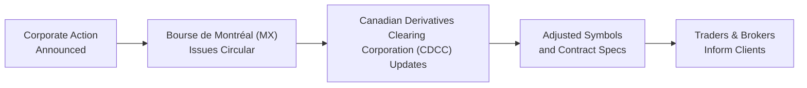

## 31.7 Bourse de Montréal Adjustment Procedures

Have you ever woken up to see that a stock you’ve been trading has suddenly changed its ticker symbol? Or perhaps the share price for your underlying security suddenly looks…different—half as much as before? I remember the first time I sold call options on a stock that announced a 2-for-1 split. The next day, I freaked out just a bit, wondering if my strike prices had magically doubled. That’s when I realized there’s a systematic process for adjusting those listed options, and I wanted to know every detail.

Below, we’ll explore the Bourse de Montréal (often called the “MX”) and its official procedures for adjusting listed options whenever corporate actions—like stock splits, special dividends, and other events—come into play. We’ll see how the Canadian Derivatives Clearing Corporation (CDCC) coordinates with the exchange to keep everyone’s positions fair and accurate. We’ll also talk about how adjustments are communicated (through official bulletins or circulars), how they might show up in your trading platform as “adjusted symbols,” and what record-keeping or margin implications might follow under Canadian Investment Regulatory Organization (CIRO) rules. Let’s jump in.

Bourse de Montréal is Canada’s main exchange for trading equity and index options, and it keeps a close eye on all corporate actions affecting these underlying securities. Essentially, the Bourse aims to ensure that changes—like the number of shares you control per contract or the strike prices—reflect economic reality after a corporate event. Let’s go step-by-step, explaining how all this works in practice.

  
Bourse de Montréal’s Approach to Adjustments

Whenever a listed company announces something that can alter the price or quantity of its outstanding shares, the Bourse de Montréal and the CDCC step in to figure out how to “translate” that corporate event into the existing option contracts. The major events that usually force an option adjustment include:  
• Stock splits (2-for-1, 3-for-1, etc.)  
• Reverse stock splits (1-for-2, 1-for-3, etc.)  
• Stock dividends and special cash dividends  
• Rights issues (for new share subscriptions)  
• Mergers, acquisitions, or spin-offs  

The primary objective is to keep the option holder’s rights—and the option writer’s obligations—in line with the new state of the underlying security. If an option was “covering” 100 shares at a strike of $50, a 2-for-1 split shouldn’t magically reduce an existing call holder’s beneficial interest. Instead, you typically now have an option that might encompass 200 shares at a $25 strike. That way, if the share price rises post-split, you get the same dollar benefit you would have had before the split.  

  
Circulars and Official Communication

One of the things I love about the Bourse de Montréal is their streamlined approach to official circulars. Every time there’s a potential adjustment, the Bourse issues a “circular” (a bulletin) that basically breaks down step-by-step how each option contract will be changed. These bulletins divvy up crucial details, such as:  
• The new contract multiplier (e.g., from 100 shares to 200 shares)  
• The adjusted strike price or strike increments  
• Changes to the underlying symbol (e.g., from ABC to ABC1)  
• Effective date of the new contract specs  
• Any new ticker that market data feeds might show  

Market participants—especially your brokerage firm—are expected to track these circulars. And if you’re someone who trades a lot of options, it’s a good habit to keep a tab on the Bourse’s website (https://www.m-x.ca/en/notices) or check your broker’s notices to see if anything is affecting your positions.  

The circular often signals that something big is happening the morning the corporate action takes effect (often just after the close on the day before). Or sometimes, it might even happen mid-session, though that’s less common. The crucial part is that once the new terms are official, your option contract is locked into these new “adjusted” parameters, and the old ones are effectively replaced.  

  
Coordination with the CDCC

The Canadian Derivatives Clearing Corporation (CDCC) sits at the center of the clearing and settlement universe for many derivatives in Canada, including options traded on the Bourse de Montréal. The CDCC is basically your fallback. If you have an option contract, it’s effectively guaranteeing that your exercised calls or assigned puts are delivered as promised. So, it’s super important that the CDCC is part of the adjustments process.  

When the Bourse announces that an adjustment is needed, the CDCC also publishes its own updates confirming the new settlement terms. If you’re looking at your brokerage’s statements—like the specification page for your positions—the clearing corporation’s stamp of approval ensures that the changes are recognized by everyone else in the chain.  

  
Why We Need Adjustments: Fairness Across the Board

Let’s pretend you sold a call option with a strike price of $50 on a stock that’s trading at $55. Suddenly, the issuer announces a 2-for-1 stock split. If we didn’t adjust the options, your buyer could technically call away 100 shares from you at $50, but the underlying shares might now be trading near $27.50 in “split-adjusted” terms. That mismatch is obviously unfair.  

By adjusting the contracts to represent 200 shares at a $25 strike, the Bourse ensures that any profit or loss from price movements remains the same, relative to the new share price. No one is given a “free lunch,” and it also prevents someone from getting swindled in the process.  

  
Adjusted Symbols on Your Trading Platform

Here’s something that might make you do a double take: if you’re used to seeing an option on “ABC,” you might find an adjusted version sporting an “ABC1” or “ABC2” ticker after the corporate action. Usually, the Bourse and your broker will rename or re-suffix these adjusted contracts.  

The reason? We still need standard options on the “brand new” version of the stock for trades that occur after the event. But the old open interest—people who were already in the game—needs to continue reflecting the “pre-event” security but in new, adjusted terms. So, if new standard options are launched, they’ll keep the regular symbol, while the adjusted ones get a suffix to set them apart.  

When you see “ABC1” contracts in your portfolio, don’t panic. It just means your “ABC” position was adjusted. The premium, margin, and everything else now revolve around new share numbers, new strike increments, etc. If you plan to close or roll your position, be sure to pay attention to whether you’re targeting the new adjusted contract or the brand-new standard contract series.  

  
Common Corporate Action Scenarios

Stock Split Example  
Imagine you have a single $40 call contract on a stock trading at $42, and the underlying claims a 2-for-1 split. Before the split, your contract covers 100 shares at a $40 strike, for a total deliverable of 100 × $40 = $4,000.  

After a 2-for-1 split, each share is “halved” in price, so $42 becomes roughly $21, all else being equal. The new contract covers 200 shares at a $20 strike (assuming the Bourse uses precise calculations to handle any fractional remainders). Your total deliverable is 200 × $20 = $4,000. Same total notional exposure, just doubled shares at half the strike.  

  
Cash Dividend Example  
Special cash dividends can be trickier since not every little quarterly dividend triggers an option adjustment—especially if it’s “ordinary course.” But larger, extraordinary dividends (often announced as “special dividends”) might require an adjustment to ensure your option strike is effectively reduced to reflect the distribution.  

If a company announces a special one-time $1.00 dividend, the new strike might end up being $39 (instead of $40) or some fractional variant if the Bourse decides that the impact on share price is substantial. You’d check the Bourse’s official bulletin to see the precise formula.  

  
Rights Issue Example  
Rights issues allow existing shareholders to buy new shares at a discount, potentially diluting the existing equity if you don’t participate. If you hold calls and the underlying stock’s price gets diluted, you’d want your call’s strike or share count adjusted so you’re not left “paying” for that dilution. The Bourse might add extra shares to the deliverable (or shift your strike lower) if the event meets the relevant thresholds for an option adjustment.  

  
Mermaid Diagram of the Adjustment Flow

Below is a quick flowchart representing how these corporate actions cascade through the system:

As soon as that circular is published, the adjustments get reflected on trading platforms. Margin requirements might change slightly (depending on the new strike and share count), but typically the “risk profile” remains the same from an economic standpoint.  

  
Record-Keeping and Client Disclosure: CIRO Requirements

Since January 1, 2023, we have a single self-regulator in Canada: the Canadian Investment Regulatory Organization (CIRO). If you’ve heard of IIROC or MFDA, note that as of June 1, 2023, they amalgamated into CIRO. Under CIRO rules, your brokerage or firm must keep accurate records whenever adjustments to your options positions occur.  

Clients should be informed promptly—generally through account statements, trade confirmations, or possibly direct notifications—that their contract specs changed. This is crucial because your margin requirements may shift, your deliverable might be a different number of shares, and you need to know all that so you don’t get blindsided.  

Brokers subject to CIRO guidelines have to ensure:  
• They update margin calculations once the option is adjusted.  
• They communicate changes in a timely manner.  
• They maintain proper disclosure so that a statement showing “1 call @ $50 strike ABC” doesn’t suddenly become “1 call @ $25 strike ABC1” without explanation.  

In a way, the forced discipline around disclosure helps keep everyone on the same page. You, your broker, and the clearing corporation all see the same numbers.  

  
Practical Considerations and Best Practices

Monitoring Corporate Actions  
Seriously, if you hold options, especially large positions or near expiration, keep an eye on the news for that underlying stock. Even a rumor of a special dividend or a major spin-off can signal changes ahead. By staying proactive, you won’t be caught off guard when an official circular lands.  

Understanding Suffixes and Series  
When the Bourse adjusts an option, it might create new series or keep the old series but rename them. Make sure to look up the adjusted symbol so you don’t accidentally close the wrong position. That’s a classic error: you try to unwind your call but unknowingly pick the standard contract (that’s listed post-event) rather than the “adjusted” contract.  

Margin Implications  
Let’s say your margin requirement was $1,000 for a short call. Now that the contract covers more shares (like 200 instead of 100 for a 2-for-1 split), your broker might re-check that margin formula. Usually, the dollar amount at risk remains consistent with the “pre-adjusted” scenario. But if the underlying’s volatility changed, or if there’s any rounding that alters the final strike, that margin requirement can shift.  

Handling Fractional Adjustments  
Sometimes you get those weird 3-for-2 splits or complicated rights offerings that produce decimal expansions. In these more unusual cases, the Bourse and the CDCC might tweak the final numbers to avoid fractional shares in the deliverable. For instance, instead of giving you 150 shares, they might give you 100 shares plus some cash compensation. The circular would detail exactly how that’s handled, ensuring fairness.  

Roll Strategy Adjustments  
If you’re someone who frequently rolls expirations—like rolling a short “front-month” call to a “back-month” call—double-check that you’re rolling from an adjusted position to the correct new month. If your position is labeled “XYZ1” and the next standard contract is just “XYZ,” that might be an apples-to-oranges comparison once adjustments go live.  

  
A Hypothetical Case Study with Dividends

Let’s say a company named Maple Leaf Robotics Inc. (fictitious) trades at $50. They announce a special one-time dividend of $5 per share. That’s big enough to warrant an option adjustment. The Bourse might reduce your existing option strike by $5 the day after the ex-dividend date.  
• Pre-adjustment: 1 contract = 100 shares @ $50 strike  
• Post-adjustment: 1 contract = 100 shares @ $45 strike + “MLR1” as the ticker  

Your broker’s margin calculations and your payoff diagrams remain effectively the same. But if you’re an option writer, you need to realize that if those calls get exercised, you’ll now be “called away” at $45, not $50 (which is balanced out by the fact the underlying has been effectively reduced by that $5 distribution).  

  
Regulatory Oversight

CIRO sets forth the guidelines that require each investment dealer to follow best practices in record-keeping and client disclosure. The Bourse de Montréal sets listing requirements and operational rules for regulated derivatives, while the CDCC handles clearing. All three, in synergy, ensure that any corporate action leads to consistent, transparent adjustments.  

Historically, you might see references to IIROC or the MFDA, but these days, they’re defunct. If you see old legacy references or links, just treat them as historical background. The “new world” is all about CIRO’s integrated approach and a single self-regulatory body.  

  
Key Takeaways

• Bourse circulars are your primary source for info on how option adjustments work.  
• Adjusted symbols (e.g., ABC1) exist to differentiate old, adjusted contracts from newly listed standard contracts.  
• Coordination with the CDCC ensures that every participant is on the same page with updated contract specs.  
• Keep an eye on corporate actions if you hold large or near-expiration positions.  
• Watch your statements and confirm that your margin treatments reflect the updated details.  
• CIRO’s rules ensure your dealer must provide clear disclosures on any changes to your positions.  

  
References and Additional Resources

• Bourse de Montréal Circulars: <https://www.m-x.ca/en/notices>  
• CIRO’s margin rules and guidelines: <https://www.ciro.ca>  
• Canadian Securities Institute (CSI) advanced programs: Check out specialized courses offered by CSI that delve deeper into corporate actions and derivatives adjustments.  
• For open-source financial tools, you can explore GitHub repositories that track corporate actions and show the effect on options-chains (though these often require some programming knowledge).  

If you’re curious, some participants even keep personal spreadsheets loaded with macros that track corporate action announcements for the stocks they monitor. It might sound nerdy, but it sure is handy.  

Anyway, life is full of changes, and the stock market is no different. The Bourse de Montréal just makes sure you don’t get blindsided if your underlying decides to morph overnight.  

---

## Sample Exam Questions: Bourse de Montréal Adjustment Procedures



### Which entity issues the official circulars that detail option contract changes at the Bourse de Montréal?

- [ ] CIRO
- [x] The Bourse de Montréal (MX)
- [ ] The Bank of Canada
- [ ] Canadian Securities Institute (CSI)

> **Explanation:** The Bourse de Montréal issues circulars (bulletins) informing market participants about corporate actions and the corresponding adjustments to option contracts.  

### How does the CDCC coordinate with the Bourse regarding corporate action adjustments?

- [x] The CDCC confirms and implements the adjusted contracts outlined in the Bourse’s circulars.
- [ ] The CDCC only enforces margin requirements and does not handle adjustments.
- [ ] The CDCC conducts corporate actions independently without consulting the Bourse.
- [ ] The CDCC only communicates changes to professional traders.

> **Explanation:** The Canadian Derivatives Clearing Corporation (CDCC) collaborates closely with the Bourse to confirm, update, and clear new contract specifications after any corporate event triggers an adjustment.

### If a stock undergoes a 2-for-1 split, what typically happens to an outstanding call option covering 100 shares?

- [x] It is adjusted to cover 200 shares and the strike price is halved.
- [ ] It remains the same because stock splits do not affect listed options.
- [ ] It is automatically cancelled and reissued by the Bourse.
- [ ] It immediately expires.

> **Explanation:** Option adjustments after a 2-for-1 split usually result in twice as many shares at half the strike price, mirroring the economic effect of the split.

### Why might a dividend cause only some option contracts to be adjusted?

- [ ] All dividends trigger option adjustments automatically.
- [x] Adjustments are typically for special or extraordinary dividends, not routine ones.
- [ ] Dividends only affect the call side, not puts.
- [ ] Dividends are always immaterial to the option’s strike price.

> **Explanation:** Ordinary course dividends are priced into the market, so not all dividends lead to an adjustment. Special or large dividends trigger formal adjustments to keep the contract’s economics fair.

### Which of the following is a typical reason for using an adjusted symbol (like ABC1)?

- [ ] To confuse traders so they can't close positions easily.
- [ ] To punish traders for not monitoring corporate actions.
- [x] To differentiate adjusted contracts from newly listed standard contracts.
- [ ] To label illiquid option series.

> **Explanation:** When contracts are adjusted, the Bourse often adds a suffix to distinguish them from standard options listed after the corporate event.

### What role does CIRO play in the context of option adjustments?

- [ ] CIRO has no authority over option adjustments.
- [ ] CIRO directly sets the new strike prices for adjusted contracts.
- [ ] CIRO is the clearing corporation that processes settlement.
- [x] CIRO enforces rules around disclosure, record-keeping, and margin for adjusted option positions.

> **Explanation:** CIRO (formed by the amalgamation of IIROC and MFDA) oversees regulatory compliance, requiring correct record-keeping, margin calculations, and client disclosures whenever options are adjusted.

### In the event of a complex 3-for-2 stock split, which of the following tends to occur?

- [ ] All options are automatically terminated.
- [x] The Bourse may adjust the number of shares plus strike prices, potentially rounding to avoid fractional shares.
- [ ] The strike price is always unchanged but deliverable shares are fractional.
- [ ] The market is closed for an entire week to figure out the new terms.

> **Explanation:** The Bourse keeps the total economic value consistent, often rounding shares or providing a cash component if the split ratio creates fractional shares.

### If you see “XYZ” and “XYZ1” calls listed on your platform for the same expiry, how should you proceed?

- [ ] Assume they are identical and trade either one interchangeably.
- [x] Confirm which is the adjusted option and which is standard, then place orders accordingly.
- [ ] Avoid trading both because having multiple series is an error.
- [ ] Immediately exercise your old calls to simplify your positions.

> **Explanation:** The existence of “XYZ1” typically indicates an adjusted contract. Understanding these symbols is crucial to avoid closing or rolling into the wrong series.

### Why would your margin requirements change after an option adjustment?

- [ ] Because the Bourse cancels your entire account and re-opens it with the new margin rates.
- [x] Because the number of shares covered or the strike price changes, altering the notional amount.
- [ ] Because all adjusted options automatically become in-the-money.
- [ ] Because margin doesn’t apply once an option is adjusted.

> **Explanation:** A change in the contract’s underlying deliverable or strike price may shift the notional risk profile and thus alter your margin requirement.

### True or False: After January 1, 2023, investment dealers must comply with IIROC and MFDA rules independently.

- [ ] True
- [x] False

> **Explanation:** IIROC and MFDA were amalgamated into CIRO, so dealers now adhere to CIRO’s integrated rulebook.  


