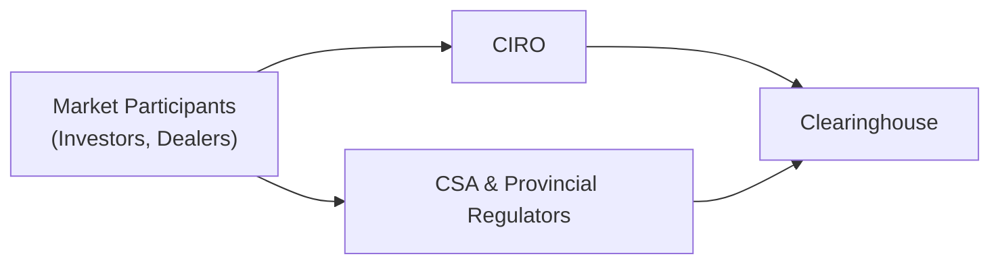
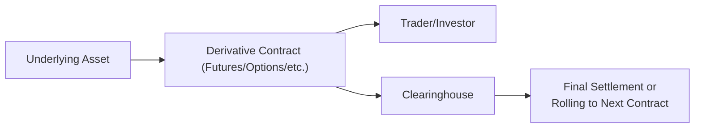

## 32.1 Introduction to Derivatives

Have you ever heard someone casually mention they “hedged their bets” in the stock market or talk about “futures” for corn and wondered what on Earth they meant? I certainly did the first time I heard it—there was so much jargon, I couldn’t help but imagine something out of a sci-fi movie. But the term derivatives is actually more straightforward than it might seem: these are financial contracts that derive their value from something else, often called an underlying asset. That underlying asset could be a commodity like gold, a stock like a major Canadian bank, or even an interest rate or currency exchange rate. In any case, the key point is that a derivative on its own isn’t worth anything unless it’s tied to something else.

The basic idea is that participants in the market—be they large institutions, small retail investors, or specialized traders—enter into these contracts to manage risk, speculate on future price moves, or enhance returns through leveraging. Derivatives come in many shapes and sizes, but they typically fit into four main categories: forwards, futures, options, and swaps. Let’s dig into what makes derivatives tick, why they’re used, how technology has shaped their evolution, and why the Canadian Investment Regulatory Organization (**CIRO**) and other regulators work so hard to keep the marketplace safe and fair.

### The Nature of Derivatives

A **derivative** is, at its core, a contract or financial instrument whose value arises from movements in the price or rate of an underlying interest. If I buy an option on Canadian crude oil, for instance, that option’s value changes in response to fluctuations in crude oil pricing. The same goes for interest rate futures that shift in response to announcements from the Bank of Canada. Since the underlying fluctuations determine the price, derivatives allow us to either offset or magnify those movements, depending on our objectives.

This whole idea might seem a bit lofty, so imagine you’re a farmer worried about the price of wheat when harvest time arrives. If the price drops too low, your income is threatened. You could use a futures contract—a kind of derivative—to lock in a sale price now, effectively protecting yourself from a price collapse in the future. A derivative in this sense becomes a kind of roadside assistance for market participants: you hope you never need it, but if you do, you’ll be glad you have the coverage.

### Primary Categories of Derivatives

Market professionals typically group derivatives into four main types: **forwards**, **futures**, **options**, and **swaps**. Of course, there are countless variations and custom products out there, such as **credit derivatives** and **structured notes**, but the four biggies are:

• **Forwards:** Private, customizable agreements between two parties to buy or sell an underlying asset at a specified future date, at a price agreed upon today.  
• **Futures:** Very similar to forwards yet standardized and traded on regulated exchanges. You can’t, say, negotiate your own specialized expiry date or quantity. Instead, the contract terms (like quantity, quality, settlement, etc.) are standardized.  
• **Options:** Contracts granting the holder the right, but not the obligation, to buy or sell an underlying asset at a specific price on or before a particular date. A call option lets you buy, while a put option lets you sell.  
• **Swaps:** Agreements to exchange cash flows or financial instruments. The most common is an **interest rate swap**, in which two parties exchange floating-rate and fixed-rate interests to manage interest rate risk.

You’ll also encounter specialized instruments such as **credit derivatives**, which transfer the credit risk of a bond or loan from one party to another, and **structured notes**, which are essentially debt with embedded derivatives that alter their risk-return profile.

### Key Purposes of Derivatives

Derivatives are used for three primary reasons: **hedging**, **speculating**, and **leveraging**.

**Hedging** is like buying insurance. If a Canadian export firm fears a drop in the USD/CAD exchange rate will hurt its revenue, it can hedge by entering into a derivative that profits if the exchange rate declines, offsetting (or at least reducing) losses on its actual business.

**Speculation** is an attempt to profit from price movements. Perhaps you observe that silver prices, in your opinion, are about to surge because of new industrial demand, so you decide to buy silver futures or calls on a silver Exchange-Traded Fund (ETF). If you guess right, you enjoy (hopefully) a nice gain; guess wrong, and you face a loss.

**Leveraging** is a magnifier. Using relatively small amounts of capital, you can control larger positions in underlying assets. This can generate big profits on minimal moves in the underlying—also big losses, if the market turns against you.

### Technology and Global Markets

Historically, derivatives were traded in person on exchange floors, with traders wearing color-coded jackets and yelling orders at each other (the old “open outcry” system). Today, it’s largely an electronic game. Technological advancements have democratized and globalized derivatives trading:

• **Exchange-Traded** derivatives are accessible via online broker platforms.  
• **Over-the-Counter (OTC)** markets have grown larger, thanks to instantaneous global communication networks, enabling custom contracts between counterparties around the world.  
• **Algorithmic and High-Frequency Trading** (HFT) strategies let sophisticated participants trade incredibly fast, reacting to market signals in milliseconds or microseconds.  

For everyday retail investors, electronic trading platforms have removed many of the old barriers to entry. It’s now possible for an individual with a modest account, a stable internet connection, and the appropriate knowledge (and license) to trade options on Canadian stocks or even commodity futures on global markets. But with great power comes great responsibility, to borrow a phrase, which is why rigorous regulation and risk management strategies are crucial.

### Regulatory Context in Canada

Up north, Canada has its own unique patchwork of provincial securities regulators coordinated through the **Canadian Securities Administrators (CSA)**. The CSA seeks to harmonize policy across provinces. Meanwhile, **CIRO** is the national self-regulatory body, responsible for overseeing both investment dealer and mutual fund dealer activities. CIRO was formed on January 1, 2023, through the amalgamation of the defunct IIROC and MFDA. If you see references to those older names, they are strictly historical.

Canadian law requires that certain derivatives-related activities be conducted under the scrutiny of authorized marketplaces, with mandatory reporting of trades to recognized trade repositories, especially in the OTC space. Also, dealers must meet proficiency standards—if you’re giving advice regarding derivatives, you’ll need specialized training, like that provided by the Canadian Securities Institute (CSI), among others.

Below is a simple diagram showing how regulators, clearinghouses, and market participants interact:

CIRO sets and enforces rules for its member firms, addressing matters like margin requirements, sales practices, client disclosures, and registration. At the same time, clearinghouses, such as the Canadian Derivatives Clearing Corporation (CDCC), stand in the middle of transactions to mitigate counterparty risk. One of the biggest goals of these institutions is ensuring transparency and stability—nobody wants the entire marketplace to unravel because a single large derivative contract goes sour.

### Amplifying Gains and Losses

Given derivatives’ potential for leverage, it’s important to stress that they can either boost your gains or dramatically scale up your losses. For example, if you place a small margin deposit on a futures contract controlling a large position in crude oil, a minor price move in your favor can supercharge your returns. But if that price moves in the opposite direction, you can face large losses—potentially exceeding your initial deposit.

That’s why prudent risk management matters so much. Even if you’re primarily hedging, you need to think about the complexities of the product, including potential “basis risk” (where the hedge doesn’t move in perfect tandem with the underlying exposure) and liquidity constraints that can make exiting a position trickier than expected.

### Role of the Canadian Securities Administrators (CSA)

The **CSA** coordinates many aspects of Canada’s securities legislation, including derivatives rule-making. They’re active in helping craft national instruments that impose trade reporting, clearing, and margin requirements for certain OTC derivative contracts. If you’re aspiring to become licensed for derivatives trading, or if you manage or advise on derivative strategies, the CSA’s proposed and adopted rules can have a huge impact on what you can do and how you do it.

In many cases, are you required to clear a swap through a central counterparty? Must you report all your trades to a recognized trade repository within a specific time window? These are the sorts of questions the CSA clarifies. According to them, each derivative transaction’s terms, and the participants involved, must meet prescribed conditions to ensure the broader market’s integrity. This typically includes the standardization of certain contract features and robust risk controls.

### Less Common Derivative Products

Beyond just your vanilla options or futures, the marketplace presents a whole array of specialized products.

• **Credit Derivatives:** Tools like Credit Default Swaps (**CDSs**) allow the transfer of credit risk from one party to another—kind of like buying insurance on a corporate or government bond.  
• **Structured Notes:** Often pitched to investors who want principal protection (or partial protection) plus some upside linked to a stock index or commodity. Be mindful that fees and complexities can be high.

During the financial crisis in 2008 (which I recall quite vividly as a real eye-opener about how interconnected global markets are), credit derivatives drew a lot of scrutiny. The meltdown exposed just how large and opaque certain derivatives markets had become. Since then, there’s been a global push, including from Canadian authorities, toward more transparency and clearing requirements.

### Risk Management Essentials

Think of derivative risk management like driving a car. It can be thrilling, but it demands your full attention. Using derivatives responsibly involves thoroughly understanding position-sizing, monitoring margin, anticipating worst-case scenarios, and not forgetting the possibility of “unknown unknowns.” In other words, there might be market dislocations, liquidity crises, or other tail risks that you need to plan for.

Many Canadian investment dealers require high levels of disclosure to clients about these possibilities. If you read through a derivatives risk disclosure statement, it might seem painfully long, but it’s vital to grasp those details so you’re not caught off-guard. Some best practices include:

• Setting well-defined **stop-loss orders** or other exit strategies for speculative positions.  
• Regularly rebalancing or rolling hedges if you’re trying to protect a portfolio.  
• Keeping an eye on correlation assumptions, especially if you’re diversifying across multiple assets in a volatile market.

### Organizations and Resources

Aside from CIRO and the CSA, we also look to the **Bank of Canada** for guidance on interest rate trends that shape the pricing of interest rate futures and swaps. The **Canadian Investor Protection Fund (CIPF)** stands ready if a member firm becomes insolvent, protecting client accounts up to certain limits.

For more technical aspects, especially advanced pricing or modeling, many practitioners and academics turn to open-source libraries like **[QuantLib](https://www.quantlib.org)**. If you’re more academically inclined, there’s no better place to sharpen your fundamentals than John Hull’s “Options, Futures, and Other Derivatives.” Canada’s capital markets are also shaped by the **Toronto Stock Exchange (TSX)** and the **Bourse de Montréal**, which is the primary derivatives exchange in Canada. Bourse de Montréal lists key derivatives like equity options, index options, and interest rate futures.

### A Look at a Simplified Derivatives Flow

To tie it all together, here’s a simplified representation of how a derivative might come into existence and reach a final settlement:

1. The **Underlying Asset** price changes, influencing the value of the **Derivative Contract**.  
2. The **Trader/Investor** initiates a position in the derivative via an exchange or OTC channel.  
3. The **Clearinghouse** intermediates, guaranteeing settlement if exchange-traded.  
4. At expiration (or before), positions are either offset, exercised, or closed out, leading to a final resolution of gains/losses or a roll into a new contract.

### Concluding Thoughts

Derivatives can be an incredibly powerful part of a financial toolbox—like a Swiss Army knife for the markets—but also come with serious responsibilities and potential pitfalls. You can hedge real risk, speculate on targeted moves, or structure payoff profiles unimaginable with just stocks and bonds. At the same time, leverage cuts both ways, and credit or liquidity issues can turn an optimistic plan into a disaster.

In Canada, the oversight by **CIRO**, the **CSA**, and clearing agencies ensures a level of transparency and stability. It’s all designed so that participants can trade derivatives with confidence. However, no matter how regulated or transparent the system is, the onus remains on each participant to understand precisely what they’re getting into. After all, knowledge and diligence are the true underpinnings of success in any market—especially one as dynamic and evolving as the modern derivatives arena.

### Glossary Review

• **Underlying Asset:** The financial instrument (e.g., stock, commodity, or index) on which a derivative’s value is based.  
• **Clearinghouse:** An entity, like the CDCC, standing between buyer and seller, ensuring the settlement of trades and reduction of counterparty risk.  
• **Hedging:** A strategy to offset or reduce potential losses from adverse price movements.  
• **Speculation:** Taking a position based on the expectation of profit from future price changes in the underlying.  
• **Leveraging:** Using borrowed capital or derivatives to control a larger position, magnifying both gains and losses.  
• **Credit Derivatives:** Instruments (like CDSs) that allow the transfer of credit risk between parties.  
• **Structured Note:** A debt security that includes embedded derivatives, potentially altering its payout in complex ways.  
• **CIRO:** The Canadian Investment Regulatory Organization, overseeing investment dealers, mutual fund dealers, and market integrity for Canadian markets.

### Additional Resources

• **CIRO (Canadian Investment Regulatory Organization):** Visit [www.ciro.ca](https://www.ciro.ca) for up-to-date regulatory guidelines, proficiency requirements, and investor protection resources.  
• **QuantLib:** Open-source quantitative finance library, see [www.quantlib.org](https://www.quantlib.org) for details on pricing models and analytics.  
• **Bank of Canada (www.bankofcanada.ca):** Policies affecting interest rate futures and monetary policy in Canada.  
• **Canadian Securities Administrators (CSA):** For national instruments and harmonized regulations.  
• **“Options, Futures, and Other Derivatives” by John C. Hull:** A classic textbook for theoretical and practical knowledge of derivatives.  
• **Canadian Securities Institute (CSI):** Offers certification courses and designations relevant to derivatives licensing in Canada.

---

## Sample Exam Questions: Introduction to Derivatives Key Concepts



### Which of the following best describes a derivative instrument?

- [x] A financial product whose value is based on an underlying asset or reference rate.
- [ ] A physical asset that’s traded on spot markets.
- [ ] A savings account with a guaranteed rate of return.
- [ ] A standardized insurance policy against natural disasters.

> **Explanation:** A derivative’s value depends on movements of an underlying asset, such as a stock, commodity, or interest rate, rather than having intrinsic value on its own.

### What is a key difference between options and futures?

- [x] Futures create an obligation to buy or sell, while options grant a right but not an obligation.
- [ ] Options cannot be traded on exchanges, while futures are always OTC.
- [ ] Futures have no margin requirements, whereas options do.
- [ ] Options are strictly interest rate instruments, while futures only reference commodities.

> **Explanation:** An option gives the holder the right (not the obligation) to buy or sell the underlying asset, whereas a futures contract obligates both parties to transact at expiration.

### A Canadian agriculture producer uses canola futures to protect future sales revenue. This is an example of:

- [ ] Speculation.
- [ ] Leveraged speculation.
- [ ] Arbitrage.
- [x] Hedging.

> **Explanation:** The producer is hedging price risk by locking in a price, reducing the adverse impact of potential price drops in the canola market.

### Which organization is responsible for overseeing investor protection if a Canadian member firm becomes insolvent?

- [x] The Canadian Investor Protection Fund (CIPF).
- [ ] The Bank of Canada.
- [ ] A provincial securities regulator.
- [ ] The World Bank.

> **Explanation:** CIPF protects client assets at Canadian member firms if that firm becomes insolvent. This includes coverage for assets like derivatives positions up to certain limits.

### Which best describes credit derivatives like Credit Default Swaps (CDSs)?

- [ ] They allow trading in foreign exchange markets more efficiently.
- [ ] They remove all market-wide credit exposure from a lender’s balance sheet.
- [x] They transfer credit risk from one party to another.
- [ ] They are used exclusively to hedge currency fluctuations.

> **Explanation:** CDSs and other credit derivatives are designed to shift the risk of a borrower’s default from one party (e.g., a lender) to another (the protection seller).

### In Canada, which of the following statements about the CSA is correct?

- [ ] It is a single federal regulator for capital markets in Canada.
- [x] It is a coordinating body of provincial and territorial securities regulators.
- [ ] It reports directly to the World Trade Organization.
- [ ] It only oversees equity markets, not derivatives.

> **Explanation:** The CSA (Canadian Securities Administrators) is a collaborative body representing the various provincial and territorial regulators, aiming to harmonize regulatory practices throughout Canada.

### Which of the following primarily distinguishes futures from forwards?

- [x] Futures are standardized and exchange-traded, while forwards are customized and traded OTC.
- [ ] Futures are only used for currency hedges, while forwards are for agriculture.
- [ ] Futures cannot be settled for cash, whereas forwards always settle that way.
- [ ] Forwards always require daily margining, while futures do not.

> **Explanation:** Futures are standardized contracts traded on an exchange with defined rules for margining, settlement, and contract sizes. Forwards are private agreements with flexible terms, generally traded OTC.

### What is the main advantage of using a clearinghouse for exchange-traded derivatives?

- [ ] It allows for unlimited speculation with no margin payments.
- [ ] It removes the need for professional qualifications when trading.
- [x] It mitigates counterparty risk by standing between buyers and sellers.
- [ ] It guarantees profits for hedgers.

> **Explanation:** Clearinghouses, such as the Canadian Derivatives Clearing Corporation, reduce counterparty default risk by ensuring financial obligations are met via margin and clearing fund mechanisms.

### When an investor uses derivatives primarily to gain additional market exposure without increasing their own cash outlay, the investor is utilizing:

- [ ] Hedging.
- [x] Leverage.
- [ ] Arbitrage.
- [ ] Fundamentally-driven speculation.

> **Explanation:** Derivatives can provide leveraged exposure, allowing investors to control a larger nominal value of assets with less initial capital.

### True or False: A properly executed hedging strategy guarantees zero loss for the hedger regardless of underlying price movements.

- [x] True
- [ ] False

> **Explanation:** This is a tricky one: Although hedging reduces or offsets potential losses, there are scenarios (e.g., basis risk, incomplete coverage) where not all losses are eliminated. That said, in certain perfect hedge scenarios, a hedger can theoretically lock in a price. Still, practical constraints and costs often mean real-life hedges fall short of perfection.


