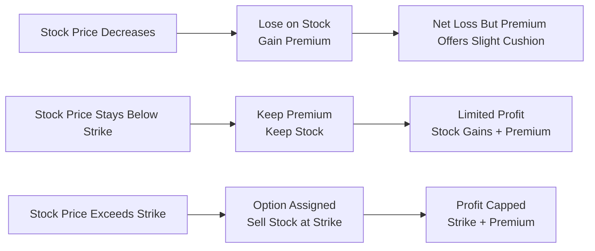
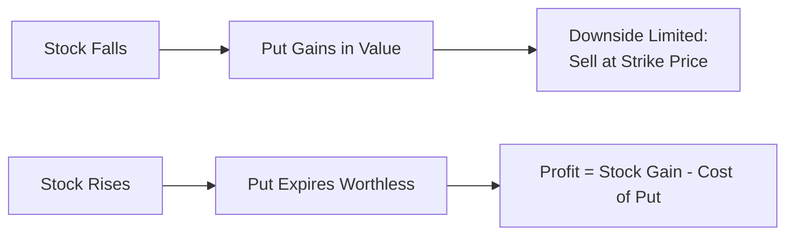
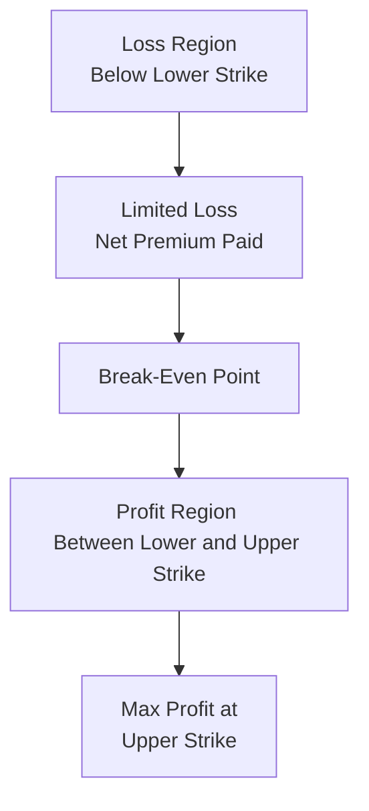

## 32.10 Strategies Based on Market Outlook and Risk Tolerance

It’s funny how “risk tolerance” can sound so impersonal—like it’s just another checkbox on a form. But if you’ve ever had that nervous pit in your stomach after placing a big trade (yep, I’ve been there), you know that “risk tolerance” is really about your comfort level with uncertainty. Whether you’re bullish on oil prices because of supply constraints, worried about prolonged market downturns, or simply trying to earn some premium in a sideways market, having a strategy that matches both your outlook and your capacity for risk is critical. And for that, derivatives can be a powerful toolkit.

This section dives into a variety of well-known derivatives strategies—covered calls, protective puts, straddles, spreads, and more—each calibrated for different market environments. We’ll see how these strategies can limit downside risk, capture upside, or even capitalize on big expected moves in volatility. We’ll also reference relevant Canadian regulations and guidelines, particularly from the Canadian Investment Regulatory Organization (CIRO), to illustrate how compliance and best practices shape the advice professionals give to clients.

Let’s explore how you can build a derivatives strategy that aligns with your market outlook and the level of risk you (or your clients) are actually cool with.

  
A Quick Overview of Key Terms (From Our Glossary)

• Covered Call: Generating income on a stock already owned by selling (writing) a call option against it.  
• Protective Put: Buying a put option to limit the downside on a stock position you hold.  
• Straddle: Going long (or short) a call and a put with the same strike and expiration, typically when you expect big moves in the underlying but are uncertain of the direction.  
• Spread: An option position composed of two or more options on the same underlying (calls or puts) that limits risk/cost.  
• Volatility: A measure of the magnitude of price fluctuations in the underlying market or security.  

These definitions are our foundation. Let’s see how they fit into real-world scenarios.

  
The Intersection of Market Outlook and Risk Tolerance

Understanding your (or your client’s) market outlook is only half of the equation. The other half is risk profile, which includes both emotional risk tolerance (fear, stress, frustration, etc.) and practical constraints (margin availability, portfolio size, compliance with CIRO margin rules, etc.).  

• Bullish Outlook: Belief that prices will rise (e.g., equity markets or a particular commodity).  
• Bearish Outlook: Belief that prices will fall.  
• Neutral/Range-Bound Outlook: Belief that prices will remain stable or fluctuate in a narrow range.  
• High-Volatility Outlook: Expectation of large price swings, which can be either bullish, bearish, or neutral regarding direction.  
• Low-Volatility Outlook: Expectation that price swings will be small.  

Now, a single investor’s perspective can combine more than one element: for instance, you might be moderately bullish but also believe volatility will remain high. That nuance will influence whether you choose, say, a covered call (which might be less ideal in a big volatility scenario if you want to capture unlimited upside) or a bull call spread (which might have a risk-limited, cost-limited framework).

Let’s talk about the strategies themselves—why they exist, and how you might deploy them.

  
Covered Calls for Mildly Bullish Outlooks

A covered call is the classic “gentle” bullish strategy. Imagine you own 100 shares of a technology stock that you think is likely to rise gently over the next few months, but you’re not convinced it’ll skyrocket. You’d like a little extra income and are willing to cap your upside in exchange.

  
How It Works

1. Own 100 shares (or a multiple of 100) of the underlying stock.  
2. Write (sell) one call option contract for each 100 shares you hold, choosing a strike price where you’d be comfortable to deliver the shares if assigned.

You collect a premium for writing that call. If the stock rises above your strike, the shares may be called away (i.e., you might have to sell at the strike). If the stock stays below the strike, you keep your shares and the premium.

  
Risk-Reward Profile

• Upside is capped at the call’s strike plus premium collected.  
• Downside remains whatever your stock position is exposed to, but the option premium partially cushions minor losses.  

Take a look at this rough payoff diagram (not quite to scale, but it’ll help visualize the shape):

Explanation: If the stock price plunges, you will still suffer losses, but you keep the premium. If the price doesn’t rise above the strike, you collect the premium and retain the shares. If the price soars, your gain is capped at the strike price (plus the premium).  

Best for: Investors with a mildly bullish view but who want some income and are okay giving up some upside. In Canada, you’d typically see these strategies adapted to comply with CIRO margin guidelines and recommended as a “risk-reduced” approach, especially if your client’s account approval permits covered writing.  

  
Protective Puts for Bullish Outlook but Worried About Downside

Let’s say you’re also bullish on those same tech shares but your stomach churns at the idea of a massive drawdown. You want to protect your gains (or your initial investment) if the market takes a downward spin.  

How It Works

1. Own 100 shares of the stock.  
2. Buy a put option—usually out-of-the-money if you’re looking to reduce cost—giving you the right to sell shares at the strike price.

  
Risk-Reward Profile

• If the stock price falls significantly, you can exercise the put and sell your shares at the put’s strike, limiting your downside loss.  
• If the stock price rises, you keep your shares. The only dampener is the put premium you paid, which reduces net returns.  

Here’s a simplified payoff illustration:

Protective puts are often recommended under a “hedging” category. You’ll see in many official Canadian contexts—like in statements from the Bourse de Montréal or references in CIRO guidelines—that protective puts can be an excellent risk management tool for portfolio holdings.  

  
Straddles for Volatility Surges

Sometimes, you’re not sure which way the market will go, but you have a strong feeling that a “big move” is coming—maybe there’s a major corporate earnings announcement or a central bank interest rate decision around the corner.  

A long straddle involves buying both a call and a put on the same underlying, with the same strike and expiration.  

• If the underlying surges upward, you can profit from the call option’s appreciation (while the put likely expires worthless).  
• If the underlying tanks, the put surges in value (while the call expires worthless).  

The cost? You’re paying premiums for two options. For this strategy to be profitable, you typically need a sizable move in either direction—enough to compensate for the total premiums paid.  

Because of the double premium outlay, a long straddle can carry a high break-even threshold. If the implied volatility is already high, your double premiums might be more expensive. That’s why straddles are often deployed when you expect implied volatility to be lower than the “true volatility” around the event or, at least, you expect the underlying to move more than the options market is pricing in.  

  
Spreads: Limiting Cost (and Risk) Through Offsetting Positions

Everybody loves that feeling of unlimited upside, but let’s face it—it can be expensive. If you buy a call outright on a volatile stock, the premium can be huge. You might want to reduce that premium by “spreading,” i.e., buying a call at one strike and simultaneously selling another call at a higher strike (a bull call spread).  

Similarly, if you’re bearish, you might use a bear put spread to reduce your net cost: buy a put at one strike, sell a put at a lower strike.  

These spreads are popular with investors and traders who are comfortable with a limited profit but also want to limit their initial out-of-pocket cost.  

• Bull Call Spread: Max gain = difference between strikes – net premium.  
• Bear Put Spread: Max gain = difference between strikes – net premium.  

In both cases, the net premium is cheaper than simply buying a single option, but your maximum profit is capped by the short option.  

  
Incorporating Volatility Outlook

Selling Options in High-Volatility Environments
If you think implied volatility is unusually high and you expect it to decrease (or remain stable), you might be tempted to write options (collecting richer premiums). Strategies like a covered call or a short put can become more appealing in this scenario, because the option premiums you receive are higher.  

However, high volatility also means bigger potential losses if the market moves sharply against you. Keep an eye on margin requirements. Under CIRO regulations, short option positions typically require robust margin, especially if you’re writing naked calls or puts.  

Buying Options in Low-Volatility Environments
When implied volatility is low, buying options can be cheaper. If you suspect that the market or a specific underlying will experience a volatility spike, a long straddle or simply a long call/put might be advantageous.  

One caution: Low volatility can remain persistently low. For advanced portfolio modeling techniques, many professionals reference open-source libraries like QuantLib or academic frameworks from the likes of the RiskMetrics approach (developed by J.P. Morgan) to assess probable volatility shifts.  

  
Speculative Versus Hedging Mindsets

• Speculative Strategies: Aim to make outsized returns, often accepting a higher likelihood of significant losses. Examples include naked calls (which can have theoretically infinite risk) or leveraged option spreads.  
• Hedging Strategies: Aim to protect existing positions, often “paying” for insurance in the form of premiums. Examples include protective puts or collars (a combination of a covered call and a protective put).  

The choice depends on your risk tolerance. CIRO guidelines remind advisors to ensure the client’s derivatives knowledge and objectives align with the recommended strategy. If a client can’t afford substantial losses, it’s typically frowned upon to propose naked options as a primary approach.

  
Disciplined Risk Management and Exit Planning

One hallmark of any successful derivatives strategy is having a plan for exit—especially before you even enter the trade.  

• Stop-Loss or Stop-Limit Orders: Useful if you’re running a short option position and want to limit losses if the market breaks out unexpectedly.  
• Rolling Over Options: If a covered call is in the money, you might roll your option to a further expiration or different strike to avoid assignment (though this might incur additional costs or reduce premium receipts).  
• Managing Early Assignments: In Canadian markets, equity options typically settle by physical delivery. So be prepared for the possibility that your short call or short put might be assigned early, particularly around ex-dividend dates.  
• Stress Testing: Under CIRO rules, carrying large or complex option positions may require robust stress testing. Many advanced risk management desks use scenario analysis to see what happens if implied volatility skyrockets or if the underlying experiences a significant price gap.  

  
Case Studies and Scenarios

Case Study 1: Mildly Bullish, Looking for Extra Yield
Natalie owns 200 shares of a stable Canadian utility company. She expects steady growth but doesn’t foresee a massive price jump any time soon. To enhance her yield, Natalie decides to write two covered calls against her 200 shares. She picks slightly out-of-the-money strikes expiring in two months. She collects $2.00 per share in premiums for both calls.  

• Worst-case scenario: The utility stock plunges. She still loses, but the $2.00 premium (times 200 shares) cushions her somewhat.  
• Best-case scenario: The stock rallies just shy of the strike near expiration, and she ends up keeping the premium plus an unrealized capital gain.  

Case Study 2: Bullish but Risk-Averse
Ashan is bullish on a Canadian bank stock but worries about a near-term recession hitting the financial sector. He buys 100 shares and simultaneously buys one six-month protective put. This way, if the sector tumbles, he can exercise the put (or sell it at a profit if it appreciates) to limit losses.  

Case Study 3: Expecting a Big Move (Either Way)
Priya is watching a major economic announcement from the Bank of Canada. She believes the decision could drastically move interest rates, significantly impacting the TSX index. She buys a straddle on the iShares S&P/TSX 60 ETF (symbol XIU). If the market spikes up or down, one side of her straddle could produce profits large enough to offset the losing side.  

Case Study 4: Bear Put Spread on a Canadian Energy Stock
Jonah thinks a certain Canadian natural gas producer is overvalued. He’s convinced the stock will drop in three months, but implied volatility is somewhat high. Instead of buying a put outright, he executes a bear put spread—buying a put at a $50 strike and selling a put at a $45 strike. His total premium outlay is much lower than simply buying a put. However, his maximum profit is capped at $5.00 per share (the difference in strikes, minus the net premium paid).  

  
Visualizing the Spread Payoff

Below is a high-level depiction of a bull call spread payoff. A bear put spread is structurally similar, just mirrored for a bearish outlook.

  
Regulatory Alignment in Canada

With the emergence of CIRO in 2023, compliance and best practices have unified under one umbrella. If you’re recommending derivatives to a client, you have to consider:  
• Suitability: Does the client’s financial situation, risk tolerance, and investment objectives align with the strategy?  
• Disclosure: Are you ensuring your client understands margin requirements, maximum potential loss, and the effect of volatility shifts?  
• Different Margins for Spreads: Certain spread positions may have lower margin requirements compared to naked options. Check CIRO’s margin guidelines and Bourse de Montréal resources for updates.  

Remember that the Canadian Derivatives Clearing Corporation (CDCC) clears equity and index options in Canada, providing a financial guarantee system to reduce counterparty risk. Institutional or advanced retail participants may also look to global resources like the Options Clearing Corporation (OCC) in the U.S. for cross-listed or interlisted options.  

  
Best Practices, Common Pitfalls, and Potential Challenges

• Overlooking Assignment Risk: Even if an option has time value left, assignment can happen early if it’s in the money, especially for calls on dividend-paying stocks.  
• Underestimating Volatility Risk: Some folks sell straddles in stable markets believing they’ll always collect big premiums. But when an unexpected event hits, the losses can be severe.  
• No Exit Plan: Failing to define how to manage the trade if conditions change (e.g., rolling out or closing the position) often leads to knee-jerk decisions under stress.  
• Overusing Leverage: Futures and options can magnify gains and losses. A seemingly small move in the underlying can lead to large margin calls.  

Staying aware of these pitfalls helps manage the emotional rollercoaster that derivatives trading can bring.  

  
Leveraging Additional Resources

• CIRO Website (https://www.ciro.ca) for comprehensive regulatory guidelines in Canada.  
• Bourse de Montréal (https://www.m-x.ca) for trading rules, margin requirements, and product listings.  
• Cboe (https://www.cboe.com) for info on volatility indices (e.g., the VIX) and advanced option strategies.  
• QuantLib (Open Source) for pricing and risk modeling.  
• Select academic or professional references like the Journal of Finance for peer-reviewed articles on derivatives.  

These references can help refine your understanding and keep you in the loop on new developments.  

  
Conclusion

Matching strategies to market outlook and risk tolerance is both an art and a science. The “art” part involves assessing intangible factors like a client’s comfort with seeing losses on paper (or in real time) and their big-picture financial goals. The “science” part involves quantifying potential outcomes, analyzing implied volatility, and applying the correct margin calculations under CIRO rules.  

Whichever combination of covered calls, protective puts, straddles, or spreads you employ, a disciplined, well-informed approach—supported by prudent risk management—can help you weather market storms and capitalize on opportunities. At the end of the day, derivatives should serve your broader investment objectives, not overshadow them.  

If you remember only one thing, remember this: always have a plan for both success and failure before initiating any derivatives strategy. That, plus a healthy respect for margin calls, can keep you on the path toward consistent, mindful investing.

  
## Sample Exam Questions: Strategies Based on Market Outlook and Risk Tolerance



### Which strategy is typically best for an investor who is mildly bullish and wants to generate extra income?

- [x] Covered call
- [ ] Long straddle
- [ ] Protective put
- [ ] Naked call

> **Explanation:** A covered call involves selling a call option on a stock already owned, generating premium income. It suits a mildly bullish investor willing to cap upside in exchange for extra income.

### A protective put is characterized by which of the following?

- [ ] Potentially infinite upside with relatively low risk
- [x] Owning the underlying asset and buying a put option to limit downside
- [ ] Selling a put while holding no underlying asset
- [ ] Writing both a put and a call option at the same strike price

> **Explanation:** A protective put requires holding the underlying and purchasing a put, acting as an insurance policy on a long equity position.

### In a long straddle, where do you make your money?

- [ ] Only if the underlying price rises modestly
- [ ] Only if the underlying price falls modestly
- [x] If the underlying moves significantly in either direction
- [ ] If the underlying remains unchanged

> **Explanation:** A long straddle pays off when there is a substantial market move (up or down) that exceeds the total premium paid for both options.

### A bull call spread:

- [ ] Has no limit on potential profits
- [x] Limits both the maximum gain and maximum loss
- [ ] Has unlimited downside risk
- [ ] Consists of owning a stock and writing a call option

> **Explanation:** A bull call spread involves buying a call and writing a call at a higher strike, which caps both maximum profit and maximum loss.

### Selling options tends to be more attractive when implied volatility is:

- [ ] Very low
- [x] Very high
- [ ] At the same level as realized volatility
- [ ] Entirely unpredictable

> **Explanation:** When implied volatility is high, option premiums are typically higher. This can make selling options more attractive, although it comes with additional risk considerations.

### A client who wants to hedge their long stock position but keep some upside potential should consider:

- [ ] A long straddle
- [ ] A bull call spread
- [x] A protective put
- [ ] Writing a naked put

> **Explanation:** A protective put caps the downside by locking in a minimum exit price but still allows for upside movement in the underlying stock, minus the put cost.

### Which of the following best describes the risk profile of a covered call?

- [ ] It offers unlimited gain and limited risk
- [ ] It has unlimited potential loss and no premium income
- [x] Risk is similar to holding the stock outright but slightly reduced by the premium
- [ ] It eliminates all downside losses

> **Explanation:** A covered call strategy carries downside risk similar to owning the stock, but the premium received provides a small cushion against losses.

### Which statement is true about a short straddle?

- [ ] It profits from significant moves in the underlying
- [ ] It is a lower-risk strategy compared to buying a straddle
- [x] It benefits when the underlying remains stable and implied volatility decreases
- [ ] It has limited profit potential on either side

> **Explanation:** A short straddle profits if the underlying price remains near the strike, collecting premiums from both the put and call.

### Which of the following does CIRO particularly emphasize in recommending derivatives strategies to clients?

- [ ] Proliferation of exotic option structures
- [ ] Prioritizing speculation over hedging
- [x] Suitability for the client’s financial situation and goals
- [ ] Encouraging maximum leverage to enhance returns

> **Explanation:** CIRO guidelines draw heavily on the principle of suitability, ensuring derivatives strategies align with a client’s risk profile and objectives.

### True or False: You can never be assigned on a short call option before its expiration date in Canadian equity markets.

- [ ] False
- [x] True (This statement is intentionally reversed to check reading)
  
> **Explanation:** Actually, this is a trick question—be sure to read carefully! Early assignment is possible if you have a short call, especially when a stock goes ex-dividend. So the statement as given is false.  


