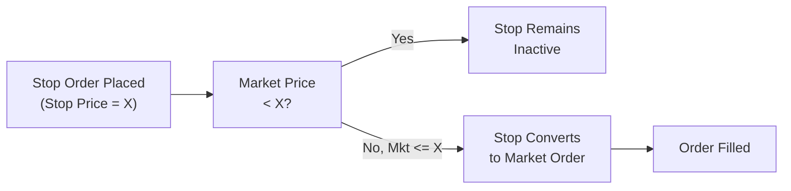

## 32.11 Entering Orders

Imagine you’re hanging out with a friend, catching up on a lazy Sunday afternoon, and you start talking about derivatives trading—well, that might sound a little odd, but bear with me. This section is basically you and I chatting, walking through how to place orders for those advanced derivatives strategies we’ve been exploring all along in Chapter 32. You’d be surprised how many new folks jump into derivatives without fully understanding order entry. But hey, that’s why we’re here.

In this segment, we’ll tackle the nuts and bolts of sending derivative orders to the market, from specifying contract details (like expiry month, strike price, and quantity), all the way to advanced instructions (like fill or kill). We’ll look at real-life case studies, highlight best practices, and also call out a few “watch out” moments—those silly little mistakes that can really catch you off guard if you’re not paying attention. We’ll also chat about how Canadian regulatory frameworks, administered by CIRO (the Canadian Investment Regulatory Organization), shape best execution requirements. So yes, it might be a lazy Sunday vibe, but there’s lots to learn.

---

### Overview of Derivative Orders

When you enter an order for a derivative—futures, options, or swaps that happen to trade on an exchange like the Bourse de Montréal (the “Bourse”)—you need to specify not only the usual suspects (buy or sell, quantity, price type) but also the contract’s essential details such as the contract month, the strike price if it’s an option, and any instructions related to duration or special handling.

The main order types we’ll explore—market, limit, stop, stop-limit—are the bedrock. Then we have time-in-force instructions such as fill or kill (FOK), good till canceled (GTC), and “all or none” (AON). We’ll also talk about how electronic platforms manage your orders across time zones and how confirmations get sent back to you (or your broker) under CIRO’s transparency rules.

But first, let’s anchor ourselves with a handy glossary:

- **Market Order:** Buys or sells immediately at the best available market price.  
- **Limit Order:** Sets an upper purchase limit or a lower selling threshold—your order will only fill at your specified limit or better.  
- **Stop Order (Stop-Loss):** Triggers a market order once the market hits your stop price.  
- **Stop-Limit Order:** Similar to a stop order, but once triggered, it becomes a limit order at your specified limit price.  
- **Fill or Kill (FOK):** Must fill in its entirety immediately, or the order is canceled on the spot.  
- **Good Till Canceled (GTC):** Remains active until it’s executed or you explicitly stop it.  
- **All or None (AON):** Must be filled in full, but isn’t necessarily canceled if not immediately filled.  

Memorizing these is key to ensuring you place exactly the order you want.

---

### Defining Your Derivative Contract: Expiry Month, Strike, and Quantity

In the underlying stock market, an order might be as simple as “buy 100 shares of Company XYZ at $10.00.” But with derivatives, you have more precise details to lock in:

• **Type of Contract:** Could be a futures contract on a commodity, index, or interest rate, or an options contract that references some underlying asset (equity, index, currency, etc.).  
• **Expiry Month:** Futures and options expire. So you’d specify, for instance, “March 2025 futures” or “Jan 2026 call,” etc.  
• **Strike Price (for Options):** Each option has a strike price. If you’re buying an S&P/TSX 60 index call with a 1,000 strike price, you have to say so explicitly.  
• **Quantity (Number of Contracts):** Rather than specifying the nominal notional value, you typically say, “Buy 10 index option contracts.” Remember each contract has its own multiplier. For example, 1 index option might control the equivalent notional of a certain number of shares or currency units.

If you’re using an electronic trading platform, you’ll typically fill out a form or screen that prompts these details. Be sure you’re selecting the correct underlying symbol. A small slip can lead to you buying the “just next month’s” contract rather than the one you intended. I once found myself holding a near-expiry futures contract by mistake because I absentmindedly clicked the wrong line on a deeply populated drop-down list. Oops. All ended well, but that’s a prime example of user error you want to avoid.

---

### Common Order Types in More Detail

Let’s take a slightly deeper dive into each major order type, because you’ll see them time and again in practice.

#### Market Orders

A market order says, “I want it now at whatever price it’s trading.” On an active market, your fill might be nearly instantaneous, but be prepared for slippage if the market is moving quickly. This type of order can be risky in less liquid derivatives—like certain thinly traded commodity options—where the best bid-ask spread might be wide.  

Pros:  
• Quick, sure execution.  
• Simple to place.  

Cons:  
• Risk of partial fills at multiple price levels.  
• Potential for slippage in volatile or illiquid markets.  

#### Limit Orders

A limit order says, “I’ll buy (or sell) but only at X price or better.” This type of order allows you to control the price you pay or receive. For instance, “Buy 5 contracts of XYX Dec 2025 futures at $500.00 limit.” If the price stays above $500 for a buy order, you might never get filled.  

Pros:  
• Protects you from unexpected adverse price moves.  
• Suited for less liquid markets.  

Cons:  
• Possible that you won’t get filled if market moves away from your limit.  
• Partial fills can happen if not enough contracts are available at your limit.  

#### Stop Orders (Stop-Loss Orders)

Stop orders are typically used to limit losses (or protect profits) on open positions. For example, you hold 10 contracts of a gold futures position. You place a sell stop order at a level you consider the “point of no return.” If the market falls to that level, your order becomes a market sell order.  

Pros:  
• Good for risk management—helps you exit losing trades quickly.  

Cons:  
• Once triggered, it becomes a market order and may experience slippage if the market is volatile.  

#### Stop-Limit Orders

A stop-limit merges the concepts of a stop and a limit. Suppose you have a stop price of $520.00 and a limit price of $518.00 for a sell order in a soybean futures contract. If the market drops to $520.00, your order becomes active—now it’s a limit order at $518.00. So if the market gaps below $518.00, you might not trade at all.  

Pros:  
• More control over fill price than a straight stop order.  

Cons:  
• No guaranteed fill if the market moves beyond your limit.  

---

### Time-in-Force Instructions: FOK, GTC, and AON

**Fill or Kill (FOK)** is ironically like a lightning ultimatum: the order either fills entirely at once or it’s canceled without a trace. This might be used by large institutional participants who want immediate fills (and don’t want a partial fill).

**Good Till Canceled (GTC)** means your order sits on the order book indefinitely until it’s either executed or you manually cancel it. Some brokerages automatically convert GTC orders to “Good For the Month” or “Good For the Day,” so be sure to check your firm’s conditions.  

**All or None (AON)** is a “must fill completely or not at all” condition, but it’s not necessarily immediate. The order can rest quietly on the order book until everything lines up for a fill.  

---

### Electronic Platforms and Order Routing

Most derivatives orders in Canada are routed electronically to the Bourse de Montréal or other recognized exchanges. You can do this via:

• **Full-Service Broker:** You instruct your broker, they route the order.  
• **Electronic Trading Platform:** You log into your account and place your order.  

Once the order is submitted, it goes into a queue or order book. The best-priced orders get matched first—following price-time priority or other matching models set by the exchange. That keeps the process transparent, which is exactly what CIRO guidelines require under the “best execution” rules.

#### Technology for Order Management

Electronic trading architecture usually includes:

• **Front-End Systems (GUI or APIs)**: Where you place your order.  
• **Order Management Systems (OMS)**: These maintain all open orders, handle partial fills, cancellations, etc.  
• **Routing Logic & Risk Checks**: Potential risk checks might stop your order if you exceed margin or credit limits.  
• **Exchange Matching Engine**: The exchange’s “core” that matches buy and sell orders.  

In practice, it might be a fraction of a second from you clicking “submit” to your order hitting the exchange’s matching engine, subject to risk filters. You’ll see a fill notification if your order is executed immediately or an open position in your pending orders tab if it’s waiting.

---

### CIRO Guidelines on Best Execution and Transparency

Following the 2023 amalgamation that created the Canadian Investment Regulatory Organization (CIRO), the principle of “best execution” remains crucial. Best execution basically means brokers and dealers must take reasonable steps to obtain the best possible results for their clients, factoring in price, speed, and the likelihood of execution.  

For instance, if you place a limit order on a cross-listed derivative, your dealer might look for better liquidity or narrower spreads in alternative markets. They must also confirm that you, as the client, are promptly notified of substantial fills, partial fills, or other changes.  

You’ll find more details on best execution policies and the relevant updates on [CIRO’s official website](https://www.ciro.ca).  

---

### Time Zones and Global Markets

Here’s another subtle but important factor: If you’re placing an order on an internationally traded product, like a futures contract that’s primarily listed on a European exchange (EDX, for instance) but cleared or mirrored in Canada, the local trading hours can be all over the place. Suppose your day job keeps you busy during the North American morning while the European market is winding down. You might find that your order doesn’t get immediate attention or that the product is illiquid outside of peak European hours.

Key tips:

- Know the product’s main trading hours.  
- Recognize that “market open” for the Bourse might not sync with a reference futures contract trading in Chicago or London.  
- Some brokers provide 24-hour order entry, but actual execution only happens when the local exchange is open.

---

### Practical Examples and Case Studies

Let’s run through a mini-scenario. Suppose you want to speculate on the Canadian dollar (CAD) strengthening against the U.S. dollar (USD). You decide to buy 5 CAD/USD futures contracts (let’s pretend the ticker is “6C” or a Bourse-specific symbol). The contract month is December 2025, and you think the price around 0.78 is attractive.  

You might do:

1. **Buy 5 Dec 2025 CAD/USD futures** at 0.7800 limit, GTC.  
2. Attach a **Stop-Limit** order to sell those contracts if the exchange rate tumbles to 0.7750, with a stop-limit at 0.7740.  

Translation: You want to get into the trade if the price is at 0.78 or better. If the trade goes against you, you limit your downside by closing out if the rate hits 0.7750 (though you also set a limit of 0.7740 to ensure you don’t sell your contracts too far below that stop).

This kind of bracket approach—entering with a limit order and attaching a protective stop-limit—helps control your risk, but you do face the possibility that if the market gaps below 0.7740, you won’t get executed and might remain exposed. Anyway, the important part is you fully specify each piece of your order carefully so your broker’s system or your online platform knows precisely what to do.

---

### Potential Pitfalls and Best Practices

**Using Market Orders in Illiquid Contracts**  
If a contract is extremely illiquid, placing a market order might cause you to be filled at a horrible price. Double-check the depth of market or use a limit order if in doubt.

**Stop Order Slip-Ups**  
Stop orders become market orders once triggered, which can lead to big moves in fast markets. If you’re worried about a severe price gap, consider a stop-limit instead.

**Forgetting GTC Orders**  
Ever left a GTC order to buy an option that you forgot about, only to check days later and see it filled at a random time? This is more common than you’d think. Regularly review your open orders.

**Wrong Contract Month**  
Picking the wrong expiry is a classic rookie mistake. Double-check before hitting “enter.”  

**Partial Fills**  
With limit orders, expect partial fills. Some people panic when they only get, say, 2 out of 5 contracts filled. If the rest sits unfilled, you can let it ride, or cancel/amend the remainder.

---

### Visualizing Order Dynamics

Below is a simple Mermaid diagram that shows how a stop order transitions from “pending” to “market” status.

Explanation: The order sits as an inactive stop order until the market price crosses (or touches) your stop threshold. After that, it instantly becomes a market order and, in a swift turn of events, either gets filled or partially filled (depending on liquidity).

---

### Regulatory and Operational Considerations

- **CIRO Reporting Requirements**: As of 2025, CIRO is the single self-regulatory body in Canada. Firms must ensure they maintain thorough records of orders and trades, including timestamps and disclosures of any special conditions.  
- **Bourse de Montréal’s Implied Pricing**: The Bourse uses advanced matching logic to build implied orders from existing book liquidity. This might affect how your order interacts with the order book. If you’re uncertain, consult the [Bourse de Montréal’s order entry FAQs](https://www.m-x.ca) for details.  
- **Commission and Fee Structures**: Beware that different order types (especially advanced ones) can come with distinct commission structures. Some brokers might charge additional fees for bracket orders or for direct market access portals.  

---

### Additional Resources

- [CIRO Best Execution Resources](https://www.ciro.ca) – Updated guidelines, recommended practices.  
- [Bourse de Montréal – Order Entry FAQ](https://www.m-x.ca) – Official source for how to enter orders on the Bourse.  
- [Open-Source Tools: QuantLib](https://www.quantlib.org/) – A C++ library with Python bindings for pricing and risk analysis. Great for testing how your order strategies might behave under different volatility scenarios.  
- [Wiley Online Library: “Options and Futures: A Canadian Perspective”](https://onlinelibrary.wiley.com/) – Scholarly articles focusing on Canadian derivatives markets.  

---

### Key Takeaways

• Before placing your order, confirm all the “who, what, when, where, why, how” details: type, volatility environment, margin requirements, etc.  
• Consider carefully how each order type (market, limit, stop, or stop-limit) will behave if the market becomes choppy.  
• Familiarize yourself with special instructions (FOK, GTC, AON).  
• Beware of cross-border/trading-hour mismatches when dealing with globally traded derivatives.  
• Keep track of your open orders—especially GTC orders—and regularly review them for updates or cancellations.  
• Use the best resources available: your broker, official exchange websites like the Bourse’s documentation pages, and of course, CIRO’s current guidelines.

If you’re mindful of all these considerations, you’ll be in solid shape to enter orders that match your market outlook, risk tolerance, and general trading objectives.

---

## Sample Exam Questions: Entering Orders in Derivatives



### Which of the following best describes a Limit Order for derivatives?

- [ ] An order that converts to a market order once a certain price is hit.
- [x] An order that instructs execution only at a specified price or better.
- [ ] An order that must be immediately and fully executed or canceled.
- [ ] An order that remains active until canceled, regardless of price.

> **Explanation:** A limit order is only executed at the limit price or better, unlike a market or stop order.

### What is the key difference between a Stop Order and a Stop-Limit Order?

- [ ] Stop Orders are only valid in illiquid markets, Stop-Limit Orders are not.
- [ ] Stop-Limit Orders are triggered above the market, Stop Orders below it.
- [x] Stop Orders trigger a market order once the stop price is reached, whereas Stop-Limit Orders trigger a limit order.
- [ ] Stop-Limit Orders cannot exist on Canadian exchanges.

> **Explanation:** A Stop Order becomes a market order once triggered, while a Stop-Limit Order becomes a limit order, providing price control but no guaranteed fill.

### Which of the following is a reason you might use a Fill or Kill (FOK) instruction?

- [ ] You only want to trade if your broker is online.
- [ ] You are willing to accept partial fills for beneficial prices.
- [x] You need all contracts to be filled immediately or not at all.
- [ ] You want your order to remain active for a long period.

> **Explanation:** FOK mandates immediate execution for the full quantity; otherwise, the order is canceled in its entirety.

### Under CIRO best execution guidelines, what must dealers consider when routing an order?

- [ ] Strictly the speed of order entry hardware.
- [ ] Only the client’s margin balance.
- [ ] Strictly the broker’s internal net exposure.
- [x] Price, speed, and likelihood of execution to achieve the best possible outcome.

> **Explanation:** CIRO requires member firms to take all reasonable steps for the best possible results, factoring in various execution metrics.

### Why can time zone differences matter when placing orders on global derivative contracts?

- [x] The local exchange might be closed when you place your order, affecting execution.
- [ ] Time zone differences affect margin rates.
- [ ] Orders are only valid in the home time zone of the trader.
- [ ] Global derivative contracts cannot be traded outside North America.

> **Explanation:** If an exchange is closed due to local time zones, orders may queue until the exchange opens. Liquidity can also fluctuate based on peak trading hours.

### If you have a Good Till Canceled (GTC) order outstanding, what is a common pitfall to avoid?

- [ ] Checking your broker’s order book too often.
- [x] Forgetting the order is open, leading to an unexpected fill later.
- [ ] Using a market order at the same time.
- [ ] Regularly updating the order’s stop price.

> **Explanation:** Traders frequently forget about GTC orders. The market may move to the GTC price, resulting in an unexpected fill.

### What happens when a Stop Order is triggered?

- [ ] It is converted into a limit order at the same stop price.
- [ ] It instantly cancels if no immediate fill is available.
- [ ] It expires if the market price returns within 1% of the stop.
- [x] It becomes a market order and is filled at the next available price.

> **Explanation:** A stop order is typically triggered into a market order once the specified stop price is reached or crossed.

### Which of the following statements is true about All or None (AON) orders?

- [ ] AON orders are prohibited on Canadian exchanges.
- [ ] AON orders never fill in partial amounts, but can wait in the order book.
- [ ] AON orders expire daily by default.
- [x] AON orders must fill in their entirety, but they can remain on the book until matched in full.

> **Explanation:** AON orders are those in which the entire quantity must be traded at once, though they can remain displayed until matched.

### You placed a Limit Buy order at 1.2000 for a currency futures contract quoting at 1.2050. Why might the order remain unfilled?

- [ ] The market price is already above your limit, so the order is invalid.
- [ ] Limit Buy orders cannot be lower than the current market price.
- [x] The market has not fallen to or below 1.2000 for your limit buy to be executed.
- [ ] CIRO guidelines require partial fills first.

> **Explanation:** A limit buy order at 1.2000 will only fill if the market offers contracts at 1.2000 or better (i.e., a lower price).  

### True or False: A Stop-Limit Order guarantees full execution once the stop price is hit?

- [ ] True
- [x] False

> **Explanation:** A Stop-Limit Order triggers at the stop price but might not be fully executed if the market rallies or falls past the set limit price.


