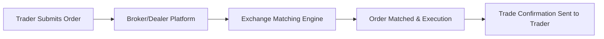
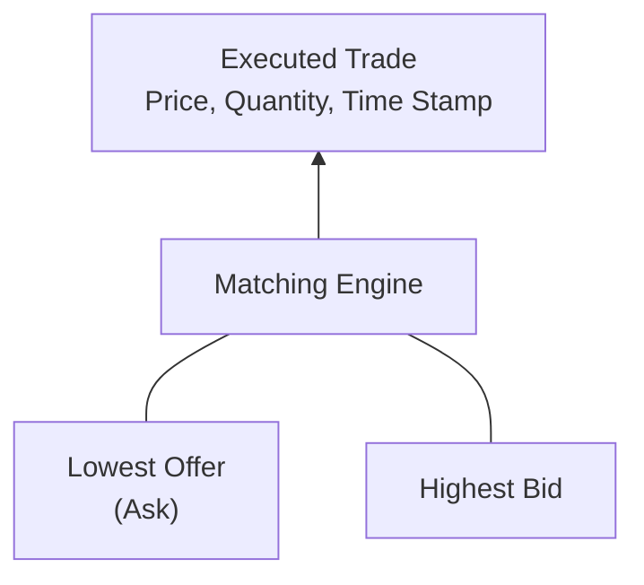

## 32.12 Executing Orders on Exchanges

So, let’s take a moment to talk about one of the most fascinating aspects of trading derivatives: actually getting your order matched and executed on an exchange. If you’ve ever wondered how your trade instructions magically transform into an executed position that appears in your portfolio, this section is for you. This process might look like a straightforward push of a button, but behind your screen lies a complex ecosystem of order books, matching engines, brokers, regulatory oversight, and a healthy dose of technology.

While we’re focusing on the Canadian context—especially the Bourse de Montréal and the regulatory environment under the Canadian Investment Regulatory Organization (CIRO)—the underlying principles hold true for many global derivatives exchanges. And yes, I’ll also talk about open outcry, even though it feels a bit like describing a pay phone in the smartphone era. Let’s dive in.

### The Electronic Order Book and Matching Mechanics

If you’ve ever browsed an online shopping site where you see all the offers and corresponding prices, you already have a smidge of intuition about how order books operate. Now, imagine that for derivatives—only a tad more intricate because we might have multiple strikes, maturities, or contract months. That’s what an electronic order book is: a digital ledger that continuously updates, storing all current buy and sell orders (often called bids and offers) in real time.

• Price & Time Priority: In most modern exchanges, orders are matched using a priority system that first considers the best price—highest bid or lowest offer—and then time. If two participants are willing to buy at the same price, the one who placed the order first typically “wins” the queue.

• Limit vs. Market Orders: Traders can submit different types of orders. A limit order says, “Buy or sell only at this price or better,” while a market order says, “I want to buy or sell immediately at whatever the current best price is.” Most institutional players use limit orders to control execution prices, but during fast-moving markets, a market order can quickly ensure a fill.

• Displayed vs. Hidden Liquidity: Some sophisticated order types allow participants to hide the size (or part of the size) of their orders to reduce market impact. While these “iceberg” orders are partially visible to the market, their full size is hidden under the surface, which can preserve anonymity and avoid front-running.

#### A Quick Mermaid Diagram on Order Flow

Below is a simple illustration of how an order travels from you (the trader) to the exchange’s matching engine and back:

• Trader Submits Order: It could be through an online portal or automated algorithm.  
• Broker/Dealer Platform: The broker may apply risk checks or route the order to a specific venue.  
• Exchange Matching Engine: The engine sorts and matches orders based on priority rules.  
• Trade Confirmation: Once matched, the order is executed and a confirmation is sent back.  

This entire sequence can happen in milliseconds, especially when it’s all electronic.

### Open Outcry: A Nostalgic Tradition

I remember my first time stepping onto a trading floor, well before the dominance of electronic matching engines. The open outcry pits resembled an arena of shouting traders, colored jackets, and a flurry of hand signals. You could see sweat, hear roars, and literally feel the tension in the air. It was a crash course in reading body language as much as in reading price charts.

Although open outcry has largely been supplanted by electronic systems, some physical commodity exchanges around the world still support this tradition. The idea? Traders verbally call out their bids or offers and use hand signals to indicate interest. Prices are determined when two parties shout out matching prices.

• Price Discovery in Open Outcry: You’d hear a trader shout something like “Sell 10 at 95!” while across the pit, somebody else yells, “Buy 10 at 95!” Boom—the trades are matched.  
• Transparency: The entire pit can hear or see the transaction happening. It’s an effective but noisy approach to discovering fair market prices.  
• Residual Use: Nowadays, open outcry might be used as a fallback if an exchange’s electronic system encounters a glitch (rare but possible). Some traders also argue that open outcry fosters better social relationships and can sometimes reduce misunderstandings about large or complex orders.

### Role of Floor Brokers in Modern Trading

If open outcry is fading, what about floor brokers? Well, in many markets the job of a floor broker has changed or merged with other roles. In the purely electronic environment, the “floor” is basically a data center, but in places that still permit open outcry or hybrid sessions, a floor broker is someone physically present on the exchange floor to represent client orders.

• Acting on Client Instructions: The broker receives orders from phone lines, electronic terminals, or proprietary systems, and executes them in the pit (or the specialized floor-located electronic kiosk).  
• Fiduciary Duty: Floor brokers must adhere to certain standards of care, ensuring orders are handled precisely according to the client’s stipulations.  
• Adapting in Real Time: If a client’s order needs to be modified, the broker can do so as soon as possible—sometimes calling out changes mid-execution if the market is illiquid or especially volatile.

In Canadian contexts, floor brokers have become less common since the Bourse de Montréal is almost entirely electronic. Still, it’s useful to remember how the role emerged historically, as it explains the origins of many modern regulatory requirements around best execution and recordkeeping.

### High-Frequency Trading (HFT) and Algorithmic Strategies

Perhaps you’ve heard the buzz around high-frequency trading (HFT). In simple terms, HFT involves using advanced algorithms and ultra-low-latency technology to send, modify, and cancel orders at lightning speeds—often microseconds or even nanoseconds matter. The aim is to capture fleeting price discrepancies or exploit minuscule edges in the market.

• Increased Liquidity: If done right, HFT strategies can provide continuous two-sided quotes, thereby narrowing bid/ask spreads and improving overall liquidity.  
• Potential for Volatility: If everyone’s algorithm decides to dump at the same time, you could see sharper or faster price swings.  
• Regulation: With the tech arms race, regulators like CIRO have implemented monitoring systems and rules around “unfair and manipulative market practices.” Exchanges also have circuit breakers or volatility controls to slow trading if markets become too unstable.

You might wonder: is HFT a good thing or a bad thing? There’s no one-size-fits-all answer. Some participants welcome the added liquidity, while others worry about market manipulation or so-called “spoofing,” where traders place orders with no intention to execute them. On the Bourse de Montréal, rigorous market surveillance tries to ensure that suspicious patterns are flagged.

### Trade Confirmations and Recordkeeping

Once your order is matched, you’ll typically receive a trade confirmation. Think of this as the official receipt of your transaction. It includes:

• Execution Price  
• Quantity  
• Time of Execution  
• Commission or Fees  

This record is crucial for reconciling positions, calculating profit/loss (P/L), and ensuring compliance with audit trails. Brokers and dealers must maintain accurate records of all confirmations, as CIRO and the Canadian Derivatives Clearing Corporation (CDCC) may audit them. In fact, the retention of transaction data—often five to seven years in Canada—helps preserve market integrity and regulatory oversight.

### Mandatory Reporting Procedures and Post-Trade Clearing

Okay, let’s say your order just got filled and you’re holding a position in a futures or options contract. Now what? The exchange has to pass this transaction to the clearing corporation—the entity responsible for guaranteeing the performance of the contract. In Canada, that’s usually the CDCC for derivatives listed on the Bourse de Montréal.

At this point, your position flows through the clearinghouse’s systems to ensure it’s properly margined and accounted for under the risk management guidelines. Clearing helps ensure that if one side of a trade defaults, the clearinghouse steps in so the other side isn’t left hanging.

• Real-Time Reporting: Most major exchanges provide real-time feeds of trade reporting to authorized regulators, including CIRO.  
• Position Limits & Large Trader Reporting: CIRO enforces certain position limits to avoid concentration risk. If your position surpasses a threshold, the regulator needs to know.  
• Post-Trade Transparency: Anonymous trade prints are published on the exchange feed, letting the public see the where and when of executed trades.

### Regulatory Oversight by CIRO

CIRO is the Canadian self-regulatory organization that oversees investment dealers and marketplace integrity. Historically, this function was split between IIROC (regulating investment dealers and marketplaces) and MFDA (focused on mutual fund dealers), but they have since amalgamated into a single entity named CIRO. For derivatives, CIRO ensures that participants follow rules around:

• Best Execution Requirements: Firms must endeavor to get the best possible outcome for their clients’ orders.  
• Market Manipulation: Spoofing, layering, or manipulative practices can lead to sanctions.  
• Risk Supervision: Firms must have adequate policies to monitor and control risks associated with client trades, including margin requirements.

For the latest resources, check out [CIRO’s official website](https://www.ciro.ca).

### How Market Makers Fit In

Exchanges often designate or contract with market makers: participants committed to maintaining two-sided quotes (bid and ask) in particular products. In exchange, the market maker may get fee rebates or additional data privileges. They help keep the market liquid, which is especially important when volumes are low or during off-peak hours.

Market makers generally accomplish this by operating sophisticated trading algorithms, continually monitoring implied volatility, interest rates, dividends, and other factors to price options or futures. Their presence helps ensure you get a fill even if there aren’t many “natural” counterparties actively trading at that moment.

### Common Pitfalls and Best Practices

• Overreliance on Market Orders: You can get unexpected fills in a fast market, so consider limit orders when the product is illiquid or volatile.  
• Partial Fills: Sometimes your order is only partially executed if there isn’t enough liquidity at your desired price. Keep an eye on that.  
• Connectivity Issues: If your internet connection fails right after you send a big order, you might not be able to modify or cancel the order in time. Use automated or phone backups when possible.  
• HFT Competition: If you’re competing with HFTs, remember that any sign of latency or slow reaction to price movements may put you at a disadvantage.

### A Little Math (KaTeX Example)

In certain derivatives markets, you might find yourself calculating the total dollar cost of a futures trade:


\text{Total Cost} = P \times Q \times \text{Multiplier}


Where:  
• \\( P \\) is the price per futures contract,  
• \\( Q \\) is the number of contracts,  
• “Multiplier” is the standard contract size (like 50 times the underlying index level for certain index futures).

It’s straightforward—just keep in mind that different contracts have different multipliers.

### Practical Example: Trading an S&P/TSX 60 Index Option

Imagine you place a limit order to buy five call options on the S&P/TSX 60 Index with a strike price of 1,000 at a premium of 15.00. The Bourse de Montréal’s electronic order book shows:

• Best Offer: 15.05 (with 10 contracts available)  
• Best Bid: 14.95 (with 20 contracts available)  

You place your limit buy at 14.95, thinking you might get a better deal than 15.05. But after a few seconds, no trades happen, and the market starts to heat up—someone else lifts the best offer at 15.05. If you don’t adjust your price quickly (or switch to a market order), you risk missing out (aka “chasing the market”). If you do switch to 15.05, you might get filled instantly. Each step you take, from placing the order to modifying it, is recorded on the exchange’s matching engine.

Once your order executes at 15.05, you’ll receive a trade confirmation listing:

• Quantity: 5  
• Premium: 15.05  
• Time of Execution: 10:31:14 am  
• Fees: Commission from your broker plus any exchange and clearing fees  

### Sample Mermaid Diagram: Price Discovery and Match

A simplified diagram of how buy and sell orders might converge in the order book:

• The “Matching Engine” sees if the highest bid is equal to or higher than the lowest offer.  
• If it is, trades occur and both sides get filled.

### Additional Resources

• [Bourse de Montréal Rulebook](https://www.m-x.ca) – Detailed guides on order types, margin requirements, and market maker obligations.  
• [CIRO (Canadian Investment Regulatory Organization)](https://www.ciro.ca) – Overarching SRO that enforces trading, margin, and business conduct rules in Canada.  
• Open-Source Tools: Consider exploring QuickFIX (for FIX protocol) or Marketcetera for building custom order management systems.

### Concluding Thoughts

Anyway, heading off I might say: executing orders on exchanges is a tapestry of technology, regulation, and tradition. From time-tested open outcry pits—where I recall the heart-pounding excitement of sweaty traders yelling—to the modern hush of algorithmic servers humming away in data centers, the mission remains the same: match buyers and sellers at fair prices. Each time an order goes through, the entire market gains a touch more information about supply, demand, and the collective psyche of traders.

If there’s a single takeaway, it’s to appreciate the intricacies under the hood—risk controls, real-time clearing, and regulatory frameworks that enable confidence in these markets. Keep honing your execution strategies, stay informed about new order types or exchange updates, and never be shy to ask your broker the whys and hows of your fills. That personal sense of mastery over how your trades get done is worth its weight in gold, or maybe I should say worth a few ticks on a well-executed trade.

---

## Sample Exam Questions: Executing Orders on Exchanges



### Which statement best describes how an electronic order book operates?

- [ ] It allows only market orders and ignores limit orders.
- [x] It continuously displays and updates all active buy and sell orders, matching them based on price and time priority.
- [ ] It hides all orders to minimize transparency, matching trades randomly.
- [ ] It requires all trades to be executed in person on the exchange floor.

> **Explanation:** An electronic order book lists all current buy and sell orders, updating in real time. Trades are matched by the exchange’s matching engine according to price, then time priority.

### In an open outcry system, how is a trade typically formed?

- [ ] Through the silent agreement of prime brokers only.
- [ ] Through an electronic matching engine that processes limit orders.
- [x] By verbal shouts and hand signals indicating matching bids and offers.
- [ ] By sending private messages to a single designated market maker.

> **Explanation:** Open outcry relies on traders physically calling out or signaling bids and offers in a trading pit, with trades forming when there is a matching price on both sides.

### Which entity typically guarantees the performance of listed derivatives contracts in Canada?

- [ ] CIRO’s internal fund
- [ ] The CIPF (Canadian Investor Protection Fund)
- [x] The Canadian Derivatives Clearing Corporation (CDCC)
- [ ] The Bank of Canada

> **Explanation:** The CDCC is the clearinghouse responsible for underwriting performance risk on derivatives traded on the Bourse de Montréal.

### What is an essential component of a trade confirmation?

- [ ] Location of the nearest exchange kiosk
- [ ] Personal information of the counterparty
- [x] Price, quantity, and time of execution
- [ ] Extensive background check on the broker

> **Explanation:** A typical trade confirmation includes price, quantity, time of execution, fees, and any relevant trade identification details.

### High-frequency trading (HFT) primarily relies on:

- [x] Ultra-low-latency algorithms to submit and cancel orders rapidly
- [ ] Manually setting limit orders in the pit
- [x] Spotting fleeting price discrepancies in a matter of microseconds
- [ ] Buying only illiquid assets to corner the market

> **Explanation:** HFT traders use powerful technology and algorithms to capitalize on tiny price edges and often rely on speed advantages. They also place and cancel orders extremely rapidly.  

### Which of the following is commonly considered a benefit of HFT?

- [x] It can offer narrower bid/ask spreads.
- [ ] It always increases end-of-day volatility.
- [ ] It relies solely on open outcry for matching orders.
- [ ] It removes the need for brokers and clearing corporations.

> **Explanation:** One perceived advantage of HFT is providing liquidity that narrows spreads. This benefit, however, is still subject to debate among market participants.

### Among the key post-trade tasks performed by a clearinghouse, which is most central?

- [x] Ensuring counterparty risk is managed
- [ ] Setting all market prices unilaterally
- [x] Monitoring margins to secure performance of trades
- [ ] Selling defaulting positions directly to retail customers

> **Explanation:** The clearinghouse stands between buyers and sellers, reducing default risk by monitoring margins and stepping in if one party fails.

### In what way has the role of floor brokers changed due to electronic trading?

- [x] Their role has diminished, and many broker tasks are managed electronically.
- [ ] They now run the clearinghouses entirely.
- [ ] Floor brokers have authority to override the matching engine’s trades.
- [ ] They handle only private block trades without regulation.

> **Explanation:** With electronic trading, many tasks once managed by a floor broker are now automated. Floor brokers are less common in primarily electronic environments like the Bourse de Montréal.

### Mention one key risk if you only use market orders in a fast-moving or illiquid derivatives market.

- [x] Receiving an unfavorable fill at a much worse price
- [ ] No chance of your order being executed
- [ ] Clearinghouse refusal to process your order
- [ ] Obligatory shift to an open outcry environment

> **Explanation:** Market orders tell the exchange to execute immediately at the best available price, which can lead to a fill that’s far from your desired level if the market moves quickly or there’s low liquidity.

### True or False: CIRO enforces best execution requirements and monitors for manipulative activities in derivatives trading on Canadian marketplaces.

- [x] True
- [ ] False

> **Explanation:** CIRO serves as Canada’s principal self-regulatory body for investment dealers and marketplace oversight, ensuring best execution and surveilling the market for manipulative behavior.


