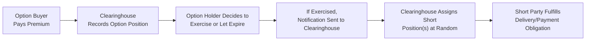

## 32.13 Payment for Options, Exercise Assignment, or Option Expiry

Have you ever rushed into the world of options trading, all excited, only to realize—uh, wait a second—there’s a bunch of stuff you need to do with actual money and actual obligations? Yeah, it can be a bit surprising at first. People often focus on the “profit potential,” but quickly come face-to-face with the practical realities of paying (or receiving) the option premium, meeting margin requirements, handling the assignment of exercised contracts, and figuring out what happens if you hold options through to expiration. In this section, we’ll take a friendly-yet-thorough approach to exploring the ins and outs of how these processes play out in real life, especially under the regulatory environment in Canada, where CIRO (the Canadian Investment Regulatory Organization) is the primary self-regulatory body overseeing derivatives activity.

### Understanding the Option Premium Payment

Whether you’re new to options or you’ve been dabbling for a while, the first big concept to nail down is the premium payment. When you buy an option, you typically pay an upfront cost—known as the premium—to the seller (or “writer”) of the option. It’s a bit like buying insurance: you pay the insurer a premium in exchange for coverage if certain conditions are met. In the case of an option, that “coverage” is your right (but not obligation) to buy or sell the underlying interest (stocks, futures, currency, etc.) at a specified strike price.

Within exchange-traded markets (such as the Bourse de Montréal in Canada or various U.S. options exchanges), your brokerage confirms and debits the premium from your account as soon as your buy order fills. This ensures the seller sees that payment credited to their account. It’s nice and immediate. The clearing corporation (in Canada, that’s usually the Canadian Derivatives Clearing Corporation—CDCC; in the U.S., the Options Clearing Corporation—OCC) sits in the middle to guarantee the trade.

### Premium Payment Mechanics

Picture this scenario: you log onto your broker’s platform, see an attractive call option on a well-known Canadian stock, and decide to buy one contract at a premium of $2 per share. Because standard equity option contracts normally control 100 shares, your immediate out-of-pocket expense would be $200 (plus commission). As soon as your order is filled, your brokerage deducts $200 from your cash balance.

Why so immediate? Unlike some other derivative instruments—particularly forward-based ones—options are generally paid for at the time of purchase. In fact, that’s the fundamental principle of an option: the buyer’s risk is capped by the premium paid. You’ve laid out your maximum loss (the premium), and no further money is needed unless you decide to exercise later (for a call option) or you get assigned (if you’re the seller).

For sellers (writers) of options, the premium is received right away, but they typically post margin to ensure they can meet their obligations if assigned. In many broker platforms in Canada, the margin requirement for an uncovered (naked) call is strictly regulated by CIRO guidelines, which emphasize investor protection and system stability.

Sometimes, folks ask: can I pay the premium later? Not in an exchange-traded context. It’s a different story in some over-the-counter (OTC) markets, but that can involve complex credit arrangements and ISDA master agreements. For your standard listed options at Bourse de Montréal or U.S. exchanges, it’s an upfront payment, always.

### The Assignment Process

Let’s talk about assignment next. Assignment arises when an option buyer (holder) exercises their right to buy (in the case of a long call) or sell (in the case of a long put) the underlying interest. If you happen to be short that same option, you may be assigned the obligation to deliver (on a call) or purchase (on a put). Now, this might feel a little nerve-racking, especially the first time you get an email or phone call from your broker saying, “Uh, you’ve been assigned.”

Whenever an option holder exercises, the clearinghouse—think of it as the big matchmaker—handles the process of selecting which short position will be assigned. In many jurisdictions, that selection is done on a random basis. Some clearing corporations also employ pro-rata or other fair allocation methods. The important point is that you, as the short option holder, generally cannot choose to avoid assignment if it comes your way.

Let me share a personal anecdote: years ago, I sold a put on a stock I really liked, thinking, “No problem, I’m happy to buy it if the price dips.” Well, guess what? The market fell unexpectedly before expiration, and I got assigned. Next thing I knew, I saw a big chunk of that stock in my account—and a corresponding big chunk of negative cash because my brokerage automatically funded the purchase. That’s the real kicker: if you’re assigned, your margin or cash account must be prepared to cover the cost of acquiring those shares (for a put) or delivering them (for a call). Make sure you understand precisely how your broker handles that.

### In-the-Money vs. Out-of-the-Money at Expiry

Another key piece of the puzzle is the fate of an option at expiry. If you hold an option (either a call or a put), you can typically exercise it manually if it’s in-the-money (ITM) and you want to realize the intrinsic value. However, if the option is sufficiently ITM at expiration—usually, 1 cent or more—most clearinghouses have an automatic exercise rule. This means your broker will exercise it for you, unless you explicitly tell them not to. This is known as “automatic exercise.” And yes, that can come as a surprise if you didn’t realize you would wake up on Monday morning owning or shorting shares you had no intention of touching!

If your option is out-of-the-money (OTM) at expiration, it simply expires worthless, and no further action is needed or (usually) even possible. A buyer will lose the premium paid, and the seller or writer will keep that premium but may have faced margin requirements throughout the duration of the trade.

### Automatic Exercise and the Clearinghouse

Automatic exercise is a neat risk-mitigating tool. It spares investors the hassle of having to go online at 3:59 p.m. on expiry day to ensure their valuable ITM options don’t accidentally expire worthless. But do keep in mind that if your call finishes just a few pennies in-the-money, you’ll need enough buying power in your account to handle the assignment of the underlying shares (or, for index options, the cash settlement).

The clearinghouse ensures the back-end runs smoothly by orchestrating the exercise and assignment process behind the scenes. In Canada, the CDCC will issue assignment notices to brokerage firms, which then figure out which client has the short position that’s about to be assigned. Meanwhile, in the U.S., the OCC does the same with its member firms.

### Margin Calls and Additional Funds

A quick heads-up: if you’re assigned on a short call and you don’t have the underlying shares in your account, your account is going to be short the stock. This can trigger a margin call—meaning your broker might require you to deposit additional cash or securities to maintain the required margin. There’s no bigger mood killer than logging into your account on a quiet Saturday only to see a margin deficiency notification. Trust me, it’s not fun.

Similarly, if you’re assigned on a short put, you’re going to own shares you may or may not have intended to purchase. Your brokerage typically charges margin or requires the full purchase price, depending on the positions you hold, your overall portfolio, and whether the put was “cash-secured.” The key takeaway: always keep an eye out for potential assignment in the days leading up to expiration, especially if your option runs near or in-the-money.

### Compliance and Regulatory Oversight

In Canada, derivatives, including listed options, are supervised by CIRO, which came into being after the MFDA and IIROC amalgamation. CIRO sets out margin guidelines, business conduct rules, and best practices to ensure fair and transparent markets. Among other things, these rules mandate that investment firms clearly disclose how the exercise and assignment process works, how margin calls are determined, and what your obligations are as a client.

The Bourse de Montréal, which lists many Canadian equity and index options, also maintains rules about order entry procedures and how expiry processes occur. For instance, they might publish special bulletins if there’s a corporate action—like a stock split—that could alter an option’s strike price or contract size at expiration.

On the global front, the OCC (Options Clearing Corporation) in the U.S. publishes detailed guidelines on assignments and automatic exercise thresholds. Much of that framework parallels what you see in Canada, though each clearing agency can have unique nuances in how they handle fractional or borderline ITM outcomes. We encourage you to consult the official websites of the OCC, the Bourse de Montréal, and CIRO for the most detailed and current guidance.

### A Visual Overview of the Life Cycle

Here’s a quick diagram to show the flow from premium payment to expiry or assignment. Remember to read each label carefully:

In short, the life cycle from “I just bought an option!” to “I exercised and got assigned” might take days, weeks, or even months—depending on your strategy and option contract’s expiration date. The clearinghouse stands at the center, ensuring that at every step, both parties live up to their end of the bargain.

### Real-World Case Study: Assignment Surprise

A friend of mine—I’ll call her Jennifer—once sold covered calls on a Canadian mining stock. The stock soared nearly 10% in a single day close to expiration. Because Jennifer’s calls were out-of-the-money but getting close to the strike, she wasn’t rushing to buy them back. Then, at 4 p.m. on expiry Friday, the stock closed right on her strike price. Over the weekend, the stock’s after-hours trading moved up a tiny bit. Monday morning, Jennifer discovered that the calls ended in-the-money by a few cents. The clearinghouse automatically exercised them on behalf of the call buyers, and Jennifer realized—guess what? She had been assigned. The shares left her account and, ironically, the stock continued to rally.

What’s the moral here? Don’t assume that “close to in-the-money” means you can ignore your short options. Once that final bell rings and final official settlement prices are calculated, even a 5-cent difference can trigger an automatic exercise. Always coordinate closely with your broker’s assignment cut-off times if you want to prevent forced deliveries or pickups of shares that might hamper your overall strategy.

### Canadian Regulatory Aspects

In Canada, it’s essential to understand that margin calls related to assigned positions often follow CIRO’s margin guidelines, which focus on protecting clients and ensuring your firm doesn’t inadvertently take on unmanageable risk. If your short position is assigned, your firm is required to alert you promptly, and you typically have to post the required margin within a very short time frame—often the same day or next day. 

Remember, Canada’s CIPF (Canadian Investor Protection Fund) protects investor assets held by member firms if they become insolvent, but CIPF doesn’t protect you from market losses or assignment-related obligations, so you can’t sidestep the financial responsibilities of an assigned contract.

### Potential Challenges and Pitfalls

– Not budgeting enough cash for assignment: You might be excited about the premium but forget that if you sell a put, you could suddenly be buying a fairly large chunk of stock.  
– Overlooking the time zone or clearing cut-off: In some cases, your broker might have an earlier exercise cut-off time than the official market close, so double-check.  
– Automatic exercise of borderline ITM options: That extra 2 cents can matter. This can produce unexpected positions on Monday morning.  
– Overconfidence in OTM calls or puts: Lesson learned from Jennifer’s story above—stock or index levels can shift after hours.

### Best Practices for Managing Option Expiry and Assignments

– Always keep track of the “moneyness” of your contracts—especially as expiration approaches.  
– Keep sufficient buying power in your account or offsetting positions that reduce your margin requirement.  
– Stay on top of corporate actions: stock splits, special dividends, and mergers can all impact how your options are settled or get adjusted.  
– Familiarize yourself with your broker’s exercise cut-off times and any unique instructions they might use for automatic exercise.  
– Consult with a qualified financial advisor or do your own in-depth analysis if you’re unsure how your short options might be assigned.

### Tools and Resources

– CIRO (https://www.ciro.ca): Official Canadian regulatory body that sets out margin requirements, trade conduct rules, and best practices.  
– CDCC (https://www.cdcc.ca): The Canadian Derivatives Clearing Corporation, which clears options traded on the Bourse de Montréal.  
– OCC (https://www.theocc.com): The Options Clearing Corporation in the United States, providing clearing services for options on U.S. exchanges.  
– Bourse de Montréal (https://m-x.ca): Canada’s derivatives exchange, with a helpful section on educational resources for options trading.  
– Broker Platforms: Many Canadian brokers and international brokers now offer embedded scenario testing or “what-if” analysis for option strategies, helping you gauge exposure under various assignment outcomes.  
– Open-Source Frameworks: Tools like QuantLib in Python can be excellent for analyzing option strategies, calculating theoretical values, and stress-testing your margin exposure.

### Putting It All Together

So, how do we piece it all together? Let’s take a big-picture view. You buy an option—bam—premium goes out. You write an option—bam—premium goes in (but margin is posted). Time passes, the market moves, and you get closer to expiry. If your option is OTM, it may expire worthless, and that’s that. If your call or put is ITM and you’re the holder, you can elect to exercise. Or, if you forget, the clearinghouse probably exercises automatically if you’re above the threshold. That triggers assignment for someone on the opposite side, who then must fulfill the contractual obligations, whether that involves delivering shares or handing over the cash to buy them.

The key to navigating this process gracefully is staying informed, staying prepared, and understanding the regulatory environment that shapes margin rules and assignment processes. It’s easy to get swept up in the excitement of option trading (believe me, I’ve been there), but the nuts-and-bolts of payments, assignments, and expiries can make or break your strategy. With a little diligence—and the resources mentioned above—you’ll be well on your way to making these processes feel second nature.

### Glossary Review

Premium Payment  
The upfront cost paid by the option buyer to the seller. It compensates the seller for granting the option rights and forms the buyer’s maximum potential loss (assuming they only bought, not shorted, the option).

Exercise (of an Option)  
The action taken by the option holder to invoke their right to buy or sell the underlying at the strike price. Call holders can buy the underlying, while put holders can sell the underlying at the agreed-upon strike.

Assignment  
When an option is exercised, a short option position is selected—at random or by pro-rata distribution—and required to fulfill the terms of the contract (delivering or purchasing the underlying).

Automatic Exercise  
A clearinghouse convention wherein in-the-money options are automatically exercised at expiry unless the holder instructs otherwise. This generally ensures no ITM option unwittingly goes unexercised.

### Final Thoughts

Navigating premium payments, assignment possibilities, and option expiry rules might feel cumbersome, but it’s truly the bedrock of successful options investing. By understanding how money flows at the start (premium payments), how obligations can crystallize at assignment, and how expiry triggers automatic exercise for ITM options, you build a strong foundation for your overall trading or hedging strategies. This knowledge protects you from nasty surprises and helps you to confidently use options in your portfolio—whether you’re speculating, hedging, or generating income through covered calls.

Keep in mind that the Canadian market has its specific guidelines, courtesy of CIRO, CDCC, and the Bourse de Montréal. If you trade U.S. options as well, the OCC and local exchange rules come into play. Stay flexible, keep learning, and remember to keep enough capital on hand to handle any margin calls or short assignments that might surface. The more you plan, the fewer nasty surprises you’ll have down the line.

---

## Sample Exam Questions: Payment for Options, Exercise Assignment, or Option Expiry



### Which of the following best describes the premium payment in a typical exchange-traded options transaction?

- [ ] Payment made at the time an option is exercised by the holder.
- [x] A one-time cost paid upfront by the option buyer to the seller.
- [ ] A recurring charge debited weekly from the buyer’s account.
- [ ] An amount collected by the clearinghouse and returned later.

> **Explanation:** In standard listed options, the buyer pays an upfront premium that represents their total cost.

### What is the primary function of a clearinghouse (like CDCC or OCC) regarding option assignments?

- [x] To randomly or pro-rata assign exercised options to short positions.
- [ ] To provide investment advice on option trading.
- [ ] To determine which trades are profitable for clients.
- [ ] To eliminate the need for any margin requirements.

> **Explanation:** The clearinghouse stands between buyers and sellers and manages the assignment process to ensure fairness and stability.

### When are short option writers typically required to post margin?

- [x] As soon as they write (sell) the option.
- [ ] Only after the option is assigned.
- [ ] Only if the option moves in-the-money.
- [ ] Never, margin is only for option buyers.

> **Explanation:** Short writers face potential future obligations, so they must maintain margin from the start.

### Which statement best describes “automatic exercise”?

- [ ] The manual process by which option holders must actively request exercise at expiration.
- [ ] A clearinghouse rule that blocks any option from being exercised after the market closes.
- [x] A clearinghouse policy to automatically exercise in-the-money options at expiration unless instructed otherwise.
- [ ] A broker guarantee that you will never lose money on in-the-money options.

> **Explanation:** Automatic exercise ensures in-the-money options aren’t accidentally allowed to expire worthless. 

### What is one major risk of being short a put option at expiration if it is in-the-money?

- [x] You could be assigned and required to purchase the underlying shares.
- [ ] You automatically profit from the premium paid by the buyer.
- [x] You could face a significant capital outlay if you don’t have enough funds to cover the share purchase.
- [ ] You owe a monthly payment to the clearinghouse.

> **Explanation:** Short puts in the money can lead to assignment obligations—requiring the writer to buy the shares, which can be expensive.

### Why should an option trader closely monitor stock or index prices close to expiration?

- [x] Because options near the strike can swing between ITM and OTM, triggering or negating assignment.
- [ ] Because margin requirements usually drop to zero right before expiration.
- [ ] Because brokers charge extra commissions only near expiration.
- [ ] Because the clearinghouse suspends trading two days before expiry.

> **Explanation:** A small price move can be the difference between assignment and expiration worthless.

### What happens if a call option you sold is assigned but you do not own the underlying shares in your account?

- [x] You will end up short the shares and must deliver them, potentially triggering a margin call.
- [ ] The assignment is canceled and the trade is reversed.
- [ ] The premium you received will offset all potential losses.
- [ ] You get automatically reimbursed by the clearinghouse for any purchase of shares.

> **Explanation:** A short call assignment without covering shares creates a short stock position. Brokers then require margin.

### Which organization oversees the regulatory framework for listed options in Canada following the amalgamation of the MFDA and IIROC?

- [x] CIRO (Canadian Investment Regulatory Organization).
- [ ] MFDA (Mutual Fund Dealers Association).
- [ ] IIROC (Investment Industry Regulatory Organization of Canada).
- [ ] None, as Canada does not regulate listed options.

> **Explanation:** Since January 2023, CIRO is Canada’s national self-regulatory organization responsible for investment dealers and mutual fund dealers.

### Which of the following best describes the effect of a fractionally in-the-money option at expiration?

- [x] It may be automatically exercised, resulting in assignment for a counterparty.
- [ ] It cannot be exercised because the intrinsic value is too small.
- [ ] It automatically moves to the next month’s expiration cycle.
- [ ] It’s converted into a forward contract with no premium.

> **Explanation:** Even a few cents above the strike usually leads to an automatic exercise (unless the holder opts out).

### True or False: CIPF protects investors from losses due to option assignment events and any margin deficits.

- [x] True
- [ ] False

> **Explanation:** This is a trick question. CIPF protects client assets in the event of a dealer’s insolvency, not from market losses or assignment obligations. So the statement as written is actually false, because CIPF does not protect from assignment losses. If you carefully read the statement and realize it claims CIPF protects from assignment losses, you see it’s incorrect. The correct answer is false; CIPF does not protect you from assignment losses or margin deficits.


