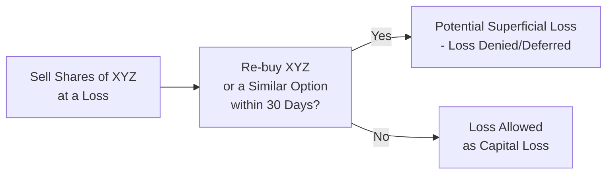
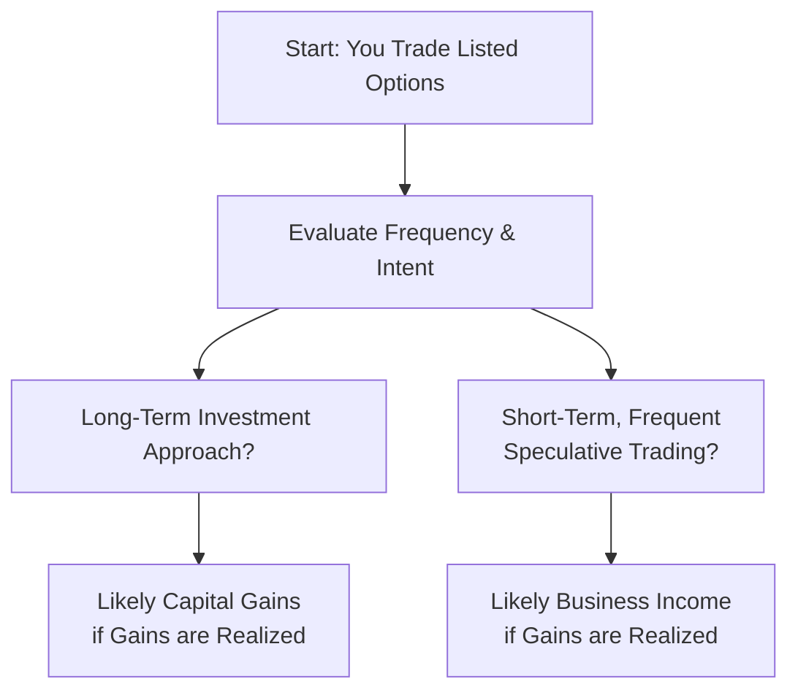

## 32.14 Tax Implications of Listed Options Trading

In this section, we’re going to dig deep into how the Canada Revenue Agency (CRA) generally views profits and losses on listed options. If you’re trading options in a Canadian context, the tax ramifications can be quite different depending on your circumstance—such as whether you’re classified as an investor or a professional trader. You might feel a bit overwhelmed trying to figure out if your option gains are capital or business income, and what on earth “superficial loss” means. Well, you’re not alone! In my early days of trading, I remember being totally confused about how to file my option gains and losses. It took me a while (and some frantic calls to a tax pro) to sort things out.

Anyway, let’s walk through the essentials, step by step. We’ll consider some examples, highlight the key rules around superficial losses, and talk about special issues like how professionals and dealers are taxed. By the end, I hope you’ll feel more confident about your tax reporting obligations and know which resources to tap into when things get tricky.

### Understanding Capital Gains vs. Business Income

One of the biggest distinctions in Canada’s tax treatment of listed options is whether your profits (or losses) are considered capital or business in nature. In other words:

• If your trading activity is on the investment side—less frequent trades, more of a buy-and-hold or hedging approach—you’re probably dealing with capital gains and losses.  
• If you’re super active, day trading or frequently using complex strategies purely for short-term profit, the CRA might classify some or all of your earnings as business income.

Under Canadian tax law, only 50% of net capital gains are taxable. For business income, 100% of your profit is included in your taxable income. This difference can translate into a big gap in how much tax you end up owing.

Now, you might be wondering: “What’s the bright line? How do I know for sure which side I fall on?” The CRA looks at factors such as:  
• Frequency of trades.  
• Length of holding period.  
• Your expertise in the market.  
• Whether your primary intent is speculation (rather than investment).  
• Your personal or professional circumstances (e.g., are you a registered or licensed investment professional?).  

Still, these are general guidelines. It’s definitely not black and white. If you have lingering doubts, talking to a qualified tax advisor is always a good idea.

### Tax Treatment of Option Premiums

Let’s break down how listed options premiums generally get taxed in a typical (non-registered) account:  

• Buying a Call or Put: When you pay a premium to buy an option, that expense is your initial cost or “adjusted cost base” (ACB). You don’t realize a gain or loss the moment you buy. The tax event generally occurs when you either sell the option, it’s assigned, or it expires.  
• Writing (Selling) a Covered Call: If you write a covered call, you receive a premium upfront. If it later expires worthless, you keep the premium, typically treated as a capital gain if your underlying shares are an investment holding. If the call is exercised, the premium you took in adjusts the ACB (and/or the proceeds) of your underlying shares.  
• Writing (Selling) a Naked Put: Similar story—if it expires worthless, the premium is usually a capital gain. If you get assigned, the premium you collected will reduce your ACB of the newly acquired shares.

Well, that’s the broad view. Let’s get a little more concrete with a real-life-ish example.

#### Quick Case Study: A Call Option Expires Worthless
Imagine you buy a call option on ABC Corp. for a $2 premium (100 shares per contract, so $200 total). The strike price is $50, and the call expires in three months. By expiration, ABC’s stock price has fallen and the option is out of the money—so it’s worthless. You lose your entire premium. As an investor, that $200 is considered a capital loss, which you can use to offset your capital gains, subject to CRA guidelines. In contrast, if you’re classified as a business trader, you’ll likely write off the $200 as a business loss.

### The Superficial Loss Rule in Option Trading

If you’ve ever heard the phrase “superficial loss,” you might recall it can deny your capital loss if you repurchase a “substantially identical property” within 30 calendar days before or after you sell it. In the context of options, these rules can get a bit tangled.

• If you sell an underlying stock at a loss and then buy a similar call option that essentially gets you back into a similar economic position, the CRA might not allow your loss right away.  
• Conversely, if you close out an in-the-money option at a loss but immediately open a new option with nearly the same terms, the superficial loss rule might apply.  

The reason behind this rule is to prevent taxpayers from creating artificial losses for the sole purpose of tax deferral. Let’s map out a simplified visualization to see how an investor might brush against superficial loss provisions.

This flowchart is simplistic but gives you a sense of how the CRA might look at your sequence of trades. If you do re-enter a substantially identical position within that 30-day window, you could have a superficial loss on your hands.

### Professional Traders, Dealers, and Business Income

Now, for those of you who regularly trade derivatives (like a full-time gig), or if you’re a regulated investment dealer, be aware that your gains and losses might be treated as business income. As a business, you’d typically:

• Include 100% of your derivative net profits in your taxable income (no 50% capital gains rate).  
• Write off 100% of your losses.  
• Deduct certain trading-related expenses (like data subscriptions, perhaps part of your home office, software, etc.) as business expenses, as long as they’re necessary for generating income.

If you’re thinking, “Am I a professional or am I an individual investor?” it might not always be crystal clear. But the CRA does look for signs that:

• Your primary source of income is trading.  
• You show consistent patterns of short-term gains.  
• You exhibit advanced knowledge of the markets.  
• You undertake complex, high-frequency strategies similar to a business operation.

Let’s map out a high-level classification approach:

### Tax Residency Considerations

Tax residency also matters. As a Canadian tax resident, you’re generally taxable on worldwide income, which would include any gains (capital or otherwise) from options, no matter where those options trade. Non-residents who trade listed Canadian securities may also face withholding taxes or special rules, but that typically depends on their tax treaty status and the nature of the income.

If you’re a new Canadian resident or you spend part of the year living abroad (maybe you’re a digital nomad?), you might have to look at the exact date you became or ceased to be a Canadian resident. There’s a concept of “departure tax,” which can get complicated. It’s best to consult specialized cross-border tax professionals if any piece of your story doesn’t cleanly fit the usual “full-year resident” mold.

### Timing of Gain or Loss Recognition

You’ll often see questions about exactly when you realize a gain or loss for options. Typically:  

• If you close out your option by selling it or buying it back on the market, your gain or loss is recognized at that moment.  
• If the option is exercised or assigned, the premium you initially paid or received gets rolled into the cost or proceeds of the underlying position. Potential gains or losses get realized when the underlying position is ultimately disposed of (if it’s a capital property).  
• If the option expires worthless, you typically recognize the gain or loss on the expiry date. The entire premium essentially crystallizes as your final outcome.

### Record-Keeping and Compliance

Under the oversight of the Canadian Investment Regulatory Organization (CIRO), you must keep thorough records of your trades—for both regulatory compliance and your own tax filings. Solid record-keeping helps you:

• Identify your ACB for each position with clarity.  
• Track the date and terms of each transaction in case superficial loss rules pop up.  
• Justify the classification of your gains as capital or business if the CRA ever asks questions.  
• Provide accurate info to your accountant or tax software.

Often, your brokerage statements (including T5008 slips) can give you a partial picture. Still, you might need to compile your own spreadsheet or use a specialized portfolio-tracking platform to integrate wash sales, superficial losses, ACB adjustments, and so on.

### Example Scenario: Covered Calls and Expiry

Let’s say you own 200 shares of MapleLeaf Inc. in a non-registered account with an ACB of $10,000 in total. You decide to write two covered call options at a $60 strike, collecting $2 per share in premiums (so $400 total premium). If those calls expire worthless, you get to keep the $400. In most cases, you’d treat that as a capital gain, adding $400 to your T1 tax return as a capital gain for the year. If MapleLeaf Inc. soared above $60 and the calls were exercised, you’d deliver the shares at $60, and the $400 premium would effectively adjust your proceeds of sale (depending on how your brokerage tracks it), ultimately factoring into your capital gain or loss on the stock.

### Common Pitfalls

• Misclassifying Frequent Trading as Capital Gains. If the CRA sees a pattern that looks more like a business, they may reclassify all your derivatives income as business income, which can lead to back taxes, penalties, and interest.  
• Overlooking the Superficial Loss Rule. People sometimes repurchase the same or “virtually identical” security too soon after a sale at a loss. Next thing you know, the CRA denies the loss.  
• Incorrectly Reporting Option Premium Income. Some new traders incorrectly report the premium received on short options as immediate income, without adjusting cost bases when assigned or exercised.  
• Inadequate Record-Keeping. Failing to keep track can mean you have incomplete or inaccurate ACB calculations, especially if you’re rolling positions or using combinations like straddles and spreads.  

### Best Practices and Tips

• If in Doubt, Seek Advice: Tax professionals, especially those familiar with options, can help interpret how your trading patterns fit into the CRA’s guidelines.  
• Keep Detailed Spreadsheets: Track each opening or closing of an option, along with date, strike, premium, and underlying.  
• Familiarize Yourself with CRA Publications: The CRA provides guides like T4037 (Capital Gains), which might offer clarity on certain points.  
• Look at Past Assessments: If the CRA has historically accepted your classification of gains as capital, that can be a hint, but it’s not binding if your trading behavior changes drastically.  
• Tap into CIRO Resources: Since CIRO now oversees both investment dealers and market integrity, you can find relevant compliance resources on record-keeping, best execution, and more at [https://www.ciro.ca](https://www.ciro.ca).

### Quick Snapshot: Capital Gains vs. Business Income

Below is a simple comparison to help you visualize the main tax differences:

| Factor                     | Capital Gains Treatment (Investor) | Business Income Treatment (Professional Trader) |
|----------------------------|-------------------------------------|-------------------------------------------------|
| Taxable Portion of Profit  | 50%                                | 100%                                            |
| Deductible Portion of Loss | 50%                                | 100%                                            |
| Trading Expenses           | Not typically deductible**         | Deductible (if necessary to earn income)        |
| Typical Holding Period     | Longer, less frequent trades       | Short-term, high frequency                      |
| CRA Classification         | Usually investment activity        | Usually business or speculative activity        |

**Note:** In certain cases, interest expenses or carrying charges might be deductible even for capital investments. Check with a tax professional for specifics.

### Personal Anecdote: Fear of Superficial Loss

I remember a close friend—let’s call her Sarah—who sold some in-the-money puts on a tech stock. The puts got assigned at a loss, and she turned around and sold them again almost immediately. She didn’t realize she’d basically reestablished the position too soon. Later, her accountant asked if maybe she’d triggered the superficial loss rule. Sarah had never heard of it. She had to scramble to get all her trades in order, verify the 30-day window, and eventually discovered that yes, the superficial loss rules applied, deferring her loss to a future date. It was a rude awakening about how even innocuous-looking trades can have hidden tax pitfalls.

### Staying Current on Tax Law Changes

Canada’s tax laws and CRA administrative positions can evolve. Provinces also have their own tax rates and sometimes specific forms. Keep an eye on federal budgets, CRA administrative updates, or provincial pronouncements. If you’re an active trader, you might want to do a mid-year check with your accountant, especially if there’s been significant new legislation or a big shift in how you trade.

### Conclusion and Additional Resources

Listed options can be an excellent tool for hedging, generating income, or speculating. But let’s face it, they come with some distinctive tax challenges. Whether your gains are capital or business income can have a massive impact on your bottom line. Add in complexities like superficial losses, the potential classification of your trading activities as professional, and you’ve got a recipe for confusion if you’re not careful.

Happily, you don’t have to go it alone. Consulting a licensed tax professional is a wise move if you’re in doubt, especially if your trades multiply or you start layering advanced options strategies. Keep thorough records, be mindful of your classification, and stay informed of new CRA or CIRO guidance as your trading evolves.

If you want to learn more, check out these resources:

• [Canada Revenue Agency](https://www.canada.ca/en/revenue-agency.html) (search for “capital gains T4037” and “derivative transactions”)  
• [Income Tax Act (Canada)](https://laws-lois.justice.gc.ca/eng/acts/i-3.3/) for official legislative details  
• [CIRO](https://www.ciro.ca/) for compliance guidelines and updates  
• “Tax Treatment of Gains and Losses on Futures and Options” from various Canadian tax forums and professional accountants  

All right, that’s the scoop. Let’s now test your knowledge with a few sample exam questions—just to see if you’re truly ready to tackle your next tax return with confidence!

## Sample Exam Questions: Tax Implications of Listed Options Trading



### Which factor is most critical in determining whether listed option gains are taxed as capital gains or business income in Canada?

- [x] The taxpayer’s intent and pattern of trading
- [ ] The type of brokerage account (margin vs. cash)
- [ ] The home province of residence
- [ ] The total number of underlying shares delivered

> **Explanation:** The CRA primarily focuses on the taxpayer’s intent and trading patterns (frequency, speculation, holding period) for classifying gains as capital or business income.

### A call option you purchased for C$200 expires worthless. You are a long-term investor. How is this typically treated for Canadian tax purposes?

- [x] A capital loss of C$200
- [ ] A business loss of C$200
- [ ] Interest expense of C$200
- [ ] Non-deductible expense of C$200

> **Explanation:** For an investor, the premium paid is considered part of the cost base, and if it expires worthless, the C$200 is a capital loss.

### Under the superficial loss rule, which scenario could trigger a denied or deferred capital loss?

- [x] Selling a stock at a loss and then buying a substantially identical call option within 30 days
- [ ] Buying a put option and selling a call option immediately
- [ ] Exercising a call option early to receive the underlying shares
- [ ] Writing an out-of-the-money put option that expires in 60 days

> **Explanation:** If you sell a stock at a loss (or close an option at a loss) and rebuy substantially identical property within 30 days, the superficial loss rule applies. Options can be “substantially identical” if they effectively restore the same economic position.

### You write an uncovered (naked) put that yields a premium of C$500, and it expires worthless. Assuming you’re classified as an investor, how do you report the C$500 premium?

- [x] As a capital gain on your tax return
- [ ] As interest income
- [ ] As dividend income
- [ ] It does not need to be reported

> **Explanation:** For an investor, a premium received for writing an option that expires worthless is generally a capital gain.

### Which of the following is NOT a common factor the CRA considers when deciding if your option trading income is business income?

- [ ] Frequency of your trades
- [ ] Your related market knowledge and expertise
- [ ] Your stated intention with respect to the securities
- [x] Your monthly utility bills for your home

> **Explanation:** While you might deduct some home office expenses if you’re classified as a business, your monthly utility bills alone do not determine whether your trading gains are business or capital in nature. Factors like frequency and intention are key.

### If an investor’s short call option is assigned, resulting in the sale of underlying shares, how is the option premium usually treated for tax purposes?

- [x] It’s added to the proceeds of the share sale
- [ ] It’s treated as a separate capital gain
- [ ] It’s taxed as dividend income
- [ ] It’s written off as a business expense

> **Explanation:** When a short call is assigned, the premium is typically added to the proceeds for determining gain or loss on the underlying shares.

### If you regularly generate most of your income from day trading listed options, how might your profits be taxed according to CRA guidelines?

- [ ] As capital gains at only 50% inclusion
- [ ] As tax-free savings
- [x] As business income fully subject to taxation
- [ ] As dividend income from an eligible corporation

> **Explanation:** Frequent and significant trading that resembles a business operation is usually taxed as business income, meaning 100% is taxable.

### When someone sells shares at a loss and rebuys them a week later at a lower price, resulting in the superficial loss rule applying, what happens to that loss in a typical scenario?

- [ ] It becomes a permanent loss that cannot be claimed
- [x] It is deferred and added to the cost base of the new shares
- [ ] It is converted into a business loss
- [ ] It is split evenly over the current tax year and the next

> **Explanation:** The superficial loss is deferred and generally added to the cost base of the reacquired shares (or substantially identical property).

### Which organization replaced IIROC and MFDA as Canada’s self-regulatory body overseeing investment dealers and mutual fund dealers?

- [ ] The Canada Revenue Agency
- [x] The Canadian Investment Regulatory Organization (CIRO)
- [ ] The Office of the Superintendent of Financial Institutions (OSFI)
- [ ] The Canada Deposit Insurance Corporation (CDIC)

> **Explanation:** As of 2023, the new SRO dubbed CIRO replaced the MFDA and IIROC, handling regulatory oversight for investment dealers and mutual fund dealers.

### True or False: Certain expenses related to trading options, such as market data subscriptions and a portion of home office costs, can be claimed as deductions only if your option trading business is recognized as a legitimate business by the CRA.

- [x] True
- [ ] False

> **Explanation:** If the CRA classifies your trading as a business, legitimate and necessary expenses for generating income may be deductible. If you’re an investor, these costs are often not fully deductible.


