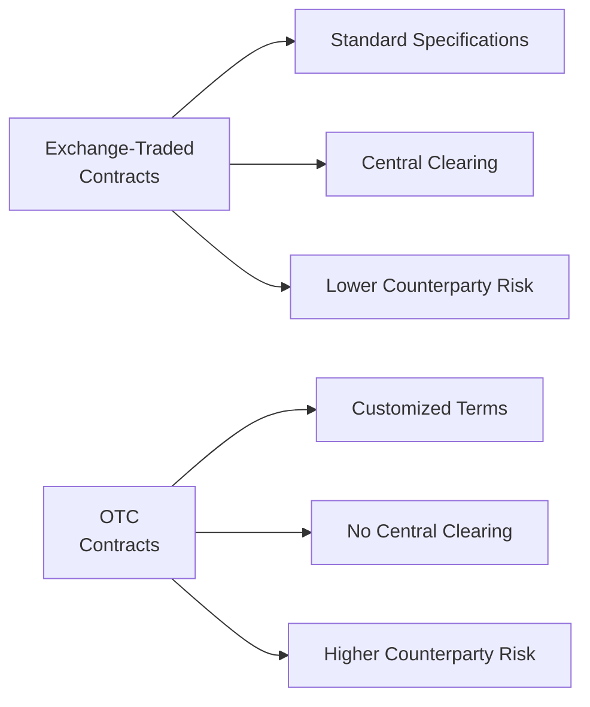
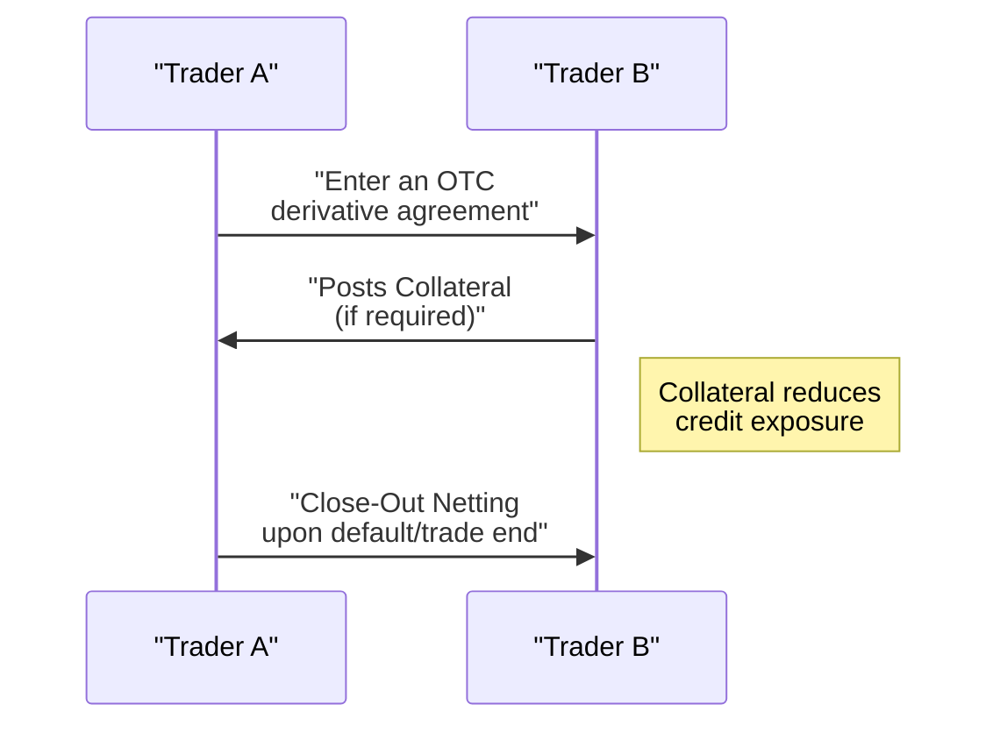

## 32.2 Key Differences Between Exchange-Traded and Over-the-Counter Products

Every now and then, I get asked: “Why would someone use over-the-counter (OTC) derivatives if exchange-traded derivatives (ETDs) exist?” It’s such a great question, and you might be wondering the same thing. After all, it seems simpler to trade on a transparent, regulated exchange than to tangle with customized, privately negotiated contracts. But, as it turns out, both approaches have their charm... and their challenges. Let’s chat about some differences between the two—that outreach might help you clarify which path is best for your own—or your client’s—hedging or speculative strategy.

A quick note for context: Exchange-Traded Derivatives (ETDs) are purchased and sold on regulated marketplaces such as the Bourse de Montréal in Canada, or the Chicago Mercantile Exchange (CME) in the United States. Meanwhile, Over-the-Counter (OTC) derivatives are privately negotiated arrangements between counterparties—often banks, large corporations, or investment funds—trading outside these centralized platforms.

In Canada, the overarching regulations are guided by the Canadian Investment Regulatory Organization (CIRO) for both exchange-based and OTC transactions. Remember that CIRO came into being in 2023 when two predecessor SROs, the MFDA and IIROC, merged. CIRO is responsible for ensuring that market participants (from large banks to individual brokers) follow best practices, remain solvent, and protect clients. That’s our world now.

Below, we’ll untangle some of the main points that set ETDs apart from OTC instruments. We’ll also address credit and collateral issues, margin requirements, and how new regulatory regimes (especially CIRO’s rules) keep both markets in check.

Standardization and Contract Specifications  
Remember the idea of Standardization from the glossary: in exchange-based trading, each contract’s size, expiration date, delivery terms, and underlying asset are uniform. If you trade a Standard & Poor’s/TSX 60 Index futures contract on the Bourse de Montréal, it's basically the same product day after day with pre-set specifications: contract size, tick size, settlement procedure—everything. This uniformity streamlines the process. If you’re used to trading one contract, you’ll know precisely how to trade its next month’s version.

When you step into the OTC world, the word “customized” takes center stage. OTC instruments let you tailor your derivatives to your exact preference: let’s say you’re looking for a caffeine futures contract to hedge the cost of your coffee supply for your chain of cafés. There’s almost no chance an exchange-traded derivative for your specialized coffee variety even exists. So you’d go to a specialized commodities dealer and craft a contract just for your scenario: specific quantity, timeline, underlying bean variety, location. It’s like having a suit tailor-made to your measurements instead of grabbing a standard off-the-rack piece.

Margin Requirements and Central Clearing  
Margin Requirements on exchanges are set by clearinghouses. If you want to initiate a futures or options trade on an exchange, you’ll place a certain amount of money—“margin”—in a brokerage account or clearing account. This margin can be adjusted daily (it’s called “marking-to-market”) so that any losses get covered promptly. And if you ever can’t pay your daily losses, the clearinghouse jumps in to ensure the counterparty doesn’t lose out. That mechanism fosters a sense of security in the ETD space.

But in OTC trades, margin is more flexible. More precisely, it’s not “margin” in the typical sense—often it’s referred to as “collateral.” Since your deal is private, the two parties agree on how much money or other assets to pledge as security. Large financial institutions, especially those handling interest rate swaps or currency forwards, use collateral schedules spelled out in an International Swaps and Derivatives Association (ISDA) Master Agreement. If the market moves against one party, that party may need to post extra collateral to maintain the relationship. This system can be quite sophisticated, but it’s also more open-ended—parties can negotiate how often margin calls (a.k.a. collateral calls) occur, the credit triggers, and the accepted assets (e.g., cash vs. government bonds).

Counterparty Risk and the Role of Clearinghouses  
One of the biggest differences: For an ETD, your direct counterparty is typically the exchange’s clearinghouse (backstopped by all its member firms). The clearinghouse, such as the Canadian Derivatives Clearing Corporation (CDCC) in Canada, steps in to become the buyer to every seller, and seller to every buyer. This effectively mitigates your exposure to any single entity’s credit risk.

OTC markets don’t come with a built-in clearinghouse. So, you have to trust that your counterparty will fulfill the contract. That’s your Counterparty Risk. You might put all sorts of protections in place: collateral posting, credit support annexes, or close-out netting agreements. These help reduce the risk, but never truly remove it. For instance, if we’re dealing with an interest rate swap that spans five years, and one party goes bankrupt in year two, the other party can close (or “terminate”) the swap early, net out any amounts owed, and seize collateral. This is why big banks and institutional players do some serious credit due diligence. They want to be sure the other side is financially healthy enough to last until final settlement.

Market Transparency and Liquidity  
On an exchange, you typically see transparent pricing: the last traded price, bid-ask spreads, volume, order-book depth—stuff like that. It’s easy to figure out the going price for gold futures or for an S&P/TSX 60 Index option. A helpful side effect of standardized contracts is broader liquidity. Everyone buys and sells the same type of contract, so finding a buyer or seller is generally pretty straightforward.

OTC instruments vary widely in liquidity. Some high-volume products—like standard interest rate swaps or plain vanilla currency forwards—are still quite liquid because big banks and corporations trade them every day. But more exotic instruments—think complex equity derivatives or specialized commodity swaps—might have extremely limited liquidity. The price discovery process is often “call up your dealer and see what quote they give you.” This can be a bit nerve-wracking, especially if you’re comparing quotes from multiple banks. The environment is less centralized, so price transparency will depend heavily on how many banks or dealers actively post quotes.

Collateral, Close-Out Netting, and Credit Mitigation  
Let’s circle back to Collateral. As noted, for OTC contracts, collateral is a big deal. Because there’s no clearinghouse, collateral is how parties reduce credit exposure. Imagine you’re a big energy company hedging oil price risk with a bank. If the oil market swings in your favor, you want to be sure that if the bank owes you, it will pay. By exchanging collateral each day (or at intervals you’ve negotiated), you get some reassurance that you’ll actually collect. And if the bank defaults, you can keep that posted collateral (within the terms spelled out in your contract) to offset losses.

Close-Out Netting is another piece of the puzzle. It says that if two parties have multiple transactions—maybe five different swaps, two currency forwards, and a couple of option agreements—if one side defaults, you net all those positions into a single payout to minimize the total exposure. This netting can dramatically reduce credit risk. Think of it as paying or receiving only the net difference across all outstanding deals, rather than having to settle each contract independently.

Regulatory Oversight and CIRO Requirements  
In Canada, CIRO is the watchful eye over both exchange-traded and OTC derivative activities for investment dealers. All participants are expected to maintain robust risk-management systems, comply with margin or capital rules, and ensure they’re properly disclosing all relevant risks to clients. Historically, that was a split job between MFDA and IIROC—but now it’s consolidated into CIRO for all investment dealers and mutual fund dealers across the country.

During the 2008 financial crisis, global regulators noticed serious issues in the OTC derivatives world—AIG’s meltdown, for instance, was partially triggered by an unhedged book of credit default swaps. This situation led to massive reforms, including more frequent trade data reporting, clearing obligations for standardized OTC derivatives, and margin or collateral requirements even for certain bilateral deals. Some of these global initiatives come from the G20 commitments or from the Bank for International Settlements (BIS) recommendations. Over time, provincial securities regulators and the Canadian Securities Administrators (CSA) have adopted or adapted these standards for Canada. CIRO also helps to ensure compliance among its member firms, especially in how they market OTC derivatives to clients and manage liquidity risk.

Practical Example: Hedging a Currency Risk  
Picture a Canadian exporting firm that expects to receive a large payment in U.S. dollars in six months. They might choose an exchange-traded USD/CAD futures contract on the Bourse de Montréal or an OTC forward agreement with a bank. The ETD route offers easy liquidity (assuming the contract matches the notional amount and settlement date they need) and daily margining. The OTC route lets them specify an exact custom date, precise notional amount, and perhaps a specific settlement method. But it also brings a bit more credit risk, so the bank would likely ask for collateral or a credit line. In a stable environment, both approaches achieve the same end: lock in an exchange rate. The decision often depends on contract flexibility versus standardization, as well as the firm’s pre-existing credit relationships with banks.

Anecdote on Real-World Hedging  
I remember working with a small agricultural cooperative that wanted to hedge canola seed prices. They found the standardized canola futures on an exchange to be slightly off-spec—they needed to adjust for different quality grades. Because of that mismatch, the co-op used a bank to set up an OTC forward contract. They had to negotiate a handful of details: at which location the seed would be delivered, what quality range was acceptable, how often settlements would occur, and so forth. That level of customization was essential to them. But guess what? Because the co-op wasn’t known for massive credit lines, they needed to post a chunk of collateral with the bank. In the end, it worked fine for them: they got an exact hedge for their produce, but they had to tie up capital in the form of collateral. There’s always a give-and-take.

Liquidity Differences and Trading Flexibility  
Exchange-traded markets generally have more robust liquidity for standardized products. If you’re in the energy market, for instance, you’ll see actively traded natural gas and crude oil futures on major exchanges, with loads of daily volume. That means you can open or close a position relatively quickly. On the other hand, if you’re dealing with something like a niche cross-currency interest rate swap in an emerging market currency, you may have no choice but to venture into OTC land. The liquidity might only exist through specialized dealers.

From a trader’s perspective, the difference in liquidity also affects how you plan your exit or your potential roll-over of positions. In an exchange-traded product, rolling a futures contract from one month to the next can be as easy as clicking a few buttons. OTC might demand a friendly phone conversation with your banker and some negotiation about price adjustments.

Operational and Cost Differences  
The standardized nature of exchange-traded instruments (futures, options) typically leads to lower operational costs tied to negotiating contract terms. You know the drill: sign the brokerage agreement, deposit margin, and enter orders as you please.

In contrast, setting up an OTC contract often requires an ISDA Master Agreement. That can be a fairly involved process: legal reviews, credit reviews, selecting which collateral schedules to adopt, bridging different jurisdictions, ensuring both sides have compatible KYC documentation—oh, and making sure your risk management system can handle the potential daily valuation changes. So if you’re a smaller firm or an individual, you may find that extra friction a bit onerous.

Technology has improved a lot, though. Some banks offer online portals for simpler OTC derivatives. For instance, you can log in and request a forward foreign exchange rate. Still, that’s more of a streamlined approach about standard items like forex forwards. If you want something truly exotic, expect more negotiation.

Market Integrity and the Role of CIRO  
Market Integrity means fairness, transparency, and investor confidence. Exchanges generally enforce market integrity by setting trading rules, monitoring real-time trades, imposing position limits, and working with the clearinghouse if any firm is in trouble. You can imagine how a globally recognized exchange guards its reputation fiercely—nobody wants chaotic or manipulative behavior.

Over-the-counter transactions do not have a single centralized authority. However, that doesn’t mean there’s zero oversight. CIRO and Canadian provincial regulators do require trade reporting for many OTC derivative transactions—especially standardized interest rate, credit, or certain commodity derivatives. This helps the regulators track market concentration risks, watch for systemic issues, and ensure that banks or dealers aren’t taking on too much risk. Additionally, if an investment dealer is offering OTC derivatives to a sophisticated or retail client, that dealer must adhere to CIRO rules on client disclosures, capital adequacy, and best execution—though “best execution” in an OTC sense might look quite different than best execution on an exchange.

Putting It All Together in a Quick Visual  
Here’s a simple flowchart to highlight the main structural differences between Exchange-Traded (ETD) and Over-the-Counter (OTC) products:

Notice how ETDs rely on a clearinghouse to serve as counterparty to all trades, while OTC instruments are direct agreements between two parties. That dynamic is a key driver of differences in risk and contractual flexibility.

We can also illustrate the broad concept of collateral flow for an OTC derivative via a little sequence diagram:

In an exchange-based environment, the clearinghouse would be in the middle of these two traders at all times, simplifying the flows.

Best Practices and Common Pitfalls  
• Thorough Due Diligence: If you’re trading OTC, always investigate your counterparty’s creditworthiness. Even if that counterparty is a large bank, make sure your contract includes robust protections.  
• Negotiation of Terms: When you need customization, it’s worth consulting someone with experience in structuring complex derivatives. Poorly negotiated or ambiguous contract clauses (e.g., settlement location or dispute resolution) can cause major headaches.  
• Liquidity Considerations: Don’t be tempted by the perfect customization that nobody else trades. If you suspect you might need to unwind that position early, an illiquid OTC product can be costly.  
• Understanding Margin vs. Collateral: On an exchange, margin can rise or fall each day—and you must meet margin calls immediately. In OTC, your collateral calls depend on your contract specifics. Missing a collateral call can result in a default or forced termination.  
• Regulatory Compliance: Because regulations keep evolving, especially around reporting requirements or mandatory clearing for certain standardized swaps, keep in touch with your compliance team or check CIRO and Bank for International Settlements (BIS) updates.  

Further Resources  
1. CIRO official website: [https://www.ciro.ca](https://www.ciro.ca) – For Canadian self-regulatory requirements.  
2. Bank for International Settlements: [https://www.bis.org](https://www.bis.org) – For statistics and global regulatory frameworks on OTC markets.  
3. Provincial Securities Regulators (e.g., Ontario Securities Commission, Autorité des marchés financiers in Québec) – They each have local rules affecting derivatives trading.  
4. ISDA (International Swaps and Derivatives Association): [https://www.isda.org](https://www.isda.org) – For standard documentation related to OTC derivatives.  
5. Bourse de Montréal: [https://www.m-x.ca](https://www.m-x.ca) – Canada’s main derivatives exchange; provides helpful guides on different futures and options products.  

I hope this discussion demystifies some of the differences between exchange-traded and OTC products. These distinctions revolve around standardization, transparency, liquidity, and counterparty risk—and if you’re looking to either hedge or speculate, it pays to figure out which environment suits your objectives. Anytime you trade derivatives, remember that it’s crucial to monitor your margin or collateral levels and keep a close eye on the credit health of your counterparties. That’s especially true if you’re going off-exchange.  

Anyway, that’s the gist. Now let’s test your knowledge with a short quiz. You’ll feel more confident about these concepts once you see how well you perform!

## Sample Exam Questions: Key Differences Between Exchange-Traded and Over-the-Counter Products



### Which of the following best characterizes an exchange-traded derivatives contract?
- [ ] It is highly flexible and can be negotiated to any specifications.  
- [x] It is standardized and cleared by a central clearinghouse.  
- [ ] It always involves an ISDA Master Agreement.  
- [ ] It is subject to no regulatory oversight.  

> **Explanation:** Exchange-traded derivatives are standardized (e.g., contract size and expiration date) and use a central clearinghouse to reduce counterparty risk.  

### When parties engage in an OTC derivatives deal, how is counterparty risk primarily mitigated?
- [ ] By having the exchange act as the buyer to every seller.  
- [ ] Through standard contract guarantees.  
- [x] Through credit support annexes, collateral posting, and close-out netting.  
- [ ] By daily mark-to-market margin calls from a clearinghouse.  

> **Explanation:** In OTC markets, no centralized clearinghouse guarantees performance. Instead, credit support annexes, collateral, and netting provisions in legal agreements reduce counterparty risk.  

### Which regulatory body in Canada currently oversees both exchange-traded and OTC derivatives for investment dealers?
- [ ] The Mutual Fund Dealers Association (MFDA)  
- [x] The Canadian Investment Regulatory Organization (CIRO)  
- [ ] The Investment Industry Regulatory Organization of Canada (IIROC)  
- [ ] The Ontario Securities Commission (OSC)  

> **Explanation:** Since 2023, the MFDA and IIROC have merged into CIRO, which now oversees both exchange-traded and OTC derivatives dealings for Canadian investment dealers.  

### What is one common reason a firm might choose an OTC product rather than an exchange-traded derivative?
- [x] The firm needs contract terms that are not available in standardized form.  
- [ ] OTC derivatives always provide superior liquidity compared to exchanges.  
- [ ] There is virtually no counterparty risk in OTC deals.  
- [ ] OTC products are always cheaper to trade.  

> **Explanation:** A key advantage of OTC derivatives is customization. If a firm needs non-standard contract specifications, an OTC approach may be the only option.  

### What is standardization in the context of derivatives?
- [ ] The process of negotiating unique contract terms to match client needs exactly.  
- [x] A uniform contract design so that all traders deal with the same specifications.  
- [ ] A credit arrangement that completely eliminates default risk.  
- [ ] A mechanism for daily margin calls.  

> **Explanation:** Standardization means that the contract’s size, expiration, and settlement details are uniform. This is typical of exchange-traded derivatives and promotes liquidity.  

### Which of the following statements is true regarding margin requirements on an exchange?
- [x] They are determined and enforced by the clearinghouse.  
- [ ] They are discretionary and can be negotiated at will.  
- [ ] They apply only when prices move 10% or more.  
- [ ] They are optional for hedgers.  

> **Explanation:** Exchanges typically require traders to deposit margin, establishing minimum levels. The clearinghouse monitors these requirements and may adjust them based on volatility and ongoing trades.  

### In an OTC interest rate swap, what happens if one party defaults midway through the contract?
- [ ] The exchange clearinghouse steps in to guarantee the contract.  
- [x] The non-defaulting party can use close-out netting to offset amounts owed against other positions.  
- [ ] The swap automatically continues without interruption.  
- [ ] The central bank intervenes to absorb all losses.  

> **Explanation:** In OTC trades, there is no clearinghouse to guarantee payment. Close-out netting arrangements can reduce the losses for the non-defaulting party.  

### Which factor usually enhances the liquidity of exchange-traded derivatives compared to OTC derivatives?
- [x] Standardized contract specifications and a centralized order book.  
- [ ] Negotiated, customized terms for each contract.  
- [ ] Absence of daily margin requirements.  
- [ ] Anonymous and private price discovery.  

> **Explanation:** Standardization and a centralized order book foster a more liquid market because many market participants trade identical contracts.  

### A Canadian company wants to hedge a small, out-of-season coffee bean inventory with very specific characteristics. Which statements are most accurate regarding the company’s best option?
- [ ] It will likely choose an exchange-traded futures contract for the greatest flexibility.  
- [x] It will likely choose an OTC forward or swap for customized terms, but must consider counterparty credit risk.  
- [ ] It should only use a credit default swap.  
- [ ] It can easily find a standardized coffee bean contract for any variety on the Bourse de Montréal.  

> **Explanation:** For niche or unusual underlying assets, a standardized futures contract may not be suitable, so the company might negotiate an OTC contract—understanding the higher counterparty risk.  

### True or False: OTC derivatives are not regulated in Canada.  
- [ ] True  
- [x] False  

> **Explanation:** OTC derivatives are indeed regulated in Canada, though not in the same manner as exchange-traded products. CIRO, along with the provincial regulators and the Bank for International Settlements’ guidelines, sets rules on trade reporting, capital requirements, and risk management for OTC instruments.  


