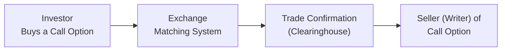

## 32.3 Exchange-Traded Options: Pricing, Hedging, and Speculating

Before I dive into the ins and outs of exchange-traded options, let me share a quick personal anecdote. The very first time I tried to calculate the “fair value” of a call option, I babysat a spreadsheet for hours, plugging in random numbers as if by magic some hidden secrets would reveal themselves. I expected the formula to be super complicated (and okay, maybe it was!), but you know what surprised me? Once I wrapped my head around the main moving parts—like the underlying price, time to expiration, and implied volatility—it was almost like unlocking a new puzzle. That sense of exploration and delight is what I hope to share as we go through these concepts together. So let’s get started.  

A brief reminder that the knowledge you pick up here should always go hand in hand with regulatory guidelines. Since 2023, Canada’s two former self-regulatory organizations (IIROC and MFDA) have rolled into the Canadian Investment Regulatory Organization (CIRO). CIRO oversees investment dealers and mutual fund dealers and works closely with the Canadian Investor Protection Fund (CIPF) to protect retail investors. Keep that in mind if you’re advising clients on options or structuring your own trades—compliance is critical.

  
### A Friendly Introduction to Exchange-Traded Options

Exchange-traded options are standardized contracts allowing one party (the option buyer) the right (but not the obligation) to buy or sell an underlying asset—like a stock or an index—at a predefined strike price on or before a certain date. When you purchase an option, you pay a premium that compensates the seller (or writer) for granting you that right.  

Unlike over-the-counter (OTC) options, exchange-traded options trade publicly on recognized venues, such as the Bourse de Montréal or major U.S. options exchanges like the CBOE. Here in Canada, these exchange-traded contracts clear through the Canadian Derivatives Clearing Corporation (CDCC), mitigating counterparty risk. Essentially, the clearinghouse becomes the counterparty to each side of the trade once a transaction is matched.  

Why do people love exchange-traded options so much? In a nutshell:

• They provide flexibility.  
• They can be used to hedge or speculate.  
• They are standardized and transparent.  
• They have a robust regulatory framework in Canada, courtesy of the Bourse de Montréal and CIRO.

But that’s enough preamble. Let’s chat about the building blocks of options.

### Core Option Terminology

If you’re just joining the party, here are some key terms that will pop up frequently:

• Premium: The market price of an option contract. This is the amount you pay (if you’re the buyer) or receive (if you’re the writer) to engage in the contract.  
• Strike Price (Exercise Price): The specified price at which you have the right to purchase (call) or sell (put) the underlying instrument.  
• Intrinsic Value: For an in-the-money option, intrinsic value is basically what you’d gain if you exercised the option right now and immediately took the resulting profit.  
• Time Value: The extra amount above intrinsic value that reflects the possibility that the option will move further in the money before expiration. If an option has no intrinsic value, then its entire worth consists of this time value.  
• Calls and Puts: A call option gives you the right to buy, while a put option gives you the right to sell.  

One of my favorite ways to remember these definitions is to think about calls and puts as insurance policies. A protective put is like insuring your car. A covered call is like renting out your house (collecting premium) while you still live in it—although that analogy might be a bit weird if you try to visualize it too literally.  

### The Greeks in Action

Now it’s time to go a little deeper. If the term “Greeks” conjures images of an ancient civilization, you’re not too far off. The Greeks in options trading are symbolic of the ways in which an option’s value changes as market variables shift. Think of them like a scoreboard of sensitivities.  

• Delta: Measures how much the option’s value changes when the underlying price changes by $1. Also interpreted as the approximate probability that the option will finish in the money (for simple European options; real life can be more nuanced).  
• Gamma: Measures the rate of change in Delta. Think of Gamma as telling you how “curved” your Delta exposure is.  
• Theta: Reflects how much value an option loses (or gains, if you’re short) with each passing day—also known as time decay.  
• Vega: Measures an option’s sensitivity to changes in implied volatility. A higher Vega means the option price is more drastically affected when the market’s implied volatility rises or falls.  
• Rho: Measures sensitivity to interest rates, though in the current environment, many traders watch Rho after major shifts in central bank policies rather than day to day.  

I remember trying to explain Gamma to a friend who’d never traded options. She told me, “So it’s basically the acceleration of the option’s price reaction?” Exactly! Delta is the speed, and Gamma is the acceleration.

  
### Option Pricing Frameworks

There are various approaches to valuing options. Among the most famous is the Black–Scholes–Merton (BSM) model. Another popular method is the binomial model, which breaks time into discrete intervals.  

#### Black–Scholes–Merton Model (BSM)

The BSM formula uses inputs like:*  

• Current price of the underlying  
• Strike price  
• Time to expiration  
• Risk-free interest rate  
• Implied volatility  

(*In practice, “volatility” in BSM is typically the implied volatility from the market. That’s part of the reason the formula helps you solve for the “correct implied volatility” rather than strictly outputting a “correct option price” from scratch.)

The formula itself might look intimidating, especially the first time you see its nested normal distributions and exponentials. However, it basically calculates two probabilities: one for the underlying finishing in the money without discounting for growth, and one that accounts for the risk-free rate. If you’re curious, resources like “John Hull’s Options, Futures, and Other Derivatives” do a phenomenal job dissecting the math behind it.

  
#### Binomial Model

The binomial model is often explained as a “discrete step” version of pricing. You create an up scenario and a down scenario over short intervals, so you end up with a recombining tree of possible price movements. By working backward from the final payoffs (at expiration) and applying a risk-neutral probability, you can figure out the option’s fair value in earlier nodes.  

In practice, many quants use more sophisticated trees with multiple intervals. The binomial approach can be especially flexible when modeling American-style options, since you can account for potential early exercise at each node. (This might come up for calls on dividend-paying stocks or for puts in certain situations.)

### Hedging with Exchange-Traded Options

Hedging is like wearing a seatbelt. If (or when) something bad happens, you may reduce your injuries (aka losses). You can’t eliminate all risk, but you can mitigate it.  

Some widely known hedging strategies:

Protective Put (Married Put): You buy a put option while holding the underlying asset. The put acts like an insurance policy, limiting your downside if the asset plunges in value.  
Covered Call: You hold the underlying stock and sell a call option on that same stock. You collect premium, which offers partial downside cushion, but you may have to sell your shares if the price shoots up beyond the strike.  

Both strategies are frequently used by investors who want to manage risk in a cost-effective way. Keep in mind, however, that while a protective put helps with catastrophic downside, it does cost money (the premium). A covered call provides you with immediate premium income but limits your upside.  

#### Hedging Example

Let’s say you’ve got 500 shares of a Canadian energy stock—maybe something with a bit of volatility. The stock is trading at CA$40, and you’re worried that an upcoming financial report might tank the price if the results disappoint. You could buy a put option with a CA$38 strike for CA$1.50 premium per share for a two-month horizon. If the stock drops below CA$38, your put starts to offset some of your losses. But you’ve paid that CA$1.50, and if the stock stays above CA$38, your put expires worthless (yet you’re safe from major downside).

The question is: is that CA$1.50 a worthwhile insurance cost or not? That’s where analyzing implied volatility and your risk tolerance come in. Indeed, many professional portfolio managers wrestle with the cost of hedging daily.

  
### Speculating with Exchange-Traded Options

Speculating is the art of turning your view on market direction or volatility into a position that might yield large gains. Of course, it also puts you at risk of large or total losses.  

Some popular speculative strategies include:

Long Call: If you expect a bullish move in the underlying, a long call can generate outsized gains for a relatively small initial outlay. The maximum loss is just the premium, while the upside can be substantial.  
Long Put: A straightforward bearish bet. If you think a stock is due for a tumble, you can buy a put and profit if the price drops well below the strike.  
Spreads (Vertical, Horizontal, Diagonal): You simultaneously buy one option and sell another similar option to offset cost, reduce risk, or tailor your exposure. For instance, a bull call spread is buying a call at one strike and selling a call at a higher strike.  
Straddles and Strangles: If you think volatility will skyrocket (and you’re not sure which direction the market will move), you might buy both a call and a put at the same (or nearly the same) strike, or at different strikes. You’ll profit if a big move happens either way, but the net cost can be high.  

Just remember that the cost of entry—the premium—plus the effect of time decay can eat away at profits. Like I mentioned the first time I messed around with the Black–Scholes formula, you gain a real appreciation for how time can be an enemy of long option positions. If the market doesn’t move enough, your option might expire worthless.

### Regulatory Spotlight: Compliance and CIRO Oversight

If you plan on recommending option trades as an advisor, or if you’re an investor opening an options account, Canada’s new self-regulatory organization, CIRO, requires that your broker or advisor ensures suitability and risk disclosure. As of January 1, 2023, the old IIROC and MFDA are defunct. CIRO is now the single SRO for both investment dealers and mutual fund dealers.  

Key regulatory items you should know:

• Suitability: Advisors must ensure the recommended strategy aligns with your objectives, risk tolerance, and knowledge.  
• Know Your Client (KYC): Both the firm and advisor should collect comprehensive info about your financial situation and experience level with derivatives.  
• Risk Disclosure: Option investors must receive thorough risk disclosure statements. This is typically handled by having you sign a derivatives trading agreement.  

Option trading can bring large potential rewards, but it’s not suitable for every client. Firms often subdivide client accounts by “option levels,” limiting how complex your strategies can be based on your risk profile. Remember: compliance is there to protect investors and keep the marketplace fair.

  
### Practical Tools and Additional Resources

One of the best open-source libraries out there for anyone dabbling in coding is “quantlib-python.” Another is “pyoption.” They let you run pricing and risk calculations without building everything from scratch. You can also practice constructing backtests or scenario analyses for your trades.  

For additional reading, John Hull’s “Options, Futures, and Other Derivatives” is a staple in university programs. For a more approachably written text, you might consider “Options Made Simple” by Jacqueline Clarke, or even “The Options Playbook” by Brian Overby.  

Online, keep an eye on CIRO’s website (https://www.ciro.ca) for the latest regulatory bulletins, especially if you’re in a compliance or advising role. Tools like the Bourse de Montréal’s option chain data can also help you watch real-time premiums and implied volatilities for different strikes.

  
### Case Study: Protective Put on a Canadian Stock

Imagine you own 1,000 shares in a Canadian technology company that trades at CA$50, and you’re concerned about an upcoming product launch that might flop. You decide to hedge with a protective put strategy.  

• You buy 10 put contracts (each contract typically covers 100 shares) with a strike of CA$48 for a premium of CA$2.00 per share. Total premium is CA$2 × 1,000 = CA$2,000.  
• If the stock tanks to CA$40, you’d incur an unrealized loss of CA$10 per share on the stock, but you’d have a net gain on the put. Specifically, the put would be worth at least CA$8 in intrinsic value (strike 48 minus stock price of 40), offsetting a large chunk of the decline.  
• If the stock stays above CA$48, your put expires worthless, and you effectively lose your CA$2,000 in premium outlay. However, you kept your stock and avoided any major meltdown in your portfolio.  

In effect, that CA$2,000 premium is the cost of peace of mind. Just like an insurance policy, you’re paying to reduce your exposure to a big drop in the underlying.

  
### Mermaid Diagram: Life Cycle of an Exchange-Traded Option

Below is a simplified illustration of how a typical exchange-traded option transaction flows. Keep in mind that after matching, the clearing corporation (e.g., CDCC) essentially becomes the central counterparty.

In practice, there are also brokers, data vendors, and regulatory oversight (CIRO) ensuring everything runs smoothly and fairly. The diagram just gives a high-level flow of how a trade typically lines up.

### Concluding Thoughts

Exchange-traded options open up a world of opportunity for leveraging market views and managing risk. I still remember the day it clicked for me that you can be both bullish and hedged at the same time—the notion that you can buy a stock for long-term growth yet protect yourself with a put or generate income by selling a call. But let’s be real: there is no free lunch. For every ounce of potential profit, there’s a corresponding element of risk.  

Make sure you keep exploring the Greeks to understand how your positions behave as time marches on, or as volatility zigs and zags. Familiarize yourself with the main pricing models, and remember that real-world pricing is seldom as neat as a theoretical formula. Market forces, investor psychology, and macro announcements all factor into the dynamic environment of the options market.  

And yes, if you’re stepping into this realm as a professional, your next homework is to keep up with CIRO guidelines, CIPF coverage specifics, and other regulatory updates. The best traders and advisors out there know how to harness the power of options responsibly, keeping risk management front and center.  

Happy trading, and good luck with your continued learning!

## Sample Exam Questions: Exchange-Traded Options Pricing, Hedging, and Speculating



### Which of the following best describes a protective put (or married put) strategy?

- [ ] Buying a call and writing a put on the same underlying with the same strike.  
- [ ] Selling a stock short while buying a call option.  
- [x] Buying the underlying stock and simultaneously buying a put option on that stock.  
- [ ] Owning a put option and a call option at different strikes.  

> **Explanation:** A protective put means owning the underlying stock and buying a put to protect against a downside move.  

### When discussing the Greeks, which one measures the option’s sensitivity to changes in implied volatility?

- [ ] Delta  
- [ ] Theta  
- [x] Vega  
- [ ] Rho  

> **Explanation:** Vega indicates how much an option’s price will change in response to shifts in implied volatility.  

### According to the binomial model for option pricing, how is the option value typically determined?

- [x] By creating a discrete model with up and down states at each time step and working backward from the final possible payoffs.  
- [ ] By adding the stock price and strike price together.  
- [ ] By assuming unlimited volatility.  
- [ ] By applying a single probability to all possible outcomes without discounting.  

> **Explanation:** The binomial method uses a step-by-step (tree) approach to price an option backward from expiration to the present.  

### In the Black–Scholes–Merton model, which is not typically an input for pricing a European option?

- [ ] Time to expiration  
- [ ] Risk-free interest rate  
- [ ] Current underlying price  
- [x] Bond credit rating of the option writer  

> **Explanation:** The BSM model uses inputs like stock price, strike, time, implied volatility, and the risk-free rate. The credit rating of the option writer isn’t part of the standard formula.  

### What is the maximum loss for a long call option position?

- [x] The premium paid for the option  
- [ ] The difference between strike price and stock price  
- [ ] Unlimited when the stock price goes down  
- [ ] Twice the margin requirement  

> **Explanation:** A long call buyer can lose only the premium paid if the option expires worthless.  

### Which statement about a covered call is correct?

- [x] An investor owns the underlying stock and writes a call option on that same stock.  
- [ ] An investor sells a stock short and writes a call option on a different stock.  
- [ ] An investor only trades call options, not owning the underlying at all.  
- [ ] An investor holds no stock position but sells both a call and a put.  

> **Explanation:** A covered call means you hold the underlying stock as “coverage” for the written call.  

### If Delta measures the speed at which an option’s price changes with the underlying, which Greek measures the acceleration?

- [ ] Vega  
- [ ] Theta  
- [ ] Rho  
- [x] Gamma  

> **Explanation:** Gamma tells you how Delta itself changes as the underlying price moves.  

### Straddles and strangles are considered:

- [ ] Low-volatility spread strategies.  
- [ ] Techniques to hedge dividend risk.  
- [ ] Credit spread strategies aimed at stable markets.  
- [x] Long-volatility or volatility-based strategies, expecting big moves in either direction.  

> **Explanation:** Straddles and strangles profit when the underlying makes a large move, regardless of direction.  

### Under CIRO rules for retail client accounts, which of the following is true?

- [x] Advisors must ensure the recommended option strategy is suitable for the client’s financial situation and risk tolerance.  
- [ ] Advisors can automatically assign risky option strategies to new clients without disclosure.  
- [ ] CIRO does not require any special risk analysis for options.  
- [ ] Retail clients and institutional clients have identical regulatory requirements.  

> **Explanation:** CIRO oversight mandates that advisors complete suitability analyses and risk disclosure for option trades.  

### True or False: Vega and Delta both measure an option’s sensitivity to changes in the underlying asset’s price.

- [ ] True  
- [x] False  

> **Explanation:** Delta measures sensitivity to the underlying asset’s price, while Vega measures sensitivity to implied volatility, not the asset’s price.  


