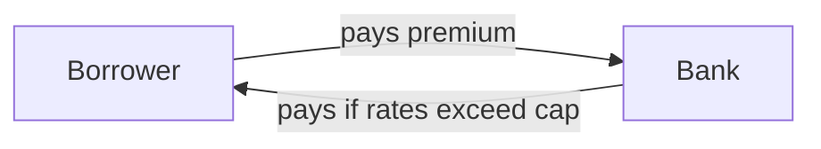
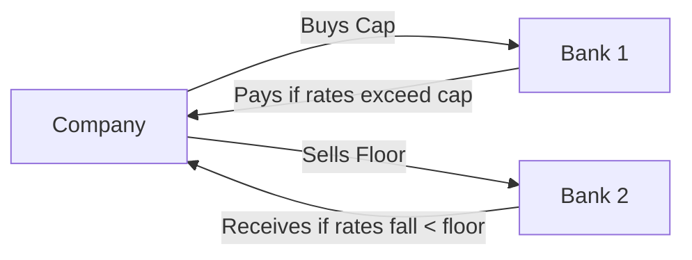

## 32.4 OTC Options: Caps, Floors, Collars, and Exotic Options

Have you ever worried about your interest rates skyrocketing right when you’re trying to lock in a mortgage, or maybe you’ve fretted over them plummeting just as you’re rolling over your deposits? In my early days at a small financial firm, I remember sitting in on a meeting where our treasurer had a stack of spreadsheets—yes, actual paper stacks!—trying to figure out how to hedge our interest rate exposure. That’s when I first heard about caps and floors. Honestly, I had no idea that you could “cap” or “floor” your rate risk. Since then, these tools have never ceased to amaze me. Let’s jump in and explore this fascinating world of Over-the-Counter (OTC) options, where caps, floors, collars, and exotic derivatives mingle to help everyone from corporate treasurers to pension funds manage their exposure in unique ways.

Unlike exchange-traded options, OTC options are privately negotiated contracts. That means the parties work out all the details themselves: the premiums, the expiries, the strike levels, and, of course, the legal, credit, and collateral terms that come with the territory. This flexibility is both a blessing and a challenge. On one hand, OTC structures allow you to customize everything to your exact needs—great if you’re a municipality wanting to guard against rate hikes on a big infrastructure project. On the other hand, you have to consider credit risk, settlement risk, working with collateral schedules, dealing with legal documents like the ISDA Master Agreement, and adhering to rules set out by regulators such as Canada’s new self-regulatory organization, the Canadian Investment Regulatory Organization (CIRO). Let’s dive deeper and see how these interest rate solutions and exotic options actually work.

### Why OTC Options in the First Place?
You might be wondering, “Why not just use an exchange-traded derivative for interest rates?” Well, sometimes your needs just don’t fit the standardized format of an exchange-listed contract. Maybe your company’s interest rate risk is tied to some less-common index. Or maybe you need a really long maturity—10, 15, even 20 years. Exchanges might not offer a derivative that ticks all those boxes, so you negotiate an OTC contract directly with a bank or broker-dealer who can structure exactly what you need. Now let’s talk about a few of the most popular forms of OTC interest rate derivatives: caps, floors, and collars.

---

### Understanding Caps
A cap is basically an insurance policy that shields you from rising interest rates. If you’re a borrower who’s worried that the floating rate on your loan might climb too high, a cap contract ensures you’ll receive a payoff if rates exceed a specified “cap strike.” Think of it as a protective umbrella—you stay dry if the rain (interest rates) surges above your tolerance level.

A cap typically consists of multiple option “caplets,” each corresponding to a specific payment period. If, at the start of a payment period, the reference rate (let’s say 3-month CDOR in Canada) is above the cap strike, the cap seller compensates you for that difference. If you’re more used to mortgages and lines of credit, it’s similar to adding an interest rate ceiling to your contract. Sure, you pay a premium for that protection upfront, but at least you know your rate will never exceed the chosen threshold.

Below is a quick snapshot diagram illustrating how a borrower and a bank might interact in a cap agreement:

The borrower pays a premium upfront to the bank (the cap seller). If rates rise above the cap’s strike rate, the bank compensates the borrower for the difference.

#### Practical Example: Using a Cap
Imagine you run a small transportation company and have a floating-rate loan. You’re worried interest rates could spike if the Bank of Canada tightens monetary policy. You negotiate a 3-year interest rate cap at, say, 5%. If your floating rate goes above 5%, your cap provider sends you a check for the difference, offsetting your higher borrowing costs. Now you can sleep a little more soundly knowing that no matter what happens, your effective rate can’t climb beyond 5%.

---

### Understanding Floors
A floor is the opposite of a cap. It protects a party against falling interest rates. At first blush, you might be thinking, “Wait, who needs protection if rates go down? Wouldn’t that be a good thing?” Well, sometimes your cash flow depends on receiving a floating rate, such as for an investor holding a floating-rate note or a bank that invests in variable-rate loans. In a low-rate environment, your interest income might tumble below comfortable levels. If you buy a floor, you’ll receive payments whenever rates sink below the specified strike level.

In this diagram, the investor (or lender) wants to ensure a minimum interest rate. By paying a premium to the floor seller, they receive compensation any time the reference rate dips below the floor strike.

#### Practical Example: Using a Floor
Say you’re a pension fund holding a portfolio of floating-rate bonds. You like floating rates because you believe they’ll rise over the next few years. But, just in case rates go the other way, you purchase a 2-year floor at 2%. If the 3-month interest rate plunges below 2%, your floor kicks in and sends you a check, effectively locking in a minimum yield on your bonds.

---

### Collars: Combining Caps and Floors
A collar combines both a cap and a floor into one neat structure. Often, the user buys a cap and simultaneously sells a floor (or vice versa), resulting in defined boundaries for interest rates. It keeps your effective rate from climbing above the cap strike, but also from falling below the floor strike. This can reduce or eliminate the net premium, depending on how you structure it, because the premium you earn from selling one leg can offset the cost of buying the other. Some corporations love collars because they offer a “middle ground” approach: you’re giving up the upside of unlimited drops in rates in return for not getting hammered by rising rates.

The above diagram shows a simplified version: the company buys a cap from one bank (Bank 1) and sells a floor to another bank (Bank 2). Rates are thus kept within a specified corridor. This approach is popular for corporate borrowers who want a predictable range of outcomes.

#### Practical Example: Using a Collar
Let’s say you’re a real estate developer with a floating-rate construction loan. You think rates might move up, but you don’t want to pay a large cap premium. So, you buy a 5% cap for three years and simultaneously sell a 2% floor. If interest rates go above 5%, your cap pays you; if they go below 2%, you have to pay on your short floor position. You sacrifice gains from super low rates, but you don’t have to worry about high rates busting your budget.

---

### Exotic Options
Beyond caps, floors, and collars, the OTC world offers a variety of exotic options—contracts with payoff structures that are more complex than standard calls or puts. Let’s take a look at a few of the most popular.

#### Barrier Options
A barrier option’s payoff depends on whether the underlying hits (or fails to hit) a specific barrier level during the life of the contract. We typically call them “knock-in” or “knock-out” options based on whether the option is activated or terminated once the barrier is triggered. These are like those fancy car alarms that only activate if the sensor is tripped. Some common types include:

• Up-and-Out: The option is canceled if the underlying’s price goes above a certain level.  
• Down-and-In: The option only becomes active if the underlying’s price dips below a certain level.  

Barrier options let you set highly targeted scenarios. They can be cheaper than plain-vanilla options because certain events will kill the contract. But beware: there’s a credit dimension here—your counterparty has to pay if the barrier is triggered and you have a payoff due.

#### Digital (Binary) Options
A digital (or binary) option pays a fixed amount if a certain condition is met, such as the underlying surpassing the strike price at expiry. It’s basically a bet: you either get a set payout (e.g., $1 million) if the interest rate (or exchange rate, or stock price) is in the money by expiry, or you get nothing. Commercial banks sometimes structure digital payouts on interest rates, offering a fixed payoff when a reference rate rises above a certain threshold.

---

### Pricing and Risk Management of OTC Options
OTC option pricing involves many of the same fundamental principles used for exchange-traded options—like volatility, time to maturity, and interest rate levels. But because OTC options are typically longer in maturity and can be fairly illiquid, standard models such as Black–Scholes–Merton or binomial trees might need serious customization. In practice, many banks and dealers use advanced versions of these models or specialized software to reflect more nuanced credit spreads, jump risks, or macroeconomic shocks.

#### Bilateral Negotiation and Credit Assessments
When you’re negotiating an OTC deal, you’re not just looking at the price. My friend who once worked at a broker used to say, “We could provide any exotic structure under the sun—as long as we felt comfortable with the counterparty’s credit.” You see, if your counterparty can’t pay up when your option is deep in the money, then your fancy contract is worthless. That’s why credit assessments (and collateral agreements under an ISDA Master Agreement) are critical.

• **ISDA Master Agreement**: The main legal contract that lays out critical definitions, events of default, and how to handle disputes.  
• **Credit Support Annex (CSA)**: Outlines margin or collateral requirements to mitigate credit risk.  

A robust credit assessment might involve analyzing financial statements, checking external credit ratings, or running internal risk models. If the sorted results look shaky, you might negotiate tougher collateral terms or decline the trade altogether.

#### Collateral Agreements
To reduce credit risk, OTC counterparties often post collateral. The collateral can be cash, government bonds, or other highly liquid securities. It’s a dynamic process: if your derivative position moves in your favor, you may require your counterparty to top up the collateral, and vice versa. For large or long-dated OTC contracts, collateral is pretty much a given.

#### Regulatory Requirements in Canada
As of January 1, 2023, the Mutual Fund Dealers Association (MFDA) and Investment Industry Regulatory Organization of Canada (IIROC) merged into the new Canadian Investment Regulatory Organization (CIRO). If you’re dealing in OTC derivatives, you must follow CIRO rules regarding disclosures, margin requirements (if applicable), and know-your-client (KYC) obligations. In addition, the Canadian Securities Administrators (CSA) have published various instruments—like National Instrument 94-101 (Mandatory Central Counterparty Clearing of Derivatives) and 94-102 (Derivatives: Customer Clearing and Protection of Customer Positions and Collateral)—that detail reporting and clearing obligations for certain OTC derivatives. Not all OTC options are subject to mandatory clearing, but you’d better verify which categories meet thresholds or requirements.

If you’re new to these regulatory frameworks, it’s helpful to reference official sites such as:
• [CIRO website](https://www.ciro.ca)  
• CSA publications on derivatives and clearing obligations  
• Your firm’s compliance department, which should have up-to-date directives  

---

### Best Practices and Common Pitfalls
• **Hedging vs. Speculation**: Caps, floors, and collars are primarily used to hedge interest rate risk. However, they can also be used for speculation. Make sure you’re clear on your objectives.  
• **Premiums**: Paying (or receiving) a premium can affect your liquidity. Some structures might have zero upfront cost but create a liability down the road.  
• **Documentation**: Sloppy drafting of the ISDA Master Agreement or misunderstanding the definitions for “market disruption events” can lead to large disputes.  
• **Collateral Calls**: If your position moves against you, you might have to post more collateral. Surprises here can blow up your short-term liquidity.  
• **Barrier Risks**: With barrier options, the difference between being just one tick away from the barrier can be enormous, economically speaking. Managing that risk requires robust real-time monitoring.  

---

### Real World Anecdote
A colleague once told me about a mid-sized energy firm that bought a downward barrier call option on Brent crude (yes, commodity-based but similar mechanics). They saved a fortune in premium because the option knocked out if the oil price dropped below a certain level. Well, guess what happened! Oil prices dropped, the barrier was hit, the option died, and then oil rocketed up soon after. They got zero payoff. That’s the nature of barrier options: they can be cheaper premiums upfront but far trickier outcomes. These stories underline the need to fully understand exotics before committing.

---

### Additional Resources
• **QuantLib** (Open Source Library): Provides pricing engines for various exotic and vanilla derivatives.  
• **CSA Instruments**: Search for details on clearing, margin, settlement, and other rules for Canadian derivatives.  
• **Bank for International Settlements (BIS)**: Publishes papers on OTC derivatives markets, which can provide global context.  
• **CIRO**: For the latest updates on regulatory changes, reporting standards, and best practices.  

---

## Sample Exam Questions: OTC Options Caps, Floors, Collars, and Exotic Options



### Which statement best describes a cap?

- [ ] A product used solely to hedge losses on equity portfolios
- [x] An OTC product that pays a borrower if interest rates rise above a certain level
- [ ] A tool used to force a fixed interest rate below market value
- [ ] An agreement that only applies to commodity prices, not interest rates

> **Explanation:** A cap protects a borrower from rising rates by compensating them if rates exceed the chosen cap strike.

### What is one primary reason market participants might prefer an OTC option over an exchange-traded option?

- [ ] OTC options have no collateral requirements.
- [ ] OTC options come with standardized maturities and notional sizes.
- [x] OTC options can be tailored to specific client needs (e.g., non-standard maturities or underlyings).
- [ ] OTC options have risk-free credit profiles.

> **Explanation:** The biggest advantage of OTC options is their flexibility. Parties can customize every aspect of the contract, but they must also manage credit and collateral risks.

### In a collar, what is the usual motivation for selling a floor while buying a cap?

- [x] To reduce or eliminate the net premium cost
- [ ] To lock in unlimited gains if interest rates go down
- [ ] To increase exposure to rising interest rates
- [ ] To speculate on currency fluctuations

> **Explanation:** By selling a floor, the premium received can offset the premium paid for the cap, making the collar structure potentially lower-cost.

### How does the payoff of a digital (binary) option differ from a standard option?

- [x] It pays a fixed amount if in-the-money at expiration, otherwise it pays zero.
- [ ] It provides unlimited upside potential.
- [ ] The payoff is calculated as (Spot – Strike) × notional amount.
- [ ] It vests periodically with linear increments.

> **Explanation:** A digital or binary option typically has a yes/no payoff that is a fixed lump sum, unlike standard options which have varying payouts based on the difference between spot and strike.

### Which regulatory body is responsible for overseeing investment dealers and market integrity in Canada as of 2025?

- [ ] IIROC
- [x] CIRO
- [ ] MFDA
- [ ] Bank of Canada

> **Explanation:** The Mutual Fund Dealers Association of Canada (MFDA) and Investment Industry Regulatory Organization of Canada (IIROC) amalgamated to form CIRO in 2023.

### Why might an investor purchase a floor on short-term interest rates?

- [ ] To profit if interest rates exceed a certain cap level
- [ ] To ensure the option expires worthless
- [x] To protect a floating-rate investment against falling yields
- [ ] To lock in a fixed rate for future borrowing

> **Explanation:** A floor compensates the buyer when rates fall below a certain level, protecting interest income on floating-rate holdings.

### A key risk for a barrier option buyer is:

- [ ] Lack of optionality
- [x] The option can knock out when the barrier level is hit, resulting in no payoff
- [ ] The contract is subject to mandatory clearing at all times
- [ ] Standard strike rates make them expensive

> **Explanation:** Barrier options can knock out if the underlying reaches a specified level, causing the contract to terminate.

### Which of the following is typically included in an ISDA Master Agreement?

- [x] Legal definitions, credit support terms, and default procedures
- [ ] Tax return filings and corporate annual reports
- [ ] Exchange listing requirements
- [ ] Real-time clearinghouse updates

> **Explanation:** The ISDA Master Agreement framework sets the rules for OTC derivatives transactions, including definitions, default provisions, and credit support annexes.

### In an OTC interest rate derivatives contract, which factor is most crucial to mitigate counterparty default risk?

- [ ] Fixed strike levels
- [ ] Lower notional amounts
- [x] Collateral arrangements under the Credit Support Annex
- [ ] Exclusive reliance on credit ratings

> **Explanation:** Collateral posted under a Credit Support Annex (CSA) is a practical method to mitigate the risk of a counterparty defaulting on its obligations.

### True or False: A collar is a structure that sets both a maximum and minimum interest rate level for a borrower.

- [x] True
- [ ] False

> **Explanation:** A collar is formed by buying a cap (maximum rate) and selling a floor (minimum rate), establishing a defined range.


