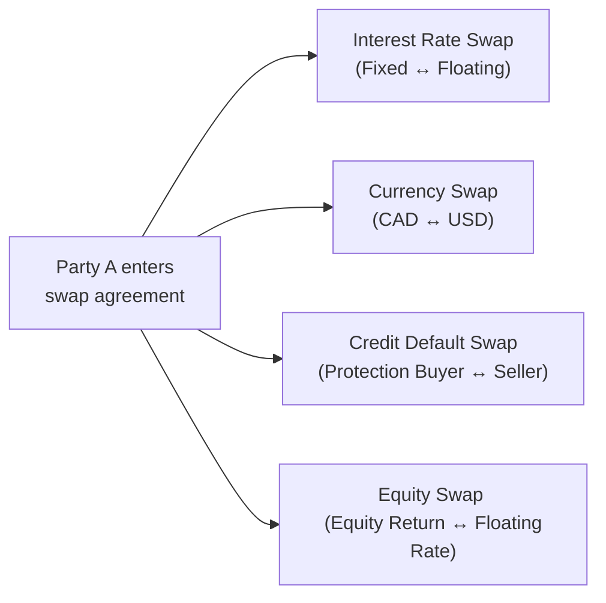
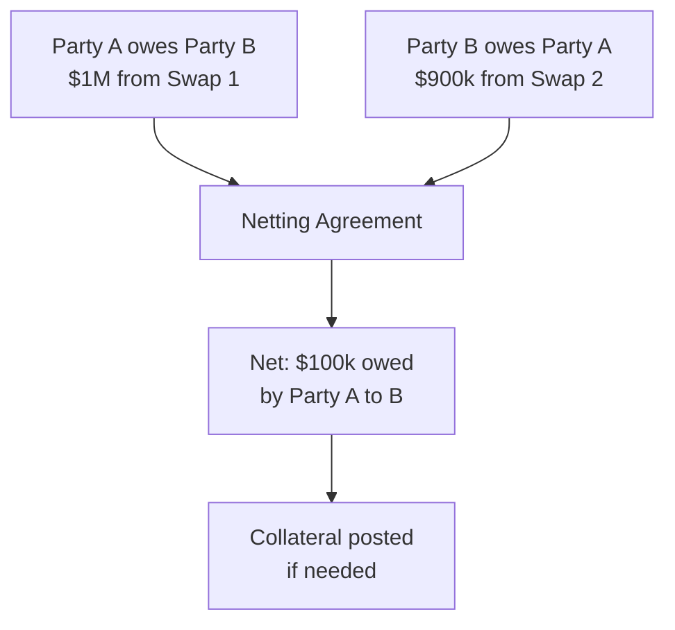

## 32.5 Swaps: Basic Features, Role of the Swap Dealer, and Types of Swaps

It’s funny how sometimes, in finance, something that sounds complicated at first turns out to be a matter of simply exchanging one set of cash flows for another. That’s basically what a swap is: an agreement where two parties decide, “Hey, I’ll give you my floating interest rate payments if you give me your fixed payments,” or “I’ll pay you in currency A if you pay me in currency B,” or even “I’ll pay you a return on a particular stock index if you give me a floating rate payment on a notional principal.” Once you start thinking of swaps that way, it becomes... well, a bit less scary, right?

Let’s explore foundational ideas, the role of the professionals who make these markets possible (the swap dealers), and the different types of swaps that are out there. Don’t worry if you find yourself pausing once in a while to say, “Wait, so who’s paying whom?”—that’s normal. Swaps can be intricate. But once we break them down, they often boil down to a few essential mechanics.

## Introduction

Swaps are used in various financial markets for hedging, speculation, and adjusting exposures. They’re over-the-counter (OTC) derivatives, which means they're often negotiated privately (although clearing can be arranged through central counterparties these days). Our Canadian marketplace also follows rules set out by the Canadian Securities Administrators (CSA) and regulated nowadays by the Canadian Investment Regulatory Organization (CIRO) for how trades are reported and how risk is managed.

In this section, we’ll answer questions like:
• Why do swaps exist in the first place?  
• How do banks, corporations, and even individuals (through structured products) use swaps?  
• Who or what is a swap dealer, and why are they important?  
• How are metadata and transaction-level data reported in Canada under current regulations?  
• Which types of swaps are the most common, and how do they work?  

## Basic Features of a Swap

At its core, a swap involves two parties who agree to exchange one set of payments for another over a specified period. They’ll agree on things like the:
• Notional Amount (the principal on which the exchanged cash flows are calculated—usually not exchanged itself).  
• Payment Frequency (e.g., quarterly, semi-annually, or annually).  
• Reference Rate(s) (for instance, a floating index such as CORRA or an interest rate benchmark in the case of interest rate swaps, or a currency exchange rate in the case of currency swaps).  
• Maturity Date (the final date or dates when the last exchange of cash flows occurs and the contract ends).

These features can be heavily customized. Swaps didn’t get popular because they’re cookie-cutter instruments. They are tailor-made for each party’s exposure, risk appetite, and hedging needs.

### Example: A Basic Interest Rate Swap
Let’s imagine Company A’s CFO, who is anxious about interest rates going up on the business’s floating-rate debt. That CFO might approach a swap dealer who offers them a swap where Company A pays a fixed rate of, say, 5% on a notional of $10 million, and in return, they receive a floating rate tied to some reference, maybe CORRA plus a spread. If interest rates rise, sure, Company A’s floating receipts go up, offsetting the rising cost of its original debt. Meanwhile, the swap dealer is taking the other side, possibly netting exposures from other clients or pegging it to its own risk management strategy.

In rough math terms, if the fixed rate is 5% and the floating rate is, let’s just say, 4.8% for the period, then at settlement, Company A might have a net payment to or from the swap dealer, depending on who “owes” what. The notional remains $10 million, but typically no principal is exchanged in an interest rate swap.

Here’s a quick example formula for calculating the fixed-leg payment in an interest rate swap over one period:

$$
\text{Fixed\_Leg\_Payment} = \text{Notional} \times \text{Fixed\_Rate} \times \text{Day\_Count\_Fraction}
$$

The day count fraction can be something like 30/360 or Actual/360, depending on the contract terms and industry standard. This is also an example of how IFRS 9 might come into play for hedge accounting, because the CFO can hedge the variable rate debt on the corporate balance sheet.

## The Role of Swap Dealers

Now, about the folks who smooth out the process: swap dealers. These are typically large financial institutions like banks or specialized broker-dealers. They stand ready to either enter into swaps to offset others’ exposures or to warehouse certain types of risk until they can find an offsetting trade. So, if you’re a CFO looking to shift your floating rate risk into fixed, you might talk to a bank’s derivative sales desk.

Here’s an informal way to think about it: If you and your friends want to swap baseball cards, you could search among each other to find a direct match. But usually, you might find a big collector who’s got extra sets of everything. That collector can always trade with you, though they’ll probably charge a “spread” in the process. This big collector is the “swap dealer”—someone who keeps the market liquid and ensures everyone can get their perfect trade in a timely fashion.

Swap dealers also manage complexities like:
• Regulatory Reporting: They have to submit trade details to recognized trade repositories, as required by CSA rules.  
• Credit Risk Mitigation: They often do sophisticated credit checks on counterparties.  
• Collateral Management: They might demand margin or collateral to reduce exposure.  

### Regulatory Context
In Canada, under CIRO guidelines (established post-2023, replacing the old IIROC and MFDA), the swap dealer often has direct obligations to ensure the trade is reported and collateral is posted in line with best practices. The new CSA rules have increased transparency in OTC markets, making sure major derivative trades are recorded in official repositories. So you might say that “gone are the days” of purely private, unrecorded deals—now there’s a significant regulatory framework ensuring a safer marketplace.

## Common Types of Swaps

Although in practice you can customize a swap to do just about anything, we typically put them in one of several key categories. I’ll mention four main ones:

### Interest Rate Swaps
Perhaps the most common swap: you exchange a fixed interest payment stream for a floating stream (or vice versa). Companies do this to fix their debt costs or, conversely, to reduce their interest expenses if they believe rates will go down. If you’re receiving the fixed leg, you’re effectively “short” the floating rate, which means you want rates to go down. If you’re paying the fixed leg, you’re going “long” the floating rate, hoping the floating rate might rise, or simply offset the rest of your balance sheet’s floating exposure.

There are variations like basis swaps, where both legs are floating but tied to two different reference rates (e.g., CORRA vs. 3-month CDOR, though Canada is currently transitioning from CDOR to CORRA due to benchmark reforms).

### Currency Swaps
Here, you’re swapping principal and interest payments in one currency for principal and interest payments in another currency. Typically, you actually exchange the notionals at the start and swap them back at the end, though some currency swaps might just notionally track the exchange rate. Let’s say a Canadian firm with a loan in USD wants to effectively pay interest in CAD because it receives most of its revenue in CAD. That firm could enter into a currency swap to transform USD payments into CAD payments. This can be handy for hedging foreign exchange risk, especially if the firm’s real business is denominated in a different currency.

### Credit Default Swaps (CDS)
A CDS is basically an insurance contract on the creditworthiness of a reference entity (like a corporation or a sovereign issuer). Party A (the protection buyer) pays periodic premiums to Party B (the protection seller). If the reference entity defaults or suffers another credit event, Party B compensates Party A based on an agreed-upon notional. Financial institutions often use CDS to manage credit risk on their loan portfolios. And speculators may buy or sell credit protection to bet on the rising or falling risk of default. Historically, as with the 2008 credit crisis, these instruments can get a bit wild if used for speculation in huge volumes.

### Equity Swaps
An equity swap is a transaction in which at least one leg is based on the performance of an equity security or index. The other leg might be a floating rate payment. For instance, you could have a swap where you receive the total return on the S&P/TSX 60 Index (dividends plus price appreciation) and pay a floating rate (like CORRA + a spread) each quarter. This can be a neat way to gain or shed equity exposure without having to hold the stock directly, or to transform a floating rate liability into an equity-based return. Hedge funds often use equity swaps to achieve leveraged exposure to equity markets or to shift positions quickly.

### Visual Overview of Key Swap Types

In each case, the contract's major building blocks—like notional principal, maturity date, and periodic payments—are similar, but the underlying references differ.

## Netting and Collateral

A big question I often get is, “But what if the other guy can’t pay me?” That’s the tricky part. These are OTC trades, so you’re exposed to the credit risk of the counterparty. You might be confident in a high-quality bank’s credit, but even top institutions can face stress. This is where netting agreements and collateral come into play, often handled under an International Swaps and Derivatives Association (ISDA) Master Agreement and Credit Support Annex (CSA). And yes, ironically, the “CSA” in “ISDA CSA” is not the same as the Canadian Securities Administrators “CSA.” Try not to get them confused!

• **Netting:** If you have multiple swaps with the same counterparty, you net all the gains and losses across your portfolio so that only the net amount is owed.  
• **Collateral (Margin):** The party that is out-of-the-money might have to post cash or high-quality securities to the other side. That helps ensure that if a default occurred, the winning party can seize the collateral to cover the net exposure.  

This significantly reduces credit risk. In addition, Canadian regulations and IFRS 9 accounting rules encourage or often require firms to maintain robust processes for margining these exposures.

### Diagram: Netting and Collateral

In the above diagram, we see how netting can reduce the gross exposures from $1M and $900k to a net $100k. If that net exposure is still large enough, collateral might be exchanged.

## A Quick Look at the Canadian Regulatory Landscape

Since January 2023, we’ve had the new single self-regulatory organization in Canada—CIRO. It replaced the older IIROC and MFDA. Under these new structures, swap transactions generally need to be reported to recognized trade repositories. The CSA, in conjunction with CIRO, has implemented robust rules to ensure transparency. This means that if you’re a Canadian institution transacting a large swap, the data (like notional, reference instrument, tenor) ends up in a database so that regulators can identify emerging risks.

Some key regulatory points:
• CIRO monitors compliance by investment dealers.  
• The CSA has provincial securities commissions responsible for derivatives oversight.  
• Clearing might be required for certain standardized swap transactions through recognized clearing agencies (for instance, LCH or CME).  
• If you’re dealing with cross-border swaps, you might also face rules from the CFTC in the U.S. or ESMA in the EU.  

## Real-World Examples and Case Studies

### Case Study 1: Hedging Foreign Currency Debt
Say a Canadian energy company issues a large bond in U.S. dollars to attract foreign investors. They’re worried that if the Canadian dollar appreciates, they might end up paying way more in CAD terms to service that debt. By entering a currency swap, they can effectively convert their USD obligations into CAD, paying a fixed rate in CAD while receiving a fixed USD amount to pay off bond coupons. Meanwhile, the swap dealer or counterparty uses the offsets from other trades to manage their net position. Everyone’s presumably happier with the newly aligned exposures.

### Case Study 2: Company with Floating-Rate Bank Loan
Let me tell you a quick story about a friend (we’ll call her Melanie) who was the treasurer at a mid-sized manufacturing outfit. She said, “We’ve got a $50 million term loan at a floating rate, and I’m losing sleep because if rates jump another percentage point, our interest costs will wipe out half of our net profits.” So she hopped on the phone with a bank swap dealer and set up a plain vanilla interest rate swap. That locked in a fixed interest expense of around 5.25%. Sure, if rates fell, she might pay an opportunity cost, but she was comfortable with that trade-off for the peace of mind it gave her. She effectively “swapped away” her floating risk and replaced it with a known fixed cost.

## Best Practices and Pitfalls

• **ISDA Documentation:** Always have a properly executed ISDA Master Agreement and Credit Support Annex in place. This legal foundation is essential for netting and collateral provisions to be enforceable.  
• **Evaluate Counterparty Credit Risk:** Don’t just assume your swap dealer is bulletproof. Keep an eye on credit spreads and due diligence.  
• **Understand the Mark-to-Market (MTM) Implications:** Swaps can move in or out of the money as market conditions change, generating accounting P&L.  
• **Track Hedge Effectiveness (IFRS 9 or ASC 815 in the U.S.):** If you want hedge accounting treatment, keep robust documentation and measure hedge effectiveness.  
• **Be Mindful of Liquidity Requirements:** Collateral calls can come at inopportune times if the swap moves against you.  

## Conclusion

Swaps are vital in modern finance for risk management, speculation, and everything in between. They allow companies to transform their interest exposures, manage currency risk, gain or shed credit exposure, or replicate an equity investment in a clean, derivative format. Swap dealers stand in the middle to keep trades flowing, manage risk, and comply with regulatory reporting. If you follow best practices around netting, collateral, and thorough documentation, swaps can be a powerful, flexible tool in your company’s or portfolio’s toolkit.

Finally, keep in mind that, in Canada, you have to follow CIRO guidelines for trade reporting and margin, and the CSA’s framework ensures a certain degree of standardization. If you want to take a deeper dive, check out IFRS 9 for how hedge accounting deals with these instruments and the official resources on the CIRO website at https://www.ciro.ca for up-to-date rules on derivative trade reporting.

For further exploration:
• “Swaps and Other Derivatives” by Richard Flavell.  
• IFRS 9 for Hedge Accounting and Risk Management (The IFRS Foundation website).  
• The CIRO website at https://www.ciro.ca and relevant CSA bulletins for official Canadian derivative reporting rules.  
• The International Swaps and Derivatives Association (ISDA) resources at https://www.isda.org.

---

## Sample Exam Questions: Swaps Basics and Types



### Which best describes an interest rate swap?
- [ ] An agreement to purchase shares of a company on margin.
- [x] A contract to exchange fixed-rate interest payments for floating-rate payments (or vice versa).
- [ ] A hedge against currency fluctuation risk by exchanging currencies.
- [ ] A type of credit instrument that protects against default on corporate bonds.

> **Explanation:** An interest rate swap specifically involves exchanging one stream of interest payments (usually fixed) for another stream (usually floating).

### Which of the following are typical roles of a swap dealer?
- [x] Market-making and providing liquidity in OTC derivatives transactions.
- [ ] Exclusively hedging foreign exchange exposures for central banks.
- [ ] Serving only as a clearinghouse for exchange-traded options.
- [ ] Acting as a registered pension plan for corporate employees.

> **Explanation:** Swap dealers are market participants who regularly trade swaps for their own accounts or facilitate trades for clients, providing liquidity.

### In a plain vanilla currency swap, which of the following usually occurs?
- [ ] The counterparties only exchange floating interest settlements.
- [ ] The counterparties exchange their equity positions in the market.
- [x] The counterparties exchange principal amounts in different currencies at the start and end, plus interest payments.
- [ ] The contract is settled via an options clearing corporation.

> **Explanation:** A currency swap commonly involves exchanging the principal amount (in different currencies) at inception and maturity, along with ongoing interest payments.

### For a corporate treasurer wanting to convert floating-rate debt to fixed-rate debt, which swap transaction would be most relevant?
- [x] Pay fixed, receive floating interest rate swap.
- [ ] Pay floating, receive floating interest rate swap.
- [ ] Pay an option premium to hedge default risk.
- [ ] Receive a fixed bond coupon from a bond futures contract.

> **Explanation:** To swap floating debt obligations to a fixed rate, one typically enters a swap where you pay a fixed rate and receive floating. This offsets the risk of rising interest costs.

### Which statement is most accurate regarding netting agreements in swap contracts?
- [x] Netting allows parties to offset multiple positions and settle on a single net amount.
- [ ] Netting typically increases the total credit exposure for both parties.
- [x] Netting uses an ISDA Master Agreement to ensure enforceability.
- [ ] Netting is prohibited under Canadian regulations.

> **Explanation:** Netting agreements help reduce credit exposure by offsetting different positions under the same master agreement. An ISDA Master Agreement is typically used for legal enforceability.

### Which term refers to the principal value on which swap payments are calculated?
- [x] Notional Amount.
- [ ] Margin Requirement.
- [ ] Collateral Rate.
- [ ] Rehypothecation Variable.

> **Explanation:** The notional amount is the principal on which the swap’s periodic payments are based.

### Which best describes a credit default swap (CDS)?
- [x] An instrument where the protection buyer pays a premium to a protection seller against the risk of default of a reference entity.
- [ ] A way for two companies to exchange their employees to reduce HR expenses.
- [x] A type of derivative used to hedge or speculate on the credit risk of a bond issuer.
- [ ] A direct insurance contract guaranteed by the government.

> **Explanation:** A CDS is a contract that provides protection against the default or credit event of a specific issuer. The buyer pays a premium, and the seller compensates if a defined credit event occurs.

### According to IFRS 9 principles, hedge accounting for swaps generally requires which of the following?
- [x] Documentation of hedge effectiveness.
- [ ] Depositing the notional amount at inception.
- [ ] Complete central clearing of all interest rate swaps.
- [ ] Prohibition on holding any net short or net long exposures in a portfolio.

> **Explanation:** IFRS 9 imposes hedge documentation and periodic effectiveness assessments to qualify for hedge accounting treatment.

### Under CIRO’s regulatory framework, swap dealers must:
- [x] Report swap transactions to authorized trade repositories.
- [ ] Provide insider trading information to retail investors.
- [ ] Offer guaranteed returns on currency swaps at all times.
- [ ] Exempt themselves from any netting arrangements or collateral usage.

> **Explanation:** Trade reporting is required by the CSA, and CIRO enforces these rules post-2023. Dealers must comply with official reporting guidelines to enhance market transparency.

### A typical equity swap involves:
- [x] Exchanging the total return on an equity index for a floating or fixed rate.
- [ ] A guaranteed minimum yield from municipal bonds.
- [ ] Receiving currency payments from a foreign government.
- [ ] A short sale of a corporate bond enabling credit risk hedging.

> **Explanation:** An equity swap usually involves swapping the returns (price appreciation plus dividends) on an equity index (or single stock) for a floating or fixed payment stream.


