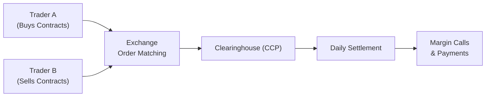

## 32.7 The Function of Exchanges and Clearinghouses

Have you ever wondered, perhaps while sipping your morning coffee, how all these fancy derivatives transactions manage to settle smoothly day after day? Or maybe you’ve heard of “the exchange” and “the clearinghouse” but never really pinned down how they connect in the grand scheme of derivatives trading. This section aims to demystify precisely that.

We’re going to look at how exchanges serve as the bustling marketplace for standardized derivatives, and how clearinghouses step in as the behind-the-scenes hero, ensuring that trades are finalized and no one defaults on their obligations (or at least if a default happens, that it doesn’t topple everything else like dominoes). “Well,” you might say, “who wants to read about back-office stuff?” Honestly, I used to think that too—until I realized how knowing these operational details can change your perspective on risk, margin calls, and using derivatives effectively. Let’s dig in.

-------------------

### Centralized Venues for Derivatives Trading

Exchanges are like the organized town square for all your derivatives—where standardized contracts find buyers and sellers, typically in real time. If you imagine a lively farmers’ market (yes, with the hustle and bustle of buyers and sellers shouting prices), you’re not far off. Instead of tomatoes, we’re talking futures and options, but the principle is quite similar.

• Standardization: On an exchange, all contracts are non-customized: a corn futures contract might always be for 5,000 bushels, delivered in March, June, September, or December.  
• Price Transparency: Exchanges provide real-time price quotes and data feeds, ensuring that everyone sees the same best bid and offer. This fosters fair competition.  
• Accessibility: Approved participants (like brokerages or proprietary trading firms) can access the exchange’s order book. Retail clients typically place orders through a broker who has membership or direct electronic access.

In Canada, the Bourse de Montréal is your go-to place for equity, index, and certain interest rate futures and options. The Bourse specializes in Canadian derivative instruments and operates through advanced electronic trading platforms. On the global stage, you’ve got powerhouses like the Chicago Mercantile Exchange (CME), Eurex in Europe, and so on—each with their own “specialties” in what they list (e.g., interest rates, equity indices, commodities, currencies, etc.).

-------------------

### The Clearinghouse as a Risk Manager

Now, behind every major exchange is a clearinghouse. If the exchange is the public marketplace, the clearinghouse is the core that makes sure everything gets locked in, matched, and guaranteed. The clearinghouse (often referred to as a Central Counterparty, or CCP) interposes itself between the buyer and the seller and effectively becomes the buyer to every seller and the seller to every buyer. This drastically cuts down counterparty risk because, instead of relying on the financial soundness of your trading counterparty, you trust the clearinghouse to manage the credit exposure. It’s as if the clearinghouse is saying, “Don’t worry, we’ve got your back if your trading partner fails to deliver.”

#### Central Counterparty (CCP) Benefits

• Reduced Counterparty Risk: By substituting itself as the counterparty, the CCP ensures that even if one market participant goes bankrupt, the clearinghouse steps in to meet the obligations.  
• Netting Efficiency: Contracts between the same parties can be netted out, significantly reducing unnecessary exposure.  
• Transparency: The CCP monitors positions, ensures proper margin coverage, and is subject to regulatory oversight (in Canada, that includes oversight from CIRO for participant compliance and the local securities commissions for systemically relevant activities).  

If there’s ever a scenario where a big trading firm can’t meet its margin calls, the clearinghouse has layers of defense: initial margin, variation margin, clearing fund contributions, and so on (more on that soon). Without this, the entire market could be left reeling from counterparty defaults.

-------------------

### Margin Requirements and Daily Settlement

If you’re exploring derivatives, you’ve surely heard the word “margin.” So, what is margin in the context of clearinghouses? It’s basically a “good-faith” deposit that aims to ensure each party can fulfill their contract obligations. Two key types of margin are:

• Initial Margin: The amount required to open a position.  
• Variation Margin (a.k.a. Mark-to-Market Margin): The daily (or intraday) payment based on fluctuations in the market price of the contract.

When the clearinghouse “marks to market” at the end of each trading day, they look at how much each open position gained or lost for that day. The positions that lost value must pay variation margin to the clearinghouse, and the positions that gained value receive variation margin. This daily settlement process is sometimes called daily settlement or daily mark-to-market.  

Here’s a simple formula for variation margin:

$$
\text{Variation Margin} = [\text{Settlement Price}_{t} - \text{Settlement Price}_{t-1}] \times \text{Contract Size} \times n
$$

Where:  
• \\( \text{Settlement Price}_{t} \\) is today’s settlement price,  
• \\( \text{Settlement Price}_{t-1} \\) is the previous trading day’s settlement price,  
• \\( \text{Contract Size} \\) is the notional size of one futures or options contract (e.g., 100 shares for an equity option),  
• \\( n \\) is the number of contracts held.

If the result is positive, you receive margin. If it’s negative, you pay margin. This daily matching ensures that losses (or gains) don’t accumulate unchecked. We never want to get stuck with a huge running loss that suddenly can’t be paid. By reconciling every day, the clearinghouse drastically lowers the probability of catastrophic defaults.

-------------------

### Post-Financial Crisis Reforms and CCP Clearing

After the 2008 financial crisis, major regulatory overhauls around the globe aimed to bring more transparency and safety to the OTC (over-the-counter) derivatives markets. Before then, a lot of trades happened off-exchange, typically in customized private contracts. But there was a big vulnerability: who guaranteed those deals if one side failed?  

Under the reforms—spearheaded by the G20 commitments and implemented locally in Canada, the U.S., Europe, and beyond—certain standardized OTC derivatives are now required to be cleared through a central counterparty (CCP). This is often referred to as “Central Clearing.” The idea is that if you have a plain vanilla interest rate swap that meets specific criteria (like certain tenors, underlying indexes, etc.), it should be cleared through a recognized clearinghouse.

In Canada, the Bourse de Montréal has partnered with the Canadian Derivatives Clearing Corporation (CDCC), which is recognized as a CCP. The net result is a more robust, transparent system in which big defaults, though still possible, are less likely to threaten the broader financial system.  

If you’re curious about the official details, the CIRO (Canadian Investment Regulatory Organization) website (https://www.ciro.ca) is a goldmine of compliance guidelines, bulletins about margin changes, and requirements for brokerages. The same scenario plays out in the U.S. with the Options Clearing Corporation (OCC) and in Europe with entities like LCH or Eurex Clearing.

-------------------

### Operational Workflow: From Trade Execution to Settlement

So how does a trade go from your “click” on your broker’s trading platform to the final settlement? Let’s walk through the big steps in a typical exchange-traded derivatives transaction.

```

```

1. Trade Placement: Trader A (the buyer) and Trader B (the seller) place their orders—could be market or limit orders—through their respective brokers.  
2. Matching: The exchange’s matching engine pairs these orders. Congrats, we have a “trade!”  
3. Novation: Immediately, the clearinghouse steps in and effectively becomes the buyer to Trader B and the seller to Trader A. This process is called “novation.”  
4. Margin & Collateral: Each side posts initial margin based on the size and risk of their position.  
5. Daily Settlement: At day’s end, the clearinghouse recalculates gains/losses for each open position.  
6. Margin Calls: If your position lost money on the day, the clearinghouse will require additional funds to be posted—this is variation margin. If you gained, you receive funds credited back to your margin account.  
7. Final Settlement or Delivery: Depending on whether the contract is physically delivered or cash-settled—and the listed expiration date—the final step either involves delivering the underlying commodity (like bushels of wheat) or making a final cash payment (like in many index futures).

The entire system is heavily monitored by the clearinghouse. Everyone has to maintain enough margin to cover potential losses. If a participant fails to meet a margin call, the clearinghouse can liquidate that participant’s positions and draw on the clearing fund if needed. That’s part of default management.

-------------------

### Default Management (When Things Go South)

Clearinghouses don’t just handle smooth trades; they also need robust procedures for what happens if a clearing member can’t pay up. This is often referred to as default management. Typically, it goes something like this:

• **Margin & Collateral**: First line of defense. If the defaulting member’s margin covers the losses, no further meltdown occurs.  
• **Guaranty Fund / Clearing Fund**: Each clearing member contributes to a pooled fund. If the defaulting trader’s margin falls short, the clearinghouse taps into the clearing fund.  
• **Assessment Powers**: Some clearinghouses have the right to make additional “assessments” on surviving clearing members, forcing them to contribute more if losses exceed the margin and clearing fund.  
• **Auction / Porting of Positions**: The clearinghouse can try to auction off or “port” (transfer) the positions of the defaulted member to other willing participants.  
• **Coordinated Response with Regulators**: In extreme cases, regulators might step in to assist or calm the market.

This layered approach helps prevent a single large default from dragging everyone down. Remember: the entire point of having a CCP is to contain risk so it doesn’t flood the financial system.

-------------------

### CIRO Standards and Compliance

You might be thinking, “Is my broker just free to do what they want?” Absolutely not. In Canada, the newly formed Canadian Investment Regulatory Organization (CIRO) sets the standard for registration, compliance, best execution, margin adequacy, and more. It’s the national self-regulatory organization that replaced the predecessor SROs (the MFDA and IIROC). If your firm is a CIRO-regulated investment dealer, it must:

• Abide by margin guidelines set by both the clearinghouse (like CDCC) and by CIRO.  
• Ensure that client accounts meet daily and intraday margin calls if necessary.  
• Provide robust risk disclosure so clients understand how derivatives and margin requirements work.  
• Follow rules on capital adequacy—brokerage firms themselves must maintain a certain capital buffer to cover operational and trading risks.

In practical terms, when you open a margin account or an options account, you’ll sign documents acknowledging the risk of leveraged trading and specifying that you must meet margin calls promptly. CIRO’s oversight extends across the chain—making sure clearing members, introducing brokers, and even retail advisors collectively uphold market integrity.

-------------------

### Practical Examples and Case Studies

**Case Study: A Margin Call in Action**  
Let’s say you have a small agriculture business in Saskatchewan, and you decide to hedge your expected wheat harvest by shorting wheat futures on the Bourse de Montréal. The initial margin is CAD 2,000 per contract. Over a few days, wheat prices rally (bad news if you’re short), so you incur losses of CAD 500 per contract. The clearinghouse calculates these daily mark-to-market losses and instructs your broker to collect variation margin. If you fail to pay, your futures positions might get closed out.  

**Case Study: 2008 Crisis Aftermath**  
During the financial crisis, some large trading firms holding massive derivatives exposure faced margin shortfalls. Regulators realized that these big positions, often OTC, had little to no central clearing. That’s largely why we have the new mandatory clearing rules for standardized swaps. If those positions had been centrally cleared, margin calls might have been made earlier, containing the problem.

-------------------

### Best Practices and Common Pitfalls

• **Keep Adequate Liquidity**: Don’t tie up all your capital in illiquid assets. You’ll need cash on hand for potential margin calls.  
• **Understand Contract Specifications**: Different exchanges have different contract sizes and tick values. You don’t want to be surprised by a bigger margin call than expected.  
• **Monitor Your Positions**: With daily settlement, you can’t ignore your account for days on end. You need real-time or at least daily tracking.  
• **Use Stop-Loss Orders**: If you’re speculating, consider stops or other risk-management tools to avoid massive losses.  
• **Be Aware of Delivery**: If you’re nearing expiry on a physically settled contract and have no intention or capacity to deliver (or receive) the underlying asset, close out or roll over your position in a timely manner.

-------------------

### Open-Source Tools and Additional Resources

• **Risk Analysis Tools**: If you’re the kind of person who likes to model scenarios, open-source libraries in Python (e.g., “Pyfolio,” “Quantlib”) or R (e.g., “PerformanceAnalytics”) can help track daily changes and margin requirements.  
• **Bourse de Montréal**: The Bourse’s website (https://www.m-x.ca) includes product specifications, margin requirements, and educational resources for Canadian derivatives.  
• **CIRO**: Check out https://www.ciro.ca for the latest bulletins on margin rule changes, guidance notes, and best practices for compliance.  
• **Options Clearing Corporation (OCC)**: The OCC (https://www.theocc.com) is the main clearinghouse for equity options in the U.S. They have detailed guides, risk circulars, and margin calculators.

-------------------

### Glossary

• **Central Counterparty (CCP)**: An entity that stands in the middle of all trades, becoming the buyer to every seller and the seller to every buyer to reduce counterparty risk.  
• **Daily Settlement (Mark-to-Market)**: The process of recalculating gains/losses on open positions and adjusting margin accounts at the end of each trading day.  
• **Default Management**: Procedures the clearinghouse follows if a member fails to meet margin calls or otherwise breaches its obligations.  
• **Settlement**: The actual exchange of money or assets that finalizes a derivatives contract. Settlement can be cash (paying the difference in price) or physical (delivering the underlying commodity or instrument).

-------------------

### Concluding Thoughts

It’s easy to overlook the roles of the exchange and the clearinghouse. We tend to focus on the bigger, more dramatic aspects of derivatives: the potential for large profits (and big losses). But these behind-the-scenes institutions are the backbone of safe and efficient markets. Exchanges provide the meeting place and the initial guardrails. Clearinghouses enforce financial discipline with margin requirements and daily settlement, ensuring that if something does go astray, the fallout is minimized.

When you place your next futures or options trade—maybe to hedge a portfolio or speculate on interest rates—take a moment to appreciate the operational marvel that goes on in the background. It’s the reason you can trust the market to function, even in times of volatility.

-------------------

## Sample Exam Questions: The Function of Exchanges and Clearinghouses



### A clearinghouse generally reduces which of the following risks for market participants?

- [ ] Interest rate risk
- [x] Counterparty credit risk
- [ ] Liquidity risk
- [ ] Currency exchange rate risk

> **Explanation:** By interposing itself between buyer and seller (becoming a central counterparty), the clearinghouse mitigates the risk that one party defaults on its obligations.

### Which of the following best describes the daily settlement process?

- [ ] It is the process of matching a buy order with a sell order on the exchange.
- [ ] It is the final settlement at contract expiration.
- [ ] It is the procedure for default management when a clearing member goes bankrupt.
- [x] It is marking all open positions to the current market price and adjusting margin accounts accordingly.

> **Explanation:** Daily settlement (mark-to-market) involves recalculating gains/losses for all open positions each day and adjusting margin balances.

### Under post-financial crisis reforms, certain standardized OTC derivatives are now required to be cleared through a CCP. What is the main purpose of this rule?

- [x] To reduce systemic risk by centralizing clearing and margin requirements.
- [ ] To terminate all OTC derivatives trading.
- [ ] To fix the price of derivatives.
- [ ] To ban speculation.

> **Explanation:** Regulators mandated central clearing to reduce systemic risk, promote transparency, and ensure standardized margin and collateral requirements.

### In the context of margin requirements at a clearinghouse, which type of margin reflects the daily gain or loss on a position?

- [ ] Initial margin
- [x] Variation margin
- [ ] Maintenance margin
- [ ] Portfolio margin

> **Explanation:** Variation margin is the daily mark-to-market payment to reflect gains or losses relative to the previous day’s settlement price.

### Which entity in Canada oversees broker compliance with margin rules and other market conduct standards?

- [ ] The Options Clearing Corporation (OCC)
- [ ] The Mutual Fund Dealers Association (MFDA)
- [ ] The Investment Industry Regulatory Organization of Canada (IIROC)
- [x] The Canadian Investment Regulatory Organization (CIRO)

> **Explanation:** As of 2023, the MFDA and IIROC amalgamated into CIRO, which now supervises investment dealers and market integrity.

### A clearinghouse’s default management process usually does NOT involve:

- [x] Distributing losses equally among all retail clients.
- [ ] Using the defaulter’s initial margin and clearing fund contributions.
- [ ] Attempting to port or auction the defaulter’s positions.
- [ ] Coordinating actions with regulators if needed.

> **Explanation:** Losses aren’t distributed equally among all retail clients; instead, the clearinghouse first uses the defaulting member’s margin and the clearing fund. If necessary, it may coordinate with regulators and possibly assess additional contributions from clearing members, but retail clients are typically not automatically tapped.

### What is novation in the context of a clearinghouse?

- [ ] The final delivery of the underlying commodity.
- [ ] A type of derivative contract.
- [x] The process by which the clearinghouse becomes the buyer to every seller and the seller to every buyer.
- [ ] The procedure for daily margin calculation.

> **Explanation:** Novation occurs when the clearinghouse steps in to replace the original trading counterparties, ensuring the clearinghouse is the entity each side contracts with.

### Which statement is true about physically settled futures at expiration?

- [ ] They are always cash settled.
- [ ] They can be transferred into an options contract.
- [ ] They have no further obligation after the final margin call.
- [x] The short seller is generally obligated to deliver the physical commodity to the buyer.

> **Explanation:** Physically settled contracts require actual delivery of the underlying product. The seller must provide the commodity, and the buyer must accept it.

### Which of the following is an advantage of trading on an exchange rather than OTC?

- [ ] Complete freedom to customize every aspect of the contract.
- [x] Price transparency and reduced counterparty risk through central clearing.
- [ ] Exemption from regulatory oversight.
- [ ] Unlimited margin availability.

> **Explanation:** Exchanges provide standardized contracts, full price transparency, and central clearing that reduces counterparty risk, whereas OTC trades can be fully customized but lack these safeguards.

### True or False: A central counterparty (CCP) eliminates the possibility of defaults in the market.

- [ ] True
- [x] False

> **Explanation:** A CCP does not eliminate default risk entirely; it manages and mitigates it through margining, mutualized resources (like clearing funds), and default management processes. However, market participants can still default, prompting the clearinghouse to enact its risk measures.




