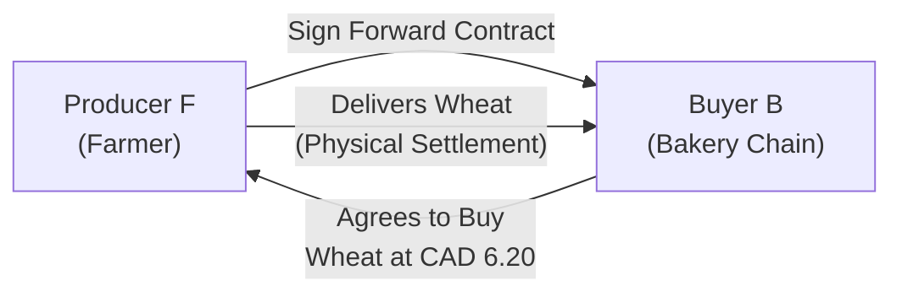
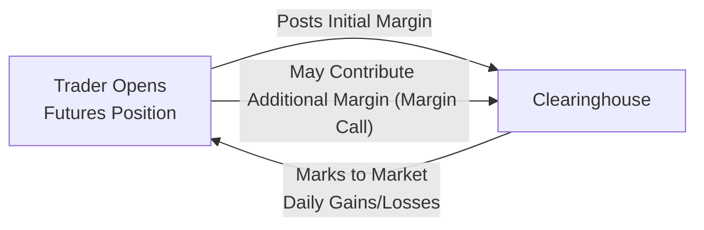
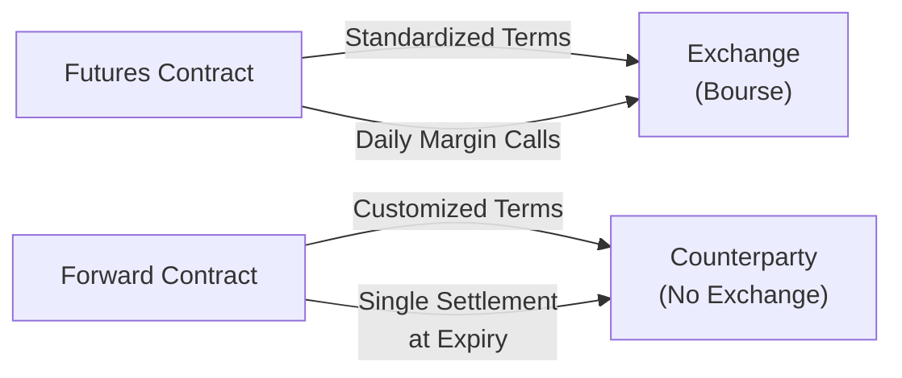

## 32.8 OTC Forwards and Other Futures Contracts

Let’s imagine you have a friend who’s a farmer—yep, that friend who always shows up at parties with the best fresh produce (by the way, that’s a big win for your potluck meal). They’re worried about what happens if the price of their crop plummets right before harvest. Meanwhile, you might know a local bakery chain that wants a stable price for wheat, hoping it won’t skyrocket when they need to buy ingredients. In both scenarios, each side wants some certainty. That’s where tools like OTC forward contracts and exchange-traded futures come in.

In this section, we’ll explore the essential workings of OTC (over-the-counter) forwards and other futures contracts, focusing on how they help different market players protect themselves or speculate on price movements. We’ll also walk through real-world examples, discuss margin requirements, and highlight best practices—particularly under the Canadian regulatory framework overseen by the Canadian Investment Regulatory Organization (CIRO). So, buckle up, and let’s dive in!

---

## Understanding Forward Contracts

A forward contract, in simplest form, is just a private deal between two parties to buy or sell a specific asset at a set price on a future date. The terms aren’t standardized. Because of that, parties can customize virtually everything: the quantity, the quality, the preferred settlement procedure, and the exact date. It all comes down to their mutual agreement.

• Spot Price: The going rate of an asset if you were to buy or sell it today.  
• Forward Contract: A private, non-standardized agreement to buy/sell an asset at a pre-agreed future date and price.  

### Key Features of OTC Forwards

1. Customization: Unlike exchange-traded futures, which typically follow prescribed rules (for contract size, maturity dates, etc.), forward contracts can be fully tailored. If you want to lock in the price for a weird quantity of canola oil or an unusual currency pair, you can.  
2. Counterparty Risk: Forwards carry a notable risk: what if the other side can’t pay up? With no exchange in the middle, you rely on your counterparty’s creditworthiness.  
3. Settlement Flexibility: You and your counterparty decide how and when final payments will be handled. This might be cash-settled or physically delivered.  

#### Real-Life Example: Hedging Commodity Prices
Picture again our local farmer (Producer F) and the bakery chain (Buyer B). Suppose the spot price of wheat is CAD 6.00 per bushel right now. Producer F is worried the price in a few months might drop, and Buyer B is worried it might rise. To address both concerns, they can sign a forward contract at, say, CAD 6.20 per bushel for delivery in three months. Producer F locks in a guaranteed selling price, while Buyer B locks in a known purchase cost. If the price leaps to CAD 7.00 at harvest, Buyer B benefits since they get it cheaper at CAD 6.20. If the price sinks to CAD 5.50, Producer F benefits because they still sell at the higher price.

Here’s a little flowchart in Mermaid to lay out how this forward arrangement might look:

---

## From Forwards to Exchange-Traded Futures

Okay, so we know forward contracts are handy but can carry some serious default risk. This is where futures contracts step in. A futures contract is basically a standardized forward that trades on an exchange like the Bourse de Montréal (the “Bourse”), CME (Chicago Mercantile Exchange), or ICE (Intercontinental Exchange). These big exchanges set the rules: contract sizes, fixed expiration dates, and standard quality and quantity criteria. And crucially, they protect you from counterparty risk by acting as the intermediary via a clearinghouse.

• Futures Contract: A standardized, exchange-traded version of a forward deal.  

### Standardization and Margin

In the futures world, standardization is key. Because the terms are fixed by the exchange, you don’t negotiate details. Instead, you get liquidity and transparency—there’s a known contract size, a known daily price limit, set expiry months, etc. That’s super helpful if you want to get in or out of a position quickly.

But what if you want something extra fancy? Then you might still opt for an OTC forward. Or, if you need large volumes with standard contract specs, you might choose futures. Each product has a place in the market.

One difference you’ll see right away with futures is the exchange’s requirement for margin:

• Initial Margin: The amount of capital required to open a futures position.  
• Maintenance Margin: The minimum equity that must remain in your futures account; if your account drops below this level, you get a margin call.  

If you’ve ever been on the receiving end of a margin call, you’ll know it can feel like a jolt. But margin keeps the system stable. It ensures that every participant has enough “skin in the game” to meet potential losses on a day-to-day basis. The clearinghouse steps in each day (or sometimes multiple times a day) to “mark to market,” meaning they update each trader’s profit or loss based on the latest market price.

Here’s a quick look at how margin flow can work:

---

## Hedgers, Speculators, and Why They Play These Markets

### Hedgers
Hedgers come to the futures (or forwards) table because they have an underlying risk in the physical market. Our farmer is a classic hedger, but so is an airline trying to lock in jet fuel prices, or a multinational firm wanting stable foreign-exchange rates. Their primary goal is NOT to make huge profits on the derivative itself—it’s to limit or offset potential negative fluctuations in their real-world business costs or revenues.

### Speculators
Speculators, on the other hand, are typically in the game with no underlying exposure in the physical market. For them, it’s all about profit from trading. They’ll take positions in futures contracts if they think they can guess which way the market’s headed. And you know, that can be thrilling. But also pretty risky if your analysis doesn’t pan out.

Interestingly, both groups are necessary. Hedgers benefit from the liquidity provided by speculators. In turn, speculators get the chance to find profitable trades in liquid markets. It’s kind of a symbiotic relationship.

---

## Other Futures Contracts in Brief

Modern futures markets extend well beyond just wheat and corn. We can see futures on pretty much anything:

• Commodities: Crude oil, gold, soybeans, natural gas, coffee beans—you name it.  
• Financial Indices: S&P/TSX 60, S&P 500, NASDAQ-100, etc. Index futures help investors hedge entire equity portfolios.  
• Foreign Exchange: Key currency pairs like CAD/USD, EUR/USD, JPY/USD. Though currency forwards on an OTC basis are quite common, standardized FX futures also exist.  
• Treasury and Government Bond Futures: Like the Canadian Government Bond (CGB) futures settled through the Bourse de Montréal, or U.S. Treasury futures at the CME.  

No matter which subclass you’re dabbling in, standardization is at the heart of exchange-traded futures. The Bourse de Montréal has a range of interest rate and equity index futures, including the popular SXF (S&P/TSX 60 Index Future) and CGF or CGB (Canadian bond futures). If you’re in Canada and you want direct, regulated exposure to interest rate movements, these products offer a potent, yet tightly overseen, approach.

---

## Margin and Settlement Conventions

Because the clearinghouse stands in between buyers and sellers, daily settlement is crucial:

1. **Mark-to-Market:** Every trading day, your account is credited or debited based on how futures prices moved relative to your position. If you’re long and prices went up, your account shows a profit. If prices dropped, you have a loss.  
2. **Maintenance Margin Checks:** If that daily settlement causes your account to dip below your maintenance margin, you’ll have to top it back up to the initial margin level. This is sometimes called a “margin call.”  
3. **Settlement at Expiry:** Depending on the contract, you might see physical delivery or cash settlement. For instance, stock index futures are usually cash-settled. Commodity futures can be physically delivered, but many traders close or roll over positions before delivery day.

In Canada, margin guidelines come from CIRO and from the clearinghouse, such as the Canadian Derivatives Clearing Corporation (CDCC). Market participants must comply with both internal risk controls and external regulatory requirements to keep trading.

---

## Benefits and Pitfalls

### Benefits
• **Risk Management:** Both forwards and futures help lock in prices, effectively transferring risk to the other party.  
• **Price Discovery:** High trading volume in futures markets often yields transparent, globally recognized “benchmark” prices.  
• **Liquidity:** Standardized futures can be quite liquid, letting you enter or exit positions quickly.

### Pitfalls
• **Leverage Risks:** Futures margin requirements are relatively small compared to the notional contract value, meaning you can control a huge position with less upfront capital. Big wins are possible—but so are big losses.  
• **Basis Risk:** For hedgers, the price of the derivative may not move exactly in sync with the underlying exposure. That difference is known as the “basis,” and it can reduce hedge effectiveness.  
• **Counterparty Risk (Forwards):** With OTC forwards, you have no clearinghouse. The gulp moment might come if your counterparty cannot fulfill its side of the deal.

---

## Examples of OTC Forwards vs. Exchange-Traded Contracts

### Currency Forwards
If you’re a Canadian exporter receiving USD payments, you might want to lock in your CAD conversion rate. Using a currency forward with your bank, you agree on an exchange rate for a date in the future, knowing exactly how many Canadian dollars you’ll get. This is an OTC forward, so it’s flexible but not guaranteed by an exchange.  
   
In contrast, you could step into the currency futures market—maybe you pick the CAD/USD futures on a global exchange. You’ll abide by the standard contract size (for example, 100,000 USD), the standard expiry months, and you’ll post margin. But you’ll also get the reliability that comes from daily mark-to-market and a clearinghouse standing behind each trade.

### Commodity Futures and Forwards
Let’s say you’re a coffee importer in Toronto. If you want to buy a very specific quality of coffee bean from Brazil in large volumes, you might sit down with a commodity trading house and negotiate an OTC forward. You’ll specify exactly which grade of beans, the shipping terms, and the final settlement details.  
   
But if your needs are more standard, you could hop onto the ICE exchange’s coffee futures. You’ll get efficient pricing and plenty of liquidity. The catch is you can’t tailor it to your exact bean preferences.

---

## Regulatory Landscape in Canada

Post-2023, both former IIROC and MFDA (now defunct) are consolidated under CIRO. CIRO sets standards for margin, registration, and ongoing compliance for investment dealers. The Canadian Securities Administrators (CSA) also plays a key role—through various National Instruments—ensuring robust oversight of derivatives trading, including mandatory reporting of OTC derivatives and, in some cases, central clearing.

Key references:
- [CIRO](https://www.ciro.ca) for national self-regulatory guidelines and resources.  
- [CSA website](https://www.securities-administrators.ca/) for harmonized rules on derivatives.  
- [Bourse de Montréal](https://www.m-x.ca/) for official futures product specs, listing details, and margin requirements.  
- [Bank of Canada’s Commodity Price Outlook](https://www.bankofcanada.ca/) for economic analysis relevant to Canadian markets.

---

## Data and Tools

For the tech-savvy trader or risk manager, open-source libraries and platforms like “QuantLib,” “R” packages (e.g., “RQuantLib,” “quantmod”), or Python libraries (“pandas,” “pandas_datareader,” “pyfinance”) offer robust ways to model forward curves, run regression analyses, or do scenario testing of futures strategies. You can also tap into free or paid APIs for real-time or historical prices:

- Yahoo Finance, Quandl/Nasdaq Data Link, or TMX endpoints for Canadian-specific data.  
- Interactive Brokers or Bloomberg terminals (if your budget allows) for advanced analytics and order routing.  

---

## Crafting Your Strategy: Best Practices and Common Pitfalls

• **Define Your Objective:** Are you hedging? Speculating? Arbitrage? Strategy clarity helps you pick the right product.  
• **Know the Essentials:** Keep track of contract specifications, expiration dates, and margin requirements.  
• **Practice Proper Position Sizing:** Just because margin requirements are low doesn’t mean you should max out your buying power.  
• **Watch Market Fundamentals:** Supply and demand shifts, macroeconomic indicators, and Central Bank announcements can all move prices.  
• **Stay in Compliance:** Always follow CIRO’s margin and reporting rules, as well as CSA requirements for any OTC contracts.  
• **Manage Cash Flows:** Forwards sometimes have a single settlement at maturity, while futures can require daily margin calls. Make sure you understand the cash flow implications of each.  

---

## Diagram: Comparing OTC Forwards and Futures

Here’s a simple side-by-side structure, in a Mermaid diagram:

Use this as a mental map: futures flow through an exchange; forwards stay private between counterparties.

---

## Conclusion

In the world of derivatives, choosing between an OTC forward and a standardized futures contract comes down to your priorities: Do you need customization or want the credit protection and liquidity of an exchange? Maybe you’re a producer needing a specialized hedge, or a speculator looking to profit from short-term price swings. Whichever path you choose, understanding these products’ mechanics and regulatory frameworks can help you confidently navigate the markets.

Keep in mind that the deeper you go, the more you’ll encounter advanced topics like cost of carry, basis analysis, interest rate parity, and complex margin rules. Yet at the heart of it all remains that simple reason we started with: one side wants stability, the other side wants the chance to trade on price movement. That synergy drives forward and futures markets—and it’s what fuels the fascinating world of derivatives we explore in this course.

If you want to continue exploring, check out:

- [CIRO Margin Requirements](https://www.ciro.ca) for the latest Canadian margin rules.  
- [Bank of Canada Research](https://www.bankofcanada.ca/research/) for commodity outlooks and monetary policy updates.  
- [Bourse de Montréal Product Specifications](https://www.m-x.ca/) to see contract sizes, tick values, and settlement methods.  
- [QuantLib](https://www.quantlib.org/) or [R QuantLib](https://cran.r-project.org/web/packages/RQuantLib/) for open-source pricing models.  

Now that you have an overview of OTC forwards and futures contracts, let’s put your knowledge to the test!

---

## Sample Exam Questions: OTC Forwards and Other Futures Contracts



### Which of the following best describes a primary difference between an OTC forward and an exchange-traded futures contract?

- [ ] OTC forwards are marked-to-market daily while futures are settled only at expiry.  
- [ ] OTC forwards always involve physical delivery, while futures are only cash-settled.  
- [x] OTC forwards are private agreements with customizable terms, while futures are standardized and traded on an exchange.  
- [ ] OTC forwards never involve counterparty risk.  

> **Explanation:** The major difference is customization and the role of exchanges. Forwards are private and customizable, whereas futures are standardized and cleared by an exchange.

### An airline wants to lock in jet fuel prices for next quarter. Which of the following describes the airline's role?

- [x] Hedger, because they aim to reduce their exposure to jet fuel price fluctuations.  
- [ ] Speculator, because they are betting on price decreases.  
- [ ] Arbitrageur, because they exploit price discrepancies.  
- [ ] Market maker, because they quote continuous bids and offers.  

> **Explanation:** The airline holds a real underlying exposure to jet fuel prices, so using derivatives to limit risk makes them a hedger.

### When might a margin call be triggered in a futures account?

- [ ] Whenever the underlying spot price goes up.  
- [ ] Only if the contract expires in-the-money.  
- [x] When the account balance falls below the maintenance margin level.  
- [ ] If there is no open position in the account.  

> **Explanation:** Margin calls occur if daily losses reduce the account balance below the maintenance margin threshold.

### Which of the following is a benefit of using standardized futures rather than OTC forwards?

- [x] Reduced counterparty risk due to the clearinghouse.  
- [ ] Complete flexibility in determining contract terms.  
- [ ] Absence of daily margin procedures.  
- [ ] Exemption from all regulatory requirements.  

> **Explanation:** A clearinghouse stands between parties, reducing counterparty default risk. By contrast, forwards are private and do not offer that protection.

### If a crude oil producer enters a forward contract to sell oil at CAD 90.00/bbl and at expiry the spot price is CAD 105.00/bbl, what does it suggest?

- [ ] They made more profit than in the spot market.  
- [x] They missed out on higher spot price upside but locked in a guaranteed sell price.  
- [ ] The forward contract automatically rolled over.  
- [ ] They could renegotiate the forward contract.  

> **Explanation:** By locking the price at CAD 90, they hedge against lower prices but forego higher prices at expiry.

### Which of the following is a primary risk of OTC forwards?

- [ ] Gamification risk.  
- [x] Counterparty default risk.  
- [ ] Lack of underlying asset.  
- [ ] Prohibited under CIRO regulations.  

> **Explanation:** Because forwards are private agreements, each party must rely on the other’s creditworthiness, introducing default or “credit” risk.

### In Canada, which organization oversees derivatives trading rules for investment dealers?

- [ ] MFDA (Mutual Fund Dealers Association)  
- [ ] IIROC (Investment Industry Regulatory Organization of Canada)  
- [x] CIRO (Canadian Investment Regulatory Organization)  
- [ ] ASIC (Australian Securities & Investments Commission)  

> **Explanation:** MFDA and IIROC are now defunct; currently, CIRO oversees investment dealers and derivatives trading standards in Canada.

### Which of the following contracts would most likely be cash-settled at expiry?

- [x] Stock index futures.  
- [ ] Wheat futures.  
- [ ] Physical gold futures.  
- [ ] Crude oil forwards.  

> **Explanation:** Often, index futures settle in cash because there’s no tangible asset to deliver.

### For a speculator hoping to profit from short-term price movements, which advantage do futures contracts provide?

- [ ] No margin requirement.  
- [ ] Guaranteed profit from daily marking-to-market.  
- [x] High liquidity and the ability to enter and exit positions quickly.  
- [ ] Zero market risk.  

> **Explanation:** Futures markets tend to be highly liquid, allowing speculators to open or close positions rapidly, but they still face market risk and must post margin.

### True or False: A forward contract is always more liquid than a futures contract.

- [ ] True  
- [x] False  

> **Explanation:** Futures are typically more liquid than forwards because they trade on centralized exchanges with standardized terms and robust secondary markets.


