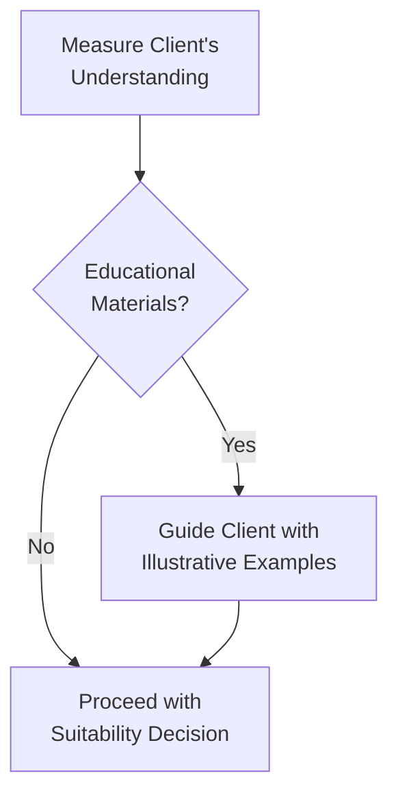

## 32.9 Determining Client Suitability

So, you’ve probably heard that any time you’re dealing with derivatives—futures, options, swaps, you name it—there’s a world of risk and reward to navigate. You might be excited about the potential for leveraged returns or advanced hedging strategies, but there's a big question that stands between you and these shiny opportunities: Is a given derivative position suitable for the particular client? If we think about it in simpler terms, it’s kind of like recommending a certain diet to someone. Do you just suggest the same meal plan to a pro athlete and a complete beginner? Probably not. You’d want to understand their goals, their ability to handle different types of training or nutrition, and ensure that they’re not going to end up worse off.

In the context of finance, especially in Canada, “Determining Client Suitability” is absolutely critical. CIRO (the Canadian Investment Regulatory Organization)—which used to be IIROC and MFDA back in the day—stands firmly on the principle that you must know your client, or KYC, before making any recommendations. This section discusses how you gather client information, how you interpret it, and how you use it to advise responsibly on derivatives-based strategies. We’re going to keep the tone a bit casual, so imagine we’re chatting over coffee about the ins and outs of ensuring your client (maybe even you, if you’re your own client) is ready for advanced derivatives.

---

### Why Suitability Matters

Let me share a quick personal story. A few years ago, I was chatting with a friend who had started dabbling in options. She heard from another friend that selling naked calls “makes easy money.” So, she jumped straight in. Problem was, she had no idea what to do if the market soared, leaving her calls deep in the money. She lost sleep, money, and faith in investing. That was a classic case of ignoring suitability. She wasn’t financially or psychologically prepared for that much risk.

In the regulated brokerage world, we can’t let this happen. Regulators like CIRO (and historically, IIROC or MFDA) require that firms perform a thorough check to ensure strategies match clients’ risk tolerance, objectives, and financial situation. The reason is simple: if a strategy goes south, the client must be financially and emotionally capable of handling the ups and downs.

---

### KYC (Know Your Client) Fundamentals

When you hear KYC, think of it as a multi-step handshake between you (the advisor or the derivatives specialist) and the client. You’re gathering facts: financial background, net worth, risk appetite, credit situation, investment knowledge, and so on. Once you have that data, you can figure out if a trade—be it a straightforward covered call or a more exotic structured swap—makes sense for them.

Below is a quick overview of the KYC elements you typically look at:

• Client Identity: Basic info such as name, address, ID.  
• Financial Situation: Income, net worth, liquidity needs, outstanding loans or obligations.  
• Investment Objectives: Growth, income, capital preservation, speculation, or hedging.  
• Risk Tolerance: The client’s willingness and ability to sustain losses.  
• Investment Knowledge: Trading experience, familiarity with derivatives, general sophistication.  
• Time Horizon: Short-term speculation vs. long-term hedging or retirement planning.  

Investment knowledge is crucial for derivatives. A brand-new investor who can barely define “option strike price” might not be ready to short a volatility swap. You have to gauge not just how much they claim to know, but how much they actually understand the mechanics and potential pitfalls.

---

### The Suitability Obligation Under CIRO

CIRO enforces the principle that recommended transactions must be suitable for the client. This extends to:

• Ensuring the client’s risk level matches the recommended strategy.  
• Making sure the client’s overall portfolio isn’t being subjected to undue risk.  
• Explaining material risks.  
• Obtaining express consent if a client wants to override typical recommendations (though disclaimers alone won’t shield you if the recommendation is clearly unsuitable).  

Canada also has guidelines under the Canadian Securities Administrators (CSA) that emphasize ongoing suitability. So, it’s not just a “once and done” process. If something significant changes in the client’s life—say, a major shift in net worth or a sudden need for liquidity—you must revisit suitability.

Open-source frameworks like the CSA’s series of notices (e.g., CSA Staff Notices on KYC and suitability) can help you structure your process for collecting and evaluating this information. If you need in-depth references, head over to the official CSA website or check out CIRO’s rulebook at [https://www.ciro.ca](https://www.ciro.ca).

---

### Risk Profiling and Investor Questionnaires

When you risk-profile a client, you’re basically putting them into categories like “conservative, moderate, aggressive,” and so on. But it’s more nuanced than that. Two people might both say they’re “moderately aggressive,” but one might have high net worth and see derivatives as an acceptable risk, while the other might have minimal savings and be only “moderately aggressive” when it comes to equities.

Sometimes, advisors or brokerage firms use specialized questionnaires—online or paper-based—to gauge risk tolerance. These might ask about past behavior (e.g., “What did you do when the market dipped 10% last year?”) or hypothetical scenarios (“How would you react to a 20% drop in your portfolio value?”). The answers help formulate a risk score. While these questionnaires aren’t perfect, they’re a decent place to start. They give you and the client a basis for discussion. Then you add in the client’s net worth, time horizon, and derivative knowledge to see if there’s alignment.

Let’s visualize it with a quick flow diagram:

In this flow, you start by collecting all relevant KYC info (A), then gather more detailed risk data via the questionnaire (B), which leads to a preliminary classification (C). You then refine that classification by cross-checking the client’s actual objectives, knowledge, and time horizon (D). Finally, you come to a conclusion about which types of derivative strategies (if any) are suitable (E).

---

### Matching Strategies to Clients: The Art of Suitability

Alright, so how do you match, for instance, a protective put strategy to one client and a short straddle to another? Here’s a simple example:

• Protective Put for Risk-Averse Clients: Suppose your client is new to derivatives and simply wants to limit losses on a stock they own (or maybe they’re worried about an upcoming earnings announcement). A protective put, where they buy a put option on the stock they hold, might be the simplest “insurance policy.” It’s easy to explain: if the stock drops significantly, they have the right to sell it at the strike price. The premium paid is like paying for an insurance premium.  

• Complex Spreads for Sophisticated Investors: Now let’s say you have a client who has been trading options for 10 years, is well-capitalized, and is comfortable with multi-leg strategies. A complex spread like an iron condor could be suitable if they’re aiming for income in a sideways market. But you’d confirm they can handle the margin requirements, the possibility of large but more limited losses, and the daily monitoring demands.

This difference in strategy—protective put vs. iron condor—highlights the need to tailor each recommendation to the client’s risk capacity, knowledge, and wealth. If your brand-new client can’t define a call versus a put, they probably shouldn’t be dealing with complicated spreads.

---

### Regulatory Spotlights: CIRO, CSA, and Provincial Regulators

You might be thinking: “But how do I keep track of all these guidelines?” The good news is that everything is fairly well-documented. Here’s a quick overview:

• CIRO is your main self-regulatory body in Canada for investment dealers (including derivative transactions) and market integrity.  
• The Canadian Securities Administrators (CSA) is an umbrella organization of provincial and territorial securities regulators (like the Ontario Securities Commission (OSC), the Autorité des marchés financiers (AMF) in Quebec, etc.). They issue national instruments and guidance for KYC and suitability.  
• CIPF (Canadian Investor Protection Fund) is there to protect client assets if a CIRO member firm becomes insolvent. While CIPF does not shield you from market losses, it does provide protection of your account’s assets if the brokerage fails financially.  

In practice, you’re looking at rules that revolve around National Instrument 31-103 (Registration Requirements, Exemptions, and Ongoing Registrant Obligations), which addresses KYC and suitability in broad terms. CIRO’s own rules further clarify how member firms must supervise derivative transactions to ensure compliance. Advisors, compliance officers, and even the firm’s leadership must commit to these guidelines to prevent mis-selling or unscrupulous practices.

---

### Ethical and Legal Obligations

When we talk about suitability, it’s not just about following the letter of the law. There’s also a strong ethical dimension. Clients rely on you to guide them. If you’re dealing with an unsophisticated individual, you might have to go the extra mile to clarify how a strategy works. If you sense they can’t grasp the risk or truly can’t afford a potential loss, even though they claim they’re “totally up for it,” you have a responsibility to step back. A strong ethical stance can protect both the investor’s finances and your own professional integrity.

Think of it like having a driver’s license exam. If the examiner believes you’re simply not ready for the highway, they shouldn’t let you merge into traffic. Similarly, if a derivative is beyond the comprehension or financial ability of a client, it’s your duty to say “No, let’s find something else.”

---

### Assessing Capacity to Bear Potential Losses

Some derivatives can wipe out your principle rather quickly, or even lead to losses exceeding your original investment (for instance, in the case of shorting options without coverage, or some margin-based futures positions). A vital part of suitability is assessing the client’s capacity to handle such swings. That capacity is both objective (i.e., do they have enough free cash flow or capital reserves?) and subjective (i.e., do they freak out if an investment is down 5%?).

A helpful concept is “Risk Capital,” the portion of someone’s portfolio that they can lose without jeopardizing their lifestyle or essential goals. If the client’s maximum risk capital is, say, $10,000, it’s probably not wise to open a $50,000 notional futures position. Even if they say they want to do it, the suitability principle suggests you should counsel them otherwise.

---

### Practical Example: Conducting a Suitability Check

Let’s walk through a hypothetical situation. Suppose you have a 45-year-old client named Jamie:

• Annual Income: CA$120,000  
• Net Worth: CA$600,000 (a mix of home equity, retirement savings, and a small stock portfolio)  
• Goals: Wants some extra yield on a stable portfolio.  
• Risk Tolerance: Slightly above average, but not a day-trader type.  
• Knowledge: Fairly comfortable with basic calls and puts, has done covered calls in the past.  
• Time Horizon: 5–10 years before major liquidity events (children’s education, possible new home purchase)  

Jamie’s looking for ways to generate more income. You consider a covered call approach on her existing blue-chip stocks. This might work: it’s a conservative overlay on an existing equity position, potentially generating premium income (with the trade-off that if the stock skyrockets above the strike, Jamie sacrifices some upside). The margin requirements are straightforward, and Jamie can handle the stock price fluctuations.

Now, what if Jamie asked about selling naked puts on volatile tech stocks to juice returns? You’d dive deeper to see if it aligns with her risk tolerance. Given she’s “slightly above average” in risk tolerance, but not a day-trader, you might question if she’s truly prepared for a severe drop in the underlying. Could she meet margin calls? Would she panic? If you conclude it crosses her psychological or financial threshold, it’s probably unsuitable. You’d explain why and propose alternatives.

---

### Striking the Balance: Disclosure, Education, and Guidance

The next step is explaining the derivative in clear language. If you recommended a protective put, does your client fully grasp that they pay a premium that might expire worthless if the market stays stable or rises? Are they okay with that cost for peace of mind? Disclosure is not just a legal formality—it’s a teaching moment. People don’t know what they don’t know, so you might have to break out some charts, show historical data, or even direct them to a demonstration on your firm’s trading platform.

In this simple diagram, once you measure the client’s understanding (A), you ask yourself if they need more education (B). If yes, you provide educational materials, maybe show real or simulated trades (C). Then, you finalize whether you proceed or perhaps hold off (D).

---

### Ongoing Monitoring

Suitability isn’t a one-off exercise. If your client goes from moderate to extremely conservative because their personal situation changes (loss of a job, health issues, or approaching retirement), you need to adapt your strategy. Additionally, if your client gains more experience and capital, maybe advanced strategies become suitable. Keep an open dialogue. The moment you sense a mismatch between their evolving profile and their positions, it’s time to reassess.

---

### Frequently Asked Questions

**Question:** How do I handle a client who insists on an unsuitable trade?  
**Answer:** Sometimes clients want to push the envelope. If you’re certain it’s unsuitable, your compliance department or regulations usually say you should refuse to execute or, at the very least, document the refusal to recommend. You can’t disclaim your way out of it if it’s blatantly inappropriate.  

**Question:** When does a client’s knowledge become “enough” to handle advanced derivatives?  
**Answer:** It’s partly subjective, but usually, they should be able to articulate how the strategy works, how they might lose money, and how that matches their portfolio. If they can’t articulate it, they might not be ready.  

**Question:** Are there official guidelines for risk profiling clients in derivatives?  
**Answer:** Official guidelines don’t detail a one-size-fits-all questionnaire, but both CSA and CIRO expect you to have a robust process. That can include formal questionnaires, documented interviews, and ongoing updates.  

**Question:** Could a client with a low risk tolerance ever do derivatives?  
**Answer:** Possibly, if the derivative is used like an insurance policy (like a protective put). In that sense, it can even reduce portfolio risk. But you’ll need to confirm they understand the cost implications and that the limited risk truly aligns with their comfort level.  

---

### Tools, References, and Additional Resources

If you want to deepen your knowledge of suitability and KYC best practices, here are some starting points:

• CIRO Rulebook: [https://www.ciro.ca](https://www.ciro.ca)  
• CSA Staff Notices on KYC and Suitability.  
• National Instrument 31-103 for registration and ongoing obligations.  
• Investor education materials from the Ontario Securities Commission (OSC) and the Autorité des marchés financiers (AMF).  
• Open-source financial libraries like Python’s pandas and NumPy can help you analyze historical data, measure volatility, or simulate potential losses.  

---

### Conclusion: Overarching Responsibility

Remember, the real heart of determining client suitability is about protecting your client from financial harm and ensuring that they actually benefit from these powerful instruments. As derivative offerings become more complex—think exotic options, total return swaps, or structured notes—the risk of misalignment with the client’s objectives or capacity grows. If you carefully follow the KYC process, maintain strong ethics, and conduct thorough risk profiling, you can confidently guide clients toward strategies that match their profiles.

As a final word, it’s not about gatekeeping or stifling opportunities. Rather, it’s about making sure people thrive in this space rather than drown in it. Keeping your clients’ best interests at heart might occasionally mean saying “no,” but it fosters long-term trust and, ultimately, better outcomes for everyone. And that’s the sweet spot.

---

## Sample Exam Questions: Testing Client Suitability and Risk Profiling Strategies



### Which of the following steps is part of the Know Your Client (KYC) process?

- [ ] Selecting an investment strategy before meeting the client
- [x] Gathering information on the client’s financial situation and experience
- [ ] Setting a uniform risk tolerance level for all clients
- [ ] Completing only a credit check for margin approval

> **Explanation:** KYC involves obtaining detailed information regarding the client’s financial background, objectives, and risk profile before recommending any strategy.

### A client expresses interest in selling naked equity calls but has very limited market knowledge. What is the MOST appropriate next step?

- [ ] Execute the order immediately as per the client’s request
- [ ] Recommend a more conservative product without evaluating the client’s circumstances
- [x] Conduct a thorough suitability assessment and potentially refuse the trade if it’s inappropriate
- [ ] Place a small order to “test” the client’s tolerance

> **Explanation:** Even if the client insists, a derivatives professional must ensure the transaction is suitable. If it’s clearly not suitable, they should refuse to process it or, at the very least, thoroughly document their concerns.

### Which statement BEST describes risk profiling?

- [ ] A process to encourage clients to invest in speculative assets
- [x] A process to categorize a client’s willingness and ability to accept investment losses
- [ ] A psychological exam to detect fraudulent intentions of clients
- [ ] An analysis performed solely by computerized algorithms without any advisor input

> **Explanation:** Risk profiling is about categorizing the client’s financial capacity and emotional tolerance for risk, helping the advisor align strategies with realistic comfort levels.

### Why might a protective put strategy be recommended to a conservative investor?

- [ ] Because it triggers mandatory margin calls
- [x] Because it acts like an insurance policy to limit downside risk
- [ ] Because it maximizes leverage on the underlying stock
- [ ] Because it eliminates all possible losses

> **Explanation:** A protective put provides downside protection, limiting losses if the stock price falls. This aligns well with conservative or risk-averse clients.

### Under CIRO guidelines, which of the following is a key factor in determining suitability of a derivative transaction?

- [ ] Executing as many trades as possible to gain commissions
- [ ] Guaranteeing a return within a specific timeframe
- [x] Assessing the client’s knowledge, financial situation, and risk tolerance
- [ ] Avoiding written agreements to preserve flexibility

> **Explanation:** CIRO’s regulations emphasize evaluating the client’s entire profile (goals, risk capacity, knowledge) to ensure any recommended transaction is suitable.

### If a client’s personal circumstances change significantly (e.g., job loss), which action should be taken by the advisor?

- [ ] Tell the client to continue with existing strategies no matter what
- [ ] Stop contacting the client altogether
- [ ] Immediately liquidate all holdings without consultation
- [x] Revisit the client’s suitability profile and update recommendations

> **Explanation:** Suitability is an ongoing obligation. A significant change in financial circumstances prompts a fresh look at risk tolerance and strategy alignment.

### An investor with minimal derivatives knowledge wants to engage in complex spreads. According to best practices, what is the FIRST step?

- [x] Provide educational resources and assess their understanding before proceeding
- [ ] Allow the transaction under the assumption they will learn by practice
- [ ] Guarantee the investor won’t lose money
- [ ] Stop them from trading any derivatives forever

> **Explanation:** Before recommending advanced strategies, the investor needs sufficient understanding of how they operate, including potential losses, so education is critical.

### A client is labeled “high-risk tolerance” on a suitability form. Which of the following strategies might be appropriate if the client also has the financial capacity to sustain losses?

- [ ] Purchasing a treasury bill
- [ ] Buying a conservative bond ETF
- [x] Entering a leveraged futures position with potential for high returns and high risk
- [ ] Holding cash only

> **Explanation:** A high-risk tolerance combined with the capacity for losses could accommodate a more aggressive derivative strategy, though careful evaluation remains essential.

### According to Canadian regulatory standards, when MUST a firm perform a suitability assessment?

- [ ] Only when clients request a new type of security for the first time
- [x] At account opening, upon changes in client circumstances, and when new transactions are recommended
- [ ] Once every five years on a fixed schedule, regardless of changes
- [ ] Only if the client complains

> **Explanation:** Suitability checks are required at the onset of a relationship, when circumstances change, and whenever new recommendations occur.

### A broker recommends selling uncovered calls to a client who indicates a very low risk tolerance. Is this recommendation suitable?

- [ ] True
- [x] False

> **Explanation:** Selling uncovered calls can be highly risky; thus, it is generally unsuitable for clients with very low risk tolerance. The broker would need to recommend something more aligned with the client’s profile.


