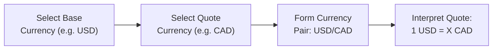
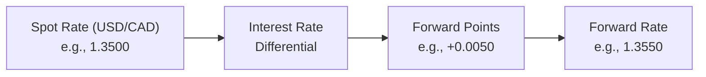

## 33.1 Exchange Rate Quoting Convention

Sometimes, you hear people say something like, “One U.S. dollar is worth 1.35 Canadian dollars.” You might nod your head but think, “Wait, how do they come up with that number?” or “Is there some standard way everyone just knows how to handle this?” Well, in currency trading—and especially in currency options—there absolutely is a standard method to the madness. It’s called “exchange rate quoting convention.” Let’s talk about what it looks like, why it matters for currency options, and how you can get your head around all the jargon.

Understanding how exchange rates are quoted will help you navigate everything from a casual trip across the border to advanced trading strategies. Plus, if you ever dive into derivatives based on currency pairs, these conventions are the foundation upon which all pricing, hedging, and speculation is built.

Exchange rate quoting convention basically answers the question: “How do we express the value of one currency in terms of another?” Or to get a little fancy: “How many units of currency B does it take to buy one unit of currency A?” Let’s define some key terms before we dive into the nitty-gritty.

––––––––––––––––––––––––––––––––––––––

Base Currency vs. Quote (Counter) Currency

In currency pairs, the first currency listed is known as the “base currency,” and the second is the “quote currency” (also sometimes called the “counter currency”). So if we see “USD/CAD,” USD is the base and CAD is the quote. That means the quote (like 1.35) tells us how many Canadian dollars (CAD) one needs to score 1 U.S. dollar (USD).

This is not just a friendly naming convention—these labels drive how currency options, futures, and forwards are quoted on various exchanges. If you’re new to it, think of base currency as that sturdy anchor. When you see “USD/CAD,” you can read it as “USD anchor, denominated in CAD.” We typically call it “dollar-cad,” “loonie-dollar,” or “U.S. dollar versus Canadian dollar.”

––––––––––––––––––––––––––––––––––––––

Direct Quotation vs. Indirect Quotation

One day, I was traveling from Montreal to Miami, and I stopped by a currency booth that said something like, “1 USD = 1.35 CAD.” Another booth across the street was showing “CAD 0.74 = USD 1” (rounded for simpler math). I remember scratching my head, thinking, “Are they showing the same thing or are they messing with me?” They were actually both referencing the exact same exchange rate, but from two different perspectives.

• Direct Quote – In a direct quote, we see how much of our local (domestic) currency is required to purchase one unit of some foreign currency. If you live in Canada, “1 USD = 1.35 CAD” is a direct quote.  
• Indirect Quote – In an indirect quote, we flip it. If you’re a Canadian, an indirect quote might look like “1 CAD = USD 0.74.”

For a Canadian investor, a direct quote means the Canadian dollar is the “home currency,” and the foreign currency is something else you’re buying or selling. But if you hopped over to the U.S., Americans would consider “USD/CAD” to be an indirect quote, because from their vantage point, “home” is USD.  

It can be confusing, but the big point is this: You want to recognize which currency is being treated as “domestic.” If you’re uncertain, you might see a notational reference like “USD/CAD = 1.35” (which means 1 USD buys you 1.35 CAD) or “CAD/USD = 0.74” for the indirect perspective.

––––––––––––––––––––––––––––––––––––––

Why the Base Currency Matters

In many global markets, the U.S. dollar is often treated as the base currency. For example, “EUR/USD” is how you see euros in terms of the U.S. dollar, not “USD/EUR.” By convention, the base currency is often the “stronger” or more globally traded currency, though there are exceptions.  

In Canada, you’ll often see USD/CAD as a very standard reference quote. But you’ll also encounter cross-currency pairs—like EUR/GBP or GBP/JPY—that don’t involve the Canadian dollar at all. In those situations, the first-named currency is the base, and the second-named one is the quote.

––––––––––––––––––––––––––––––––––––––

Spot Rates, Forward Rates, and Pips

It’s possible you’ll see the spot rate quoted (that’s the immediate price to exchange two currencies) or maybe the forward rate (the price agreed upon today for delivery of currency at some future date, factoring in interest rate differentials).

For instance, if USD/CAD is 1.35 in the spot market, you might see something like a 90-day forward quote that’s slightly different (maybe 1.36), depending on how interest rates differ between the two countries. The difference—called “forward points” or “pips”—represents an adjustment for the fact that interest rates in the U.S. might be higher or lower than those in Canada.  

• Spot Rate – The price for immediate (or near-immediate) currency exchange.  
• Forward Rate – The price for a future date, influenced by interest rate differentials.  
• Pips (Points) – The smallest incremental move in currency pairs. For USD/CAD, a pip is typically 0.0001. You might see a quote of 1.3500, and a slight move to 1.3501 is one pip.  

Why does all this pip talk matter for options? Well, when you price out currency options (like calls and puts that give you the right, but not the obligation, to buy or sell currency at a certain level), small exchange-rate changes—like a few pips—can make a real difference in how your spread or premium is valued.

––––––––––––––––––––––––––––––––––––––

Global Time Zones and Liquidity

Currency markets truly never sleep. You get trading sessions in North America, Europe, and Asia, which overlap. Sometimes it’s 2 a.m. in Toronto, but Tokyo is wide awake, and major companies are exchanging yen for euros or Aussie dollars for Swiss francs. This near 24-hour cycle means liquidity can surge during certain time-zone overlaps—and that can make currency option prices jump around more.

As a trader or someone hedging a currency risk, it’s useful to know when your currency pair sees the most volume. For USD/CAD, the highest liquidity typically occurs during North American market hours. If you’re trading cross-currency pairs in Asia (like USD/JPY), you’ll notice more liquidity during the Tokyo session. Keep in mind that dryness or illiquidity in off-hours can mean wider bid-ask spreads and bigger implied volatility moves.

––––––––––––––––––––––––––––––––––––––

Exchange-Traded Currency Options vs. OTC

An important cross-reference from earlier chapters (like basic features of options or advanced derivatives strategies) is that currency options can be structured in two main ways:

• Exchange-Traded: On platforms like the Bourse de Montréal or Chicago Mercantile Exchange (CME), you get standardized contract sizes, strike increments, and expiration dates. Regulatory oversight extends from the exchange itself and through the Canadian Investment Regulatory Organization (CIRO) if you’re in Canada—and similar authorities worldwide.  

• Over-the-Counter (OTC): These are customized options you might negotiate directly with a bank or dealer. They can tailor any strike price, notional amount, and maturity date. They also present higher counterparty risk—though clearing solutions have evolved—and are subject to CIRO/CSA guidelines on derivatives reporting and risk management.  

Whether you’re dealing with regulated, exchange-traded instruments or OTC products, you’ll likely see the same quoting logic: the base currency is the first-labeled currency, the quote currency is the second-labeled currency, and you’ll watch for direct vs. indirect quotes depending on who’s referencing it.

––––––––––––––––––––––––––––––––––––––

Example: USD/CAD Spot vs. Forward Quoting

Let’s suppose the spot rate for USD/CAD is 1.3500. That means if you want to buy USD 100,000 right now (spot), you need CAD 135,000. Meanwhile, let’s say interest rates in the U.S. are slightly higher than those in Canada. Over the next three months, the forward rate might be 1.3550, meaning if you want that same $100,000 in three months, you need CAD 135,500—reflecting a forward premium on the U.S. dollar.

Now, if you’re a Canadian importer needing to lock in the cost of future shipments paid in U.S. dollars, you might buy a call option on USD/CAD with a strike of 1.35. The option might cost a premium that arises partly from these forward points, since the market suspects the U.S. dollar might be more expensive in the future. Alternatively, you could do a forward contract at 1.3550 to guarantee that rate—no matter how the spot evolves.

––––––––––––––––––––––––––––––––––––––

Visualizing the Flow

Below is a simple Mermaid.js flowchart to illustrate how these quoting conventions work when it comes to base vs. quote currencies. Although it can’t capture all of currency trading’s complexities, hopefully it’ll paint a visual roadmap of how a base currency (USD) is expressed in terms of the quote currency (CAD).

Think of it as a funnel: first you pick the base currency, then the quote currency, then you express how many quote units one needs to get that base unit.

––––––––––––––––––––––––––––––––––––––

Practical Applications in Currency Options

Now, so what? If you’re dabbling in currency options, you need to know:

• Which currency your option is denominated in.  
• How strike prices and premiums are expressed (e.g., “buy a USD call/CAD put with a strike of 1.36,” meaning you have the right to buy 1 USD for 1.36 CAD).  
• How many contract units each option controls (on an exchange, it might be a standardized notional, like 10,000 or 100,000 units of the base currency; in OTC, it can be anything).  
• Whether the quote you’re seeing is a direct reflex of your home currency or an indirect one.

As a personal anecdote, I once helped a friend who was expanding her business into the U.S. She wanted to hedge some future expenses denominated in USD. But she hadn’t realized that the currency quotes she was used to seeing on her bank’s website (like “1 USD = 1.35 CAD”) might not match the slightly different quoting method you see in many trading platforms, which prefer to say “USD/CAD = 1.3500.” The difference caused confusion in her budgeting until she recognized the direct vs. indirect difference. After that aha! moment, managing her currency exposure became much smoother.

––––––––––––––––––––––––––––––––––––––

Common Pitfalls

Misreading Direct as Indirect  
Keep an eye on context. Double-check which currency is the “home” currency in your scenario.

Ignoring Forward Points  
Too many new traders see the spot quote and forget that forward rates can differ significantly, especially when interest rates between two countries diverge. That difference will show up in currency option premiums, too.

Forgetting About Time-Zone Illiquidity  
Just because currency markets trade almost 24/7 doesn’t mean they’re always super-liquid. If you want to execute big trades at 3 a.m. Eastern Time on a pair that’s not actively traded in Asia, you may face large spreads.

Overlooking Regulations  
In Canada, currency derivatives transactions must comply with CIRO’s regulatory framework. Always verify margin requirements, reporting obligations, and any local compliance rules.

––––––––––––––––––––––––––––––––––––––

Canadian Regulatory Snapshot

• CIRO (Canadian Investment Regulatory Organization) oversees investment dealers, mutual fund dealers, and market integrity. Though MFDA and IIROC once existed as separate entities, they have now amalgamated into CIRO as of 2023.  
• CSA (Canadian Securities Administrators) offers broader securities regulatory coordination across provinces. You can check their site at [https://www.securities-administrators.ca/](https://www.securities-administrators.ca/) for updates, especially around derivatives.  
• The Bourse de Montréal is Canada’s main exchange for listed derivatives, including currency futures and options on some key pairs. Contract specs, size, tick increments, and margin rules are posted at [https://www.m-x.ca/](https://www.m-x.ca/).  
• CIPF (Canadian Investor Protection Fund) protects client assets in the event of an investment dealer’s insolvency. This protection typically extends to positions booked under a CIRO-regulated firm (subject to coverage limits).

––––––––––––––––––––––––––––––––––––––

Open-Source Tools and Resources

If you’re looking for handson modeling or want to geek out on analytics:

• [QuantLib](https://www.quantlib.org/) – An open-source library in C++ (with Python wrappers) that’s fantastic for pricing derivatives, including currency instruments.  
• [R or Python Libraries (pandas, NumPy, SciPy)] – Provide robust data manipulation for exchange rate time series, useful if you want to track historical rates or create forward curves.  
• [Bloomberg or Reuters Terminals] – Not open-source, but they remain industry standards for professional currency data, forward points, and implied volatilities.

––––––––––––––––––––––––––––––––––––––

Case Study: CAD Hedging for an Overseas Purchase

Imagine a mid-sized Canadian tech company planning to buy US$2 million worth of hardware from the U.S. in six months. They’re worried about fluctuations in the USD/CAD rate. Let’s walk through a scenario.

1. Today’s Spot: Suppose USD/CAD is 1.3500. So US$2 million costs CAD 2.7 million.  
2. Forward Quote: In six months, maybe the forward rate is 1.3550 because of slightly higher U.S. interest rates. They can lock in at exactly 1.3550 if they choose a forward contract. That means they know they’ll pay CAD 2.71 million in six months.  
3. Currency Option: Alternatively, the company might buy a USD call/CAD put option with a strike of 1.36. Maybe the premium is CAD 0.02 per USD, for a total cost of CAD 40,000. This option ensures the company can buy at 1.36 if the market moves above that rate—perfect if USD/CAD spikes to 1.38. If it drops below 1.36, they can walk away from the option and buy at the lower market rate.  

In either approach, we see the quoting convention: they interpret “USD/CAD = 1.36” as “it takes 1.36 Canadian dollars to buy 1 U.S. dollar.” If the company misunderstood that and assumed “1 CAD = 1.36 USD,” they’d be in a world of confusion.

––––––––––––––––––––––––––––––––––––––

Diagram: Spot vs. Forward Rate Components

Another Mermaid.js illustration can help visualize how forward rates build on spot rates. Simplified, it might look like this:

Basically, you start with the spot rate, factor in interest rates, add (or subtract) forward points, and arrive at the forward rate.

––––––––––––––––––––––––––––––––––––––

FAQs and Additional Tips

What is a “currency option” in only one sentence?
• A currency option gives you the right, but not the obligation, to exchange one currency for another at a predefined exchange rate (strike) on or before a specific date.

Why do I see some quotes invert the currency pair?  
• Because of direct vs. indirect quoting. Each country naturally sees its currency as “domestic,” leading to different perspectives.

What if I want to hedge a set of ongoing payments, not just a single chunk?  
• You might consider a layered hedging program using multiple forward or option contracts across the timeline. For advanced strategies, check references in the “Hedging with Futures Contracts” or “Hedging with FX Options” in earlier chapters.

How can I confirm the notional in an FX option?  
• Check contract specifications on the exchange or in your OTC confirmation. In exchange-traded currency options on the Bourse de Montréal, the notional is typically standardized (for example, CAN $10,000 or US $100,000 per contract). OTC can be customized.

––––––––––––––––––––––––––––––––––––––

References for Further Exploration

• [Canadian Investment Regulatory Organization (CIRO)](https://www.ciro.ca/) – For official guidelines on currency derivatives and standards of conduct.  
• [CSA (Canadian Securities Administrators)](https://www.securities-administrators.ca/) – For regulatory notices on derivatives.  
• [Bourse de Montréal](https://www.m-x.ca/) – For listed currency options specifications.  
• [QuantLib](https://www.quantlib.org/) – Open-source pricing library.  
• Hull, John C. “Options, Futures, and Other Derivatives.” Classic text for understanding derivatives pricing, including FX.  
• Laidi, Ashraf. “Currency Trading and Intermarket Analysis.” Great resource for macroeconomic insights on currency moves.  
• McMillan, Lawrence G. “Options as a Strategic Investment.” Comprehensive coverage of all kinds of options, including FX.

––––––––––––––––––––––––––––––––––––––

Closing Thoughts

Exchange rate quoting conventions might seem trivial—until you realize how many real-life and corporate decisions depend on them. Whether you’re hedging a big currency exposure, speculating in the FX options market, or even just double-checking what your bank is charging, understanding direct vs. indirect quotes, pips, spot, and forward rates is key. It’ll help you avoid pitfalls like confusion over notional amounts, misinterpreted forward rates, or overlooked regulatory obligations. And remember, currency markets can be as vast as the ocean—so knowledge is your best hedge against the current.

So next time you check USD/CAD or any other pair, pause for a moment. In that simple ratio of 1.35 or 0.74, you’re seeing a world of interest rate differentials, cross-border trade, central bank policy, and investor sentiment. In short, it’s a dynamic swirl of global finance—packaged into a single number that, with practice, can become your trusty guide in currency options trading.

––––––––––––––––––––––––––––––––––––––

## Sample Exam Questions: Exchange Rate Quoting Convention



### Which currency is considered the base currency in USD/CAD?

- [ ] The Canadian dollar (CAD)
- [x] The U.S. dollar (USD)
- [ ] Whichever currency has the higher interest rate
- [ ] It depends on who is quoting it

> **Explanation:** In the pair USD/CAD, the U.S. dollar is always the base currency, and the Canadian dollar is the quote (counter) currency.

### In a direct quote from a Canadian perspective, which of the following expressions is correct?

- [ ] 1 CAD = 0.74 USD
- [ ] USD/CAD = 1.35
- [x] 1 USD = 1.35 CAD
- [ ] 1 CAD = 1.00 USD

> **Explanation:** Direct quote shows how many units of Canadian dollars it takes to buy one U.S. dollar. “1 USD = 1.35 CAD” is the direct quote for a Canadian observer.

### What is the primary difference between a spot rate and a forward rate in currency markets?

- [x] The forward rate incorporates interest rate differentials for future delivery
- [ ] The spot rate reflects average historical prices
- [ ] Only the spot rate is regulated by CIRO
- [ ] There is no difference; both are used interchangeably

> **Explanation:** The forward rate adds or subtracts forward points based on interest rate differentials, whereas the spot rate is for immediate (or near-immediate) settlement.

### If USD/CAD trades from 1.3500 to 1.3505, how many pips has it moved?

- [ ] 0.5 pips
- [ ] 5 pips
- [x] 5 pips
- [ ] 50 pips

> **Explanation:** A pip for USD/CAD typically represents 0.0001; moving from 1.3500 to 1.3505 is a 5-pip change.

### Suppose a Canadian importer wants to lock in a future exchange rate for USD/CAD delivery in 90 days. Which instrument likely best suits this purpose directly?

- [ ] A currency call option
- [ ] A short put option
- [x] A forward contract
- [ ] A spot contract

> **Explanation:** A forward contract is the most direct way for the importer to fix a future exchange rate for a specific date.

### In the currency pair EUR/USD, which currency is the quote currency?

- [ ] EUR
- [ ] Both USD and EUR
- [x] USD
- [ ] Whichever currency is stronger at the time

> **Explanation:** In EUR/USD, EUR is the base currency and USD is the quote (counter) currency, indicating how many U.S. dollars one euro is worth.

### How might higher U.S. interest rates relative to Canada’s interest rates affect the USD/CAD forward rate?

- [x] USD/CAD forward rate might be higher than the spot rate
- [ ] USD/CAD forward rate might be lower than the spot rate
- [ ] No impact on the forward rate
- [ ] It ensures the CAD becomes the new base currency

> **Explanation:** If U.S. rates are higher, the forward points typically reflect a premium for the USD, pushing the USD/CAD forward rate above the spot rate.

### Why is it important to keep time-zone overlaps in mind when trading currency options?

- [ ] Because trades cannot settle after 3 p.m.
- [x] Liquidity and volatility vary across time zones, affecting prices
- [ ] Currency markets only function during Asian hours
- [ ] Time zones determine which currency is the base vs. quote

> **Explanation:** Currency markets trade nearly 24 hours, but liquidity depends on which markets are open simultaneously, influencing spreads and volatility.

### What is one major advantage of trading exchange-traded currency options on the Bourse de Montréal compared to an OTC option?

- [x] Standardized contract specifications and centralized clearing
- [ ] No documentation is required
- [ ] Options can be exercised at any time without cost
- [ ] They always have lower premiums than OTC options

> **Explanation:** Exchange-traded contracts offer standardization, transparency, and centralized clearing, which reduces counterparty risk. However, that does not guarantee lower premiums.

### True or False: A direct quote is always expressed as “1 unit of foreign currency equals X units of domestic currency.”

- [x] True
- [ ] False

> **Explanation:** By definition, a direct quote for a country’s perspective indicates the amount of domestic currency required to obtain 1 unit of the foreign currency.


