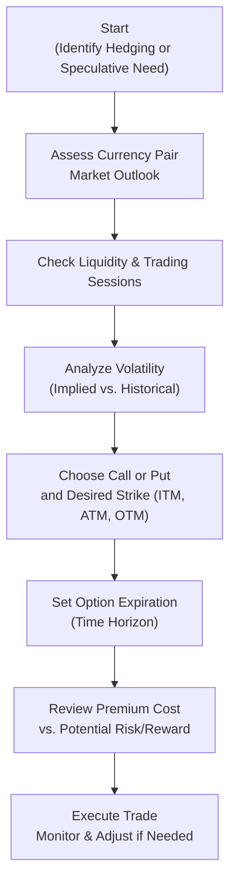

## 33.2 Selecting the Right Option

Selecting the right currency option is sometimes easier said than done. You might be thinking, “Um, do I really need to map out so many details just to buy a simple contract?” Well, let me share a quick personal anecdote: I once got overconfident about a sudden USD/CAD move—I thought the U.S. dollar was poised to strengthen significantly against the Canadian dollar. So I hastily bought an out-of-the-money (OTM) USD call option (which is effectively a CAD put if you think in reverse). Long story short, the trade expired worthless because I got the timing way off. Maybe you’ve seen or heard similar stories. That’s why it’s so crucial to decide carefully: which currency pair, which strike, how far out in time, how does volatility factor in, and so on.

This section focuses on how to choose the right type of currency option in a practical way. We’ll look at key decision points like your market view (bullish or bearish on a particular currency), your hedging needs, your appetite for risk, and real-world constraints like cost of the premium and time horizon. To help make things even clearer, we’ll throw in some diagrams, real-life scenarios, plus references to Canadian regulations and resources, including guidelines from the Canadian Investment Regulatory Organization (CIRO).

--------------------------------------------------------------------------------

### Understanding Currency Options: Key Building Blocks

Before we go deeper, let’s do a quick brush-up on the basics:

• Call Option (Currency): Grants the right to buy the base currency (like USD in a USD/CAD pair) at the strike price.  
• Put Option (Currency): Grants the right to sell the base currency at the strike price.  
• In-the-Money (ITM): For a call, a strike below the current spot rate; or for a put, a strike above the spot rate.  
• At-the-Money (ATM): The strike is roughly equal to the current spot rate.  
• Out-of-the-Money (OTM): For a call, the strike is above the spot; for a put, the strike is below the spot.  
• Implied Volatility: The market’s forecast of a currency pair’s potential price swings, derived from option premiums.  
• Historical Volatility: The actual volatility that the currency pair has shown historically over a specified look-back period.  
• Expiration Date: The last day you can exercise the option.  

Of course, we’re dealing in pairs: When you trade a currency option, you’re effectively choosing whether to be long or short one currency in exchange for another. So if you’re bullish on USD vs. CAD, you might buy a USD call (CAD put). Or if you’re anticipating a weaker euro relative to the pound, you might buy a EUR put/GBP call depending on how the pair is conventionally quoted. And that’s a lot to juggle, right?

Anyway, let’s break down the selection process step by step.

--------------------------------------------------------------------------------

### Step 1: Define Your Objective

First things first: Are you hedging or speculating? This might sound super obvious, but you’d be surprised how often folks jump into currency options without a rock-solid purpose.

• Hedging: Maybe you have future payments or receipts in a foreign currency—like a Canadian exporter selling goods in U.S. dollars. You might want to lock in or protect a certain exchange rate to reduce potential losses if the CAD rallies unexpectedly against the USD.  
• Speculating: Perhaps you think the euro is undervalued, or you’re playing a hunch that the yen is about to soar, or you’re noticing a pattern from your technical analysis. You’re aiming for profit from currency moves without an underlying exposure in that currency.  

Why does this matter? Because hedgers often prefer in-the-money or at-the-money options that closely mirror their budgeted exchange rate. Speculators might go for out-of-the-money options—which are cheaper but riskier. Or they might pick near-expiration trades to capture short-term moves. So think of your objective as your guiding star.

--------------------------------------------------------------------------------

### Step 2: Identify Which Currency Pair (and the Direction)

Now that you know your goal, you have to pick the specific currency pair. Usually, it’ll be the one relevant to your exposure or your forecast. For example:

• Canadian importer paying for goods in USD might do a USD call/CAD put.  
• European investor looking to protect against GBP strength might do a GBP call/EUR put.  

You get the picture. Another subtle point is understanding how currency pairs are quoted. Some pairs, like USD/CAD, are typically expressed as how many CAD per one USD. Meanwhile, EUR/USD is the number of USD per one euro. The base currency is always the first in the pair, and the quote currency is second. Make sure you know exactly which side you’re buying or selling. Don’t mix them up, or you might end up with a contract that does the opposite of what you intend.

--------------------------------------------------------------------------------

### Step 3: Consider Market Sessions & Liquidity

Currencies trade globally, but each pair’s liquidity tends to spike when the main financial centers are open:

• EUR/USD: Heaviest volume during the London/New York overlap.  
• USD/JPY: Tokyo, London, and New York sessions are relevant, with liquidity often high during Tokyo’s morning.  
• Emerging Markets: Trading can be more fragmented. Spreads can widen if local markets are closed or if there’s low coverage in major hubs.  

Why does timing matter? Because liquidity affects your option premium. If your pair isn’t heavily traded in the time zone you mainly operate in, the spread could be large, or implied volatility might be artificially high or low. Avoiding illiquid markets typically reduces your transaction costs.

--------------------------------------------------------------------------------

### Step 4: Assess Volatility (Implied vs. Historical)

Currency option premiums are heavily influenced by implied volatility. If the market anticipates big moves—maybe because of an upcoming central bank meeting, political events, or major economic data releases—option prices often shoot up. If you’re buying options in a high-volatility environment, you could face steep premiums. If you’re writing (selling) options, sure, you’ll garner more premium, but your risk also spikes in high-volatility regimes.

Sometimes it helps to compare implied volatility with historical volatility:

• If implied volatility is way higher than the recent norm, you might consider strategies that reduce cost, such as spreads (e.g., buying one option and selling another to offset some premium).  
• If implied volatility is low compared to historical levels, and you foresee big moves, then an outright option purchase can be relatively cheap.  

This is the part where data resources like [Bloomberg](https://www.bloomberg.com/) or [Refinitiv Eikon](https://www.refinitiv.com/) come in handy. They offer real-time quotes and advanced analytics on vol surfaces. On open-source fronts, you might use a variety of online charting platforms that track implied volatility for major currency pairs. 

--------------------------------------------------------------------------------

### Step 5: Pick the Strike Price

You know your objective, currency pair, market sessions, and volatility environment—now it’s time to hone in on the strike. The choice of an in-the-money (ITM), at-the-money (ATM), or out-of-the-money (OTM) option can dramatically affect your risk/reward profile:

• ITM Option: Offers higher intrinsic value, meaning you pay more upfront but you’re also more sensitive to “delta” changes (i.e., movements in the underlying currency). If you are hedging a large exposure, an ITM option can closely mimic a forward contract.  
• ATM Option: Balances premium cost and intrinsic value. Often used by speculators seeking to capitalize on quick moves around the current spot rate.  
• OTM Option: Lower premium, but less chance of expiring in-the-money unless the underlying moves strongly in your favor. A typical choice for speculators looking for high leverage with smaller capital outlay.  

If you’re a hedger, you might have a budgeted exchange rate. Let’s say your Canadian company wants to ensure you can convert USD receipts above 1.32 USD/CAD. Then you could buy a USD put with a strike near 1.32 so that if the CAD appreciates below that, your option starts to kick in. For a speculator, you might say, “I’m expecting a dramatic move, so let’s get something slightly out-of-the-money to keep costs manageable.”

--------------------------------------------------------------------------------

### Step 6: Select the Expiration

Think of the option expiration date as your “deadline.” Also, keep in mind:

• If you’re hedging a known receivable or payable at a certain date, align the option’s expiry with or slightly after that date.  
• If you’re speculating and expect a move soon, a shorter-dated option is cheaper—but also decays faster. Time decay (theta) can eat away at your position if the market moves slowly.  
• Longer-dated options provide more time for your thesis to materialize but command higher premiums.  

Check your local rules, too. Under [CIRO guidelines](https://www.ciro.ca/), you may find margin or capital requirements that differ for short-dated vs. long-dated positions. When you are dealing with multi-month or multi-year currency exposures, you might prefer options with extended expiries—if they are available on your chosen exchange or OTC market.

--------------------------------------------------------------------------------

### Step 7: Evaluate the Option Premium Cost

I’ve seen folks get starry-eyed about a potential big currency swing: “Wow, if EUR/USD moves by five big figures, I’ll triple my money!” But they forget that the initial premium is real cash out of your pocket. Ask yourself:

• Can I afford to lose 100% of this premium if the currency doesn’t move my way?  
• Is there a more cost-effective strategy, such as a spread, that fits my outlook?  
• Have I compared premiums across different strikes and expiries to find the best fit?  

In a high-volatility environment, premiums can become exorbitant, so you might consider other derivatives (like forwards or combos) to manage cost. Conversely, if volatility is low, you might find an attractive premium for either hedging or speculative plays.

--------------------------------------------------------------------------------

### Step 8: Check Regulatory and Operational Considerations

In Canada, there are typically two sides to compliance:

1. **Regulatory Suitability**: CIRO (formed after the amalgamation of MFDA and IIROC) has guidelines on product suitability, margin requirements, and disclosure duties for currency options. You must ensure your trade is aligned with your risk tolerance, net worth, and knowledge.  
2. **Operational Matters**: If you’re dealing with an investment dealer or bank, check their guidelines on margin, settlement, and account minimums. The Canadian Derivatives Clearing Corporation (CDCC) may handle the clearing if these are exchange-traded currency options listed on the Bourse de Montréal.  

For more details, you might consult the Bourse de Montréal’s currency options primers or bulletins. The Bourse often updates product specifications, including contract sizes, strike intervals, or margin guidelines.  

--------------------------------------------------------------------------------

### Example Case Study: Canadian Importer Hedging USD Costs

Suppose Maple Apparel, a Toronto-based clothing company, must pay a U.S. supplier USD 500,000 in three months. Maple wants to protect itself if USD/CAD jumps, causing them to pay more CAD for those U.S. dollars.  
1. **Goal**: Hedging.  
2. **Currency Pair**: USD/CAD. Maple’s worried about the CAD weakening vs. USD.  
3. **Market Session**: USD/CAD is actively traded nearly 24 hours, with strong liquidity in both London and New York sessions.  
4. **Volatility**: Let’s say implied volatility has risen slightly because of an upcoming Bank of Canada rate decision.  
5. **Strike Price**: Maple picks an at-the-money call on USD (i.e., a USD call/CAD put) to ensure coverage near current spot, which is 1.32.  
6. **Expiration**: Three months from now, matching Maple’s payment deadline.  
7. **Premium**: Suppose the total premium is CAD 0.015 per USD. On 500,000 USD, that’s CAD 7,500. Maple decides that’s acceptable because it caps its exchange cost.  
8. **Regulatory & Operations**: Maple’s broker checks their hedging rationale, obtains the necessary KYC info, and ensures the margin is sufficient if Maple writes any offsetting position.  

If the CAD significantly weakens—say USD/CAD goes up to 1.38—Maple can exercise the call at 1.32 or potentially sell it back at a profit, effectively limiting their cost. If the spot rate remains the same or even goes down, Maple can let the option expire and buy USDs in the spot market at a cheaper rate, losing only the premium.

--------------------------------------------------------------------------------

### Example Case Study: Speculative Bet on GBP/JPY Volatility

Gabrielle is a retail trader with a knack for macroeconomics. She expects a major shift in monetary policy signals from the Bank of Japan and the Bank of England. She believes GBP/JPY is about to experience very large moves, but she’s not certain which direction. So she decides on a straddle (simultaneously buying an at-the-money GBP call and GBP put against JPY).

1. **Goal**: Speculation.  
2. **Currency Pair**: GBP/JPY.  
3. **Market Session**: Stretching from Asian hours (for JPY) through London hours (for GBP). Liquidity can vary.  
4. **Volatility**: Implied is moderate, but with central bank announcements looming, options might be priced higher than normal.  
5. **Strike Price**: She chooses an at-the-money strike to maximize gamma exposure (sensitivity to spot moves).  
6. **Expiration**: One month, covering the big policy announcements.  
7. **Premium**: The combined cost of both options is relatively high, so she must weigh the potential for big profit if GBP/JPY swings drastically.  
8. **Regulatory & Operations**: She completes the necessary risk disclosure forms with her CIRO-regulated dealer to ensure she’s aware straddles can also lose money if the pair barely moves.  

Gabrielle’s strategy can be rewarding if GBP/JPY spikes in either direction. But if it stays range-bound, she loses the net premium on both options.

--------------------------------------------------------------------------------

### Visual Overview: Key Steps in Selecting a Currency Option

Below is a Mermaid.js flowchart summarizing the main steps to pick the right currency option:

Each step is interconnected. Usually, you’ll revisit the volatility analysis or price considerations if something changes, like an emergency rate cut by the Federal Reserve or a surprise election outcome.

--------------------------------------------------------------------------------

### Potential Pitfalls and Best Practices

Let’s face it: selecting a currency option is part art, part science. Here are some do’s and don’ts:

• **Don’t skip fundamental research**. You might love your chart patterns, but macro factors like GDP, inflation, and central bank policy matter a ton for currency moves.  
• **Do watch out for event risk**. Think major economic releases (CPI, employment data), central bank meetings, or political events such as elections. Implied volatility may spike just before these dates.  
• **Don’t forget your exit plan**. Consider whether you’ll exercise, offset, or roll over your option if the markets move your way (or not).  
• **Do track your break-even points**. For a call option, break-even is roughly strike + premium; for a put, it’s strike – premium.  

If you’re new to currency options, it might be helpful to start with smaller position sizes or simpler strategies. Paper trading or using educational simulators can also be a wise move, at least temporarily.

--------------------------------------------------------------------------------

### Regulatory Considerations in Canada

In Canada, CIRO is now the main self-regulatory organization for investment dealers and marketplaces. Historically, we had MFDA and IIROC, but those are defunct now. As of 2025, if you need official updates on currency option regulations—like margin requirements, disclosure rules, or product approvals—head to [CIRO’s website](https://www.ciro.ca/). They retain an array of bulletins, rulebooks, and interpretive guidance.  

Additionally, the [Bank of Canada](https://www.bankofcanada.ca/) sets key interest rates and publishes monetary policy reports that can seriously impact currency valuations. Keep an eye on press releases or policy statements, as these can dramatically shift implied volatilities.

--------------------------------------------------------------------------------

### Additional Resources

• **Bank of Canada**: Official exchange rates, economic indicators, policy statements.  
• **Bourse de Montréal**: Currency option primers, contract specifications, bulletins.  
• **Bloomberg / Refinitiv Eikon**: Real-time quotes, volatility surfaces, news.  
• **CIRO**: Latest Canadian regulatory guidelines, margin requirements, continuance updates.  
• **Books**: “Currency Wars” by James Rickards for a look into how geopolitics might ramp up or dampen volatility.  
• **Online Courses**: Check out advanced coverage of currency derivatives on major MOOC platforms.  

--------------------------------------------------------------------------------

### In Closing

So, next time you find yourself itching to trade a currency option, just remember: define your goal, pick the right pair and option type, check volatility, set your strike and duration, and weigh the cost carefully. Also, keep an eye on those session overlaps and potential liquidity constraints—nobody wants to get stuck with a wide bid-ask spread. 

Selecting the ideal option is rarely a one-size-fits-all process. It should fit your unique hedging or speculative profile, your risk appetite, and the market conditions at play. Sure, it might feel intimidating at first. But with careful analysis, a dash of caution, and maybe a pinch of optimism, you’ll be able to navigate these waters just fine.

And hey, if you do find yourself second-guessing or want to test a hypothetical strategy, remember that many broker platforms offer practice or demo environments. Don’t be shy—sometimes simulators can reveal a lot and save you from pitfalls in the real market.

Good luck, hedge wisely, and let your currency option decisions flow from a solid understanding of these fundamentals.

--------------------------------------------------------------------------------

## Sample Exam Questions: Selecting the Right Currency Option



### Which of the following steps is most critical in selecting a currency option?

- [ ] Checking the local weather forecast
- [x] Defining whether you are hedging or speculating
- [ ] Watching random stock prices
- [ ] Reading only historical data from five years ago

> **Explanation:** The most fundamental step in option selection is identifying your reason for trading (hedge or speculate). This purpose shapes which currency pair, strike, and expiration is most suitable.

### When is implied volatility likely to spike for a major currency pair such as EUR/USD?

- [ ] On a quiet weekend with no economic releases
- [ ] Right after the stock market closes
- [x] Prior to a significant central bank policy announcement
- [ ] During non-overlapping time zones

> **Explanation:** Implied volatility often increases before large-scale announcements by central banks because uncertainty about future rates or policies can lead to substantial price swings.

### An at-the-money (ATM) call option on USD/CAD is best described as:

- [ ] A USD call with a strike price well below the current spot
- [x] A USD call with a strike price close to the current spot
- [ ] A USD put with a strike price above the current spot
- [ ] A CAD call with a strike price equal to 1.0000

> **Explanation:** ATM options have strike prices roughly equal to the current spot rate, regardless of whether they’re calls or puts.

### Suppose you’re a Canadian company expecting USD receipts in a few months. Which of the following strategies could help hedge against a stronger CAD?

- [ ] Buying a GBP/JPY call
- [ ] Buying a CAD call
- [ ] Writing a USD put
- [x] Buying a USD put (which is effectively a CAD call)

> **Explanation:** If you expect to receive USD, your risk is that the USD weakens (CAD strengthens). Buying a USD put protects you if the spot USD/CAD rate falls below your strike. Equivalently, it’s a CAD call position.

### What is the main advantage of choosing an out-of-the-money (OTM) currency option for speculation?

- [x] Lower premium cost and higher potential leverage
- [ ] Guaranteed profits if the spot doesn’t move
- [ ] Lower risk than an in-the-money option
- [ ] Automatic exercise at expiration

> **Explanation:** OTM options usually have lower premiums—thus they’re cheaper to buy—but they need a larger move in the underlying to become profitable. The leverage is higher, but so is the risk of expiring worthless.

### In a hedging context, matching the strike to your “budgeted exchange rate” typically means:

- [x] Selecting a strike price close to the exchange rate you intend to lock in
- [ ] Picking the farthest out-of-the-money strike
- [ ] Selecting an unrelated currency pair
- [ ] Avoiding any knowledge of implied volatility

> **Explanation:** Corporate hedgers often choose a strike near their planning or budgeted rate so that the hedge locks in roughly the rate they based their financial plans on.

### Which practice is essential under CIRO regulations when opening a currency options position?

- [ ] Submitting daily bid-ask spreads directly to CIRO
- [x] Ensuring the position is suitable for your financial objectives and risk profile
- [ ] Trading exclusively during the Tokyo open
- [ ] Borrowing unlimited margin from offshore accounts

> **Explanation:** CIRO emphasizes product suitability. Firms and advisors must ensure that currency options fit the investor’s objectives, risk tolerance, and net worth.

### A steep increase in implied volatility for the Canadian dollar suggests:

- [x] The market is pricing in significant near-term movement in CAD
- [ ] CAD prices will definitely stay flat
- [ ] There is zero chance of a Bank of Canada rate change
- [ ] Time to automatically sell all currency options

> **Explanation:** Higher implied volatility typically reflects the market’s anticipation of larger price swings. It doesn’t guarantee that big movements will happen, but it indicates the market is preparing for that possibility.

### Selecting a longer-dated option instead of a shorter-dated one typically implies:

- [x] Paying more premium due to extended time value
- [ ] Lower overall cost because of lesser time value
- [ ] Enhanced liquidity at all times
- [ ] No effect on time decay

> **Explanation:** The longer the expiration, the more time value an option has—and the greater the cost. This offers more time for the underlying to move, but you pay for that flexibility.

### True or False: When speculating on a currency’s appreciation, buying a put option on that currency is generally the correct approach.

- [ ] True
- [x] False

> **Explanation:** If you expect a currency to appreciate (i.e., you expect it to get stronger), you would typically buy a call option on that currency (the right to buy it), not a put option (the right to sell it).


