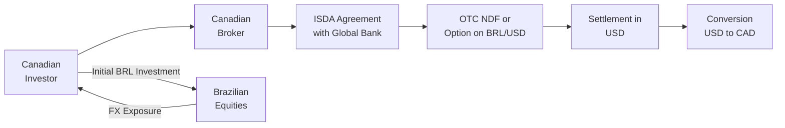

## 33.4 Trading Non-G10 Currencies (Liquidity & Volatility Considerations)

You know, I vividly remember the first time I attempted to hedge an exposure to the Mexican peso (MXN). My team and I were used to the comparatively stable moves of the euro and British pound, but when we dipped our toes into a “non-G10” currency, wow, did the volatility catch us off guard. The spread on our quotes was noticeably wider, and that spread sometimes felt like it was changing by the minute. Well, maybe I’m exaggerating slightly, but it was certainly a wake-up call that trading and hedging emerging market currencies requires a different toolbox than the ones we keep handy for USD, EUR, or GBP.

Below, we’ll explore the important considerations you need if you’re dealing in non-G10 currencies, such as BRL (Brazilian real), MXN (Mexican peso), or ZAR (South African rand). We’ll look at how these currencies often exhibit higher volatility, face unique political and economic risks, and sometimes come with capital controls. We’ll also dig into the regulatory angles, including how to manage credit or counterparty risk with specialized OTC instruments like non-deliverable forwards (NDFs). Let’s dive in.

### Unique Characteristics of Non-G10 Currencies

Non-G10 currencies, often from emerging markets, tend to stand out for two key reasons: liquidity and volatility.

• Liquidity: While major currency pairs (like EUR/USD) see massive daily trading volumes and tight bid-ask spreads, non-G10 pairs often see lower trading volumes. This lower volume leads to bigger spreads (the difference between the price at which you can buy and the price at which you can sell). So if you’re used to the near-seamless liquidity of EUR/USD, you might be surprised at the slippage you’ll face with, say, MXN/USD.

• Volatility: These currencies can be heavily influenced by political changes, economic data releases, or even short-term news items—so big swings up or down are more common. Occasionally, you’ll see substantial intraday price moves because the order books aren’t as deep, and the market reacts more sharply to buy or sell flows.

Also, keep in mind that emerging market currencies may experience shorter windows of overlapping trading hours with North American or European markets. That means liquidity can dry up even more outside those short overlapping times, intensifying price movements. It’s one reason why careful planning is essential if you want to open or close a position—especially if you’re approaching a major economic release in an emerging market’s local time zone.

### Economic and Political Influences

So, why are emerging market currencies (like the Brazilian real) more volatile? After all, a currency is just a representation of a country’s economy, right? Well, in many emerging economies, inflation rates might fluctuate more wildly, and central banks may intervene more aggressively. Governments can implement abrupt policy changes, including capital controls, which can limit how freely foreign investors move money in and out of the country.

Some prime examples:

• Political Uncertainty: Regime changes, social unrest, or unexpected regulatory announcements (e.g., new taxes, export restrictions) can lead to abrupt sell-offs in the currency.  
• Central Bank Intervention: Central banks in emerging markets might intervene to prop up or weaken their currency. These interventions, often unannounced, can significantly freeze liquidity or cause wide price gaps.  
• Commodity Price Dependence: Many emerging economies depend on specific commodities. If global commodity prices shift dramatically—for instance, oil plunges or agricultural commodities skyrocket—these markets can see huge currency swings.

### Wider Spreads and Market Depth

It’s worth mentioning that not all non-G10 currencies have identical liquidity profiles. The Chinese renminbi (CNY) and Indian rupee (INR), for example, typically boast higher volumes in offshore trading centers relative to smaller players like the Peruvian sol (PEN). But in general, you can expect to see:

• Wider Bid-Ask Spreads: Because fewer traders participate, the difference between the price you pay to buy and the price you receive when you sell can be significant.  
• Limited Order Book Depth: Even if you find a relatively tight quote for a small notional amount, if you need to hedge or speculate on a large notional value, you may push the market, resulting in slippage.  
• Volatile Gaps: During local holidays or off-peak times, liquidity can dry up further.

### Intraday Movements

Another big difference you’ll notice is the intraday volatility. In major currencies, you typically see volatility build around key economic releases (like U.S. Non-Farm Payrolls), plus opening hours in London, New York, or Asia. But emerging markets often have localized data announcements—like CPI or GDP figures that can drop in a quiet global window—leading to outsized price spikes. This is especially relevant for traders in Canada or the U.S., who might find the market for an exotic currency to be extremely illiquid (and spready) when local markets for that currency are closed.

### Non-Deliverable Forwards (NDFs) and Other Instruments

Many emerging market currencies, especially those with capital controls, are not freely convertible. As a result, physically delivering the currency might be impossible or restricted. In these instances, we often use a Non-Deliverable Forward (NDF).

An NDF is a forward contract that’s settled in a convertible currency—often USD—on the basis of the difference between the forward rate agreed upon at initiation and the prevailing spot rate at maturity. So if you were trying to hedge exposure to the Indian rupee (INR), you might enter into an INR/USD NDF contract but settle the net difference in USD. The advantage is you avoid all the compliance headaches involving actual conversion or dealing with potentially burdensome local regulations.

• Regulatory Context in Canada: According to the Canadian Investment Regulatory Organization (CIRO) guidelines (see [CIRO’s guidelines](https://www.ciro.ca/) for more details), if you’re advising clients to use NDFs or other OTC tools, you must properly disclose risks, including conversion risk, credit risk, and settlement risk.  
• Local Liquidity: Sometimes, local markets might offer deliverable forward contracts, but they require local accounts, local credit lines, or specialized broker relationships. For those who do business internationally, that might be an option. But for participants in purely Canadian markets, an NDF is often easier to arrange.

### OTC Options in Non-G10 Currencies

Although major exchanges list standard options on some emerging market currencies—you might see some listed for the Mexican peso, for example—in many cases, you’ll rely on over-the-counter (OTC) options. OTC currency options can be customized with unique maturities, strike prices, or settlement provisions. But here’s the kicker: in exchange for that flexibility, you take on more counterparty risk.

• Credit Risk: Since the contract is not guaranteed by a clearing corporation, you face the risk that your counterparty could default. For that reason, parties often use an International Swaps and Derivatives Association (ISDA) Master Agreement, specifying collateral arrangements and margin calls to mitigate risk.  
• Potential for Exotic Features: Because emerging market imports and exports can be lumpy or have unique cash flow patterns, you might see “exotic” payoff structures, like barrier options or digital payouts, that trigger once a certain exchange rate threshold is reached. This can be especially helpful for specialized hedging, but reveals complexities you just don’t see in vanilla G10 currency call or put options.

### Managing Political and Capital Control Risks

Political risk can be the hidden boogeyman in emerging markets—one day the central bank is stable, the next day foreign exchange reserves look suspiciously thin. Governments might impose capital controls, limiting the ability of foreign investors to move funds. For instance, the Brazilian government has historically employed financial transaction taxes or registration requirements that slow down speculative capital flows. If you’re not aware of these possibilities, you might get stuck in restricted currency positions.  

A best practice is to maintain a well-documented risk assessment that contemplates these sudden interventions. Perhaps you have a pattern: open smaller positions that are more easily unwound, or use derivatives specifically designed for restricted currencies (like NDFs). Also, keep an eye on official filings and data from organizations like the Bank for International Settlements (BIS) ([BIS](https://www.bis.org/)) to glean insight on global money flows and trends in emerging market currency liquidity.

### Regulatory Oversight and Canadian Context

If you’re operating out of Canada or serving Canadian clients, keep in mind that CIRO is the self-regulatory organization that sets standards for investment dealers and market participants. CIRO expects thorough risk disclosure, especially when you propose or execute derivative strategies involving higher-volatility products.  

Historically, we used to talk a lot about IIROC or the MFDA, but as of January 1, 2023, they’ve amalgamated into CIRO. This consolidated oversight means derivatives dealers now have a single point of reference for rules and guidelines. If you’re providing non-G10 currency solutions, ensure your marketing materials, statements of risk, and disclaimers align with CIRO’s best practices.

Additionally, the Canadian Investor Protection Fund (CIPF) covers client assets in the event a CIRO member firm becomes insolvent. That said, CIPF typically doesn’t guarantee you’ll be made whole if a foreign counterparty defaults on an OTC option, so always weigh that credit risk and consider requiring robust collateral.

### Using Quantitative Tools and Scenario Testing

It’s possible to get fancy with the analytics, especially if you’re dealing with a portfolio of currencies that includes emerging markets. Tools like [QuantLib](https://www.quantlib.org/) can help you run scenario tests—like a 15% surprise devaluation in the Argentine peso—then measure the potential impacts on your portfolio. These scenario analyses can highlight how quickly unhedged positions in emerging market currencies can erode your P/L.

So, if you’re an institutional trader or risk manager, you might build a scenario using historical stress points, such as when the Turkish lira (TRY) saw rapid single-day declines. By simulating these tail-risk events, you can design hedges (or at least set up stop-loss levels) that correspond to your risk appetite.

### Practical Example: Hedging Brazilian Real (BRL) Exposure

Let’s say you’re a Canadian investor who just purchased a set of Brazilian equity shares. You’re worried that if the BRL dips, you’ll lose money when you convert back to CAD. A standard approach might be to sell BRL forwards against CAD, but direct deliverable BRL/CAD forwards may be less common or come with wide spreads. Instead, you might:

1. Use a BRL/USD NDF, and simultaneously trade USD/CAD in the highly liquid market.  
2. If you want to hedge with options, seek an OTC BRL/USD option with your bank or broker. Then you can do a separate USD/CAD transaction to convert.  
3. When the contract expires, you settle in USD, then convert that USD to CAD. Sure, it’s a two-step process, but the liquidity for BRL/USD is often better than direct BRL/CAD.

Because the Brazilian central bank often intervenes in the FX markets, you also have to keep an eye on local interest rates and policy moves. If the central bank sets capital restrictions or taxes on financial transactions, you might see the cost of carry (the interest rate differential) shift drastically, which in turn affects your forward curve or your option premiums.

### A Visual Overview of a Non-G10 Currency Hedge

Below is a Mermaid diagram showing a simplified process of how a Canadian investor could hedge an emerging market currency position (e.g., BRL) via an OTC derivative:

- The investor sets up an account with a domestic broker, who in turn has an ISDA agreement with a global bank or liquidity provider.  
- The derivative (NDF or OTC option) references BRL/USD.  
- At maturity, the settlement occurs in USD, which is converted back to CAD.

### Volatility and Option Pricing

Many times, when you price an OTC currency option on an emerging market currency, the implied volatility can be quite a bit higher than what you’d see for a comparable G10 option, say on USD/CAD or USD/EUR. This is because markets anticipate bigger potential moves in emerging currencies. If we were to adapt the classic Black–Scholes formula for an emerging market call option C, you might see:


C = S_{0} e^{-qT} N(d_{1}) - K e^{-rT} N(d_{2}),


where:  
• \\( S_{0} \\) is the current spot price,  
• \\( q \\) is the foreign interest rate (which might be high for an emerging market),  
• \\( r \\) is the domestic interest rate,  
• \\( T \\) is the time to maturity,  
• \\( N(\cdot) \\) is the cumulative distribution function of the standard normal distribution,  
• \\( d_{1} \\) and \\( d_{2} \\) are volatility-dependent parameters.

When \\( q \\) is significantly higher than \\( r \\)—implying the foreign currency has a large interest rate—this interest rate differential will affect the forward points and, consequently, the cost of the option. Too much mathematical detail can be mind-numbing, so let’s just say the effect can be dramatic for a currency like BRL where interest rates can be much higher than in Canada.

### Risk Management Strategies

Any good risk management plan for trading or hedging non-G10 currencies will combine a few essential tactics:

• **Stop-Loss Orders**: Because intraday swings can be huge, you might set a tighter stop-loss for a non-G10 currency position than you would for a G10 position.  
• **Position Sizing**: Limit how large each exotic currency position is relative to your total portfolio. The last thing you want is to be overexposed to a single “risky” currency.  
• **Liquidity Buffers**: Be prepared for wide spreads. That means factoring in extra cost in your budgeting or when pitching a hedge solution to a client.  
• **24-Hour Monitoring**: If the currency’s local market opens while you’re asleep in Toronto, it might be prudent to have overnight coverage or advanced order instructions.  
• **Counterparty Diversification**: If you do multiple OTC trades, you might spread these across different banks so you’re not placing all your eggs in one counterparty basket.

### Glossary

• **Non-G10 Currency**: A currency outside the main G10 group (USD, CAD, EUR, GBP, CHF, JPY, AUD, NZD, NOK, SEK). Examples include BRL, MXN, ZAR, TRY, etc.  
• **Emerging Market Currencies**: Currencies from developing economies with higher growth prospects but often higher volatility (e.g., MXN, BRL, INR).  
• **Non-Deliverable Forward (NDF)**: A forward contract for currencies with restrictions, settled in USD or another major currency based on the difference between the contracted rate and the spot rate at maturity.  
• **Capital Controls**: Government measures limiting the movement of foreign capital in or out of a local economy.  
• **Credit Risk (OTC)**: The risk your counterparty fails to meet obligations in a non-exchange-traded contract.  
• **ISDA (International Swaps and Derivatives Association) Agreement**: A standardized contract used in OTC markets to manage counterparty risk.

### Best Practices and Common Pitfalls

• **Best Practices**:  
  - Thoroughly analyze local market conditions, including central bank signals, potential political upheavals, and upcoming elections.  
  - Collaborate with specialized brokers who understand the ins and outs of local markets.  
  - Use realistic stress scenarios. Don’t rely on calm historical periods to gauge potential drawdowns.  
• **Common Pitfalls**:  
  - Overlooking capital controls that might freeze your ability to exit or roll over a trade.  
  - Neglecting to read the fine print on settlement procedures for an NDF or an OTC currency option—particularly where, when, and in which currency final settlement occurs.  
  - Failing to manage credit risk. One unfortunate default can drastically affect your bottom line.  

### Additional Resources

1. [CIRO’s guidelines](https://www.ciro.ca/) – The one-stop shop for Canadian investment industry rules and best practices, which include oversight for firms dealing in derivatives.  
2. [Bank for International Settlements (BIS)](https://www.bis.org/) – For global statistics and research on emerging market currencies and overall liquidity trends.  
3. “Trading and Hedging Emerging Market Currencies” by Mark Soberman – A comprehensive book that covers practical strategies for dealing with currencies like BRL, MXN, and ZAR.  
4. [QuantLib](https://www.quantlib.org/) – An open-source library for real-world derivative pricing, scenario analysis, and risk modeling. Useful for building custom analytics on less liquid currency pairs.  

Take it from someone who overlooked a detail or two once upon a time: non-G10 currencies can bite. But if you plan carefully, diversify your counterparties, and understand the unique risk factors (especially that capital control monster), you can effectively hedge or speculate in these vibrant markets. There’s definitely the potential for interesting opportunities out there—just keep your eyes open and your risk management hat on.

---

## Sample Exam Questions: Trading Non-G10 Currencies Liquidity, Volatility & Hedging



### When trading an emerging market currency option (e.g., BRL/USD), which factor is most likely to increase implied volatility compared to a G10 currency pair?
- [ ] Lower interest rate differential
- [ ] Stable political environment
- [x] Higher perceived political and economic uncertainty
- [ ] Deep liquidity and tight spreads

> **Explanation:** Emerging market currencies often face greater political and economic uncertainties, leading to higher implied volatility relative to G10 currencies.

### Which statement best describes the role of capital controls in emerging market currencies?
- [ ] They always make the currency more liquid.
- [ ] They are a minimal concern for currency risk management.
- [x] They can restrict the ability of foreign investors to move funds in and out of a local market.
- [ ] They only apply to G10 currencies.

> **Explanation:** Capital controls impose government restrictions on money flows in or out of a country, which can significantly affect liquidity and hedging strategies for non-G10 currencies.

### What is one key advantage of using a non-deliverable forward (NDF) for currencies with capital controls?
- [ ] It requires a local bank account to settle the forward.
- [x] It allows you to settle in a convertible currency (like USD) without physically delivering the restricted currency.
- [ ] It offers no protection against volatility.
- [ ] It is guaranteed to be free from credit risk.

> **Explanation:** An NDF settles in a major currency like USD, circumventing the need to deliver a currency that is restricted or not freely convertible.

### Which of the following is a common risk when trading OTC currency options on non-G10 currencies?
- [ ] Zero spread risk
- [x] Counterparty credit risk
- [ ] Guaranteed settlement by a clearinghouse
- [ ] Standardized contract sizes

> **Explanation:** OTC options do not clear through a central clearinghouse, so a key risk is that the counterparty could default on its obligation.

### What is a typical market impact of local economic data being released outside major overlapping trading hours for a non-G10 currency?
- [x] The market can experience illiquidity and significant price swings.
- [ ] The market remains unaffected by local data announcements.
- [ ] Spreads on currency pairs tighten.
- [ ] The currency price is fixed by the local central bank at that moment.

> **Explanation:** Non-G10 currencies can see big moves on local economic data, especially when global participation is low, leading to greater volatility and potential illiquidity.

### Why are tighter stop-loss orders often recommended for non-G10 currency positions?
- [ ] Because non-G10 currencies typically appreciate slowly.
- [ ] Because non-G10 currencies never suffer sudden price moves.
- [x] Because they can experience large and rapid price swings.
- [ ] Because there is no option to exit a position prematurely.

> **Explanation:** Non-G10 currencies can show abrupt price shifts; tighter stop-loss thresholds help limit potential losses.

### Which instrument combines a non-deliverable forward on the BRL/USD exchange rate with a separate USD/CAD forward for a Canadian investor with Brazilian exposure?
- [ ] A deliverable forward
- [ ] A multi-asset call option
- [x] A two-step hedge strategy (BRL/USD NDF plus a USD/CAD forward)
- [ ] A short strangle on CAD/BRL

> **Explanation:** A two-step hedge is commonly used: the investor hedges BRL against USD, then converts USD to CAD in a second transaction.

### Which organization should Canadian market participants consult for guidelines on best practices when trading or advising clients on non-G10 currency derivatives?
- [x] CIRO (Canadian Investment Regulatory Organization)
- [ ] IIROC (still active as a separate entity as of 2025)
- [ ] MFDA (still active as a separate entity as of 2025)
- [ ] No Canadian regulatory oversight exists

> **Explanation:** CIRO is now the self-regulatory organization overseeing Canadian investment dealers, setting standards and guidelines for derivatives trading.

### What is one common mistake in emerging market currency hedging?
- [ ] Conducting scenario testing
- [x] Failing to account for possible capital controls or abrupt policy changes
- [ ] Using multiple dealers for OTC transactions
- [ ] Reading up on BIS data

> **Explanation:** A significant mistake is overlooking regulatory or political risks, such as capital controls, which can have major ramifications for moving money in or out of a country.

### True or False: Emerging market currency derivatives traded OTC inherently carry no counterparty risk because of third-party clearing.
- [ ] True
- [x] False

> **Explanation:** OTC derivatives are privately negotiated and not guaranteed by a central clearing corporation, so counterparty credit risk remains a primary concern.


