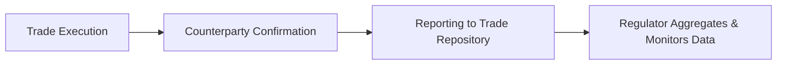

## 33.5 CIRO/CSA Reporting Obligations for Currency Options

Sometimes, when we talk about foreign exchange derivatives, we immediately jump to hedging and speculation strategies—like how to lock in a rate or make a bet on the Canadian dollar rising or falling. But here’s the thing: behind all the excitement of currency options (and all derivatives, really), there’s a critical layer of regulation. In Canada, currency option trades are subject to specific reporting rules enforced by the Canadian Investment Regulatory Organization (CIRO) and aligned with the Canadian Securities Administrators (CSA). Messing up those obligations can be, well, costly and complicated—nobody wants a fine or an unexpected compliance headache. So let’s explore exactly what you need to know.

## The Role of CIRO & CSA

Before we get into the nitty-gritty of reporting obligations, let’s clarify the roles at play:

• CIRO: Canada’s self-regulatory organization overseeing investment dealers, mutual fund dealers, and marketplace integrity. After the January 2023 merger of the former IIROC and MFDA, CIRO became the single SRO. If you have a relationship with an investment dealer in Canada, it’s highly likely they’re regulated by CIRO.  
• CSA: Canadian Securities Administrators. This isn’t a single regulator but a collective body of provincial and territorial securities commissions. Together, the CSA sets out harmonized regulations for derivatives (including currency options) across Canada.

Both CIRO and CSA aim to ensure transparency in derivatives markets, mitigate systemic risk, and protect investors from potential harm. In practice, that means there are frameworks in place that require transaction data to be meticulously tracked and reported.

## Why Reporting Matters

You might wonder: “Why do we even have to report these trades?” The short answer is that regulators want a near-real-time view of market risk. It helps them track large positions, spot manipulative schemes, and monitor potential threats to the financial system (a concept known as systemic risk monitoring).

Here’s a mini anecdote: A friend of mine, let’s call her Emily, once managed currency hedging for a mid-sized export business. She overlooked timely reporting on a pretty large over-the-counter (OTC) currency option trade. She got a dreaded call from compliance a few days later, and her team had to scramble to fix the oversight. The moral? Keep your reporting game on point from day one—because regulators don’t let that stuff slide.

## Key Reporting Obligations

In Canada, the reporting requirements for currency options will depend on whether you’re dealing with exchange-traded or over-the-counter (OTC) instruments.

### 1) Exchange-Traded Currency Options

In exchange-traded markets, most back-end reporting tasks are handled automatically by the exchange and its clearing corporation. The Montreal Exchange (Bourse de Montréal), for instance, funnels trade information directly to recognized trade repositories and stands between you and your counterparty to limit credit risk.

But, hold on, that doesn’t mean you have zero responsibilities. As a dealer or approved participant, you typically still need to:

• Record and verify each trade.  
• Monitor position limits, which can vary by option series or contract type.  
• Comply with large trader reporting if your positions exceed specific thresholds.  

If your overall positions or the notional amounts you handle cross certain markers, you might get a friendly (or not-so-friendly) nudge from CIRO reminding you to file large trader reports. This is how regulators connect the dots to see if any single market participant holds a controlling stake in an option series.

### 2) OTC Currency Options

OTC products are generally customized—think unique notional amounts, bespoke strike prices, or tailored expiration timelines. This flexibility means that compliance steps can be a bit more involved. Canadian regulators want these trades to be reported to an authorized trade repository, ensuring that each transaction gets recorded on a T+1 or T+2 basis (depending on the specific provincial or territorial rule).

When it comes to OTC currency options:

• You, the institution or dealer, must ensure accurate reporting of trade details.  
• Failure to report or inaccurate reporting can trigger fines or administrative penalties.  
• You may need to confirm (and sometimes reconcile) aggregated positions to see if you cross thresholds that prompt mandatory clearing or additional oversight.  

Sound complicated? Possibly. But each step is spelled out in CSA’s regulatory instruments, such as “Derivatives: Trade Repositories and Derivatives Data Reporting.” Meanwhile, CIRO has bulletins clarifying how members ought to structure their reporting, including the kind of data fields required (trade date, counterparties, notional amounts, settlement type, etc.).

## How the Reporting Process Works

Below is a simplified look at how a typical OTC currency option trade flows from execution to final reporting. This is an ultra-condensed version; in practice, there can be additional steps like credit limit checks and ongoing compliance reviews.

• Trade Execution: The client and dealer agree on key terms—strike price, expiry date, notional amount, etc.  
• Counterparty Confirmation: Both parties confirm the trade details (electronic messages or paper confirmations).  
• Reporting to Trade Repository: The dealer or designated reporting counterparty submits the required data.  
• Regulator Aggregates & Monitors Data: The relevant authority (CIRO in partnership with CSA) keeps a record and monitors for anomalies, suspicious activities, or concentration risks.

## Position Limits & Large Trader Reporting

Currency options are subject to position limits, which set caps on how many contracts or what notional volume an individual or institutional trader can hold. These limits help the market avoid manipulative or disruptive practices. CIRO regularly publishes notices about changes to position limits—so if, say, you used to trade up to 10,000 contracts without issue and that threshold changes to 8,000, you need to adapt quickly.

Large trader reporting is essentially the next step up. If your positions exceed a quantity (or notional threshold) that regulators think could pose risks to the market, you’ll be required to file detailed reports of your exposures. The logic is: If you’re big enough to move the market, you’re big enough to warrant more disclosure.

## Timing & Frequency

Think of trade reporting as a continuous obligation, not a one-off event:

• **Timing**: Most trades need to be reported within one or two business days post-execution.  
• **Ongoing Adjustments**: If the trade terms change—like an early termination, a partial assignment, or a modification of the notional—those changes must be reported, too.  
• **End-of-Day or Intraday**: Some positions are re-aggregated each day, especially if your firm trades actively and breaches or nears a large trader threshold.  

Under CSA’s trade-reporting requirements, trade data is often submitted in near real-time (as quickly as technologically feasible), especially for large institutional players. This near-real-time aspect allows regulators to monitor systemic risk quite effectively.

## KYC and Suitability for Currency Options

One might assume KYC responsibilities are only about ensuring the investor is who they say they are. Actually, it’s broader than that. Under CIRO rules, KYC extends to understanding the client’s financial situation, risk tolerance, investment objectives, and knowledge level.

When recommending currency options:

• Assess if the client understands currency risk, including the possibility of significant gains/losses due to sudden exchange rate moves.  
• Make sure margin requirements are well-explained, if any. Even if your client is sophisticated, it’s best practice to document thoroughly how these instruments fit into their strategy.  
• Provide adequate risk disclosure statements—particularly helpful for new or retail clients who find the FOREX world complicated.

For more on KYC and suitability, refer to the sections in Chapter 22 on “Opening and Maintaining Retail Option Accounts,” which also details the Risk Disclosure Statement and the concept of “managed accounts.”

## Enforcement and Penalties

So how strict are regulators about all this? Very. Regulatory authorities prioritize derivatives market transparency. Delayed or incomplete reporting can trigger investigations, fines, or other sanctions. In severe cases where trades are systematically under-reported, repeat offenders can face suspension—or in extremely rare cases, a revocation of their registration.

CIRO and the CSA also share data with one another—meaning you can’t slip out of the net by focusing on just one entity. If you’re a regulated dealer or portfolio manager, good compliance with derivatives reporting is a must.

## Real-World Case Study: A Corporate Hedger

Let’s say MapleTech Inc., a tech company based in Vancouver, wants to hedge exposure to the U.S. dollar because they import specialized microchips from the U.S. They enter into a series of CAD/USD OTC currency options with a notional amount of CAD 150 million. Their bank executes the trades, sets up the strike prices, and finalizes the documentation.

• Step 1: MapleTech Inc. and the bank confirm each trade’s terms (strike, expiry, etc.).  
• Step 2: The bank is typically the “reporting counterparty” (though the roles can vary). It must report the trade details, including the notional, counterparties, expiry date, and settlement terms, to a designated trade repository—e.g., a recognized repository authorized by the CSA.  
• Step 3: If MapleTech’s total positions across multiple banks exceed a threshold, MapleTech may be subject to large trader reporting. Since MapleTech’s trades are quite substantial, the CSA or CIRO might request additional data to confirm MapleTech isn’t concentrating market risk.  
• Step 4: MapleTech has to keep strong internal records. Next time you’re in a manager’s seat, trust me—you don’t want to scramble for documentation six months after the trades have been done.

## Tools & References

If you’re knee-deep in derivatives and want to keep up with ongoing changes, here are some resources:

• [CSA](https://www.securities-administrators.ca/): The official site for collectively published regulations, updates, and trade reporting mandates.  
• [CIRO](https://www.ciro.ca/): The main resource for bulletins, position limit updates, large trader reporting thresholds, and membership requirements.  
• [SEDAR+](https://www.sedarplus.ca/): A central repository for public disclosures, which can sometimes include derivatives usage by funds and corporate issuers.  
• “ISDA Reporting Requirements for Global Derivatives Markets”: Industry-led guidelines that can clarify best practices for cross-border trades.  
• For a broader perspective on margin requirements, see Chapter 23 of this course, “Client Margin Requirements,” which addresses how positions in currency options can drive margin calls.

## Glossary

• **Trade Repository**: A centralized registry where data on derivative trade transactions is collected and maintained for regulatory oversight.  
• **Systemic Risk Monitoring**: Activities by regulators to keep tabs on overall market exposures and detect threats to the financial system.  
• **Position Limits**: Maximum positions or exposure levels allowed for a particular contract.  
• **Large Trader Reporting**: The requirement for market participants holding sizable positions to periodically report them for transparency and regulatory checks.  
• **KYC (Know Your Client)**: The process of understanding a client’s risk tolerance, financial goals, background, and identity.  
• **Suitability**: Assessing whether a recommended product fits well with the client’s investment profile and financial resources.

## Conclusion

Currency options can be powerful instruments for hedging foreign exchange risk or seeking speculative gains. But along with that power comes a deep responsibility to follow the regulatory script. CIRO and the CSA have set clear obligations to ensure that every trade—especially the big ones in OTC markets—gets properly reported.

My one personal piece of advice from seeing how some peers have learned the hard way is to never treat compliance as an afterthought. Set up robust internal processes, double-check your data before you hit “Submit,” and keep lines of communication open between trading, legal, and compliance teams. If you do, you’ll find navigating CIRO/CSA reporting obligations for currency options a whole lot less intimidating.

## Sample Exam Questions: CIRO/CSA Reporting for Currency Options



### Which regulatory bodies primarily oversee the reporting of currency option trades in Canada?

- [x] CIRO and CSA
- [ ] The Federal Reserve and FINRA
- [ ] The Bank of Canada alone
- [ ] OSFI exclusively

> **Explanation:** In Canada, currency options are mainly overseen by CIRO (the self-regulatory organization for dealers) and the CSA (the umbrella organization of provincial and territorial regulators).

### Which type of currency option trade typically involves the exchange and clearing corporation taking care of most reporting responsibilities?

- [x] Exchange-traded currency options
- [ ] OTC currency options
- [ ] Binary currency options
- [ ] Digital currency options

> **Explanation:** For exchange-traded currency options, the reporting responsibilities are largely handled by the exchange and the clearing corporation, although dealers must still monitor compliance with position limits and large trader reporting.

### What is the primary purpose of requiring market participants with sizable positions to file large trader reports?

- [x] To detect potential market manipulation or systemic risk
- [ ] To prevent hedging strategies
- [ ] To simplify KYC documentation
- [ ] To boost speculative activity

> **Explanation:** Large trader reporting allows regulators to monitor significant positions that could influence market stability or pose systemic risk.

### In an OTC currency option, who typically has the main responsibility to submit trade details to a recognized trade repository?

- [x] The designated reporting counterparty (usually the dealer)
- [ ] The client alone
- [ ] The clearing corporation
- [ ] The market maker

> **Explanation:** In an OTC trade, the designated reporting counterparty—commonly the dealer—must submit trade details to a recognized repository.

### When a firm’s currency option positions surpass certain thresholds, what reporting obligation might regulators impose?

- [x] Large trader reporting requirements
- [x] Additional short selling disclosures
- [ ] Customs and border enforcement
- [ ] Lifting all position limits

> **Explanation:** Surpassing set thresholds triggers large trader reporting requirements. Short selling disclosures can also be triggered if the position interfaces with short sales—though those are separate processes.

### What can happen if a firm repeatedly fails to comply with trade reporting obligations for OTC currency options?

- [x] Possible fines or sanctions from CIRO and CSA
- [ ] Automatic cancellation of all outstanding trades
- [ ] Repayment from CIPF
- [ ] No repercussions as long as positions are profitable

> **Explanation:** Non-compliance with Canadian derivatives reporting rules can lead to fines, sanctions, or even suspension. CIPF covers client assets if a firm becomes insolvent, not for regulatory infractions.

### Which regulator’s bulletins should you consult for updates on position limits specific to currency options in Canada?

- [x] CIRO
- [ ] U.S. Commodity Futures Trading Commission (CFTC)
- [x] CSA
- [ ] Federal Deposit Insurance Corporation (FDIC)

> **Explanation:** CIRO notices often detail members’ obligations, including position limit updates. The CSA might also publish changes or clarifications in provincial rules, so both are relevant.

### Why is KYC particularly important before recommending currency options to a retail client?

- [x] Currency options can carry significant volatility and risk
- [ ] KYC is not necessary for any currency-related product
- [ ] Retail clients are exempt from trade reporting
- [ ] Currency options are illegal for retail investors

> **Explanation:** Because currency markets are volatile, currency options can generate large gains or losses, so a proper KYC ensures that the product aligns with the client’s risk tolerance and objectives.

### Which resource might you consult to review public disclosures about derivatives usage (including currency options) by Canadian companies?

- [x] SEDAR+
- [ ] FINRA’s BrokerCheck
- [ ] The Federal Trade Commission’s website
- [ ] The Bank of England’s registry

> **Explanation:** SEDAR+ is the central system in Canada for public company disclosures, which can include details on currency derivatives usage.

### True or False: Delayed or incomplete reporting of OTC currency option trades can draw penalties from both CIRO and the CSA.

- [x] True
- [ ] False

> **Explanation:** Both CIRO and CSA take delayed or incomplete reporting seriously, potentially imposing fines or sanctions on non-compliant parties.


