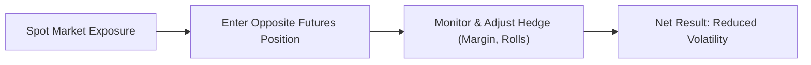

## 4.1 Hedging

Hedging can feel like a pretty fancy topic at first glance. But really, it’s no more than a strategy to protect your investments or business operations from unexpected price movements. Think of it as taking out an “insurance policy” on your assets so you can sleep better at night. In this article, we’ll walk through the essential elements of hedging with futures contracts, from real-world examples to regulatory requirements. By the end, you’ll have a solid understanding of how and why organizations (and individual investors too) use futures contracts to manage risk.

Before we begin, let’s do a quick recap of the context: this section is part of a broader look at how futures contracts are used. In previous chapters, we explored the basics of forward-based instruments and futures markets. Hedge strategies build on those fundamentals by showing us how to reduce or offset potential losses. Here, we’ll focus on four big questions:
• Why hedge with futures instead of something else?  
• How do we design an effective hedge?  
• What are the nuts and bolts of implementing and maintaining that hedge?  
• How do Canadian regulations (and global best practices) come into play?

Remember that hedging isn’t about making your portfolio bulletproof. It’s about controlling risk so that volatile price swings don’t take you by surprise. And if there’s one rule about financial markets, it’s that surprises can and do happen.

---

## The Logic Behind Hedging

Hedging is a risk management strategy. The goal is to offset any potential loss in the spot position (the real or underlying asset you own or owe) by taking an opposite position in a futures contract. If the spot market goes down, the futures contract ideally goes up, compensating for that decline (and vice versa). So while you might not profit as much if the market moves in your favor, you can rest assured that you won’t lose your shirt if it swings the other way.

### A Personal Anecdote
Years ago, I had a friend who ran a small coffee roasting business. The price of coffee beans was all over the place, and every time I saw him, he’d be stressed out about whether coffee prices had jumped that morning. One day, we explored using coffee futures contracts as a hedge. He bought futures to lock in his bean costs for the upcoming quarter. Sure, it wasn’t as thrilling as betting on the entire market dropping or skyrocketing, but he definitely lost a lot less sleep once he knew his costs wouldn’t spin out of control.

---

## Major Considerations When Building a Hedge

When you implement a hedge with futures, there are a few things you need to pin down clearly.

### 1. The Size of Your Underlying Exposure
• If you’re a wheat farmer expecting to harvest 10,000 bushels, or an airline with monthly needs of 200,000 gallons of jet fuel, your futures position should match those volumes as closely as possible.  
• If futures contracts don’t line up perfectly with your exact volume, you may need to take multiple contracts or accept a small mismatch, commonly known as “overhedging” or “underhedging.”

### 2. The Duration of Your Hedge
• Futures contracts have specific expiration dates—maybe monthly, quarterly, or every six months.  
• Pick an expiration that lines up with the period you need to protect. If you plan to sell your grain in September, you’ll likely hedge using September (or a nearby) contract.

### 3. Market Volatility
• Volatile markets can create stronger price swings (and bigger margin calls).  
• Higher volatility can also increase the cost of rolling hedges forward, because you might find significant price differences on each expiration date.

### 4. Liquidity 
• You want to be able to enter and exit your hedging positions quickly and at a fair price.  
• A thinly traded futures contract can make it difficult to manage the hedge efficiently, since you might face larger bid-offer spreads and partial fills.

---

## How Futures Hedging Works: A Quick Visual

Below is a simple high-level diagram representing how a hedger places a futures contract to offset exposure in the spot market. (Note: This is just conceptual, not a perfect illustration of every nuance.)

- A["Spot Market Exposure"]: You hold or expect to hold an asset (e.g., wheat, shares, a currency).  
- B["Enter Opposite Futures Position"]: You take a position in the futures market that moves in the opposite direction of your spot exposure.  
- C["Monitor & Adjust Hedge (Margin, Rolls)"]: You keep an eye on margin requirements, price changes, and potential contract expiry.  
- D["Net Result: Reduced Volatility"]: Gains or losses in one position help offset losses or gains in the other, stabilizing your net outcome.

---

## Examples of Hedging in Action

### Commodity Market Example
Let’s say you operate a food-processing plant. You buy large quantities of canola oil. You fear canola prices will spike before your next purchase. So, you take a long position in canola futures. If canola prices rise, your futures position can offset the increased cost of buying the spot commodity. If prices fall, you’ll lose some value on those futures contracts—but you’ll now be able to buy canola cheaper in the spot market.

### Interest Rate Hedging
Imagine you’re a corporate treasurer worried about rising interest rates on a planned debt issuance next quarter. You can hedge by selling interest rate futures (for instance, Government of Canada bond futures). If rates go up, your bond futures position will make an offsetting profit, compensating for the higher interest expense you’ll face in the future.

### Currency Hedging
Currency exchange rates swing constantly, and if your business deals with cross-border transactions, currency risk can eat into profits. For example, a Canadian exporter that expects to receive USD in the future might short (sell) Canadian dollar (CAD) futures. If the CAD strengthens (bad for the exporter when converting USD to CAD), the short futures position should increase in value, partly offsetting the drop in revenue from the stronger domestic currency.

---

## Hedge Effectiveness and Imperfections

While the logic and mechanics behind hedging appear straightforward, in real life, hedges are rarely perfect. Here are some of the common issues:

• **Cross-Hedging**: Sometimes a perfect futures contract for your exact product or exposure doesn’t exist (think an obscure fertilizer or a local niche commodity). You might have to use a closely related but not identical asset for hedging. This is called cross-hedging and can lead to some discrepancy.  
• **Basis Risk**: The spot price and the futures price do not always move in perfect lockstep. The difference between the spot price and futures price is called the “basis.” Basis risk can create gains or losses in your hedge if these prices move differently over time.  
• **Timing Mismatch**: If you can’t find a contract that matches your intended time horizon or if you close the hedge too early, you might be exposed to more risk than you realize.

Despite these imperfections, a hedge usually reduces enough market risk to justify any minor mismatch or basis risk.

---

## Margin Requirements and Ongoing Adjustments

Remember that futures contracts involve margin, which is essentially a performance bond. You’ve got to maintain a certain amount in your margin account to cover daily price moves against your position.

• **Initial Margin**: The amount you must deposit to open the futures position.  
• **Maintenance Margin**: The minimum amount you must keep in your account to maintain your open futures contract.

If your position starts moving against you too severely and your margin drops below the maintenance level, you’ll get a margin call. That means you must add capital to bring your balance back above the initial margin requirement. In highly volatile times, you might face multiple margin calls—sometimes in a single day.

For many corporations, margin calls can create cash-flow headaches. It’s important to plan your liquidity around potential margin spikes. Some large hedgers might prefer using over-the-counter (OTC) products or forward agreements (like bank-based forwards) to avoid daily margin calls, but these alternative routes may come with higher credit requirements or less transparency compared to exchange-traded futures.

---

## Hedging Under Canadian Regulatory Oversight

In Canada, the Canadian Investment Regulatory Organization (CIRO) is the primary self-regulatory organization overseeing investment and mutual fund dealers, as well as market integrity on multiple marketplaces. Under the new structure since 2023, CIRO is responsible for a broad set of rules around derivatives trading, including futures. Key rules to remember:

• **Know-Your-Client (KYC)**: Retail clients or commercial entities must articulate a clear rationale for hedging.  
• **Margin and Capital Requirements**: There are minimum margin levels set by both the exchanges (such as the Bourse de Montréal) and by CIRO.  
• **Reporting Requirements**: Certain large positions or special hedging positions may need to be reported to CIRO or the exchange.  
• **Clearing and Settlement**: Canadian Derivatives Clearing Corporation (CDCC) is the main clearinghouse for exchange-traded derivatives in Canada. By using standardized and centrally cleared futures, hedgers benefit from the clearinghouse’s risk management procedures.

For the latest updates and detailed guidelines, you can visit:  
• CIRO: [https://www.ciro.ca](https://www.ciro.ca)  
• Bourse de Montréal (MX): [https://www.m-x.ca](https://www.m-x.ca)  
• Canadian Securities Administrators (CSA): [https://www.securities-administrators.ca](https://www.securities-administrators.ca)

---

## Practical Steps to Implement a Hedge

1. **Identify Your Exposure**: Determine the exact commodity, currency, or financial instrument you’re dealing with and measure the size and timing of your exposure.  
2. **Select the Appropriate Futures Contract**: Choose a contract whose size, month, and underlying asset align best with your needs.  
3. **Decide on the Hedge Ratio**: In a perfect world, you’d hedge 100% of your exposure. In practice, many hedgers use a partial hedge, especially if they believe there’s a good chance the market could move favorably for them.  
4. **Open the Futures Position**: Enter your orders through a broker or online futures trading platform. Make sure your margin account is adequately funded.  
5. **Monitor Daily**: Keep an eye on the price movements, basis changes, and your overall exposure.  
6. **Roll Over or Close the Hedge**: If your exposure extends beyond the contract’s expiration, you might roll your position forward into a new contract. If the exposure is gone (like you’ve sold your product or locked in a loan rate), you might close out the hedge.

---

## Common Pitfalls and How to Avoid Them

• **Overhedging**: Hedging more than your actual exposure can turn a risk management strategy into a speculative position.  
• **Ignoring the Cash Flows for Margin**: You might reduce your price risk, but if you’re strapped for cash when margin calls pop up, your business can still be in trouble.  
• **Complacency**: Markets change, and so do your exposures. A hedge you put on six months ago may not match your current risk profile. Regular reviews are essential.

---

## Example Case Study: Oil Refinery Hedging

Suppose a Canadian oil refinery expects to need 150,000 barrels of crude oil each month for the next six months. Management is concerned about rising crude oil prices. Here’s a simplified illustration:

1. **Identify Exposure**: 150,000 barrels monthly.  
2. **Futures Contract Selection**: The standard NYMEX crude oil futures contract is for 1,000 barrels per contract. The refinery buys 150 contracts monthly for the next six months.  
3. **Hedge Ratio**: 1:1 coverage (they want to lock in the price for all 150,000 barrels).  
4. **Execution**: They purchase 900 contracts total (150 barrels × 6 months = 900 contracts, each for 1,000 barrels).  
5. **Monitoring**: As the spot price of crude rises, the refinery’s futures contracts increase in value. That futures profit offsets the increased cost they face in the spot market. If the spot price falls, they lose on the futures contracts—but the cost of buying physical crude is cheaper. Ultimately, net cash flow remains more stable.  
6. **Rolling Forward**: If the firm decides they need more coverage beyond six months, they’ll roll out of the soon-to-expire contracts and enter new, later-dated futures.  

---

## Tools and Resources

• **Canadian Securities Institute (CSI)**: Offers courses on derivatives and futures strategies tailored for Canadian markets.  
• **Open-Source Financial Libraries**: Tools like QuantLib in Python can help with advanced modeling of futures, especially if you’re testing hedging strategies.  
• **Reading Material**: “Options, Futures, and Other Derivatives” by John C. Hull and “Futures and Options Markets” by Colin A. Carter.  
• **Exchange Websites**: Bourse de Montréal (for interest rate and index futures unique to Canada), CME Group, ICE, etc., for real-time quotes and margin requirements.

---

## Encouraging Ongoing Learning
Perhaps you’re a finance student, maybe you’re a new trader, or maybe you’re a corporate risk manager—whatever your background, don’t hesitate to keep exploring. Hedging is part art, part science. Market psychology, basis risk, margin stress, and global economic shifts all influence your hedge’s effectiveness. Keep reading, experimenting (maybe with demo accounts), and discussing with peers or mentors if you can.

---

## Sample Exam Questions: Hedging with Futures



### In a typical hedging scenario using futures, what is the primary goal?

- [x] To offset potential losses in the spot market by taking an opposite position with futures
- [ ] To speculate on increasing prices in the futures market
- [ ] To maximize profit when prices move rapidly
- [ ] To avoid any initial margin requirements

> **Explanation:** The main objective of a hedge is to offset or reduce risk exposure in the spot market by taking an opposite position in the futures market. Speculation and margin avoidance are different matters altogether.

### Which of the following is an example of a mismatch that can occur between a futures contract and an actual exposure in the spot market?

- [ ] Risk-free markets
- [x] Basis risk
- [ ] Complete correlation
- [ ] Zero-volatility risk

> **Explanation:** Basis risk arises when the futures price and the spot price of the asset being hedged do not move perfectly in tandem. This mismatch can lead to imperfect hedge results.

### A Canadian wheat farmer expects to harvest 5,000 bushels of wheat in three months. Which hedging action typically aligns with that exposure?

- [ ] Buying currency futures
- [ ] Selling crude oil futures
- [x] Selling wheat futures
- [ ] Buying interest rate futures

> **Explanation:** If you expect to have a physical commodity (wheat) in the future and want to protect against a drop in its price, you would sell (go short) wheat futures now.

### What immediate financial obligation does a hedger face when entering a futures contract?

- [ ] A premium payment
- [ ] Maximum possible loss on the contract
- [x] An initial margin deposit
- [ ] Guaranteed profit from the position

> **Explanation:** Unlike an options contract (which requires a premium payment), a futures contract requires an initial margin deposit. This margin is adjusted daily through “marking-to-market.”

### Cross-hedging refers to:

- [ ] Hedging multiple commodities using the same futures contract expiration date
- [x] Using a futures contract on a related commodity rather than an identical one
- [ ] Selling and buying the same futures contract to lock in profit
- [ ] Avoiding all costs by hedging only a small portion of the position

> **Explanation:** Cross-hedging is when you use a related but not identical product’s futures contract to hedge exposure because an exact matching contract is unavailable or illiquid.

### One potential downside to implementing a full (100%) hedge is:

- [ ] Reduced margin requirements
- [ ] Complete elimination of basis risk
- [x] Forgone potential gains if prices move favorably
- [ ] No regulatory oversight

> **Explanation:** While a hedge protects you from losses, it also means you don’t benefit as much from favorable price movements, since any gains in the spot market will likely be offset by losses in the futures position.

### If you continually roll your hedge forward over multiple contract cycles, one potential cost or risk factor is:

- [ ] Decreased trading volume
- [x] Differences in futures prices across contract months
- [ ] Guaranteed immunity to market trends
- [ ] Elimination of margin calls

> **Explanation:** Rolling hedges often involves a cost known as the “roll cost” or “roll yield,” as the futures price for a further-out contract can significantly differ from the near-month expiry.

### Which of the following statements about margin calls and futures hedging is correct?

- [ ] Large daily price moves have no effect on margin
- [x] A hedger may face margin calls if the futures position moves against them
- [ ] Margin calls only happen after a contract expires
- [ ] Margin calls apply only to options contracts

> **Explanation:** In futures markets, if the market moves against your position and your margin balance falls below the maintenance level, you get a margin call. It applies to futures, not just options.

### Selecting a futures contract with insufficient liquidity can result in:

- [ ] Unlimited profit potential
- [x] Wider bid-offer spreads and potential difficulty entering or exiting positions
- [ ] No basis risk
- [ ] Guaranteed fills at desired prices

> **Explanation:** Illiquid contracts may not have enough trading volume or tight bid-offer spreads, causing traders to accept worse execution and face challenges in large orders.

### True or False: When hedging, the goal is to ensure that the combined profit/loss from the spot position and the futures position is as volatile as possible.

- [x] False
- [ ] True

> **Explanation:** The goal of a hedge is to reduce volatility (and thereby risk), not to increase it.


