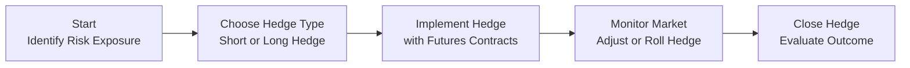

## 4.2 Types of Hedges

Hedging is all about reducing the uncertainty in the price of something that’s important to your business operations or investment portfolio. It might be a crop you’ve harvested or a commodity you’re planning to buy. Regardless, the idea is to use futures (or sometimes other derivatives) to offset—or neutralize—unwanted price changes. Now, in case you’re wondering how that works, let’s break it down in plainer language.

Imagine you’re a farmer, and you’re constantly worried that a sudden drop in wheat prices might reduce the money you get for your harvest. Or maybe you’re the manager of a bakery, fretting that skyrocketing wheat prices could crush your profit margins. If you can relate to either case, then hedge strategies are right up your alley. In essence, hedging can be seen as placing a sort of “insurance bet” in the futures market. So let’s get into how these hedges are set up, the differences between short hedges and long hedges, and how they’re handled when trying to make them fit your specific timeline or exposure.

### Why Hedge in the First Place?
People hedge because they like stability—or at least less uncertainty—in their financial outcomes. For the wheat farmer, a rapid decline in the market price of wheat can make it harder to cover operating expenses. For the bakery, a price spike might reduce margins significantly and lead to more expensive bread. By employing a hedge through futures contracts on the Bourse de Montréal (or U.S. exchanges if that suits your commodity or instrument), each party can lock in future prices and sidestep those nasty surprises.

These strategies are not about making a “huge profit” on derivatives. In fact, from a purely profit-maximizing perspective, a hedge might feel a bit underwhelming at times. After all, it’s meant to reduce or offset potential losses caused by price fluctuations. If the market moves favorably in your spot position, well, the futures hedge may lose value, thus limiting your upside. But when you consider that it also protects your downside, you’ll often be grateful for having that cushion in place.

### Short Hedges: The Selling Hedge
Let’s start with the short hedge, sometimes known as the selling hedge. This is a hedge taken by someone who already owns or expects to own a physical asset and is worried about that asset losing value in the marketplace. The typical example is a farmer with a crop in the field—or any commodity player who holds an inventory of raw materials.

• Implementation: You’d open a short (sell) position in the futures contract that closely matches your timeline and the asset you’re holding.  
• Goal: Protect against declining spot prices.  
• Outcome: If the spot price of your commodity falls, the short futures position should theoretically gain value, offsetting the lower price you’ll get in the cash market for your physical commodity.

A friend of mine once worked for a mid-sized soybean processor. (Yes, I used to tease him about all the soy in his life—soy candles, soy milk, who knows what else!) Anyway, he was telling me about times when soybean prices suddenly tanked. That’s obviously terrible if you have a warehouse full of beans. But by implementing a short hedge, the processor locked in a higher price on part of its production. So even though the cash market looked grim, the gains on futures helped balance the books.  

Keep in mind, the perfect alignment of gains and losses in a hedge rarely happens because your real-world product might not be a perfect match for the futures contract specs. That mismatch is known as basis risk. If you’re storing organic soybeans but the exchange-traded futures contract is for standard soybeans, there can be variance in how price changes correlate. But hey, any correlation is better than none when it comes to smoothing out that volatility.

### Long Hedges: The Buying Hedge
On the flip side, we’ve got the long hedge, or the buying hedge. These hedges are typically put in place by companies or individuals worried about rising prices for something they plan to purchase in the future. Think about that bakery racing around to lock in sugar or wheat prices. A friend of mine who bakes for a living once told me how nerve-racking it is when wheat prices start ticking upward. You get that panicky feeling: “Should I buy a massive stock of wheat flour now, or is that too risky?”

• Implementation: Go long, i.e., buy futures contracts.  
• Goal: Protect yourself from rising spot prices by locking in an acceptable purchase price.  
• Outcome: If the spot price of your commodity goes up, the long futures position should gain value. Thus, if you end up paying more in the cash market, the futures gains help offset those extra costs.

Of course, if the price of wheat doesn’t rise—maybe it even falls—then your bakery’s hedge will lose value on the futures side. But at least you’ll presumably pay less in the cash market, so there’s a trade-off. The important part is that the hedge eliminates the worst-case scenario of a potentially crippling price jump.

### Tailoring the Hedge Strategy
Both short and long hedges sound simple in theory, but in practice, people add all sorts of nuances. You have to pick:

• A specific delivery month that closely matches your exposure.  
• The most appropriate underlying asset that correlates with your real exposure.  
• The right number of contracts to properly size your hedge.

If you’re a metals manufacturer worried about the price of aluminum in three months, you’ll look at aluminum futures that expire around that time frame. Maybe you also consider if your aluminum is of a particular grade that differs slightly from the standard contract deliverable. So you might face some basis risk. The key is: the higher the correlation between your futures and your actual asset or liability, the more effective the hedge.

Additionally, the number of contracts matters. In a perfect world, you’d hedge exactly one-to-one. If you need to purchase 10,000 bushels of corn, and each futures contract covers 5,000 bushels, you might buy two futures contracts. But life is rarely so neat. Maybe your actual need is 8,700 bushels, so what do you do with that mismatch? Often, hedgers must approximate. Also, be mindful of margin requirements—you’ll be posting margin to the clearinghouse, so plan for that cash flow.

### Complex Hedge Strategies
Some firms opt to get fancier. It’s not always a straightforward buy-five-or-sell-five scenario. They might combine futures with put options, for instance, to create a “collar” strategy that limits the range of possible upside or downside. Or they might take partial positions in a couple of different futures contracts if their time horizon spans multiple delivery months.

1. Buying Puts on Futures: Instead of shorting a futures contract outright, someone might buy a put option on that futures contract. If the price drops sharply, the increase in the put option’s value still provides downside protection. However, if prices go up, you only lose the premium you paid for the put. It’s less of a direct hedge than a short future, but it offers flexibility.  
2. Combining Several Futures Positions: A more sophisticated hedger might layer on different expirations or correlated products to create a multi-tiered hedge that better approximates the actual exposure timeline.

Yes, it can get complicated very quickly, but the main takeaway is: you adapt your hedge to your specific risk, rather than the other way around.

### Rolling Hedges
Now, if the worry extends beyond the closest futures expiry, or if you have an ongoing need to hedge, you might use what’s called a rolling hedge. Basically, you hedge with the earliest futures contract, and then when that contract nears expiration, you exit it and simultaneously enter a later-dated contract. This process is repeated until your underlying exposure is finished.

One of my old coworkers from a large agribusiness used to joke: “Hedging is a game of keep-it-going.” They purchased lots of raw corn for feed, but their harvest windows and usage patterns didn’t always line up with futures expirations. Instead of a single discrete hedge, they “rolled” their positions from one delivery month to the next, carefully trying to manage the cost of carry and to maintain consistent coverage.

Rolling does come with some additional transaction costs and complexities. You’re effectively disposing of your front-month futures position (either buying back or selling the hedge) and establishing a new position in a future month. The price difference between these months—and the liquidity at that time—can make or break your strategy’s cost effectiveness.

### Real-World Check: Basis Risk Reminders
No hedge is perfect. Basis risk (the difference between the futures price and your actual commodity’s or instrument’s price) still lingers. For instance, your local wheat might trade at a premium or discount to the exchange’s standardized wheat contract. Or, in financial terms, maybe you’re hedging an overseas interest rate exposure, but the futures contract is tied to a Canadian benchmark interest rate. Imperfect correlation is just a reality; the trick is to choose the best available solution and keep a close eye on any misalignment.

### Regulatory Framework in Canada
In Canada, hedgers need to comply with guidelines set by the Canadian Investment Regulatory Organization (CIRO). If you’re setting up or carrying futures positions, you’ll want to check:

• CIRO’s guidelines on position limits and trade reporting obligations. These ensure no single participant can accumulate a dangerously large position and also maintain market transparency. Visit [CIRO](https://www.ciro.ca) for the most up-to-date rules.  
• Commodity futures information at the Bourse de Montréal (sometimes referred to as the Montréal Exchange or MX). Their website at [https://www.m-x.ca/en/](https://www.m-x.ca/en/) provides all sorts of contract specifications, margin requirements, and educational resources.  
• Agriculture and Agri-Food Canada (AAFC) for “AgriCommodity Hedging” resources at [https://agriculture.canada.ca](https://agriculture.canada.ca). That’s especially handy if you’re a producer wanting to sharpen your hedging game.  

CIRO took over from the historical SROs (IIROC and MFDA) as of 2023, so you might still see references to those older bodies. Don’t let that confuse you; just remember that as of now, the relevant self-regulatory organization is CIRO.

### Practical Example: The Farmer’s Short Hedge
Let’s take a down-to-earth example. Suppose you’re a canola farmer in Alberta. It’s early spring, and you’ve planted your canola crop. You worry that by harvest time in the fall, canola prices might tank, leaving you with smaller revenues than you need. So you decide to execute a short hedge:

1. Identify your exposure: Let’s say you estimate you’ll produce about 5,000 metric tonnes of canola.  
2. Check the futures contract: If one canola futures contract at the Bourse de Montréal covers 100 metric tonnes (example only; check actual specs on the Bourse site), you’d need roughly 50 contracts to hedge your entire expected harvest (5,000 ÷ 100 = 50).  
3. Initiate the hedge: You go short 50 futures contracts at a price of $700 per metric tonne in a futures contract that expires around the time you plan to sell your physical canola.  
4. Harvest season scenario:  
   • If the spot price at harvest is $650 per tonne, your physical canola sells at $650. Meanwhile, your short futures position was short at $700, and if you close it at $650, you lock in a $50 gain per tonne on the futures. So effectively, you still get $700 for your canola minus transaction costs and basis differentials.  
   • If the price rose to $750, your short futures would lose $50 per tonne, but you’d sell the canola at $750 in the cash market. Overall, you’d still end up near $700 net.

This example might be simplified. In reality, you’ll see basis adjustments, and you’ll have to carefully track your margin requirements. But the principle stands: the short hedge aims to protect your downside.

### Practical Example: The Baker’s Long Hedge
Now for a long hedge example. Suppose you own a local bakery that uses 1,000 bushels of wheat monthly. You’re concerned that wheat prices might jump just before the big holiday baking season. You decide to buy wheat futures:

1. Identify your exposure: You need 1,000 bushels, so check if one wheat futures contract covers 500 bushels (just an example).  
2. Number of contracts: You decide to buy 2 futures contracts to cover your 1,000-bushel requirement.  
3. Initiate the hedge: Let’s say you buy these contracts now in anticipation of needing the wheat in three months, and the futures price is $5.00 per bushel.  
4. At the end of three months:  
   • If the spot price is $6.00, your bakery is paying $6.00 in the cash market, but the gain on the futures contract (bought at $5.00 and sold at $6.00) effectively offsets that extra dollar.  
   • If the spot price is $4.50, then your bakery saves on the cash market purchase, but your futures contract is now at a loss. In total, you’ll still pay about $5.00 net per bushel.

Again, you’ve locked in a price close to $5.00, so you sleep easier at night.

### Tips and Best Practices
• Keep an eye on margin calls: Because these are futures, changes in price will require you to post additional margin if the market moves against you.  
• Don’t over-hedge: Hedging 100% of your production or needs can sometimes be too restrictive. Some companies prefer partial hedges to maintain some flexibility.  
• Understand the “roll” process: If your exposure lasts longer than a single contract, plan out how and when you’ll roll your positions and consider the costs and slippage in that process.  
• Monitor basis risk: Stay aware of how the futures and cash markets move in tandem (or fail to). That difference can impact your final results.  
• Document everything: For compliance with CIRO (and for your own clarity), keep thorough records of your hedge rationale, positions, adjustments, and terms. If regulators inquire or if you need to assess your strategy’s effectiveness, you’ll have the data handy.

### A Quick Mermaid Diagram of the Hedge Lifecycle
Below is a simple flowchart illustrating how you might implement and manage a futures hedge. It’s intentionally generic, so keep your actual circumstance in mind:

This visual shows the typical progression: (1) figure out your risk, (2) pick a hedge strategy, (3) put it on, (4) keep watch and decide if/when to roll it, and (5) ultimately unwind and see how it worked out.

### Additional Resources
• CIRO Rule Book – Derivatives Section: [https://www.ciro.ca](https://www.ciro.ca)  
• Bourse de Montréal for contract specs, educational materials, and margin requirements: [https://www.m-x.ca/en/](https://www.m-x.ca/en/)  
• Agriculture and Agri-Food Canada (AAFC): [https://agriculture.canada.ca](https://agriculture.canada.ca)  
• Canadian Securities Institute for courses such as “Derivatives Fundamentals and Options Licensing Course” and more in-depth educational content.  

At the end of it all, remember that hedging is about mitigating risk, not eradicating it entirely—markets can surprise you no matter how prepared you think you are. But by setting up a short or long hedge, you can focus more energy on running your business or portfolio with a little less worry about where prices are headed next.

---

## Sample Exam Questions: Hedge Strategies with Futures



### 1. Which of the following best describes a short hedge?

- [ ] Entering a long futures position to protect against rising prices.
- [x] Entering a short futures position to protect against falling prices.
- [ ] Entering a short options position to speculate on future price movements.
- [ ] Buying physical commodities in the spot market to lock in current prices.

> **Explanation:** A short hedge is used to protect a holder of the underlying asset from a price decline by initiating a short position in futures.  

### 2. What is the primary purpose of a long hedge?

- [x] Protecting against an increase in the future purchase price of a commodity or asset.  
- [ ] Speculating on a decline in commodity prices.  
- [ ] Locking in a premium for selling an upcoming harvest.  
- [ ] Avoiding basis risk entirely.  

> **Explanation:** A long hedge is initiated to protect the buyer of a commodity (or financial instrument) from price increases that could occur before the actual purchase.  

### 3. If a wheat farmer is uncertain about the price he will receive for his crop next season, which hedge strategy is most appropriate?

- [ ] Long hedge.  
- [x] Short hedge.  
- [ ] No hedge needed.  
- [ ] Iron condor strategy.  

> **Explanation:** A wheat farmer typically uses a short hedge (selling futures contracts) to lock in a selling price for his future harvest.  

### 4. In a rolling hedge, the hedger does which of the following?

- [ ] Sells an asset short in the cash market and buys it back later.  
- [ ] Carries the same futures contract until final settlement.  
- [ ] Avoids margin calls by closing positions early.  
- [x] Exits soon-to-expire futures contracts and replaces them with later-dated ones.  

> **Explanation:** A rolling hedge involves shifting exposure by closing near-expiry futures positions and opening similar positions in the next expiry month.  

### 5. Which factor is the most common cause of an imperfect hedge?

- [ ] Lack of a clearinghouse.  
- [x] Basis risk due to differences between futures and spot market prices.  
- [ ] Government-imposed trade embargoes.  
- [ ] Brokers charging unexpected fees.  

> **Explanation:** Basis risk refers to the difference between spot and futures prices for a commodity, leading to imperfect hedging outcomes.  

### 6. Why would a baker consider a long hedge on wheat futures?

- [x] To lock in a future purchase price and protect against rising wheat costs.  
- [ ] To bet on falling wheat prices and earn a profit.  
- [ ] To hedge against falling equity prices in a bakery’s stock portfolio.  
- [ ] To transport physical wheat to the exchange’s warehouse.  

> **Explanation:** A baker uses a long hedge to guard against higher input costs in the future.  

### 7. Which best describes the relationship between a physical commodity position and a short hedge?

- [x] Both positions tend to move in opposite directions, offsetting each other’s losses.  
- [ ] Both positions double the risk of price changes.  
- [ ] Both positions are subject to margin calls in the final delivery month.  
- [ ] Both positions provide equal downside and upside potential in the market.  

> **Explanation:** In a short hedge, losses on the physical commodity (due to falling prices) are offset by gains in the short futures position, and vice versa.  

### 8. When a hedger is looking to maintain a hedge beyond the initial futures contract’s expiry, they typically:

- [ ] Let the hedge expire, in order to minimize transaction fees.  
- [x] Roll the hedge into a later-dated contract.  
- [ ] Purchase an offsetting position in the cash market.  
- [ ] Automatically exercise the futures contract for physical delivery.  

> **Explanation:** “Rolling” the hedge is the process of switching out of an expiring futures contract and into one with a longer maturity.  

### 9. A short hedge might be insufficiently protective if:

- [ ] Interest rates suddenly drop.  
- [ ] The hedger has an option-based exposure.  
- [x] The underlying commodity has weak correlation with the futures contract.  
- [ ] The margin deposit is reduced by the broker.  

> **Explanation:** If the commodity being hedged doesn’t correlate well with the futures contract price, basis risk will weaken the hedge’s effectiveness.  

### 10. True or false: Hedging with futures allows individuals or firms to completely eliminate all forms of price risk.

- [ ] True  
- [x] False  

> **Explanation:** While hedging can significantly reduce price risk, it does not eliminate all risk factors (e.g., basis risk, transaction costs, liquidity considerations, etc.).  


