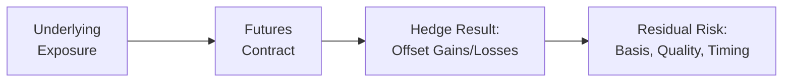

## 4.3 Imperfect Hedges

Hedging with futures might seem pretty straightforward in theory: line up your exposure with an appropriate futures contract, lock in the price, and go about your day—no sweat, right? Well, in reality, it’s rarely so clean-cut. Anytime you attempt to “perfectly” hedge an asset with a standardized futures contract, you can face issues like basis risk, differences in quality or grade, or even mismatches in the timing of your actual needs. These situations lead to what we often call an imperfect hedge (or partial hedge). Although an imperfect hedge won’t wipe out all your price risk, it can reduce much of the uncertainty you’d otherwise confront in day-to-day operations.

I remember, for instance, a good friend who runs a small coffee-roasting business. She was so excited to use coffee futures to hedge her inventory cost. But it turned out her exact bean variety wasn’t precisely the same as the standardized grade and origin specified in the futures market. She ended up with some basis risk, and her hedge was a bit, well, “imperfect.” Still, she saved enough on volatile coffee prices to justify the approach. Let’s dive into how these imperfect hedges work, why they’re common, and some ways to manage them in the futures landscape.

### What Are Imperfect Hedges?

In a perfect hedge, your futures position lines up exactly with the characteristics of your underlying exposure—same underlying asset, same quantity, same timing, and zero difference in price movement between the cash (spot) market and the futures market. Real life is a little more complicated. Imperfect hedges arise when there’s a mismatch between the underlying exposure you hold (or plan to hold) and the futures contracts you use to hedge that exposure.

We typically see these mismatches in one or more of the following areas:

• Quality or Grade  
• Basis Risk (spot vs. futures price differentials)  
• Contract Size and Market Liquidity  
• Delivery (or Expiry) Timing  

Even though these imperfections introduce residual risks, hedgers often accept them, balancing the cost of achieving a near-perfect hedge against the simplicity and practicality of imperfect but cost-effective solutions.

### Why Hedges Are Rarely Perfect

Someone might ask: “Why not just find a contract that precisely matches your exposure?” Well, in many markets, the regulated futures contract is standardized. That standardization is great for liquidity but not so great for uniqueness. If you deal in a niche variety of wheat, for example, you might only have mainstream wheat futures to hedge your price exposure. Alternatively, you may need to hedge an odd-lot quantity that doesn’t align neatly with the contract size, forcing you to either over-hedge or under-hedge.

In the Canadian market, we see a variety of futures contracts traded on the Bourse de Montréal. While the Bourse’s futures on equity indexes, bonds, and certain interest rates are fairly standardized, not every hedge need aligns one-for-one with those contract specs. Institutions and corporations might shrug and say, “We can’t find a perfect contract,” so they focus on something that’s close enough to minimize the bulk of the risk.

### Common Sources of Imperfection

#### Mismatch in Quality or Grade

Let’s say you operate a flour mill and need to buy high-quality milling wheat for your products. The futures contract, however, might specify a slightly different grade or protein content than what you actually need. The result is a mismatch between the wheat in your operational pipeline and the standardized wheat in the futures contract.

If the milling wheat you require trades consistently at a premium compared to the standardized grade, you must watch that premium carefully. If it widens, your hedge won’t capture all the incremental cost. If it narrows, you might even benefit unexpectedly. But overall, you’re left with an imperfect hedge that might not offset every cent of volatility.

#### Basis Risk

Consider basis risk as the heart and soul of imperfection in hedging. Basis is defined as:


\text{Basis} = \text{Spot Price} - \text{Futures Price}


The notion is simple but powerful. Even if your chosen futures contract references the same underlying commodity, index, or instrument, the spot price and futures price can diverge over time due to unexpected events in supply, demand, or market sentiment. That divergence introduces risk because the net payoff from your futures position may not move exactly inverse to your spot position.

When the basis changes unexpectedly, you might end up with either a windfall or a shortfall in your hedge. A “perfect basis” scenario—where the basis remains constant—rarely exists. This is especially critical in commodities, but it also crops up in interest rate futures and equity index futures. Over harvest seasons, central bank announcements, or major earnings releases, basis can shift dramatically.

#### Unequal Contract Size

Futures contracts are often standardized in large sizes (e.g., 100 troy ounces for a gold futures contract, 1,000 barrels for a crude oil futures contract). If you’re looking to hedge a smaller amount, you might have to buy or sell more contracts than your actual exposure, resulting in over-hedging or under-hedging. Over-hedging can lead to speculation risk because you’re effectively taking a larger short (or long) position than your spot exposure. Under-hedging leaves part of your exposure unprotected. Neither scenario is entirely comfortable, but you might accept the trade-off if partial coverage is simpler or more cost-effective than a customized hedge in the over-the-counter market.

#### Timing Differences

You might need a hedge up to a specific date—maybe your inventory arrives in three months—but the futures contract you can access expires in two months or four months. A mismatch in timing can require you to roll over your futures position to maintain the hedge. Rolling over can trigger additional transaction costs and expose you to short-term price fluctuations. Alternatively, if you close your hedge too early or prematurely, you might end up “naked” (unhedged) for the remainder of your exposure.

Let’s do a quick miniature example: Suppose your company expects to purchase a large quantity of aluminum in mid-April, but the aluminum futures contract you’re using expires at the end of March. You can hedge until March, but you either have to roll forward to another contract for April or accept that gap risk from March to April. Neither is perfect, so you weigh the costs and benefits of each approach.

### Partial Hedges and Their Role

Sometimes, a hedge covers only a portion of total exposure. Maybe the hedger decides they’re comfortable with half the risk and half the uncertainty. That’s a partial hedge. This scenario often occurs when the cost or complexity of hedging 100% of the exposure is too high. For instance, smaller companies might not want to tie up precious capital in margins for a full hedge. Or they might prefer to keep some “upside” potential in case prices move favorably.

Under-hedging is effectively a partial hedge. Over-hedging can also happen if the hedger decides to buy more futures than the exposure calls for, either by necessity (due to contract size) or by choice (speculative motive, though that starts to push beyond strict hedging into purposeful speculation).

### Real-World Example: Grain Producer Hedging with Wheat Futures

Picture a Canadian grain producer who plants a high-protein variety of wheat for specialty baking products. The standardized futures contract—traded on an exchange or the Bourse de Montréal (in certain cases)—references a medium protein grade. Historically, the high-protein variety sells at a premium over standard. The basis between these two wheat types fluctuates from CAD 0.30/bushel to CAD 0.60/bushel, depending on market conditions.

The producer decides to short wheat futures to hedge. If the price of standard wheat futures falls, it typically indicates trouble in the broader wheat market, likely lowering the spot price for high-protein wheat as well. However, if the difference (basis) between specialty wheat and standard wheat blows out during the hedge period, the producer won’t recover that premium from the short futures position. That’s the basis risk playing out. It’s still a helpful hedge, because broad downward wheat price moves will be partially offset, but it’s imperfect.

### Mermaid Diagram: Imperfect Hedge Flow

Below is a simple visual of how an imperfect hedge might look. The spot asset price and the futures contract don’t move in perfect lockstep, creating some residual risk (basis risk).

In a perfect hedge scenario, that fourth node (D) would say “No Residual Risk,” but we know real life isn’t so tidy!

### Balancing the Costs and Benefits

Hedgers rarely hedge every last drop of risk. The cost of a near-perfect hedge—especially if a specialized over-the-counter (OTC) product is required—may be very high. In addition to direct costs like commissions, the hedger must cater to margin requirements, which can fluctuate and eat up cash or credit facilities. If the potential basis risk seems manageable, many hedgers accept an imperfect hedge rather than pay for an elusive ideal hedge that might provide only marginally better protection.

### Regulatory Overview and Best Practices

In Canada, futures trading is overseen by regulatory bodies such as the Canadian Investment Regulatory Organization (CIRO). CIRO sets margin guidelines and best practices for futures hedging to ensure market integrity and adequate risk controls. While the “perfect hedge” is not mandatory (and is often not even feasible), registrants should maintain robust risk management procedures, document their hedging strategies, and ensure they meet all margin and reporting obligations.

• Bourse de Montréal contract specs: Check [https://www.m-x.ca](https://www.m-x.ca).  
• CIRO margin guidelines and compliance resources: [https://www.ciro.ca](https://www.ciro.ca).  

Bourse de Montréal’s website provides details on contract size, underlying assets, delivery months, and more. Understanding these specs is critical, as a mismatch in timing or contract size is a primary driver of imperfect hedges.

### Basis Risk: A Deeper Look

Basis risk is so essential that many entire chapters in finance textbooks cover it. One recommended reference is John C. Hull’s “Options, Futures, and Other Derivatives,” which dedicates significant discussion to basis risk and hedging strategies. The key point is that even when your futures contract references the same underlying commodity or financial instrument you need to hedge, the movements in the spot price and the futures price can deviate. The reasons behind these deviations range from local supply and demand issues to changes in interest rates, storage costs, or even investor sentiment.

When basis narrows or widens unexpectedly, the hedge’s effectiveness can drop. For instance:

1. If you are short futures to protect against a decline in the spot price of your asset, but the basis narrows more than anticipated, your overall net position might suffer losses.  
2. If the basis widens significantly, you might do better than you originally expected.  

These outcomes can be a bit of a gamble—thus the word “risk” in basis risk.

### Timing and Rolling Over

Managing an imperfect hedge often involves rolling your futures position if your actual exposure extends beyond the expiry date of the contract. Rolling can be done by closing out the soon-to-expire futures position and opening a new one in a later month. This process might lead to either a small gain or small loss because the futures curve could be in contango (where longer-dated futures are more expensive) or backwardation (where longer-dated futures are cheaper). Regardless, rolling introduces a cost and potential price risk during the transition.

### Hedging in Financial Products Beyond Commodities

Imperfect hedges don’t just plague farmers, mining companies, or coffee roasters. Financial institutions and investment managers encounter them when hedging interest rates, credit exposures, currency risks, and equity portfolios. For interest rate futures, the mismatch might stem from the floating rate index that differs slightly from the reference in the futures. Or, in currency hedging, the contract might reference a major currency pair like USD/CAD, while your firm deals in a cross-pair that’s not a top-tier instrument. So, you might hedge your local flows with a more liquid USD/CAD contract and live with a bit of basis risk relative to your actual currency exposure.

### Practical Tools and Solutions

• **Cross-Hedging**: In some cases, you may use a different but correlated asset’s futures contract to hedge. For example, if you produce barley, but barley futures are illiquid or unavailable, you might hedge with wheat futures if both are historically correlated. This approach is obviously more “imperfect” but might be the closest practical solution.  
• **Optimal Hedge Ratio**: Instead of hedging 1:1, some advanced models (like the hedge ratio formula in cost of carry or regression-based approaches) might help you find the ratio of futures contracts that minimizes basis risk. This is particularly relevant in currency or fixed income where correlations among instruments can be measured and fine-tuned.  
• **OTC Customization**: When the mismatch is too big, or the cost of basis risk is too high, companies sometimes use OTC derivatives. These tailor-made contracts can match exact specs—quantity, timing, or underlying asset type. But the trade-off is potentially higher credit risk, less liquidity, and possibly higher transaction costs, not to mention more complex documentation (ISDA master agreements, collateral requirements, etc.).  

### Example: Interest Rate Hedge Imperfection

Imagine a mid-sized corporation with a floating interest rate loan tied to the CDOR index (now transitioning to CORRA in Canada). The firm wants to fix its borrowing costs by entering into a short position on a Canadian Bankers’ Acceptance futures (BAX) contract. These futures track the 3-month rate, but the loan adjusts monthly. Suddenly, the alignment between the monthly resetting floating rate and the quarterly settled BAX futures introduces timing discrepancies. The mismatch leads to some leftover interest rate sensitivity—they’re not exactly hedged, although they’ve cut down a large portion of the risk.  

### Risk Management Tips

If it seems like we’re stuck in a gloom-and-doom scenario of never being able to hedge perfectly, well, in a sense that’s accurate. But imperfect hedges remain a worthwhile technique for risk management as long as:

• Management acknowledges the residual risk.  
• The cost of the hedge remains in line with the benefit of risk reduction.  
• Processes exist to measure, monitor, and potentially adjust the hedge over time.  
• Ongoing communication with the firm’s risk committee or CFO clarifies how the hedge is structured and what residual exposures remain.

### Canadian Regulatory Angle

Under CIRO, any firm offering futures-based hedging services or engaging in significant futures hedging should abide by:

• Adequate capital maintenance under the margin rules.  
• Appropriate position reporting and compliance regarding net open exposures.  
• Full disclosure to clients about possible residual risks if you’re advising or executing hedges on behalf of others.  

CIRO emphasizes transparency, especially if you’re a regulated entity. For instance, if you hold out hedging services to an institutional or retail client, you should be clear about the possibility of an imperfect hedge and how that might affect the client’s final net result.

### Looking Ahead

As the Canadian derivatives market continues to evolve—incorporating new ESG-related commodity futures, exploring crypto derivatives, and transitioning certain benchmark rates—hedgers will likely grapple with new forms of basis risk and mismatches. The fundamental principles of hedging, however, remain: drastically reduce your direct exposure, knowing you might not kill off every single potential $1.00 of risk.

At the end of the day, in my opinion, an imperfect hedge often beats no hedge at all if you’re facing large swings in commodity prices, currency exchange rates, or interest rate movements. Just make sure to set realistic goals for your hedge and measure your exposure so that you’re not rudely surprised when that final tally of gains and losses comes in.

---

## References and Additional Resources

• Bourse de Montréal for detailed futures contract specifications:  
  [https://www.m-x.ca](https://www.m-x.ca)  

• CIRO website for compliance updates, margin rules, and regulatory requirements:  
  [https://www.ciro.ca](https://www.ciro.ca)  

• Hull, John C. “Options, Futures, and Other Derivatives,” for a deeper theoretical dive, including basis risk modeling and hedging strategies.  

• Open-source tools for hedging and risk calculations (e.g., Python libraries such as pandas, NumPy, or specialized finance libraries like QuantLib).  

• For timing mismatch solutions, check out official handbooks or materials on rolling futures contracts published by major Canadian brokerages or the Bourse de Montréal.  

---

## Sample Exam Questions: Imperfect Hedges & Basis Risk Essentials



### When does an imperfect hedge arise?

- [x] When there is a mismatch between the futures contract and the hedger’s actual exposure
- [ ] When basis risk is exactly zero
- [ ] When interest rates don’t change
- [ ] When the underlying exposure is already fully replaced by a forward contract

> **Explanation:** An imperfect hedge shows up when there’s a mismatch in factors such as timing, quantity, or quality that prevents a perfect offset of price risk.

### Which of the following best describes basis risk?

- [x] The possibility that spot and futures prices do not move in perfect sync
- [ ] The risk of not finding a counterparty to take the opposite position
- [ ] The risk of liquidity drying up in the futures market
- [ ] The possibility of a total correlation between spot and futures prices

> **Explanation:** Basis risk specifically refers to the difference between the spot price and the futures price (the “basis”) and how that difference fluctuates, potentially undermining the hedge’s effectiveness.

### A hedger who requires 3,000 barrels of oil but must trade in contracts of 1,000 barrels each decides to buy 4,000 barrels’ worth of futures. What is this situation called?

- [ ] A perfect hedge
- [ ] A partial hedge
- [x] An over-hedge
- [ ] A mismatch in timing

> **Explanation:** Purchasing futures for 4,000 barrels when only 3,000 are needed is an over-hedge since the futures exposure exceeds the actual physical exposure.

### Which scenario highlights a timing mismatch in a futures hedge?

- [x] When the futures contract expires in September but the hedger needs coverage until November
- [ ] When the hedger chooses an OTC swap over a futures contract
- [ ] When the commodity is illiquid in the spot market
- [ ] When the contract size is too large

> **Explanation:** Timing mismatches occur if the hedger’s desired hedge timeframe doesn’t align with the futures contract’s settlement or expiry.  

### What is the simplest operational fix when you face a timing mismatch but want to maintain your hedge?

- [ ] Do nothing and hope it resolves itself
- [x] Roll over your futures position
- [ ] Move to a completely different commodity
- [ ] Close out the position early without reopening

> **Explanation:** Rolling over is the common practice of closing out the near-expiry contract and initiating a position in a further-out contract.

### Why might a hedger accept partial hedging?

- [x] To reduce margin costs or simplify hedging at an acceptable level of risk
- [ ] To eliminate all possible exposure completely
- [ ] Because futures contracts have unlimited liquidity
- [ ] To precisely match the underlying exposure with zero cost

> **Explanation:** A hedger may do a partial hedge to reduce complexity or because the cost of a full hedge is too high relative to the residual risk.

### What is a cross-hedge?

- [x] Using a different but correlated asset’s futures contract to hedge
- [ ] Not hedging at all
- [ ] Engaging in illegal trading
- [ ] Buying high-quality underlying assets while shorting lower quality

> **Explanation:** A cross-hedge occurs when you rely on a futures contract on a correlated asset to offset price movements in the asset you actually produce or consume.

### Which of the following statements about basis risk is correct?

- [ ] Basis risk is irrelevant for commodity hedges
- [x] Basis risk is the central source of imperfection in many futures hedges
- [ ] Basis risk becomes zero upon contract expiration
- [ ] Basis risk only applies to interest rate products

> **Explanation:** Basis risk is often the main culprit in an imperfect hedge because spot and futures prices may move differently, leading to incomplete protection.

### In the context of imperfect hedges, which is true regarding quality mismatches?

- [x] They occur when the futures contract grade or specification differs from the hedger’s actual asset
- [ ] They lead to futures contracts expanding to accommodate any grade
- [ ] They completely remove the possibility of basis risk
- [ ] They only exist in currency futures

> **Explanation:** Quality mismatches arise when the standardized grade or specification in the futures contract is not identical to the asset being hedged, thus creating a possibility for basis differences.

### True or False: Using standardized futures to hedge a unique asset exposure typically eliminates all risk.

- [ ] True
- [x] False

> **Explanation:** Standardized contracts rarely, if ever, create a perfect hedge for a unique asset, so some level of risk remains, and the hedge is usually imperfect.


