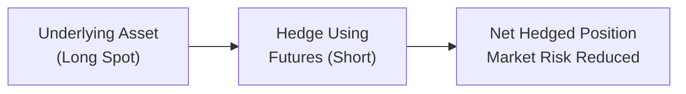

## 4.4 Optimal Hedge Ratio

Hedging, in its simplest form, is like wearing a raincoat when you expect rain—you’re protecting yourself against something unpleasant that might happen. In the world of derivatives, that “something” is often an adverse price movement in a commodity, currency, stock, or bond. We’ve been discussing futures hedges in this chapter. Now, let’s talk about the optimal hedge ratio: the precise recipe for how many futures contracts you really need to wear as your “raincoat” against adverse price movements.

Some folks out there will say, “I have 100,000 units of a commodity, so let me just short an equivalent futures quantity—boom, done!” That’s the famous 1:1 hedge ratio. While that approach might work out okay in many cases, it’s not necessarily perfect. If your “raincoat” is too large or too small, you might end up with a damp sleeve or pay for an oversized coat that’s uncomfortable to wear. In financial terms, an imprecise hedge can lead to unanticipated risk or missed opportunities. The optimal hedge ratio is all about shrinking that risk by properly matching how your asset price moves relative to the futures contract price—while factoring in basis risk, correlation, and possible market quirks along the way.

Below, we’ll dive deep into the nitty-gritty:

• Why the 1:1 ratio might not always be your best friend.  
• How correlation and basis risk shape that “perfect” ratio.  
• A quick peek into the math behind the hedge ratio (including Covariance and Variance).  
• Real-world examples—because that’s where things get exciting!  
• The crucial role of monitoring your hedge ratio over time.  

Take a deep breath, put on your metaphorical calculator hat, and let’s get started.

---

### Why Not Just Hedge 100% of the Exposure?

I remember one of my first times setting up a hedge. A colleague waltzed over to me and said, “We have a million barrels of crude oil in inventory, so we should short a million barrels’ worth of crude futures. Right?” Logically, you’d think if you’re physically long the commodity, you short the same quantity of futures, and—voilà—you’re perfectly hedged. But in real life, you might find that your inventory is Brent crude, while your futures contract is based on WTI crude. Different benchmarks, different delivery points, maybe slightly different price behaviors. Then you factor in transportation, storage costs, or other supply-demand shifts. You realize that these differences can create basis risk.

“Basis risk” is the difference between the spot price of your actual underlying and the futures price used for the hedge. This difference can widen or narrow unpredictably. The more the two prices move in perfect sync, the less basis risk you have. If there’s a mismatch or partial correlation, that’s where trouble can lurk. A 1:1 ratio might still leave you with a surprise if the underlying price and the futures price refuse to march in lockstep.

Hence, the idea of an optimal hedge ratio arises because we want to align the hedge as closely as possible with how our particular underlying asset is moving in the real world. In the next sections, we’ll see how to systematically figure out that alignment.

---

### Components of the Optimal Hedge Ratio

#### 1. Basis Risk

As we’ve said, the difference between the spot (cash) price and the futures price can fluctuate over time—this is the basis. Even if you think your spot item and the futures contract are identical, real markets can produce varying premiums or discounts due to seasonal factors, supply chain constraints, interest rates, or just daily supply-demand sentiment. This variability in the spot–futures relationship adds risk to a hedge. If a futures contract doesn’t track the underlying price precisely, you’re left with a portion of uncovered risk.

#### 2. Correlation

Imagine you’ve got an asset whose price moves almost perfectly in sync with your futures contract. The correlation between them is extremely high, say 0.98. That’s a dream scenario for a hedge because the two instruments move almost hand-in-hand. In that scenario, a 1:1 volume hedge might be decent, but the truly optimal ratio might be something slightly different if there are differences in volatility. If the correlation is weaker (maybe 0.70 or 0.50), then you might either need more or fewer futures contracts to achieve a strong hedge. The correlation measure effectively captures the “dance steps” that the spot and futures prices take as market conditions shift.

#### 3. Time Horizon

Hedging is not just a once-and-done operation. Perhaps your commodity exposure changes over time (like an ongoing production of wheat or seasonal inventory buildup for a retailer). Your hedge might need to remain in place for a few weeks or months, meaning you’re rolling futures contracts forward each time they approach expiration. That’s where changes in correlation or basis risk over time can alter your hedge ratio. A ratio that was perfect in January might look a little out of whack in March.

---

### The Mathematical Backbone: The Hedge Ratio Formula

One of the most common ways to estimate an optimal hedge ratio is through regression analysis, often referred to as a “minimum variance hedge ratio” approach. In brief, you gather historical price changes (returns) for your spot asset (∆Spot) and your futures contract (∆Futures). Then you run a linear regression with ∆Spot as the dependent variable (y-axis) and ∆Futures as the independent variable (x-axis). The slope of the regression line (often labeled “beta”) is your hedge ratio.

Mathematically, the slope in a standard ordinary least squares regression can be expressed as:


\text{Hedge Ratio} = \frac{\text{Cov}(\Delta S, \Delta F)}{\text{Var}(\Delta F)}


In words:  
• Cov(ΔS, ΔF) is the covariance between changes in the spot price and changes in the futures price.  
• Var(ΔF) is the variance of changes in the futures price.  

Another form, more rooted in correlation and standard deviations, looks like this:


\text{Hedge Ratio} = \rho_{S,F} \times \frac{\sigma_S}{\sigma_F},


where  
\\(\rho_{S,F}\\) is the correlation coefficient between changes in S and F,  
\\(\sigma_S\\) is the standard deviation of spot price changes, and  
\\(\sigma_F\\) is the standard deviation of futures price changes.

---

### A Quick Look at a Diagram

Sometimes it helps to see how futures and the underlying spot position align in a simple graphical flow. Below is a basic Mermaid diagram illustrating how a hedger might structure a position:

• A: The existing asset exposure you’re worried about—like owning a commodity, holding an equity portfolio, or being long a currency.  
• B: The futures contracts you short (most common scenario) to offset that risk.  
• C: The net result: a combined position with hopefully much lower overall variance, thanks to the hedge.

When your asset exposure changes or if basis risk evolves, it can prompt you to revisit or recalculate your hedge ratio—keeping your net risk at a level that matches your preferences.

---

### A Practical Example

Let’s say you’re a Canadian wheat producer who’s growing 1,000 metric tons (MT) of wheat, and you’re concerned about decreasing prices at harvest time. You find a relevant wheat futures contract that trades on an exchange. But you might notice your local market’s cash price for wheat doesn’t always track the exchange’s reference price exactly. Also, consider that, historically, your local wheat price moves in sync with the futures price about 90% of the time.

1. Collect Historical Data: Suppose you gather monthly data over the last two years for your local wheat prices and for the associated wheat futures.  
2. Calculate Price Changes: Compute the month-over-month change for both sets of prices.  
3. Regression: Use a spreadsheet or an open-source library (like R’s “quantmod” or Python’s “statsmodels”) to run a linear regression of local wheat price changes (y) on futures price changes (x).  
4. Determine the Hedge Ratio: If the regression slope (beta) comes out to 0.8, that suggests that for every 1% move in the futures price, your local wheat price tends to move 0.8%.  

So, if your total wheat exposure is 1,000 MT, that slope (0.8) implies you might only need to hedge 800 MT worth of wheat using that futures contract. In other words, you’d short 800 MT equivalent of futures. Had you automatically hedged 1,000 MT on a 1:1 basis (maybe because you guessed it was simplest to do so), you’d be over-hedging based on the historical relationship of your local wheat to the futures contract.

---

### Implementation Steps

1. **Data Collection:** Gather a sufficient sample of historical price data for both the underlying exposure (spot) and the chosen futures contract.  
2. **Calculate Returns:** Often, we look at returns or changes, not just raw prices, to normalize the data.  
3. **Run Regression:** If you’re comfortable coding, you can do this in R or Python. Alternatively, spreadsheets offer built-in regression functions.  
4. **Interpret the Slope:** The slope (beta) is your hedge ratio.  
5. **Adjust for Contract Size:** Most futures contracts come in specific contract sizes—like 5,000 bushels of wheat, 1,000 barrels of oil, etc. Once you have the ratio, you need to figure out how many contracts this ratio translates to.  
6. **Execute Your Hedge:** Place orders on the relevant exchange to short (or long, if you need to offset a short underlying exposure) that number of futures contracts.  
7. **Monitor & Rebalance:** Don’t set it and forget it. Keep an eye on how the basis evolves and how your correlation changes over time. If large market shifts occur, recalculate and adjust the hedge ratio if needed.

---

### Monitoring the Hedge Ratio

It’s important to note that today’s correlation (or regression slope) doesn’t guarantee tomorrow’s correlation. If, for instance, interest rates rise dramatically or there’s a supply disruption in your region, your local spot price might start diverging from the futures price. Not to mention, once you roll over from one contract to another (as futures near expiration), new contract months might have different dynamics.

A few practical tips:

1. **Set Review Dates:** Maybe monthly or quarterly check-ins to see how well the hedge is performing.  
2. **Track Hedge Effectiveness Metrics:** You can measure the standard deviation of your net position to see if it’s in line with your risk tolerance.  
3. **Stay Alert to Market News:** Commodity-specific events, changes in monetary policy, or local phenomena can degrade correlation if you’re not paying attention.  
4. **Use Stop-Loss or Position Limits:** If you’re uncertain about big swings, consider setting protective triggers on your positions.

---

### Practical Pitfalls

Even a well-calculated hedge ratio can face challenges:

- **Contracts Not Available or Illiquid:** Sometimes the exact futures contract needed doesn’t exist, or it’s too illiquid. You might accept a suboptimal hedge because the product that best matches your spot asset can’t easily be traded.  
- **Overconfidence in Historical Data:** Past correlation might not equal future correlation, especially if the data window used was too short or captured a unique market environment (such as the pandemic volatility in 2020).  
- **Ignoring Transaction Costs:** Each hedge has a cost—commissions, bid-ask spreads, margin requirements, and so forth. These can eat into your hedge effectiveness.  
- **Operational Complexity:** As your hedge ratio changes, you need to open or close positions. That’s time-consuming and can introduce further costs or operational errors.

---

### Best Practices for Hedgers

1. **Use a Rolling Regression:** Some practitioners recalculate correlation with a rolling window (like the last 60 days) to pick up changes in real time.  
2. **Stress Testing & Scenario Analysis:** Evaluate how your hedge would perform if correlation dropped significantly. Evaluate the effect of large price moves or major macro shifts.  
3. **Compliance with CIRO Requirements:** In Canada, the Canadian Investment Regulatory Organization (CIRO) has guidelines about margin requirements and risk disclosure. As a registered firm or an advisory professional, ensure you meet these obligations.  
4. **Documentation:** Keep records of your calculations, your rationales, and your compliance with any hedging exemption reporting (CIRO or otherwise).  
5. **Stay Informed on Market Innovations:** Exchanges regularly list new products that might align better with your underlying exposure. Also, keep an ear out for new clearing services or margin rules that can influence effective hedging strategies.

---

### Canadian Regulatory Context

Since January 1, 2023, the Mutual Fund Dealers Association of Canada (MFDA) and the Investment Industry Regulatory Organization of Canada (IIROC) no longer operate as separate entities. They’ve been combined into the Canadian Investment Regulatory Organization (CIRO). Under the CIRO umbrella, you’ll find updated rules, margin requirements, and oversight policies that unify what used to be separate frameworks. When establishing or adjusting a hedge position, you should ensure you’re following the newest CIRO guidelines on derivatives usage and margining practices. If you have any doubt, check out CIRO’s official website at [https://www.ciro.ca](https://www.ciro.ca).

---

### Open-Source Tools & Further Reading

Heard of R’s “quantmod” package or Python’s “statsmodels” library? They can be your best friend for running regressions, computing correlations, and retrieving historical market data. If you’re new to these, there are plenty of online tutorials, YouTube videos, and free courses on platforms like Coursera or EdX—just search for “quantitative finance” or “statistical analysis for finance.” In particular:

- **R (quantmod, zoo, xts):** Great for pulling in time-series data quickly and performing rolling regressions.  
- **Python (pandas, statsmodels):** Perfect for regression analysis, with powerful data-handling capabilities.  
- **SSRN (Social Science Research Network):** [https://ssrn.com](https://ssrn.com) is an excellent place to read white papers and academic research on hedge ratios and their performance in different markets.  

---

### Concluding Thoughts

Finding an optimal hedge ratio is like balancing an equation in real-time. You’re playing matchmaker between your underlying spot exposure and a futures contract, hoping they stay in sync. While a naive 1:1 ratio can be convenient, it can leave money on the table or create extra risk if there’s a mismatch in correlation or volatility. By doing a bit of quantitative legwork—collecting data, running regressions, and monitoring your results—you can significantly reduce unwanted exposure.

If you view hedging as strategic risk management rather than a guessing game, you’ll come to appreciate the difference that a well-tuned hedge ratio can make. Keep in mind, too, that hedging is an ongoing process. Markets shift, correlations evolve, and new information emerges. But with consistent data analysis, periodic rebalancing, and alignment with regulatory frameworks, you’ll be in a stronger position to protect your portfolio value.

---

## Sample Exam Questions: Optimal Hedge Ratios and Futures Hedging



### Which of the following best describes the purpose of an optimal hedge ratio?

- [ ] To lock in a guaranteed profit on a futures contract
- [x] To minimize the variance (risk) of the combined spot and futures position
- [ ] To ensure you always trade the same number of futures contracts as cash assets
- [ ] To create a directional bet on future price movements

> **Explanation:** The optimal hedge ratio is designed to minimize the combined variance of the underlying spot position plus the futures hedge, rather than to guarantee profits.

### Which formula below correctly indicates the hedge ratio using regression analysis?

- [ ] Hedge Ratio = (Variance of futures) / (Covariance of spot and futures)
- [x] Hedge Ratio = (Covariance of spot and futures) / (Variance of futures)
- [ ] Hedge Ratio = (Covariance of spot and futures) + (Variance of futures)
- [ ] Hedge Ratio = (Correlation of spot and futures)^2

> **Explanation:** In regression terms, the slope (beta) is typically Cov(Spot, Futures) / Var(Futures).

### Which of the following is a potential problem if you rely solely on the naive 1:1 hedge ratio?

- [x] You might be under- or over-hedged due to basis risk and correlation issues
- [ ] It is always cheaper than using the optimal hedge ratio
- [ ] Markets never allow a 1:1 ratio in practice
- [ ] Futures contract sizes are always smaller than the cash position

> **Explanation:** A naive 1:1 hedge disregards any divergences in price movements, correlation, and other market realities. This can lead to suboptimal risk reduction.

### If the historical correlation between your asset and your chosen futures contract decreases from 0.95 to 0.65, what is the most likely effect on your hedge ratio?

- [ ] It remains unchanged because correlation is irrelevant
- [x] It may require recalculation and adjustment downward or upward depending on volatility
- [ ] It always becomes zero
- [ ] It always doubles

> **Explanation:** When correlation shifts significantly, the optimal hedge ratio can change. You must recalculate using updated data.

### Using the correlation and standard deviation approach, if σS = 2% and σF = 3% with a correlation of 0.80, the hedge ratio is:

- [ ] 0.80 / (2% ÷ 3%)
- [ ] 2% × 3% × 0.80
- [x] 0.80 × (2% ÷ 3%) = 0.80 × 0.6667 ≈ 0.53
- [ ] 0.80 + (2% ÷ 3%)

> **Explanation:** Hedge Ratio = ρ × (σS / σF) = 0.80 × (0.02 / 0.03) ≈ 0.53.

### Why might conducting a rolling regression on recent data be beneficial for determining an optimal hedge ratio?

- [x] It captures changes in market relationships and volatility in real-time
- [ ] Historical data is always preferable to real-time data
- [ ] Rolling regressions increase basis risk
- [ ] It eliminates the effect of correlation entirely

> **Explanation:** Rolling regressions help you keep track of evolving market conditions and re-estimate relationships over shorter, more relevant time windows.

### Which of the following statements about basis risk is correct?

- [ ] Basis risk is eradicated if you use the correct number of futures contracts
- [ ] Basis risk is highest when correlation approaches 1
- [ ] Basis risk pertains mainly to interest rate changes
- [x] Basis risk arises from potential differences between the spot price and the futures price

> **Explanation:** Basis risk refers to the uncertainty created by the changing difference (basis) between cash and futures prices.

### Which of the following is NOT typically a step in implementing an optimal hedge?

- [ ] Gathering historical data on the underlying asset
- [x] Only trading in the out-of-the-money call options
- [ ] Performing a regression to find the slope (hedge ratio)
- [ ] Monitoring and rebalancing the hedge over time

> **Explanation:** Implementing an optimal hedge with futures does not inherently involve trading out-of-the-money call options. That’s more related to option-based hedging strategies.

### When calculating the hedge ratio for a Canadian commodity, why might a producer use Python’s “statsmodels” or R’s “quantmod”?

- [ ] To inflate the correlation coefficient artificially
- [x] To perform regression and statistical analysis on historical price data efficiently
- [ ] To bypass all margin requirements
- [ ] To directly execute trades without an exchange

> **Explanation:** Tools like Python’s “statsmodels” or R’s “quantmod” help analysts gather data, run regressions, and monitor correlation changes. They have no direct function in circumventing margin or exchange rules.

### True or False: A higher correlation between futures and the underlying asset always implies that the hedge ratio will be exactly 1.0.

- [ ] True
- [x] False

> **Explanation:** A higher correlation can lead to a more effective hedge, but the hedge ratio specifically depends on the relative volatilities and the regression slope, which may still be above or below 1.0.


