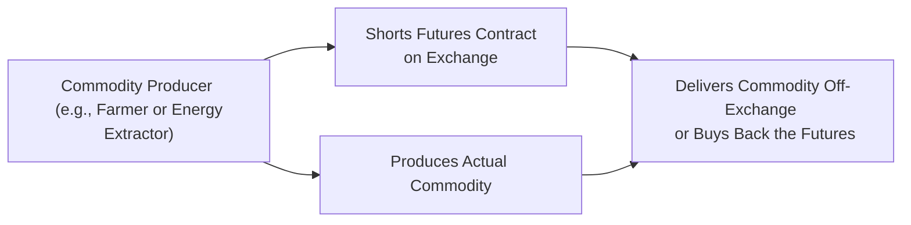

## 4.5 Hedging Canadian Commodities (Energy, Agriculture)

Have you ever driven across those endless golden fields in the Canadian Prairies and wondered how grain farmers manage their price risk before harvest time? Or maybe you’ve spoken with someone working in the oil patch in Alberta, trying to navigate the ups and downs of crude oil prices (which, let’s be honest, can change direction faster than the weather in Calgary)? Well, in this section, we’re talking about all those behind-the-scenes strategies that energy producers, farmers, and commodity consumers use to manage unpredictable price swings—yep, we’re talking about hedging with futures contracts.

Let’s get started with a quick story. My friend used to manage a small farm co-op in Saskatchewan. Each year, they'd get anxious about harvest-time prices. If wheat prices tumbled right before they needed to sell, they'd lose out on a lot of income. Enter: wheat futures contracts. By shorting wheat futures, they’d (mostly) lock in a selling price for their crop and sleep a bit better at night. Similarly, my cousin, who works at a large airline, once mentioned how her treasury department uses crude oil futures to hedge against rising jet fuel costs. Different industries, but the same goal: reduce uncertainty in future cash flows.

Below, let’s analyze how these hedges actually work, especially for energy and agricultural commodities in Canada.

-----------------------------------
## Why Hedge Energy and Agricultural Commodities in Canada?

Canada produces tons of energy—oil, natural gas, you name it—and has sprawling farmland that generates critical crops like wheat, canola, and barley. With so many resources, you’d think the money would always flow predictably. But commodity markets aren’t exactly known for their calm and stability. Prices can fluctuate due to weather, geopolitical tensions, supply chain disruptions, or changes in consumer demand. By using futures contracts, various market participants—producers, processors, large consumers, and even speculators—attempt to offset their price risk.

You’ll often see references to these hedging strategies on the Bourse de Montréal, ICE Futures Canada, and major U.S. exchanges like CME Group. Each exchange has specific contract specifications, delivery terms, margin requirements, and so on. And, these days, it’s much easier to access those details online.

-----------------------------------
## Energy Hedging

### 1. Overview of Energy Markets in Canada
Canada’s energy sector is massive: we’ve got offshore drilling in the Atlantic, conventional and unconventional oil in Alberta, natural gas plays in B.C., and more. Many producers, refiners, and major consumers (like transportation companies) use derivatives to secure their costs or revenues.

Producers often face the following question: “How can I lock in a future selling price and protect my budget from a market downturn?” Meanwhile, refineries and large energy consumers wonder: “How can I shield myself from the pain of price spikes?” Let’s look at how you can hedge in a simpler sense.

### 2. Hedging for Energy Producers
Energy producers can short (sell) futures contracts to guarantee that at some future date, they’ll receive a set price for their production. Let’s say you’re an Alberta-based oil producer anticipating 100,000 barrels of crude in six months. If you think oil prices might drop, you can sell WTI (West Texas Intermediate) futures or, in certain scenarios, use Western Canadian Select (WCS) swaps or differential hedges. However, WCS trades at a discount (the so-called “WCS differential”) to WTI. If it’s simpler, producers might just grab a WTI futures hedge and accept some basis risk—meaning the difference between the local WCS price and the futures price might fluctuate more than you’d like.

Anyway, imagine you lock in a WTI futures price of CA$80 per barrel. If the spot price dips to CA$70 at the time your production’s ready for sale, your physical barrel might fetch a lower price in the cash market, but your short futures position gains CA$10 per barrel. That futures gain would effectively offset the lower price you got in the cash market, generating stable net revenue. Of course, you might groan a bit if the market price soars to CA$100, since your short position would lose money. But, in hedging, the goal is stability, not necessarily hitting a home run.

### 3. Hedging for Refiners and Other Large Consumers
Refiners, airlines, trucking companies, and other businesses that just can’t function when energy costs spike can go the opposite route: they might go long (buy) energy futures to lock in a known maximum purchase price. For instance, if a Canadian airline anticipates it’ll need, say, 500,000 barrels of jet fuel in the next year, it may purchase crude oil futures to offset rising costs. If prices go up in the future, the profit on the futures helps to offset the increased input cost. If prices fall, the airline might lose on those futures contracts but pay less in the spot market for fuel. Once again, it’s all about smoothing out the roller-coaster.

### 4. Basis Differentials: WCS vs. WTI
Here’s the fun part: as a Canadian producer, you may not have a perfect match between your physical crude and the WTI futures spec on a U.S. exchange. That mismatch is the “basis differential.” Western Canadian Select (WCS) is a heavier crude with different physical characteristics and a distinct price discount to WTI. If you hedge with WTI, you’re ignoring the potential daily swings in that WCS-WTI price differential. This is a risk you should keep in mind. Some companies try to manage the differential with basis swaps, but we won’t get too deep into that here.

-----------------------------------
## Agricultural Hedging

### 1. Overview of Canadian Agricultural Production
Canada’s farmland is huge, producing wheat, barley, rye, canola, and more. If you drive through Manitoba or Saskatchewan, you’ll see endless fields of canola in bright yellow bloom. Farmers need to manage risk because weather, pests, or global supply/demand shifts can drastically affect prices.

### 2. Hedging for Farmers
Picture a canola farmer with farmland in Saskatchewan. They expect a yield of 2,000 tonnes in a few months. They worry that if the canola market price plunges right after harvest, it’ll hit their bottom line. One approach? Sell canola futures (listed on ICE Futures Canada) for the quantity they expect to harvest. If the canola price indeed falls, the gain on the short futures helps offset the lower cash price. If canola soars, they might regret not reaping the higher spot price, but at least they locked in a safe level of profit.

This is like buying insurance on your house. You hope you never need it, but you’d rather have it in place than face a financial catastrophe if disaster strikes.

### 3. Hedging for Processors
Now, let’s switch sides. Suppose you run a milling operation. You’re reliant on a stable cost for wheat or canola, or maybe you process barley into malt for breweries. If the commodity’s price jumps unexpectedly, your margins shrink. One possibility is buying wheat futures or canola futures. If the commodity price spikes, you’ll gain on the futures, offsetting the higher cost of the physical commodity. If the commodity’s price stays stable—great, you might be out a bit on the futures premium, but at least you sidestepped potential meltdown.

### 4. Matching Contract Grades and Deliveries
Effective hedging demands that the contract’s specifications match your physical commodity as closely as possible—think delivery location, contract grade, and deadlines. ICE Futures Canada has canola futures with specific grading standards. If your canola doesn’t meet *exactly* those standards, your hedge might be “imperfect.” You also have to consider that your harvest might not align perfectly with the exchange’s settlement dates, leading to some timing mismatch. Still, for many producers, it’s the best way to manage price risk.

### 5. Transportation and Storage
In Canada, geography can impose additional challenges. Maybe you have to move your crops by rail to a delivery point three provinces away, or you need to store your harvest temporarily in silos. Each of these factors may result in adjusting your hedge quantity, or you might have to manage the difference between the local elevator price and the futures price. That difference is also a form of basis, and it can shift depending on freight costs, local supply constraints, or other factors.

-----------------------------------
## Combining Both: A Quick Visual Flow

It might help to see how these hedging transactions fit into the big picture. Here’s a simplified Mermaid diagram showing how a commodity producer might interact with the futures market:

An energy or agricultural producer simultaneously produces the physical commodity and enters a short position in a futures contract. At or before expiry, they can buy back the futures position or deliver physically, depending on the contract specifications and their real-world needs.

-----------------------------------
## Best Practices and Common Pitfalls

• **Best Practice: Align Timing.** The timing of your hedge is critical. If your harvest occurs in late August but your futures contract expires in early July, you might face a mismatch. Carefully choose contract months that best reflect your production cycle or usage period.

• **Best Practice: Understand Basis.** You’ll need to monitor local basis differentials. If the difference between your local cash market and the futures reference market shifts wildly, your hedge may not fully protect you.

• **Pitfall: Overhedging or Underhedging.** If a farmer overestimates the size of the harvest and sells more futures than the actual production, that leads to a speculative position. Similarly, underhedging might leave you more exposed to price risk than intended.

• **Pitfall: Forgetting About Margin Calls.** Since futures are marked to market daily, you could face margin calls if the market moves against your position. This can create short-term liquidity pressures unless you’ve set aside sufficient cash reserves.

• **Pitfall: Not Reviewing Contracts.** Different exchanges (e.g., Bourse de Montréal, ICE Futures Canada, CME) have varying contract specs, tick sizes, or ways to handle delivery. Read the fine print and confirm your commodity’s type, quality, and quantity are well-represented.

-----------------------------------
## Regulatory and Reference Points

• **CIRO (Canadian Investment Regulatory Organization):** For up-to-date margin requirements and any new reporting guidelines, check their site at [https://www.ciro.ca](https://www.ciro.ca). CIRO is the national self-regulatory body for investment dealers and marketplace integrity in Canada.

• **Bourse de Montréal:** Lists futures for energy-related products and equity/interest rate derivatives. For contract specifications and trading hours, see their website.

• **ICE Futures Canada:** Specializes in canola futures (among others). Their contract details can be found under the “Agriculture” section. Keep your eyes on their margin requirements, which may vary based on market conditions.

• **Agriculture and Agri-Food Canada:** Offers market information, risk management programs like AgriStability, and other useful data at [https://agriculture.canada.ca](https://agriculture.canada.ca). If you’re a farmer, some of these programs can complement your hedging strategies.

• **Canada Energy Regulator (CER):** Publishes “Canadian Energy Markets” reports and insights on production levels, demand trends, and transportation. Good for a big-picture sense of what’s happening in energy.

-----------------------------------
## Real-World Scenario

Let’s try a hypothetical farmland scenario to illustrate:

• **Situation:** Emily is a wheat farmer in Alberta expecting 10,000 bushels of spring wheat to be harvested in October. She’s worried about a price drop.

• **Action:** In June, Emily checks the wheat futures (on the CME or a Canadian alternative if available). Suppose December wheat futures are trading at CA$8.00/bushel. She decides to short 2 contracts (each contract covers 5,000 bushels) at CA$8.00. This means she locks in a futures-based selling price near CA$8.00 for her anticipated harvest.

• **Outcome:** By early October, imagine spot wheat prices drop to CA$7.50. Emily sells her physical wheat at that market price but simultaneously closes her futures position. The short futures position yields a profit of roughly CA$0.50/bushel (ignoring transaction fees). So her net realized selling price remains near CA$8.00. Perfect? Maybe not exactly, because local basis, grade, and timing might cause small deviations, but it’s a big improvement over taking an entirely unhedged approach.

-----------------------------------
## Glossary

• **Western Canadian Select (WCS):** A Canadian blend of heavy crude oil that typically trades at a discount (differential) to the U.S. benchmark WTI (West Texas Intermediate).  
• **WTI (West Texas Intermediate):** The primary benchmark crude oil used in North American oil futures markets.  
• **ICE Futures Canada:** An exchange offering a variety of futures contracts, including canola—particularly relevant for Canadian agricultural producers.  
• **Basis Differential (Basis):** The difference between the local commodity price and the reference futures price. This difference can vary by region and over time due to transportation costs, local demand, and quality differences.

-----------------------------------
## Additional Resources

• **Agriculture and Agri-Food Canada:** [https://agriculture.canada.ca](https://agriculture.canada.ca)  
• **Bourse de Montréal—Derivatives:** [https://www.m-x.ca](https://www.m-x.ca)  
• **ICE Futures Canada:** Search “canola futures contract specs” for more details.  
• **CIRO:** [https://www.ciro.ca](https://www.ciro.ca) for regulatory requirements, margin guidelines, and ongoing updates.  
• **Canada Energy Regulator:** [https://www.cer-rec.gc.ca](https://www.cer-rec.gc.ca) for reports on Canadian energy markets.

-----------------------------------
## Conclusion

It’s fairly common for Canadian energy and agricultural producers (and big consumers!) to hedge their prices with futures. The idea is to remove or reduce the risk of big swings in the underlying commodity. While hedging can be an excellent strategy for stabilizing revenues or controlling costs, it’s not a ticket to infinite profits. You still face basis risk, timing mismatches, potential liquidity squeezes from margin calls, and the possibility that you could have done better without a hedge if prices move in your favor. But in the real world, with farmland overhead or big payrolls in the oil patch, most folks want certainty—and that’s exactly the role these futures contracts serve.

If you’re in the commodity space—or advising clients who are—take the time to map out precisely what your price risk looks like, what your production or usage timelines entail, and which futures markets provide the best match for your needs. With careful planning, a hedge can really be the difference between weathering a price storm and being at the mercy of volatile commodity markets. Now, let’s check how prepared you are with some practice questions.

-------------------------------------------------------------------------------

## Sample Exam Questions: Hedging Canadian Commodities (Energy, Agriculture)



### Which of the following statements best describes the primary reason Canadian energy producers hedge with crude oil futures?

- [ ] To speculate on rising crude oil prices.
- [x] To lock in a future selling price and stabilize cash flow.
- [ ] To eliminate all exposure to basis differentials completely.
- [ ] To meet regulatory requirements for environmental compliance.

> **Explanation:** Canadian energy producers typically hedge using crude oil futures to stabilize their revenue. By locking in a known price, they protect themselves from adverse market movements, even though they may still face basis differential risk.

### A canola farmer in Saskatchewan is worried about falling prices before harvest. The most common hedging approach is:

- [x] Selling (shorting) canola futures on an exchange.
- [ ] Buying canola futures on an exchange.
- [ ] Entering a swap agreement based on WTI crude prices.
- [ ] Purchasing an energy call option on the Bourse de Montréal.

> **Explanation:** To hedge against price drops, a producer typically sells futures that match, as closely as possible, the crop’s specifications and harvest timing.

### Basis risk in Canadian commodity markets refers to:

- [ ] The credit risk associated with futures contracts.
- [ ] The manipulation of market prices by large speculators.
- [x] The difference between local cash prices and the futures reference price.
- [ ] The seasonal weather patterns impacting crop yields.

> **Explanation:** Basis is the gap between a local cash market price and the corresponding futures price. It can change over time due to local supply/demand factors, transportation costs, and quality differences.

### One pitfall in hedging agricultural commodities is overhedging. If a farmer overhedges:

- [ ] The exchange immediately cancels their contracts.
- [x] They risk selling more crops via futures than they can produce.
- [ ] They gain additional profit due to extra contracts.
- [ ] They no longer have to worry about margin calls.

> **Explanation:** Overhedging can turn into a speculative position if actual production falls short of the contracted amount. This can create added risk rather than mitigating it.

### Which of the following best describes why a Canadian airline might buy crude oil futures?

- [ ] To speculate on natural gas prices.
- [x] To protect against rising jet fuel costs.
- [ ] To meet minimum margin requirements set by CIRO.
- [ ] To reduce the WCS-WTI differential.

> **Explanation:** An airline faces exposure to rising fuel costs. Buying crude oil futures effectively locks in a max price, offsetting the risk of higher fuel expenses.

### Which regulatory body in Canada should you consult for updated margin guidelines on futures and options?

- [ ] Investments Industry Regulatory Organization of Canada (IIROC).
- [ ] Mutual Fund Dealers Association (MFDA).
- [x] Canadian Investment Regulatory Organization (CIRO).
- [ ] Office of the Superintendent of Financial Institutions (OSFI).

> **Explanation:** Following the amalgamation of IIROC and the MFDA, CIRO is the current national self-regulatory organization overseeing investment dealers, including margin requirements for derivatives.

### In a typical hedging scenario, if the hedge is “successful” from a financial standpoint:

- [ ] The hedger will make a significant speculative gain.
- [ ] The hedger’s final price outcome will be unpredictable.
- [ ] The hedger is exempt from regulatory reporting obligations.
- [x] The hedger’s net revenue or net cost remains relatively stable.

> **Explanation:** A successful hedge aims to provide stability and predictability in cash flows by offsetting losses in the cash market with gains in the futures (or vice versa).

### An agricultural producer hedging wheat with futures should carefully select which contract month(s)?

- [ ] The earliest contract month listed on the exchange.
- [x] The contract month(s) closest to their expected harvest or selling period.
- [ ] The farthest-out contract, to lock in the largest possible profit.
- [ ] Only the July contract, regardless of harvest timing.

> **Explanation:** Hedgers often pick a futures expiration that aligns closely with their planned harvest or selling schedule to minimize timing mismatches.

### Refiners hedge crude oil primarily to:

- [ ] Speculate on crude oil price movements and make large gains.
- [ ] Lock in the WCS-WTI differential.
- [ ] Adhere to mandatory hedging laws in Canada.
- [x] Control input costs and protect profit margins from volatile crude prices.

> **Explanation:** A refiner’s main goal is to stabilize the cost of crude inputs, thereby controlling end-product margins.

### True or False: When hedging with futures, a farmer or producer no longer needs to worry about basis differentials or quality mismatches.

- [x] True
- [ ] False

> **Explanation:** Actually, this statement is false—so the correct answer is to mark “False.” Basis differentials, grading specifications, and timing mismatches can still cause an imperfect hedge. Despite using futures, local pricing and quality factors remain relevant. 


