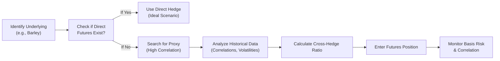

## 4.6 Cross-Hedging Strategies

Cross-hedging may sound a bit like juggling—um, you’re trying to protect against price risk in one asset by using a futures contract on another. Imagine that you’re a barley farmer in Western Canada, and you're anxiously watching the weather (and your phone) for price quotes. You’re aware that your revenue depends heavily on the barley price at harvest. But there's a snag: there’s no super-liquid barley futures market for you to jump on. So, you think, “Hey, what if I use wheat futures instead?” Well, that’s basically cross-hedging: the art (and sometimes headache) of using a futures contract on a commodity or instrument that’s correlated—but not identical—to your actual underlying.

Cross-hedging is a critical topic because it highlights not only the creativity inherent in derivative markets but also the real financial risks that must be tackled carefully. Let’s unpack the concept step-by-step, then dive into some best practices, examples, and the regulatory context in the Canadian framework (with some global comparisons sprinkled in for good measure).

---

## Understanding the Basic Idea of Cross-Hedging

Think about how standard futures hedging works: If you grow canola and there’s a well-established canola futures contract, you can short canola futures to lock in a sale price for your physical production. This straightforward approach lines up the physical commodity (canola) with the identical futures commodity (also canola). But what if that perfect match doesn’t exist? Could happen with barley, specialized energy products, or even certain currencies that don’t trade widely on recognized futures exchanges.

Cross-hedging is basically your Plan B. Instead of a perfect match, you look for a “near match,” a correlated asset that tends to move in tandem with your underlying. If barley and wheat prices historically move together (with a “high correlation,” as we say), you might short wheat futures to offset a potential drop in barley prices. The principle is the same if you hold, say, foreign-currency-denominated bonds whose exact currency doesn’t have a tradable futures contract. In that case, you might choose a related currency contract with historically high correlation.

### Benefits and Drawbacks in a Nutshell

• Benefit: You can hedge an otherwise unhedgeable risk.  
• Drawback: The correlation could break down. Or maybe it’s weaker than you assumed. You could be left with a partial hedge, or even an outright mismatch in price movements. That leftover mismatch is called basis risk.  

In other words, cross-hedging involves an extra layer of unpredictability. But for many market participants, it’s better than no hedge at all.

---

## Correlation and Basis Risk

### Why Correlation Matters

Correlation is at the heart of cross-hedging. We measure it statistically (often with the correlation coefficient). Two price series that go up and down together with near-perfect uniformity have a coefficient close to +1. This suggests a strong relationship, giving you more confidence that if barley falls by X%, wheat will likely follow close behind (or move in the same direction to a similar degree).

In KaTeX, the sample formula for correlation (Pearson’s correlation coefficient) between two assets X and Y is:


\rho(X,Y) = \frac{\sum_{i=1}^{n}(X_i - \bar{X})(Y_i - \bar{Y})}{\sqrt{\sum_{i=1}^{n}(X_i - \bar{X})^2 \sum_{i=1}^{n}(Y_i - \bar{Y})^2}}


We won't dive too deep into the math. But basically, if \\(\rho(X,Y)\\) is close to +1, we say X and Y’s prices tend to move in the same direction (and in a similar magnitude). This is the sweet spot for cross-hedging—high correlation can often mean a more effective offset.

### Basis Risk in Cross-Hedging

“Basis risk” is the difference between your underlying asset price and the futures contract price. In a perfect world, both would move in tandem, but there are inevitably differences:

• Geographical differences (e.g., barley grown in Manitoba vs. wheat grown in Saskatchewan).  
• Quality variations (malting barley vs. feed wheat).  
• Temporal or seasonal factors.  
• Market liquidity and local demand.  

When doing a cross-hedge, you add an extra layer of difference: you’re comparing two different assets entirely. So basis risk can be higher (and more fickle) than if you were hedging with an exact matching futures contract. This can lead to “hedge slippage” or only partial protection when events suddenly cause barley and wheat to move out of sync.

---

## When, Why, and How Cross-Hedging Is Done

### Real-World Example: Barley Producer Using Wheat Futures

Let’s detail the barley-wheat scenario in a bit more depth:

1. A barley producer is worried about declining prices before harvest.  
2. The farmer looks for barley futures—none are actively traded.  
3. The farmer checks historical data (maybe from [Statistics Canada](https://www.statcan.gc.ca) or specialized commodity data vendors) to see how barley spot prices have moved relative to wheat futures.  
4. She calculates the correlation coefficient.  
5. If correlation is high enough (say in the +0.80 or +0.90 range), the farmer might decide that shorting wheat futures provides protection.  

This approach involves an assumption that if barley prices drop, wheat prices will also drop, thus generating gains in the short wheat position. But remember: if barley and wheat start diverging in price for reasons that might be specific to barley (like a sudden demand increase for barley-based beverages!), the hedge can be less effective.

### Financial Instruments Cross-Hedge: Currency Example

Consider an investor holding a portfolio of emerging market bonds denominated in a currency that doesn’t have a listed futures contract—maybe the Chilean peso or Malaysian ringgit. The investor might cross-hedge by shorting a major currency futures (like the euro or U.S. dollar) that historically has a strong relationship to the local currency dynamics. It’s definitely not a perfect solution, but if the correlation trends remain consistent, it can reduce a good portion of the currency risk.

---

## Calculating the Cross-Hedge Ratio

When employing cross-hedging, you have to figure out how many futures contracts to buy or sell. Typically, you start by looking at your exposure in the underlying asset. Then you estimate the cross-hedge ratio. It can be something like:


\text{Cross-Hedge Ratio} = \frac{\text{Exposure in the Underlying Asset}}{\text{Futures Contract Size}} \times \beta,


where \\(\beta\\) could be some adjustment factor based on correlation or relative volatility. In practice, you might approximate \\(\beta\\) by:


\beta = \frac{\sigma_{\text{Underlying}}}{\sigma_{\text{Futures}}} \times \rho(\text{Underlying}, \text{Futures}),


where \\(\sigma\\) is standard deviation (a measure of volatility) and \\(\rho\\) is the correlation coefficient.

### A Quick Illustration

Let’s say a barley producer’s total value at harvest (exposure in barley) is around CAD 500,000, and a single wheat futures contract is worth CAD 100,000 exposure to wheat prices. The historical correlation coefficient with barley is 0.85, and the relative volatility factor suggests a multiplier of about 1.1. The cross-hedge ratio might be:


\frac{500,000}{100,000} \times (0.85 \times 1.1) = 5 \times 0.935 = 4.675.


Round that, and the farmer might decide to short 5 wheat futures contracts. This ratio isn’t set in stone. They’d revisit it periodically as prices, correlation, or volatility shift.

---

## Diagram: Simplified Cross-Hedging Flow

Below is a Mermaid diagram (in code form) to visualize the cross-hedging process.

Explanations:

• Identify your commodity or financial instrument.  
• See if there's a direct futures contract. If so, nothing fancy: a direct hedge is typically preferred.  
• If not, find a correlated proxy.  
• Crunch the data, confirm correlation.  
• Calculate how many contracts to buy or sell.  
• Enter the position and keep monitoring the relationship (barley vs. wheat or the relevant pairs).

---

## Best Practices for Successful Cross-Hedging

1. **Data Analysis and Research:**  
   Collect historical price data (maybe from [Statistics Canada](https://www.statcan.gc.ca) for commodities, or from various financial data providers for currency or fixed income). Evaluate correlations, volatilities, and how these have evolved under different market conditions.

2. **Seasonality Checks:**  
   Agriculture is known for seasonality: barley might have different planting/harvest cycles from wheat, or perhaps consumer demand cycles differ. A correlation that held in one season might shift in others.

3. **Continuous Monitoring and Rebalancing:**  
   Cross-hedges aren’t “set it and forget it.” You’re using a different contract altogether, so check frequently to see if the relationship is still stable.

4. **Stress Tests:**  
   Evaluate your cross-hedge under “what if” scenarios. For instance, what if a global barley shortage happens but wheat remains stable?

5. **Liquidity Considerations:**  
   If your correlated contract is not liquid (thinly traded), you can face big bid-ask spreads or the inability to exit your hedge at a fair market price.

6. **Regulatory Compliance:**  
   In Canada, your firm or you personally will be under the purview of the Canadian Investment Regulatory Organization (CIRO). Make sure your cross-hedging approach aligns with relevant guidelines about margin, trade reporting, and risk disclosures.

7. **Hedge Ratio Adjustments Over Time:**  
   As correlation or volatility shifts, recalculate your ratio to ensure you’re still effectively hedged.

---

## Regulatory Context in Canada

Since January 1, 2023, the Mutual Fund Dealers Association of Canada (MFDA) and the Investment Industry Regulatory Organization of Canada (IIROC) have been amalgamated into the Canadian Investment Regulatory Organization (CIRO). CIRO is now Canada’s single self-regulatory body overseeing investment dealers, mutual fund dealers, and marketplace integrity. It’s in charge of regulating how members (including various brokerage firms) engage in derivatives transactions and hedging activities.

### Why It Matters

1. **Margin Requirements:**  
   CIRO sets or at least influences margin guidelines for different futures contracts. If you’re cross-hedging, be aware that your margin requirements may be subject to additional scrutiny, especially if the underlying is not the exact same asset.

2. **Disclosure and Reporting:**  
   Transparency is crucial. Firms must ensure best execution and accurate trade reporting, especially if the hedge is placed in large volumes or in less liquid craft markets. CIRO’s publications often outline recommended best practices on these topics.

3. **Hedging Exemptions:**  
   Certain positions might qualify for hedging exemptions—allowing for larger positions than typical speculative position limits—if you can demonstrate that the futures position is a bona fide hedge. Cross-hedging sometimes falls in a grey area, so it’s essential to keep thorough documentation showing the correlation analysis and rationale.

---

## Examples of Cross-Hedging in Different Sectors

### Energy Markets

A Canadian firm might regularly purchase natural gas for industrial processes, but let’s say the natural gas contract they’re exposed to is traded regionally (e.g., not the same deliverable point or specification). They might decide to cross-hedge using a more liquid Henry Hub natural gas futures contract in the U.S. if historical price movements largely track.

### Industrial Metals

Producers of a minor industrial metal—let's imagine something akin to molybdenum—might cross-hedge with copper or nickel futures. This is relevant if molybdenum demand often tracks global industrial activity in the same way copper does.

### Precious Metals

A jeweler who deals heavily in platinum but wants to hedge might consider palladium or gold if platinum futures aren’t sufficiently liquid or have wide bid-ask spreads.

---

## Real-World Practicalities: A “Human” Perspective

I once spoke to a friend who was producing a niche orchard fruit (peaches, ironically) and wanted to hedge. He asked: “Can I hedge with orange juice futures?” My first thought was, “That’s a stretch!” But then we realized that, in times of general fruit scarcity, orange juice and orchard fruit prices can sometimes be sympathetically influenced—though definitely not always. This might sound a little silly and it’s probably not recommended, but it underscores how you might consider a cross-hedge if your only alternative is carrying all the risk yourself.

So the moral is: cross-hedging is about resourcefulness. But being resourceful comes with more research, more paperwork, and more eyes on the data. You don’t want to short orange juice futures and then find out your orchard fruit prices soared while OJ tanked on some oversupply news in Florida. The correlation has to be real and stable enough to matter.

---

## Technological Tools and Data Sources

### Python and R

Open-source analytics environments, such as Python and R, have libraries like NumPy, Pandas, and scikit-learn (in Python) or dplyr, ggplot2, and forecast (in R). You can import historical price data, compute rolling correlations, run regressions, and do all sorts of visualizations to assess your cross-hedging strategy.

### Official Data

• [Statistics Canada](https://www.statcan.gc.ca): Provides agricultural commodity price indexes, exchange rate data, and broader economic indicators that can inform correlation studies.  
• Historical data from global commodity exchanges or from specialized data vendors (e.g., Bloomberg, Refinitiv) can help refine your plan.

### Additional Research

• SSRN or JSTOR for academic papers on cross-hedging strategies in specific commodity or financial markets.  
• CIRO’s resources at [https://www.ciro.ca](https://www.ciro.ca) for updates on margin rules, new frameworks, or guidance notices that might impact your cross-hedge mechanics.

---

## Challenges and Potential Pitfalls

1. **Correlation Breakdown:**  
   The relationship that existed historically might shift due to supply chain disruptions, changing consumer tastes, or new trade policies.  
2. **Liquidity Constraints:**  
   Sometimes the “closest” futures market might still be illiquid (i.e., wide bid-ask spreads, low open interest, etc.).  
3. **Excessive Basis Risk:**  
   If your asset is too different, you may find the net hedge about as stable as a seesaw on windy day.  
4. **Overconfidence in Short-Term Data:**  
   Basing a cross-hedge solely on a small window of prices may be misleading.  
5. **Regulatory or Operational Complexity:**  
   You must ensure that cross-hedging is recognized as a legitimate hedge if you want margin benefits or if your position is large enough to near position limits.  

---

## Monitoring and Improving Cross-Hedges Over Time

One key lesson is that a cross-hedge is not something you simply “set” at planting season and “forget” until harvest. Markets can change quickly. Maybe, halfway through the season, you notice that barley is significantly diverging from wheat because a new major food-processing facility became operational, creating local demand for barley. All of a sudden, your short wheat hedge might become less effective. The best approach?

1. **Re-check correlation** with updated data.  
2. If correlation dips, you might either shrink your futures position or shift to a different proxy.  
3. Evaluate more robust hedging solutions—sometimes, you might do partial cross-hedges with multiple correlated contracts.  

---

## Conclusion

Cross-hedging, in all its complexity, is a powerful tool for individuals, farmers, and firms who want to mitigate risk but don’t have a perfect futures contract available. By identifying a proxy commodity or financial instrument that’s closely correlated to your underlying asset, you can reduce exposure to price swings. The key is to recognize that “close” is never “perfect”—and that means you’ll face bigger basis risk than you would with a direct hedge. However, if done carefully and monitored consistently, cross-hedging can be a valuable ally in your overall risk management strategy.

The Canadian derivatives landscape, overseen by CIRO, provides a robust framework for these activities, ensuring that participants adhere to margin requirements, trade reporting, and best execution principles. Meanwhile, open-source analytical tools, official data sources, and academic research can help refine cross-hedging strategies, especially in lesser-known commodities or emerging market currencies.

In short, cross-hedging is both an art and a science. It’s an art because you often have to improvise when a direct hedge doesn’t exist. And it’s a science because relying on historical data, correlation coefficients, and ongoing analysis is crucial. If you keep an eye on correlation stability, manage your basis risk, and follow best practices, you’ll be able to harness cross-hedging to safeguard your financial interests—even when your exact underlying commodity or currency sits off the beaten path of popular futures contracts.

---

## Sample Exam Questions: Cross-Hedging Strategies in Action



### Which of the following best describes cross-hedging?

- [x] Using a futures contract on a correlated but different underlying to offset price risk.
- [ ] Using more contracts than necessary to increase leverage.
- [ ] Combining numerous identical futures contracts for a more robust hedge.
- [ ] Only hedging half of the position to reduce margin requirements.

> **Explanation:** Cross-hedging is undertaken when no direct futures contract exists for the underlying exposure, so a correlated asset’s futures are used as a proxy.

### Which statement about basis risk in cross-hedging is correct?

- [ ] Basis risk is always lower in cross-hedging than in a direct hedge.
- [ ] Basis risk doesn’t exist if correlation is below 0.50.
- [ ] Basis risk is the difference between your margin requirement and initial deposit.
- [x] Basis risk can be higher in cross-hedging because the underlying isn’t identical to the futures contract.

> **Explanation:** Since the commodity or instrument in the hedge isn’t exactly the same as the underlying, the mismatch increases the chance of pricing deviations (i.e., basis risk).

### A barley producer might hedge price exposure using wheat futures if:

- [x] Wheat and barley demonstrate high historical price correlation.
- [ ] Wheat futures are cheaper than barley futures.
- [ ] Wheat is grown in a different region, making shipping costs lower.
- [ ] Barley is in short supply but wheat is abundant.

> **Explanation:** The primary reason to cross-hedge with wheat is the strong historical correlation with barley prices, not necessarily cost or supply factors.

### Which regulatory body in Canada oversees marketplace integrity and margin requirements for cross-hedges post-2023?

- [ ] IIROC
- [ ] MFDA
- [x] CIRO
- [ ] CIPF

> **Explanation:** Effective January 1, 2023, the MFDA and IIROC were amalgamated into the Canadian Investment Regulatory Organization (CIRO), which now oversees investment dealer regulation and marketplace integrity.

### When calculating a cross-hedge ratio, which factor is not typically involved?

- [ ] Volatility of the underlying asset.
- [x] Federal tax brackets for individuals.
- [ ] Correlation coefficient between underlying and futures.
- [ ] Size of the futures contract.

> **Explanation:** Federal tax brackets do not directly affect the hedge ratio. The hedge ratio commonly depends on correlation, relative volatility, and contract size.

### Which of the following is a best practice in cross-hedging?

- [x] Monitoring correlations periodically and adjusting the hedge ratio as needed.
- [ ] Leaving your hedge ratio static for the entire season.
- [ ] Only using open-source data from six weeks of prices.
- [ ] Ignoring basis risk as long as initial correlation is above 0.70.

> **Explanation:** Cross-hedges need to be monitored to ensure correlation remains intact, and the hedge ratio might need rebalancing if conditions change.

### A Canadian industrial metals producer dealing in molybdenum might cross-hedge price risks by:

- [ ] Buying futures contracts on Canadian barley.
- [x] Shorting copper or nickel futures if correlation is high.
- [ ] Buying forward contracts on physical gold.
- [ ] Writing call options on government bonds.

> **Explanation:** Copper or nickel futures might serve as correlated proxies for the lesser-traded molybdenum, provided there is a historical correlation.

### Which of the following is a major risk factor when cross-hedging with a thinly traded futures contract?

- [x] Large bid-ask spreads that increase transaction costs.
- [ ] Reduced credit risk compared to more liquid contracts.
- [ ] Increased correlation with the underlying.
- [ ] Lower basis risk.

> **Explanation:** Thinly traded markets often come with wide bid-ask spreads, which can erode hedge effectiveness through higher transaction costs.

### Why might an investor in emerging market bonds choose a cross-hedge using a major currency future?

- [x] Because the exact currency may not have a liquid or listed futures market.
- [ ] Because major currency futures have better basis risk.
- [ ] Because it’s illegal to trade in emerging-market currencies.
- [ ] Because correlation is assumed to be negative.

> **Explanation:** Emerging-market currencies might not be actively traded in standard futures markets, prompting a cross-hedge with a more liquid, major currency that shows good correlation.

### True or False: Cross-hedging can completely eliminate all price risk if the correlation coefficient is exactly +1.

- [ ] True
- [x] False

> **Explanation:** Even if correlation is +1, there could be other basis components (such as different quality, delivery, geography, or volume factors). Perfect correlation is rare, and cross-hedging can still involve forms of basis or operational risk.


