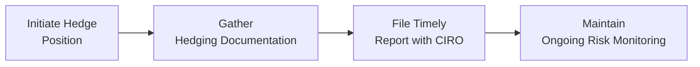

## 4.7 CIRO Reporting Requirements for Hedging Exemptions

Hedging is one of those essential strategies in the futures market that can feel a bit like having an umbrella on a cloudy day: you hope you won’t need it, but you’ll be grateful to have it when the storm arrives. In the Canadian futures arena (and honestly, around the globe), regulators know this, too. They want to ensure that genuine hedges—often referred to as “bona fide hedges”—are recognized and treated differently from pure speculative trades. That’s where the Canadian Investment Regulatory Organization (CIRO) steps in, overseeing the rules for position reporting, margin relief, and legitimate hedging exemptions.

Below, we’ll look at how CIRO manages these reporting requirements and why meeting them is so crucial for market participants who rely on futures contracts to manage real-world risks. We’ll explore how firms can qualify for hedging exemptions, what is necessary to prove a bona fide hedge, and practical steps for getting (and staying) compliant. Plus, we’ll mix in a few personal reflections, like the time a friend of mine forgot to file their hedging exemption paperwork. Let’s just say, that’s a headache nobody needs.

  
### Why CIRO Cares About Bona Fide Hedging

CIRO, Canada’s new self-regulatory body for investment dealers and mutual fund dealers, is laser-focused on market integrity. If you think about it, a well-functioning marketplace requires clarity on who’s hedging and who’s purely speculating. Hedgers often get special treatment—like margin relief or position limit exemptions—because they’re using the futures market to offset real commercial or financial risks. Speculators, on the other hand, are typically trying to profit from correctly anticipating price changes in the futures market. Both roles are important, but they don’t always follow the same rulebook.

In the old days, the Investment Industry Regulatory Organization of Canada (IIROC) and the Mutual Fund Dealers Association of Canada (MFDA) oversaw these obligations separately. As of January 1, 2023, those entities amalgamated into CIRO. Now, if you need up-to-date requirements, you simply head over to [https://www.ciro.ca](https://www.ciro.ca). 

So, what happens if you’re a large agricultural firm trying to protect the value of your corn inventory, or you’re a bank hedging interest rate risk on a large loan portfolio? CIRO wants you to disclose your hedge as a hedge—not speculation—so it can appropriately monitor large positions. That way, your big position in futures doesn’t mistakenly alarm the regulator (or the broader market) as a purely speculative bet that might distort pricing.

  
### The Big Picture: Documentation, Intent, and Timely Reporting

Regulators generally try to keep things straightforward: if you can prove that your futures position is tied to a real-world exposure—think grain in a silo, an interest rate risk on a variable-rate loan, or even a currency exposure on an overseas transaction—then you can qualify for specialized treatment. Here are some important pillars:

• Documentation: You can’t just say, “I’m hedging.” You must demonstrate that there’s a valid underlying exposure. Some firms document this with inventory records, supply contracts, or risk management reports. Others might show trading tickets or financial statements that highlight the relationship between the futures contract and the underlying risk they’re managing.  
• Intent: There should be a written statement or affidavit clarifying that the primary purpose of the position is risk mitigation, not speculation. I know, you might be thinking, “But who’s going to believe a piece of paper?” Regulators do! They want a sworn or firm-authorized statement that codifies your plan.  
• Timely Reporting: Certain thresholds set by CIRO or the exchange (such as the Bourse de Montréal) require you to notify them promptly once your futures position crosses a specific size or limit. This is crucial. If you exceed that threshold and haven’t reported, you could face regulatory action.  

Remember, regulators can request evidence that your positions serve a legitimate hedge function. If the positions exceed normal hedging expectations or appear to deviate from your stated exposures, you should be prepared to explain how each contract correlates to a real underlying risk.

  
### Margin Relief and Position Limit Exemptions

The carrot at the end of the stick is that bona fide hedgers often get margin relief and the ability to hold positions bigger than the usual limits. This is because regulators understand that hedgers have offsetting exposures in the underlying cash market, thus carrying different risk characteristics than a speculator with the same size position.

For instance, an airline could hold large positions in crude oil futures to hedge jet fuel costs. If the airline can prove to CIRO that those positions serve to offset real fuel expenses, they might be allowed to bypass the standard position limit. Similarly, if you can document that your wheat inventory of, say, 1 million bushels matches your futures positions, you could get a margin requirement that is less than what a speculator would have to post.

From a risk manager’s perspective, this is a lifesaver. Proper approval for hedging status basically frees up capital, making it available for other corporate goals or short-term liquidity needs.

  
### Record-Keeping and Oversight

Not to get too personal, but I once worked with a treasurer who insisted that “just trust me!” was enough justification to get an exemption. In short: no, it’s not. The firm’s risk management department has to meticulously record each trade and how it relates to an underlying risk. Typically, risk oversight committees or CFO offices lean on frameworks like ISO 31000 to ensure robust risk governance. By structuring your hedge requests and approvals using widely recognized frameworks, you get a more transparent and audit-friendly paper trail.

  
### Filing with CIRO: A Quick Walkthrough

Below is a simple flowchart demonstrating a high-level process for reporting hedging positions to CIRO. This is not an official compliance checklist, but it might help you visualize the basic steps.

• Initiate Hedge Position: The hedge typically starts once you identify an underlying exposure (e.g., shipping costs, interest rate risk, commodity price risk).  
• Gather Hedging Documentation: Show your supply contracts, commercial invoices, or credit agreements. This step is where you compile evidence that your underlying position justifies your hedging activity.  
• File Timely Report with CIRO: Once you surpass a position threshold (or if your average daily position triggers a requirement), you file your hedging exemption request or notice.  
• Maintain Ongoing Risk Monitoring: Keep the documentation current, regularly check your hedge effectiveness, and be prepared for a random compliance check from CIRO.

  
### Consequences of Non-Compliance

So what if you blow off your responsibility to file? Or maybe you do file, but your records are half-baked? Well, CIRO has the authority to impose fines, increase margin requirements, or even force you to close a portion of your position if it believes you’re in violation of the rules. Such actions can be devastating for your hedging strategy, not to mention your corporate reputation.

In extreme cases, repeated non-compliance can attract even more severe penalties. Forced position liquidation can be crippling if it comes at a moment when you urgently need hedge protection. Trust me, you do not want to find yourself on the wrong side of that conversation with your board or your CFO.

  
### Best Practices for Meeting CIRO Reporting Requirements

• Keep Thorough Records: Document every hedge thoroughly, maintaining an easily accessible archive for regulators. Consider timestamps, sign-offs, and references to the associated cash market exposure.  
• Build Automated Processes: Many firms use advanced reporting systems that trigger an internal alert whenever positions approach a certain threshold. Automation can help prevent oversights, especially if your firm engages in frequent or high-volume futures trading.  
• Align with Recognized Risk Frameworks: ISO 31000 can be an excellent blueprint for risk management, ensuring consistent language and procedures across the firm.  
• Talk to Your Clearing Broker: Your brokerage often has invaluable insights on maintaining compliance, especially if you’re near position limits. They might also help you navigate the Bourse de Montréal’s rules alongside CIRO’s.  
• Stay Updated: Markets evolve, and so do CIRO rules. Regularly check the official rule book at [https://www.ciro.ca](https://www.ciro.ca), the Bourse de Montréal’s guidelines at [https://www.m-x.ca](https://www.m-x.ca), and the Canadian Securities Administrators (CSA) website at [https://www.securities-administrators.ca](https://www.securities-administrators.ca) for new or amended regulations.

  
### Common Hedging Scenarios

Sometimes, it’s easier to understand the mechanics of hedging exemptions with a real-world example.

• Commodity Producer: Think of a farmer with a large corn harvest due in six months. The farm might short corn futures to lock in a favorable price. Once those short positions cross a reporting threshold, they inform CIRO that the position is purely hedging future production (they can show planting acreage, expected yield reports, etc.).  
• Manufacturer: A manufacturer sources aluminum from global markets and is worried about an upswing in prices. By going long aluminum futures, the manufacturer can offset the price risk. The regulatory filing would show purchase orders or existing inventory needs as the underlying exposure.  
• Financial Institution: A bank with a large portfolio of variable-rate mortgages might take interest rate futures or swap positions to hedge the risk of rising rates. The underlying risk is found in those mortgages, so the documentation includes loan data, interest schedules, and so forth.

Each example underscores how important it is to align the quantity in your futures position with your actual commercial or financial interest. Overhedging beyond your real needs can raise “speculation” flags with CIRO.

  
### Frequently Asked Questions

Q: What if my position size changes because my inventory changes?  
A: You typically want to adjust your futures position to match changes in your real-world exposure. If you buy additional inventory, you might hedge more. If you sell or retire part of your inventory, you might close out some futures positions. Keep your records current and let CIRO know if there’s a significant shift.

Q: Can I qualify for a partial hedging exemption if part of my position is speculative?  
A: Potentially, yes. You might apply for an exemption for the portion that’s a legitimate hedge. The other portion would likely be subject to normal margin rules.

Q: Do I need a special compliance team to handle all this reporting?  
A: Smaller firms sometimes manage with one or two dedicated staff members, especially if they follow robust templates and guidelines. Larger organizations often have entire risk departments. Whichever route you choose, ensure you have a systematic way to track, review, and file your positions with CIRO.

  
### Staying One Step Ahead

Unlike pure speculation—where the goal is usually to gain profit from price changes—hedging is meant to mitigate risk already present in your business or portfolio. Canadian regulators want to identify and support legitimate hedgers, ensuring that these traders can continue to protect themselves without triggering unwarranted concerns about excessive speculation.

To wrap it up, you’ll want to remember those three major pillars: keep impeccable documentation, prove your intent to hedge, and file your reports on time. Get it right, and you’ll benefit from margin relief, position limit exemptions, and, most importantly, a drastically reduced slice of risk in your day-to-day operations. Get it wrong, and you might face forced liquidation of your positions or stiff penalties. But relax—most folks find that once they establish a consistent process, compliance becomes second nature.

By balancing clarity with thorough record-keeping and a healthy dose of straightforward communication, you’ll stay on CIRO’s good side and keep your own risk strategies aligned with both business goals and regulatory mandates.

### Additional Resources

• CIRO Rule Book: [https://www.ciro.ca](https://www.ciro.ca)  
• Bourse de Montréal Rule Book and Position Limits: [https://www.m-x.ca](https://www.m-x.ca)  
• CSA National Instruments on Derivatives Reporting: [https://www.securities-administrators.ca](https://www.securities-administrators.ca)  
• Guidance on Risk Management Frameworks (ISO 31000): [ISO.org](https://www.iso.org/iso-31000-risk-management.html)  

Consulting these resources regularly will help you stay on top of evolving standards and maintain best practices in your hedging program.

## Sample Exam Questions: Mastering CIRO Hedging Exemption Reporting



### Which of the following is considered a key requirement for qualifying for a hedging exemption under CIRO rules?

- [x] Documenting the underlying exposure tied to the positions
- [ ] Having multiple brokerage accounts
- [ ] Issuing unsworn verbal statements for each transaction
- [ ] Filing after positions have been closed

> **Explanation:** CIRO expects clear documentation of the hedged underlying interest. Verbal statements or unsubstantiated claims are insufficient.

### Which best describes the main benefit of a bona fide hedging exemption?

- [x] It allows larger positions or reduced margin because the position offsets a real exposure
- [ ] It permits trading with no margin requirements at all
- [ ] It guarantees no reporting thresholds will apply
- [ ] It eliminates the need for any regulatory interaction

> **Explanation:** Under a bona fide hedge, hedgers can hold bigger positions or enjoy margin relief because the futures position neutralizes an actual underlying risk.

### Which entity primarily oversees the reporting of futures hedging positions in Canada?

- [x] CIRO
- [ ] The U.S. Commodity Futures Trading Commission (CFTC)
- [ ] The Office of the Superintendent of Financial Institutions (OSFI)
- [ ] The World Bank

> **Explanation:** CIRO (the Canadian Investment Regulatory Organization) is the national self-regulatory body overseeing futures reporting and hedging exemptions in Canada.

### To avail a position limit exemption, which component is essential?

- [x] A valid, documented hedging rationale
- [ ] Speculative assumptions about future market prices
- [ ] Exposure that is not connected to any real assets
- [ ] A single email notice to the regulator with no proof of intent

> **Explanation:** You must present a legitimate hedging rationale with solid supporting documents. Speculative components won’t qualify for an exemption.

### What could happen if a firm fails to properly file hedging reports once thresholds are exceeded?

- [x] Regulatory fines, forced liquidation, or stricter margin requirements
- [ ] Automatic renewal of hedging exemptions
- [x] Potential disqualification from future exemptions
- [ ] Unlimited access to all commodity markets

> **Explanation:** Failing to comply can lead to tough consequences like fines, forced liquidation, or even being barred from future exemptions. It also risks increased scrutiny by regulators.

### A best practice to maintain compliance with CIRO’s reporting requirements is:

- [x] Automating alerts to notify your team when positions near reporting thresholds
- [ ] Splitting positions across multiple brokers to avoid detection
- [ ] Neglecting exposure documentation to simplify record-keeping
- [ ] Filing reports only at year-end

> **Explanation:** Proactive alerts and timely filings help ensure positions are reported when they reach thresholds. Hiding or delaying reporting is a violation of CIRO rules.

### Which of the following would best illustrate a bona fide hedge?

- [x] A wheat farmer shorting wheat futures to protect against falling prices
- [ ] A day trader going short for speculative profit
- [x] An airline going long on crude oil futures to protect against rising fuel costs
- [ ] Purchasing futures in unrelated commodities for diversification

> **Explanation:** True hedges reflect an offsetting exposure in the real world (like wheat inventory or a potential spike in jet fuel expenses). Random speculation or unrelated positions do not qualify.

### CIRO’s oversight aims to distinguish between hedgers and speculators because:

- [x] Hedgers reduce their actual business risk, while speculators assume market risk
- [ ] Both must file the same type of paperwork with the same deadlines
- [ ] Hedgers always lose money, but speculators always gain money
- [ ] Speculators have no impact on market liquidity

> **Explanation:** Hedgers use futures to mitigate real business risks, while speculators rely on taking on market risk for potential profit. CIRO’s reporting ensures each party is treated fairly.

### Which is a key difference in margin requirements between recognized hedgers and speculative traders?

- [x] Hedgers may qualify for lower margin if they can prove an offsetting risk
- [ ] Hedgers are obligated to post 100% of the contract value as margin
- [ ] Speculators never pay margin
- [ ] Both groups must post identical margins with no exceptions

> **Explanation:** Regulators often grant margin relief to verified hedgers, recognizing that their net overall risk is reduced by their underlying market exposure.

### True or False: Failing to comply with CIRO’s reporting requirements can result in forced liquidation of futures positions.

- [x] True
- [ ] False

> **Explanation:** Yes, non-compliance can lead to forced liquidation, fines, and potentially more severe penalties if the violation continues. It’s crucial to stay on top of reporting obligations.


