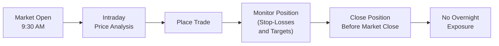
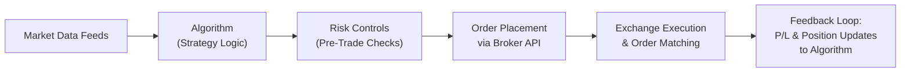

## 5.2 Types of Speculators

Speculating in futures markets can feel, well, exhilarating—or maybe a bit terrifying—depending on your perspective. Let’s face it: you’re putting money on the line in a fast-moving arena. But the truth is, “speculator” isn’t necessarily a dirty word. Speculation provides essential liquidity to markets, helping farmers hedge corn prices and gold producers stabilize revenues, among countless other impacts. You might already have a sense of what “speculating” entails if you’ve placed a bet on a sporting event or joined a friendly poker game—though, obviously, the financial markets can be far grander in scale and complexity. In this section, we’ll explore the various types of speculators in the futures markets, focusing on their time horizons, trading styles, risk tolerances, and capital requirements. We’ll also reference relevant Canadian regulations—particularly the role of the Canadian Investment Regulatory Organization (CIRO)—to highlight the guidelines shaping speculative activities. By the end, you’ll have a broader perspective on who the main players are, how they operate, and the unique advantages and challenges each style of trading entails.

---

Um, so, let’s begin by defining the four broad categories of speculators:

• Intraday Traders (Day Traders)  
• Swing Traders (Short-Term)  
• Position Traders (Long-Term)  
• Algorithmic Traders  

While these categories overlap in real-world practice, they represent distinct approaches in everything from holding periods to research techniques. Let’s jump in.

---

### Intraday Traders (Day Traders)

Have you ever met that friend who’s glued to a trading screen all day, placing rapid-fire orders and closing out everything by the market’s closing bell? That’s your typical intraday trader—or day trader. They thrive on short-term price fluctuations, sometimes holding a position for as little as a few seconds or minutes. The fundamental idea is to avoid overnight risk, meaning they don’t hold trades past the end of the trading session.

• **Time Horizon**: Seconds, minutes, or hours.  
• **Risk Tolerance**: Generally high, because rapid movements and leverage can amplify gains—or losses.  
• **Analytical Methods**: Mostly technical analysis, focusing on chart patterns, order flow, and intraday momentum signals.  
• **Capital Requirements**: Vary significantly—some day traders have small accounts but use high leverage, though they risk more frequent margin calls. Others have substantial capital and attempt to scalp small profits multiple times a day.  
• **Advantages**: 
  - Potential for quick profits if you’re nimble.  
  - No overnight exposure, which can reduce unexpected gaps (though not always, given certain cross-market factors).  
- **Disadvantages**:  
  - Transaction costs (commissions, exchange fees, potential slippage) can add up.  
  - Psychic toll: Many find day trading extremely stressful.  

A friend of mine tried day trading crude oil futures right after finishing university. She got lured in by the big daily price swings. She quickly realized that the emotional roller coaster—and the need for 24/7 market vigilance—just wasn’t for her. She closed out her positions every afternoon and basically didn’t breathe until after the closing bell.

Many intraday traders in Canada and around the world rely on real-time charting software and direct market access. If you’re intrigued by day trading, do consider that Canadian regulations require robust suitability assessments for derivative strategies. CIRO enforces margin requirements designed to keep risk in check and to ensure that traders have the necessary capital to back their trades. So, if you plan to day trade futures, you’ll need to keep a close eye on your margin usage—and be prepared for margin calls if the market moves against you.

Below is a simple flow diagram illustrating a typical intraday trading cycle:

In this diagram, you can see that intraday traders actively manage trades during market hours, monitoring real-time data continuously, and exit before the close.

---

### Swing Traders (Short-Term)

Next up are the swing traders. These folks are a bit more chilled out compared to day traders—though “relaxed” can be an overstatement if markets are swinging wildly. Swing traders typically hold positions for a few days or weeks, capturing short- to medium-term price moves. They might buy a wheat futures contract if they expect a short-term price increase due to weather events or a sudden export ban. Then they’ll hold on until they believe the price swing has run its course.

• **Time Horizon**: Several days to a few weeks.  
• **Risk Tolerance**: Moderate to high. Swing traders face overnight and weekend risks, but they generally manage position sizes more conservatively than some intraday scalpers.  
• **Analytical Methods**: A mix of technical and fundamental analysis. While chart patterns and momentum indicators still matter, swing traders often pay closer attention to supply/demand data, seasonal trends, and macroeconomic indicators.  
• **Capital Requirements**: Vary based on the contract(s) traded. Commodity futures, for instance, might have different margin requirements than equity index futures.  
• **Advantages**:  
  - Less stressful than day trading, at least in theory—traders aren’t glued to the screen all day.  
  - Potentially lower transaction costs due to fewer trades.  
- **Disadvantages**:  
  - Overnight risk becomes a factor; a big overnight move can erode your margin unexpectedly.  
  - Requires discipline to hold positions and not exit prematurely if the market experiences a minor retracement.  

One of the perks of swing trading is the chance to combine fundamental catalysts (like earnings announcements for equity index futures, or an OPEC meeting for crude oil) with technical signals. For example, you might notice that a commodity is approaching a strong support zone on the price chart. At the same time, the fundamentals are pointing toward increased demand. This synergy could create a prime swing-trading setup.

---

### Position Traders (Long-Term)

Position traders are, in many ways, the slow and steady types. They maintain futures positions for a month, a season, or even longer. Often, these traders have a deep understanding of the underlying market fundamentals: seasonal harvest cycles for agricultural products, central bank policies for interest-rate-related futures, or global macroeconomic trends for equity index futures. 

• **Time Horizon**: Multiple weeks to months (potentially beyond).  
• **Risk Tolerance**: Moderate to high, although many position traders have the capital reserves to ride out significant price fluctuations.  
• **Analytical Methods**: Heavily reliant on fundamental analysis—think supply and demand, macro data, currency fluctuations, trade policies, inventory reports, and so on. Technical analysis may still play a role in timing entry or exit points, but it’s often secondary to the core fundamental view.  
• **Capital Requirements**: Generally higher. Holding futures over extended periods can lead to margin calls if the market moves against you temporarily.  
• **Advantages**:  
  - Potentially large moves can be captured if the trader’s fundamental thesis proves correct.  
  - Less time-intensive on a day-to-day basis than day trading or short-term swing trading.  
- **Disadvantages**:  
  - Subject to extended overnight and weekend risk over a long period.  
  - Requires patience and sometimes a high tolerance for drawdowns before the market turns in your favor.  

Perhaps you heard about a pension fund manager who invests in interest rate futures to hedge or speculate on upcoming central bank moves. That’s position trading. They might hold substantial positions for months, waiting for, say, the Bank of Canada to adjust interest rates. If the position is leveraged, the potential for gains is significant—but so is the risk of missing the timing, especially if global conditions suddenly shift.

---

### Algorithmic Traders

Over the past couple of decades, the rise of algorithmic (or “algo”) trading has drastically changed the landscape. Algorithmic traders rely on computer models to execute trades automatically, often across multiple asset classes and markets. They may hold positions for seconds or longer, depending on the strategy.

• **Time Horizon**: Highly variable—some algo strategies are ultra-short-term (akin to high-frequency trading), while others might hold positions for days or longer.  
• **Risk Tolerance**: Varies widely. Some systematic funds aim for steady, low-volatility returns, while certain high-frequency strategies can be subject to extreme intraday volatility.  
• **Analytical Methods**: Computer-driven and quantitatively intense. Traders backtest strategies using historical data, then deploy algorithms that search for repeatable patterns or pricing inefficiencies.  
• **Capital Requirements**: Often significant, especially for high-frequency operations requiring advanced infrastructure, co-location with the exchange’s data center, and real-time data feeds.  
• **Advantages**:  
  - Can execute trades faster than any human, potentially exploiting small, fleeting opportunities.  
  - Systems can be diversified across many markets and strategies.  
- **Disadvantages**:  
  - Technological failures or unforeseen market anomalies can lead to significant losses in seconds.  
  - High cost of development and maintenance of the hardware/software infrastructure.  

If this is your cup of tea, you’ll probably be coding in Python or C++ or hooking up to a platform that does the heavy lifting—maybe using open-source backtesting libraries like “zipline” or “backtrader.” You’re going to have to pay special attention to exchange rules, especially in Canada. For instance, you’d want to ensure your algorithmic trading system complies with all CIRO guidelines regarding order handling, risk management, and real-time monitoring.

Below is a high-level diagram revealing how an algorithmic trading process might look:

In this flow, the algorithm continuously ingests new market data, compares it against the strategy logic, implements risk checks, and then places trades accordingly.

---

### Which Type of Speculator Are You?

Some traders find themselves exclusively day trading one asset class—like equity index futures—while others experiment across multiple styles or asset classes. For instance, you might day trade E-mini S&P 500 futures in the morning, then hold a small position trade in gold futures for a few weeks. As you refine your approach, you might dabble in algorithmic tools, or adopt a partially automated system that sets trailing stops on overnight positions.

Ensure your activities align with CIRO’s regulatory requirements around suitability and margin. For proprietary or professional traders, you might explore how your registration category can facilitate advanced strategies, including cross-asset arbitrage. CIRO’s official site—[https://www.ciro.ca/](https://www.ciro.ca/)—is an excellent resource for updated regulations, including margin requirements and best execution guidelines.

---

### Regulatory Environment and Best Practices

Speculating in Canada involves some unique considerations:

• **Suitability**: As per CIRO guidelines, investment dealers must ensure that clients trading in futures are using strategies aligned with their risk profile, financial situation, and investment objectives.  
• **Margin Requirements**: Futures trading is leveraged trading. Always keep an eye on your margin usage and the maintenance requirements set by your broker and by the Bourse de Montréal for Canadian futures.  
• **CIRO and Bourse de Montréal**: The Bourse de Montréal is the primary exchange venue for trading equity, index, and certain commodity derivatives in Canada. Their educational resources—[https://www.m-x.ca/](https://www.m-x.ca/)—clarify contract specs, margin rules, and regulatory updates.  
• **Consultation and Compliance**: If you’re a founder of a small hedge fund or running a proprietary trading desk, you’ll need to be on top of your compliance game. This includes trade reporting under the various regulations that might apply to your firm.  

---

### Practical Examples of Trades

1. **Intraday Example (Equity Index Futures)**  
   - Let’s say you’re watching the S&P/TSX 60 futures contract. You notice a strong bullish momentum right after an economic data release. You go long at 10:03 AM and exit at 10:45 AM after reaching a short-term price target.  

2. **Swing Example (Agricultural Futures)**  
   - You believe soybean prices will rebound due to new export demand from Europe. You buy soybean futures at 1,350 cents/bushel and hold for a week. Once the price hits 1,400, you lock in your profit.  

3. **Position Example (Interest Rate Futures)**  
   - You expect the Bank of Canada to maintain lower rates for an extended period. You go long on Canadian 10-year bond futures. The position might last months, but you watch macro data and keep an eye on margin usage.  

4. **Algorithmic Example (Statistical Arbitrage)**  
   - Your model identifies small pricing discrepancies between two correlated futures contracts, say crude oil and refined petroleum product futures. You write an algo that buys one and sells the other automatically when the spread hits a certain threshold.  

---

### Table: Comparison of Speculator Types

| Category       | Holding Period           | Key Analysis      | Risk Tolerance     | Typical Advantages                               | Typical Disadvantages                  |
|----------------|--------------------------|-------------------|--------------------|--------------------------------------------------|----------------------------------------|
| Intraday       | Seconds to hours         | Technical         | High               | Quick potential gains, no overnight risk         | Stressful, high transaction costs      |
| Swing          | Days to weeks           | Tech + Fundamental| Moderate to High   | Capture mini-trends, less screen time than day   | Overnight/weekend risk                |
| Position       | Weeks to months/longer   | Fundamental (+Tech)| Moderate to High  | Potential for large moves, less frequent trading | Sustained risk exposure               |
| Algorithmic    | Seconds to days (variable)| Quantitative      | Variable           | Automated, constant scanning for patterns        | Tech complexity, high infra costs      |

---

### Developing Expertise in Specific Asset Classes

Many successful speculators find a niche—trading only crude oil futures, for example—where they cultivate a deep understanding of supply dynamics (OPEC cuts, storage capacity at Cushing, Oklahoma, etc.). Others employ multi-asset strategies, pivoting between metals, energy, currencies, and equity indices. Expert knowledge can give you an edge in anticipating market-moving events, seasonal variations, or anomalies.

---

### References and Resources

• **CIRO Registration Categories**: [https://www.ciro.ca/](https://www.ciro.ca/)  
• **Bourse de Montréal (MX)**: [https://www.m-x.ca/](https://www.m-x.ca/)  
• **“Market Wizards” by Jack D. Schwager** – Fascinating interviews with traders from different backgrounds and styles.  
• **Interactive Brokers’ Trader Workstation** or **TD Advanced Dashboard** – For advanced charting and analytics across multiple futures markets.  
• **Open-source Python libraries** like **zipline** or **backtrader** for algorithmic traders who want to backtest strategies.

---

### Glossary

• **Intraday Trader**: Opens and closes futures positions within the same trading day, avoiding overnight risk.  
• **Swing Trader**: Aims to hold trades for a few days or weeks to capture price swings.  
• **Position Trader**: Retains positions for weeks or months, betting on fundamental market changes.  
• **Algorithmic Trader**: Relies on computer-driven strategies to identify and execute trades, often using advanced software.  
• **Suitability**: Regulatory principle requiring that a speculator’s trading strategy matches their financial situation and risk appetite.  
• **Multi-Asset Strategy**: Involves trading different asset classes (equities, commodities, currencies, etc.) to diversify positions.  
• **Arbitrage**: Profiting from temporary price discrepancies in different markets or instruments.  

---

### Conclusion and Key Takeaways

So, there you have it—four major categories of speculators in the futures market, each with its own mindset, methodology, and risk profile. Whether you’re day trading stock index futures, riding macro trends in the bond market, or coding an arbitrage strategy for oil/gas spreads, it all comes down to matching your strategy with your personal risk tolerance, your capital resources, and the regulatory guidelines from CIRO. 

Maybe you experiment with different approaches before you find your sweet spot. The important thing is to keep updating your knowledge, adapting to market evolution, and ensuring you remain within the boundaries of margin rules, regulatory requirements, and your own comfort level. Futures trading is risky, but it can also be an incredible vehicle for profit and an important means to shape your professional skill set in finance.

Good luck with your speculative ventures. Just remember: every trader eventually gets knocked down by the market. The question is whether you’ll adapt and come back stronger.

---

## Sample Exam Questions: Types of Speculators in Futures Trading



### Which type of speculator typically avoids overnight risk by closing all positions before the market closes?

- [x] Intraday Trader (Day Trader)
- [ ] Swing Trader
- [ ] Position Trader
- [ ] Algorithmic Trader

> **Explanation:** Intraday traders, also known as day traders, open and close their futures positions within the same day, avoiding overnight risk.

### Which strategy involves holding positions for a few days to weeks, aiming to capture short- to medium-term price movements?

- [ ] Intraday trading
- [x] Swing trading
- [ ] Position trading
- [ ] High-frequency trading

> **Explanation:** Swing traders look to capitalize on short- to medium-term market swings over several days to a few weeks.

### Which group relies heavily on fundamental market drivers such as supply/demand and macroeconomic conditions for long-term positions?

- [ ] Intraday Traders
- [ ] Swing Traders
- [x] Position Traders
- [ ] Arbitrage Funds

> **Explanation:** Position traders tend to hold positions for extended periods, basing their decisions primarily on fundamental market dynamics.

### In Canada, which regulatory body oversees margin usage and suitability requirements for futures traders?

- [ ] Canada Revenue Agency (CRA)
- [ ] The Bank of Canada
- [x] Canadian Investment Regulatory Organization (CIRO)
- [ ] Financial Conduct Authority (FCA)

> **Explanation:** CIRO is the self-regulatory organization in Canada responsible for overseeing investment dealers and margin/suitability requirements after the amalgamation of IIROC and MFDA.

### Why might algorithmic traders have significantly higher infrastructure costs?

- [ ] They typically hire more staff.
- [x] They require specific hardware/software to execute high-speed trades and manage real-time data.
- [ ] They pay extra fees for extended daily market hours.
- [ ] They need to buy multiple exchange memberships to trade.

> **Explanation:** Algorithmic trading often demands powerful servers, specialized software, co-location, and rapid data feeds, all of which can be quite costly.

### Which of the following is a key disadvantage faced by intraday traders?

- [x] High transaction costs due to frequent trades
- [ ] Large overnight gaps
- [ ] Inability to capitalize on short-term price moves
- [ ] No margin requirements

> **Explanation:** Intraday traders usually place numerous trades in a single session, incurring multiple commissions and fees, which can add up quickly.

### A long-term speculator who anticipates changes in central bank policy and holds futures positions for months would be best described as:

- [ ] Intraday Trader
- [ ] Swing Trader
- [x] Position Trader
- [ ] High-Frequency Trader

> **Explanation:** Position traders maintain their exposure for longer periods, often influenced by macroeconomic trends and central bank policies over weeks or months.

### Which type of trader is most likely to blend both technical analysis (price charts) and fundamental analysis (economic data) over a medium-term horizon?

- [x] Swing Trader
- [ ] Intraday Trader
- [ ] Algorithmic Trader
- [ ] High-Frequency Trader

> **Explanation:** Swing traders commonly employ both technical and fundamental tools to capture price moves spanning several days or weeks.

### What is a potential advantage of being a position trader?

- [x] Potentially large gains if a fundamental trend runs in their favor
- [ ] No risk exposure during weekends
- [ ] They never have to post margin
- [ ] Gains are always guaranteed

> **Explanation:** Position traders stand to benefit significantly if their fundamental outlook on a market proves correct over an extended period.

### True or False: Algorithmic traders only hold positions for a few seconds and can never hold longer-term positions.

- [ ] True
- [x] False

> **Explanation:** Algorithmic trading strategies can vary widely. While many algo traders are short-term or high-frequency, others hold longer-term positions based on systematic signals.


