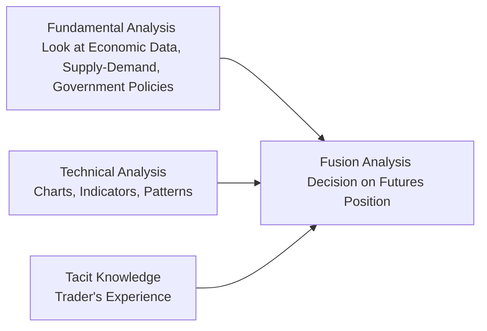

## 5.3 Price Forecasting Techniques (Fundamental Analysis, Technical Analysis)

Let’s talk about one of the most fascinating aspects of trading futures: predicting where prices might be headed. We’ve all dreamed of foreseeing tomorrow’s prices (or next week’s, next month’s…) with precise crystal-ball accuracy. Um, well, that’s the dream, right? If life were so simple! Still, market participants deploy various price forecasting methods, and two of the most prominent are fundamental analysis and technical analysis. Each approach has its strengths, weaknesses, sometimes surprising quirks, and—believe it or not—can even be used together to form a more holistic market view.

In this section, we will:  
• Discuss fundamental analysis as it applies to futures speculation.  
• Explore common macro and micro drivers, such as central bank policies, supply-demand data, and commodity-specific triggers like seasonal effects.  
• Examine technical analysis, including popular indicators and charting techniques used by speculators in Canada and abroad.  
• Highlight “fusion” approaches, where traders combine fundamental and technical tools to confirm or refute signals.  
• Walk through real-world examples and personal experiences.  
• Offer references to Canadian data sources, regulatory considerations, and advanced analytic tools.  

Our main focus: Provide you with an accessible, slightly informal, yet in-depth overview that feels like you’re chatting with a friend who just happens to be fascinated by the subtle (and sometimes not-so-subtle) dance between financial markets and human psychology.

---

### Why Price Forecasting Matters for Futures Speculation

Futures contracts—whether they’re based on commodities like crude oil or corn, or financial instruments like government bonds or equity indexes—present opportunities for profit through speculative positions. If you’re correct about the future direction of price (up or down), you can reap significant rewards through a leveraged position. But, of course, if you’re wrong, losses can accumulate fast. That’s why many speculators develop or adopt forecasting models, drawing from a combination of fundamental and technical analysis.

Speculators can be professional or retail—small or large. Some rely on highly sophisticated data streams with algorithmic screening, while others trust a more intuitive approach honed by years of experience. Regardless of the setup, the goal is the same: to get an “edge” in anticipating price movements before they happen.

---

### A Quick Personal Anecdote About Predictions

At one point, I recall talking to a seasoned commodity trader who used to say, “If I can forecast how many coffee beans I’ll need when I wake up on a Monday morning, I can probably forecast coffee futures—until the next news headline hits.” He was joking, kind of, because he knew that unexpected developments—like geopolitical tensions, natural disasters, or surprising policy announcements—can reshuffle the deck instantly. Still, that didn’t stop him from analyzing every supply-demand chart he could find or checking open interest levels on coffee futures. And guess what? He was right a fair bit more often than random chance. That’s the purpose of forecasting techniques: tip your probabilities in your favor.

---

### Fundamental Analysis at a Glance

Fundamental analysis involves evaluating all sorts of economic and financial factors that might influence the future price of an underlying asset. For futures, that can mean focusing on production and consumption patterns (for commodities), or central bank policy (for interest rate futures), or consumer spending trends (for equity index futures). The key assumption is this: eventually, prices will align with true “fair value” based on supply-demand and macro forces. Of course, short-term fluctuations might be erratic, but the broad “over/undervalued” comparisons drive the long-run trend.

#### Macro Indicators: The Bigger Picture

One of the first things many speculators do is watch macroeconomic data points—think GDP growth, unemployment rates, inflation numbers, or trade balances. For example, if you anticipate that Canada’s GDP growth is poised to surge, you might expect that the Bank of Canada could raise interest rates to cool inflation, causing interest rate futures to move in a predictable direction. However, it’s rarely just one data point that matters; it’s usually a web of factors such as consumer confidence, new housing starts, and corporate earnings that help form a broad picture.

Common drivers in interest rate futures (like Canadian Government Bond futures):  
• Central bank policy decisions from the Bank of Canada.  
• Inflation and CPI data.  
• Employment reports (e.g., job creation, wage growth).  
• Market risk sentiment (when times are uncertain, bond futures are often in higher demand).  

#### Commodity Futures: Supply-Demand Dynamics

Let’s shift gears to the commodity world. If you’re speculating on crude oil futures, you might keep tabs on how many barrels are in global or Canadian storage, how OPEC+ is adjusting its production quotas, and whether Canada’s oil sands are ramping up output or facing regulatory constraints. Obviously, weather events, geopolitical tensions, currency fluctuations, and local demand can also shift the supply-demand balance. For agricultural commodities—corn, wheat, soybeans—factors like seasonal planting, harvest yields, climate events (droughts, floods), and even shipping constraints become extremely relevant.

Natural Resources Canada (https://natural-resources.canada.ca/) is a great place to dig into commodity data, especially if you’re dealing in the energy or mining sectors. Then there’s the U.S. Energy Information Administration (EIA) for broader North American data sets. And don’t forget farmland statistics and trade reports that might be relevant when you sense the next big shift in Canadian wheat yields or canola production.

#### Government Policies and Currency Trends

Sometimes, government actions can drastically reshape market expectations. For instance, if the federal government introduces a major subsidy for green energy, it may indirectly affect oil futures by dampening long-term demand estimates. Alternatively, a change in export tariffs for wheat might squeeze supply in domestic markets, pushing futures prices upward. Currency fluctuations—especially the relationship between the Canadian dollar and the U.S. dollar—are also significant. A strong CAD might reduce the competitiveness of Canadian exports, lowering commodity prices domestically. Conversely, a weaker CAD can bolster exports and raise commodity benchmark prices in Canada.

---

### Technical Analysis: Forecasting Through Charts and Indicators

Now let’s talk about technical analysis. Technical analysis revolves around the idea that price movements reflect overall market psychology, and these movements often form patterns that repeat over time. The focus is on price charts, trading volume, support/resistance levels, and various indicators designed to glean insights from past data to predict future behavior.

A fundamental premise is that “the market discounts everything.” In other words, any relevant fundamental information is presumably “baked into” the price. The next question is, have we exhausted bullish or bearish momentum, or is there more runway for a certain trend?

#### Common Technical Tools

1. Moving Averages (MA):  
   • A moving average simply calculates the average of past prices (usually the closing prices) over a specific period (e.g., 20-day, 50-day, or 200-day).  
   • Traders watch for “crossovers”—for instance, a short-term moving average crossing above a long-term moving average (sometimes called a “golden cross”), which can signal bullish momentum.  

2. Relative Strength Index (RSI):  
   • The RSI oscillates between 0 and 100 and aims to identify overbought (above 70) or oversold (below 30) conditions.  
   • If RSI indicates an overbought market, some speculators might plan to short the futures contract, expecting a price pullback.  

3. MACD (Moving Average Convergence Divergence):  
   • Tracks the momentum of price by comparing two different exponential moving averages.  
   • Traders look for a MACD line crossing above or below its signal line, often interpreting these crossovers as buy or sell signals.  

4. Trendlines and Support/Resistance:  
   • Drawing lines on a chart might seem simplistic, but horizontal or diagonal support/resistance lines can be psychologically significant in markets.  
   • A “breakout” above a major resistance level can trigger new buyers to jump in, further propelling the price upward.  

5. Candlestick Patterns:  
   • Many speculators track well-known candlestick formations such as “hammer,” “doji,” or “engulfing” patterns to read short-term turning points in price sentiment.  

6. Volume Analysis:  
   • Volume can confirm the strength of a price move. A breakout on high volume tends to be viewed as more “convincing” than one on light volume.  

#### Leading vs. Lagging Indicators

It’s also important to note that some technical indicators are considered “leading,” meaning they try to predict future price movements (e.g., RSI might warn of an overbought condition before a price drop), while others are “lagging,” meaning they confirm trends after they’re in play (e.g., moving averages typically confirm a trend once it’s already formed). Leading indicators can be more prone to false signals, while lagging indicators might protect you from “choppy” trades but offer later entries and exits.

Below is a simple illustration (in Mermaid format) showing how fundamental and technical approaches can feed into the same decision-making process for a futures speculator:

---

### Fusion Analysis: Merging Fundamentals and Technicals

Many speculators do a sort of “fusion analysis” by checking charts after reading macro reports—or vice versa. For example, if your fundamental research suggests that crude oil demand is about to jump due to a robust global economic recovery, you might still wait for a technical breakout signal to confirm that buyers are indeed stepping in. Or you might notice that a commodity price is forming a bullish technical pattern, but you’ll check fundamental supply data to make sure there’s some supportive reason behind it.

Let’s say you’re analyzing wheat futures. You anticipate a shortage in global supply due to adverse weather in a major producing region, and your fundamental analysis indicates prices should rise. Next, you check the chart and see that the 50-day moving average has just crossed above the 200-day moving average on high volume. Two big green lights? That might be your cue to go long on wheat futures. This combined approach can shore up a trader’s conviction to hold a position.

---

### Practical Example: Seasonal Commodity Analysis

You may have heard about seasonality in commodities—for instance, natural gas demand often spikes in winter when heating requirements rise, or gasoline demand climbs in summer due to peak driving season. Now, fundamental analysis might point to a typical seasonal jump in demand, but what if the technical chart shows unusual selling pressure? Maybe there’s an oversupply that fundamental data hasn’t fully factored in yet, or the chart reflects market skepticism about future consumption. A savvy speculator would reconcile these differences: are the fundamentals “wrong,” or is the chart missing an angle? Usually, it’s somewhere in between, and that’s precisely where opportunities can be found.

---

### Canadian Considerations

In Canada, professional speculators or investment dealers must comply with the rules set forth by the Canadian Investment Regulatory Organization (CIRO), which now oversees what were historically the domains of IIROC and the MFDA. Keep in mind:

• CIRO is the national self-regulatory body (https://www.ciro.ca).  
• It monitors trading activities for fairness, ensuring that speculation and hedging in futures adhere to margin guidelines, reporting requirements, and other conduct obligations.  
• Professional traders frequently rely on real-time charting software, data feeds, and specialized analytics—some from major providers like Bloomberg or Refinitiv, while others use open-source solutions like TA-Lib (https://github.com/TA-Lib/ta-lib) in Python or data from the Bank of Canada (https://www.bankofcanada.ca/) for interest rate releases.  

Ultimately, you can’t just rely on gut instinct alone. The modern futures speculator usually juggles robust data flows, advanced software, compliance checks, and an effective forecasting methodology—whether that leans fundamental, technical, or a fusion of both.

---

### Putting It All Together: A Step-by-Step Example

1. Start with Macro Fundamentals:  
   Suppose you’re considering a trade in 10-Year Government of Canada Bond futures. You see the Bank of Canada’s recent policy statement hints at possible interest rate hikes due to rising inflation. This fundamental signal suggests bond prices might weaken (yield goes up, bond price goes down).

2. Drill Down on Technical Signals:  
   You pull up a daily chart for the 10-Year Bond futures. A quick check shows a downward trend: the short-term moving average (50-day) is below the long-term moving average (200-day). MACD is below the signal line—another sign of bearish momentum.

3. Evaluate Key Support/Resistance Levels:  
   The chart indicates a significant support level near a specific price (let’s say 118.00), tested multiple times in the past few months. If price breaks below that, it could accelerate the bearish move.

4. Combine Signals:  
   The fundamental outlook (interest rates likely to rise) aligns with the technical outlook (downward-trending chart). This combination might encourage you to take a speculative short position.

5. Execute and Monitor:  
   You then set up your trade, watch for additional news (like inflation reports or GDP updates), and keep an eye on technical indicators. You’d also define your exit strategy or determine where to place stop-loss orders in case the market moves against you.

6. Adjust Strategy as Needed:  
   If, for any reason, new data suggests that the Bank of Canada may be cautious about raising rates faster than expected, you might reevaluate your short position. Or, if you see a bullish reversal pattern forming on the chart, you could consider exiting your trade or even flipping to a long position—depending on your trading plan.

This, in a nutshell, is how you can weave fundamental and technical analysis together to guide decisions in futures trading.

---

### Glossary

• **Fundamental Analysis:** A method of evaluating an asset (like a commodity or a financial contract) by examining macroeconomic and sector-specific factors to estimate its intrinsic or “fair” value.  
• **Technical Analysis:** A method of forecasting price movements by analyzing historical market data, such as price, volume, momentum, and chart patterns.  
• **Moving Averages (MA):** A mathematical technique to smooth out price data by calculating an average of prices over a specified period, updating continuously.  
• **RSI (Relative Strength Index):** An oscillator that measures the speed and change of price movements, labeling them as overbought or oversold on a scale from 0 to 100.  
• **MACD (Moving Average Convergence Divergence):** A momentum indicator that compares the relationship between two moving averages of an asset’s price.  
• **Supply-Demand Dynamics:** In commodities, price is driven by how much of the commodity is available versus how much the market needs—plus the capacity to transport, store, or trade it.  
• **GDP (Gross Domestic Product):** A measure of overall economic activity and output; influences central bank decisions that, in turn, affect interest rate futures.

---

### Additional Resources

• **Bank of Canada** (https://www.bankofcanada.ca/): For interest rate announcements, key economic indicators, and research on the Canadian economy.  
• **Natural Resources Canada** (https://natural-resources.canada.ca/): For energy, mining, and forestry data—useful in commodity futures analytics.  
• **TA-Lib** (https://github.com/TA-Lib/ta-lib): An open-source Python library for technical analysis indicators such as MA, RSI, MACD, and more.  
• **“Technical Analysis of the Financial Markets” by John J. Murphy:** Classic text on charting techniques, candlestick patterns, and common technical indicators.  
• **Bloomberg Terminal or Refinitiv Eikon:** Widely used professional platforms offering real-time data feeds, analytics, and powerful charting/analysis tools.  
• **CIRO** (https://www.ciro.ca): Canada’s national self-regulatory body, oversees investment dealers, mutual fund dealers, and market integrity.  

---

### Best Practices and Pitfalls

• **Stay Updated on Economic Releases:** Timeliness can be everything—missing even a single major announcement can cost you.  
• **Avoid Tunnel Vision:** Relying solely on fundamentals or solely on technical analysis can mean missing out on important signals.  
• **Watch for Confirmation:** Combining multiple signals (fundamental + technical + volume/spread data) can improve your odds of success.  
• **Risk Management:** Futures are leveraged products. If a forecast goes wrong—and sometimes it will—prudent stop-loss orders and risk limits can help preserve capital.  
• **Embrace Continuous Learning:** Markets evolve, new technologies rise, and correlations shift. Keep learning, practicing, and refining your approach.  

Anyway, forecasting is a bit like trying to read footprints on the beach when the tide is about to come in. You might spot some footprints that point you in the right direction, but you should always be prepared for changing conditions. Evaluating fundamental drivers, analyzing price patterns, and layering your own trading experiences together is often the recipe for more informed (though never foolproof) speculative bets in the futures arena.

---

## Sample Exam Questions: Price Forecasting Techniques in Futures Trading



### Which of the following best describes fundamental analysis in the context of futures trading?

- [x] Examining macroeconomic data, interest rates, and supply-demand factors.  
- [ ] Using moving averages and candlestick patterns to predict market reversals.  
- [ ] Analyzing weekly volume profiles and pivot points in price charts.  
- [ ] Focusing solely on recent market sentiment without broader economic data.  

> **Explanation:** Fundamental analysis looks at real-world drivers (like GDP growth, inflation, or commodity inventories) to determine the potential future value of a futures contract.

### Which of the following is a characteristic of technical analysis?

- [x] It uses historical price and volume data to predict future price movements.  
- [ ] It relies on fundamental reports and government policy announcements exclusively.  
- [ ] It dismisses all past data as irrelevant for future forecasting.  
- [ ] It avoids the use of indicators like RSI or MACD.  

> **Explanation:** Technical analysis focuses on patterns and trends derived from historical market data such as price and volume, often employing indicators like RSI and MACD to generate signals.

### A trader notices that central bank interest rate hikes are likely, and the short-term moving average is crossing below the long-term moving average on a bond futures chart. This is an example of:

- [x] Fusion analysis using both fundamental and technical signals.  
- [ ] Purely fundamental analysis.  
- [ ] A leading indicator approach without fundamentals.  
- [ ] A contradictory signal that should be ignored.  

> **Explanation:** The trader combines fundamental insights (rate hikes) with a technical signal (moving average crossover) to inform the decision—an example of fusion analysis.

### Which of the following is least likely to be considered a fundamental factor for commodity futures?

- [ ] Weather patterns affecting crop yields.  
- [ ] Government export restrictions.  
- [ ] Inventory levels and storage reports.  
- [x] MACD (Moving Average Convergence Divergence) crossovers.  

> **Explanation:** MACD crossovers are a technical indicator, not a fundamental factor.

### When a short-term moving average crosses above a long-term moving average, it is commonly referred to as:

- [x] A “Golden Cross.”  
- [ ] A “Death Cross.”  
- [ ] A leading indicator of oversold conditions.  
- [ ] A fundamental pivot point.  

> **Explanation:** A “Golden Cross” occurs when the short-term MA crosses above the long-term MA, considered bullish by many technical analysts.

### Which statement about the RSI (Relative Strength Index) is most accurate?

- [x] RSI values above 70 may indicate an overbought market.  
- [ ] RSI values above 70 always guarantee a price reversal.  
- [ ] RSI never provides false signals.  
- [ ] RSI is a fundamental metric for analyzing central bank policy.  

> **Explanation:** RSI is a momentum oscillator that flags overbought conditions above 70 and oversold conditions below 30; it does not guarantee reversals.

### A speculator wants to trade natural gas futures and looks at seasonal weather forecasts, inventory levels, and global economic growth data. This trader is primarily using:

- [x] Fundamental analysis.  
- [ ] A purely technical approach.  
- [ ] A contrarian volatility trading approach.  
- [ ] MACD divergence signals.  

> **Explanation:** Examining seasonal patterns, inventory data, and macroeconomic trends is characteristic of fundamental analysis.

### How do professional Canadian futures traders typically access real-time data and charting tools?

- [x] Through platforms like Bloomberg or Refinitiv, or open-source Python libraries such as TA-Lib.  
- [ ] By waiting for weekly print newspapers.  
- [ ] Solely by checking the daily official freeze price at the close.  
- [ ] By referencing year-end corporate financial statements alone.  

> **Explanation:** Most professional traders rely on real-time electronic data feeds and robust charting software to make timely decisions.

### Which best describes the rationale behind technical analysis?

- [x] Past market patterns and psychology are thought to reoccur in the future.  
- [ ] Market prices ignore everything that came before “today.”  
- [ ] The most accurate predictions come strictly from insider information.  
- [ ] Charts are only for novice traders with no professional usage.  

> **Explanation:** Technical analysis assumes market psychology and price action repeat themselves, making historical patterns relevant for future forecasts.

### True or False: “In futures speculation, combining both fundamental and technical analysis is often referred to as fusion analysis.”

- [x] True  
- [ ] False  

> **Explanation:** Many practitioners do indeed call the merging of fundamental and technical methods “fusion analysis,” using each approach to confirm or challenge signals.


