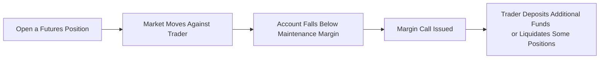

## 5.4 Risk Management Tools (Stop-Loss Orders, Margin Calls)

Picture this: You’ve just placed a speculative trade on crude oil futures, expecting a jump in oil prices because, well, your gut (and a few analysts on social media) told you so. By the next morning, you realize that your big bet is heading in the opposite direction. The market gapped down at the open, and suddenly your account reflects a bigger loss than you ever intended. If you’ve ever been in a similar situation, you probably understand the importance of having a game plan—specifically, a well-thought-out risk management strategy.

When discussing speculation with futures contracts (like the ones we talked about in earlier sections of Chapter 5), you need to keep in mind that leveraged products bring not only high potential returns but also large potential losses. This is especially true when markets move fast and unpredictably. So, how do professional (and even not-so-professional) traders sleep at night despite these wild swings? One word: risk-management.

Below, we explore two vital tools in your “trader’s survival kit”—Stop-Loss Orders and Margin Protocols (especially those dreaded Margin Calls). We’ll look at how these tools fit into an overall risk management framework that includes position sizing, diversification, and stress testing. Let’s get started.

---

Stop-Loss Orders

Stop-loss orders can be summed up in a single phrase: “Get me out if this goes wrong.” You decide on a price that you consider the “uncle point,” and if your futures contract hits that level, the stop-loss order is triggered—hopefully limiting or capping the damage to your account. Let me share a quick personal anecdote: once, I was convinced that soybean futures were making a major bottom. I placed a sizable position and then promptly set a stop-loss just below the next support level. Sure enough, the market tested that support, triggered my stop, and kicked me out of the position…only to reverse a day later and rally. Kind of annoying, right?

But here’s the thing: in that instance, the market could have gone even lower, leaving me with a bigger loss if I hadn’t placed that stop. That’s how stop-losses can save you from catastrophic losses, even if they occasionally stop you out prematurely. They act like your safety net—one you hope you never need, but are relieved to have when the floor falls out from under you.

1. Key Mechanisms of Stop-Loss Orders  
   • Price Trigger: You set a trigger price, and if the market trades at or through that level, your stop-loss becomes a market order (or sometimes a limit order if you specify) to close out the position.  
   • Slippage and Gap Risk: Just beware that if the market “gaps” against you—say from 101 down to 95 overnight—your stop might get filled at a much worse price than expected.  
   • Market vs. Limit: A stop-loss can trigger a traditional market order, where you get out at the best available price, or a stop-limit order, which sets a limit on the execution price but might fail to get you out if the market moves too quickly.  

2. Uses in Futures Speculation  
   • Protecting Profits: If your trade is already profitable, you might move your stop-loss higher (in a long position) or lower (in a short position) to lock in gains.  
   • Avoiding Emotional Trading: Let’s face it—when trades go against you, panic can set in. A preemptive stop-loss can help you avoid the temptation to “hope” for a turnaround and ride out big losses.  
   • Setting Risk Parameters: By placing your stop at a specific threshold, you can quantify your maximum risk. This approach allows you to run scenario analyses (e.g., “If I lose $2,000 on this trade, that’s the worst I’ll do.”).  

---

Understanding Margin Requirements and Margin Calls

If you’re going to speculate with leveraged products like futures, margin is an unavoidable topic. The idea behind margin is fairly straightforward: to open a futures position, you only have to deposit a fraction of the contract’s full notional value. This deposit—called Initial Margin—ensures you’ve got some skin in the game and can cover potential losses. However, if the market moves unfavorably, you might be required to deposit more funds (a Margin Call) if the account falls below the Maintenance Margin level set by the exchange or your futures commission merchant (FCM).

1. Initial Margin  
   • Upfront Deposit: Think of this as a “good faith” deposit. When you initiate a trade, you pay the Initial Margin.  
   • Setting Standards: Each exchange or clearinghouse sets minimum margin requirements; your FCM might also add “house” requirements that are more stringent.  
   • Canadian Context: CIRO (the Canadian Investment Regulatory Organization) provides guidelines on margin, which you can find at https://www.ciro.ca. The Canadian Derivatives Clearing Corporation (CDCC) also publishes margin methodology for clearing participants.

2. Maintenance Margin  
   • The Safety Cushion: Maintenance Margin is the minimum amount of equity you must keep in your account to hold the futures position.  
   • Daily Settlement: Futures are marked-to-market daily. If your account drops below this threshold, you’ll face a margin call.  
   • Automatic Liquidation: Some brokers or FCMs will automatically liquidate your position if you fail to meet the margin call promptly, to protect themselves from incurring losses on your behalf.

3. Margin Calls  
   • Broker’s Request for More Funds: When the account dips below maintenance margin after a losing streak, you’ll get the dreaded phone call or email.  
   • Timing and Payment: You typically have a short window (often 24 hours or less) to wire more funds, deposit securities, or close out positions to bring your account back to the required levels.  
   • Stressful Yet Essential: Margin calls are your broker’s way of saying, “You’re leveraged, your position is losing, and we need capital to keep you afloat.”  

Here’s a small flowchart that illustrates the typical sequence of events culminating in a margin call:

In this diagram, once your account falls below the maintenance margin, a margin call is triggered. You can restore your account to the initial margin level by depositing extra funds or by closing/reducing positions.

---

Position Sizing

Stop-loss orders and margin discipline are only half the story. The other big piece of risk management is deciding how large a position to open in the first place. It’s tempting to go all-in if you’re convinced you’ve found the “perfect” trade. But we all know markets have a habit of teaching humility.

• Risk Tolerance: A more conservative trader might risk no more than 1%–2% of total account size on any single trade. A more aggressive trader might push that to 5%—but you often pay the price if you’re wrong.  
• Market Volatility: High-volatility markets (think about crude oil in times of geopolitical tension) can produce significant price swings. Taking a smaller position is prudent to avoid margin calls or outsized drawdowns.  
• Diversification: You might hold multiple futures positions in different markets to spread the risk. For instance, a position in gold futures might offset some of the risk in your equity index futures, or you might hold a short position in one currency pair to hedge another.  

---

Diversification

Have you ever heard the phrase: “Don’t put all your eggs in one basket”? That’s basically the entire logic of diversification. In futures speculation, your “basket” might include positions in commodities, stock indices, interest rates, or currencies.

• Moderate Market-Specific Shocks: If you’re only trading lumber futures and the lumber market experiences a supply glut or a massive tariff, you could be in trouble. Spread your trades over different markets to reduce the impact of a single event.  
• Correlation Matters: There’s no point diversifying across products that move in lockstep. For instance, if you’re betting on both the S&P/TSX 60 Index and a highly correlated U.S. index, you might not achieve meaningful diversification—both might tank if global equity markets tumble.  
• Global Comparisons: Traders around the globe consider diversification. For Canadian markets, you might consider slight expansions into U.S. futures or beyond for broader coverage, always keeping an eye on currency risk and correlation.

---

Stress Testing and Scenario Analysis

Stress testing and scenario analysis are like those hurricane simulations towns do to see if their infrastructure can handle a major storm. You don’t want to wait until an actual Category 5 event hits your portfolio to figure out if it can survive.

• Extreme Market Events: Try simulating a 20% drop in equity markets or a sudden 1% jump in interest rates. You’ll quickly see how positions might be impacted.  
• Tools of the Trade: If you enjoy coding, frameworks like PyPortfolioOpt in Python can help you run sophisticated scenario analyses. For simpler approaches, you can manually adjust your positions’ prices in a spreadsheet and see how your P&L changes.  
• Importance of Realistic Inputs: Stress tests are only as good as the assumptions you feed into them. If you ignore the potential for fast-moving illiquid conditions or major gap risk, your “stress testing” might not be all that stressful.

---

Regulatory Aspects of Risk Management

In Canada, CIRO places a significant emphasis on the prudent use of leverage and the proper calculation of margin requirements for futures trades. Here’s why:

• Market Integrity: High leverage can amplify market volatility if traders collectively use excessive margin and get forced out of positions at once.  
• Investor Protection: Ensuring that clients maintain sufficient margin helps them avoid unsustainable losses.  
• Daily Monitoring: Futures commission merchants (FCMs) are required to monitor client accounts each day, ensuring compliance with margin thresholds. This daily check is part of the reason your losses (or profits) appear as realized or “marked-to-market” amounts at day’s end.  
• Additional Resources:  
  – Visit CIRO (https://www.ciro.ca) for official guidelines and margin tables.  
  – Check the Canadian Derivatives Clearing Corporation (CDCC) for updates on margin methodologies.  
  – FCMs like RBC Dominion Securities or TD Securities often provide educational materials, margin calculators, and risk management tutorials.

---

Bringing It All Together

Combining all these strategies—stop-loss orders, margin discipline, position sizing, diversification, and stress testing—creates a safety net that helps keep your trading account alive when markets turn rough. If you think about it, the ultimate goal of risk management is survival. Surviving another day in the market means you keep the door open for the next opportunity that aligns with your trading strategy.

You might also explore more advanced frameworks for risk control, such as Value at Risk (VaR) and portfolio optimization techniques. But for many speculators, simply applying these foundational tools well is enough to substantially reduce the risk of catastrophic losses.

---

Glossary of Key Terms

Stop-Loss Order – An order that automatically initiates a market or limit exit when a specified price is reached, aiming to limit or cap losses.  
Initial Margin – The initial deposit required to open a futures position, reflecting a fraction of the total contract value.  
Maintenance Margin – The minimum amount of equity maintained in your account to keep a futures position open.  
Margin Call – A demand from your broker or FCM to deposit additional funds when your account falls below the maintenance margin threshold.  
Position Sizing – The process of determining how large a position to hold relative to your total capital and risk tolerance.  
Stress Testing – Evaluating portfolio resilience under extreme or hypothetical market conditions.  
Scenario Analysis – “What-if” exercises designed to see how changes in market variables, like interest rates or commodity prices, would affect your positions.

---

Additional Learning and References

• CIRO’s Margin Guidelines: https://www.ciro.ca  
• Canadian Derivatives Clearing Corporation (CDCC) – Margin methodology and day-to-day settlement rules.  
• RBC Dominion Securities, TD Securities, and other Canadian FCMs – Many offer online education on futures risk management.  
• PyPortfolioOpt – A Python-based library for portfolio optimization, scenario analysis, and advanced risk management.  
• Risk Management and Financial Institutions by John C. Hull – Comprehensive textbook on financial risks and how institutions manage them.

Consider exploring these resources if you’d like to deepen your practical and theoretical understanding. Remember that risk management, especially with leveraged products, is not a “set it and forget it” process. It’s more like a dynamic system that needs regular check-ups—just like going to the doctor for your yearly physical. Except in this case, it’s your account’s financial health on the line.

---

## Sample Exam Questions: Risk Management Tools in Futures



### Which best describes a stop-loss order?

- [ ] An order that guarantees execution at a specific price.  
- [x] An order that becomes active when the market hits a specified trigger price.  
- [ ] An order that closes at the best possible price above the current market.  
- [ ] An order that can only be placed at the opening of trading.  

> **Explanation:** A stop-loss order is triggered when the market reaches a certain price level. Once triggered, it becomes a market (or limit) order, but there is no guarantee of a specific price due to potential slippage.

### When does a margin call typically occur?

- [ ] Whenever the trader’s profits exceed the initial margin.  
- [ ] When the market hits the trader’s profit target.  
- [x] When the account equity falls below the maintenance margin.  
- [ ] Only after a trader has closed out their futures position.  

> **Explanation:** A margin call is issued by the broker or FCM when a trader’s account equity dips below the maintenance margin level because of losses on open positions.

### What is one primary advantage of using a stop-loss order in a volatile futures market?

- [x] It limits the trader’s potential loss if the market moves against their position.  
- [ ] It guarantees profits for long positions.  
- [ ] It eliminates slippage during overnight moves.  
- [ ] It increases market volatility.  

> **Explanation:** A stop-loss order automatically closes a losing position once a certain price is reached, limiting potential losses. However, there is still a risk of slippage if the market gaps.

### In a highly volatile market, how might a speculator alter their position-sizing strategy?

- [ ] Increase position size to maximize potential profits.  
- [ ] Place all available capital in a single position.  
- [x] Reduce position size to limit exposure and potential losses.  
- [ ] Eliminate the use of stop-losses to avoid whipsaw action.  

> **Explanation:** During times of high volatility, a speculator might opt for smaller positions to reduce risk.

### Which of the following best describes “Diversification” in futures trading?

- [x] Holding positions in multiple, less-correlated asset classes or contracts.  
- [ ] Only trading one futures contract at a time.  
- [x] Investing in both commodity futures and financial futures to mitigate risk.  
- [ ] Concentrating all your capital in a single high-confidence trade.  

> **Explanation:** Diversification is about spreading risk across different or uncorrelated markets, thereby reducing overall portfolio volatility.

### Which organization’s rules should Canadian traders reference for official margin requirements on futures?

- [ ] U.S. Securities and Exchange Commission (SEC).  
- [ ] Bank for International Settlements (BIS).  
- [x] Canadian Investment Regulatory Organization (CIRO).  
- [ ] World Trade Organization (WTO).  

> **Explanation:** CIRO is Canada’s key self-regulatory body for investment dealers and margin rules, and it publishes guidelines relevant to futures trading.

### What is the primary goal of scenario analysis for a futures trader?

- [x] To gauge how a portfolio of futures might respond to specific, hypothetical market events.  
- [ ] To determine margin calls in real time.  
- [x] To select which broker to use.  
- [ ] To eliminate all potential drawdowns.  

> **Explanation:** Scenario analysis is a “what-if” technique that helps traders understand how their portfolio might react to different market conditions and events.

### How does a trader typically respond to a margin call?

- [x] By sending additional funds or liquidating some positions to restore margin levels.  
- [ ] By escalating the issue to the clearing corporation.  
- [ ] By converting the margin debt into a long-term loan.  
- [ ] By ignoring it until the account recovers.  

> **Explanation:** To meet a margin call, a trader either deposits additional capital or reduces positions so the account returns to required margin levels.

### Why might a stop-limit order fail to execute during a fast market sell-off?

- [x] Because the price may jump below the stop-limit price, leaving the order unfilled.  
- [ ] Because it’s always converted to a market order during volatility.  
- [ ] Because brokers do not allow stop-limit orders on futures.  
- [ ] Because it only works in rising markets.  

> **Explanation:** A stop-limit order includes a limit price. If the market moves past that price too quickly (particularly to the downside), the order may not fill because there are no willing buyers or sellers at the limit price.

### Stop-loss orders are generally used to:

- [x] Protect existing positions by triggering an exit if the market moves against the trader.  
- [ ] Increase leverage in the trader’s account.  
- [ ] Force the trader to add more margin.  
- [ ] Scout for arbitrage opportunities in the clearing process.  

> **Explanation:** A stop-loss order is a risk management tool to help traders exit an unfavorable position and limit losses.


