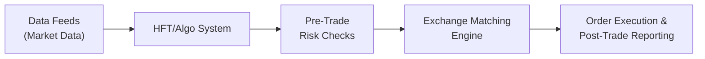

## 5.5 High-Frequency & Algorithmic Trading

High-frequency trading (HFT) and algorithmic strategies have become increasingly significant in modern futures markets, including the Canadian derivatives landscape. In the blink of an eye—or, more accurately, in microseconds—these high-speed systems place, adjust, and cancel massive volumes of trades in order to capture even the smallest of price discrepancies. If you’ve ever watched market data jump around on your screen and thought, “Wow, that’s moving way faster than any human hand could manage,” you’re seeing algorithmic trading in action. HFT is a subset of algorithmic trading that focuses on extremely short time horizons, leveraging advanced technology, robust infrastructure, and sophisticated quantitative models.

Sometimes, folks ask: “Isn’t that just a fancy way to scalp the market?” Well, in a sense, yes. But these systems operate with such speed and complexity that they go well beyond the manual scalping strategies of old. Let’s take a deep dive into what HFT and algorithmic trading look like in the context of futures speculation, with a particular focus on how these strategies function in Canada and under the oversight of the Canadian Investment Regulatory Organization (CIRO).

–––––––––––––––––––––––––––––––––––––––––––––
  
### Understanding High-Frequency vs. Algorithmic Trading

Algorithmic trading is a broad term describing automated systems that execute trading strategies based on mathematical models, statistical analyses, or technical rule sets. High-frequency trading, meanwhile, is a specialized variant that includes:

• Very high-speed execution.  
• Extremely short holding periods, often measured in seconds or fractions of a second.  
• Rapid order routing with massive order volumes.  
• Advanced use of market data feeds with minimal latency (the time delay between market events and the system’s reaction).

Let’s break down the distinction:

• Algorithmic Trading: This could be something as simple as a retail trader automating a mean-reversion strategy in the E-mini S&P 500 futures, or a pension fund rebalancing a commodity index fund whenever certain thresholds are met. It can also be more advanced, incorporating machine learning to manage risk or gauge market sentiment.  
• High-Frequency Trading (HFT): This is on the cutting edge of technology, involving co-located servers at the exchange, microsecond-level order entry, and enormous volumes of messages (orders, amendments, cancellations). These strategies attempt to eke out narrow profit margins repeatedly.  

In Canada, participants using such strategies must stay aware of the regulatory environment. CIRO’s rules demand adequate risk controls—both before and after orders hit the market—plus robust kill-switch mechanisms to halt trading if something goes haywire.

–––––––––––––––––––––––––––––––––––––––––––––

### Personal Reflections on Algorithmic Trading

I remember first hearing about algorithmic trading when a friend of mine mentioned he’d set up a simple moving-average crossover system on a popular retail brokerage platform. He was super excited, but also a bit nervous about trusting a computer to run trades without him. The system used an “if-then” logic: if the fast moving average crosses above the slow moving average, then buy futures; otherwise, remain flat. 

Pretty neat, right? Over time, he discovered that the real trick is risk management—algo success depends on consistent position-sizing, robust stop-loss logic, and quickly adjusting parameters in response to volatile market conditions. Multiply that by a thousand for HFT, where the difference of a microsecond in order transmission might decide whether you earn or lose thousands of dollars on a single trade. The stakes can feel high, but the strategy is also unbelievably fast.

–––––––––––––––––––––––––––––––––––––––––––––

### Key Components of a High-Frequency Trading Setup

While algorithmic trading might just require some software and a brokerage API, HFT involves more specialized infrastructure. Here’s a simplified breakdown in the form of a flowchart:

**Explanation of Flowchart Nodes:**

• A["Data Feeds (Market Data)"]: This includes real-time quotes and market depth from futures exchanges, plus relevant economic indicators. In Canada, data feeds come primarily from the Bourse de Montréal (for derivatives) and from other global futures exchanges if cross-market strategies are used.  
• B["HFT/Algo System"]: This heart of the setup comprises the mathematical models, code, and logic that crunch incoming market data to decide order size, price, and timing.  
• C["Pre-Trade Risk Checks"]: Before an order is submitted, it goes through risk validations to ensure compliance with position limits, margin requirements, and potential kill-switch triggers.  
• D["Exchange Matching Engine"]: For Canadian futures, the exchange’s matching engine is physically located in secure data centers. Many HFT firms use colocation services to place their servers close to the matching engine, reducing transaction times by microseconds.  
• E["Order Execution & Post-Trade Reporting"]: Once trades are executed, the firm’s systems update P/L (profit and loss), open positions, and deliver post-trade reports. This closed-loop ensures the algo is always aware of its real-time positions.

–––––––––––––––––––––––––––––––––––––––––––––

### Colocation and the Hunt for Low Latency

You might recall reading about traders who rent racks of servers right at the exchange’s data center. This practice, known as colocation, aims to reduce the physical distance between the trading firm’s servers and the matching engine. The shorter the distance, the faster the data can move, and in HFT, every nanosecond counts.

Latency can be broken down into:

• **Network Latency**: Transmission delays between a server and the exchange.  
• **Processing Latency**: Time required to run the algorithmic logic, risk checks, and order generation.  
• **Exchange Latency**: The time it takes for the exchange to receive and process the order in its matching engine.

In Canada, the Bourse de Montréal offers colocation services, and many HFT firms find it necessary to compete effectively. However, not everyone can afford these super-sophisticated setups, and that leads to debates about market fairness. Regulators, including CIRO and the Bourse de Montréal, aim to keep the playing field level by imposing consistent risk controls and monitoring.

–––––––––––––––––––––––––––––––––––––––––––––

### Practical Examples in Futures Markets

1. **Market-Making with High Speed**: Suppose a firm runs an HFT strategy to provide continuous buy and sell quotes on Canadian index futures. The algorithm updates these quotes dozens of times per second as volatility shifts. Profit might come from the bid-ask spread or by capturing tiny dislocations in the order book.  

2. **Cross-Market Arbitrage**: Let’s say the firm’s system detects that the implied price of a futures contract on the S&P/TSX 60 Index is trading slightly out of sync with an ETF basket replicating the same index in real time. The HFT system buys the cheaper one and sells the more expensive one, capturing a small profit.  

3. **Event-Driven HFT**: A sudden news headline hits the wires that drastically changes interest rate expectations. Algorithmic reading (natural language processing) picks up the significance of the announcement, and the system instantly recalibrates exposures across Canadian Government Bond futures, quickly removing or adding positions to hedge risk or capture the immediate price move.

–––––––––––––––––––––––––––––––––––––––––––––

### Risk Management for High-Frequency Traders

**1. Pre-Trade Risk Checks**  
Canadian regulations emphasize the importance of real-time risk controls. If your system accidentally plans to buy 10,000 futures contracts when it meant 1,000, that can create disastrous positions. Automatic checks confirm margin availability, position limits, and adequate liquidity before orders are accepted.  

**2. Kill-Switch Mechanisms**  
If your code starts messing up in a big way—maybe due to a bug or a “rogue algorithm”—you want a one-click method to stop all activity immediately. Some kill-switches trip if certain thresholds are reached (for instance, if net losses exceed a pre-set limit).  

**3. Stress Testing**  
It’s also common to run stress tests that simulate extreme scenarios. How would your system respond if the TSX 60 Index drops 4% in one minute? Or if liquidity disappears in the Canadian bond futures market? Understanding the algo’s behavior under hypothetical stress helps you implement protective measures.  

**4. Post-Trade Review**  
Yes, real-time is critical, but it’s also important to analyze outcomes after the dust settles. This may include trade reconstructions, slippage studies, and variance analysis. Whether you run a small retail algo or a massive HFT desk, post-trade analytics help refine strategies.

–––––––––––––––––––––––––––––––––––––––––––––

### Regulatory Scrutiny and CIRO Oversight

All these ultra-fast trades raise questions about market fairness and systemic stability. In the past, critics have argued HFT might disadvantage slower participants or exacerbate flash crashes. Here in Canada, CIRO (which, since January 1, 2023, replaced the historical IIROC and MFDA) has authority to oversee participants for compliance. CIRO’s guidelines, in coordination with the CSA (Canadian Securities Administrators), emphasize:

• **Market Integrity Rules**: Ensuring algorithmic trades do not disrupt markets or manipulate prices.  
• **Pre- and Post-Trade Risk Controls**: Including real-time filters, capital checks, and order throttling if needed.  
• **Fair Access and Technology Requirements**: Exchanges must ensure that all participants have appropriate methods to connect, even if they do not pay for colocation.  
• **Kill-Switch Mandates**: Requiring robust stop mechanisms for algorithmic participants.  

Many of these requirements are spelled out in the Bourse de Montréal’s own regulation documents and in CSA national instruments covering electronic trading. For further reading, check out the Bourse de Montréal’s website at https://www.m-x.ca/ and CIRO’s main site at https://www.ciro.ca for compliance bulletins and notices.

–––––––––––––––––––––––––––––––––––––––––––––

### Sophistication vs. Accessibility

It’s tempting to assume that HFT is only for giant hedge funds with deep pockets—and for the most part, that assumption is correct. Large-scale HFT typically requires hiring specialized engineers and quantitative analysts, plus investing in top-tier infrastructure. But advanced algorithmic trading more broadly has become accessible to smaller funds and even individuals, thanks to:

• **Open-Source Libraries**: Tools like Zipline, QuantConnect’s Lean Engine, and TA-Lib enable sophisticated backtests of futures data.  
• **Cloud Services**: Retail traders can rent cloud servers with decent specs and latency, though not as fast as colocation.  
• **Educational Platforms**: Many brokers offer training modules on building automated strategies.  

Still, for do-it-yourself algorithmic traders, it’s vital to respect the complexities of the futures markets—particularly around margin, capital requirements, and market microstructure. A single bug can be costly. Also, keep in mind that any form of automated trading might attract regulatory attention if it results in suspicious order patterns or large trades hitting the market.

–––––––––––––––––––––––––––––––––––––––––––––

### Common Strategies and Tactics

1. **Mean-Reversion**: An assumption that price extremes in futures eventually migrate back to an “average.” Algos spot these short-term extremes and trade against them.  

2. **Trend-Following**: Some high-frequency traders momentarily ride a short impulse, especially if other market participants are playing catch-up on new information.  

3. **Machine Learning Models**: Neural networks or ensemble methods that pick up patterns from large historical datasets. The system might parse economic data or real-time news to predict short horizon price changes.  

4. **News-Based Algos**: Use natural language processing (NLP) to detect words or phrases that historically correlate to price spikes or volatility. The futures market often sees immediate surges in activity after major announcements.

–––––––––––––––––––––––––––––––––––––––––––––

### Potential Pitfalls and Best Practices

**1. Overfitting**  
A machine learning model might look perfect on historical data but fail in live markets because it “memorized” noise. Too many parameters plus a short dataset? Watch out.  

**2. Latency Surprises**  
HFT requires complex hardware, specialized lines, and colocation. Any unexpected slowdown or system failure can cause big losses simply because your system can’t respond quickly enough.  

**3. Regulatory Violations**  
One must be extremely careful that the algo doesn’t inadvertently generate manipulative patterns. Layering or spoofing—where large orders are placed and then canceled to mislead others—can lead to serious penalties.  

**4. Flash-Crash Events**  
Market disruptions can trigger a cascade of algos reinforcing each other’s sell (or buy) signals, leading to precipitous market moves. Maintaining robust circuit breakers, kill-switches, and volatility-based controls is critical.

–––––––––––––––––––––––––––––––––––––––––––––

### Real-World Case Study: The “Quick Dip” in Index Futures

Imagine a scenario on the Bourse de Montréal:  
• Right before a major economic release, multiple HFT firms are quoting large volumes on a key Canadian index futures contract.  
• The news arrives earlier than expected on a public wire feed, showing weaker growth than forecast.  
• A handful of HFT algos pull their bids instantly, anticipating a downward price movement.  
• The order book suddenly goes thin, and a wave of selling pushes the futures price down quickly—maybe more sharply than fundamentals alone would suggest.  
• Some algos see the immediate drop as an overreaction and jump in to buy the dip, pushing the price back up within seconds.

If you were casually glancing at your trading screen, you might have seen a flash move happen and revert in the blink of an eye. Such episodes can annoy fundamental traders who can’t respond within milliseconds, yet they also provide liquidity. Regulators like CIRO and the Bourse de Montréal watch for manipulation or structural issues that could unfairly disadvantage certain market participants.

–––––––––––––––––––––––––––––––––––––––––––––

### Future of High-Frequency & Algorithmic Trading

Looking ahead, the lines between HFT, machine learning, and advanced data analytics are blurring. Firms are exploring:

• **AI-Driven Models**: Deep neural networks that adapt in near real-time, reading streaming financial news, social media sentiment, and huge swaths of historical data.  
• **Ultra-Low Latency Hardware**: Next-gen servers, custom chipsets (e.g., FPGAs), and specialized microwave transmission lines to reduce distances between exchange data centers.  
• **New Instruments**: As crypto derivatives and ESG-related futures become mainstream, HFT and algorithmic strategies will migrate to those assets as well.  
• **Tightening Regulations**: CIRO and global regulators will likely impose stricter technology audits, real-time surveillance, and data reporting to manage systemic risk.

Despite these ongoing changes, one thing seems certain: speed, efficiency, and automation continue to shape how futures contracts are traded, speculated upon, and hedged. Staying in compliance with evolving regulations and adopting prudent risk management will remain critical for participants.

–––––––––––––––––––––––––––––––––––––––––––––

### Glossary

• **High-Frequency Trading (HFT):** Automated trading executed at extremely fast speeds, focusing on capturing small, fleeting price discrepancies.  
• **Latency:** The delay between sending an order and receiving a confirmation or fill. Reducing this delay is critical for HFT success.  
• **Mean-Reversion Strategy:** A model based on the idea that abnormal price deviations will revert toward their historical averages.  
• **Machine Learning Models:** Algorithms that uncover patterns in data to make predictive decisions and adapt to changing market conditions.  
• **Colocation:** Hosting trading servers in the same data center as the exchange matching engine, minimizing the physical distance and hence transmission time.  
• **Kill-Switch:** A mechanism to instantly halt all trading in the event of abnormal behavior or malfunctions in the trading system.  
• **Market Integrity Rules:** Regulations aimed at maintaining fair, transparent, and stable markets.

–––––––––––––––––––––––––––––––––––––––––––––

### Additional Resources

1. **Montreal Exchange (Bourse de Montréal) Algorithmic Trading Guidelines**  
   Website: https://www.m-x.ca/  
   Offers detailed rules and best practices for automated trading in the Canadian derivatives market.  

2. **CIRO Resources for Automated and High-Frequency Trading Compliance**  
   Website: https://www.ciro.ca/  
   Contains compliance notices and guidelines for dealers subject to Canadian regulatory requirements.  

3. **Book: “Algorithmic and High-Frequency Trading” by Álvaro Cartea et al.**  
   An academic resource that dives deeper into the quantitative methods and market microstructure underlying HFT.  

4. **Open-Source Libraries**  
   • Zipline: A Pythonic library for backtesting.  
   • QuantConnect’s Lean Engine: C#/Python platform for building, backtesting, and executing algorithmic strategies.  
   • TA-Lib: A popular library for technical analysis.  

5. **Canadian Securities Administrators (CSA)**  
   Website: https://www.securities-administrators.ca/  
   Look here for national instruments covering marketplace operations, including technology guidelines.

–––––––––––––––––––––––––––––––––––––––––––––

## Sample Exam Questions: High-Frequency and Algorithmic Trading in Futures Markets



### Which of the following distinguishes high-frequency trading (HFT) from broader algorithmic trading?

- [ ] HFT only trades in equities, while algorithmic trading only trades futures.  
- [x] HFT emphasizes microsecond execution speeds and very short holding periods.  
- [ ] HFT relies solely on fundamental analysis, whereas algorithmic trading does not.  
- [ ] HFT never co-locates servers at exchanges.  

> **Explanation:** HFT forms a specialized subset of algorithmic trading that specifically leverages microsecond execution speed, enormous message traffic, and brief holding periods to capture small pricing quirks.  

### Which regulatory body in Canada took over from IIROC and MFDA and now oversees market integrity, including HFT activities?

- [ ] The Montreal Exchange  
- [x] CIRO (Canadian Investment Regulatory Organization)  
- [ ] CIPF (Canadian Investor Protection Fund)  
- [ ] The Federal Reserve  

> **Explanation:** CIRO replaced the historical IIROC and MFDA on January 1, 2023. It supervises broker-dealers and market integrity to ensure fair and orderly markets.  

### Select all valid reasons why colocation services are attractive for high-frequency traders.

- [x] It reduces network latency between the trading server and the exchange.  
- [ ] It exempts HFT firms from regulatory scrutiny.  
- [x] It places a server physically closer to the exchange's matching engine.  
- [ ] It guarantees a profit in all trades.  

> **Explanation:** Colocation reduces transmission times by physically locating a server in the same data center as the exchange. However, it does not eliminate regulatory oversight or guarantee profits.  

### Which of the following best describes a kill-switch in algorithmic trading?

- [x] A mechanism to immediately halt all trading if the system malfunctions.  
- [ ] A tool to increase the speed of order executions.  
- [ ] A requirement to store market data permanently.  
- [ ] An order type used for limit trades only.  

> **Explanation:** A kill-switch is a fail-safe designed to stop trading quickly if something goes wrong or if abnormal activity is detected.  

### Which of these common strategies in algorithmic trading assumes that extreme price moves will eventually return toward an average level?

- [x] Mean-reversion  
- [ ] Momentum  
- [ ] News-based trading  
- [ ] Trend-following  

> **Explanation:** Mean-reversion strategies hypothesize that prices that deviate significantly from historical averages will revert, so the system trades against such extremes.  

### What is a potential pitfall of using machine learning algorithms for HFT?

- [ ] Unlimited computational resources  
- [ ] No need for historical data  
- [x] Overfitting on historical data  
- [ ] Guaranteed performance in live markets  

> **Explanation:** Machine learning models can overfit historical data, detecting patterns that do not hold when the model trades in real, dynamic markets.  

### Which statement accurately describes cross-market arbitrage?

- [ ] A strategy that never involves multiple instruments.  
- [ ] The purchase or sale of identical instruments with identical prices.  
- [x] Exploiting price discrepancies between two correlated markets or instruments.  
- [ ] Only feasible for large retail investors.  

> **Explanation:** Cross-market arbitrage identifies and capitalizes on temporary price differences across related markets, such as an index futures contract and its underlying ETF basket.  

### Which of the following is a fundamental feature of regulatory scrutiny for HFT in Canada?

- [x] Mandatory pre- and post-trade risk controls  
- [ ] Ban on automated trading  
- [ ] Restriction of margin for all traders to zero  
- [ ] Removal of kill-switch requirements  

> **Explanation:** CIRO and the Bourse de Montréal enforce rules mandating robust risk controls, real-time monitoring, and kill-switch mechanisms to manage potential systemic risks of high-speed trading.  

### Which of the following statements about “latency” is correct?

- [x] It is the time it takes for an algo to receive and react to market data and for its orders to reach the exchange.  
- [ ] It only applies to manual trading.  
- [ ] It’s unrelated to network distance.  
- [ ] It’s irrelevant for HFT strategies.  

> **Explanation:** Latency is a major concern for HFT—shorter delays mean faster reaction times, which is crucial to capturing fleeting market opportunities in microseconds.  

### True or False: High-frequency traders in Canada are automatically exempt from compliance with daily position limits set by CIRO.

- [ ] True  
- [x] False  

> **Explanation:** HFT firms are subject to the same regulatory regimes set by CIRO as everyone else, including position limits, margin requirements, and market integrity rules.


