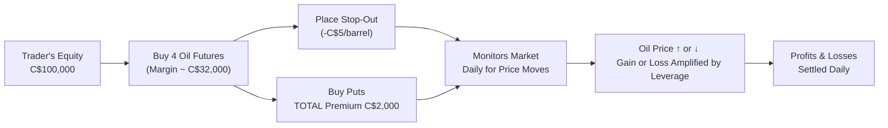

## 5.6 Leveraged Speculation and Volatility Management

Let’s be honest: if you’ve ever watched a movie about Wall Street, you’ve seen traders in chaotic trading pits or fancy offices with multiple monitors and blinking lights. In those scenes, someone always seems to be either making a fortune or losing it. And often, that excitement is linked to leverage—the powerful (but risky) mechanism that can boost both your profits and your losses. In this section, we’re going to break down the art and science of leveraging your speculative positions in futures, and also explore how to manage the volatility that comes hand in hand with such an approach.

Leverage can feel thrilling. After all, you can control a large notional amount of an underlying asset—be it commodities, equity indexes, or interest rates—with only a fraction of its full value posted as margin. But as you might suspect, there are potential pitfalls. When you use leverage, you magnify every twist and turn in market prices. A small unfavorable move could quickly escalate into a big financial headache if you’re not prepared. That’s why successful traders talk about volatility controls and iron discipline. So, let’s roll up our sleeves and see how markets, margin, and risk management come together.

--------------------------------------------------------------------------------

### Understanding Leverage in Futures

Leverage is, at its core, the ratio of the notional value of your contract to the capital you actually put down as margin. If the notional value of a futures contract is C$1,000,000 and you need to post only C$100,000 as your margin, you have a 10:1 leverage ratio. In other words, each 1% move in the underlying price implies a 10% move (in absolute terms) on your margin.

This concept is central to the allure of futures trading. Suppose you believe that crude oil prices are about to spike. You jump into a crude oil futures contract that’s worth 1,000 barrels of oil. If each barrel is priced at C$80, your total notional value is C$80,000. The margin on such a contract (hypothetically) might be a fraction of that—say C$8,000. You see how quickly returns can be magnified if the market moves in your favor.

#### Personal Anecdote on Leverage
I remember speaking with a close friend who traded futures on natural gas. She told me, “It felt like having a Ferrari on an empty highway—amazing in wide-open markets, but absolutely terrifying when there’s unexpected traffic.” That’s the essence of leverage. It’s exhilarating if you’re prepared for it, but it can be downright scary if you’re not.

--------------------------------------------------------------------------------

### Margin Requirements and Notional Value

Recall that the margin is more of a “good-faith deposit” rather than a traditional down payment. It is there to cover potential adverse price moves. If your position moves against you, the broker (through your futures commission merchant) may issue a margin call. You either top up your account or risk forced liquidation, which is the broker’s way of mitigating credit risk on your position.

#### Key Terms

• **Notional Value**: Total value of a leveraged position, representing the underlying asset’s full size.  
• **Margin-to-Equity Ratio**: How much of a trader’s capital is tied up in margin relative to the overall account equity.  

This ratio is crucial. Many traders set limits—for instance, they might decide to never exceed a margin-to-equity ratio of 30%. That means if they have C$100,000 in their account, they’ll only allocate C$30,000 to margin purposes, leaving a healthy buffer for volatility. We’ll talk more about the margin-to-equity ratio in the risk management section.

--------------------------------------------------------------------------------

### Why Leverage Is Attractive to Speculators

1. **Potential for Higher Returns**: If you forecast market directions accurately, leverage allows you to multiply the returns on your initial outlay. With minimal capital tied up, a 2% move in the market can lead to double-digit gains in your account’s net equity.

2. **Capital Efficiency**: By using futures, you can gain exposure to equity indexes, commodities, or interest rate markets without tying up the full notional value. This leaves room to invest or trade in other markets simultaneously.

3. **Flexibility**: If you hold certain views about short-term price changes, leveraged futures enable you to seize opportunities quickly and exit positions with relative ease.

But each of these benefits brings along a parallel risk. A 2% unfavorable move in the market also results in a big chunk of your margin vanishing. This is why discipline and robust volatility management are absolutely essential.

--------------------------------------------------------------------------------

### The Downside: Amplified Losses

If we only talked about huge potential profits, we wouldn’t be giving you the full picture. One reason new traders get burned is that it’s easy to underestimate how quickly losses accumulate. The dreaded forced liquidation can happen if your margin-to-equity ratio spikes too high due to adverse price moves. Brokers don’t hesitate to close out positions if your account equity runs too low to cover the margin requirements.

**Key Tip**: Always keep an eye on your open positions and your account’s equity balance. Use real-time account monitoring tools provided by your broker, or set up your own risk models with open-source tools like QuantLib or PyVol. A slight tweak in the market can cause big changes in your leveraged position’s P&L (profit and loss).

--------------------------------------------------------------------------------

### Volatility and Why It Matters

Volatility is the degree of fluctuation in the market price of the underlying. If you have a 10:1 leverage ratio, even a 2% to 3% swing in a day can be significant. In high-volatility markets—like natural gas in winter or stock index futures during major macroeconomic announcements—you might see intraday price moves of 5% or more. That can spell major gains or major trouble.

#### Volatility Indicators

• **VIX (Volatility Index)**: Widely used for equities (specifically the S&P 500), it measures the market’s expectation of near-term volatility.  
• **Implied Volatility (IV)**: The market’s view of how much the underlying price will move over a given period, often inferred from the price of options.  
• **Historic or Realized Volatility**: How much the price has fluctuated in the past.  

For commodity futures, implied volatility is a figure gleaned from the options on futures. Chart watchers and data scientists might also track daily trading ranges, average true range (ATR), or Bollinger Bands as a proxy for changes in volatility.

--------------------------------------------------------------------------------

### Volatility Management Strategies

Anyone who’s traded during a news release—like an interest rate announcement by the Bank of Canada—can attest to volatility’s power. Let’s explore some strategies to keep that Ferrari (your highly leveraged position) under control.

#### 1. Stop-Out Levels

These are prices or triggers at which you reduce or exit your position to halt losses if the market goes against your prediction.

• **Hard Stops**: You place a stop-loss order at a specific price, so if the market trades there, your position is automatically closed.  
• **Soft or Mental Stops**: More discretionary. You decide in advance that “if my position is down by more than C$5,000, I’ll liquidate,” but you don’t necessarily enter the order in the market. It relies on your discipline, which can be a double-edged sword if you hesitate.  

Stops are often placed just beyond technical support/resistance levels. However, be aware of slippage in fast-moving markets, especially during events like large economic data releases or unexpected geopolitical developments.

#### 2. Hedging with Options on Futures

Let’s say you hold a long position in S&P/TSX 60 Index futures. You’re optimistic about the market trend but worried about short-term volatility. One approach is to buy a put option on that same futures contract. This put option grants you the right (but not the obligation) to sell the futures contract at a specified strike price. If the market tumbles, the put option gains value, offsetting some (or all) of the losses on your futures.

• **Protective Put**: A classic hedge for long futures positions.  
• **Covered Call**: Less common with futures but can be used in certain strategies where you hold the underlying (or an equivalent synthetic position).  

These strategies can reduce net profitability if the market rallies, because you pay a premium for the options. However, for many traders, the cost of options is a small price to pay for sleep-filled nights during turbulent times.

#### 3. Dynamic Adjustments

Markets don’t remain static, so your position sizing shouldn’t either. Many traders look at volatility metrics daily or weekly and scale their positions up or down accordingly. If the market’s volatility doubles, the risk effectively doubles. You could cut your position size in half to maintain the same risk exposure. Or if implied volatility is dropping, you might feel comfortable building a bigger position, all else being equal.

This is particularly important if you’re running multiple strategies. You might have a commodity futures position, an equity index futures position, and a currency futures position. All these can experience correlated moves in times of crisis or euphoria. A dynamic approach helps you maintain an overall risk profile that feels right for your objectives and risk tolerance.

--------------------------------------------------------------------------------

### Margin-to-Equity Ratio: Your Safeguard

One of the most straightforward metrics for risk control is the margin-to-equity ratio. Suppose you have C$100,000 in equity in your futures trading account, and your total margin requirement is C$40,000 across all positions. That’s a 40% margin-to-equity ratio. If your trades collectively move against you by 25% of your initial margin, you lose C$10,000. Now your equity is down to C$90,000, and your ratio creeps up to about 44%. If you have limited unallocated capital, you’ll face a higher risk of margin calls.

A lower ratio translates to more staying power amid short-term price swings. A higher ratio might bring bigger returns in calm markets but also means you’re on thinner ice. Many professional speculators set an upper threshold—say 50%—to avoid the dreaded margin call spiral.

--------------------------------------------------------------------------------

### Cash Reserves

Another way to keep that meltdown scenario at bay is to maintain some spare capital. Cash reserves act like a shock absorber. If the market has a temporary adverse move, you have funds to meet the margin call without liquidating your entire position. You also retain flexibility to jump on new opportunities that might arise during volatile periods.

In Chapter 2 (Futures Contracts Basics), we talk about margin requirements and marking-to-market. Think of your cash reserves as your personal safety net. If you commit all your capital, any unfavorable price movement could pinch you into forced liquidation, often at the worst possible time.

--------------------------------------------------------------------------------

### Compliance with CIRO Requirements

In Canada, **CIRO** (the Canadian Investment Regulatory Organization) provides firm guidelines on margin and leverage to protect market participants (and the broader financial system) from excessive risk-taking. Before January 1, 2023, you might have heard references to IIROC or MFDA, but these are now historical. CIRO is our modern self-regulatory body.

• **Leverage Limits**: CIRO sets minimum margin rates for various futures contracts. These may change depending on how volatile the underlying market is.  
• **Risk Disclosure**: If you’re trading futures at a CIRO-member firm, you’ll receive disclosures about the hazards of leverage, how margin works, and all sorts of procedures around margin calls.  
• **Enforcement**: Firms must ensure you have the financial capacity to handle your intended trades. If they see you overleveraging, they can increase your margin requirements or restrict trading.  

Be sure to visit [https://www.ciro.ca/](https://www.ciro.ca/) for updated resources and the latest margin guidelines. Also, the Montreal Exchange ([https://www.m-x.ca/](https://www.m-x.ca/)) provides margin offset tables for various futures and options products, showing how you can reduce overall margin by combining correlated positions.

--------------------------------------------------------------------------------

### Practical Example: Oil Futures

Let’s walk through a simple scenario to illustrate leveraged speculation and volatility management in action.

Suppose you have C$100,000 in your trading account. You see an opportunity in WTI crude oil futures, each contract representing 1,000 barrels of oil. The price is C$80 per barrel, so the notional value of one contract is C$80,000. Let’s assume the initial margin is 10% (C$8,000) per contract.

• **Deciding Position Size**: You could buy up to 12 contracts theoretically (since 12 × C$8,000 = C$96,000, which is close to your total capital). But that’s almost 100% margin usage. Instead, you decide to buy 4 contracts, using C$32,000 in margin and leaving C$68,000 uncommitted.  
• **Tracking Volatility**: The implied volatility for crude oil options has recently spiked due to geopolitical tensions. You anticipate big price swings, so you place a mental stop-out level where if oil drops by more than C$5 per barrel, you’ll close your positions to curb the potential drawdown.  
• **Hedging with Puts**: Additionally, you purchase put options for each of your 4 futures contracts, giving you insurance if crude oil falls significantly. You pay option premiums totaling C$2,000.  
• **Outcome**: Over the next two weeks, oil rallies by 5%. Each contract gains approximately C$4,000 (5% of C$80,000). With 4 contracts, you make C$16,000, minus the C$2,000 in put premiums. You net a C$14,000 gain. Your margin usage still remains at C$32,000 for the futures contracts, but now your equity is at C$114,000 (barring brokerage fees and slippage).  
• **If It Went the Other Way**: If instead oil had dropped 5%, each contract would’ve lost C$4,000. You’d be down C$16,000, but your put options might offset some of that loss, depending on the strike price and expiration. If the losses started stacking quickly, your mental stop-out would hopefully trigger, saving you from further pain.

--------------------------------------------------------------------------------

### Mermaid Diagram: Leveraged Futures Position Flow

Below is a simple visual outline of how a leveraged position in futures might work, including the hedge with an option. Think of it as a map of decisions and key steps:

In this diagram, you can see the interplay between the initial capital, margin, optional put hedge, and daily monitoring for potential stop-outs.

--------------------------------------------------------------------------------

### Avoiding Forced Liquidation

Picture this: you’re at dinner, you glance at a market update on your phone, and you discover your position is deep in the red. The next morning, your broker is forced to sell your contracts because your margin is insufficient. Distressing, right?

Forced liquidation is a worst-case scenario you want to avoid. Brokers do it to protect themselves (and the clearing system) from default risk. By maintaining a prudent level of margin usage and monitoring your positions carefully, you reduce the chance of having your fate decided by automatic liquidation. That said, if you do hit this scenario, sometimes it’s actually beneficial to cut the losses cleanly rather than hang on and hope. Over the long term, learning to adapt and reposition is crucial.

--------------------------------------------------------------------------------

### Best Practices: Keeping Volatility in Check

1. **Position Sizing**: Before entering a trade, figure out how much you’re willing to lose in absolute dollars. Then back-calculate your position size so you don’t wipe out your account from a single bad move.

2. **Use Stop-Out Levels**: Hard or mental stops remove emotion and second-guessing from your trading decisions. They also help you identify if your original thesis was wrong.

3. **Hedge When Needed**: Options on futures can be a lifeline during turbulent markets. Yes, they reduce potential profit, but they also cap losses.

4. **Maintain Cash Reserves**: Keep a portion of your account in cash or highly liquid instruments to handle margin calls or to seize other opportunities.

5. **Tiered Margin**: Some advanced traders apply a layer of “house rules” on top of the mandatory margin. For example, if official margin is 10%, they might self-impose a 15% margin usage. This is effectively a personal cushion for unexpected volatility spikes.

6. **Monitoring & Adjusting**: Markets change fast. Keep an eye on volatility indicators, margin-to-equity ratios, and relevant macro news.

--------------------------------------------------------------------------------

### Regulatory Landscape and Industry Resources

• **CIRO (Canadian Investment Regulatory Organization)**: [https://www.ciro.ca/](https://www.ciro.ca/) – For official margin guidelines, compliance rules, and risk disclosures.  
• **The Montreal Exchange**: [https://www.m-x.ca/](https://www.m-x.ca/) – Offers futures and options on popular Canadian underlyings, plus margin offset tables and educational resources.  
• **CSA National Instrument 81-102** – Lays out rules that might limit leverage usage for Canadian mutual funds.  
• **Open-Source Financial Tools**:  
  – **QuantLib**: A robust library for pricing and risk analysis of derivatives.  
  – **PyVol**: A Python-based toolkit for volatility modeling, helpful in scenario analysis of leveraged positions.  
• **Suggested Reading**:  
  – “Trading VIX Derivatives” by Russell Rhoads – A deeper look at volatility products, though more equities-focused, still relevant for understanding implied volatility and risk management.  
  – CFA Institute (https://www.cfainstitute.org/) – Articles, webinars, and research on leveraged products and volatility strategies.

--------------------------------------------------------------------------------

### Case Study: High Volatility Environment

In early 2020, the impact of global health crises triggered extreme swings in commodity and equity markets. Some producers, for instance in the energy sector, saw oil prices fluctuate wildly. Leveraged traders who anticipated the moves early could’ve reaped enormous gains—but many who guessed wrong (or had poor risk controls) took substantial hits. The big lesson was the survival skill: the ones who had well-chosen stop levels, diversified positions, or protective options weathered the chaos.

This real-life example underscores how quickly markets can move. One day, you might see a 2% decline, and the next day, a 5% rally. If you’re leveraged 10:1 or 20:1, that’s enough to strain your emotional fortitude. That’s precisely why a well-aligned volatility management process is indispensable.

--------------------------------------------------------------------------------

### Final Thoughts

Leverage is a double-edged sword, a powerful tool that demands respect. Used wisely, it’s like rocket fuel for your trading goals—enabling you to do more with less capital. But if you neglect volatility control, manage your positions poorly, or ignore margin-to-equity ratios, you may find yourself crash-landing hard. A mindful approach that incorporates stop-loss strategies, optional hedging, and prudent margin usage can keep you in the game for the long haul.

Always remember to cross-check your strategy with the latest regulatory requirements and keep track of changes in the margin climate. Trading is an ever-evolving field, and what worked last year might need some fine-tuning this year—especially as new products, new sources of volatility, and new global events enter the fray.

To continue your learning, explore the resources mentioned earlier and don’t hesitate to consult professional advisors or mentors, especially if you’re venturing into highly leveraged positions for the first time. The best defense against market turmoil, in my opinion, is knowledge—plus a healthy dose of humility. Because as we all know, the market can remain volatile longer than you can remain solvent. Stay curious, manage your risks, and good luck!

--------------------------------------------------------------------------------

## Sample Exam Questions: Leveraged Speculation and Volatility Management



### Which concept best describes controlling a large amount of an underlying asset with a relatively small investment?

- [ ] Volatility hedging
- [x] Leverage
- [ ] Arbitrage
- [ ] Collateralization

> **Explanation:** Leverage is the mechanism that allows traders to control large notional values with only a fraction of the capital (margin).

### What does the margin-to-equity ratio measure in a futures trading account?

- [ ] The probability of a margin call
- [ ] The total profit or loss
- [x] The percentage of your account equity committed as margin
- [ ] The difference between initial and maintenance margin levels

> **Explanation:** The margin-to-equity ratio compares the margin being used (margin requirement) to the total equity in the trading account.

### Why might a futures trader purchase put options on their long futures position?

- [ ] To magnify their gains if the market rises
- [x] To hedge potential downside risk
- [ ] To pay less margin
- [ ] To benefit from time decay

> **Explanation:** By buying put options, a trader can offset losses if the underlying price falls, thereby hedging downside risk.

### When the market moves against a highly leveraged position, what is the typical broker response if the trader cannot post additional funds?

- [ ] The broker will allow the trader extra time
- [ ] Nothing happens until the trader closes the position voluntarily
- [ ] The trader automatically defaults
- [x] The broker may force liquidation of the position

> **Explanation:** Brokers protect themselves and the clearing system by liquidating positions when traders cannot meet margin calls.

### Which of the following is NOT a common volatility management technique?

- [ ] Using stop-out levels
- [x] Placing market orders without analysis
- [ ] Hedging with options on futures
- [ ] Dynamic position sizing based on volatility

> **Explanation:** “Placing market orders without analysis” is not a technique to manage volatility; it’s a random or careless approach that increases risk.

### CIRO requirements regarding leverage primarily aim to:

- [ ] Encourage traders to maximize margin usage
- [ ] Prevent traders from taking any risks
- [x] Protect market participants from excessive risk
- [ ] Guarantee profitability for all

> **Explanation:** CIRO sets margin and leverage guidelines to ensure that traders and the marketplace do not take on unsustainable risk levels.

### What term refers to the situation when a trader’s position is reduced or closed by the broker due to insufficient margin?

- [ ] Managed liquidation
- [ ] Automatic deposit
- [x] Forced liquidation
- [ ] Equity shortfall

> **Explanation:** Forced liquidation is when the broker closes out positions because the trader can’t meet margin requirements.

### A trader decides to open fewer futures contracts than the maximum allowable by margin rules and reserves some cash. This is an example of:

- [ ] Overtrading
- [x] Maintaining cash reserves for risk control
- [ ] Violation of margin rules
- [ ] Cross-hedging

> **Explanation:** The trader is intentionally keeping part of the account in cash to protect against margin calls or to seize new opportunities, thereby reducing risk.

### If implied volatility doubles while you maintain the same number of contracts in a futures position:

- [ ] Your potential gains are reduced
- [x] Your position risk effectively doubles
- [ ] There is no effect on leveraged exposure
- [ ] Margin requirements become irrelevant

> **Explanation:** Higher implied volatility usually means bigger price swings, effectively increasing the risk exposure of your leveraged position.

### True or False: A hard stop-loss order is placed with the broker and is executed automatically once the specified price level is reached.

- [x] True
- [ ] False

> **Explanation:** Hard stop-loss orders are indeed entered with the broker. They are triggered automatically when the market hits the specified stop price, closing out the position as instructed.


