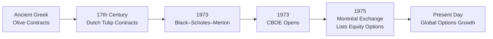

## 6.1 The History of Options

Let’s take a step back—way back—to the very beginnings of options trading. Sometimes, it’s easy to forget that the concept of securing “rights” to buy or sell something at a future date is definitely not a modern invention. If you ever got into a conversation with your grandparents about farmland deals or orchard harvest agreements, you might have already heard a version of how people used to lock in a future selling price. That’s effectively what an option can do for an investor: give them the right—though not the obligation—to buy or sell an asset. 

This idea is older than you might think. And I’ll be honest, there’s something mind-blowing about realizing that the very same thinking behind advanced derivatives today has roots in ancient times.

### Ancient Foundations

History suggests that some form of options-like contracts existed as far back as ancient Greece. I remember one of my professors telling us the story of Thales, a philosopher who used “agreements” to secure the use of olive presses for a future harvest. Allegedly, Thales paid a small premium to local owners in exchange for the right to use their olive presses when the harvest came in. If the harvest was enormous, he would exercise his right and benefit from renting them out. If it turned out to be a flop, he could let his rights expire and cut his losses to just the premium he’d paid.

Now, we don’t necessarily have an official name for these medieval “olive press rights”—but the concept is definitely “option-like.” People recognized that having the right to do something in the future, without being forced to do so, was pretty powerful.

A few centuries later, in the 17th century, a type of option-like trading popped up in the Dutch tulip mania. That era is often invoked as one of the earliest speculative bubbles in recorded history. In addition to people buying and selling tulip bulbs at outlandish prices, there were apparently side deals granting purchase rights at certain prices. It’s a remarkable story, but it shows how flexible these “rights” can be: whether it’s an olive press or a single tulip bulb, the idea of paying for a future choice has inherent value.

Here’s a short Mermaid flowchart illustrating some major option “moments” in history:

These early beginnings set the stage for what we call modern options. Throughout the early centuries, there was no unified exchange, no standardized contracts, and definitely no regulated central clearing. Deals were often handshake agreements or took the form of written contracts between two parties. That all changed drastically in the latter half of the 20th century.

### The Rise of Standardized Options

Options as we recognize them today—complete with standardized terms, strike prices, and expiration dates—really found their footing in the 1970s. The Chicago Board Options Exchange (CBOE) kicked off trading in standardized equity options in 1973. By doing so, it introduced a new level of accessibility and uniformity. No longer did you have to find someone who would sign a custom contract matching your terms. Instead, you could use the CBOE’s listed options, which came with preset strikes, standardized expiration dates (e.g., the third Friday of each month), and a standardized contract size (commonly 100 shares per contract). 

This consistent approach made it easier for brokers, dealers, and retail investors to understand what they were buying or selling. The results were remarkable: volumes grew, liquidity improved, and more investors got comfortable using options strategies. The CBOE was just the starting point—other exchanges sprang up around the world, all offering standardized contracts, so traders could manage risk or try to profit from price swings.

### Canada Joins the Story

When we talk about the roots of Canadian options trading, we inevitably come to the Montréal Exchange (often called Bourse de Montréal). It’s been a major (and pioneering) force in Canada’s derivatives space. In the mid-1970s, the Montréal Exchange started listing equity options, and with that, the Canadian market gained its own standardized options scene. The concept was very similar to what the CBOE did: standardized expirations, standardized strikes, and an exchange-driven clearing mechanism. 

I recall the first time I ever stepped onto the Montréal Exchange trading floor—it was filled with energy, open-outcry pits, people in colored blazers shouting orders. It was fascinating. In Canada, regulatory oversight evolved in tandem with these markets. What was then the Investment Dealers Association, leading up through IIROC and the MFDA, has eventually merged into the Canadian Investment Regulatory Organization (CIRO). This consolidation ensures that Canada’s self-regulatory environment stays robust and that investors (whether retail or institutional) operate in fair, transparent marketplaces.

Now in 2025, CIRO is the single self-regulatory organization overseeing derivatives, not to mention both investment dealers and mutual fund dealers. The Bourse de Montréal remains the central hub for listed options in Canada—particularly for equity options, index options, and interest rate derivatives.

### The Black–Scholes–Merton Breakthrough

One of the most famous turning points in options history was the publication of the Black–Scholes–Merton model in 1973. Let me say it plainly: the formula revolutionized how we approach options pricing. The authors—Fischer Black, Myron Scholes, and Robert Merton—offered a quantitative method to value a European-style call option on a non-dividend-paying stock. This was huge because it gave traders and academics a mathematical framework to evaluate fair value.

Think about it this way: up until that point, there wasn’t a commonly accepted or robust method for figuring out how much an option was worth. The Black–Scholes–Merton (BSM) model made it possible to input variables like current stock price, strike price, time to expiration, risk-free interest rate, and implied volatility, and then crank out an option’s theoretical price. If the market price differed, traders could potentially set up arbitrage strategies.

Here’s a short snippet of the original formula in KaTeX form:


C_0 = S_0 \Phi(d_1) - Ke^{-rT} \Phi(d_2),

 
where


d_1 = \frac{\ln(\frac{S_0}{K}) + \left(r + \frac{\sigma^2}{2}\right)T}{\sigma \sqrt{T}}, 
\quad
d_2 = d_1 - \sigma\sqrt{T}.


In these equations:
• \\( C_0 \\) is the current theoretical value of the call option.  
• \\( S_0 \\) is the current price of the underlying asset.  
• \\( K \\) is the strike price.  
• \\( r \\) is the risk-free rate.  
• \\( \sigma \\) is the volatility of the underlying asset’s returns.  
• \\( T \\) is the time to maturity (in years).  
• \\( \Phi(\cdot) \\) is the cumulative distribution function for a standard normal random variable.  

Though the original BSM model was for European calls on non-dividend-paying stocks, it very quickly got adapted to handle puts, dividend-paying stocks, currency options, and all sorts of variant payoffs. This theoretical footing drew more institutional participation and eventually more standardization in the options markets globally. In practical terms, you can now fire up open-source libraries like [QuantLib](http://quantlib.org) and get a quick options price using a BSM-based function.

### From Equities to Everything Else

Another turning point: up until the 1970s, most attention was on equity options, especially in the U.S. Then, as the cost of technology and data analysis dropped, we saw option products tied to everything from commodities (think crude oil, corn, soybeans) to foreign exchange rates, interest rates, and stock indexes like the S&P/TSX Composite in Canada. 

The expanded offerings meant that if you were a corporation worried about foreign currency fluctuations, you could purchase currency options to hedge your exposure. If you were a farmer, you could consider using commodity options to lock in a better price range for your crops. And if you were an institution managing a big bond portfolio, you might use interest rate options to offset risk from changing central bank policies.

### Growth, Technology, and Regulation

It’s hard not to get a bit nostalgic about the open-outcry floors where you’d see hundreds of people gesturing frantically. But by the late 1990s and early 2000s, electronic trading started to transform the options markets extensively. Exchanges introduced electronic platforms with automated matching engines, so trades could happen in milliseconds, largely without the physical presence of a pit. This shift also helped reduce the bid-ask spreads and improved transparency for retail and institutional participants alike.

Today, many Canadian derivatives orders route electronically to the Montréal Exchange, and participants can receive nearly instantaneous confirmations. Regulatory bodies, now consolidated under CIRO in Canada, keep a close watch on compliance. They set proficiency standards for the professionals handling your trades, require adequate capital for brokerages, and enforce best execution practices.

Alongside that, the Canadian Securities Administrators (CSA), which includes the regulatory authorities of each province, issues National Instruments and policy documents guiding derivatives oversight throughout the country. Whenever you’re curious about how derivatives are regulated in Canada, [CSA’s online resources](https://www.securities-administrators.ca/) and [CIRO’s website](https://www.ciro.ca) are must-visits.

### Why This All Matters

It’s worth asking: so what? Why do we even study the history of options when what we really want is to figure out how to trade or manage risk? Personally, I think understanding the evolution gives us the “why” behind modern practices. Options didn’t pop up overnight. They’re the product of centuries-long developments in finance, technology, and regulation. That background can help you appreciate:

• How standardization came to be—and why contract uniformity matters for market liquidity.  
• Why the Black–Scholes–Merton model was a game-changer—and how it triggered the explosion of new products and strategies.  
• The essential role of regulatory bodies like CIRO in ensuring markets remain fair and transparent.  
• The breadth of opportunity in options—covering equities, commodities, indexes, interest rates, currencies, and more—lets all kinds of market participants address their needs, from hedging to speculation.  

Understanding the past also helps you anticipate future trends. It’ll be fascinating to see how technology, algorithmic trading, digital assets (like crypto), and ESG-related derivatives continue to reshape options markets. If the past is any indication, we’ll see more product innovation, more sophisticated risk management, and deeper liquidity for various asset classes.

### Practical Examples and Case Studies

Sometimes you hear about a friend who locked in a mortgage rate at a specific percent, effectively purchasing an interest rate option. Or you read about a large pension fund buying index options to hedge equity exposure. Underneath these real-life stories is the same principle that propelled Thales to pay a premium for the right to use olive presses centuries ago: the cost of an option can be a small price to pay for reducing uncertainty or securing a strategic advantage.

Let’s say a Canadian wheat farmer is worried that grain prices might fall by harvest time. By purchasing a put option, the farmer ensures a minimum selling price. If the market falls below the strike, the farmer can exercise the put option and effectively “sell” at that strike. If the market soars, the farmer ignores the option and sells in the open market. This kind of arrangement is basically the same logic used by an equity investor buying a put for downside protection on a stock position.

### Final Thoughts and Looking Ahead

Options are integral to modern finance, both in Canada and globally. They provide an efficient way to hedge risk, speculate on price movements, or generate income. And their history is a winding road that starts with olive presses, runs through Dutch tulip mania, leaps forward with the creation of the CBOE, and then leaps again with the Bourse de Montréal’s pioneering of Canadian-listed equity options. 

The introduction of the Black–Scholes–Merton model was catalytic, ushering in sophisticated quantitative strategies, more accurate pricing, and eventually computerized trading. Today, improved technology and robust oversight by organizations like CIRO keep the options universe accessible and well-regulated. That journey is far from over as innovative product design, evolving regulations, and new market participants continue to shape the next chapter.

For deeper research, check out these references:

• [CIRO](https://www.ciro.ca) – Canada’s self-regulatory organization overseeing investment and derivatives markets.  
• [Bourse de Montréal](https://www.m-x.ca) – The main Canadian derivatives exchange.  
• [Canadian Securities Administrators (CSA)](https://www.securities-administrators.ca/) – Provincial and territorial regulators coordinating national derivatives policy.  
• “Options, Futures, and Other Derivatives” by John C. Hull – Classic textbook offering in-depth coverage of derivatives history and complexities.  
• [QuantLib](http://quantlib.org) – Open-source library for pricing and risk management in the derivatives space.

If you’re new to options or even a seasoned trader, keep exploring. The more you uncover about this vibrant, centuries-old market, the better prepared you’ll be to navigate it in today’s fast-paced environment.

---

## Sample Exam Questions: The Evolution and Foundations of Options



### Which ancient philosopher is famously associated with an early form of an option-like agreement involving olive presses?

- [x] Thales
- [ ] Aristotle
- [ ] Socrates
- [ ] Plato

> **Explanation:** Thales paid a premium for the right to use local olive presses, demonstrating the essence of an option contract.

### Which historical market is often cited for the speculative trading of “rights” that resembled options in the 17th century?

- [ ] London Stock Exchange
- [x] Dutch tulip markets
- [ ] French wheat markets
- [ ] Spanish silver trade

> **Explanation:** The Dutch tulip mania included contracts granting the right to buy or sell tulip bulbs, similar in principle to modern options.

### Which exchange first introduced standardized, exchange-traded equity options in 1973?

- [x] Chicago Board Options Exchange (CBOE)
- [ ] New York Stock Exchange (NYSE)
- [ ] London Metal Exchange (LME)
- [ ] Montréal Exchange

> **Explanation:** The CBOE opened in 1973 and revolutionized the trading of standardized equity options.

### What major mathematical development in 1973 provided a formulaic way to price European-style options?

- [ ] Fourier Transform
- [x] Black–Scholes–Merton model
- [ ] Put-Call Parity theorem
- [ ] CAPM model

> **Explanation:** The Black–Scholes–Merton model introduced a groundbreaking equation that allowed accurate pricing of European-style options, considering factors like volatility and time to expiration.

### Which Canadian exchange was a pioneer in listing standardized equity options in the mid-1970s?

- [ ] Toronto Stock Exchange
- [x] Montréal Exchange (Bourse de Montréal)
- [ ] Vancouver Stock Exchange
- [ ] ICE Futures Canada

> **Explanation:** The Montréal Exchange led the way for standardized listed equity options in Canada, establishing an early framework for Canadian derivatives.

### Why did the introduction of standardized options contracts matter to participants?

- [x] It ensured uniform contract specifics and improved liquidity.
- [ ] It completely removed all trading risks.
- [ ] It restricted the ability to trade options.
- [ ] It eliminated the need for a clearinghouse.

> **Explanation:** Standardization of contract size, expiration, and strikes made options more transparent, easier to trade, and more liquid.

### How did the Black–Scholes–Merton model impact the options market after its introduction?

- [ ] It caused regulators to shut down options trading.
- [ ] It removed all risk from options trading.
- [ ] It reduced interest in options due to complexity.
- [x] It fueled massive expansion in both academic research and practical trading strategies.

> **Explanation:** By quantifying fair market value, the Black–Scholes–Merton model encouraged more participants to enter the market and experiment with options-based strategies.

### Which entity is now responsible for overseeing investment dealers and derivatives in Canada following the amalgamation of previous regulators (IIROC and MFDA)?

- [ ] IIROC
- [ ] MFDA
- [x] CIRO
- [ ] CSA

> **Explanation:** The Canadian Investment Regulatory Organization (CIRO) is now the single self-regulatory body in Canada, established after the amalgamation of IIROC and MFDA.

### What was the role of open-outcry pits in early options trading?

- [x] Traders assembled in person to shout buy and sell orders.
- [ ] They referred to specific fees paid to regulators.
- [ ] They served only as tourist attractions for the public.
- [ ] They created automated processing for digital trades.

> **Explanation:** Before electronic platforms, traders executed options orders in person on the exchange floor via open-outcry, signaling trades by shouting and using hand gestures.

### True or False: The concept of “paying for the right but not the obligation to exercise” has been exclusive to modern financial markets.

- [ ] True
- [x] False

> **Explanation:** Historically, examples such as Thales’s olive press agreements demonstrate that the idea of paying for a future right (without obligation) has existed for centuries.


