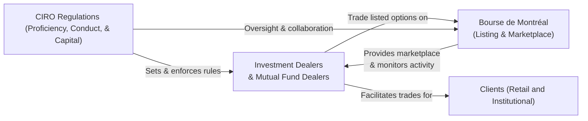

## 6.10 Role of CIRO and the Bourse de Montréal in Regulating Listed Options

Sometimes, I think back on my early days in finance: I remember watching with wide-eyed curiosity how all these investment firms, exchanges, and regulators came together to create a fair, transparent, and (hopefully) well-functioning derivatives market. It felt almost like watching a well-choreographed dance—though I’ll admit there were moments when it looked more like a chaotic mosh pit of competing interests. But once you understand the major players and their distinct roles, the entire show gets a lot less intimidating. In Canada, two major players that stand out for listed options regulation are the Canadian Investment Regulatory Organization (CIRO) and the Bourse de Montréal (often referred to as the Montréal Exchange or MX). 

CIRO, formed from the 2023 amalgamation of two predecessor SROs, is like the guardian angel of all investment dealers and mutual fund dealers across the nation. Meanwhile, the Bourse de Montréal is our prime marketplace for standardized derivatives, from equity and ETF options to index futures and options. This synergy between a national self-regulatory organization (CIRO) and a dedicated derivatives exchange (the Bourse) forms the support system for Canada’s thriving derivatives ecosystem. 

Below, we’ll explore how CIRO and the Bourse de Montréal regulate listed options—covering everything from membership requirements to best execution obligations. We’ll look at real-world scenarios, highlight common pitfalls, mention some personal experiences, and maybe toss in an “um” or two, just so it feels more like we’re chatting over coffee rather than reading a textbook.

### Big Picture: How CIRO and the Bourse de Montréal Work Together

Before we dive deep, here’s a visual cheat sheet of how these entities connect. Think of it like a quick reference guide:

In the diagram, you can see how CIRO, the national self-regulatory body, sets the overarching rules (including margin requirements, proficiency standards, and sales practices) for firms dealing in listed options. Those firms, in turn, become Approved Participants of the Bourse de Montréal (the exchange itself) if they wish to trade derivative products in Canada. Meanwhile, the Bourse sets its own listing rules, marketplace integrity requirements, and real-time trade surveillance. Both CIRO and the Bourse cooperate—exchanging information and expertise—to keep the derivatives market safe, transparent, and fair.

### CIRO: Canada’s National Self-Regulatory Organization

CIRO is something of a “one-stop shop” for investment regulation in Canada. If you’re old enough to recall the “before times,” you may remember the Investment Industry Regulatory Organization of Canada (IIROC) or the Mutual Fund Dealers Association (MFDA). Well, they merged into CIRO in 2023. Today, CIRO oversees:

• Conduct and proficiency requirements for all Canadian investment dealers and mutual fund dealers.  
• Registration of individuals who advise on, sell, or trade derivatives (including listed options).  
• Enforcement of margin rules and capital requirements to ensure firms can honor their clients’ trades.  
• Rules on best execution and fair dealing practices, so clients get the most advantageous terms possible.  
• Monitoring compliance with various regulations, including those related to trade surveillance and anti-money laundering.  

#### Why Margin Requirements Matter

Margin requirements are basically the capital buffer that an investor or dealer has to post when they enter a derivatives trade. They help ensure that if a position moves dramatically in the wrong direction, there’s enough money set aside to cover potential losses. I had my own brush with margin calls years ago—let’s just say it’s not fun having your phone buzz with the dreaded: “You need to deposit more funds.” And the bigger the trades, the more critical it is to abide by CIRO’s margin guidelines. The margin methodology for options specifically takes into account the strike price, volatility of the underlying asset, and the potential time to expiration. 

CIRO not only prescribes these margin requirements but also keeps checking whether dealers are collecting margin from their clients. If a dealer falls below certain capital thresholds, or if it fails to meet daily margin calls, CIRO can step in with disciplinary measures. This gives the entire market greater stability.

#### Best Execution and Trade Surveillance

CIRO also focuses on the principle of “best execution.” This means dealers must seek the most favorable terms for their clients when executing options trades. It can involve analyzing multiple marketplaces, though in Canada many listed options trade primarily through the Bourse de Montréal. Still, dealers need policies that demonstrate they’re pursuing the best possible result regarding factors like price, speed, and order size.

Trade surveillance is another hot topic. CIRO works with the Bourse and other Canadian regulators, like the Canadian Securities Administrators (CSA), to spot manipulative activities. If an investor or dealer tries to corner the market, places wash trades, or manipulates options prices, it typically shows up on monitoring systems. CIRO can investigate suspicious trades, impose sanctions, and share data with the Bourse de Montréal so the exchange can act swiftly to protect market integrity.

### The Bourse de Montréal: Canada’s Derivatives Marketplace

The Bourse de Montréal is the beating heart for standardized derivative products in Canada. It lists equity options, index futures and options, currency options (for certain major currency pairs), and a growing array of other contracts. It’s kind of like a big stadium where all these derivative trades happen. The Bourse’s job is to:

• Maintain Trading Infrastructure: Provide the electronic platforms and matching engines for transparent, efficient trading.  
• Establish Listing Standards: Determine what strikes, expirations, and contract sizes are available.  
• Conduct Real-Time Surveillance: Monitor all trades and quotes to identify suspicious market activity.  
• Approve Participants and Ensure Compliance: Only firms who meet the Bourse’s financial and operational tests can become Approved Participants and directly access the marketplace.  

On a personal level, I’ve always liked how the Bourse fosters a sense of community among Canadian practitioners—be they market makers, institutional traders, or retail investors—from the work they do with continuing education programs to the technology upgrades that keep the marketplace competitive. And (call me nostalgic) but walking into the Bourse building in Montreal a few years back felt like stepping into a hub of financial innovation.

#### Listing Standards and Property Rights

Options in Canada follow standardized terms: specified contract size, strike price intervals, expiration cycles, and so on. The Bourse decides these standards, ensuring that an investor walking into a Canadian bank or a brokerage platform sees consistent contract specs. The Bourse also looks out for property rights (intellectual property associated with certain indexes that underlie the options, for instance). If the Bourse wants to list an index option based on a proprietary benchmark, it negotiates licensing agreements with the index provider. 

Overall, standardization is the engine that makes listed options more liquid and transparent. Unlike over-the-counter options (which can be customized but lack a centralized marketplace), exchange-listed contracts at the Bourse are fungible—they can be offset by a matching trade at any time before expiration.

### Collaboration Between CIRO and the Bourse 

Sometimes, people wonder how these organizations share tasks. Let’s put it this way: CIRO and the Bourse communicate continuously, ensuring that suspicious trades are dealt with in near real time. If the Bourse sees unusual trading patterns, it can send an alert or file a report to CIRO. If CIRO has concerns about a firm’s capital adequacy, it can inform the Bourse. They’re each integral to Canada’s market integrity ecosystem and typically coordinate with each other—and, in complex cases, the CSA. 

### Being an Approved Participant: What It Means

To trade listed derivatives directly on the Bourse de Montréal, a firm must become an Approved Participant. This is no walk in the park. The Bourse reviews:

• The firm’s business model and scope (proprietary trading, agency trading, clearing, etc.).  
• Its internal controls and risk management systems.  
• Compliance history, including prior regulatory issues.  
• Financial health: does it meet the capital requirements set by CIRO and the Bourse?  

Approved Participants are subject to ongoing compliance obligations. For instance, if a firm hires a new options principal or changes its risk management policies, the Bourse might want to verify that those changes align with the rules. CIRO also keeps an eye on these same firms from a prudential standpoint (e.g., net capital, margin collection, client complaint handling).

### Real-World Example: Potential Market Abuse

Imagine a scenario: A large trader places huge buy orders on a particular stock option but cancels them quickly. Then the trader executes sell orders at a slightly inflated price. If repeated multiple times in quick succession, that might artificially move the market or mislead other investors about true demand. 

• The Bourse: Might detect the suspicious pattern in real time through its market surveillance systems and freeze the participant’s ability to trade.  
• CIRO: Could investigate the participant’s trading strategies, review any pattern of client complaints, and potentially sanction the firm if the trader is an employee, or if compliance oversight is lacking.  

Because both the Bourse and CIRO have regulatory authority, they can coordinate on disciplinary actions. This dual layer of oversight aims to close any loopholes that might otherwise let manipulative activity thrive in the cracks.

### Glossary

Approved Participant (Bourse de Montréal)  
: A firm authorized to trade listed derivatives directly on the Bourse. It must meet the Bourse’s membership criteria and ongoing compliance obligations.

Market Integrity  
: The overall fairness, efficiency, and transparency of the trading environment. Both CIRO and the Bourse uphold market integrity by enforcing rules against fraud, manipulation, and other misconduct.

Margin Requirements  
: The capital that must be deposited to cover potential losses on open derivatives positions. CIRO enforces these requirements to ensure firms and clients remain solvent in volatile markets.

Trade Surveillance  
: The process of continuously monitoring trading activity—often using sophisticated algorithms—to detect market abuses such as front-running, spoofing, or manipulation.

Best Execution  
: The principle requiring dealers to obtain the most advantageous terms for clients, considering price, speed, order size, and other relevant factors.

### Regulatory Framework in Action

You might see references to the Canadian Securities Administrators (CSA) and their harmonized approaches (like National Instrument 94-101) that outline rules for derivatives clearing, or National Instrument 94-102, which deals with trade reporting. Both CIRO and the Bourse follow these CSA directives. CIRO also issues its own regulatory notices (found at https://www.ciro.ca) that keep dealers and advisors up to date. Similarly, the Bourse publishes its rule books and directives (accessible at https://www.m-x.ca), providing explicit instructions and updates for Approved Participants.

### Case Study: A Small Dealer Enters the Options Market

Let’s say a mid-size investment firm—call it Maple Leaf Capital—wants to offer listed options to its clients. Maple Leaf starts by registering with CIRO and confirming it meets capital requirements. Once Maple Leaf obtains CIRO membership, it applies to the Bourse to become an Approved Participant for options. The Bourse reviews Maple Leaf’s internal risk management, ensures it has robust compliance processes, and checks for trade reporting capabilities.

• If Maple Leaf passes, it’s granted Approved Participant status.  
• Maple Leaf’s employees who handle option client files must meet CIRO’s proficiency requirements, typically including passing recognized derivatives courses and fulfilling ongoing continuing education.  
• Maple Leaf must abide by all margin policies—ensuring that both its retail and institutional clients deposit sufficient collateral.  
• Maple Leaf must implement best execution policies, analyzing relevant data from the Bourse’s electronic order book.  

Down the road, if Maple Leaf experiences a capital shortfall—say in the wake of a major market downturn—CIRO steps in to enforce minimum capital thresholds. Meanwhile, the Bourse might monitor Maple Leaf’s daily trading to ensure no excessive risk-taking is occurring that might jeopardize market stability. If Maple Leaf fails to rectify its capital deficiency, it risks suspension of membership or other disciplinary actions. 

### Technology and Ongoing Developments

Both CIRO and the Bourse use cutting-edge technology for real-time monitoring and data analysis. Post-pandemic, with the shift to more electronic order routing and algorithmic trading strategies, the need for advanced surveillance has never been greater. The Bourse’s systems can detect anomalies in hundreds of thousands of daily trades. CIRO leverages these data feeds to identify outliers in margin usage or trade patterns that jump out as unusual.

Another big highlight is the Bourse’s user-defined strategies (UDS) functionality, which allows participants to create custom multi-leg options orders. If you trade things like a straddle or an iron condor, the Bourse’s matching engine will handle those multi-leg orders seamlessly. CIRO ensures that dealers offering these complex strategies still comply with the relevant margin and risk disclosure rules for clients.

### Conclusion

In short, CIRO and the Bourse de Montréal form a formidable duo in Canada’s listed options marketplace. CIRO ensures that dealers are financially stable, compliant with conduct rules, and aligned with best execution and margin requirements. The Bourse manages the marketplace itself, setting contract terms, facilitating transparent trading, and conducting real-time surveillance. Together, they protect market participants—large and small—by promoting market integrity, enforcing fair practices, and fostering an environment where investors can trade with confidence. 

If you ever find yourself lost in the labyrinth of derivatives regulations, just remember: one entity (CIRO) sets the standards for who can play and how (i.e., the dealers’ conduct and capital requirements) and the other (the Bourse) is the main stage where the actual “show” (options trading) takes place. Each has separate but interlocking responsibilities. 

For more details, you can explore:
• CIRO Regulatory Notices: https://www.ciro.ca  
• Bourse de Montréal – Rule Books and Directives: https://www.m-x.ca  
• CSA’s harmonized derivatives regulations (e.g., NI 94-101, NI 94-102)  

This is just the tip of the iceberg, but hopefully it helps you see how the market’s moving parts fit together. By aligning capital requirements, marketplace standards, and real-time enforcement, CIRO and the Bourse de Montréal strive to keep Canada’s listed options markets safe and transparent for everyone.

---

## Sample Exam Questions: Role of CIRO and the Bourse de Montréal in Regulating Listed Options



### Which statement best describes the primary role of CIRO in the Canadian derivatives market?

- [ ] It is responsible for supplying real-time price feeds for all listed options.
- [x] It sets and enforces conduct, margin, and capital requirements for investment dealers and mutual fund dealers.
- [ ] It directly provides clearing services for all derivative trades.
- [ ] It manages the licensing of proprietary indexes.

> **Explanation:** CIRO is Canada’s national self-regulatory body that oversees investment dealers and mutual fund dealers. It enforces conduct standards, proficiency requirements, and margin/capital rules to protect investors and maintain market integrity.

### What is a key responsibility of the Bourse de Montréal in listed options trading?

- [ ] Setting regulatory policy for all financial intermediaries in Canada.
- [x] Managing the marketplace where listed derivative instruments, including options, are traded.
- [ ] Overseeing capital adequacy for all Canadian dealers.
- [ ] Monitoring commodity spot prices for official government publication.

> **Explanation:** The Bourse de Montréal provides the marketplace for trading options contracts and futures, sets listing standards, and conducts real-time trade surveillance.

### Which of the following is among the margin-related responsibilities of CIRO?

- [x] Requiring dealers to maintain sufficient capital to meet potential losses.
- [ ] Determining the strike price intervals on listed options.
- [ ] Establishing the tick size for options quotes.
- [x] Ensuring that investment dealers collect margin from clients in line with CIRO’s guidelines.

> **Explanation:** CIRO enforces margin rules to ensure firms can handle position losses. The Bourse sets contract specifications such as strike intervals or tick sizes.

### An Approved Participant at the Bourse de Montréal is a firm that:

- [x] Meets the Bourse’s financial and operational standards to trade derivatives directly on the exchange.
- [ ] Only trades private equity offerings.
- [ ] Operates primarily as a mutual fund dealing representative.
- [ ] Issues self-directed RRSP accounts to retail investors exclusively.

> **Explanation:** An Approved Participant is a firm authorized by the Bourse to access its marketplace for trading listed derivatives, subject to meeting certain financial and compliance criteria.

### If the Bourse de Montréal detects suspicious trading behavior, how does CIRO typically become involved?

- [ ] CIRO only interprets margin requirements and has no role in trade surveillance.
- [x] CIRO may coordinate with the Bourse to investigate the suspicious trades, possibly enforcing disciplinary measures on member firms.
- [ ] CIRO sets new product listings for derivatives.
- [ ] CIRO cannot investigate unless the behavior concerns an over-the-counter product.

> **Explanation:** Trade surveillance is collaborative. The Bourse may identify potential manipulation and share this information with CIRO, which can then investigate and sanction member firms if misconduct is found.

### Which term refers to the principle requiring dealers to pursue the most advantageous terms for executing client orders?

- [ ] Best interest standard
- [ ] Permitted client principle
- [x] Best execution
- [ ] Right of offset

> **Explanation:** “Best execution” compels dealers to find the highest quality execution for their clients, considering factors such as price, speed, fill quality, and total cost.

### What is the function of margin requirements when trading listed options?

- [x] Ensuring that the investor or firm can cover potential losses in case of adverse price movements.
- [ ] Protecting the clearing corporation from technology outages.
- [x] Providing a mechanism for CIRO to measure financial risks faced by dealers.
- [ ] Preventing the listing of new option strikes.

> **Explanation:** Margin requirements help manage financial risk by making traders deposit collateral for potential losses. CIRO oversees these requirements for dealers.

### True or False: The Bourse de Montréal and CIRO often collaborate and share information to maintain a fair and transparent marketplace.

- [x] True
- [ ] False

> **Explanation:** They frequently communicate on trade surveillance, capital requirements, and regulatory enforcement, ensuring market integrity.

### Which agency’s regulations (e.g., NI 94-101, NI 94-102) do both CIRO and the Bourse de Montréal follow when monitoring derivatives trades?

- [ ] Canada Revenue Agency (CRA)
- [ ] Bank of Canada
- [x] Canadian Securities Administrators (CSA)
- [ ] The Canadian Investor Protection Fund (CIPF)

> **Explanation:** The CSA coordinates and harmonizes Canadian securities regulations, providing national instruments that guide derivatives oversight.

### Which outcome can occur if a CIRO-member dealer repeatedly fails to maintain minimum margin and capital requirements for listed options?

- [x] The dealer may face disciplinary actions, including suspension or termination of membership.
- [ ] The dealer will automatically have its Bourse membership upgraded to premium status.
- [ ] The dealer can continue operating with no consequences if it is an Approved Participant.
- [ ] The dealer can ignore CIRO rules if it discloses the shortfall to clients.

> **Explanation:** CIRO enforces capital and margin thresholds. Repeated failures can lead to severe penalties, including suspension or termination.


