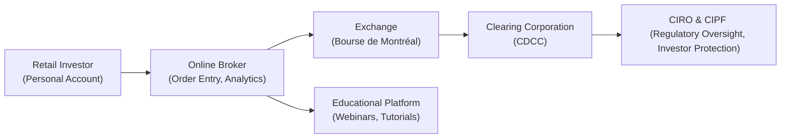

## 6.11 Retail Growth in Options Markets (Lower Commissions, Educational Platforms)

Imagine you’re chatting with a friend over coffee—maybe that friend is a bit intrigued by the concept of options but isn’t completely sure how they work or why they’re suddenly so popular for everyday folks. So, I’ll try to explain what’s been going on in the Canadian options scene lately, especially how lower commissions and robust educational tools are reshaping the retail landscape.

Lower brokerage commissions, user-friendly applications, and “educational platforms” have all combined to open the door for a growing number of retail investors—people trading in their personal capacity rather than handling funds for a big institution—to experiment with options. It’s a significant reason why interest in options trading has expanded rapidly in Canada over the past decade.

In this article, I’ll detail the background, discuss the technology and platforms driving retail traction, explore educational resources, reflect on regulatory considerations from the Canadian Investment Regulatory Organization (CIRO), and suggest further reading and references.

--------------------------------------------------------------------------------

### The Historical Context of Retail Options Trading

Options trading used to be this exclusive club where institutional investors, hedge funds, and advanced traders called the shots. Everyone else faced high commission costs, complicated order-entry systems, and plenty of friction whenever they wanted to trade. Well, times have changed:

• Commissions have dropped significantly, often by more than 50% of what they used to be just a decade ago.  
• Platforms have become more intuitive, so you don’t need to be a tech wizard to place an order.  
• Online brokers have recognized a growing appetite among individual clients to learn about options, and they now provide resource libraries filled with videos, live webinars, and even interactive courses.  

It’s sort of like how smartphone apps turned booking a vacation from a headache into a breeze: technology lowered the bar to entry, and now basically everyone can take part.

--------------------------------------------------------------------------------

### Why Options? A Quick Refresher

Before we jump into the commission discussion, let’s remind ourselves why retail investors might be drawn to options:

• **Leverage**: With a fraction of the capital needed for an outright stock position, investors can control a similar quantity of shares using call options or put options (though leverage cuts both ways—profits and losses can both be magnified).  
• **Hedging**: Options can help you protect an existing portfolio. For instance, you might purchase puts to limit downside risk on a big stock position.  
• **Flexibility**: Options can be combined in countless ways—spreads, combinations, straddles—to craft risk/reward profiles that match specific objectives or outlooks.

In Canada, you’ll see these trades executed on recognized platforms like the Bourse de Montréal. But that’s only the start. Let’s focus on the new phenomenon: the surge of retail involvement fueled by lower commissions and easy-to-use platforms.

--------------------------------------------------------------------------------

### The Impact of Lower Commissions

There was a time—and I remember this well—when paying $30 or $50 for a single options trade was not out of the norm. For an ordinary investor, that’s a lot of money! It almost felt like you had to be an institution with deep pockets to make it all worth it. Now, many Canadian brokerages have slashed their commission rates substantially. For example:

• Some brokers charge a fixed rate of around $6.95 or $9.95 per trade plus a per-contract fee (often under a dollar).  
• Others offer tiered commissions, so the more you trade, the cheaper each trade becomes.  

For a trade involving, say, five contracts, your total cost might now be under $10 with certain promotions or fee structures. That’s a game-changer for someone who wants to experiment but doesn’t have a giant portfolio. Reduced trading fees also lower the breakeven threshold on many strategies. 

#### Transparent Fee Disclosures and CIRO Oversight

CIRO, serving as the primary self-regulatory organization for investment dealers and mutual fund dealers in Canada, emphasizes that dealers disclose fees transparently. Its Client Relationship Model (CRM) guidelines require clear communication about commissions, spreads, and any other charges. When fees come down, it’s easier for advisors to illustrate the cost-effectiveness of certain trades—and, of course, it becomes more feasible for retail participants to try out new strategies.

--------------------------------------------------------------------------------

### Educational Platforms for Retail Investors

It’s not just about cost. The broad expansion of educational content is another driving force behind retail growth. Let’s face it: options can feel complicated. Terms like “Greeks,” “implied volatility,” and “time decay” can sound like a foreign language. But now:

• **Webinars**: Many brokers—like Questrade, BMO InvestorLine, and RBC Direct Investing—hold free online seminars on navigating their platforms and exploring basic to intermediate strategies (e.g., covered calls, protective puts).  
• **Paper Trading**: Simulation or “paper trading” accounts let you practice with virtual money. It’s like learning to ride a bike—but with training wheels that ensure you’re not risking real capital.  
• **Free Courses**: Some brokerages partner with third-party education providers to offer structured modules. Self-paced lessons, quizzes, and interactive tasks help users stay motivated.  
• **Analytics Tools**: Retail-friendly analytics dashboards now show real-time graphs of implied volatility, daily price fluctuations, or rudimentary scenario analyses that used to be the domain of professional trading desks.

All these developments mean the average person can start an “options 101” webinar on Monday and be placing a small—yet real—options trade by Friday, having gained enough confidence to at least give it a try with minimal risk. Are they all going to succeed right away? Of course not, but the barrier to practicing in a safe environment (paper trading) is practically zero.

--------------------------------------------------------------------------------

### A Quick Glance at an “Educational Path” 

Often, a newbie’s education journey looks something like this:

1. **Curiosity**: Perhaps they hear about options from a friend or see it in financial headlines.  
2. **Webinars**: They attend an introductory webinar (often free) focusing on calls, puts, and basic examples like covered calls.  
3. **Paper Trading**: They sign up for a demo platform, place a few trades using hypothetical money.  
4. **Basic Strategies**: They might test out a covered call on a widely known Canadian stock or an index ETF.  
5. **Live Trading**: Feeling a bit more comfortable, they make a small live trade, all the while referencing educational content and market news.  

--------------------------------------------------------------------------------

### Advanced Analytics for Everyone

One of the thrills for new traders is exploring advanced analytics. Back in the day, reading a “Greek” like Delta or studying option volatility charts was pretty intimidating—and often you had to rely on expensive third-party software or specialized trade publications. Now, many major Canadian online brokerages include free integrated tools. You can:

• Plot implied volatility for an option chain.  
• See an interactive payoff diagram for your trade.  
• Evaluate potential outcomes based on time decay (Theta) or changes in underlying price.  

It’s almost like completing a puzzle. So, if you’re a data geek (or just curious), advanced analytics can be fascinating. Bear in mind, though, that just because the data is available doesn’t guarantee success. It’s how you interpret and act on it that matters.

--------------------------------------------------------------------------------

### Varieties of Retail Traders

Retail investors aren’t one homogenous group. From the vantage point of Canadian brokerages, you’ll see them branch into all sorts of categories:

1. **Buy-And-Hold Investors**: They traditionally invest in equities, ETFs, and mutual funds—and sometimes dip their toes into a covered call or a protective put to hedge a longstanding position.  
2. **Enthusiastic Newcomers**: Often younger, social media-savvy folks who got curious about derivatives from online forums or influencer videos. They’re big on learning from free training accounts and can be quick to experiment.  
3. **Seasoned Hobbyist Traders**: Possibly retirees with time on their hands, or professionals who love the challenge of the markets. They enjoy reading about advanced option strategies and might incorporate more complicated spreads.  
4. **Frequent Traders**: They have discovered that short-term option trading can be exciting (though risky) and use advanced analytics daily.  

No matter the group, educational resources shape how they approach the market, equipping them with knowledge on the pros and cons—and hopefully reminding them to keep risk in check.

--------------------------------------------------------------------------------

### Case Study: From Simulation to Real Trading

Let’s do a mini case study that highlights how lower commissions and educational platforms combine for a real-life scenario:

- **Meet Anita**: She’s 30, works in tech, and invests mostly in index ETFs. She keeps hearing about “covered calls”—like how they can generate extra income from stocks she already owns.  
- **Access to Education**: Anita sees that Questrade has a “How to Write Covered Calls” webinar series archived on its website. She watches a few modules, taking notes.  
- **Simulation Mode**: She decides to open a paper trading account. She picks a well-known Canadian bank stock in her fantasy portfolio, writes a covered call, and observes how the trade evolves over two weeks.  
- **Transition to Real Account**: Feeling comfortable, she invests real money in the same bank stock and sells a covered call. The commission is a flat $4.95 plus $0.75 per contract, which totals under $7. It’s affordable.  
- **Outcome**: She obtains a small premium. If the stock stays below the strike price, she keeps the premium. If it goes above, she’ll still pocket some gains, although she might lose out on some upside.  

In Anita’s view, this trade is better for her than a short-term speculation on a leveraged ETF or a single high-risk stock. She’s leaning on an approach that aligns with her moderate risk tolerance, thanks in large part to the thorough educational content she consumed and the low commissions that make the trade feasible.

--------------------------------------------------------------------------------

### Suitability Requirements and CIRO Guidance

Now, I know I’ve probably made it sound easy. But we ought to remember that options strategies come with substantial risk complexities. This is precisely where CIRO’s guidelines on suitability come in. Under its rules:

- Dealers and advisors must understand each client’s financial situation, investment knowledge, and risk tolerance.  
- A recommended product or trade—like a bull call spread or writing uncovered calls—must align with the client’s objectives and ability to take losses.  
- Dealers must provide risk disclosures that define the potential downsides of margin accounts, short options, or other leveraged strategies.  

It’s an ongoing process. Even if you sign up for a self-directed online account, the platform typically requests you fill out a client profile or risk questionnaire. If you’re deemed too inexperienced or have a very low risk tolerance, certain advanced options privileges might be restricted.

--------------------------------------------------------------------------------

### Risk Management 101

One reason that many new additions to the retail space eventually succeed—or at least avoid catastrophic losses—is that they learn how to manage risk. Common risk management tactics taught in educational platforms and recommended by industry professionals include:

1. **Position Sizing**: Don’t risk your entire account on a single option trade.  
2. **Stop Orders**: Limit potential losses by automatically closing a position if it moves against you.  
3. **Simple Strategies**: Start with basic covered calls and protective puts, gradually working your way into more advanced spreads.  
4. **Diversification**: It’s not all about one big bet. Keep the rest of your portfolio balanced.  
5. **Scenario Analysis**: Many platforms let you “slide” the underlying price up or down and see how your option’s value might change.  

Sure, the disclaimers can be a bit tedious. But it’s a discipline that pays off in the long run.

--------------------------------------------------------------------------------

### Technology and User Experience

A major contributor to the retail shift involves the intuitive design of trading interfaces. Let’s consider the old days: you’d have a “telequote machine” or a basic website that posted archaic tick data. Executing a single options contract required:

1. Manually pulling up an options chain.  
2. Sorting out the contract’s symbol.  
3. Calling an order desk or using a clunky interface to place an order.  
4. Paying a phone order commission if you messed up the online route.

Today, we have:

• Real-time quotes in a slick interface.  
• Interactive charts, including candlestick patterns and implied volatility ranges.  
• Instant confirmations and easy order modifications.  
• Mobile apps that let you roll an option (i.e., close an existing position and open another) in seconds.  

It’s not perfect, of course. Glitches happen, and sometimes the sheer volume of features can overwhelm a newbie. That’s why well-designed educational content for navigating the interface is crucial.

--------------------------------------------------------------------------------

### A Visual Overview of the Retail Options Trading Ecosystem

The following diagram shows a simplified perspective of how a retail investor interacts with the broader options market in Canada. Note that each box represents a major participant or step:

• The Retail Investor logs onto an online broker’s platform.  
• The Online Broker routes the trade to the Exchange for execution.  
• The Exchange matches the trade and reports it to the Clearing Corporation.  
• CIRO provides ongoing oversight to ensure fair dealer/broker practices, while CIPF offers investor protection in case a member firm becomes insolvent.  
• The Educational Platform might operate in tandem with the online broker, offering resources that shape the investor’s decisions.

--------------------------------------------------------------------------------

### CIRO’s Role in Safeguarding Retail Investors

Since January 1, 2023, Canada’s main self-regulatory body has been CIRO, which oversees both investment dealers and mutual fund dealers. CIRO ensures:

- Adequate capital requirements for brokerages and dealers, so they remain solvent.  
- Enforced risk disclosure rules, especially around derivatives.  
- Adequate compliance structures so that a broker’s employees are properly trained and supervise client accounts responsibly.  
- A strong emphasis on the “Know Your Client” and “Suitability” processes that help maintain healthy shopper protections in a world that can be high risk.

So yes, you can blame CIRO if you find yourself completing extra forms verifying your knowledge or acknowledging risk disclaimers. But as someone who remembers the days of minimal guidelines, I think it fosters a safer environment for those just learning the ropes.

--------------------------------------------------------------------------------

### Additional Regulatory and Self-Policing Mechanisms

• **IIROC and MFDA**: Predecessor agencies to CIRO. Historically, they oversaw the industry in separate realms, but as of 2023 they were folded into the new body. It helps unify regulation so that dealers can follow consistent guidelines.  
• **CIPF**: The Canadian Investor Protection Fund. If your broker becomes insolvent, CIPF steps in to protect your assets, up to certain limits.  
• **CSA**: The Canadian Securities Administrators is an umbrella organization of provincial and territorial regulators. They might issue notices or bulletins that can affect options regulation at a local level.  

--------------------------------------------------------------------------------

### Balancing Growth with Caution

So we have more people trading options, right? That’s awesome for market liquidity. But it also raises concerns about:

- **Speculative Frenzies**: Social media “hypes” a particular stock, and thousands of new traders might buy short-dated call options. If they’re not fully aware of the risk, well, that can be a recipe for disappointment.  
- **Complex Strategies**: You can stack on multiple legs in one order to build sophisticated trades like iron condors or butterflies. If you don’t fully grasp your maximum possible loss, there could be big surprises.  
- **Market Volatility**: Retail demand can heighten volatility in certain underlyings, especially smaller-cap Canadian stocks.  

That’s why I think the emphasis on educational content and practice accounts is so critical: you want to “try before you buy,” especially with derivatives.

--------------------------------------------------------------------------------

### Tips and Best Practices for New Retail Option Traders

Thinking about diving in yourself? Here are some tips that might save you a headache:

1. **Study, Then Study Some More**  
   There are endless free resources. “The Rookie’s Guide to Options” by Mark D. Wolfinger is widely praised for its clarity. Keep in mind that many examples reference U.S. markets, but the basics apply in Canada too.

2. **Paper Trade Before Risking Real Capital**  
   If your online broker (or a third-party site) allows simulation, take advantage of it. Track your trades, see how you’d respond if the market turned. 

3. **Know Your Greeks**  
   Even a basic understanding of Delta, Gamma, Theta, and Vega can prevent unwelcome surprises. For instance, it’s wise to know how time decay can suddenly cause an option’s value to drop faster than you expect.

4. **Check Out CIRO Resources**  
   The official CIRO website (https://www.ciro.ca) often posts investor alerts, bulletins, or guidelines that you might find relevant. You can sign up for their bulletins or follow them on social media for updates.

5. **Set Up Alerts**  
   On your trading app, create alerts for price changes or volume spikes. This lets you track your positions in real time so you can react if something unexpected occurs.

6. **Keep Risk in Perspective**  
   Options can go to zero in a heartbeat, especially short-dated out-of-the-money calls or puts. Being aware of maximum possible losses is essential for a healthy trading experience.

7. **Stay Diversified**  
   I know it can be thrilling to find that “one big trade,” but it’s often more prudent to spread out your exposure over multiple underlying assets or strategies.

--------------------------------------------------------------------------------

### Leveraging Open-Source Tools

Beyond what your broker might provide, you can supplement your analysis with open-source financial tools:

- **Python Libraries**: Tools like NumPy, pandas, and matplotlib can help you build your own payoff diagrams or historical volatility analysis.  
- **R Packages**: If you’re more comfortable with R, packages like “quantmod” or “TTR” allow you to programmatically fetch price data and run custom analytics.  
- **Online Data Feeds**: Some websites offer free or low-cost API access to price data. This can be valuable if you enjoy coding your own solutions.  

If that sounds out of reach, no worries—some folks thrive with purely broker-provided tools. But if you love number-crunching or coding, these open-source avenues make it fun and flexible.

--------------------------------------------------------------------------------

### Common Pitfalls in the Retail Options Boom

1. **Overleveraging**: New traders sometimes get hooked by leverage, thinking a small capital outlay means minimal risk. Actually, the potential losses can be tremendous.  
2. **Ignoring Commissions**: Even if commissions are lower, they can still add up. Especially if you’re scalping (i.e., chasing small gains repeatedly).  
3. **Chasing “Meme” Stocks**: Popular on social media but extremely volatile. If you’re not prepared to stomach wild price swings, it might be best to sidestep them.  
4. **Not Using Stop-Loss Orders**: Some folks try to guess the market and freeze when it goes against them, letting losses escalate.  
5. **Neglecting Tax Implications**: Gains or losses from options can be taxed differently than stocks under certain scenarios, so keep good records and consult a professional if necessary.

--------------------------------------------------------------------------------

### Personal Reflections

I still remember my first attempt at options about 15 years ago. There was no such thing as a user-friendly “tutorial” section on my brokerage site. I basically had to read a 200-page book, interpret text-based quotes from a “Level II” feed, and hope I typed in the right ticker symbol. It was nerve-wracking.

Now, it’s almost the opposite problem: there’s so much information and so many features that you can get overwhelmed. But in my opinion, that’s a good sign. It means Canadian retail traders have resources that people only dreamed of back in the day. Between free YouTube channels, broker-run webinars, simulated trading accounts, and advanced analytics built right into the platform, you have the building blocks to become a capable options trader—if you put in the time and stay disciplined.

--------------------------------------------------------------------------------

### Conclusion

Retail growth in the Canadian options market arises from a constellation of factors—lower commissions, more accessible interfaces, robust educational content, and stronger regulatory oversight from CIRO that ensures these investments are handled ethically and responsibly.

For newcomers, this is a golden era. You can learn at your own pace, practice with minimal cost, and execute strategies with a handful of clicks. That said, it’s vital to remember that while options *can* enhance returns and manage risk, they also introduce complexities that require a good deal of study and discipline.

Used wisely, options open up a world of possibilities. So if you find yourself discussing “the Greeks” at your next dinner party or explaining to someone how you wrote your first covered call, you’ll know you’re part of this dynamic wave shaping the future of retail investing in Canada.

--------------------------------------------------------------------------------

### Further Exploration and References

- **CIRO (Canadian Investment Regulatory Organization)**:  
  Official regulatory body website: [https://www.ciro.ca](https://www.ciro.ca)  
  Search for investor alerts, updated regulations, and bulletins on derivatives.
  
- **The Rookie’s Guide to Options by Mark D. Wolfinger**:  
  A beginner-friendly but thorough introduction to options. Some examples focus on the U.S. market; the core principles remain relevant in Canada.

- **Broker Education Hubs**:  
  - Questrade: [https://www.questrade.com](https://www.questrade.com)  
  - BMO InvestorLine: [https://www.bmo.com/investorline/](https://www.bmo.com/investorline/)  
  - RBC Direct Investing: [https://www.rbcroyalbank.com/direct-investing/](https://www.rbcroyalbank.com/direct-investing/)  
  Each broker typically includes tutorial videos, webinars, and strategy guides.

- **Open-Source Tools**:  
  - Python’s “yfinance,” “pandas,” “NumPy”  
  - R’s “quantmod,” “TTR”  
  Great for building your own analytics, testing custom strategies, or just learning the programming side of finance.

- **CSA (Canadian Securities Administrators)**:  
  Official site: [https://www.securities-administrators.ca](https://www.securities-administrators.ca)  
  Collectively coordinates regulation across provinces. 

- **Paper Trading Platforms**:  
  Many brokers offer demo accounts; examine your preferred broker’s website for details.
  
--------------------------------------------------------------------------------

## Sample Exam Questions: Retail Options Markets Expansion & Practices



### Which factor has contributed most significantly to the recent boom in retail options trading in Canada?

- [x] Lower brokerage commissions and improved online trading platforms.
- [ ] Government-mandated adoption of advanced options courses in high schools.
- [ ] Closure of all proprietary trading desks at major banks.
- [ ] Elimination of margin requirements for retail investors.

> **Explanation:** Lower commissions, streamlined platforms, and better educational resources have collectively made options trading more accessible to retail investors.

### Which of the following is NOT a benefit commonly associated with paper trading?

- [ ] Practicing strategies without risking real money.
- [ ] Familiarizing oneself with a brokerage platform interface.
- [ ] Gaining deeper insights into time decay.
- [x] Generating actual profits for the account.

> **Explanation:** Paper trading uses virtual funds; while you can gain experience, there are no real monetary gains or losses because the dollars aren’t real.

### What primary role does CIRO play in Canada’s derivatives markets?

- [x] It serves as the national self-regulatory body overseeing investment dealers and market integrity for both equities and derivatives.
- [ ] It acts as the government entity that sets all brokerage commissions.
- [ ] It creates new option products for exchanges.
- [ ] It arbitrarily determines which stocks are optionable each year.

> **Explanation:** CIRO sets guidelines, oversees compliance, and ensures investor protection and market integrity. It does not set commissions or create products.

### What is a common approach to risk management for new retail traders?

- [ ] Trading as many contracts as possible to maximize potential profit.
- [x] Keeping a small position size relative to their account value.
- [ ] Completely ignoring time decay because it only affects professional traders.
- [ ] Relying on margin loans to hedge risk.

> **Explanation:** Most educators recommend conservative position sizing, especially for newcomers, to manage potential losses effectively.

### Which of the following strategies might a buy-and-hold investor employ to generate additional income from a stock that they already hold?

- [x] Writing a covered call option.
- [ ] Buying a protective put option and not selling anything.
- [ ] Engaging in a short straddle around an index ETF.
- [ ] Purchasing a far out-of-the-money call on a different underlying.

> **Explanation:** The covered call strategy involves selling call options on shares you hold, generating extra income if the call expires out-of-the-money.

### Which statement best describes the function of paper trading for a beginner?

- [x] Paper trading allows a trader to test strategies in a simulated environment without risking real capital.
- [ ] Paper trading creates an immediate, guaranteed profit for beginners.
- [ ] Paper trading is only available to institutional investors.
- [ ] Paper trading automatically ensures success when transitioning to live markets.

> **Explanation:** Paper trading provides a risk-free platform to learn and practice—yet it doesn’t guarantee success once transitioning to real-money trading.

### Under CIRO guidelines, which regulatory mechanism must brokers practice to confirm that a recommended options strategy is appropriate for a particular client?

- [x] Suitability requirements.
- [ ] Random assignment.
- [ ] Mandatory profit-sharing agreements.
- [ ] Institutional membership obligations.

> **Explanation:** Brokers must ensure any recommendation aligns with the client’s risk tolerance, experience, and objectives, which is known as suitability.

### According to the article, which of the following is a recognized advantage of lower commission rates?

- [x] Lowering the breakeven point on many options trades.
- [ ] Ensuring zero losses on all covered call trades.
- [ ] Eliminating the need for risk management protocols.
- [ ] Instituting strict government policies to curb speculation.

> **Explanation:** Reduced commissions make options trades more cost-competitive, potentially lowering the breakeven point and making them more attractive to smaller accounts.

### Why might advanced analytics, like the Greeks, be useful for retail traders?

- [x] They help traders understand how an option’s price might change under various conditions, such as shifts in underlying price, volatility, or time.
- [ ] They guarantee a profitable trade regardless of market movements.
- [ ] They are required by CIRO for all retail accounts.
- [ ] They eliminate the need for fundamental or technical analysis.

> **Explanation:** Analytics, particularly the Greeks, provide deeper insight into the behavior of option prices, enabling more informed decisions around risk and strategy.

### True or False: Under CIRO rules, a brokerage can allow new clients to trade highly complex option spreads on day one without any risk disclosures or suitability checks.

- [ ] True
- [x] False

> **Explanation:** Brokers must comply with CIRO’s guidelines on suitability, which demand risk disclosures and an assessment of the trader’s knowledge and financial situation before granting advanced options privileges.


