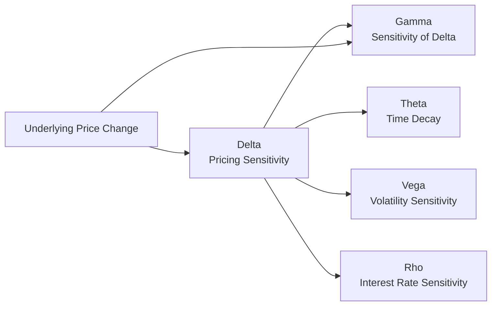

## 6.12 Introduction to Option Greeks (Beyond Delta)

Have you ever looked at an option’s Delta and thought, “Okay, that’s nice, but what happens if the underlying stock really starts moving, or if time passes, or if volatility shoots up?” If so, you’re already brushing up against the limitations of simply knowing Delta. Options are dynamic instruments; they shift and swirl in value from day to day (and sometimes minute to minute) based on price movements, volatility changes, time decay, and even interest rates. So, let’s take a look at four other major “Greeks” that let us peek under the hood of options pricing: Gamma, Theta, Vega, and Rho. These measures are critical in advanced risk analysis, portfolio hedging, and scenario planning. They also happen to be part of the essential tool kit that CIRO expects licensed professionals to understand for effective client guidance.

I remember the first time I realized I couldn’t rely on Delta alone. I was trading a handful of index options, thinking, “I’ve got a handle on my risk.” Then, out of nowhere, the market moved abruptly, and my position’s P/L changed way more than Delta had indicated. A colleague at the time laughed and said: “Yep, you found Gamma the hard way!” It was a bit embarrassing. But that got me excited about truly understanding all the Greeks, not just Delta.

Below, we’ll explore each of these advanced Greeks, discuss how they’re computed (at least in conceptual terms), and show why they’re vital for anyone who’s serious about option trading.

---

### Why Look at More Than Delta?

Delta is awesome. It’s the first Greek many of us learn, giving a straightforward snapshot of how an option’s value changes in response to small shifts in the underlying asset’s price. But an option’s risk profile can evolve quickly. Delta isn’t the full story—it’s just the beginning. Picture Delta as your immediate speed. You still need to know how that speed might accelerate or brake (Gamma), how your “fuel” or time is burning away (Theta), how the environment (in this case, volatility) changes your plan (Vega), and how changing interest rates could tweak your path (Rho).

For instance, you might be all set with a bullish call option. Delta says, “Hey, if the stock goes up by $1, your position stands to gain, say, $0.45.” Great. But if the stock jumps by $2 or more, that Delta itself starts to shift (Gamma at work!), and your position might gain at a faster or slower rate than you expected. Ignoring Gamma is like ignoring that your speedometer is changing faster than you anticipated—you only see it after you zoom past the limit. Theta, meanwhile, is like a slow drip on your position’s wallet, draining away time value each day. Vega jumps into the spotlight when the market’s implied volatility suddenly pivots. And Rho is there to remind you that interest rates don’t stand still forever—though in many markets they move slowly, they can still pack a punch for your longer-dated options.

---

### Gamma: Acceleration or “Delta on Delta”

Gamma measures the rate of change in Delta. A higher Gamma means your Delta will shift quickly if the underlying asset’s price moves. This is one reason that at-the-money options, especially when close to expiration, can be tricky: they often carry higher Gamma, meaning Delta can change abruptly with each small movement in the underlying price.

• If you are long options (like a long call or long put), you’ll generally have positive Gamma. That means if the underlying moves up, your Delta can become more positive (for calls) or less negative (for puts), enhancing your gains on the subsequent move.  
• If you are short options, you’re carrying negative Gamma. When the underlying moves, your position’s Delta will change in a way that can exacerbate losses.

From a risk management angle, Gamma is crucial: if you’re short a bunch of near-the-money options, you should keep a close eye on how quickly your net Delta can swing around after even minor price movements. Market makers, for instance, monitor Gamma in real time, adjusting their hedge positions as the underlying price moves. They don’t want to wake up to huge unhedged exposures if the market leaps overnight.

To visualize the relationship among these Greeks, let’s use a Mermaid diagram:

In this diagram, we see that underlying price changes directly impact Delta, but Gamma is the lynchpin that tells us how Delta itself will morph as the underlying continues to fluctuate.

#### A Quick Gamma Example
Imagine you own a call option with a Delta of 0.40 and a Gamma of 0.05. If the underlying stock moves up by $1, your new Delta might increase to 0.45 (because 0.40 + 0.05 = 0.45). On the next $1 move, your option position’s P/L might behave differently than on the first dollar move because you’re operating with that new Delta. Over a multi-dollar move, ignoring Gamma in your risk calculation can lead to big surprises.

---

### Theta: The Relentless Ticking Clock

Theta is time decay. It measures how much value an option loses just from the passage of time if all other factors (the underlying price, implied volatility, interest rates, etc.) remain constant. You know, it’s that frustrating phenomenon where your out-of-the-money call option bleeds value day after day while you wait for the stock to move. If you’re long options, time decay is typically working against you. If you’re short options, on the other hand, you’re collecting premium as time ticks on—just be aware of Gamma risk if the market moves against you.

• A higher positive Theta means you’re short time premium. In other words, time is on your side.  
• A more negative Theta means time is working against you. This is typical for long option positions.

For me, Theta used to feel like an annoying slow leak in my portfolio. I’d say, “But the underlying is stable. Why is my call dropping in price?” Then I realized—time is an actual cost. The more days that pass without a beneficial move, the less time the market has to reward an option buyer. That’s Theta in a nutshell.

#### Theta’s Real-World Implications
An out-of-the-money call option nearing expiration might have a Theta of –$0.07 per day. That means every day, if nothing else changes, the option will lose 7 cents in time value. So, after, say, 10 days, that’s a 70-cent drain if the underlying price doesn’t make a favorable move. People often discover Theta the hard way when gamma scalping or trying to ride short-term momentum. Time is money—conversation over.

---

### Vega: Sensitivity to Volatility

Let’s say you’ve bought a straddle (both a call and a put at the same strike) thinking the underlying might make a big move. Suddenly, the market is spooked by approaching earnings or macro news, and implied volatility spikes. Your straddle’s value might leap, even if the underlying hasn’t budged—thanks to Vega. Conversely, if implied volatility collapses right after an earnings event, your options might plummet in value, even if the stock does exactly what you expected. That’s why Vega matters.

Vega tells you how much the option’s price will change for a 1% change in implied volatility. A Vega of 0.10 means that if implied volatility rises by 1%, your option’s price would theoretically increase by $0.10. The catch is that Vega and implied volatility can themselves shift significantly as the underlying price changes or as time marches on.

• Long options = positive Vega (rising implied volatility is good).  
• Short options = negative Vega (falling implied volatility is good).

#### Vega in Action
Suppose you buy an at-the-money call on Company ABC for $2.00, with a Vega of 0.25. Out of nowhere, the company announces a massive new marketing push, and the market perceives greater uncertainty (and opportunity!). Implied volatility on ABC’s options rises by 2 percentage points. All else equal, your call option could be expected to gain around $0.50 (that’s 2 x 0.25). If nothing else changed—no time passed, the stock price remained the same, and interest rates didn’t change—that new volatility alone might push your option from $2.00 to $2.50. 

Now you see why some traders focus primarily on volatility plays. This effect is especially pronounced heading into major earnings or key announcements when implied volatility often swells like a balloon. Then, once the news is out, that balloon can deflate quickly, hurting positions that are long Vega.

---

### Rho: When Interest Rates Enter the Chat

Rho measures an option’s sensitivity to changes in the risk-free interest rate. For a long time, in low-interest-rate environments, people tended to glaze over Rho, figuring it didn’t matter much. But as interest rates shift—particularly in times where central banks raise rates more aggressively—Rho can become meaningful, especially for long-dated options.

• If you’re long calls or short puts, higher interest rates often boost option prices slightly, because carrying cost or opportunity cost is factored in.  
• If you’re short calls or long puts, you’re on the opposite side. A rising rate environment might ding your option values.  

Rho is generally more significant on longer-term options (like LEAPS) since the cost of carry (or discount factor) compounds over that extended period. For a short-dated weekly option, Rho is often quite small. But skip it at your peril if you’re dealing in leaps or any multi-year strategy.

#### Rho in a Nutshell
Say you have a one-year call on a stock with a Rho of 0.20, and interest rates increase from 3% to 4%. That’s a 1% jump. Theoretically, your call option’s value might rise by $0.20. Again, it’s not always the biggest factor (compared to volatility or time decay), but it’s definitely relevant if you’re trading in a climate of frequent rate changes.

---

### Why the Greeks Matter in CIRO-Regulated Environments

CIRO sets proficiency standards for individuals trading derivatives in Canada. Knowing these Greeks isn’t just a theoretical exercise; it’s a practical requirement to competently advise clients. If a client wants to buy an out-of-the-money call on a volatile stock, it’s crucial to explain how Theta might erode the option’s value if that big move doesn’t arrive soon, or how Vega might significantly amplify that option’s price if implied volatility spikes. 

Further, Bourse de Montréal resources frequently emphasize the importance of understanding Greeks for proper margin and risk management. Clients who are short options must be aware of Gamma risk and how quickly that can transform a stable position into a big (unwanted) directional bet. And as CIRO is Canada’s consolidated SRO with responsibilities once held by IIROC and MFDA, it expects advanced knowledge of these tools as part of fulfilling a registrant’s obligations. You might check out the Bourse’s [official page on advanced options strategies](https://www.m-x.ca) for more reading on these concepts.

---

### Practical Tools and Resources

If you’re more of a hands-on learner, good news! There are plenty of open-source tools and resources to help you practice calculating and interpreting Greeks.

• Python libraries like “quantlib,” “pyfin,” or “py_lets_be_rational.”  
• R packages such as “RQuantLib” or “greeks.”  
• Many brokerage platforms offer built-in Greeks calculators, allowing you to see real-time Gamma, Theta, Vega, and Rho for your watchlist.  
• Scholarly articles on the Black–Scholes–Merton model offer deeper insights into how these numbers are derived. For instance, read up on the partial derivatives of the Black–Scholes formula to understand the exact mechanics behind each Greek.  

If you prefer an official, structured learning approach, the CIRO-accepted Derivatives Fundamentals and Options Licensing Course (DFOL) covers how to integrate Greeks into your day-to-day option trading strategies. Additionally, the Bourse de Montréal runs educational webinars that explore advanced option pricing and risk scenarios using Greek sensitivities. Some of these videos are archived online, so you can revisit them whenever you need a refresher. 

---

### Building Strategies with the Greeks

Understanding the Greeks is the key to constructing and managing more complex option strategies—like spreads, straddles, strangles, iron condors, or calendar spreads.

1. **Gamma Scalping:** A tactic that involves dynamically hedging the underlying as your Delta changes. If you’ve bought options (long Gamma), and the underlying price moves back and forth enough, you can net a profit by repeatedly rebalancing the hedge. The risk is that implied volatility collapses or the underlying stagnates, and Theta bleeds away your position’s value.

2. **Theta Harvesting:** A strategy where you aim to collect option premium decay over time by being short Theta, typically through writing out-of-the-money calls or puts or employing spreads. The risk is if the market makes a big move or volatility spikes, your negative Gamma or negative Vega can produce large losses.

3. **Vega Plays:** If you anticipate a volatility surge (maybe ahead of an earnings announcement or big macro event), you can position yourself long Vega (buy calls, buy puts, or buy straddles/strangles). Conversely, if you think volatility is inflated, you might go short Vega by selling options or credit spreads.

4. **Rho Considerations in Long-Term Strategies:** Especially for leaps or multi-leg positions that stretch over many months, you can incorporate Rho expectations by studying interest rate forecasts. This can be relevant, for instance, if you suspect a central bank shift in monetary policy.

What ties these strategies together is the interplay of the Greeks. It’s like cooking—Delta might be your main ingredient, but Gamma, Theta, Vega, and Rho are the seasonings. A dash too much (or too little) can drastically change the outcome. 

---

### Common Pitfalls and Best Practices

• **Ignoring Gamma in short options**: Very dangerous. If the underlying price changes substantially, you can rack up losses fast because your Delta is recalibrating in the worst possible direction. Hedge promptly and monitor your positions.  
• **Misjudging volatility events**: You might be positioned for big moves, but if the underlying’s implied volatility collapses, your calls or puts could still lose money. Monitor Vega carefully around upcoming news.  
• **Letting Theta run wild**: For long option positions, keep an eye on how many days you have until expiration. If Theta is large, each day that passes without a favorable price move cuts your option’s value.  
• **Overlooking Rho in longer-term options**: Minor changes in interest rates can build up over time. Plan for that in multi-month or multi-year hedges.  

A best-practice approach is to do regular “Greek checks” on your portfolio. Many pros create scenario analyses: “What if the underlying price changes by ±5%? How does that shift Delta and Gamma? How big is my daily Theta drain? What if implied volatility changes ±2%?” These scenario checks align nicely with the stress-testing guidelines you’ll find in CIRO references.

---

### Case Study: Gamma Shock in an Earnings Play

Let’s briefly look at a potential real-world example (though it’s purely illustrative). Suppose you enter a short strangle on a popular tech stock leading into earnings. You’ve sold both an out-of-the-money call and an out-of-the-money put, collecting a decent premium thanks to jacked-up implied volatility. You calculate your short Delta at near zero—great, you think: “I’m market-neutral.”

But earnings come out, and the stock surges well above the call’s strike. Even though you had near-zero Delta initially, your trade’s Gamma means your call’s Delta quickly ramped up once the stock started inching up. Your short position is suddenly deeply underwater, threatening large losses. Meanwhile, implied volatility might not have collapsed as much as you expected, so your short Vega strategy isn’t cushioning you as planned. This scenario underscores how ignoring the other Greeks can lead to big headaches.

---

### Regulatory Considerations and CIRO Guidance

Because Greeks are integral to risk management, registrants are expected to demonstrate competence in analyzing and explaining them, especially when recommending products to clients.  
- Under CIRO (the Canadian Investment Regulatory Organization), advisors must ensure that derivatives strategies are suitable and thoroughly understood by the client, especially the “time decay” or “volatility sensitivity” aspect.  
- Legacy MFDA or IIROC references nowadays point to consolidated CIRO rules. If you’re reading older materials, remember that these references have merged, but the essential knowledge remains relevant.

Thoroughly documenting client discussions about Greek-related risks, especially Gamma risk and Theta decay associated with short options, is a best practice. Clients often feel more secure if they know you’ve accounted for these when structuring their trades.

---

### Summary

If Delta is the tip of the iceberg, Gamma, Theta, Vega, and Rho are the large mass below the waterline. Each Greek provides a unique lens on how option prices can shift in the face of market changes, time decay, volatility swings, and interest rate moves. Understanding them is more than an academic exercise; it’s the heart of robust option strategy design and risk control. And from a regulatory standpoint, in Canada’s CIRO-led environment, knowledge of these Greeks is part of your professional duty toward clients.

So, next time you set up an option trade—long or short, single-leg or complex—take a moment to peek at each Greek. Ask: “How might Gamma bite me if the market moves? Is my Theta negative or positive, and how big is it? Where is implied volatility right now, and is that going to spike or calm down? Are interest rates stable, or am I in a climate of change?” The answers to these questions can mean the difference between a well-managed strategy and an unexpected blow-up.

---

## Sample Exam Questions: Introduction to Option Greeks (Beyond Delta)



### Which of the following best explains the role of Gamma in options pricing?

- [ ] It measures the change in an option’s price for a 1% change in implied volatility.  
- [x] It measures how Delta changes as the underlying asset’s price changes.  
- [ ] It measures how much an option’s price changes with the passage of one day.  
- [ ] It measures the change in an option’s price due to a 1% change in interest rates.  

> **Explanation:** Gamma describes how Delta itself shifts with changes in the underlying's price. It is essentially the second derivative of the option's price with respect to the underlying.

### An investor is long a call option. As the underlying stock price moves higher, what happens to Delta and Gamma if the call is near the money and has a high Gamma?

- [x] Delta will increase, and Gamma determines how quickly Delta changes.  
- [ ] Delta will decrease, and Gamma will remain constant.  
- [ ] Delta will remain constant, and Gamma will remain constant.  
- [ ] Delta will increase, but Gamma will remain unchanged.  

> **Explanation:** If a call is near the money, Delta tends to increase rapidly as the stock moves higher. Gamma is what tells us the rate of this Delta adjustment.

### Time decay (Theta) is generally most damaging to which type of position?

- [x] A long out-of-the-money call option.  
- [ ] A short call option.  
- [ ] A short put option.  
- [ ] A short strangle.  

> **Explanation:** Long out-of-the-money options most acutely suffer from time decay because the option can move toward zero if the underlying doesn’t rise (in the case of a call) or fall (in the case of a put).

### An options trader notices that implied volatility has significantly increased just before an anticipated earnings announcement. Which Greek would primarily capture the impact of this volatility change on an existing long option position?

- [ ] Rho  
- [x] Vega  
- [ ] Delta  
- [ ] Theta  

> **Explanation:** Vega measures how much an option’s price changes with implied volatility. So when volatility spikes prior to earnings, Vega is the key Greek that shows how your long position might benefit in terms of higher premium.

### Suppose you have a portfolio of long-dated call options. The central bank indicates a future rise in interest rates. Which Greek should you track closely to understand how your option values might be affected by rising rates?

- [ ] Delta  
- [ ] Vega  
- [ ] Theta  
- [x] Rho  

> **Explanation:** Rho captures how an option’s value changes in response to interest rate moves. Long-dated options can be more sensitive to such changes than shorter-term options.

### Which statement accurately describes a negative Gamma position?

- [ ] It benefits from large price swings in the underlying.  
- [x] It loses money more quickly when the underlying moves against the position since Delta adjusts in a disadvantageous way.  
- [ ] It indicates that Theta decay works in your favor.  
- [ ] It is typically associated with buying options.  

> **Explanation:** Negative Gamma is associated with short option positions. If the underlying moves significantly, the position’s Delta can shift rapidly in a manner that increases potential losses.

### A trader wants to earn profits from time decay. What kind of Greek profile will they most likely aim for?

- [x] Positive Theta and negative Gamma  
- [ ] Negative Theta and positive Gamma  
- [ ] Positive Vega and positive Gamma  
- [ ] Negative Rho and positive Delta  

> **Explanation:** Earning profits from time decay typically involves being short options, which leads to positive Theta (you gain from time passing) and negative Gamma (you lose if the underlying makes large moves).

### Which of the following is true regarding Vega?

- [ ] Vega remains constant throughout the option’s lifespan.  
- [x] Vega tends to be higher for at-the-money options and for options with more time to expiration.  
- [ ] Vega does not exist for out-of-the-money options.  
- [ ] Vega only applies to calls, not puts.  

> **Explanation:** Vega is typically largest in at-the-money options with longer durations, as they are more sensitive to changes in implied volatility.

### How does a higher Gamma in an at-the-money option typically affect hedging needs?

- [ ] It reduces hedging needs, since tiny price moves won’t shift Delta much.  
- [x] It increases hedging frequency, as the option’s Delta changes quickly with the slightest move in the underlying.  
- [ ] It eliminates the need to hedge because Gamma locks in Delta.  
- [ ] It only matters if you have a negative Theta position.  

> **Explanation:** The faster Delta changes (high Gamma), the more frequently you must rebalance your hedge to maintain a target Delta level.

### If implied volatility decreases sharply after an earnings event, which Greek would help explain why a long straddle might drop in value?

- [ ] Theta  
- [x] Vega  
- [ ] Gamma  
- [ ] Rho  

> **Explanation:** A sharp fall in implied volatility negatively impacts long options, and Vega measures the option’s sensitivity to volatility changes.  


