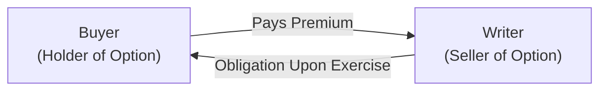
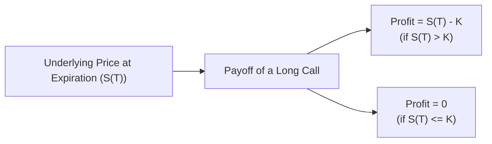

## 6.2 Key Option Terminology and Definitions

Let’s be honest for a moment: I remember the first time I encountered option terminology, I was absolutely baffled—like, “Call? Put? Premium? Wait, do I get a phone call if my option is in the money?” The words felt totally abstract at first! Yet, as I dove deeper, it slowly started to make sense. My “aha” moment came when I realized that it’s all about clearly defining rights, obligations, and costs. Once you internalize these key terms, the rest of options trading—including the strategies in Chapter 18 (Bullish Strategies) and Chapter 19 (Bearish Strategies)—feels more approachable.

This section helps you pin down the critical terms you’ll need when trading or analyzing options. We’ll also include some personal experiences—sort of a friendly way to ease you into these concepts—so you can feel that you’re learning from a knowledgeable friend rather than a dusty textbook.

Use the glossary below in tandem with regulatory references, such as the Canadian Investment Regulatory Organization (CIRO) guidelines, to ensure you’re upholding professional standards whenever you discuss or recommend options to clients. You’ll find additional details in Chapters 21 and 22, which explain conduct, practices, and the account-opening process for derivatives.

---

## Why Terminology Matters

Sometimes you’ll hear traders throw around words like “premium,” “strike,” or “in-the-money” so casually that it can feel like everyone else knows a secret language. But the truth is that each of these words has a precise definition, and mixing them up (or using them incorrectly) can lead to huge misunderstandings. Seriously, imagine consenting to “sell a call” when you intended to “buy a call”! The financial implications can be massive.

Precision in terminology is also super important for compliance. CIRO sets proficiency requirements that call for a clear understanding of options vocabulary. If you’re advising clients or simply managing your own trades, using the correct terminology fosters clarity, trust, and best execution practices. The Bourse de Montréal’s Options Trading Glossary (https://www.m-x.ca) is also a great place to verify definitions from a Canadian market perspective.

Below, we’ll walk through central terms in a logical order, building from the basic structure of an option contract up to the nuances of in-the-money versus out-of-the-money. Let’s get started.

---

## The Primary Terms

### Call Option

A “call option” gives the buyer (holder) the right, but not the obligation, to buy the underlying asset at a specified strike price.  
• Right to buy = You can purchase the underlying if it’s beneficial.  
• Not obligated = If the market moves against you, you can let the option expire.  
• If you’re the buyer of a call and the price of the underlying goes up significantly, you typically benefit.

A quick personal aside: My very first options trade was actually a call option on a tech stock. I was convinced (maybe too quickly, with starry-eyed optimism) that the stock was about to skyrocket. The premium seemed like a fair cost for the potential upside. Although the position didn’t exactly double, I avoided a larger capital outlay because I only paid the premium. That experience reminded me that calls are often used to seek big upside with capped risk.

### Put Option

A “put option” gives the buyer (holder) the right, but not the obligation, to sell the underlying asset at a specified strike price.  
• Right to sell = You can sell the underlying if market prices fall.  
• Not obligated = If the market moves up and you don’t want to sell, you let the contract expire.  
• Buyers of puts often profit in declining markets or use puts to protect holdings.

### Premium

The “premium” is the price paid by the buyer of the option to the seller (writer) of the option.  
• For the holder, it’s like an insurance fee or the upfront cost.  
• For the writer, it’s income received for taking on the obligation.  
• Premiums move with volatility, time to expiration, interest rates, and the relationship between the strike price and the underlying price.

In many ways, you can think of an option premium like an insurance premium. When risk is high (e.g., more uncertainty in the market), premiums go up—just like how homeowner’s insurance is pricier in flood zones.

### Strike Price (Exercise Price)

The “strike price” is the price at which the holder can buy (in the case of a call) or sell (in the case of a put) the underlying asset.  
• An example: Suppose you own a call option with a strike price of $50 on a stock currently trading at $48. Your call is not in the money yet, but you have the right to buy the stock at $50 if its price rises above that.  
• Strike price is sometimes called “exercise price” in official regulatory or vendor documents.

### Expiry Date (Expiration Date)

The “expiry date” is when the option contract ceases to exist.  
• After this date, the contract can no longer be exercised or traded.  
• Short-term options might have weekly or monthly expirations, while others extend for months or even years (LEAPS®).  
• The approach of expiration often accelerates time decay (theta), emphasizing the element of time in an option’s price.

### In-the-Money (ITM), At-the-Money (ATM), and Out-of-the-Money (OTM)

These terms reflect the option’s intrinsic value relative to the current market price of the underlying:

• In-the-money (ITM):  
  – A call is ITM if the underlying’s market price is above the strike price.  
  – A put is ITM if the underlying’s market price is below the strike price.  
  – ITM options have intrinsic value, often making them more expensive to buy.  

• At-the-money (ATM):  
  – A call or put is ATM if the underlying’s market price is essentially equal to the strike price.  
  – ATM options typically carry substantial time value but no intrinsic value.  

• Out-of-the-money (OTM):  
  – A call is OTM if the underlying’s market price is below the strike price.  
  – A put is OTM if the underlying’s market price is above the strike price.  
  – OTM options have no intrinsic value and are cheaper—yet they can have large leverage potential if the underlying moves favorably.

---

## The Core Roles: Long vs. Short Positions

### Long Position (Holder)

If you’re “long” an option, you’ve purchased the right but you’ve taken on no obligation. You can choose to exercise if it’s advantageous, or just let it expire worthless if it’s not.  
• A long position in a call typically aims for bullish outcomes.  
• A long position in a put typically aims for bearish outcomes or protective hedges.

### Short Position (Writer)

If you’re “short” an option, you have sold the contract to someone else and received the premium. Unlike the buyer, you carry the obligation to fulfill the contract terms if the option holder exercises.  
• A short call can be risky if not covered by the underlying asset, since the stock price can theoretically rise endlessly.  
• A short put can be risky if the stock plummets, because you might have to buy the underlying at the strike price.  
• Writers receive the premium initially, but losses can be significant if the market moves against them.

---

## Types of Options by Exercise Style

### American-Style Option

An **American-style option** can be exercised any time up to and including the expiration date. Many equity options listed on the Bourse de Montréal operate under an American-style convention. This means that if a stock’s price hits a favorable level, the holder could exercise immediately—though practically speaking, holders often wait to see if the trend continues to get better.

### European-Style Option

A **European-style option** can only be exercised on the expiration date itself. Index options are commonly structured this way. From a pricing perspective, European-style options can sometimes be priced slightly differently because the holder can’t suddenly exercise prior to expiration.

---

## A Quick Flowchart: Buyer and Writer Relationship

Imagine the relationship between the option buyer (holder) and the option writer (seller). The buyer pays the premium and gains a right; the writer receives the premium and must fulfill the obligation if exercised.

This diagram is obviously simplified, but it shows that the buyer’s flow of money goes to the writer in exchange for the writer’s obligation. In reality, the trade is cleared through a derivatives clearinghouse (like the Canadian Derivatives Clearing Corporation, CDCC), as we’ll see in Chapter 27. In the event of an exercise, the settlement obligations flow back through the clearing system, ensuring market integrity.

---

## Payoff Profiles at Expiration

While there are many ways to model options payoffs, it’s helpful to see a quick snapshot of an option’s final value at expiration.

Let’s consider a long call at a strike price of K and the underlying price at expiration being S(T). The payoff is:

 \max(S(T) - K, 0) 

To visualize the payoff, see the simplified diagram below.

The key takeaway is that when the stock price (S(T)) remains below the strike price (K), your payoff is zero (though you’ve already spent the premium). If S(T) rises above K, your intrinsic payoff grows dollar-for-dollar above the strike price. You’ll see the same concept for puts but in reverse, as summarized in Chapter 19 about bearish strategies.

---

## Real-World Scenarios

1. **Hedging with Puts**: Suppose you own 1,000 shares of a major Canadian bank. You fear a market correction but don’t want to sell your shares. You buy a put option (strike price close to the current market). If the market drops, you can exercise the put to sell shares at the strike, effectively limiting your downside. The premium is your cost for peace of mind.

2. **Speculating with Calls**: You expect a mining company to announce strong earnings next month. Instead of investing thousands in stock, you buy call options. If your hunch is correct, and the stock price jumps, you can exercise or sell the call at a profit. The worst-case scenario is that your calls expire worthless, but your maximum loss is just the premiums paid.

3. **Income Generation via Writing**: You hold an index ETF for the long run. You write (sell) call options on the ETF to earn extra premium income. If your calls expire OTM, you keep the premium. However, if the market rallies quickly, you could face the obligation to sell your shares, capping your upside. This strategy, known as a “covered call,” is widely used by portfolio managers seeking extra yield.

---

## Regulatory Focus and Best Practices

• **CIRO Compliant Proficiency**: The Canadian Investment Regulatory Organization (https://www.ciro.ca) publishes detailed requirements on how licensed individuals should understand and explain these terms. If you recommend options to clients, be prepared to demonstrate how each term factors into the risk-return profile of a trade.

• **Disclosure and Suitability**: Chapter 22 outlines the account opening procedures for retail clients. Always ensure premium, strike price, and expiration details are clearly explained, along with potential losses from short positions.

• **Market Integrity**: Exchanges like the Bourse de Montréal can impose position limits or exercise limits, especially if you’re short. These regulatory measures help avoid manipulative practices and ensure the market remains fair and orderly.

---

## Common Pitfalls

• **Mixing Up Calls and Puts**: Believe it or not, new (and sometimes experienced) traders can misremember which option type is bullish or bearish. If you’re more comfortable with visuals, keep a payoff chart or cheat sheet handy.

• **Ignoring Time Decay**: While “expiry date” might sound straightforward, the effect of time decay on an option’s premium can be huge. Options can lose value swiftly if the underlying doesn’t move as expected.

• **Over-Leveraging**: Options let you control a large notional amount of the underlying. This can tempt you to over-leverage. Assess your margin requirements and keep an eye on position sizes. We’ll explore margin and leverage in Chapter 23.

• **Forgetting Assignment Risk**: Writers of American-style options can be assigned at any time. If you’ve written puts, be prepared to buy shares or close the position if assigned.

---

## Resources for Further Exploration

• **CIRO Options Proficiency Requirements**:  
  https://www.ciro.ca  
  (Stay up to date with any new regulatory changes.)

• **Bourse de Montréal’s Options Trading Glossary**:  
  https://www.m-x.ca  
  (A Canadian-focused dictionary of terms you’ll see in the real marketplace.)

• **Quantitative Libraries**:  
  - R’s “derivmkts” and Python’s “quantlib” both provide modules to model option pricing, including definitions of premium and strike price. Great if you want to see how changes in volatility or time to expiration mathematically affect premium.

• **CSI’s “Derivatives Fundamentals and Options Licensing Course”**: The official course materials expand on the definitions and connect them to real-world examples in deeper detail.

---

## Making Sense of the Jargon

Let’s do a quick rundown of how these terms come together in a single hypothetical trade:

• You **buy** a **call option** (i.e., you go “long” the option) on a popular Canadian energy stock. The **strike price** is $40, and you pay a **premium** of $2 per share (one standard option contract equals 100 shares, so total premium is $200). The option **expires** in three months.

• If the stock price soars to $50 before expiry, your call is comfortably **in-the-money** (because $50 > $40). You could exercise your right to buy at $40, or you can sell the option at its intrinsic value.

• If the stock price stays below $40, your call is **out-of-the-money** at expiry, and it expires worthless. You lose the $200 premium, which was your maximum risk.

And that’s basically the deal. Knowing what each term means helps you manage risk, plan your strategy, and talk confidently about your trades.

---

## Conclusion

There you have it—a somewhat conversational guide to option terminology that’s fundamental for your journey as an options trader or advisor. This lingo sets the foundation for deeper topics such as pricing dynamics (Chapter 7), advanced Greeks (also Chapter 7), and multi-legged strategies (Chapters 18, 19, and 20). Whether you’re dabbling in calls to chase growth potential or layering puts for hedging, keep these definitions front of mind.

If you find yourself scratching your head—maybe you forgot the difference between “long call” and “short call”—just revisit this section. Clarity with these terms can prevent costly mistakes and ensure compliance with CIRO guidelines.

---

## Sample Exam Questions: Key Option Terminology and Definitions



### Which of the following best describes the buyer of a put option on a stock?

- [ ] The buyer is obligated to sell shares at the strike price if required by the writer.
- [x] The buyer has the right, but not the obligation, to sell shares at the strike price.
- [ ] The buyer must exercise the option if in-the-money.
- [ ] The buyer has an obligation to buy shares from the writer if the option expires in-the-money.

> **Explanation:** A put option buyer has the right— not the obligation— to sell the underlying asset at the strike if it is advantageous, highlighting the optionality feature.

### What is the strike price of an option?

- [ ] The amount of premium paid to enter into the contract.
- [ ] The date on which the option expires.
- [x] The specified price at which the underlying can be bought or sold.
- [ ] The monetary value of time decay in the option.

> **Explanation:** The strike price (or exercise price) is the set price at which the holder can buy (call) or sell (put) the underlying asset.

### Which of the following statements is true regarding a short call position?

- [x] The writer of a short call has an obligation to deliver the underlying if exercised.
- [ ] The writer of a short call trades for free without receiving a premium.
- [ ] A short call position has limited risk if the option is uncovered.
- [ ] A short call benefits most when the stock price soars above the strike price.

> **Explanation:** The writer of a short call (especially if uncovered) faces potentially unlimited risk if the price rises. The writer received a premium, but is obliged to deliver shares if the buyer exercises.

### If a call option is at-the-money (ATM), that means:

- [ ] The option automatically exercises at expiration.
- [x] The underlying’s market price is equal to the strike price.
- [ ] The premium is zero.
- [ ] The option has only intrinsic value and no time value.

> **Explanation:** An ATM call means the market price of the underlying matches the strike price. Thus, it has no intrinsic value but still retains time value.

### Which best describes an “American-style” option?

- [ ] It can only be exercised on the expiration date.
- [x] It can be exercised at any time up to and including the expiration date.
- [ ] It is exclusively traded on U.S. exchanges.
- [ ] Its premium changes only on the last day of trading.

> **Explanation:** American-style options can be exercised at any point before expiration, offering more flexibility compared to European-style options.

### In which scenario is a put option most likely to expire in-the-money?

- [ ] When the underlying’s price is above the strike price at expiration.
- [x] When the underlying’s price is below the strike price at expiration.
- [ ] When the underlying has appreciated sharply.
- [ ] When the underlying remains unchanged.

> **Explanation:** Puts go in-the-money if the underlying’s price is less than the strike price.

### An investor who writes a put option without owning any offsetting position:

- [ ] Faces no exercise risk.
- [ ] Has a net long exposure to the underlying asset.
- [x] Has an obligation to buy the underlying if the option holder exercises at the strike price.
- [ ] Will automatically profit if the underlying falls.

> **Explanation:** A put writer must purchase the underlying if assigned, which can be risky if the underlying’s price dives.

### Which term describes the cash paid to an option writer in exchange for granting the buyer rights?

- [ ] Strike price
- [ ] Time value
- [x] Premium
- [ ] Intrinsic value

> **Explanation:** The premium is the upfront cost a buyer pays; the writer receives this premium but assumes the contract’s obligation.

### A call option with a strike price of $20 on a stock currently trading at $25 is considered:

- [ ] Out-of-the-money by $5
- [ ] At-the-money
- [x] In-the-money by $5
- [ ] Having no intrinsic value

> **Explanation:** In a call option, if the stock price (25) is above the strike (20), the option is ITM by $5 of intrinsic value.

### True or False: European-style options can be exercised at any time before they expire.

- [ ] True
- [x] False

> **Explanation:** European-style options can only be exercised on the actual expiration date, whereas American-style options allow exercise anytime before expiration.


