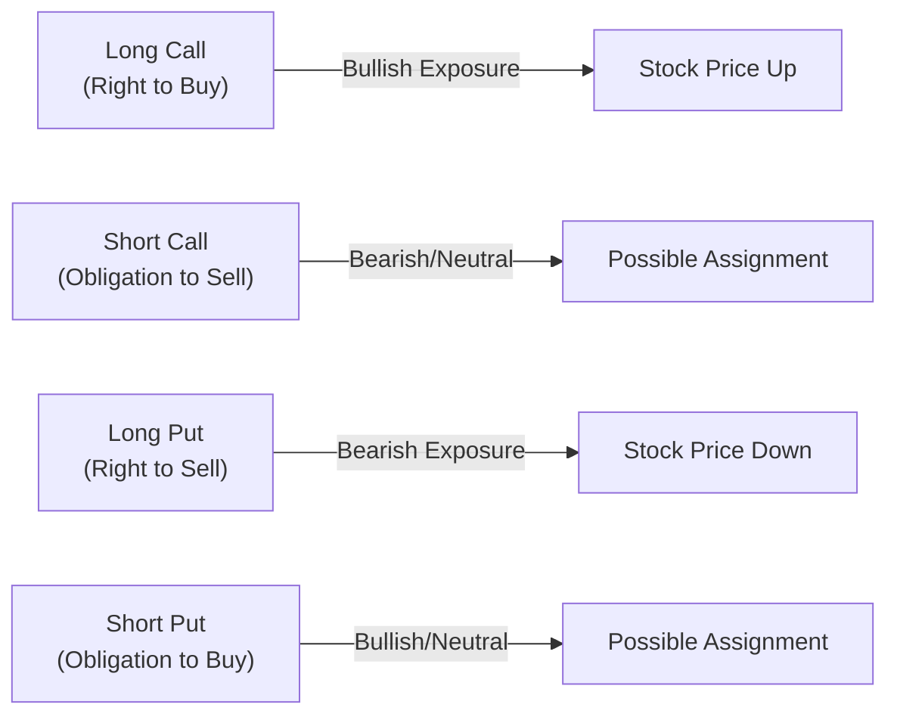

## 6.3 Application of Key Terms and Definitions

Sometimes, when I first started learning about options, I felt like I’d opened a puzzle box where each piece had a slightly different shape but fit together to create the bigger picture. You’ve got “calls,” “puts,” “strike prices,” “premium,” “assignment,” “bullish exposure,” “bearish exposure,” and so on—quite a maze! But once you see how all these terms connect in real-life scenarios, it starts to feel more intuitive. In this section, we’ll bring each key term to life, show you how it’s used in the wild, and remind you why it matters for regulatory compliance under the Canadian Investment Regulatory Organization (CIRO).

### Applying the Language of Options to Real Scenarios

If you’re on a trading desk, or maybe even trading from your smartphone, clarity is everything. Telling your order entry system, “I want to buy a call,” versus “I want to write a call” can be night and day, so you really need to get these definitions right.

• A “long call” might sound fancy, but as soon as you say “long call,” your broker or your trading platform (or even your colleague in the next cubicle) automatically knows you’re looking for bullish exposure.  
• A “short put” is a different beast altogether. If you’re “shorting” a put, that means you’ve effectively taken on the obligation to buy the underlying if someone exercises the put against you. In other words, you’re positioning yourself to acquire shares (or other underlying assets, like an index or commodity futures contract) at the strike price, if assigned.

Understanding these terms means immediate clarity on your risk profile. If you’re on the phone with a client who says, “I want to buy a call,” you know they’re betting the underlying’s price will rise. If a colleague yells, “I’m going short a straddle,” you realize they’re implementing a volatility-centric strategy that might look complicated from the outside. But the moment each piece of that phrase—“short,” “straddle”—clicks, you get the full picture of their intended payoff and risk.

### Bullish Exposure and Bearish Exposure

Let’s break down two important phrases you will hear over and over again:

- **Bullish Exposure** indicates a position that profits from an increase in the price of the underlying asset. Going “long call” is classically bullish, but so is selling a put option—though the risk and payoff structures differ dramatically. The big word “bullish” simply means you’re expecting the underlying to rise (or you’re at least comfortable if it does).

- **Bearish Exposure** refers to a position that profits from a decline in the underlying’s price. The hallmark of a bearish strategy is a “long put.” If the price plunges, the put might become very valuable, offsetting losses on other positions or simply generating profits if that was your sole position. Another variant might be writing (selling) a call if you think the underlying will stay flat or go down.

From a communications standpoint, when you label something “bullish” or “bearish,” you can almost skip extra explanation of the direction you want the market to move. It’s instant shorthand that ensures everyone around you knows your market outlook.

### Assignment and Exercise

Two additional terms that come up a lot (and sometimes cause confusion) are:

- **Exercise**: This is the right of the option holder (the buyer of the option) to buy (if it’s a call) or sell (if it’s a put) the underlying at the strike price when it’s favorable to do so. If you hold a call with a strike of CAD 50 and the underlying is currently trading at CAD 60, you might exercise that call to lock in the ability to buy at CAD 50 instead of paying the market price of CAD 60.  
- **Assignment**: Here’s the flip side of the coin. If you wrote (sold) the call in our example, you can be “assigned” by the buyer. That means you’re now obligated to sell the underlying at CAD 50. The specific mechanism for who gets assigned and when depends on the rules of the clearing corporation, but from a user perspective, “assignment” is the dreaded letter in your inbox telling you, “Congratulations, you must fulfill your short option obligation.”

Proper usage of these terms is crucial. If you mention “assignment” to a client incorrectly, you may cause them undue worry or excitement—they might think they’re obligated to buy or sell something when they actually hold the long side and thus can’t be assigned. Similarly, if you talk about “exercise” for a call that someone only wrote (i.e., they’re the short party), you might create confusion since the writer of the option typically doesn’t exercise anything; only the buyer can exercise.

### The Value of Scenario Analysis

You might have heard the phrase “scenario analysis” thrown around—like, “Run a scenario analysis to see what happens to our portfolio if the underlying stock jumps 10% by next Tuesday.” Great. But how?

**Scenario Analysis** is typically a structured way to see what an option or portfolio does under hypothetical market conditions. Maybe you vary the underlying price, time to expiration, or implied volatility. Then you check the resulting option value and see if it’s “in the money,” “at the money,” or “out of the money.” If the “in-the-money” call leaps in value because the underlying soared, that’s the scenario you hoped for when you placed that bullish trade. However, if the underlying plummets, that same in-the-money call you purchased might suddenly lose almost all of its time value, leaving you with a potentially painful outcome.

Here’s a small snippet that might show up in a scenario analysis for a call you bought. It’s a simplified example in Python:

```python
import numpy as np

underlying_prices = np.array([45, 48, 50, 52, 55, 60])
strike_price = 50
premium_paid = 2.00  # cost of 1 call option

call_values = np.maximum(underlying_prices - strike_price, 0)

pnl = call_values - premium_paid

for price, value, net in zip(underlying_prices, call_values, pnl):
    print(f"Underlying Price: {price}, Call Intrinsic Value: {value}, Net P/L: {net}")
```

In a real trading floor environment or even on your home laptop, you might create a more elaborate scenario matrix that includes changes in implied volatility (IV) and time decay (Theta). Tools like Jupyter notebooks, combined with libraries such as NumPy, Pandas, and Matplotlib, let you visualize how changes in time or volatility can morph your payoff profile. This approach is beneficial not only for personal insight but also for ensuring you’re meeting proper risk management guidelines set by your firm and by CIRO.

### Connecting the Dots: Why These Terms Matter Under CIRO Regulations

CIRO, as Canada’s unified self-regulatory organization, cares a lot about how you handle your trades, your marketing materials, and your day-to-day communications with clients. The reason is straightforward: compliance ensures that clients understand what they’re getting into, and it keeps the playing field fair.

After the Mutual Fund Dealers Association of Canada (MFDA) and the Investment Industry Regulatory Organization of Canada (IIROC) amalgamated into what is now CIRO, the complexities around “cross talk” between mutual fund activities and derivative transactions needed a unifying standard. So, if you find yourself completing official forms, or maybe clarifying the nature of a position in a client’s statement, using consistent, correct terms is essential. For example:

• **Trade Reporting**: When short puts are included in a client’s position, you have to reflect that the client has an “obligation to buy” the underlying at that strike, and that might require margin.  
• **Know Your Client (KYC)**: If your client indicates they have a strong bullish outlook, you might consider explaining a long call strategy. If they’re more conservative, maybe a covered call. The terms “bullish,” “bearish,” “in-the-money,” or “out-of-the-money” help you quickly align recommended strategies with their risk tolerance.  
• **Communications with Clients**: When your client receives their confirmation slip from you or from the clearinghouse, it might say something like “BTO 2 AXY Jan 50 Call.” The short code “BTO” stands for “Buy to Open,” meaning a long position in an option. Everything from code usage to official statements needs clarity so there’s no confusion about who has rights, who has obligations, and what the cost basis is.

Moreover, accurate record-keeping is especially vital if you’re working in a corporate environment or as a professional. If regulators ask about a certain short put or long call, the documentation has to match the actual position. Proper usage of terms like “exercise” and “assignment” clarifies how a trade evolved over time—crucial if you need to demonstrate compliance or if there’s a dispute.

### Practical Examples: Putting It All Together

1. **Example: Long Call**  
   Let’s say you “buy to open” a call with a strike price of CAD 100 on a stock trading around CAD 98. You paid a premium of CAD 3. If the stock leaps to CAD 110, this call is now “in the money” by CAD 10 (i.e., the difference between CAD 110 and the strike of CAD 100). Your net profit, ignoring transaction costs, is CAD 7 per share (CAD 10 intrinsic value minus your CAD 3 premium). If you exercise the call, you can purchase the stock at CAD 100. If you close the call in the market, you’d likely pocket around CAD 10 in intrinsic value—plus or minus any remaining time value and cost of commissions.

2. **Example: Short Put**  
   You “sell to open” a put with a strike of CAD 50 and receive a CAD 2 premium. If the stock stays above CAD 50, you might just keep that CAD 2 premium at expiration. But should the stock drop to CAD 45, you can be assigned, obligating you to buy the shares at CAD 50. Economically, you still paid a net CAD 48 per share because you had the CAD 2 premium in your pocket—but if the stock is at CAD 45, you’re down CAD 3 on paper. It’s a “willingness to buy the underlying” scenario, so it’s typically considered a bullish or neutral-bullish strategy.

3. **Example: In-the-Money (ITM) Call**  
   If you hold a call with a strike of CAD 40, and the underlying is at CAD 55, that call is deep in the money. You can run a scenario analysis exploring what happens if the stock bounces to CAD 60, or if it slides to CAD 50. Because you’re ITM, any small change in the underlying’s price might significantly influence your option’s value, especially if you’re getting close to expiry.

These real-world examples reaffirm the significance of each term. “Long call,” “short put,” “ITM,” “assignment,” and “exercise” all shape the strategy’s payoff and the steps you take to close, roll, or deliver on your obligations.

### Using Mermaid Diagrams to Visualize Concepts

To illustrate how calls and puts line up in the bigger scheme of rights and obligations, here’s a simple Mermaid diagram:



- The “Long Call” node A flows you toward benefiting from an upward price move (bullish).  
- Meanwhile, if you’re “Short a Put,” you could face assignment (node H) if the underlying price dips below the strike price.  

Visual representations can be powerful in clarifying these relationships. Notice the repeated theme of assignment for short positions—this is not the scare factor, but it is the essential characteristic that short options carry an obligation.

### Avoiding Common Pitfalls

While the definitions might seem straightforward once explained, there are some typical mistakes people make:

• **Mixing up Calls and Puts**: It’s surprisingly easy for newcomers to confuse which side grants the right to buy and which grants the right to sell. Double-check your trade confirmations.  
• **Forgetting That Short Positions Carry Obligations**: Selling (writing) a call or a put means you have an obligation that can be enforced if you’re assigned. This can lead to large (sometimes unlimited) losses if you’re not cautious.  
• **Unclear Client Communication**: Telling a client they have a “call” when they actually wrote the call is a big no-no in compliance terms. That’s the kind of slip that can cause major confusion.  
• **Neglecting Scenario Analysis**: If you never test how your strategy behaves under different market conditions, you might be blindsided by moves in implied volatility or time decay.

### Additional Resources and Tools

1. **CIRO Trading Conduct and Compliance**: Visit [CIRO](https://www.ciro.ca) to stay updated on reporting obligations, margin requirements, and conduct standards. They periodically publish notices and guidance with real examples that can help clarify these definitions from a regulatory perspective.  
2. **John C. Hull’s “Fundamentals of Futures and Options Markets”**: A classic text with plenty of examples and practice problems to see how each term fits into a bigger strategy.  
3. **Python Ecosystem**: Tools like NumPy, Pandas, and Matplotlib in Jupyter notebooks are great for scenario modeling. They can help you chart your payoff diagrams and run historical backtests.  
4. **Local or Proprietary Trading Platforms**: Most broker platforms have integrated risk analysis tools that let you see your option’s potential profit and loss (P/L). Familiarize yourself with them—one or two test runs can drastically lower your risk of errors.

### Tying It All Together

Ultimately, the best way to solidify your understanding of calls, puts, exercise, assignment, bullish or bearish exposure, and scenario analysis is to see them in action. Maybe simulate trades in a demo account for a few weeks or keep a spreadsheet of hypothetical trades. Label them carefully: “Day 1: Long call on XYZ at a strike of 70, underlying price 68, premium = CAD 2.” Then track the trade daily. If you notice the underlying creeps up to 72, watch how that call’s premium reacts!

When you do this consistently, you’ll find the definitions go from abstract textbook terms to real, intuitive insights. That’s the core of applying these terms effectively in day-to-day practice. You’ll speak the same language as your colleagues. You’ll provide clarity to your clients. And, crucially, you’ll remain on the right side of CIRO’s compliance demands in Canada’s evolving derivatives landscape.

—

## Sample Exam Questions: Mastering Options Terminology in Practice



### Which statement correctly describes a short put position?

- [ ] It grants the holder the right to sell at the strike price.
- [x] It obligates the seller to buy the underlying at the strike price if assigned.
- [ ] It is always risk-free.
- [ ] It immediately becomes in the money if the stock price drops below the strike.

> **Explanation:** A short put requires the option writer to buy the underlying if assigned. This obligation kicks in when the option holder exercises their right to sell.

### Which of the following is an example of a bullish options strategy?

- [ ] Long put
- [ ] Short call
- [x] Long call
- [ ] Long put spread

> **Explanation:** A long call is fundamentally bullish, since it gains value if the underlying price goes up.

### What happens when an option holder exercises a long call?

- [ ] They must pay the option writer a cash amount equal to the premium.
- [ ] They transfer their shares to the option writer.
- [x] They buy the underlying at the strike price.
- [ ] They receive the difference between the strike price and market price in cash.

> **Explanation:** Exercising a long call means you purchase the underlying asset at the specified strike price.

### In scenario analysis, which of the following factors is typically varied to see potential changes in option value?

- [x] Underlying price
- [ ] Broker commissions only
- [ ] Risk-free bond prices
- [ ] Historical margin requirements

> **Explanation:** Scenario analysis frequently changes the underlying price and often implied volatility, time to expiration, and interest rates to see how the option might behave.

### Which term best describes the outcome of a short option position if the buyer enforces their rights?

- [ ] Expiration
- [ ] Premium
- [ ] Time erosion
- [x] Assignment

> **Explanation:** When a short option position is assigned, the seller must fulfill their obligation to buy or sell the underlying at the strike price.

### Which book is commonly referenced for extensive examples of futures and options concepts?

- [x] “Fundamentals of Futures and Options Markets” by John C. Hull
- [ ] “Modern Banking and Finance” by Adam Smith
- [ ] “Technical Analysis of the Financial Markets” by John Murphy
- [ ] “Market Wizards” by Jack D. Schwager

> **Explanation:** John C. Hull’s text is a classic reference with thorough examples for readers learning about futures and options.

### From a regulatory standpoint, which organization currently oversees investment dealers and market integrity in Canada?

- [ ] Investment Industry Regulatory Organization of Canada (IIROC)
- [ ] Mutual Fund Dealers Association (MFDA)
- [x] Canadian Investment Regulatory Organization (CIRO)
- [ ] Canadian Investor Protection Fund (CIPF)

> **Explanation:** IIROC and MFDA amalgamated into CIRO, which is now the primary self-regulatory body for investment dealers in Canada.

### If an option is “in-the-money” (ITM), what does this primarily indicate?

- [ ] Time value is zero.
- [ ] The position cannot be exercised.
- [x] The option has intrinsic value.
- [ ] The option has no expiration date.

> **Explanation:** ITM means the option’s strike price is favorable relative to the current underlying price, giving the option intrinsic value.

### A “short put” is typically best described by which directional outlook?

- [x] Moderately bullish or neutral
- [ ] Highly bullish only
- [ ] Highly bearish
- [ ] Purely volatility-driven, ignoring direction

> **Explanation:** A short put benefits if the underlying stays flat or rises slightly, since the writer maintains the received premium unless the underlying dips below the strike price.

### True or False: Under a short call position, the seller chooses when to exercise the contract.

- [ ] True
- [x] False

> **Explanation:** The option holder (buyer), not the option seller, decides on exercise. The seller can be assigned at any time prior to expiration (for American-style options).


