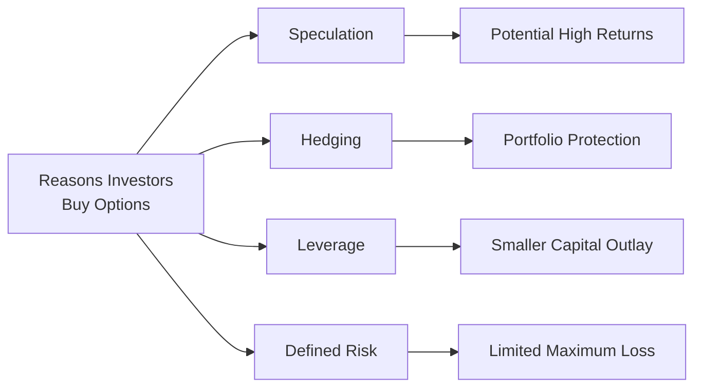

## 6.4 Why Investors Buy Options

Investors buy options for a variety of reasons, ranging from strategic market speculation to safeguarding existing portfolios. It might sound a bit intimidating at first—believe me, I remember my own initial nerves when I purchased my very first call option—but once you grasp the key benefits and mechanics, options can become a remarkably versatile tool in your financial toolbox. In this section, we’ll explore the major reasons investors choose to buy options, some personal reflections on the process, and tips to keep in mind while navigating the Canadian markets. We’ll also reference Canadian Investment Regulatory Organization (CIRO) guidelines, the Bourse de Montréal’s educational resources, and broader frameworks such as the Canadian Securities Administrators’ (CSA) NI 81-102 Investment Funds rules. So, let’s dive in.

---

### Understanding the Core Motivations

Options are unique in that they give you the right (but not the obligation) to buy or sell an underlying asset at a specific strike price within a certain time frame. This simple fact opens up many possibilities: speculation with defined risk, protection (hedging) of an existing position, and even leveraging your capital. Each of these motivations plays a big role in why both retail and institutional investors might prefer purchasing options versus other financial instruments.

Before we detail all the main motivations, here’s a quick overview of some essential reasons behind buying options:

• Speculation: Potential to profit from price movements without tying up huge amounts of capital.  
• Hedging: Safeguards an existing position against adverse market moves.  
• Leverage: Allows you to control a larger position for a smaller premium outlay relative to the total notional exposure.  
• Defined Risk: Risk is capped at the premium paid, giving you peace of mind that losses can’t exceed that initial cost.

Below, we’ll break down each of these because, in my own experience, a deeper insight into each aspect can significantly sharpen your strategy.

---

### Speculation

When market participants say they’re “speculating,” they’re essentially seeking to profit from expected market movements. Options can serve as an efficient gateway for this purpose, particularly because:

• You don’t need to buy or short the underlying shares or futures outright.  
• You can bet on the direction of stock, commodity, or index prices using calls (if you’re bullish) or puts (if you’re bearish).  
• The initial outlay, while not trivial, is often much smaller compared to purchasing (or shorting) an equivalent amount of the underlying asset.

#### A Brief Personal Anecdote on Speculation

When I first started trading, I recall buying call options on a Canadian technology stock. I was convinced from a couple of news articles and my own gut feeling that the stock would rally sharply over the next month. I bought a single call option contract, which gave me control of 100 shares, for a fraction of what 100 actual shares would have cost. Sure, part of me was excited about the potential upside, but I was also relieved to know that my maximum loss was merely the cost of that option. If my hunch was wrong, I wouldn’t be on the hook for more than that upfront premium.

In a nutshell, that’s the real heft behind using options for speculation: an opportunity for substantial returns with a smaller capital outlay. Keep in mind, speculation can also lead to a total loss of premium if the trade doesn’t move in your favor. But that’s the name of the game—you’re paying for the “option,” not the obligation.

---

### Hedging

For many, hedging with options is a fundamental risk-management tactic. Rather than trying to predict massive gains, as in speculation, hedging is about limiting losses on current positions. For instance, an investor or fund manager holding a diversified Canadian equity portfolio might be worried about a possible market downturn. By purchasing put options on a broad index (like the S&P/TSX 60 Index), they set up a form of insurance: if the market drops, those put options (which gain value when prices fall) can offset some of the portfolio losses.

#### Why Hedging Can Be Essential

• Protection: Buying put options provides downside coverage.  
• Peace of Mind: The cost of the premium is akin to paying an insurance fee that mitigates big losses.  
• Flexibility: You can tailor how many puts you buy relative to how many shares or how large your portfolio is, adjusting hedge ratios according to your risk tolerance.  

Imagine you own 1,000 shares of a big Canadian bank. If you think the market might tumble but you don’t want to sell your shares (maybe due to taxes or a long-term perspective), you could buy puts on that bank’s stock to limit potential downside. The cost of the put might reduce your profit if prices go up, but if the market does plummet, you’ll be glad to have that downside protection.

#### Hedging Case Study: Agriculture in Western Canada

An agricultural producer in Saskatchewan might use options on canola futures to lock in minimum prices for the harvest. If prices go down, the put options will rise in value and help offset income losses. If prices soar, the farmer can still benefit from selling the crops at the higher market price, minus whatever premium was initially paid for the puts.

---

### Leverage

Leverage in the world of options simply means getting more market exposure for a relatively small upfront cost. Let’s say you have a bullish outlook on a stock. Rather than laying out thousands of dollars to purchase a certain number of shares, you might buy call options at a fraction of that expense. If the underlying stock indeed rises above your strike price (plus the premium cost), your percentage gains can be significantly higher compared to owning the shares directly.

#### Leverage Example

Suppose Company ABC is trading at CAD 100 per share. You believe it might rise to CAD 110 in the next three months. Instead of buying 100 shares at CAD 10,000, you buy one call option contract (each contract typically controls 100 shares) for a premium of, say, CAD 300 (CAD 3.00 per share).  

• If ABC indeed rallies to CAD 110 by expiration, your intrinsic value is now around CAD 10 per share (technically CAD 110 stock price minus CAD 100 strike = CAD 10).  
• Since you spent CAD 3 per share, your net gain is roughly CAD 7 per share on 100 shares = CAD 700 total gain on a CAD 300 outlay.  
• That’s a 233% return (700 ÷ 300) if everything holds until expiration and you exercise or sell out your position.

This same move in the stock, from CAD 100 to CAD 110, if you held the stock outright, would net you CAD 10 x 100 shares = CAD 1,000 on a CAD 10,000 outlay, or a 10% return. So yes, your option leveraged your initial investment. However, please remember if the stock remains below CAD 100, your option may expire worthless, resulting in a 100% loss of the premium. Owning shares, by contrast, would still hold some residual value (even if the stock went down).  

Leverage can cut both ways, so handle it with care. Think of it like a powerful tool—when used appropriately, it can help you realize significant gains, but it can also magnify losses (up to the premium paid) if your forecast was off.

---

### Defined Risk

Perhaps the biggest draw of buying options instead of other derivatives is the clear definition of your maximum possible loss. When you buy a call or a put, the worst-case scenario is losing the premium you initially paid. That’s it. You’re not subject to margin calls beyond that. Traders like this sense of control because it removes the potential for unlimited or undefined losses, which can occur in many leveraged or short-selling strategies.

• Maximum Loss: Premium paid.  
• No Margin Call: Once you pay your premium, you can wait until expiration or choose to sell the option contract at any point prior to that.  
• Peace of Mind: You can sleep better knowing that an unexpected market gap or meltdown won’t blow up your entire account.

From a risk-reward standpoint, you might give up unlimited upside (like you’d enjoy if you held the underlying stock), but the trade-off is capping your downside. This is incredibly appealing for many risk-averse or moderate investors who want exposure but also want firm boundaries on how much they can lose.

---

### Retail vs. Institutional Motivations

Both retail traders (like individual investors) and big institutions (like pension funds or hedge funds) utilize options. Sure, they might do it on vastly different scales, but the underlying reasons are quite similar:

• Retail Investors: Often looking for a cost-effective way to speculate on a stock or index move, or to hedge a small portfolio.  
• Institutional Investors: Might use options to manage interest rate risk, foreign exchange exposures, or systematically hedge entire equity portfolios.  

Many Canadian asset managers employ options strategies to reduce volatility for their mutual funds or ETFs, under the constraints set by CSA’s NI 81-102 guidelines. These rules ensure that funds don’t take on excessive risk with derivatives. That said, the Bourse de Montréal’s electronic platform supports a range of advanced option strategies that let institutions dynamically fine-tune their portfolios.

---

### Regulatory and Institutional Considerations

Here in Canada, options trading occurs under the oversight of CIRO, the national self-regulatory organization that replaced the Investment Industry Regulatory Organization of Canada (IIROC) and the Mutual Fund Dealers Association (MFDA). If you’re trading through a broker, be sure they’re regulated by CIRO and have the proper approvals for derivatives. CIRO supervises the conduct of member firms, margin requirements, and ensures that retail clients receive clear risk disclosure, so no surprises there.

#### CIRO Considerations

• Suitability Requirements: Advisors must evaluate whether the strategy is fitting for your financial situation, risk tolerance, and objectives.  
• Margin Requirements: Even though options can be purchased outright, some strategies require margin. Keep updated with the firm’s margin rate guidelines.  
• Disclosure: You’ll be given a Risk Disclosure Statement that you need to review carefully before you start trading options.

---

### Pitfalls and Best Practices

Buying options can seem as easy as pressing a button on your trading platform, but there are a few gotchas you should keep in mind.

**Time Decay:** Congrats—you bought an option! But unless the market moves in your favor relatively swiftly, you might see the option’s time value dwindle day by day. Remember that all else being equal, options lose value as their expiration date nears.

**Over-Leveraging:** It can be tempting to allocate a large chunk of your account to options because of the lure of high returns. But if markets move against you, you might burn through a good portion of your capital quickly. Moderation is key.

**Choosing the Wrong Strike Price or Expiration Date:** Beginners often buy very cheap, far-out-of-the-money options on the assumption “low premium = low risk.” But the probability of success might also be low. Similarly, picking an expiration date that’s too close could leave little time for your thesis to play out.

**Ignoring Volatility:** The cost of an option is heavily influenced by implied volatility. If you buy an option when implied volatility is historically high, that option could be pretty expensive. If volatility then falls, the premium can deflate even if the underlying price moves the way you expected.

**No Exit Strategy:** While you have the right to hold until expiration, that’s usually not your only option. You could close (sell) your position early, roll it to a later expiry, or adjust strikes if the market environment changes. Planning your exit up front is a good hedge against panic decisions.

---

### Real-World Scenario: Covered vs. Uncovered Hedging

Let’s pop in a short example. Imagine you own a portfolio of Canadian dividend-paying stocks. You believe in their fundamentals but worry about the next six months due to an uncertain global economic forecast. A “covered hedging” tactic might be to buy put options on each stock or on a closely correlated ETF that tracks the S&P/TSX Composite Index. This way, your risk is more defined than in a “naked” or uncovered position.

Alternately, if you’re particularly confident the market will remain stable, you might skip buying protection. But if the market drops significantly, you could take a full blow. Hedging with puts effectively draws a line in the sand for your potential losses, giving you time to wait out a market downturn.

---

### Glossary

• **Speculation:** Taking positions primarily in hopes of profiting from anticipated price movements.  
• **Hedging:** Using financial instruments, such as options, to offset potential losses in a different investment.  
• **Leverage:** Gaining larger market exposure relative to the amount of capital invested.  
• **Risk-Reward Profile:** Weighing the potential gain against the possible loss.  
• **Premium Outlay:** The amount of money spent to purchase an option contract.

---

### Practical Tips and Additional Resources

• **CSA’s NI 81-102 Investment Funds:** If you invest through mutual funds or ETFs, those funds sometimes use options to mitigate risk or enhance returns, all under the purview of NI 81-102.  
• **Bourse de Montréal – Options Education Centre:** (https://www.m-x.ca/en/education) offers free tutorials, webinars, and case studies on hedging, spreads, and more. This is a fantastic resource whether you’re a novice or advanced user.  
• **“Options as a Strategic Investment” by Lawrence G. McMillan:** Renowned comprehensive guide on options strategies. It’s detailed, but well worth your time once you’re ready to explore advanced tactics.  
• **CIRO Website:** (https://www.ciro.ca) The central hub for regulatory updates, investor protection info, and educational materials in Canada.

---

### A Closing Word

Buying options can be an exciting way to try to get an edge in the market—or simply to sleep a bit better at night because your downside is protected. The most important thing to keep in mind, from my own experience, is that every option strategy should stem from a clear rationale and risk tolerance perspective.

You might be gung-ho about speculation, but if you’re brand new, maybe focus on learning how time decay and implied volatility can crush or inflate an option’s value. If risk management is your game, put options can offer security on your existing positions. And if it’s all about leveraging a big market thesis you believe in, calls might be your go-to. No matter the motivation, set your boundaries early, keep learning from reputable sources like the Bourse de Montréal, and factor in real-time guidance from your broker.  

At the end of the day, investors buy options because they combine flexibility, leverage, and defined risk in a single package. Yet it’s no magic bullet—like any tool, using it effectively hinges on skill, knowledge, and temperament.

---

## Sample Exam Questions: Why Investors Buy Options



### Which of the following is a key advantage of buying options instead of purchasing the underlying asset outright?

- [ ] Unlimited risk exposure
- [ ] No potential for profit
- [x] Defined maximum risk (limited to the premium)
- [ ] Higher capital requirement than the underlying asset

> **Explanation:** One of the major advantages of buying options is that the maximum loss is limited to the premium paid, unlike direct ownership or leveraged positions that can lose more than the initial investment.

### Which of the following best describes speculation in the context of options trading?

- [ ] Buying puts exclusively to protect an existing position
- [ ] Managing interest rate risk through swaps
- [x] Taking positions with the primary goal of profiting from anticipated price movements
- [ ] Collateralizing positions to satisfy margin calls

> **Explanation:** Speculation is all about taking directional bets on market prices in hopes of profiting, as opposed to hedging or risk management.

### How does leverage benefit an investor who buys a call option expecting the underlying stock price to increase?

- [x] They gain large market exposure for a relatively small premium
- [ ] They eliminate all risk of loss during a downturn
- [ ] They receive dividends on the underlying stock
- [ ] They reduce the stock’s intrinsic value

> **Explanation:** Leverage allows an investor to control more shares (or a greater notional value) than if they purchased the shares outright, leading to potentially higher percentage returns on the amount invested. The trade-off is that if the stock stays below the strike price, the premium paid could be lost.

### What is the primary purpose of using put options for hedging?

- [ ] Generating dividend income
- [ ] Benefiting from an immediate premium payment
- [x] Protecting against potential downside in a portfolio
- [ ] Eliminating all upside potential

> **Explanation:** Put options can rise in value when the underlying asset falls, thereby offsetting losses in a hedged position.

### Why might an investor prefer buying options over shorting the underlying asset when anticipating a price drop?

- [x] Limited risk to the premium paid
- [ ] Mandatory dividend payments
- [ ] Unlimited upside potential
- [ ] Avoiding the cost of the premium

> **Explanation:** Buying put options caps the investor’s risk at the premium. Short selling can incur large and theoretically unlimited losses if the market price rises.

### Which statement about time decay (theta) is accurate for someone holding a long option position?

- [x] The option typically loses value as expiration approaches if the underlying’s price does not move sufficiently
- [ ] The option’s value remains constant over time
- [ ] The option gains more intrinsic value the longer it’s held
- [ ] Time decay is irrelevant to option pricing

> **Explanation:** Long option holders face the challenge of theta, meaning the time value component of an option’s premium deteriorates as expiration nears, all else being equal.

### If an investor expects mild upward movement in a stock, why might they avoid buying far out-of-the-money call options?

- [ ] Far out-of-the-money calls are risk-free
- [x] Such options have a lower probability of expiring in-the-money
- [ ] They are always more expensive than in-the-money calls
- [ ] Open interest is usually zero

> **Explanation:** Far out-of-the-money calls tend to be cheaper, but their probability of finishing in-the-money can be relatively low, which reduces the chance of profit unless the underlying price makes a significant move.

### Which action is least likely to be part of a long option holder’s exit strategy?

- [ ] Selling the option before expiration
- [ ] Exercising the option (for calls or puts)
- [ ] Rolling the option to a new strike or further-out expiry
- [x] Paying a dividend

> **Explanation:** Buying (long) options doesn’t entitle the holder to dividends. Option holders might let options expire, sell them, exercise them, or roll them, but they do not receive dividends.

### What is a key difference between leveraging via options and leveraging by borrowing on margin to buy shares?

- [ ] Both strategies guarantee zero risk
- [x] Purchasing options caps maximum loss at the premium, while margin borrowing can lead to losses exceeding the initial investment
- [ ] Borrowing on margin always has lower interest costs than option premiums
- [ ] Options are regulated by no institution

> **Explanation:** When you borrow on margin, your losses can exceed your initial capital. By contrast, buying options limits risk to the premium paid.

### True or False: The cost of a put option purchased to hedge a portfolio can be considered akin to an insurance premium.

- [x] True
- [ ] False

> **Explanation:** Put options that protect a portfolio against a market decline function similarly to insurance, where the “premium” is the cost of the protection.


