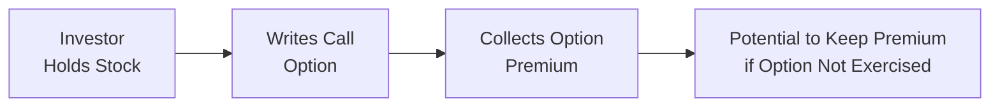
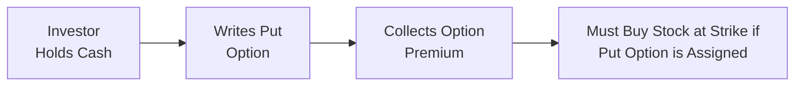

## 6.5 Why Investors Write Options

Have you ever heard someone say they “sell” an option? It’s basically the same as writing an option contract, where you create a new options position and collect a premium from the buyer. Early on in my own investing journey, I remember feeling a bit intimidated by the idea of writing options—like, who wants to have an obligation to deliver or buy shares? But as I got more comfortable, I realized writing options can be a powerful tool for many portfolio objectives, from generating income to setting up conditional entry points on a stock you love.

In this section, we’ll walk through some of the reasons investors choose to write options. We’ll also explore margin and regulatory considerations, especially important in the Canadian marketplace, including guidelines from the Canadian Investment Regulatory Organization (CIRO). Let’s roll up our sleeves and dig into the details.

---

### Understanding the Basics of Writing Options

When someone says they “write” an option, they are effectively creating or originating that option contract. The buyer of the option pays a premium to the writer in exchange for certain rights:

• A call option buyer has the right (but not the obligation) to buy the underlying security at a specified strike price before or at the expiration date.  
• A put option buyer has the right (but not the obligation) to sell the underlying security at a specified strike price before or at the expiration date.

By contrast, the writer (seller) of that call or put option takes on the obligation:

• A call writer must deliver the underlying security if assigned (i.e., if the buyer exercises).  
• A put writer must purchase the underlying security if assigned.

Because of this obligation, option writers typically earn an immediate premium in their account—money that is theirs to keep, no matter what. But that premium comes with risk: if the market moves against the writer, they might have to fulfill the contract at an unfavorable price or opportunity cost.

---

### Key Motivations for Writing Options

#### Income Generation

Many people initially discover option writing for its income potential. Picture this: you own a portfolio of blue-chip stocks that you think might not move dramatically in the short term. If you write (sell) call options on those shares, you collect an option premium from the buyer. This is commonly referred to as a covered call strategy (because your obligation to deliver the shares, if necessary, is “covered” by the fact that you already own them).

• If the call option is never exercised by the buyer, you keep the premium and your shares.  
• If it is exercised, well, you must deliver your shares at the strike price, possibly foregoing further upside if the stock rallies past that level.

Income generation also works with a strategy known as a cash-secured put, where you set aside enough cash in your account to buy the underlying stock if the put option is assigned. While you wait, you collect the premium from the put buyer. It’s a strategy some investors use to buy stocks “on sale,” effectively reducing the net cost if the shares do get put to them.

> “I once used a cash-secured put on a stock I really liked but felt was slightly overpriced at the time. I collected the premium, and when the stock dipped, I acquired it at an effective discount.”

Using short options for income is especially appealing if you believe the underlying will remain in a stable price range. You are essentially monetizing “time” by playing on the probability that the option will expire worthless, allowing you to pocket the premium.

#### Partial Hedge

Another reason investors might write options is to offset certain risks in their holdings, though it might be more accurate to call it a “partial offset” rather than a full hedge. For example, writing a covered call on a stock you own can help reduce the overall volatility of your position. While you won’t be protected if the stock price plunges, the premium you collected can help cushion the blow a bit, offsetting some of the loss.

Imagine your stock experiences a small drawdown—maybe 3%—over the next month. If you sold a covered call and earned a 1% premium in that same period, your net drawdown is effectively 2% instead of 3%. So, you’re partially hedged. Alternatively, some investors prefer writing calls or puts on positions to generate a steady premium stream that helps them manage the cost basis of their holdings.

#### Conditional Entry and Exit

We’ve all been there: you see a promising stock, but you’d love to buy it at a slightly lower price. Or maybe you have shares you’d be happy to sell if they hit a certain price. Writing puts or calls can be a deliberate way to set those price targets:

• Writing puts at a lower strike price: If assigned, you effectively buy the shares at that strike (and your net cost is the strike minus the premium). That might feel like a bargain if you were planning to buy at that price anyway.  
• Writing covered calls at a higher strike price: If your call gets exercised, you effectively sell your shares at the strike price (plus the premium). It’s like saying, “Sure, I’ll sell if the market offers me a good enough price.”

This approach can be more appealing than placing a limit order, because at least you receive an option premium for being willing to buy or sell. However, remember the trade-off: the market might move considerably in your favor (beyond your strike price), and you’ll miss out on that upside.

---

### Benefiting from Time Decay (Theta)

Time decay, often symbolized by the Greek letter Theta (θ), is the erosion of an option’s time value as it approaches expiration. If you’re the option buyer, time decay is your enemy—an option’s extrinsic value shrinks as expiration draws near. But for the option writer, it’s usually an ally, because each day that passes can make the option cheaper to buy back or more likely to expire worthless.

• Short calls and puts have positive Theta—this term roughly captures how much the option’s value might decrease with each passing day (all else being equal).  
• Over time, that decay accelerates, especially in the final 30 days before expiration.

The presence of time decay is one of the central forces behind premium-selling strategies. As a writer, you rely on decay shrinking the option’s price. Provided the underlying price remains within a certain range, you capture that decay as profit. I personally find writing shorter-term options (say 30 to 45 days until expiration) an interesting sweet spot because Theta decay is fairly pronounced, but there’s still enough premium to make it worthwhile.

---

### Margin and Regulatory Considerations (CIRO Guidelines)

Under Canadian regulations, margin requirements for written (short) options are set by the Canadian Investment Regulatory Organization (CIRO). Margin is crucial because writing an option can carry significant obligations. If you’re short a call without owning the underlying shares (i.e., a naked call), your potential risk is theoretically unlimited—if the stock surges, you’d need to buy shares at a higher price to deliver them at the lower strike price to the option holder.

In practice, your broker calculates margins to ensure you have enough capital or collateral to fulfill potential obligations. Some strategies—like covered calls or cash-secured puts—have less margin pressure because your risk is defined (you already own the shares or have earmarked the cash to buy them). But more speculative plays, such as naked calls, require additional margin.

It’s essential to stay up-to-date with the margin bulletins posted on CIRO’s website at https://www.ciro.ca. These bulletins detail how much margin you need, based on factors like:

• The underlying security’s price and volatility.  
• The strike price relative to the current market price.  
• The strategy type (covered vs. uncovered).  
• The time until expiration.

Additionally, the Bourse de Montréal provides margin calculators (https://www.m-x.ca) to help you estimate margin requirements, especially for complex multi-leg strategies. If your margin is insufficient, your brokerage might issue a margin call, requiring you to deposit more funds or close positions to reduce risk.

---

### Case Study: Writing Covered Calls on a Canadian Energy Stock

Let’s say you have 500 shares of a major Canadian energy company trading at CAD 40/share. You’re somewhat neutral-to-moderately bullish over the next month but don’t expect a dramatic price move.

1. You write five call option contracts (each contract = 100 shares) at a strike price of CAD 42, collecting a premium of CAD 1 per share for a total premium of CAD 500.  
2. If, at expiration, the stock remains below CAD 42, your calls likely expire worthless. You keep the CAD 500 premium.  
3. If the stock price exceeds CAD 42, your shares may be called away, meaning you have to sell at CAD 42. So your maximum profit is CAD 500 (the premium) plus the CAD 2/share gain from 40 to 42 = CAD 1,000 on 500 shares, for a total of CAD 1,500. Of course, you wouldn’t benefit from any price above 42.

In this scenario, you used a covered call primarily to generate extra income on a stock you already owned. You also accepted the possibility that you might have to part with your shares if the calls were exercised.

---

### Case Study: Writing Cash-Secured Puts on a Canadian Bank

Imagine you have CAD 10,000 in cash you’re looking to invest in a prominent Canadian bank. Shares are trading at CAD 100 each, but you’d prefer to buy them around CAD 95.

1. You write one put contract (100 shares) with a strike price of CAD 95, collecting a premium of CAD 2 per share for a total of CAD 200.  
2. You set aside CAD 9,500 (plus some margin buffer).  
3. If, at expiration, the stock is above CAD 95, the put may expire worthless, and you keep your CAD 200. You still have your CAD 9,500 in cash.  
4. If the stock is below CAD 95, you might be assigned. You must buy 100 shares at CAD 95. Your net cost is effectively CAD 93/share because you also collected a CAD 2 premium.

This approach allows you to buy the stock at a target price you believe is fair (or better than the market price when you initiated the trade), all while earning a bit of premium income.

---

### Common Pitfalls and Risks

Though writing options can be exciting and potentially profitable, there are pitfalls and risks investors should be aware of to avoid unpleasant surprises:

• Unlimited Risk with Naked Calls. If you write calls on underlying securities you do not own, you could face theoretically unlimited risk if prices skyrocket.  
• Obligation to Perform. Writers are obligated to fulfill the contract if assigned, sometimes at inopportune times (e.g., when the market is illiquid or volatile).  
• Margin Calls. Short options require margin. If the underlying moves against your expectations, your broker may request more collateral to secure your obligations.  
• Missed Upside. If you wrote a covered call on a stock that surges, you might feel regret as you watch potential gains evaporate beyond the strike price.

Practicing discipline with position sizing, monitoring your margin, and having a contingency plan if the positions move out of your comfort zone are crucial steps in writing options responsibly.

---

### Regulatory Landscape and Resources

Canada’s regulatory framework for derivatives is somewhat unique because, historically, there were separate self-regulatory organizations for investment dealers (IIROC) and mutual fund dealers (MFDA). As of January 1, 2023, these have amalgamated into the Canadian Investment Regulatory Organization (CIRO). CIRO sets the rules for margin requirements and market integrity for options trading on Canadian marketplaces, including the Bourse de Montréal.

For official margin guidelines, bulletins, and compliance rules:

• Visit the CIRO website at https://www.ciro.ca, which now integrates all guidance formerly issued by IIROC or MFDA.  
• Explore the Bourse de Montréal’s margin calculators and bulletins at https://www.m-x.ca.  
• If you’re looking for advanced option-writing strategies, you might check out “The Option Trader’s Handbook” by George Jabbour and Philip Budwick.

---

### Practical Tools and Open-Source Frameworks

Interested in exploring hypothetical trades or backtesting different option-writing strategies?

• Online open-source libraries (e.g., Python-based frameworks like PyQuant and Backtrader) allow you to simulate how a strategy would have performed historically.  
• The Bourse de Montréal’s official site includes tools to price Canadian-listed options and examine implied volatility metrics.  
• Many Canadian brokerage platforms now offer robust paper trading environments to practice writing options without risking real funds.  

It’s wise to do significant practice in a simulated environment before committing real capital—especially if you’re new to selling options.

---

### Additional Mermaid Diagrams

Below is a simple visual representation of the covered call strategy:

And here’s a snapshot of a cash-secured put approach:

---

### Best Practices for Option Writers

• Know Your Exit Plan. If you write an option, ask yourself: “What will I do if I’m assigned?” or “How will I manage this if the trade goes in my favor? Against my favor?”  
• Check Your Margin Frequently. Market conditions can shift fast, and you don’t want a surprise margin call.  
• Avoid Overconcentration. Don’t place all your eggs in one basket. Distributing your written options across multiple securities or sectors can reduce risk.  
• Monitor Volatility. High implied volatility means higher premiums. But higher volatility also means bigger potential moves. Assess whether your strategy aligns with the current volatility environment.  
• Regularly Review CIRO Updates. Regulations and margin guidelines can evolve, especially during times of market stress or new regulatory changes. Staying current can help you avoid compliance issues.

---

### Glossary of Key Terms

• **Covered Call:** An option strategy in which an investor owns the underlying shares and simultaneously writes (sells) call options on those same shares.  
• **Cash-Secured Put:** A strategy where an investor writes a put option while keeping enough cash on hand to buy the underlying shares if assigned.  
• **Time Decay (Theta):** The reduction in an option’s extrinsic (time) value as the option’s expiration date approaches. Beneficial to the writer, detrimental to the buyer.  
• **Margin Requirement:** The amount of capital (or collateral) mandated by the broker, under CIRO regulations, that must be held to secure a short option position.  
• **Obligation:** The duty of an option writer to fulfill the contract terms (deliver the stock in the case of a written call, buy the stock in the case of a written put) if assigned.

---

### Conclusion and Encouragement

Writing options can be a versatile strategy for investors who want to enhance yields, set price targets for entry or exit, or partially hedge existing positions. Yes, there’s risk involved, but by choosing the right strategy (e.g., covered vs. naked) and carefully monitoring margin requirements, you can make short option positions work for your portfolio goals. Whether you’re aiming to generate premium income, accumulate shares at a targeted price, or offset your cost basis, writing options can introduce a whole new dimension to your investing playbook.

If you’re feeling unsure, it can be helpful to “paper trade” (practice in a simulated environment) or start small before scaling up. Also, take advantage of official resources, such as the Bourse de Montréal’s margin calculators, and keep an eye on evolving regulations through the CIRO website. Over time, you might find that writing options consistently is one of the more rewarding ways to exercise your market opinions—especially if you’re patient and risk-conscious.

---

## Sample Exam Questions: Why Investors Write Options



### Why might an investor choose to write a put option as part of a cash-secured put strategy?
- [x] To potentially buy the underlying stock at a lower effective price while earning premium income.
- [ ] To protect against a sudden drop in an owned stock’s price.
- [ ] To guarantee they will never have to purchase the stock.
- [ ] To increase the stock’s price volatility for arbitrage trades.

> **Explanation:** Writing a put option in a cash-secured put strategy involves setting aside enough cash to purchase the underlying if assigned, effectively allowing the writer to acquire shares at a discounted price (strike minus the premium).

### Which of the following best describes time decay (Theta) from the perspective of an option writer?
- [x] Time decay typically works in favor of the option writer by eroding the option’s extrinsic value.
- [ ] Time decay benefits the option buyer more than the writer.
- [ ] Time decay has no effect on the value of an option.
- [ ] Time decay only applies near expiration dates.

> **Explanation:** The phenomenon of Theta generally causes the extrinsic value of options to decline as expiration nears, which benefits option writers who can profit from the eroding premium.

### In a covered call strategy, what is the primary downside for the writer if the underlying stock price rallies sharply above the strike price?
- [x] They forgo additional gains higher than the strike price.
- [ ] They lose the premium they initially collected.
- [ ] They must pay extra margin fees to keep the position open.
- [ ] They face unlimited downside risk.

> **Explanation:** With a covered call, if the stock rallies well beyond the strike, the writer sells the shares at the strike price, missing out on any extra gains beyond that level.

### Which of the following is true regarding naked (uncovered) call writing?
- [ ] It has lower margin requirements than writing covered calls.
- [x] It exposes the writer to unlimited risk if the stock price surges.
- [ ] It requires the writer to own the underlying shares.
- [ ] It does not require any additional collateral or margin.

> **Explanation:** Writing a call without owning the underlying shares (naked call) can expose the writer to huge losses if the stock price shoots up, hence the potential for “unlimited” risk.

### One goal of writing a put option might be to:
- [ ] Protect the stock you already own.
- [ ] Generate higher volatility in the underlying market.
- [x] Attempt to purchase the underlying stock at a predetermined lower cost.
- [ ] Provide unlimited upside potential.

> **Explanation:** Writing a put often serves as a way to acquire a stock at a cheaper effective price if assigned. That’s the essence of the cash-secured put approach.

### According to current CIRO guidelines, which factor does NOT typically affect margin requirements for a written option position?
- [ ] The time until expiration.
- [x] The stock’s 52-week high from five years ago.
- [ ] Implied volatility levels.
- [ ] Whether the option is covered or uncovered.

> **Explanation:** Margin requirements take into account time to expiration, implied volatility, and whether the option is covered or not. A stock’s old 52-week high from five years ago is generally irrelevant to current margin calculations.

### How does writing a covered call partially hedge an existing stock position?
- [x] The premium received offsets some price decline of the stock, reducing net downside.
- [ ] It guarantees that the stock will never fall more than a fixed percentage.
- [ ] It eliminates all downside risk.
- [ ] It allows the writer to increase their long position after the premium is collected.

> **Explanation:** The premium from the call option provides a small cushion against minor declines, so it offers partial (not total) downside protection.

### What is a potential risk when using a cash-secured put strategy?
- [ ] Risk of unlimited loss if the stock price rises.
- [ ] Downgrade in credit rating from not owning shares.
- [x] Being assigned if the stock price falls below the strike price, requiring the investor to purchase the stock.
- [ ] Losing the premium if the option expires out of the money.

> **Explanation:** The biggest risk is that you get assigned and have to buy the stock at the strike price, which may be above the market price if it has fallen more than expected.

### Which scenario describes a successful outcome for a covered call writer?
- [x] The underlying stock remains below the strike price until expiration, allowing the writer to keep the stock and the premium.
- [ ] The stock price rises well above the strike price, and the writer repurchases the option for a higher premium.
- [ ] The option is assigned multiple times, forcing the writer to deliver stock without receiving any premium.
- [ ] The option expires worthless, meaning the writer does not collect the premium.

> **Explanation:** For a covered call, the ideal outcome is that the stock remains below the strike and the call expires worthless. In that scenario, the writer keeps both the underlying shares and the premium.

### True or False: Time decay accelerates in the final weeks of an option’s life, creating a sizable advantage for option writers who structure short-term trades carefully.
- [x] True
- [ ] False

> **Explanation:** Time decay generally accelerates in the latter part of an option’s life, so short-term options may experience faster decay, benefiting sellers who anticipate this erosion.


