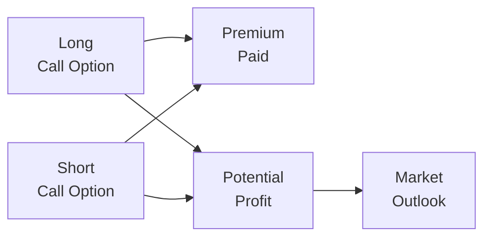

## 6.6 Other Related Benefits of Options

Sometimes, when I think back to the first time I discovered options, I remember feeling both excitement and a twinge of fear. I was sitting at my computer after I'd read about how large institutions use options for hedging. I wondered: “Could regular folks like me—who aren’t big hedge funds—actually harness these fancy contracts to gain an edge?” As it turns out, the answer is yes, and it’s actually a lot more accessible than many people realize. Besides the well-known uses—like hedging a portfolio against market drops or speculating on price movements—options offer a handful of other strategic perks. In this section, we’ll explore how options can be used to:

• Achieve greater flexibility in tailoring a position to a specific market outlook,  
• Take advantage of capital efficiency,  
• Bolster a portfolio with add-on benefits, and  
• Diversify or modify exposure to different asset types or markets.

Let’s see how all this might come together.

---

### The Power of Flexibility

If there’s one thing I’ve learned about options over the years, it’s that they’re super flexible. Most people first hear about calls and puts in the context of a single-leg trade: buy a call when you think the underlying will go up, buy a put when you think it will go down, etc. But that only scratches the surface. In reality, you can combine calls and puts in a variety of multi-leg strategies—also known as “spreads” or “combinations”—to craft a position that precisely matches your view on volatility, price direction, and risk tolerance.

A few quick highlights:

• **Spreads**: A spread strategy involves entering into multiple option positions (often two or more) at once. For example, you might buy one call while simultaneously selling another call at a higher strike price. This is called a “bull call spread.” It reduces the overall premium spent relative to buying a call alone and still provides some upside exposure.  
• **Straddles & Strangles**: These strategies involve buying (or selling) both a call and a put on the same underlying, aiming to profit from significant moves (or the lack thereof). For example, a long straddle is long one call and one put at the same strike, typically used if you expect a big move in the underlying, but you’re uncertain about direction.  

Let’s illustrate how different option legs might connect in a multi-leg strategy:

In this simplified diagram, we see two positions: one long call (A) and one short call (B). Together, they form one type of bull call spread. The net premium cost (C) is typically less than buying a single call because the short call offsets part of the cost of the long call. You might sacrifice some maximum upside (represented by D), but you gain a more affordable entry into a bullish position. Your market outlook (E) is that the underlying asset will rise moderately.

#### Personal Story: A Flexible Spread in Action

Let me share a quick story. A friend of mine felt Amazon stock might rise but wasn’t sure it would rocket up too high. She bought a bull call spread—buying a call at a lower strike and selling a call at a higher strike. This allowed her to spend less money upfront than simply buying a single call. When the stock price did increase—though not as explosively as she’d hoped—she was still able to capture a tidy profit. The beauty of her approach was how the built-in short call offset a big chunk of the cost.

Ultimately, flexibility isn’t just about a “nifty trick”; it allows you to fine-tune your payoffs for very specific scenarios. Whether you want to bet on a particular volatility forecast or simply reduce your out-of-pocket premium, there are countless possibilities for sophisticated structuring.

---

### Capital Efficiency

Another big perk with options—even simple single-leg positions—is the potential to gain or maintain exposure to an underlying interest without committing the full capital required to buy the underlying outright. This is one reason many large institutional portfolios keep options in their “toolkits”: you can express a view on a stock, index, or commodity with less initial cost than you’d need to purchase the underlying at market value.

#### Margin Versus Premium

When you buy an option, your risk is generally limited to the premium. For instance, if you buy a call option with a premium of C$2 per share on a 100-share contract, your maximum outlay is C$200 plus any commission (not counting minor fees). Contrast that to buying 100 shares outright—maybe that could cost you thousands of dollars. The capital saved can be used for other investments or to diversify into additional option strategies that compliment your primary thesis.

Now, we should be a bit careful though. Some option strategies, particularly those involving short options or multiple legs, do have margin requirements. Still, in many cases, the margin requirement for an option-based strategy can be lower than the capital needed to replicate the same exposure using the underlying asset. This capital efficiency is especially appealing for institutions but can also be beneficial for retail traders who want to manage multiple positions in a smaller account.

---

### Add-On Benefits to Portfolios

The more I talk to folks, the more I see them incorporate options as an extra “layer” on top of their existing portfolio. Options can do more than just protect or speculate; they can also adjust, enhance, or even transform the returns of a given portfolio—often without the need to liquidate or drastically alter the core holdings.

#### Generating Extra Income with Covered Calls

A classic example is the covered call strategy, where you own shares of a stock (or an ETF) and sell call options on that position. If the call option expires without being exercised (say the stock price didn’t rise above the strike), you keep the premium as additional income. And if the call is exercised, you deliver the stock at the strike price. This can be a way to “monetize” an asset you already own, especially if you expect moderate or sideways price movements. It’s like renting out your shares for a bit of extra cash.

#### Protective Puts for Peace of Mind

Another well-known example is the protective put, sometimes called a “married put.” If you’re worried about a downturn—or maybe you’ve racked up substantial gains and want to lock in some profits—a protective put can limit the downside risk of your stock. Sure, it costs you a premium, but that premium can buy peace of mind.

#### Adjusting Exposure Without Selling Core Positions

Maybe you don’t want to sell your shares because that might result in adverse tax consequences or because you still believe in the stock’s long-term prospects. With options, you can:

• Temporarily reduce your downside by buying puts,  
• Temporarily boost your upside if you’re quite bullish by buying calls, or  
• Generate income by selling calls.  

All these can be done while keeping your original position intact. No need to trigger a capital-gains tax event or shift your portfolio weighting if you don’t want to.

---

### Risk Diversification

Options also provide a handy road into new asset classes without necessarily requiring big up-front capital. For instance, an investor who mainly trades stocks could buy commodity options to gain exposure to gold, oil, or agricultural products. Alternatively, you might use index options to get exposure to an entire stock index (like the S&P/TSX 60 or the S&P 500 in the U.S.). By splitting your total capital across different option strategies—rather than putting everything into one single equity or commodity—you reduce (or at least refine) your exposure to single-stock risk.

Indeed, many professional money managers might combine equity options, environment-focused (ESG) derivative contracts, and commodity futures or swaps to shape a diversified “macro” portfolio. While each approach has its own intricacies, the unifying theme is that options-based diversification can open numerous pathways without huge lumps of capital or forcibly rearranging existing positions.

---

### Corporate Finance Activities and Embedded Option Features

You might also hear about other “option-like” instruments in corporate finance. Two common examples are convertible securities and employee stock options. These differ from exchange-traded options but they share some conceptual similarities:

• **Convertible Securities**: These are typically corporate bonds or preferred shares that can be converted into a specific number of common shares under certain conditions. The embedded feature is like an option to convert, but it’s not the same as a standard exchange-traded call price structure.  
• **Employee Stock Options (ESOs)**: These are granted by a company to its employees as part of compensation packages, giving employees the right to buy the company’s stock at a pre-determined strike price. ESOs are not typically traded on an exchange; they usually have vesting schedules and other conditions that differ from exchange-traded options.  

So, if you come across these terms, keep in mind they’re forms of optionality but don’t have the standard rules, margin requirements, or liquidity that exchange-traded options do.

---

### Regulatory Context and Resources

In Canada, all derivatives activity—including options trading—is regulated under the umbrella of the Canadian Investment Regulatory Organization (CIRO). CIRO came about from the amalgamation of the historic MFDA and IIROC. As of January 1, 2023, these separate organizations have merged into a single self-regulatory body for investment dealers and market integrity. When it comes to advanced option strategies (like multi-leg spreads, straddles, or strangles), there are bulletins and notices from CIRO that provide guidance about best practices, margin requirements, and client disclosure.

#### References for More Guidance

• **CIRO Resources**: You can find bulletins and guidance on advanced options usage, margin rules, and best practices at [https://www.ciro.ca](https://www.ciro.ca).  
• **Bourse de Montréal**: The Bourse offers a variety of educational materials, including their strategy literature on spreads and combos, at [https://www.m-x.ca](https://www.m-x.ca).  
• **Canadian Securities Institute (CSI)**: The CSI has online courses that delve deeply into derivatives, which can be great if you want to move from beginner to more advanced.  

Between these resources and continuing educational pathways, you can keep building your knowledge about new developments in the Canadian derivatives market.

---

### Practical Financial Examples and Case Studies

To bring some of these ideas to life, let’s consider a couple of scenarios illustrating how these benefits can pan out in practice.

#### Case Study 1: Boosting Portfolio Yield with Covered Calls

Imagine you hold 1,000 shares of a well-known Canadian bank. You enjoy the dividends and long-term stability, but you’d like to earn extra income. By selling 10 call option contracts on those shares (each contract typically representing 100 shares), you receive option premium. The catch is that if the bank’s share price rises above the call’s strike price, you might have to deliver your shares. With that said, if the share price only inches upward or remains relatively flat, you keep the premium and the shares.

• **Outcome**:  
  - If the stock remains below the strike at expiration, you keep the premium and still hold your shares.  
  - If it goes above the strike, you deliver the shares at the strike price—realizing any gain from your original cost to that strike.  

Either way, the covered call can be an efficient method of earning income while letting you hold onto a core portfolio position. The capital efficiency is self-evident: you own the underlying, and your outlay for the short call is zero net cost (instead, you receive a premium).

#### Case Study 2: Hedging Exposure with Index Puts

Now let’s say you are managing a balanced portfolio that mimics the S&P/TSX 60. You’re worried about a potential market correction but you don’t want to liquidate your entire equity stake (maybe for tax reasons or because you believe the correction will be short-lived). You decide to buy protective puts on an S&P/TSX 60 index option.

• **Outcome**:  
  - If the market plunges, the protective puts rise in value, offsetting some or all of your portfolio losses depending on the puts’ strike.  
  - If the market sails upward instead, your lost premium on the puts is offset by your gains on the index.  

Yes, you pay a premium, but you maintain your longer-term positions. This is a classic example of how options can bring a measure of downside protection in a capital-efficient manner.

---

### Common Pitfalls

For all their benefits, options can be misused or misunderstood if you jump in too fast. Here are some potential pitfalls:

• **Over-Leverage**: Capital efficiency can be a double-edged sword. You can sometimes leverage your position beyond what your risk tolerance should allow.  
• **Time Decay & Wrong Strategy Selection**: If you buy near-term options and the anticipated price move doesn’t arrive quickly, time decay can eat into your investment.  
• **Ignoring Volatility**: Volatility is a key driver of option premiums. If you buy options at elevated implied volatility, you might suffer losses even if your directional thesis is correct (because implied volatility might drop).  
• **Insufficient Understanding of Complex Strategies**: Multi-leg trades can get complicated. Spreads, straddles, and condors each have unique margin requirements and risk profiles. Always ensure you know how to manage these positions.  

---

### Glossary Review

• **Spread Strategy**: Entering positions in multiple options (calls, puts, or both) to refine the risk/reward profile. For example, a bull call spread combines one long call and one short call at a higher strike price.  
• **Straddle/Strangle**: Strategies that involve both a call and a put on the same underlying. A long straddle is used to speculate on large moves in either direction. A strangle is similar but uses out-of-the-money calls and puts.  
• **Convertible Securities**: A debt or preferred equity instrument that can be converted into common stock. It’s an embedded option but not the same as an exchange-traded contract.  
• **Employee Stock Options (ESOs)**: Options granted by companies to employees as part of compensation. Again, these differ from exchange-traded options in terms of exercise terms, liquidity, and settlement.

---

### Best Practices and Strategies to Overcome Common Issues

• **Set Clear Objectives**: Know your primary goal before entering an option trade. Is it capital appreciation, income generation, or hedging?  
• **Use Appropriate Position Sizing**: Don’t over-leverage. Keep your option positions in line with your risk tolerance and broader portfolio.  
• **Maintain Adequate Liquidity**: Keep tabs on the liquidity of the options you’re trading. Less liquid options can have wide bid-ask spreads, causing inefficiencies.  
• **Stay Informed**: Track the underlying’s volatility and market news—especially around earnings or economic announcements. Remember that implied volatility often spikes before major news.  
• **Utilize Specialized Tools**: Many broker platforms provide free or low-cost analytics for Greeks, implied volatility, and probability calculations. Tools like the Bourse de Montréal’s Option Calculator can help you gauge theoretical values.

---

### Wrapping Up

Whether you’re a seasoned pro or someone like me, wide-eyed at the possibilities, it’s clear that options aren’t just about all-or-nothing bets. They can be used strategically for:

• Fine-tuning your exposure with multi-leg flexibility,  
• Attaining capital efficiency relative to outright underlying ownership,  
• Enhancing or adjusting portfolio returns without scrapping your favorite stocks, and  
• Diversifying into new markets or asset classes.  

The best part is that, with the right education and a disciplined approach, these benefits can be harnessed responsibly. Options truly shine when integrated thoughtfully into your broader financial strategy, helping you navigate markets with more nuance.

If you’d like more detailed information, you can explore CIRO bulletins for advanced topics in derivatives regulation or check out the Bourse de Montréal’s educational portal. Keep learning, explore small test trades if that helps you gain confidence, and don’t hesitate to consult licensed professionals if you’re venturing into complex areas.

---

## Sample Exam Questions: Other Related Benefits of Options



### Which of the following statements best describes a key advantage of multi-leg option strategies (spreads)?

- [ ] They have zero risk regardless of market movements.
- [x] They allow traders to target specific risk/reward profiles.
- [ ] They require very high margin relative to single-leg positions.
- [ ] They are only permissible for large institutional portfolios.

> **Explanation:** One of the key advantages of multi-leg strategies such as spreads is the ability to shape a more precise risk/reward profile to match the trader’s market outlook.  

### Which of the following is a common way to generate income on a security you already own?

- [ ] Buying a put option on the security.
- [x] Writing a covered call.
- [ ] Buying a call option on the security.
- [ ] Constructing a long straddle.

> **Explanation:** Writing (selling) a call on a stock you already hold is known as a covered call strategy; it can generate extra income from the option premium.  

### How might options enable capital efficiency compared to directly purchasing shares outright?

- [ ] By eliminating margin requirements entirely.
- [ ] By removing all transaction costs for the investor.
- [ ] By reducing time decay costs in highly volatile markets.
- [x] By allowing exposure to price movements with a smaller initial outlay.

> **Explanation:** Options typically require paying only the option premium (plus margin in certain strategies), representing a smaller capital outlay than purchasing the underlying asset.  

### Which of the following best describes a married put (or protective put) in a bullish situation?

- [x] You hold the underlying stock and buy a put to limit downside risk.
- [ ] You sell a put while holding no position in the underlying.
- [ ] You buy a put without holding any shares of the underlying.
- [ ] You sell both a put and a call on the underlying at the same time.

> **Explanation:** A protective put involves purchasing a put option on an asset you already own, thereby offering a floor for potential losses.  

### Which scenario best illustrates diversification benefits of options?

- [x] Adding commodity options to a predominantly equity-based portfolio.
- [ ] Writing covered calls only on one single stock.
- [ ] Buying calls on the same stock each month.
- [ ] Purchasing only deep in-the-money calls on a single index.

> **Explanation:** Diversification with options could mean adding new asset classes, like commodities, without large capital commitment.  

### In what scenario might you consider stock index puts?

- [ ] If you’re expecting a rise in the index within a week.
- [ ] If you want to write covered calls on the index.
- [x] If you want to hedge a broad equity portfolio from a major downturn.
- [ ] If you prefer to invest only in fixed income.

> **Explanation:** Stock index puts are commonly used to hedge against a large downward move in a broad equity portfolio.  

### What does it mean for an employee stock option to be “non-exchange-traded”?

- [ ] It can be exercised anytime but is also listed on the Bourse de Montréal.
- [ ] It follows standard contract specifications set by the exchange.
- [ ] It is available to the public at a premium.
- [x] It’s an option granted by the employer with its own terms and is not listed on any exchange.

> **Explanation:** Employee Stock Options (ESOs) have unique vesting and exercise rules, are not standardized, and are not traded on public exchanges.  

### Which resource is particularly useful for official regulatory guidance on advanced option strategies in Canada?

- [ ] IIROC bulletins (current and active).
- [ ] MFDA bulletins (current and active).
- [ ] SEC bulletins for U.S. securities exclusively.
- [x] CIRO bulletins and notices.

> **Explanation:** CIRO stands for the Canadian Investment Regulatory Organization, which provides the current regulatory oversight and publishes bulletins on options in Canada.  

### Why might an investor incorporate a protective put instead of selling shares?

- [ ] To completely eliminate all risks related to holding shares.
- [ ] To maximize profits if the stock surprisingly surges.
- [ ] To generate immediate premium income.
- [x] To maintain ownership (and potential upside) while limiting downside exposure.

> **Explanation:** A protective put allows an investor to hold onto shares (thus retaining potential gains) while limiting downside risk through the purchased put.  

### True or False: Selling a call option against shares you hold can help generate extra income but caps your potential capital gains if the call is exercised.

- [x] True
- [ ] False

> **Explanation:** Covered calls generate income from premiums; however, if the underlying stock price exceeds the call’s strike at expiration, one must deliver shares at that strike, capping upside potential.


