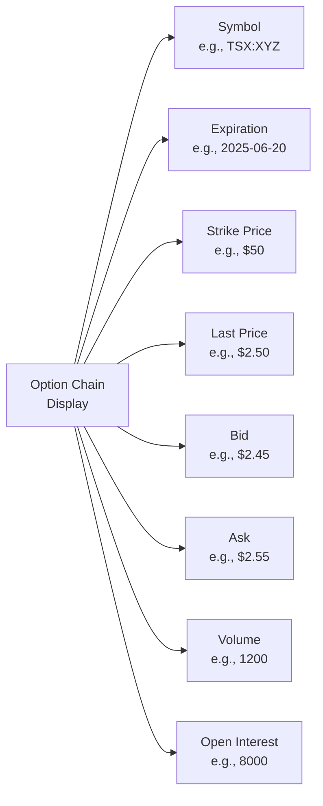
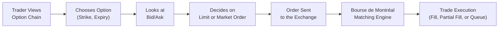

## 6.8 Reading Option Quotations

Imagine you're all set, coffee in hand, ready to place your first options trade—maybe you want to speculate on a stock you believe is going to shoot up, or perhaps you’re trying to protect your portfolio against a sudden dive in the market. You pull up the trading platform, and… your eyes glaze over at this matrix of columns, colors, and abbreviations. We’ve all been there. Reading an option quotation (often called an “option chain”) can feel intimidating at first glance. But trust me, after a few run-throughs, you’re going to realize it’s not nearly as complicated as it looks.

This section is about helping you parse that cryptic screen full of letters, numbers, and Greek letters so you can make informed, confident trades. We’ll discuss each piece of data commonly found in an option chain, focusing on the Canadian marketplace. There will be references to CIRO (the Canadian Investment Regulatory Organization), which has oversight for investment dealers in Canada, as well as practical tips and best practices on how to interpret everything you see.

---

### Why Reading Option Quotations Matters

A quick anecdote: When I first started reading option quotes, I thought the last traded price was the guaranteed price I could buy or sell at. Um, no. If you’ve ever tried to buy an option at the last traded price without checking the current bid and ask, you know that feeling of confusion (and sometimes frustration). The difference between the last traded price and the current ask price can be significant enough to throw off your trade’s profit potential. That’s why it’s important to understand all the variables that go into an option chain.

Beyond the direct prices, the real-time or delayed quotes, open interest, volume, and “Greek” sensitivities give you essential clues about liquidity, potential transaction costs, market sentiment, and even how your option’s value might change with market movements. We’ll break all this down in a friendly, step-by-step way.

---

### Key Data Fields in an Option Quotation

Before diving into a sample option chain layout, let’s go over the core elements you’ll encounter, along with their common abbreviations on most broker platforms in Canada (including those regulated by CIRO, such as Questrade, TD Direct Investing, RBC Direct Investing, etc.):

**• Underlying Asset Symbol**  
This is the ticker for the stock, ETF, or index that the option is based on. For instance, if you’re interested in an option on Shopify (listed on the Toronto Stock Exchange), you might see the symbol “SHOP.”

**• Expiration Date**  
The date on which the option contract expires. It’s typically displayed in a format like YYYY-MM-DD (e.g., 2025-06-20). Options can have weekly, monthly, or quarterly expiries, plus special ones (like end-of-month or long-term Equity Anticipation Securities (LEAPS®)).

**• Strike Price**  
This is the price at which the underlying asset can be bought or sold if the option is exercised. So, if you have a call option with a strike of $50, that means you have the right (but not the obligation) to buy the underlying stock at $50 before the option expires.

**• Last Traded Price**  
This shows the most recent price at which the option traded. It’s not necessarily the price you’ll get if you place a trade right now—markets shift every second, so you should also check the current bid and ask.

**• Bid Price**  
The highest price a buyer is willing to offer for the option at that moment. If you choose to sell your option immediately into the market, you’re generally going to get the bid price.

**• Ask Price**  
The lowest price a seller is willing to accept for the option at that moment. If you choose to buy the option immediately, you’re generally paying the ask price.

**• Bid/Ask Spread (Slippage)**  
The difference between the bid and the ask. This is important because that gap (often called “slippage”) is essentially part of the transaction cost you bear. Tighter spreads usually mean better liquidity and lower costs.

**• Volume**  
How many option contracts have traded in that particular series (with a specific strike and expiration) so far today. Higher volume can often imply more liquidity.

**• Open Interest (OI)**  
The total number of outstanding contracts (both calls and puts combined or sometimes shown separately, depending on the platform) that remain in the market but haven’t been closed or exercised yet. This is a measure of market participation and interest.

**• Greeks (Delta, Gamma, Theta, Vega, Rho)**  
Although not always visible by default, many platforms display option Greeks. These are risk measures that indicate how sensitive your option’s price is to various factors like changes in the underlying price (Delta), implied volatility (Vega), time decay (Theta), and so on. (For details, see Chapter 6.12 “Introduction to Option Greeks (Beyond Delta)” and Chapter 7 on “Pricing of Options.”)

**• Implied Volatility (IV)**  
Some broker platforms show implied volatility, which is the market’s forecast of the underlying asset’s volatility over the life of the option. It can be critical in determining whether an option might be expensive or cheap.

---

### Viewing an Option Chain: Basic Layout

Online brokerage platforms typically present an “Option Chain” table. Let’s visualize a simplified version using a Mermaid diagram. Don’t worry—this is just a conceptual illustration of how an option chain might be structured.

Often, calls are shown on one side (left) and puts on the other (right). In each column, you’ll see the above fields (last, bid, ask, volume, open interest, maybe the Greeks). In many trading interfaces, you can expand or collapse the details to see more advanced data like Level II market depth, historical volatility, and so forth.

---

### Real-Time vs. Delayed Quotes

In Canada, most brokers provide at least some real-time quotes for free or as part of a standard brokerage account. However, you might see disclaimers stating “Delayed 15 minutes” (or 20 minutes) for certain market data. This can be especially common for futures and certain specialized options data if you don’t subscribe to a real-time data package. If you’re actively trading or scalping options, you really need real-time updates. Delayed quotes can significantly hamper your ability to react to fast market movements.

CIRO sets guidelines that ensure transparent disclosure of whether quotes are real-time or delayed. Bourse de Montréal (the main Canadian derivatives exchange) also has subscription tiers for real-time market data at https://www.m-x.ca. If you plan on focusing heavily on options trading, it may be worth upgrading to a real-time data plan for the best possible information.

---

### The Role of CIRO in Market Data Display

You might wonder, “Why do regulators care about how quotes are displayed?” CIRO, Canada’s self-regulatory body since 2023 (formed from the amalgamation of IIROC and the MFDA), requires that all regulated brokers clearly state whether quotes are real-time or delayed, and that they comply with best execution rules. This ensures that you, as a retail investor or institutional trader, aren’t misled by stale prices while making critical trading decisions.

---

### The Importance of the Bid/Ask Spread

Let’s get back to that “slippage” concept. If the bid is $2.45 and the ask is $2.55, you can think of this 10-cent difference as frictional cost. The narrower that difference, the easier it is to enter or exit your position with minimal hidden fees. If you only look at the last traded price—say $2.50—and ignore the current bid/ask, you might place a limit order at $2.50, not realizing the spread is actually $2.45 to $2.55. Maybe your order sits in limbo, not getting filled, or you end up paying a higher cost.

For actively traded stocks with high-volume options (like major banks in Canada or high-profile tech stocks), you’ll typically see tighter spreads—often just a few pennies wide. For relatively illiquid options, the spread can be exorbitant, sometimes $0.20, $0.50, or more. That can hurt your profitability if you’re frequently trading.

---

### Volume and Open Interest

Volume and open interest both reflect market participation in an option series, but each tells you something slightly different:

• **Volume** is how many contracts have changed hands today. This can spike if there’s news, earnings, or market events.  
• **Open Interest** shows active positions carried overnight. If open interest is high, that generally implies there are plenty of market participants already engaged in that option. This often correlates with narrower spreads, but not always—still, it’s a good sign you won’t be the only person holding that contract.

Ah, I remember the first time I saw an option with zero volume and zero open interest. I actually tried to place a trade, then spent an awkward half-day wondering why no one was taking the other side. The moral of that story: low volume and low open interest can mean poor liquidity (and widening bid/ask spreads).

---

### Greek Indicators

Many platforms let you toggle a “Greeks” or “Analytics” view, which displays metrics like Delta, Gamma, Theta, Vega, and sometimes Rho. While reading these goes beyond the scope of “basic” quotes, they’re extremely useful. For instance:

• **Delta** tells you (roughly) how much the option’s price will change if the underlying stock moves by $1.  
• **Gamma** shows how your Delta will change with underlying price movements.  
• **Theta** measures time decay (how much the option loses in value each day, all else equal).  
• **Vega** gives you a clue about how sensitive the option is to implied volatility changes.

If you see, for example, that your Delta is 0.80, you’re dealing with a deep in-the-money call. That’s sort of like being long 80 shares of the underlying stock in terms of price movement (though you’re not actually holding the shares). For a more thorough explanation of Greeks, see Chapter 6.12 and Chapter 7 of this text.

---

### Slippage and Commission Considerations

Besides the bid/ask spread, you’ll also see explicit commissions if you elect to trade. Some brokers charge a base fee plus a per-contract fee. Others might roll it into one simple per-contract fee. Either way, keep the “slippage” in mind. Even in a commission-free environment, a wide bid/ask spread can be even more expensive than the actual commission.

---

### Market Depth (Level II)

You might hear about “Level II quotes” or “market depth.” This is the ability to see beyond the top bid and ask, revealing additional layers of buy and sell orders waiting in the order book. While not strictly necessary for longer-term position trading, seeing Level II data can help you figure out where big orders are hiding, or how quickly the market might move if a few orders execute. For some advanced or highly active traders, this provides an edge in timing trades.

---

### Tips for Reading Option Quotations Effectively

**Check Real vs. Delayed:** Always confirm whether your quotes are real-time or delayed.  
**Compare Last Price to Bid/Ask:** Avoid confusion. The last price might be stale or part of a spread.  
**Assess Liquidity:** Look at volume, open interest, and the bid/ask spread to gauge how liquid the option is.  
**Keep an Eye on Expiration:** Short-dated options (like weekly options) often have higher time decay (Theta).  
**Check Commissions and Other Fees:** Doesn’t matter if you’re making money on paper if fees are gobbling up your profit.  
**Consider the Greeks:** For a deeper understanding of how your option might move with the market, know your Delta, Vega, etc.  
**Review CIRO-Compliant Platforms:** Ensure you’re using a regulated broker that adheres to CIRO’s transparency and best execution guidelines.

---

### Common Pitfalls

• **Ignoring the Spread:** If you only look at the “last trade,” you might not realize you’ll have to pay more to buy or receive less when selling.  
• **Trading Illiquid Options:** This can result in large price swings and big gaps when you attempt to fill your order (or eventually close it).  
• **Overlooking Volume vs. Open Interest:** Low volume might mean the quote is not very active, and you could have trouble getting in or out at a good price.  
• **Unawareness of Greeks:** If you ignore Delta, you might not gauge the risk properly. For example, out-of-the-money options with a Delta near 0.05 can remain cheap, but they have a low probability of expiring in the money.  
• **Confusion over Real-Time vs. Delayed Quotes:** Relying on delayed quotes for fast-moving markets can lead to significant slippage or missed opportunities.

---

### Canadian Regulatory Context and Resources

Under CIRO oversight, all investment dealers in Canada must comply with certain standards when displaying quotes, providing disclaimers, and meeting “best execution” requirements. If you want official details, you can consult the CIRO website at [https://www.ciro.ca](https://www.ciro.ca). For more on listed options data and market rules, the Bourse de Montréal is a must-see resource:

• [Bourse de Montréal Market Data](https://www.m-x.ca)

Also, many broker sites offer free educational tools. For instance, Questrade has a section called “Market Research and Tools,” and TD Direct Investing’s “Thinkorswim” platform is known for a robust option chain interface. Familiarizing yourself with these tools can give you a solid foundation.

---

### Practical Example

Let’s paint a scenario: You’re looking at a call option on a Canadian energy company (say a large integrated oil producer) with a strike price of $30, expiring in about three months. The option chain shows:

• Underlying symbol: ENGY  
• Expiration date: 2025-06-20  
• Strike: $30 call  
• Last trade: $1.50  
• Bid: $1.45  
• Ask: $1.55  
• Volume (today): 2,500  
• Open interest: 10,000  

The 10-cent spread (between $1.45 and $1.55) is fairly reasonable, equating to a $10 difference per contract (since one option contract typically controls 100 shares). A volume of 2,500 is relatively decent, telling you there’s active trading. Meanwhile, an open interest of 10,000 indicates the market has a substantial number of open positions. 

If you place a limit order at $1.50, you’re right in between the bid and ask, so you might get filled near $1.50 if the market is moving, or if another trader sees your order and decides to match your price. If volume is high and the stock is stable, your chances of getting filled at (or near) the midpoint are pretty good.

Now imagine the same scenario but with a minor energy producer that hardly anyone trades, and you see a bid of $0.90 and an ask of $1.40. That’s a whopping 50-cent spread, or $50 per contract. If that’s the case, you might have to “meet in the middle” or wait around, hoping someone else steps in with a tighter quote.

---

### Additional Diagrams for Clarity

Sometimes, it helps to see a simplified flow of how an order is placed and executed within the context of an option chain:

This simple flow underscores the point that your “limit” or “market” order interacts with the current bid or ask in the marketplace. If you put in a market order to buy, you’re likely to get filled at—or near—the ask price. If you submit a market order to sell, you’ll generally get filled near the bid price. A limit order simply states your desired price, and if the market can’t match it right now, your order may sit unfilled until someone in the market is willing to meet that price.

---

### References and Further Reading

• [CIRO Website](https://www.ciro.ca) – For regulatory insights and updated guidelines on best execution and data transparency.  
• [Bourse de Montréal](https://www.m-x.ca) – Official site for Canadian listed options, featuring real-time data (available by subscription), contract specifications, and educational resources.  
• Questrade, TD Direct Investing, RBC Direct Investing – Canadian broker platforms offering free or subscription-based data.  
• Chapters 6.12 & 7 in this course – For more on Option Greeks, pricing mechanics, and deeper analysis.  

Keep exploring and practicing. Learning to read option quotations is the gateway to forming strategies—whether hedging, speculating, or something more advanced like covered calls or spreads. With each trade you watch or make, you’ll gain familiarity with how quotes update and how small differences in bid/ask or volume can impact your bottom line.

---

## Sample Exam Questions: Reading Option Quotations



### Which of the following metrics represents the highest price a buyer is willing to pay for an option contract?

- [ ] Ask Price
- [x] Bid Price
- [ ] Last Traded Price
- [ ] Midpoint Price

> **Explanation:** The bid price is set by buyers and indicates the highest price they are currently willing to pay for the option.

### Which of the following best describes "Open Interest" in the context of an options contract?

- [ ] The amount of money flowing into a particular underlying asset
- [x] The number of outstanding contracts that have not been closed or exercised
- [ ] The total number of trades executed in a single day
- [ ] The difference between the bid and the ask price

> **Explanation:** Open interest reflects positions that remain open; once a contract is closed or exercised, open interest is reduced by that number of contracts.

### Why is the difference between the bid and the ask price (spread) significant for an options trader?

- [x] It represents potential transaction cost or “slippage.”
- [ ] It predicts the future direction of the underlying stock.
- [ ] It directly affects the strike price.
- [ ] It indicates whether an option can be exercised or not.

> **Explanation:** A wide spread means higher slippage costs because you pay more when buying at the ask or receive less when selling at the bid.

### Which piece of information shows the most recent transaction price of an option?

- [ ] Bid
- [ ] Ask
- [x] Last Traded Price
- [ ] Open Interest

> **Explanation:** The last traded price is the price at which the most recent trade was executed, not necessarily the current executable price.

### If an option is highly illiquid, a trader may experience:

- [x] Wider bid/ask spreads
- [x] Fewer trades or lower volume
- [ ] Guaranteed execution at the last trading price
- [ ] Higher open interest under all circumstances

> **Explanation:** Illiquid options often have wider spreads and lower volume, making it tougher to enter or exit a position at a fair price.

### Which organization primarily oversees Canadian brokers to ensure transparent and fair display of real-time or delayed quotes?

- [ ] Ontario Securities Commission (OSC)
- [ ] CDCC
- [x] CIRO
- [ ] The Federal Reserve

> **Explanation:** CIRO is Canada’s current self-regulatory organization, ensuring compliance with best execution and market transparency rules.

### When you place a market order to buy an option, you typically pay:

- [x] The current ask price (or near it)
- [ ] The current bid price (or near it)
- [ ] The last traded price, exactly
- [ ] Half the difference of the spread

> **Explanation:** A market order executes at the best available price, which for a buy order is usually the ask price.

### Delayed quotes differ from real-time quotes in that they:

- [ ] Show the price before the market opened
- [x] Are reported with a time lag of up to 15-20 minutes
- [ ] Exclude bid/ask data
- [ ] Only show open interest and volume

> **Explanation:** Many data providers delay quotes by 15 or 20 minutes unless the user pays for a real-time subscription.

### If an option has significant volume for the day but very low open interest, it suggests:

- [x] Many trades occurred today, but positions were closed out or offset
- [ ] No trades occurred today at all
- [ ] The option is extremely liquid with a tight spread
- [ ] Traders have large, persistent open positions

> **Explanation:** High daily volume with low open interest can indicate that most trades offset existing positions rather than adding new, long-lasting open interest.

### A trader wants to see how Delta, Gamma, Theta, and Vega change in real time for specific options. Which of the following would be most relevant?

- [x] Option Greeks or “Analytics” tab on their trading platform
- [ ] Historical price data of the underlying
- [ ] Level II order book only
- [ ] Bond yield curve data

> **Explanation:** Greeks specifically address sensitivity of the option price to changes in various factors; the “Greeks” or “Analytics” tab is where these are found.


