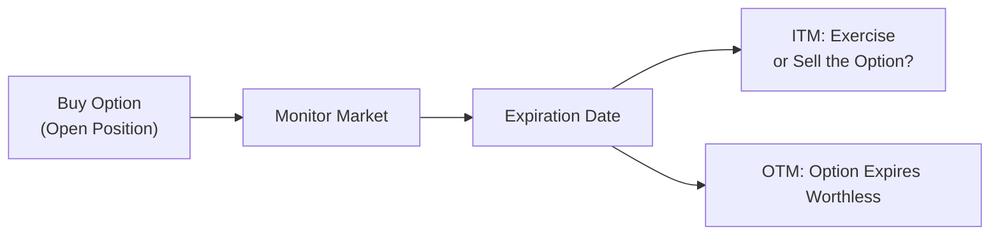

## 6.9 Common Questions Pertaining to the Options Market

Options trading can be exciting—like stepping onto a brand-new playing field where you’ve got a range of strategic possibilities. But it can also feel daunting, especially if you have only heard about how “risky” it is or how “complicated” the rules can be. So, let’s talk through some of today’s most common questions about options, from the basics of their risk profile to those notorious tax implications. I’ll also sprinkle in a couple of short personal anecdotes—moments when I myself was figuring out how margin works or what to do with a winning (or losing) option at expiration. Hey, if it helps you feel less alone as you navigate these decisions, it’s worth opening up a bit.

Before we dive in, remember that the Canadian Investment Regulatory Organization (CIRO) is the single self-regulatory organization that oversees the investment dealers and marketplace activity in Canada. Any references to predecessor organizations like IIROC or MFDA are historical. CIRO is your go-to resource if you have regulatory or compliance questions. It’s always a good idea to double-check the latest margin and registration requirements on the official CIRO website at [https://www.ciro.ca](https://www.ciro.ca).

––––––––––––––––––––––––––––––––––––––––––––––

How Risky Are Options Anyway?

I get asked this all the time: “Aren’t options extremely risky?” Well, yes and no. If you use options for pure speculation, especially with no risk-management plan, they can be riskier than many other investments. But if you use them carefully—say, buying a put option to protect against a drop in your stock portfolio—options can actually reduce your downside exposure.

• Why are they seen as risky? Options have leverage, meaning a relatively small initial premium can control a big chunk of underlying stock or another asset. This leverage cuts both ways. If you’re correct about the market’s direction, gains can be magnified. If you’re wrong, losses can build up quickly (especially if you’re writing uncovered calls or puts). In other words, you can lose more money than you thought possible if you don’t fully understand what you’re doing.

• Why might they be less risky than expected? Imagine you hold a big equity position in your portfolio and your biggest fear is a sudden drop in the market—maybe there’s a new round of interest rate hikes or an unanticipated macro shock. You can buy put options to offset some of that risk. If the market tanks, the put’s gains can help cushion your losses.

A decade ago, I remember buying my very first long put option on a copper mining stock. I was worried about a short-term slump in commodity prices, so I hedged the position. The cost of that put? Well, maybe it shaved a little off my overall return. But the peace of mind was worth every penny, because that dip in copper prices did happen, and my put offset some heavy losses. So, are options risky? Yes, they can be. But sometimes they can offer protection you can’t get elsewhere.

––––––––––––––––––––––––––––––––––––––––––––––

Do I Need Margin to Trade Options?

It depends on what you’re doing—buying them outright or writing (selling) them. CIRO sets out different requirements, so let’s break it down:

• Buying Options: If you buy a call or a put, you’re typically paying the premium in full. With a standard brokerage account, this doesn’t require margin to hold the position. You’ve paid your cost up front, so there’s no additional margin call for the premium itself. However, be mindful that many brokerages still require a certain level of option trading approval from CIRO-regulated dealers, particularly if you are new to options. They just want to ensure you know the basics of what you’ve signed up for.

• Writing Options: Selling (or writing) options is a different story. Here, you’re collecting a premium upfront, but you also might face unlimited risk (in the case of a written call without an offsetting position, also known as a “naked call”). Because your downside can be significant, margin is absolutely required. The exact margin formula can vary, but it measurements typically factor in the underlying stock price, strike price, and market volatility. CIRO and the Bourse de Montréal set minimum margin requirements; your brokerage might have stricter house rules on top of that.

• Spread Strategies: If you write an option but simultaneously purchase an offsetting option, you can lower your margin requirement. The net risk is smaller because you’ve got coverage. For instance, writing a call at one strike while buying a call at a different strike will typically reduce the margin from an outright short call.

• Regulatory Guidance: For official margin tables, check out CIRO bulletins or the Bourse de Montréal’s guidelines. These can change, so it’s always a good idea to confirm.

I still recall, years ago, I wrote a covered call (I owned the underlying shares, which I used as collateral) and was pleasantly surprised to see that I didn’t need extra margin. The long shares effectively “covered” my short call position. That’s an example of how margin requirements may not always be as intimidating as they seem.

––––––––––––––––––––––––––––––––––––––––––––––

What Happens at Expiration?

Options come with an expiration date. That’s the last day you can exercise the contract (if you hold a call or put) or the last day you can be assigned if you’ve written one. Three things can happen at expiration:

1. Exercised: If your call option is in-the-money (i.e., the underlying stock’s market price is higher than the strike price by expiration), you can choose to exercise. Exercising a call gives you the right to buy the underlying at the strike price. With puts, if the underlying’s market price is below the put’s strike price, you could exercise your put to sell the shares at the higher strike price. 

2. Assigned: If you write an option and it finishes in-the-money, you might be assigned an exercise notice. That means you must deliver shares (if you wrote a call) or buy shares (if you wrote a put). This is called “Assignment Risk,” and it can happen before the expiration date, especially with American-style options, which can be exercised any time.

3. Expires Worthless: If there’s no intrinsic value—meaning it’s out-of-the-money—then the option expires worthless. The buyer loses the premium paid, and the writer keeps the premium.

Here’s a simple flowchart illustrating these possible outcomes from the perspective of the option buyer:

If you prefer not to exercise (maybe you don’t want to buy or sell the underlying shares), you can usually close the option position in the market before it expires—assuming you find a willing buyer or seller. 

A friend once asked me, “Can I just let my in-the-money call option expire worthless because I don’t want to buy the stock?” I had to remind them that if it’s in-the-money, they can potentially sell that call for its intrinsic value rather than get stuck exercising or letting it expire. Some brokerages will automatically exercise your in-the-money option, but you’ll want to check your account terms to avoid an unwanted surprise on Monday morning!

––––––––––––––––––––––––––––––––––––––––––––––

How Are Options Taxed?

This is the part nobody likes to talk about, because let’s be honest: taxes can be confusing. The good news is that the Canada Revenue Agency (CRA) does provide guidance for how options are treated, and you can also consult your tax professional or official CRA bulletins if you’re unsure. Here are a few broad strokes:

• Capital vs. Income Treatment: The tax classification of your trading gains and losses may depend on factors like frequency of trades, whether you’re operating like a business, and how you’ve historically treated investment activity. If the CRA considers you a “non-professional” or “retail” investor, you might be eligible for capital gains treatment—meaning only 50% of your net gains are taxable. However, if you’re deemed to be a professional trader (or you’re running a business of trading), your gains might be counted as income and be 100% taxable.

• Premium Received from Writing Options: If you write a call (or a put), you typically take in the premium. When and how that premium gets recognized may vary. For certain strategies, the premium might be adjusted into the cost base of your underlying shares. For others, you might show a capital gain if the option expires worthless. 

• Exercised vs. Offset: If you hold an option and choose to exercise, the premium you paid can get folded into the cost basis of the resulting position. On the other hand, if you close the option trade outright (for instance, selling a call option you previously bought), you typically realize a gain or loss based on the difference between the cost of the option and the sale price.

• Non-Registered Accounts vs. Registered Accounts: In Canada, you can hold some option strategies within registered accounts like RRSPs or TFSAs, but it’s crucial to verify rules about permissible derivatives usage. Gains on eligible investments inside a TFSA, for instance, are tax-free, while your trading in an RRSP is tax-sheltered but eventually taxed as income upon withdrawal. 

If you’re not sure about any of this, consult the CRA publications or your personal accountant. There might also be updated bulletins or official guidance posted by the Canadian Securities Administrators (CSA) that can clarify your reporting obligations for your derivative trades.

––––––––––––––––––––––––––––––––––––––––––––––

Glossary Highlights

Below are a few of the terms used throughout this discussion. You’ll also see them referenced in other parts of Chapter 6:

• Assignment Risk: If you’ve sold options, you can be assigned at any time (for American-style options) once the option is in-the-money. This means you must fulfill the terms of the contract—typically buying or selling the underlying asset.

• Expiration: The date upon which the option contract ceases to exist. After this date, the contract can no longer be exercised, and it has no value (unless you exercised it beforehand). 

• Worthless Expiry: An option that finishes out-of-the-money has no intrinsic value and thus expires worthless. The option buyer loses the entire premium, while the option writer keeps the premium.

• Capital vs. Income Treatment: The CRA decides whether your trading gains are treated as capital gains (where only half are taxable) or business income (fully taxable). This distinction depends on factors like sophistication, frequency of trades, and other circumstances.

––––––––––––––––––––––––––––––––––––––––––––––

Best Practices and Common Pitfalls

• Always Have a Strategy: Don’t just jump in because you heard your neighbor saying Tesla calls are “the next big thing.” Understand why you’re using options—are you hedging, speculating, generating premium income?

• Familiarize Yourself with Margin Calls: If you’re writing options and the market moves against you, your broker can issue a margin call. You’ll be asked to deposit additional funds or close your position. Keep spare capacity in your account so you don’t scramble at the worst possible time.

• Pay Attention to Time Decay: If you buy an option, every day that passes can chip away at its time value, especially as expiration nears. Don’t just assume a trade will come back to life next month.

• Watch Out for Early Assignments: American-style options can be exercised at any time up to expiration, which might blindside you if you’re short an option and not paying attention to dividends, interest, or other triggers that motivate early exercise.

• Tax Recordkeeping: Keep detailed records of your entry price (premium), exit price, and any assigned or exercised positions. Tracking your Adjusted Cost Base (ACB) can get messy if you’re doing a lot of trades or using complex strategies—like multi-leg spreads.

• Check Regulatory Updates: Rules evolve, and margin rates or contract specifications can change. The Bourse de Montréal regularly updates strike price intervals, contract months, or listing procedures. You can also see new bulletins from CIRO covering changes in margin or reporting requirements.

––––––––––––––––––––––––––––––––––––––––––––––

Practical Example: A Simple Call Purchase

Let’s say you purchase one call contract on a Canadian tech giant, with a strike price of $100 and two months to expiration. The option premium is $5.00 per share, and since one options contract typically represents 100 shares, your total cost is $500 ($5.00 × 100). Suppose the stock climbs from $95 to $108 before expiration. The call is now in-the-money by $8. If you exercise, you’d buy the stock at $100 instead of $108, effectively netting a $3 profit on the contract once you account for the $5 premium paid (so, $8 intrinsic value minus $5 cost). Alternatively, you could just sell the call in the market for its (hopefully) increased premium.

In real life, you also need to factor in commissions, transaction fees, potential assignment risk if you decide to write an option, and the tax classification. If you were short the call in this same scenario, you’d face a potential loss if assigned or if you had to buy back your short call for $8.00+ in the market. That’s the difference in perspective between the buyer and the writer—one is paying, the other is receiving, but those roles flip quickly if the stock moves against your initial bet.

––––––––––––––––––––––––––––––––––––––––––––––

Real-World Anecdote on Expiry Day Volatility

Sometimes, you’ll find that the stock price whips around on expiration day, especially if there’s major news or an earnings release. People often try to hold on, thinking a last-minute rally will salvage a losing trade. I once had a short call that was safely out-of-the-money until about 3:40 pm (20 minutes before market close) on expiration day. Then the stock soared. By the closing bell, that call was in-the-money by a few cents, and I was promptly assigned over the weekend. Suffice it to say, you don’t want to leave your positions unmonitored in the final hour of expiry if the underlying is near your strike price. 

––––––––––––––––––––––––––––––––––––––––––––––

Using Open-Source Tools and Industry Resources

Happily, some open-source software tools can help you model advanced scenarios, such as pricing options with various volatility assumptions or simulating the effect of time decay. You can check out resources like the “quantlib” library on GitHub for quantitative finance. For official Canadian regulations, visit:

• CIRO at [https://www.ciro.ca](https://www.ciro.ca): Provides up-to-date bulletins on derivatives margin, trading standards, and other compliance issues.  
• The Canadian Securities Administrators (CSA) at [https://www.securities-administrators.ca](https://www.securities-administrators.ca): Offers overviews of derivatives regulation, investor education, and disclaimers.  
• CRA at [https://www.canada.ca/en/revenue-agency.html](https://www.canada.ca/en/revenue-agency.html): The government authority on all things tax-related. Check for T4037 “Capital Gains” or other relevant guides.  

––––––––––––––––––––––––––––––––––––––––––––––

Encouraging Further Exploration

If you’re new to options, the resources above and the rest of this chapter can help you get started without feeling overwhelmed. If you’re more advanced, it’s worth focusing on strategy optimization, risk management, and the subtle tax angles that can eat into your profits if overlooked.

Sure, the learning curve is real. But once you understand how options really work—and not just the sensational headlines—these instruments can become indispensable for building or protecting a portfolio. Keep learning, keep asking questions, and always assess how any potential trade lines up with your investment goals and risk tolerance. Options might be the versatile sidekick in your trading arsenal, there to help you manage risk and occasionally add that extra “oomph” to your returns—if you use them properly.

Ultimately, the question “Are options right for me?” requires an honest self-assessment of your financial situation and your willingness to keep up with the complexities. And, of course, it’s always wise to consult a qualified advisor or your CIRO-registered brokerage if you’re venturing beyond your comfort zone.  

So, feel free to practice with small trades, read official bulletins, and compare notes with other market participants. And if you ever hesitate because you’re not entirely sure about your margin or the tax situation, remember you can always do a bit more homework first. The markets will still be there tomorrow.

––––––––––––––––––––––––––––––––––––––––––––––

## Sample Exam Questions: Common Questions Pertaining to the Options Market



### Which of the following statements about option risk is most accurate?

- [ ] Options are always riskier than holding the underlying stock.  
- [x] Options can either increase or decrease risk, depending on how they’re used.  
- [ ] Buying a call option always carries more risk than writing a call option.  
- [ ] Options are generally risk-free if traded correctly.  

> **Explanation:** Options can be used for speculative gains or risk mitigation. Buying puts as insurance, for instance, can reduce risk, while naked calls can increase it.

### Which scenario most likely requires margin in an options account?

- [ ] Buying a call option.  
- [x] Writing a naked (uncovered) call option.  
- [ ] Exercising a long call option.  
- [ ] Holding an option to expiration.  

> **Explanation:** Writing uncovered (naked) calls involves margin because of the potentially unlimited risk if the underlying price rises substantially.

### What happens to an out-of-the-money call option at expiration if it is not offset or exercised?

- [ ] It automatically converts into a long stock position.  
- [ ] It triggers a margin call.  
- [ ] The holder is assigned.  
- [x] It expires worthless.  

> **Explanation:** If a call finishes out-of-the-money, there is no intrinsic value, and it expires worthless. The buyer loses the premium, and the writer keeps it.

### Which term describes the possibility that a writer of an option may have to fulfill their obligations if the buyer of the option exercises?

- [ ] Time decay.  
- [ ] Volatility risk.  
- [x] Assignment risk.  
- [ ] Delta risk.  

> **Explanation:** Assignment risk refers to the potential that a short option position may be exercised, requiring the seller to deliver or purchase the underlying asset.

### According to Canadian tax guidelines, which of the following factors may cause options trading profits to be treated as income rather than capital gains?

- [x] Frequent and sophisticated trading activity resembling a business operation.  
- [ ] Holding options only in a TFSA account.  
- [x] Repeated short-term trades with minimal holding periods.  
- [ ] Owning the underlying shares in a registered account.  

> **Explanation:** The CRA looks at factors like frequency, sophistication, and business-like patterns of trading. If you resemble a professional trader, your gains may be treated as fully taxable income.

### Which of the following best describes time decay?

- [x] The erosion of an option’s value as it approaches expiration.  
- [ ] The increase in volatility as market uncertainty grows.  
- [ ] A short option’s requirement to pay margin daily.  
- [ ] The immediate exercise of an in-the-money option.  

> **Explanation:** Time decay means the extrinsic (time) value of an option decreases over time, often accelerating near expiration.

### For a writer of a call option, being “covered” typically means:

- [ ] Having an unlimited margin facility at the broker.  
- [x] Owning an equivalent amount of the underlying shares.  
- [ ] Posting collateral in the form of cash only.  
- [ ] Holding an offsetting put option.  

> **Explanation:** A covered call means the seller owns the underlying stock, minimizing the risk of being assigned.

### If you hold a long put option that is in-the-money at expiration but do not wish to exercise, which action is recommended?

- [x] Sell the option back to the market before it expires.  
- [ ] Do nothing, allowing the put to automatically convert into a short stock position.  
- [ ] Submit a margin deposit to keep the position open.  
- [ ] The only choice is to exercise.  

> **Explanation:** You can often close your in-the-money position by selling the put in the market instead of exercising. That may give you a simpler exit and avoid stock delivery obligations.

### What is one key reason you might see increased volatility near an option’s expiration date?

- [ ] Stocks become fundamentally overvalued near expiration.  
- [ ] Margin calls are halted by the exchange on expiration day.  
- [x] Market participants adjust or close their positions last-minute, creating additional trading volume.  
- [ ] All options automatically settle in cash.  

> **Explanation:** As expiration approaches, traders often roll or close positions, which can increase volumes and volatility.

### True or False: Naked option writing never requires margin if the writer is highly experienced.

- [ ] True  
- [x] False  

> **Explanation:** Regardless of the writer’s experience, writing naked options exposes the writer to significant risk and requires margin to protect the broker and the marketplace.


