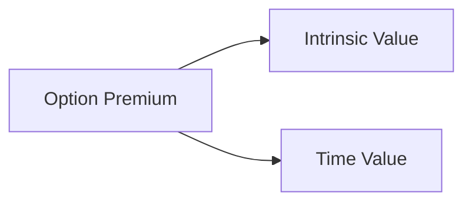
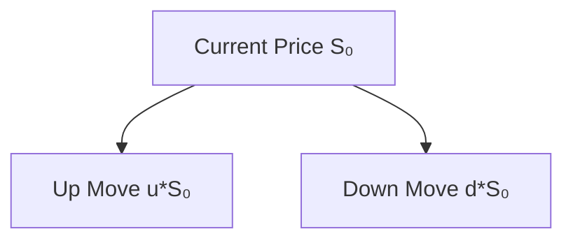

## 7.1 Pricing of Options

Well, so here we are, diving deep into the fascinating (and sometimes intimidating) world of option pricing. You know, the very first time I tried to price an option, I seriously wondered if I needed to be a rocket scientist—or at least a math prodigy. But as it turns out, with a little practice, a few good formulas, and a grasp of key concepts, pricing options is much more approachable than you might think. In this section, we’ll explore the core building blocks of option pricing, talk about the major models like Black–Scholes–Merton (BSM) and Binomial, and show how these concepts are applied in real-world scenarios. That way, you can feel more confident whenever you’re staring at an option quote on your screen—hopefully with fewer sweaty palms.

---

### Why Option Pricing Matters

Option pricing forms the bedrock of many trading and hedging decisions in the derivatives market. If you don’t have at least a rough idea of what an option is worth, it’s kind of like stumbling around in the dark with no flashlight (not fun!). Pricing helps you figure out how much you should pay (or receive) for the right to buy or sell an underlying asset. It also plays a massive role in risk management, letting you set up strategies that protect portfolios from adverse price movements.

• You might be a nervous investor wanting to hedge your portfolio.  
• Perhaps you’re a speculator seeking to profit from short-term price swings.  
• Or maybe you’re just curious about how the math behind these instruments actually works.

No matter who you are, the ability to interpret or calculate fair value for an option will serve you well in the markets.

---

### Key Terms and Concepts

Before we get into the nitty-gritty, let’s define some fundamental terms. You’ll see these words all over the place in option pricing discussions.

**Option Premium**  
This is the price you pay (if you’re a buyer) or receive (if you’re a seller) for an option. Sometimes we just say “option price” or “option cost,” but “premium” is the fancy official term. Premiums have two main parts: intrinsic value and time value.

**Intrinsic Value**  
Think of intrinsic value as the immediate, built-in worth of an option if it were exercised right now. For a call option, it’s how far the spot price of the underlying is above the strike price (if at all). For a put option, it’s how far the spot price is below the strike price (if at all). If exercising now would give no benefit, the intrinsic value is zero.

**Time Value**  
This is the bit of the option’s cost that accounts for all the “what could happen?” possibilities up to expiration. The more time until expiration, the more time value typically remains, since anything can happen in markets (and occasionally does).

**Fair Value**  
This is the theoretical or model-derived calculation of what an option *should* be worth under certain assumptions about volatility, interest rates, time, and other variables.

**Market Price**  
While fair value is a theoretical concept, the market price is what participants are actually willing to pay or receive in real-time. Market supply and demand can drive the option’s trading price away from fair value—sometimes by quite a bit.

**Spot Price**  
A fancy term for “current price” of the underlying asset.

**Volatility**  
A measure of how much the underlying asset’s price changes over time. Higher volatility often means more expensive options, because there’s a greater chance the option might end up in-the-money before expiration.

**Theoretical Model**  
Mathematical frameworks that help you calculate the fair value of the option. Black–Scholes–Merton (BSM) and Binomial models are two well-known examples.

**Liquidity**  
A measure of how quickly and easily you can buy or sell an option without drastically affecting its price. Highly liquid options are easier to enter or exit.

**Price Discovery**  
The ongoing process through which buyers and sellers in the marketplace collectively arrive at a traded option price.

---

### Components of an Option’s Price

Let’s visualize the two big components—intrinsic value and time value—and how they come together to form the total premium. A simple flow diagram can help:

- **Intrinsic Value** relates to the option’s immediate exercise value.  
- **Time Value** takes into account volatility, time until expiration, and interest rates.

These two components fluctuate throughout an option’s life. As expiration approaches, the time value evaporates (like an ice cube on a hot day), leaving only intrinsic value if the option is in-the-money. Out-of-the-money options may expire worthless altogether.

---

### Major Factors Influencing Option Pricing

There are several levers that can change an option’s price—sometimes subtly, sometimes dramatically.

• **Spot Price of Underlying**: The higher the spot price (for a call), the greater the potential intrinsic value, which typically raises the option’s premium. For puts, as the spot price goes down, that can increase put value.

• **Strike Price**: The difference between the spot price and the strike price influences the intrinsic value. The further in-the-money the option, the higher the intrinsic portion of its premium.

• **Time to Expiration**: More time equals more opportunities for the underlying to move favorably. Hence, longer-dated options usually have higher premiums.

• **Volatility**: Higher implied volatility often leads to higher option premiums, all else being equal. This is because bigger swings in the underlying mean a greater likelihood of ending up in-the-money.

• **Interest Rates**: If interest rates are high, call options can become slightly more expensive (and puts cheaper), as the cost of carrying the underlying changes. In Canada, these effects might be tied to the Bank of Canada policy rate and broader macro conditions.

• **Dividends (for Equity Options)**: If an underlying pays a dividend, it often influences call and put prices differently. The reason? Buyers of the call don’t receive dividends, but stockholders do, so that must be factored into the model.

---

### Theoretical Pricing Models

Two main theoretical models come up frequently in the realm of option pricing:

- **Black–Scholes–Merton (BSM) Model**  
- **Binomial Model (One-Period, Two-Period, or Longer Trees)**

Neither model is a perfect reflection of real life, but both provide extremely helpful frameworks.

#### The Black–Scholes–Merton Model

The Black–Scholes–Merton model is probably the most famous tool in finance for calculating the fair value of European-style options on non-dividend-paying stocks. It’s so important that Fischer Black, Myron Scholes, and Robert Merton were awarded (in some combination) the Nobel Prize in Economics for their work.

If you like formulas, here’s the BSM equation for a European call option:


c = S_0 \Phi(d_1) - K e^{-rT} \Phi(d_2),


where:  
• \\( S_0 \\) is the spot price of the underlying.  
• \\( K \\) is the strike price.  
• \\( T \\) is time to expiration (in years).  
• \\( r \\) is the risk-free interest rate.  
• \\( \Phi \\) is the cumulative distribution function for a standard normal distribution.  
• \\( d_1 \\) and \\( d_2 \\) are specific expressions involving \\(\sigma\\) (volatility) and the variables above.

It might look intimidating, but the main idea is that it weighs the probability of the option finishing in-the-money under certain assumptions (lognormal price distributions, no arbitrage, continuous trading, etc.). The BSM model remains foundational in finance, yet it’s important to remember it applies best to European options (exercisable only at expiration) and must be adjusted or combined with other techniques for American-style options.

#### The Binomial Model

The binomial model is conceptually simpler to understand for some people, as it walks you through discrete up and down price movements of the underlying over a set of periods. You can build a tree: at each node, the price can move up or down by certain factors. Then, you calculate the option’s value backward from expiration, considering possible outcomes along the way.

Here’s a tiny snippet of how a one-period binomial tree might look, with an “up” move (u) and a “down” move (d):

Each endpoint (at the next period) would have a potential option payoff. You’d discount those payoffs back to the present using the risk-free rate and the calculated “risk-neutral probabilities.” This approach easily extends to multiple time periods, which is handy for American-style options, since they can be exercised at any point before expiration.

---

### Market Supply and Demand vs. Theoretical Fair Value

In practice, the price you see quoted in the market may not match your model’s exact fair value. Supply and demand pressures can push actual prices above or below theoretical levels. For instance:

- If everyone is buying calls on a hot stock, its call options might become more expensive than the models indicate.  
- If the market believes the stock’s volatility is poised to spike, implied volatility might shoot up, inflating premiums.  

As a result, traders often check the “implied volatility” embedded in option prices to sense the market’s expectations of future price swings. The more uncertain or potentially turbulent the market environment, the higher the implied volatility—and the higher the options’ prices.

---

### Practical Use of Option Pricing

So, how is all this math used in real life? Let’s look at a couple of scenarios:

1. **Risk Management (Hedging)**  
   Suppose you hold shares of a Canadian mining company and you worry about a drop in commodity prices. You might buy put options on that stock. You’ll use an option pricing model (or at least an intuitive sense of fair value) to decide how many puts to buy and at what strike. The cost you pay for those puts is essentially your insurance premium.

2. **Speculation**  
   Let’s say you have a strong conviction that the Canadian dollar (CAD) will appreciate against the U.S. dollar (USD) in the next three months. You might buy a call option on the Canadian dollar. You’d check a pricing model (or an online broker’s quote) for the current market premium and weigh whether the upside potential justifies the premium outlay.

3. **Arbitrage and Market Efficiency**  
   Professional traders often have sophisticated systems that compare theoretical fair values to actual market prices. If an option is mispriced, they can buy undervalued options and sell overvalued options in hopes of locking in a relatively riskless profit. This arbitrage activity tends to push option prices closer to their fair values over time.

---

### Relationships Between Intrinsic Value and Spot Price

Remember, an option’s intrinsic value depends on where the underlying asset’s spot price stands relative to the strike price. Here’s a quick summary:

- **Call Option:** Intrinsic value = max(Spot – Strike, 0).  
- **Put Option:** Intrinsic value = max(Strike – Spot, 0).

For example, if the underlying is priced at CAD 105, and your call option’s strike price is CAD 100, then the intrinsic value is CAD 5. Everything else (the difference between the premium and CAD 5) is time value.

---

### Common Pitfalls to Avoid

• **Ignoring Volatility**: You can’t just assume the underlying asset will stay the same; markets are dynamic, and volatility is crucial for option pricing.  
• **Misjudging Time Decay**: Options lose time value every day you hold them. It’s easy to forget how quickly an option’s price can erode with only a week or a couple of days left.  
• **Overpaying for OTM Options**: Far out-of-the-money options can be cheap, but the odds they’ll expire in-the-money might also be quite low. Don’t get caught in a cheap-lottery mindset without fully understanding probabilities.  
• **Forgetting About Dividends**: For equity options, especially in Canada, dividends matter. If you hold a call on a dividend-paying stock, the ex-dividend date can reduce the stock price, affecting the option’s premium.  
• **Relying on One Model Alone**: The BSM and Binomial models are guides, not crystal balls. Real markets can deviate due to liquidity concerns, supply-and-demand imbalances, or unexpected events.

---

### Regulatory Context in Canada

If you’re trading options under the Canadian regulatory umbrella, you’ll want to be aware of the following:

• **CIRO Oversight**: The Canadian Investment Regulatory Organization (CIRO) sets guidelines for investment dealers, margin requirements, and best practices (replacing IIROC and the MFDA, which are now defunct). You’ll find official margin tables, position limit guidelines, and more at [https://www.ciro.ca](https://www.ciro.ca).  

• **Canadian Securities Administrators (CSA)**: The CSA coordinates regulation across the provinces. Their website ([https://www.securities-administrators.ca](https://www.securities-administrators.ca)) has info on derivatives regulation, rules for market participants, and how they handle new products like crypto options.  

• **Bourse de Montréal**: For listed options in Canada, the Bourse de Montréal ([https://m-x.ca](https://m-x.ca)) is the primary exchange. They have up-to-date rulebooks and educational content.  

• **Clearing and Settlement**: Contracts typically clear through the Canadian Derivatives Clearing Corporation (CDCC), which ensures the financial integrity of option transactions.

---

### Exploring Modeling Tools

Maybe you’re excited to do some coding and run your own simulations. If so, you’ll be glad to know there are open-source tools like [QuantLib](https://www.quantlib.org/) that let you model option prices, greeks, sensitivities, and more. It’s a fantastic way to fiddle with parameters and see how theoretical results line up with actual market quotes.

On a simpler level, many online broker platforms provide built-in option pricers or at least easy-to-use calculators. This can jumpstart your learning without requiring a math background or advanced programming knowledge.

---

### Real-World Case Study: Pricing a Short-Term Call on a Canadian Bank Stock

Let’s do a small illustrative example. Imagine you want to buy a short-term call option on a hypothetical Canadian bank stock—Bank of Maple—and:

• Spot Price (\\( S_0 \\)) = CAD 120  
• Strike Price (\\( K \\)) = CAD 120  
• Time to Expiration (\\( T \\)) = 1 month (about 0.0833 years)  
• Risk-Free Rate (\\( r \\)) = 4% annualized  
• Implied Volatility (\\(\sigma\\)) = 20%

Using the Black–Scholes–Merton model (with an online calculator or your own spreadsheet), you plug in those numbers. Let’s say the result shows the fair value for the call is around CAD 2.10. But you check the Bourse de Montréal quotes and see the market ask price is CAD 2.25. That’s a bit higher than your model’s fair value. Do you still buy it?

• Maybe yes, if you think the implied volatility is actually going to rise because of an upcoming earnings announcement or increased uncertainty in the Canadian financial sector.  
• Maybe no, if your fair-value analysis suggests there’s no reason the option should be priced above CAD 2.10.

In practice, you might look at the implied volatility on competing bank options or check a historical volatility chart for Bank of Maple’s stock. You’d probably also weigh the macro environment—like if there’s an important central bank decision coming soon.

---

### Strategies for Success

• **Stay Informed**: Monitor key parameters (spot price, volatility, interest rates). Option prices can change rapidly even if the spot price is stable, because implied volatility can spike or drop.  
• **Practice with Small Positions**: If you’re new to option pricing, start small. Get comfortable reading an option chain, plugging in a model, comparing to real premiums, and seeing how they converge or diverge.  
• **Use Multiple Models**: Compare results from BSM and a Binomial approach. If they differ significantly, investigate why (could be dividends, liquidity, or early exercise features for American options).  
• **Pay Attention to Risk Management**: Understand the “Greeks” (Delta, Gamma, Theta, Vega, and Rho) that measure how an option’s price changes when input variables shift. Although you’ll see more on Greeks in later sections (7.2 onward), they’re extremely relevant to pricing.  
• **Look Out for Key Dates**: Earnings announcements, economic reports, or ex-dividend dates can all cause sudden changes to implied volatility—and your option’s premium.  

---

### Additional Resources

- **John C. Hull’s “Options, Futures, and Other Derivatives”**: A classic academic text that covers all the major option pricing theories in great depth.  
- **CSA**: [https://www.securities-administrators.ca](https://www.securities-administrators.ca) for overarching guidance on derivatives regulation in Canada.  
- **CIRO**: [https://www.ciro.ca](https://www.ciro.ca) for up-to-date rules on margin requirements, best practices, and oversight.  
- **Bourse de Montréal**: [https://m-x.ca](https://m-x.ca) to find official rulebooks, product listings, and real-time quotes for Canadian options.  
- **QuantLib**: [https://www.quantlib.org/](https://www.quantlib.org/) for open-source financial modeling in C++, Python, and other languages.  

---

### Conclusion

Ah, we’ve journeyed through the swirling world of option pricing, from the concept of intrinsic and time value all the way to the complexities of Black–Scholes–Merton and Binomial models. The main takeaway is that an option’s theoretical value is shaped by a web of factors (time, volatility, interest rates, underlying price, et cetera), and the *actual* market price can deviate thanks to supply-demand dynamics, liquidity constraints, and sudden bursts of market sentiment. Whether you’re hedging a stock position or speculating on a currency swing, knowing how pricing models work—and how they differ from real-world quotes—can help sharpen your decisions.

Also, I’d encourage you not to rely solely on any one approach. Sometimes, intangible factors (like a company’s brand reputation or timely news that the models don’t capture) come into play and can shift prices in unexpected ways. Over time, with practice and careful study, you’ll get a solid intuition for when an option price is “fair” and when it seems off. That sense can give you a little edge or, at the very least, some peace of mind in your trades and hedges.

Now that we’ve tackled the fundamentals of pricing, you’re better equipped to dive into the more advanced Greeks (Delta, Gamma, Theta, Vega, Rho) that define how option prices change in response to market variables. But that’s a story for another section. For now, pat yourself on the back—understanding option pricing is a huge step toward mastering the derivatives market (or at least feeling less lost along the way)!

---

## Sample Exam Questions: Pricing of Options



### Which component of an option’s premium represents the immediate, built-in worth if exercised right now?

- [ ] Time Value
- [ ] Market Price
- [ ] Volatility Value
- [x] Intrinsic Value

> **Explanation:** Intrinsic value is the immediate value if you were to exercise the option at the current underlying price (for calls, Spot – Strike if that’s positive, otherwise zero).

---

### Which of the following statements best describes the effect of increasing implied volatility on call option prices?

- [x] It generally increases the premium of the call.
- [ ] It generally decreases the premium of the call.
- [ ] It has no effect on the premium of the call.
- [ ] It only affects in-the-money call options.

> **Explanation:** Higher implied volatility means a larger potential range for future asset prices. That increased uncertainty typically raises the value of both calls and puts.

---

### Which mathematical model is most commonly used for pricing European-style options on non-dividend-paying stocks?

- [ ] The Binomial Model
- [x] The Black–Scholes–Merton Model
- [ ] The Monte Carlo Simulation Model
- [ ] The CAPM Model

> **Explanation:** The Black–Scholes–Merton model is the classic go-to for valuing European-style options without dividends.

---

### In a one-period binomial model, how is the option’s current fair value generally computed?

- [ ] By multiplying the up-state payoff by the down-state payoff.
- [x] By discounting the expected payoffs (using risk-neutral probabilities) back to today.
- [ ] By applying the continuous compounding formula to the strike price.
- [ ] By using the sum of realized historical data on the underlying asset.

> **Explanation:** The binomial approach calculates the option payoff under “up” and “down” scenarios and then discounts that expected payoff back to the present using appropriate risk-neutral probabilities.

---

### If an option pays no dividends, and the spot price is CAD 100, the strike is CAD 95, and the option is a call, what is the intrinsic value?

- [ ] CAD 0
- [ ] CAD 5 of time value and 0 intrinsic value
- [x] CAD 5
- [ ] CAD 100

> **Explanation:** A call’s intrinsic value = max(Spot – Strike, 0) = max(100 – 95, 0) = CAD 5.

---

### What is the main reason that American-style options can sometimes have a higher premium than European-style options?

- [ ] American-style options never expire.
- [ ] American-style options are more heavily regulated by CIRO.
- [ ] European options are always overpriced.
- [x] American-style options can be exercised at any time before expiration.

> **Explanation:** The flexibility to exercise early can give American options extra value in certain scenarios (e.g., when dividends are coming).

---

### Which parameter is typically NOT part of the standard Black–Scholes–Merton formula?

- [ ] Time to expiration
- [ ] Risk-free interest rate
- [ ] Strike price
- [x] Dividend yield (for a non-dividend-paying stock)

> **Explanation:** The basic BSM model for non-dividend-paying stocks doesn’t incorporate a dividend yield. If dividends exist, one must adjust the model or use additional techniques.

---

### How might supply and demand cause an option’s market price to deviate from its theoretical fair value?

- [ ] There’s no deviation possible since fair value is strictly enforced.
- [x] Enthusiastic buying or selling can push market prices above or below theoretical values.
- [ ] It only deviate if regulators suspend trading.
- [ ] Supply and demand have no impact on the option price.

> **Explanation:** Real-world markets are influenced by order flow, sentiment, and liquidity. These factors can drive the market price away from the pure theoretical price.

---

### Which entity typically clears exchange-traded options in Canada?

- [ ] IIROC
- [ ] CIRO
- [x] Canadian Derivatives Clearing Corporation (CDCC)
- [ ] Market Maker Consortia

> **Explanation:** The CDCC is responsible for clearing and settling most exchange-traded derivatives in Canada, including listed options on the Bourse de Montréal.

---

### True or False: Implied volatility is derived from actual option prices in the market rather than being an input you provide to the model.

- [x] True
- [ ] False

> **Explanation:** Implied volatility is “backed out” of the option’s actual market price. It’s the volatility value that, when plugged into the BSM or Binomial formula, equals the current market premium.


