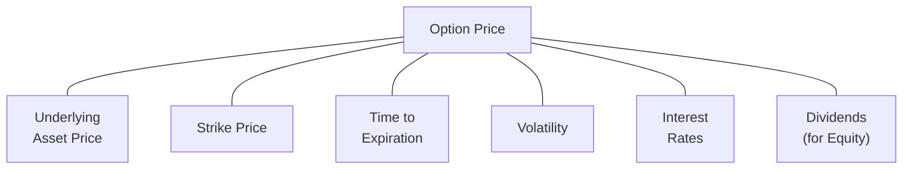

## 7.2 Major Factors that Affect the Price of an Option

Options can sometimes seem mysterious. I remember the first time I tried to buy a simple call option on a Canadian mining stock. I was super excited, yet also a bit nervous. How did the market decide this particular call option was worth, say, $1.45 per contract? Was it merely guesswork, or was there some magical formula behind it? Well, it isn’t magic—there are specific factors that drive an option’s price. This section focuses on six major ones: the underlying asset price, strike price, time to expiration, volatility, interest rates, and dividends. Let’s explore how each of these factors plays its part, and how changes in any one of them can nudge (or sometimes yank) an option’s price in one direction or another.

Before diving in, remember that we’re not just looking at theoretical models—although we will mention a few, like Black–Scholes–Merton. Instead, we’ll also talk about real-world dynamics that cause actual option market prices to deviate from perfect models, including things like liquidity constraints, transaction costs, and even plain old investor psychology.

So, if you’ve been scratching your head about why that call or put option didn’t move exactly as you expected, this is for you.

  
**A Quick Visual Overview**

The diagram above gives a quick snapshot: the option’s price (in the center) is affected by these key factors. Let’s look at each of them in detail.

---

## What Determines an Option's Price?

An option gives you the right (but not the obligation) to buy or sell an underlying asset at a specified strike price by the option’s expiration date. The standard convention for call options is to buy the underlying at the strike price, while for puts, you sell the underlying at the strike price. Each factor usually affects the call and put in slightly different ways, though some factors push both in the same direction. 

Mathematically, many people reference the Black–Scholes–Merton model for a single underlying asset without dividends. For a call option, that formula (in simplified terms) is shown below:

$$
C = S_0 \Phi(d_1) - K e^{-rT} \Phi(d_2),
$$

where:

• \\( C \\) is the call premium.  
• \\( S_0 \\) is the current underlying asset price.  
• \\( K \\) is the strike price.  
• \\( r \\) is the risk-free interest rate.  
• \\( T \\) is the time to expiration (in years).  
• \\( d_1 \\) and \\( d_2 \\) are specific terms that incorporate volatility (\\(\sigma\\)), \\(S_0\\), \\(K\\), \\(r\\), and \\(T\\).  
• \\(\Phi(\cdot)\\) is the cumulative distribution function for a standard normal distribution.

While we’re not going to do a deep dive into deriving this model, you can see the main stars in the formula: the underlying price (\\(S_0\\)), the strike (\\(K\\)), time (\\(T\\)), interest rates (\\(r\\)), and volatility (\\(\sigma\\), which is embedded in \\(d_1\\) and \\(d_2\\)). If the underlying asset pays dividends, that modifies the formula. So let’s unpack these main inputs one by one.

---

## The Role of Underlying Asset Price

The underlying asset price is the starting point. If there’s one thing to watch like a hawk, it’s the price of the underlying. For calls, if the underlying price goes up, the call option typically becomes more valuable. Why? Because you can buy the underlying at the lower strike price (when you exercise), and that’s more attractive if the market value of the asset is rising. On the flip side, if the underlying falls, the call option’s value often decreases.

For puts, the opposite is generally true. A drop in the underlying price usually increases the put’s value (you can sell the underlying at the higher strike, which is good if the market is falling). A rise in the underlying price will typically drag the put price down.

This relationship can be intuitive if you think about the “intrinsic value” of an option. A call has intrinsic value if the underlying price is higher than the strike price. A put has intrinsic value if the underlying price is lower than the strike.

### A Practical Example  
Let’s say you have a call option on shares of a hypothetical Canadian gold producer currently trading at CA$50 per share, with a strike of CA$48. If the shares jump to CA$54, your call instantly looks more attractive. It has a higher chance of expiring in-the-money and its intrinsic value is at least CA$6. So your call option’s premium likely increases. If, however, the shares plummet to CA$45, your call loses that immediate attractiveness, and the premium goes down—unless volatility picks up, but that’s another story we’ll get to later.

---

## How the Strike Price Influences Option Premium

Next up is the strike price. Remember, the strike is the agreed-upon price at which you can exercise your option.

• For **call options**, a lower strike price generally increases the option’s value (because you’ll get to buy shares at that lower price if you exercise).  
• For **put options**, a higher strike price often costs more (because you can sell shares at a higher price).

That said, options come in many types of “moneyness”: at-the-money (ATM), in-the-money (ITM), or out-of-the-money (OTM). Think of the strike price in relation to the underlying asset’s price. If a bond is trading at par (let’s say CA$100) and your call option’s strike is CA$95, that call is considered in-the-money. It automatically has intrinsic value because you’re effectively locked in to purchase that bond at a cheaper rate than the market is currently offering. The deeper in-the-money you go, the more the option’s price starts acting like the underlying itself (plus some time and volatility value). The deeper out-of-the-money you go, the cheaper the option tends to be because the chance of it finishing in-the-money is relatively smaller.

---

## Time to Expiration: The Clock Is Ticking

Tell me if this has ever happened to you: You buy a call option on a stock and it stays pretty flat for a while, so the option bleeds away in value because time is running out. This phenomenon is called “time decay” or “theta decay.” The closer we get to expiration, the less time value is left in the premium. With all else being equal, options with longer expiration periods command higher premiums because there’s a greater window for something big to happen. A surprise earnings beat, a monetary policy shift, or wild market volatility could all swing the underlying in your favor.

• **Longer time to expiration** ⇒ **Higher time value**.  
• **Shorter time to expiration** ⇒ **Less time value**.

At the extreme, on the expiration date itself, an option’s value converges to its intrinsic value only. If the option is out-of-the-money at expiration, it’s effectively worthless. Time is a huge factor because it amplifies the effect of volatility. The longer the timeframe, the more likely the underlying might make large moves, which generally increases the option’s potential payoff.

---

## Volatility: The Heartbeat of Option Pricing

Volatility (often symbolized by \\(\sigma\\)) is the engine that drives big or small changes in an underlying’s price. The more an asset’s price bounces around, the higher the potential payoff for both calls and puts. That’s because, statistically, large swings increase the probability that an option might end up in-the-money. Higher volatility typically inflates option premiums, all else being equal.

### Volatility’s Dual Nature  
• **Implied Volatility (IV)**: This is the market’s guess about how much the underlying could fluctuate during the option’s life. Sometimes, when you see an option’s price spike without much movement in the underlying, traders might be upping their estimates for future volatility.  
• **Historical Volatility (HV)**: This looks at how much the underlying price has moved in the past (over some period), providing a reference but not necessarily a forecast.  

Options traders tend to focus on implied volatility since it’s baked right into the option’s current market price. If there’s a big event coming up—an earnings report, an interest rate announcement from the Bank of Canada, or a commodity production update—volatility expectations ramp up beforehand, inflating option premiums. And once the event passes, volatility can drop like a rock, deflating option premiums just as quickly.

---

## Interest Rates: It’s About the Opportunity Cost

At first glance, you might wonder: “Really, do interest rates move the needle that much for an option’s price?” They can, though typically less drastically than volatility or big moves in the underlying. If risk-free rates go higher, the cost of carry for holding an underlying asset increases. In the classic Black–Scholes–Merton framework:

• **Higher interest rates** pump up call option prices slightly (since the holder of a call might postpone paying for the actual underlying, effectively benefiting from investing that money at a higher rate until the exercise date).  
• **Higher interest rates** can nudge put prices lower (since paying the strike price later is less beneficial if you could be investing at a higher rate in the interim—there’s a trade-off).

In Canada, the Bank of Canada’s policy rate is typically used as a reference for the risk-free rate, although short-term Government of Canada Treasury bills can also serve. Through 2025, these interest rate announcements can still cause short-term ripples in option pricing, especially if the rate moves are unexpected. Over a longer horizon, interest rate changes can be overshadowed by bigger swings in the underlying or unexpected volatility events.

---

## Dividends: A Subtle yet Significant Impact

Dividends matter primarily for equity options. If you hold a call option on a stock that pays dividends—especially significant dividends during the option’s life—call prices tend to be slightly lower than they would be if that dividend wasn’t there. Why? Because if you own the option, you don’t collect the dividend (only shareholders do). Meanwhile, put options slightly increase in value if the underlying pays a dividend. This is because after the stock’s ex-dividend date, the stock price often drops by about the dividend amount. That price drop can help push a put option further into-the-money.

### Dividend Example  
Imagine a major Canadian bank that typically pays a quarterly dividend of CA$1.00 per share. If your option is set to expire a few days after the ex-dividend date, the call might be priced a bit lower than a similar option on a non-dividend-paying stock. Conversely, the put might see a bit of a premium bump. This difference grows or shrinks depending on the size of the dividend and the timing of the ex-dividend date relative to the option’s expiration.

---

## Market Liquidity and Real-World Dynamics

While the theoretical models are elegant, real markets can be a bit messy. Liquid options (on large-cap stocks or key indices) tend to trade closer to their “fair value.” But if you move into less liquid corners of the market—some small-cap energy exploration or an out-of-the-money farmland commodity put—the bid-ask spreads might be wide. Transaction costs and market maker risk considerations can cause the option’s trading price to deviate from the theoretical value. 

Additionally, the speed at which you can execute a trade matters. Sudden price moves or “gaps” can cause swift changes in implied volatility and available liquidity. In a fast market, you might see fewer quotes or bigger spreads. If you’re calculating a fair theoretical price, there might be a gap between that theoretical figure and what the market is ready to offer.

**CIRO Considerations**: Although theoretical models like Black–Scholes–Merton give a good foundation, the Canadian Investment Regulatory Organization (CIRO) has margin and capital requirements that can affect how dealers hedge client options and how they price them. Dealers must manage their risk in compliance with CIRO guidelines, and sometimes that risk management cost is passed along in the form of wider spreads or certain option premium adjustments.

If you want to keep track of interest rate announcements that might affect your option valuations, the Bank of Canada (https://www.bankofcanada.ca/) publishes scheduled announcements. For real-time market data and academic studies on liquidity and order flow (which can influence short-term option pricing), you can explore open-source quantitative trading libraries in Python, such as PyQuant or Zipline, or consult academic journals that study “market microstructure.”

---

## Bringing It All Together

Analyzing an option’s price is often a balancing act:

1. **Is the underlying’s price changing?**  
2. **How close is the strike to the underlying’s current price?**  
3. **How much time remains before the option expires?**  
4. **Is volatility rising or falling?**  
5. **Has the Bank of Canada made a rate announcement that shifts the risk-free rate?**  
6. **Are there upcoming dividend payments that might affect the stock price?**

And overshadowing all of these, you have real-world frictions: liquidity constraints, transaction costs, and regulatory guidelines woven into how markets actually operate. For instance, even if you can theoretically compute a “fair value” for your call based on these factors, you might not get a buyer at that price—maybe everyone else is reading the central bank’s signals as a sign to stay out of the market right now.

Yet, understanding these six main factors helps you make more informed decisions. You can examine whether a call or put option is “fairly priced” or if it might be over- or undervalued due to unusual market conditions. It also helps when you’re constructing strategies like spreads, straddles, or even more exotic positions because you know how each factor interacts with your payoff potential.

---

## A Simple Real-World Case

Let’s say we have a company called MapleLeaf Tech Inc., trading at CA$100 this morning. You’re interested in a three-month call option with a strike of CA$100. Right off the bat, you’d check:

1. **Underlying Price:** CA$100.  
2. **Strike Price:** CA$100.  
3. **Time to Expiration:** 3 months.  
4. **Volatility:** Suppose MapleLeaf Tech has been quite volatile, with an implied volatility around 35%.  
5. **Interest Rates:** Let’s assume the risk-free rate is 3%.  
6. **Dividends:** MapleLeaf Tech doesn’t pay a dividend.  

You might run a rough Black–Scholes calculation (using an online tool or your own spreadsheet) to see that the fair theoretical cost might be around CA$5.00 per share (so CA$500 per contract of 100 shares). If MapleLeaf’s implied volatility spikes to 40%, you’d notice that the same option might jump to CA$6.00 per share. If interest rates are suddenly hiked to 3.5%, the call might inch higher again, but usually not by a full dollar—maybe it’ll just go from CA$5.00 to CA$5.10 because interest rate changes rarely overshadow big volatility shifts. 

In the live market, the option might actually trade at CA$6.50 if MapleLeaf Tech’s order flow is heavily biased toward bullish traders or if the average volume is really low and the market maker is charging a higher risk premium for standing ready to fill orders. That’s the difference between theoretical pricing in a spreadsheet versus real-world conditions.

---

## Put–Call Parity Reminder

It’s good to remember put–call parity, a fundamental concept that stitches together the prices of calls, puts, and the underlying (particularly for non-dividend-paying assets). It states, in simplified form:

$$
C - P = S_0 - K e^{-rT},
$$

where \\( C \\) is the call price, \\( P \\) is the put price, \\( S_0 \\) the current underlying price, and \\(K e^{-rT}\\) is the present value of the strike price at expiration, discounted at the risk-free rate \\(r\\). Dividends modify this relationship somewhat, but the gist remains: if this relationship doesn’t hold, arbitrageurs will typically jump in to profit from any mispricing until the relationship gets back in line.

---

## Best Practices

1. **Follow Key Events:** Keep an eye on earnings dates, central bank rate announcements, and ex-dividend dates—these can influence volatility, thereby moving the option price significantly.  
2. **Check Liquidity:** Wider spreads or shallow market depth can mean big price discrepancies.  
3. **Use Tools but Don’t Over-Rely on Them:** Pricing calculators are helpful, but never forget real-world constraints can cause departures from theoretical values.  
4. **Stay Informed on CIRO Requirements:** These can affect how dealers set margin and how they hedge. A well-capitalized market maker might offer tighter spreads compared to a smaller firm.  

---

## Additional Resources

• **CIRO (https://www.ciro.ca):** For updates on Canadian regulatory requirements affecting derivatives.  
• **Bank of Canada (https://www.bankofcanada.ca):** To monitor interest rates and economic indicators that can influence option pricing.  
• **Academic Journals on Market Microstructure:** For deeper dives into liquidity, bid-ask spreads, and real-world deviations from theoretical pricing.  
• **Open-Source Software:** Such as Python’s “QuantLib” or “PyOption” libraries to experiment with option valuation models.  

---

## Sample Exam Questions: Major Factors that Affect the Price of an Option



### Which of the following factors generally increases both call and put option premiums?  
- [ ] Decreasing strike price  
- [x] Increasing volatility  
- [ ] Decreasing time to expiration  
- [ ] Lowering the underlying asset price  

> **Explanation:** Higher volatility raises the possibility of larger price moves in either direction, increasing premiums for both calls and puts.

---

### Why do higher risk-free interest rates often lead to slightly increased call prices?  
- [ ] Because investors need to earn less return on capital  
- [ ] Because it reduces the time value for buyers  
- [x] Because you can delay paying the strike and invest that capital at higher rates  
- [ ] Because interest rates have no effect on option prices whatsoever  

> **Explanation:** Higher rates let call buyers theoretically invest their capital at better returns until they exercise, boosting the call’s theoretical value.

---

### How does an upcoming dividend payment typically affect call option premiums on an equity?  
- [ ] It has no effect on option pricing  
- [x] It tends to decrease call premiums  
- [ ] It will always triple the call premium  
- [ ] It vastly increases implied volatility  

> **Explanation:** If a dividend is paid during the life of a call option, the share price often drops ex-dividend, reducing the call’s value.

---

### What is the term for the gradual loss of an option’s time value as expiration approaches?  
- [x] Theta decay  
- [ ] Vega slippage  
- [ ] Rho meltdown  
- [ ] Gamma squeeze  

> **Explanation:** Theta captures how much an option’s price erodes with each passing day, especially if the underlying remains static.

---

### If an underlying asset’s price moves up, which of the following is most likely to happen to a put’s premium, all else being equal?  
- [ ] No change  
- [x] The put premium decreases  
- [ ] The put premium increases  
- [ ] The put premium doubles automatically  

> **Explanation:** Puts become less valuable when the asset price rises, as the put’s strike becomes less likely to finish in-the-money.

---

### Which of the following best describes the effect of dividends on put-call parity (assuming the underlying pays a dividend during the life of the option)?  
- [ ] Dividends have no effect on put-call parity  
- [x] Dividend expectations decrease the call side of the equation  
- [ ] Dividend expectations decrease both call and put prices  
- [ ] Dividend expectations raise the call price and lower the put price  

> **Explanation:** Anticipated dividends make calls less attractive because you don’t collect the dividend if you hold the call. Hence, it modifies the put-call parity relationship.

---

### In the Black–Scholes–Merton model, which factor primarily captures the potential magnitude of the underlying’s price swings?  
- [x] Volatility (\\(\sigma\\))  
- [ ] Rho (\\(r\\))  
- [ ] Delta (\\(\Delta\\))  
- [ ] Theta (\\(\Theta\\))  

> **Explanation:** The model’s “sigma” (volatility) input describes how the underlying’s price can fluctuate, affecting option prices.

---

### Which statement accurately explains how interest rate changes affect put prices?  
- [x] Rising interest rates tend to reduce put prices  
- [ ] Rising interest rates have zero effect on put prices  
- [ ] Rising interest rates always double put prices  
- [ ] Rising interest rates are only relevant for futures pricing, not options  

> **Explanation:** Higher risk-free rates can make certain put strategies less attractive because you effectively lose the benefit of investing capital elsewhere.

---

### When the time to expiration increases, how is an option’s premium generally affected, assuming all other factors remain the same?  
- [x] The option premium increases  
- [ ] The option premium decreases  
- [ ] The option premium is unaffected by time  
- [ ] Time to expiration only affects futures, not options  

> **Explanation:** More time until expiration gives the underlying additional room to move in favor of the option, thus increasing time value.

---

### True or False: Liquidity constraints or wide bid-ask spreads can cause the actual market price of an option to differ notably from its theoretical fair value.  
- [x] True  
- [ ] False  

> **Explanation:** In real markets, illiquidity, wider spreads, and market maker risk considerations often create gaps between theoretical and actual trading prices.




