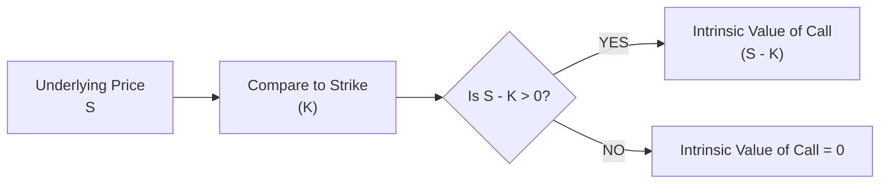
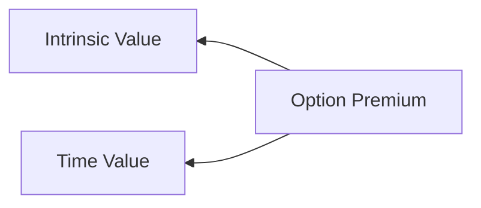

## 7.3 Intrinsic Value

Have you ever wondered why some options feel like they’re ‘worth’ something right now—even before their expiration date? Maybe you’ve heard someone say, “Wow, look at that call option; it’s so in-the-money, it’s practically printing money.” Okay, that might be a bit of an exaggeration, but it points to something real: intrinsic value. Intrinsic value is that built-in worth of an option if it were exercised immediately. This concept is central to understanding options pricing—particularly how much an option should never logically drop below, and how in-the-money (ITM) versus out-of-the-money (OTM) options differ. 

In this section, we’ll walk through the nitty-gritty of intrinsic value, discuss some practical scenarios, show a few visuals, and connect you to key references in Canada’s financial markets (remember, as of 2025, our main SRO is CIRO). Let’s explore how intrinsic value works, how it relates to time value, and how it helps keep prices logical and consistent in the market.  

Before diving in, just a reminder that the Bourse de Montréal offers some awesome educational guides that show real-world examples of computing intrinsic values (https://m-x.ca/education_en.php). You could also check out free online tools—like an option calculator on many broker sites—to see how exercising an option right now compares to waiting for potential time value gains. Let’s jump in.

---

### What Is Intrinsic Value?

Whenever you hear the term “intrinsic value,” think of it as the immediate exercise value. It practically answers this question: if I yank my option out of my portfolio right now and exercise it instantly, how much would I gain, net of the strike price? The math is refreshingly straightforward:

• Call Option Intrinsic Value = max(0, Current Asset Price − Strike Price)  
• Put Option Intrinsic Value = max(0, Strike Price − Current Asset Price)  

If the result of the difference inside the parentheses is negative, the intrinsic value is zero because you wouldn’t exercise it for a loss. Since it’s the immediate, built-in worth, the option’s overall market price can never logically be less than that number—if it were, savvy traders could buy the option, exercise it, and lock in an instant profit (that’s an arbitrage, which we’ll discuss shortly).

#### Key Definitions 
• **Intrinsic Value:** The immediate exercise value.  
• **In-the-Money (ITM):** A call is ITM when the asset price is above the strike (S > K). A put is ITM when the asset price is below the strike (S < K).  
• **Arbitrage Opportunity:** A chance to profit with basically no risk, often exploiting mispriced assets.  
• **Option Premium:** The entire cost of the option in the market, which includes both intrinsic value and time value.  

Think of it this way: if you’re holding a call option that has a strike of $50, and the stock is trading at $60, your intrinsic value is $10, right? That’s almost like cash on the table—assuming perfect markets—because you could turn around, exercise, buy the stock at $50, and then theoretically sell it right away at $60. Similarly, a put with a strike of $60 on that same $50 stock has an intrinsic value of $10 (because you could immediately buy at $50 from the open market and “put” it to whomever granted the option at $60).  

In simpler terms, intrinsic value is the difference between “what you have to do” and “what you can do right now in the market,” ignoring the time factor or the leftover life of the option.  

---

### Intrinsic Value and Premiums

Let’s pause for a moment and reflect on how an option’s total premium is composed. We typically say:

Option Premium = Intrinsic Value + Time Value

An option’s premium can never be lower than its intrinsic value. If the market price for an option ever dipped below that number, an attentive trader would have an immediate, no-brainer profit (arbitrage) by buying the option at a discount, exercising it, and pocketing the difference in the underlying asset’s price. Realistically, that can’t persist for more than a blink because professional traders—and their algorithmic bots—would absolutely pounce on it.

Here’s a quick numerical illustration:

Let’s say a call option on Imaginary Inc. stock with a strike price of $100 trades at a premium of $12. Suppose the market price of Imaginary Inc. is $110. The **intrinsic value** of that call is:

max(0, 110 − 100) = 10.

Now, if the time value portion is the difference between the premium and the intrinsic value, that’s:

$12 − $10 = $2 of time value.

Even if that time value eventually decays to zero by expiration, the option premium now acknowledges that there’s at least $10 of built-in worth. If for some strange reason the premium falls below $10, say to $9, you could buy the call at $9, exercise the call to buy shares at $100, and sell them in the market for $110, netting yourself $1 per contract minus any transaction costs. That is the essence of arbitrage.

---

### A Quick Visual: Intrinsic Value vs. Underlying Price

Sometimes, seeing a simple flow diagram can help you grasp how intrinsic value ties to the stock or the underlying instrument.

In this basic chart, we check if the underlying price minus the strike price is positive for a call. If it is, there is that positive difference we call intrinsic value. For a put option, just invert the comparison (K − S).

---

### Deep In-the-Money vs. Out-of-the-Money 

Now, let’s explore how calls and puts behave in different moneyness categories:

• **Deep In-the-Money (ITM):** The underlying asset price is significantly above the strike for a call, or well below for a put. That usually means a substantial portion (or nearly all) of the option’s premium is intrinsic, with little additional time value. Traders who hold deep ITM options sometimes do so for specific reasons like controlling the underlying with limited capital, or to reduce the exposure to time decay.  

• **At-the-Money (ATM):** The underlying price is more or less equal to the strike, so the call or put’s intrinsic value equals 0. That means the entire premium is time value (and implied volatility, etc.).  

• **Out-of-the-Money (OTM):** The call strike is above the underlying price, or the put strike is below it. Intrinsic value is 0. The premium is purely driven by time value and the hope (or fear) that the underlying moves in favor of the buyer before expiration.

Think about those future possibilities: if you buy an OTM call because you’re bullish, you could lock in big gains if the underlying soars. However, at the moment you open that trade, your intrinsic value is $0; you’ve essentially paid a “time value” bet that the market moves your way.

---

### Intrinsic Value Over Time

An important aspect to remember is that **intrinsic value doesn’t stagnate**; it’s just the immediate reflection of how much the option is in-the-money. If the underlying’s price changes, so does the intrinsic value. Let’s call that “dynamic potential.” For a call:

• If the stock price goes up, the call’s intrinsic value generally goes up.  
• If the stock price goes down and dips below your strike, the call’s intrinsic value might vanish (go to zero).  

For a put, it’s the reverse:

• If the stock price goes down (beneath the strike), the put’s intrinsic value lights up.  
• If the stock price rallies above your strike, intrinsic value plummets to zero.

These fluctuations can lead to interesting scenarios for traders who watch the market minute by minute.

---

### Arbitrage Opportunities

Arbitrage is that mythical beast in finance land, right? Everyone’s always saying markets are efficient, so there’s (practically) no free lunch. But if an option’s price did slip below its intrinsic value, that’d be a glitch in the matrix. You could snap it up, exercise, and earn immediate risk-free profit. Algorithmic traders continuously watch for these inefficiencies, so they rarely last long.

Because the possibility of arbitrage is a big deal, it helps unify the logic behind the statement “an option’s premium can never be less than its intrinsic value.” Any fundamental mispricing, no matter how small, tends to get hammered out by the crowd of professional market participants.

---

### Practical Example: A Canadian Market Scenario

Let’s do something more Canadian-flavored. Suppose you have a call option on a well-known Canadian energy stock, with a strike of $20, and the current market price of that stock is $26. Let's keep it fictional, but we’ll call the company Maple Energy.

• Intrinsic value = max(0, $26 – $20) = $6.  
• Let’s say you see the call quoted at $5.50.  
• If that quote is for a standard contract (covering 100 shares), the total cost is $5.50 × 100 = $550. Meanwhile, the built-in “exercise now” value is $6 × 100 = $600.  

Right there, you’ve got a $50 discrepancy, ignoring transaction fees. If you snapped that option up for $550, exercised it to buy Maple Energy shares at $20, and sold those shares immediately at $26, you’d earn an instant $50—minus commissions. Since that’s a direct, no-risk payoff, it shouldn’t exist for more than a few fleeting seconds. In real markets, someone (or more likely a sophisticated trading bot) will notice that mismatch right away and bid the option up to something at least $6.

This example also underscores the importance of transaction costs—especially for small retail traders. In many real scenarios, you might find that commissions or slippage can eat up that profit advantage. Big institutional traders, or those with direct market access, can move fast and at lower cost, collecting these small inefficiencies. 

---

### Relationship to Time Value

Time value is the additional cost that the market is willing to pay for the possibility that the underlying price could keep moving in your favor. When an option is deeply in-the-money, that potential might be smaller relative to the huge chunk of intrinsic value because, well, you’re already collecting a significant gain by being so far in the money. On the other hand, at- or out-of-the-money options are mostly time value. 

It’s often helpful to see a diagram that maps out how total premium can be sliced into “intrinsic slice” and “time slice”:

As the underlying moves in your favor (for a call, that would be upwards), the “Intrinsic Value” wedge generally grows, which leaves less of the premium to be purely time value—assuming no large changes in implied volatility.

---

### References to Canadian Regulations & Practices

• **CIRO Oversight (Current SRO in 2025):** The Canadian Investment Regulatory Organization (CIRO) sets forth guidelines for fair dealing, best execution, and transparency. These guidelines indirectly ensure the market remains efficient, so glaring arbitrage mispricings (like an option trading below its intrinsic value) are quickly corrected.  
• **Bourse de Montréal (Bourse) Education Center:** Check out the Bourse’s resources at https://m-x.ca/education_en.php for real-life illustrations of computing intrinsic value, time value, and total premium.  
• **CSA Notices:** The Canadian Securities Administrators (CSA) release multiple notices clarifying the importance of fair execution and advising how to handle the intersection of options markets with equity trading. These shape how brokers and dealers handle orders to minimize distortions and deliver best execution—preventing systematic mispricing that could lead to persistent arbitrage openings.  
• **Option Calculators:** A variety of brokerage houses and financial websites provide free calculators. If you want to see how immediate intrinsic value compares to an option’s market premium, try plugging in your stock price, strike, days to expiration, and implied volatility. The tool often breaks down premium into intrinsic and time value.

---

### When Intrinsic Value Might Not Grow

Folks sometimes assume that if a call is ITM now, it will keep going deeper ITM in the future. Reality check: the market is not that simple. If the underlying reverses course, the call that was ITM can swiftly lose that built-in advantage. That’s why some sophisticated market participants watch the “Delta” measure (covered in Section 7.5) to gauge the probability or sensitivity of that option relative to moves in the underlying. A call with a high delta (close to 1.0) tries to mirror the underlying’s moves, but it can still see its intrinsic value vanish if the underlying dives under the strike.

---

### Considering Canadian Commodities or FX Options 

Intrinsic value also emerges in commodity and currency options. Imagine an energy producer with a call on the price of crude oil. If the futures price jumps well above the call’s strike, they have meaningful intrinsic value. The same concept is at work in currency options (see Chapter 33 for a dedicated look at currency options).  

The principle is consistent: an option’s minimum fair price includes at least the difference between the underlying’s current level and the strike, whenever that difference is in your favor.

---

### A Short Personal Anecdote

I remember a conversation with a friend who first dipped their toes into Canadian equity options. They bought an in-the-money call, fully expecting it to follow the underlying stock tick by tick. One day, they called me in a bit of a panic, saying, “Um, my call option’s price didn’t budge. The stock went up, but my option barely moved.” They were forgetting that part of the cost is already baked in as intrinsic value, and sometimes time value can shrink if the underlying’s move is smaller than expected or if implied volatility changes. That “aha” moment got them digging deeper into the concept of intrinsic vs. time value, and it changed how they set up their trades.

---

### Best Practices 

1. **Always Compare Premium to Intrinsic Value**: Before you purchase an in-the-money option, ensure that the premium is at least the intrinsic value. If you notice a mismatch, confirm it’s not a data delay or wide bid-ask spread.  
2. **Watch Out for Wide Bid-Ask Spreads**: Sometimes, the real cost for you to buy an option is well above the last-traded price. An illiquid market can create illusions of bargains.  
3. **Factor in Transaction Fees**: If you suspect an option is underpriced relative to its intrinsic value, consider whether commissions and potential slippage might eat up the advantage.  
4. **Remember That Intrinsic Value Is Dynamic**: Just because your call is $5 ITM today doesn’t mean it stays that way tomorrow.  
5. **Stay Informed About Regulatory Updates**: CIRO guidelines and CSA notices shape how derivatives markets operate in Canada. If you’re an active trader, make sure to keep up with any changes or clarifications.

---

### Potential Pitfalls 

• **Ignoring Time Value**: Some new traders see the stock price at $60 versus a $50 strike and think they’re guaranteed a $10 profit. But you have to remember that the total premium might be $13 or $14, implying additional time value or volatility.  
• **Over-Paying for ITM Options**: Most broker platforms show you the total premium. If you don’t separate out how much is intrinsic, you might not realize you’re paying a high time value premium.  
• **Missing Hidden Costs**: If you plan to exercise your option to “realize” intrinsic value, there could be assignment fees, settlement costs, currency conversions, or futures roll costs (for commodity options) that nibble away at your theoretical advantage.  

---

### Connecting to Other Option Pricing Dimensions

If you’re reading this as part of the broader Chapter 7 coverage, you’ll notice how intrinsic value is just one slice of an option’s pricing. Sections 7.1 (Overview of Option Pricing) and 7.2 (Major Factors Affecting the Price of an Option) look at how time, implied volatility, and interest rates layer on top of the building block that is intrinsic value. Meanwhile, in Section 7.5 (Delta) and 7.6 (Advanced Greeks), you’ll see how changes in the underlying asset’s price and volatility can drastically affect not just the time value but the interplay of all the “Greeks.”  

---

### Further Resources & Reading

• **Bourse de Montréal Education**: https://m-x.ca/education_en.php  
• **CIRO**: https://www.ciro.ca (Search for derivatives guidelines, margin requirements, best execution policies)  
• **CSA Notices**: Canadian Securities Administrators (CSA) website for the latest bulletins on derivatives trading.  
• **Online Option Calculators**: Tools like the ones offered by most Canadian brokerage platforms can help you break down premium and see how intrinsic value compares to total price in real time.  
• **Classic Finance Texts**: Any standard derivatives textbook—like John C. Hull’s “Options, Futures, and Other Derivatives”—covers intrinsic value in detail.  

---

## Sample Exam Questions: Mastering Intrinsic Value in Options Trading



### Which statement best defines the intrinsic value of a call option?

- [x] It is the amount by which the underlying’s current market price exceeds the strike price.
- [ ] It is the total cost of the option minus the time value.
- [ ] It is the difference between the premium paid and the margin posted.
- [ ] It is the statutory value mandated by CIRO for best execution.

> **Explanation:** The intrinsic value for a call option is max(0, S − K). It measures how much benefit you’d get if you exercised immediately.

---

### An option’s premium can never be below its intrinsic value. If it is, which of the following concepts is most directly relevant?

- [x] Arbitrage.
- [ ] Margin call.
- [ ] Time breakdown.
- [ ] Gamma scalping.

> **Explanation:** If an option trades below intrinsic value, arbitrageurs can buy and immediately exercise it for a risk-free profit.

---

### A call option on Maple Energy has a strike of $40, and the stock is trading at $50. If the option is priced at $9.50, what portion is intrinsic value?

- [x] $10.00 minus $9.50 is a mismatch, meaning $10.00 in intrinsic, but the price is below that so an arbitrage might exist.
- [ ] $0.00
- [ ] $9.50
- [ ] $40.00

> **Explanation:** The call’s intrinsic value is max(0, S − K) = $10. At a market price of $9.50, it is below intrinsic value. In practice, this should not happen for more than a fleeting moment because of immediate arbitrage.

---

### How does the intrinsic value of a put option change if the underlying price increases?

- [x] It decreases (and can go to zero if the underlying price exceeds the strike price).
- [ ] It increases proportionally.
- [ ] It remains constant.
- [ ] It turns into time value.

> **Explanation:** A put option gains intrinsic value when the underlying’s price falls below the strike. If the underlying’s price rises, the put’s intrinsic value shrinks.

---

### Which scenario describes an in-the-money call?

- [x] Underlying price is above the strike price.
- [ ] Underlying price is below the strike price.
- [x] Option premium is entirely time value.
- [ ] Underlying price equals the strike price.

> **Explanation:** A call is in-the-money when S > K. The second correct statement “Option premium is entirely time value” is actually false for an ITM call, so this is a trick. (Note: If your exam setting allows multiple answers, the second bullet is incorrect. If it’s single answer only, pick the underlying-above-strike condition.)

---

### A put option has a strike of $25, but the stock is currently $28. What is the put’s intrinsic value?

- [x] 0
- [ ] 3
- [ ] 25
- [ ] 28

> **Explanation:** For a put, intrinsic value is max(0, K − S). Since K = 25 and S = 28, the difference is negative, so intrinsic value is 0.

---

### In Canadian markets, if a call option’s premium momentarily dips below intrinsic value, what usually corrects the mispricing?

- [x] Swift buying by traders or algorithms seizing an arbitrage profit.
- [ ] CIRO halts trading until prices return to fair value.
- [x] The Bourse forcibly reprices the option.
- [ ] The option automatically expires if it drops below intrinsic value.

> **Explanation:** Arbitrage traders will quickly buy the undervalued option and exercise or hedge, which forces the option’s market price back up.

---

### A deep in-the-money call typically has:

- [x] A large portion of its premium in intrinsic value.
- [ ] Zero intrinsic value.
- [ ] Premium 100% composed of time value.
- [ ] High implied volatility but no time decay.

> **Explanation:** Deep ITM calls have a premium that is mostly their intrinsic value, though there will still be some time value component unless very close to expiration.

---

### An option calculator from a brokerage shows a call premium of $7.50, with a time value of $2.50. What is the call’s intrinsic value?

- [x] $5.00
- [ ] $7.50
- [ ] $10.00
- [ ] $2.50

> **Explanation:** Premium = Intrinsic Value + Time Value → 7.50 = Intrinsic Value + 2.50 → Intrinsic Value = $5.00.

---

### True or False: An out-of-the-money option has a positive intrinsic value.

- [x] True
- [ ] False

> **Explanation:** This is a bit of a trick question. A strict textbook definition says an OTM option has zero intrinsic value. However, a reading error might have you quickly say “False.” If the question is “An out-of-the-money option has positive intrinsic value,” strictly, that statement is false. So read carefully—depending on how your exam is structured, the correct choice about an OTM option’s intrinsic value is actually zero.  



---

Keep in mind that mastering intrinsic value is a vital building block. Once you’re comfortable with the idea of an option’s “immediate worth,” you’re ready to tackle the other layers of option pricing—time value, implied volatility, and the Greeks. Understanding these concepts holistically can help you become a more effective (and calm) trader, whether you’re hedging your portfolio or just speculating on market moves. 

Remember that we’re working in a fast-paced world. Pricing inefficiencies get corrected lightning-quick, so always keep your eyes open for anomalies, but don’t expect easy wins. As you continue exploring this topic in later sections—like 7.5 (Delta) and 7.6 (Advanced Greeks)—you’ll see how to manage the interplay between intrinsic value and the other gremlins that drive an option’s overall price.  

Good luck on your journey, and if you’re ever stuck, definitely revisit the Bourse’s educational materials and try out a few hypothetical scenarios with an option calculator. It’s a hands-on way to reinforce these fundamentals in your everyday trading decisions. Enjoy the voyage—intrinsic value is just your first stepping stone into the deep waters of options pricing.  
