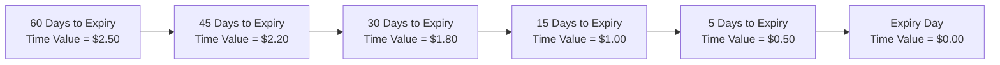

## 7.4 Time Value

Ah, time value. This little piece of an option’s premium has, in my opinion, always felt like the “beating heart” behind options trading. It whispers about the future, hints at potential profits (or losses), and can keep you up at night wondering if your option still has the juice to make a move before expiration.  

Anyway, let’s take a friendly but in-depth journey into the concept of time value and how it shapes an option’s overall price.

---

### Setting the Stage: Definitions and Context

Time value, often called “extrinsic value,” is basically the portion of an option’s market price that exceeds its intrinsic value. Recall:  
• Intrinsic value (for a call) = max(0, Current Underlying Price – Strike Price).  
• Intrinsic value (for a put) = max(0, Strike Price – Current Underlying Price).  

If you grab a quote for an equity option and see a total premium of $2.00 per share, but the option’s intrinsic value is only $1.50, the extra $0.50 is the time value component.  

Now, why does this extra $0.50 exist? It stems from the chance—some might say “hope” or “probability”—that the option will continue to move in your favor before expiration. The more time you have, the more potential there is for underlying price changes, which are good or bad depending on your position.  

For instance, if you buy a three-month call option on a stock, you’ll likely pay more premium than for a one-month call on the same stock, all else being equal. More time = more possible movement (volatility) = higher time value.

---

### Time Value’s Relationship with Volatility

Time value doesn’t just reflect the time remaining on the clock—it also factors in how likely it is that price changes in the underlying will result in intrinsic value. Volatility, in a sense, is a measure of the underlying’s willingness to “dance around” a certain price. Higher volatility leads to a greater probability that the option will intrude on better payoff territory, so the resulting time value is typically higher.

• If the market perceives that stock ABC is calm, with minimal day-to-day moves, the time value for an option might be lower.  
• If stock ABC’s price chart resembles a roller coaster with sharp climbs and drops, the time value might be significantly higher.  

In practice, if you track implied volatility (IV) in real time and watch the premium, you’ll notice that when implied volatility spikes, so does time value—even if the underlying price hasn’t changed.

---

### The Gradual (and Then Not-So-Gradual) Decay: Theta in Action

Every day, your option is racing toward its expiration. This time-to-expiration has a Greek letter to represent it: Theta (Θ). Theta measures how much an option’s value is expected to drop, theoretically, for each one-day decrease in time to expiration, assuming all other factors remain constant.

• At the start of its life, an option might decline in time value at a slower rate.  
• As it nears expiration, the pace of decay speeds up.  

The typical shape of time decay (often illustrated in option “decay graphs”) starts fairly gentle and becomes steeper as expiration looms. If you’ve ever held an out-of-the-money (OTM) call into the final week, you probably know that “Uh-oh” feeling as the premium shrinks day by day.

Below is a simple Mermaid.js diagram illustrating how time value decays at an increasing rate as expiration approaches:

In practice, if you sold an option, this time decay is your friend. If you bought an option, it’s a bit of a foe. That’s why many professional traders gravitate toward option-selling strategies, especially if they anticipate that the underlying won’t move dramatically.

---

### At-the-Money and Time Value’s Apex

When an option is at-the-money (ATM), the intrinsic value is zero. For instance, a call with a strike of $50 when the underlying is exactly at $50 has no intrinsic value. Yet the option might still trade at, say, $2.15. That entire $2.15 is extrinsic/time value. In other words, with the strike pinned at the underlying price, the whole premium reflects the market’s view of the potential for the underlying to move in a beneficial direction.  

For an at-the-money option, time value typically peaks. As you move deeper in-the-money (ITM) or deeper out-of-the-money (OTM), the time value portion generally becomes smaller. Traders who simply want a pure volatility bet (counting on a big underlying move) sometimes trade ATM options because they maximize exposure to changes in implied volatility.

---

### Real-Life Anecdote: The Surprising Jump

Let me share a quick personal story. Several years ago, I bought an out-of-the-money call on a gold mining company. We’re talking about a super-volatile stock (with a name I’ll keep anonymous) and one that often soared up or down 8-10% on a single piece of news. The premium was quite high, but I figured the stock could easily pop enough to make the calls profitable. Well, that was exactly the day the central bank made a surprise announcement about interest rates, gold markets panicked, and my mining stock soared 12%. The next morning, the implied volatility jumped, and even though I was still slightly OTM, the time value skyrocketed by about 40%. Condition changes (in this case, an IV spike) can have that effect—time value can expand or contract, just like a balloon, based on perceived future volatility.  

Was I lucky? Perhaps, but I realized that sometimes the time value portion is heavily influenced by surprising events and the market’s resulting volatility reaction.  

---

### Influencing Factors Beyond Volatility

Time value isn’t just about volatility and the ticking clock.  
• Market Sentiment: Bullish or bearish outlooks can tilt implied volatilities and spread demand for certain strikes.  
• Interest Rates: When interest rates go up, certain option pricing models can imply a slight increase in call option time value and a decrease in put option time value (all else being equal). This is partly captured in advanced models like Black–Scholes–Merton.  
• Supply and Demand: A sudden buy program for certain calls or puts might push up their time value, at least temporarily.  

---

### Canadian Regulatory Perspectives and Margin Usage

If you’re trading in Canada and affiliated with a CIRO member firm, margin guidelines take time decay into account. After all, a short option position (naked call or put) is typically subject to margin rules that reflect the potential risk over the lifespan of the option. As the time value decays, your margin usage might shift.  

Keep an eye on any bulletins (on https://www.ciro.ca) that update margin requirements. They sometimes incorporate changes in volatility or highlight new monitoring software. Also, your broker’s risk department (and yes, they definitely exist) may reevaluate margin usage based on how your short options’ time value has changed, especially if your positions are large or your underlying is particularly volatile.  

---

### Using Open-Source Tools to Track Option Decay

If you’re the sort of person who loves analysis and a do-it-yourself approach, there are plenty of open-source tools like Python’s matplotlib or Plotly. They let you:  
• Pull in live or delayed option quotes.  
• Chart how time value changes day by day.  
• Experiment with hypothetical changes in implied volatility or underlying price.  

By modeling a few “what if” scenarios, you can see how your time value might evaporate or expand. This approach, often called “scenario analysis,” is hugely beneficial to both beginner and advanced traders.  

---

### Strategy Considerations

• **Option Buyers**: You typically want to buy options when you believe that the underlying will move sufficiently in your favor to overcome time decay. You might also want higher implied volatility if you’re counting on big swings.  
• **Option Sellers**: You often benefit from faster time decay. Selling out-of-the-money options can yield steady gains if the underlying stays in a tight range. But be mindful: big moves can lead to unlimited or large potential losses if you’re unhedged.  

A big rookie mistake is ignoring time decay. I’ve seen folks buy calls, watch the underlying meander upwards, and then wonder why they’re not making money. The underlying price might be moving, but if it’s too slow, time decay is basically eroding your option premium faster than you’re gaining from the price move.  

---

### Chart: Hypothetical Time Decay of an At-the-Money Call

Here’s a simplified representation of how time value might look for a 60-day at-the-money call over time. This is not an exact scale, but it’s a conceptual figure to visually illustrate the concept:

Again, a real price chart might fluctuate, especially if volatility changes. But the overall trend is that time value decays toward zero by expiration.

---

### Practical Example

Let’s say you purchase an at-the-money call on XYZ stock, which is trading at $100. The strike is $100, and the premium you pay is $3.00, all extrinsic value. After two weeks, the stock is still at $100, with no major volatility changes. Even though two weeks have passed, your call might now only be worth $2.00. Congratulations—you just lost $1.00 in time value decay, and the stock didn’t move against you at all!  

This scenario highlights the risk of time decay for buyers. On the flip side, if you sold that call, you would have gained $1.00 over those two weeks, so long as the stock remains pinned at $100 and your margin was properly managed.

---

### Tying It All Together

Time value is more than just a number in the option premium. It’s a dynamic measure of risk, potential reward, volatility expectations, and the ticking clock. Many professional traders see time value as something you want to systematically capture (by selling options) rather than pay for. Others see it as a necessary cost (by buying options) to capitalize on runaway markets.  

No single strategy is “right” or “wrong”—it depends on your market outlook, your capital, and your risk tolerance. If you love the thrill of a potential big upside and want a strictly limited downside, you might buy calls or puts, fully aware that time decay is your enemy. If you’d rather collect option premiums in exchange for taking on potential obligations, you might focus on short option strategies that let time value decay work in your favor.  

---

### Additional Resources and References

• **CIRO** ([https://www.ciro.ca](https://www.ciro.ca)): Governing Canadian dealer firms, margin guidelines, and professional conduct.  
• **Options Industry Council (OIC)**: Provides in-depth free educational materials on options, including time value analysis and advanced strategies.  
• **Open-Source Libraries**: Python’s matplotlib or Plotly for real-time option analysis and time value decay visualization.  
• **Academic Texts**: Black–Scholes–Merton modeling. Delve deeper into how interest rates, dividends, and volatility feed into time value.  

If you’re comfortable with math and coding, you can easily set up a small project to experiment with daily time decay data. Just be mindful that real markets have all sorts of wrinkles (like events, new product announcements, macro shifts) that can alter volatility in ways your models might not predict.

Alright, I think that covers all the big pieces. Time value is a topic that can go as deep as you want—especially once you start comparing real market movements and volatility shifts. But hopefully, this provides an accessible blueprint for understanding its role in option pricing.

---

## Sample Exam Questions: Time Value in Options Trading



### Which of the following best describes “time value” in an option’s premium?

- [ ] The price an option holder pays above and beyond the stock price.
- [ ] The cost of trading multiple options in a single transaction.
- [x] The portion of the option’s value that exceeds its intrinsic value.
- [ ] The profit realized when the option expires in-the-money.

> **Explanation:** Time value (also called extrinsic value) is the premium beyond the option’s intrinsic worth.

### As expiration approaches, time value generally:

- [ ] Increases at a constant rate.
- [ ] Remains stable until the day before expiration.
- [x] Decays, often at an accelerating rate (theta decay).
- [ ] Becomes negative.

> **Explanation:** Time value gradually decays, and that rate of decay (theta) often increases as expiration nears.

### If implied volatility increases significantly before an option’s expiration, what typically happens to its time value?

- [ ] Time value decreases.
- [x] Time value increases.
- [ ] Time value disappears entirely.
- [ ] Time value remains the same.

> **Explanation:** Higher implied volatility suggests a greater probability of a substantive price move, driving time value up.

### Which Greek is primarily used to estimate the rate at which an option’s time value erodes each day?

- [ ] Delta
- [x] Theta
- [ ] Vega
- [ ] Rho

> **Explanation:** Theta measures the daily erosion of an option’s time premium, all else being equal.

### An at-the-money call option with a premium of $3 has:

- [x] $0 intrinsic value and $3 time value.
- [ ] $3 intrinsic value and $0 time value.
- [x] Potentially unlimited downside risk for the buyer.
- [ ] A fixed rate of decay over time.

> **Explanation:** If the strike equals the underlying, there is no intrinsic value, so the entire premium is extrinsic/time value. The buyer’s downside risk is the premium paid ($3), which is limited, while the seller’s potential loss is theoretically unlimited.

### All else being equal, if the underlying price remains unchanged for several weeks, how does time value impact a long option position?

- [ ] Time value increases the cost basis, improving profits.
- [x] Time value erodes the premium, resulting in a loss if the underlying doesn’t move.
- [ ] Time value stops decaying after a few weeks.
- [ ] Time value is irrelevant if the option is at-the-money.

> **Explanation:** Long option holders may watch the premium erode over time if the underlying fails to move favorably.

### Which of the following factors can drive an unexpected increase in an option’s time value?

- [ ] Decreasing implied volatility.
- [x] A drastic shift in market sentiment or a volatility spike.
- [x] New demand from buyers anticipating a major announcement.
- [ ] Lowering interest rates.

> **Explanation:** Sudden changes in market sentiment, a new wave of buyers, or a volatility spike can push up time value, while interest rate decreases can have the opposite effect on certain options.

### Why is time decay beneficial to sellers of options?

- [x] They collect the premium, and it can decay to zero by expiration.
- [ ] They avoid margin requirements.
- [ ] They do not face any risk at expiration.
- [ ] They never face losses if the market moves.

> **Explanation:** Sellers (or writers) of options profit from the decay of time value, though they absolutely can face risk if the market moves against their position.

### How might CIRO margin guidelines regard time value?

- [x] They consider potential changes in time value when setting margin requirements, especially for short options.
- [ ] They eliminate margin on option traders entirely.
- [ ] They do not incorporate time value at all.
- [ ] They only apply to foreign currency options.

> **Explanation:** Under CIRO rules, margin is risk-based and factors in the possibility of movement, including time decay for short positions.

### True or False: At expiration, the time value component of an option can be greater than zero.

- [ ] True
- [x] False

> **Explanation:** At expiration, time value is always zero. The option’s value, if any, is purely intrinsic.


